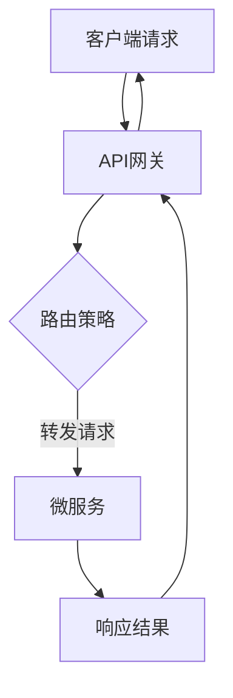

                 

关键词：API网关，服务网格，微服务，负载均衡，安全性，性能优化，流量控制

在当今的云计算和分布式系统中，API网关作为一种重要的基础设施组件，承担着连接外部客户端和内部微服务之间的桥梁作用。本文将深入探讨API网关的功能和优势，包括其核心概念、工作原理、优势特点，以及在实际应用场景中的重要性。

## 1. 背景介绍

随着互联网技术的迅猛发展，企业级应用逐渐向着分布式、模块化和微服务架构转型。微服务架构通过将应用程序拆分为多个独立、轻量级的服务，提高了系统的可扩展性和可维护性。然而，这种架构也带来了新的挑战，例如服务之间的通信、负载均衡、安全性管理和性能优化等。

API网关作为一种解决方案，旨在解决上述挑战。它不仅作为服务的统一入口，还提供了服务发现、路由、负载均衡、安全认证、数据转换等多种功能。API网关的重要性不言而喻，它成为了微服务架构中的关键组件。

## 2. 核心概念与联系

### 2.1 API网关的概念

API网关是微服务架构中的一种关键组件，它充当所有外部请求的入口点，处理请求路由、认证、授权、负载均衡等功能。

### 2.2 API网关的工作原理

API网关接收来自客户端的请求，根据路由策略将请求转发到相应的微服务。在转发过程中，API网关可以执行多种操作，如请求认证、数据转换、限流等。

### 2.3 Mermaid 流程图

下面是一个简化的API网关工作流程的Mermaid流程图：



## 3. 核心算法原理 & 具体操作步骤

### 3.1 算法原理概述

API网关的核心算法包括路由算法、负载均衡算法和限流算法等。这些算法共同决定了API网关的性能和稳定性。

### 3.2 算法步骤详解

#### 3.2.1 路由算法

路由算法根据请求的URL路径或头部信息，将请求路由到相应的微服务实例。

#### 3.2.2 负载均衡算法

负载均衡算法根据服务实例的健康状态、响应时间和请求量等指标，将请求分配到最优的服务实例上。

#### 3.2.3 限流算法

限流算法根据请求速率或请求量，限制客户端对API网关的访问频率，以防止系统过载。

### 3.3 算法优缺点

#### 3.3.1 优点

- 提高系统的可靠性：通过负载均衡和故障转移，提高系统的可用性。
- 提高系统的性能：通过缓存、数据转换和压缩等优化手段，提高系统的响应速度。
- 提高系统的安全性：通过认证、授权和日志审计等安全措施，保护系统的安全性。

#### 3.3.2 缺点

- 增加系统的复杂性：需要维护多个服务实例，管理负载均衡策略和限流策略等。
- 可能成为性能瓶颈：如果API网关的配置不当或性能不足，可能会成为系统性能的瓶颈。

### 3.4 算法应用领域

API网关广泛应用于金融、电商、物联网、社交网络等高并发、高可用性的场景。在这些场景中，API网关不仅提高了系统的性能和可靠性，还确保了系统的安全性和可维护性。

## 4. 数学模型和公式 & 详细讲解 & 举例说明

### 4.1 数学模型构建

API网关的性能模型可以基于请求处理时间和系统资源的消耗来构建。以下是一个简化的数学模型：

- 请求处理时间 = 路由时间 + 服务处理时间 + 响应时间
- 资源消耗 = CPU消耗 + 内存消耗 + 网络消耗

### 4.2 公式推导过程

假设API网关每秒处理N个请求，每个请求的处理时间为T，系统的资源消耗为R。那么，系统的性能指标可以表示为：

- 平均请求处理时间 = T * N
- 平均资源消耗 = R * N

### 4.3 案例分析与讲解

假设一个API网关每秒处理100个请求，每个请求的平均处理时间为0.1秒，系统的资源消耗为每秒1000个CPU周期。根据上述公式，我们可以计算出：

- 平均请求处理时间 = 0.1 * 100 = 10秒
- 平均资源消耗 = 1000 * 100 = 100000个CPU周期

通过优化路由算法和负载均衡策略，我们可以降低平均请求处理时间和资源消耗。例如，通过引入缓存机制，可以减少服务处理时间；通过优化网络连接，可以减少响应时间。

## 5. 项目实践：代码实例和详细解释说明

### 5.1 开发环境搭建

假设我们使用Spring Boot构建API网关，以下是一个基本的开发环境搭建步骤：

1. 安装Java开发工具包（JDK）
2. 创建Spring Boot项目
3. 添加必要的依赖项，如Spring Cloud Gateway

### 5.2 源代码详细实现

以下是一个简单的Spring Boot API网关的实现：

```java
@SpringBootApplication
@EnableDiscoveryClient
@EnableGateway
public class ApiGatewayApplication {

    public static void main(String[] args) {
        SpringApplication.run(ApiGatewayApplication.class, args);
    }

}
```

### 5.3 代码解读与分析

这个简单的API网关示例通过Spring Cloud Gateway实现了服务发现、路由和负载均衡等功能。具体实现细节可以通过阅读Spring Cloud Gateway的官方文档来深入了解。

### 5.4 运行结果展示

运行API网关后，我们可以通过访问相应的URL来测试网关的功能。例如，访问`http://localhost:8080/service-name`，API网关会根据路由策略将请求转发到相应的微服务实例。

## 6. 实际应用场景

### 6.1 金融行业

在金融行业中，API网关被广泛应用于提供API服务，例如银行账户查询、支付交易等。API网关确保了金融服务的安全性和稳定性，同时提高了系统的性能和可靠性。

### 6.2 电商行业

在电商行业中，API网关主要用于处理用户订单、商品查询、支付等请求。通过API网关，电商平台可以有效地管理不同服务之间的通信，确保用户请求得到及时响应。

### 6.3 物联网行业

在物联网行业中，API网关负责处理来自各种设备的请求，例如传感器数据采集、设备控制等。通过API网关，物联网平台可以实现对不同设备的统一管理和调度。

## 6.4 未来应用展望

随着云计算和物联网的不断发展，API网关将在更多行业和场景中得到应用。未来，API网关可能会向智能化和自动化方向发展，例如通过机器学习算法优化路由策略和负载均衡策略，提高系统的性能和可靠性。

## 7. 工具和资源推荐

### 7.1 学习资源推荐

- 《API网关技术实践》
- 《Spring Cloud Gateway实战》
- 《微服务架构设计与实践》

### 7.2 开发工具推荐

- Spring Boot
- Spring Cloud Gateway
- Nginx

### 7.3 相关论文推荐

- "API Gateway Design Patterns and Architecture"
- "Performance Optimization of API Gateways in Microservices Architectures"

## 8. 总结：未来发展趋势与挑战

### 8.1 研究成果总结

本文通过对API网关的功能和优势的深入分析，揭示了API网关在微服务架构中的重要地位。研究成果表明，API网关不仅提高了系统的性能和可靠性，还确保了系统的安全性和可维护性。

### 8.2 未来发展趋势

未来，API网关可能会向智能化和自动化方向发展，通过引入机器学习算法和自动化管理工具，进一步提高系统的性能和可靠性。

### 8.3 面临的挑战

然而，API网关也面临着一些挑战，例如系统复杂性的增加、性能瓶颈的出现等。如何优化API网关的设计和实现，提高其性能和稳定性，是未来需要重点关注的问题。

### 8.4 研究展望

未来，API网关的研究将朝着更加智能化、自动化和高效化的方向发展。通过不断探索和创新，API网关有望在更多领域和场景中发挥更大的作用。

## 9. 附录：常见问题与解答

### 9.1 什么是API网关？

API网关是微服务架构中的一种基础设施组件，负责处理外部请求的统一入口，提供路由、认证、授权、负载均衡等功能。

### 9.2 API网关有哪些优势？

API网关的优势包括提高系统的性能和可靠性、确保系统的安全性和可维护性、降低服务之间的通信复杂度等。

### 9.3 API网关和Nginx有什么区别？

API网关和Nginx都是常用的服务器组件，但它们的应用场景和功能有所不同。API网关主要作为微服务架构中的统一入口，提供路由、认证、授权等功能；而Nginx主要用于反向代理和负载均衡。

### 9.4 如何优化API网关的性能？

优化API网关的性能可以从以下几个方面入手：优化路由算法、引入缓存机制、减少中间件的使用、提高网络带宽等。

----------------------------------------------------------------

以上是关于“API 网关的功能和优势”的完整文章内容。希望这篇文章对您在理解和应用API网关方面有所帮助。作者：禅与计算机程序设计艺术 / Zen and the Art of Computer Programming。

