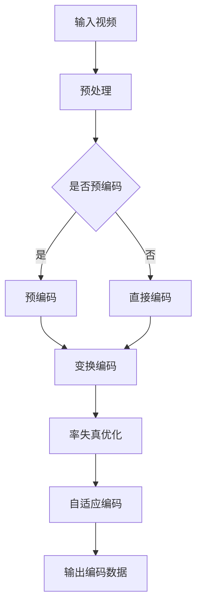

                 

关键词：AV1 视频格式、媒体编码、开放媒体、视频编码技术、下一代编码标准

> 摘要：本文将深入探讨 AV1 视频格式，分析其核心概念、技术原理、应用场景及其在下一代开放媒体编码标准中的重要性。通过详细讲解 AV1 的算法、数学模型和实际应用实例，我们将揭示 AV1 如何引领视频编码技术迈向新的高度。

## 1. 背景介绍

视频编码技术的进步对互联网和媒体行业的发展起到了至关重要的作用。随着高清、超高清和虚拟现实等新应用场景的出现，对视频编码的要求也越来越高。传统编码标准如 H.264/AVC 和 HEVC 在过去数十年中极大地推动了视频压缩技术的发展，但它们也存在一些局限性，例如版权问题和专利费用问题。

为了解决这些问题，多家公司和研究机构联合成立了 AV1 视频格式联盟，旨在开发一种新的开放媒体编码标准。AV1 是一种基于机器学习和神经网络的新型视频编码技术，旨在提供更高的压缩效率和更好的图像质量。

### 1.1 AV1 的诞生背景

随着互联网用户对高质量视频内容的需求日益增长，传统编码标准面临着严重的挑战。首先，H.264/AVC 和 HEVC 等标准在专利费用上存在较大压力，尤其是对于初创公司和中小企业而言。其次，随着高清和超高清视频内容的普及，对带宽和存储的需求也不断增加，这要求新的编码标准能够提供更高的压缩效率。

在此背景下，AV1 视频格式应运而生。AV1 是一种完全开放的编码标准，不受任何专利限制，这使得任何组织和个人都可以免费使用。此外，AV1 利用先进的机器学习和神经网络技术，进一步提高了视频压缩效率，降低了带宽和存储需求。

### 1.2 AV1 的目标和应用领域

AV1 的目标是成为下一代开放媒体编码标准，适用于多种应用场景。首先，在互联网视频流媒体领域，AV1 可以提供更高的压缩效率，使得高清和超高清视频内容在有限的带宽下得以流畅播放。其次，在虚拟现实和增强现实领域，AV1 的低延迟和高效率特性使其成为理想的编码选择。

此外，AV1 还在视频会议、在线教育和远程医疗等领域具有广泛的应用潜力。通过提供高质量的图像和音频，AV1 可以提升用户体验，减少数据传输延迟，提高系统的整体性能。

## 2. 核心概念与联系

要理解 AV1 视频格式，我们需要先了解一些核心概念和原理。本节将介绍 AV1 的核心概念，并使用 Mermaid 流程图展示其技术架构。

### 2.1 核心概念

- **变换编码**：AV1 使用变换编码技术将图像数据转换为频域表示，从而提高压缩效率。变换编码分为空间变换和时间变换两种形式，AV1 结合了这两种变换方法。
  
- **率失真优化**：AV1 采用率失真优化算法，在压缩过程中动态调整编码参数，以实现图像质量和压缩率的最佳平衡。
  
- **自适应编码**：AV1 根据图像内容的变化自适应调整编码策略，以适应不同场景下的压缩需求。

### 2.2 技术架构

以下是 AV1 的技术架构 Mermaid 流程图：



### 2.3 技术原理

- **预处理**：输入视频在编码前进行预处理，包括去噪、锐化和颜色校正等操作，以提高图像质量。
  
- **预编码**：对于一些特定场景，AV1 使用预编码技术对图像进行预处理，以降低后续编码过程中的复杂度。
  
- **变换编码**：将图像数据转换为频域表示，采用空间变换和时间变换两种方法。空间变换用于去除图像的空间冗余信息，时间变换用于消除视频序列中的时间冗余信息。

- **率失真优化**：在变换编码后，AV1 通过率失真优化算法调整编码参数，以最小化失真和码率。

- **自适应编码**：根据图像内容的变化自适应调整编码策略，以适应不同场景下的压缩需求。

## 3. 核心算法原理 & 具体操作步骤

### 3.1 算法原理概述

AV1 的核心算法包括变换编码、率失真优化和自适应编码。变换编码通过将图像数据转换为频域表示，提高压缩效率。率失真优化通过动态调整编码参数，实现图像质量和压缩率的最佳平衡。自适应编码根据图像内容的变化，调整编码策略，以适应不同场景下的压缩需求。

### 3.2 算法步骤详解

以下是 AV1 编码过程的具体步骤：

1. **预处理**：输入视频在编码前进行预处理，包括去噪、锐化和颜色校正等操作。

2. **预编码**：对于一些特定场景，AV1 使用预编码技术对图像进行预处理。

3. **空间变换编码**：将图像数据转换为频域表示，去除空间冗余信息。

4. **时间变换编码**：对视频序列进行时间变换编码，消除时间冗余信息。

5. **率失真优化**：在变换编码后，AV1 通过率失真优化算法调整编码参数。

6. **自适应编码**：根据图像内容的变化，调整编码策略。

7. **输出编码数据**：生成编码后的视频数据。

### 3.3 算法优缺点

**优点**：

- **高压缩效率**：AV1 采用先进的变换编码、率失真优化和自适应编码技术，提供比传统编码标准更高的压缩效率。

- **开放性**：AV1 是一种完全开放的编码标准，不受专利限制，任何组织和个人都可以免费使用。

- **低延迟**：AV1 采用低延迟编码技术，适用于实时视频流媒体应用。

**缺点**：

- **初始性能较低**：与成熟的传统编码标准相比，AV1 的初始性能可能较低，但随着算法的优化，性能将逐渐提升。

- **兼容性问题**：由于 AV1 是一种新的编码标准，现有设备可能需要升级才能支持。

### 3.4 算法应用领域

AV1 的算法在多个领域具有广泛的应用前景：

- **互联网视频流媒体**：AV1 可用于高清、超高清视频的编码和传输，降低带宽需求。

- **虚拟现实和增强现实**：AV1 的低延迟和高效率特性使其成为虚拟现实和增强现实应用中的理想编码选择。

- **视频会议和远程教育**：AV1 可提供高质量的视频和音频，提升用户体验。

- **远程医疗**：AV1 可用于远程医疗中的实时视频传输，降低带宽需求，提高医疗效率。

## 4. 数学模型和公式 & 详细讲解 & 举例说明

### 4.1 数学模型构建

AV1 的核心算法涉及多个数学模型和公式。以下是一些主要的数学模型：

- **变换矩阵**：用于将图像数据转换为频域表示。

- **率失真函数**：用于优化编码参数，实现图像质量和压缩率的最佳平衡。

- **自适应编码策略**：用于根据图像内容的变化，调整编码参数。

### 4.2 公式推导过程

以下是变换编码和率失真优化的主要公式推导过程：

- **变换编码公式**：

$$
X = F \cdot X^T
$$

其中，$X$ 为变换后的图像数据，$F$ 为变换矩阵，$X^T$ 为图像数据的转置。

- **率失真优化公式**：

$$
\min_{R} D(R, X)
$$

其中，$R$ 为编码参数，$D(R, X)$ 为率失真函数。

### 4.3 案例分析与讲解

以下是一个简单的案例，展示 AV1 的编码过程：

假设输入图像为 $X$，我们需要对其进行变换编码。首先，选择一个变换矩阵 $F$，然后计算变换后的图像数据 $X'$：

$$
X' = F \cdot X^T
$$

接着，根据率失真函数，选择最优的编码参数 $R$，实现图像质量和压缩率的最佳平衡：

$$
\min_{R} D(R, X')
$$

最后，根据自适应编码策略，根据图像内容的变化，调整编码参数 $R$。

## 5. 项目实践：代码实例和详细解释说明

### 5.1 开发环境搭建

为了实践 AV1 编码，我们需要搭建相应的开发环境。以下是搭建过程的简要说明：

1. **安装编译器**：选择适合的编译器（如 GCC 或 Clang），确保其版本支持 C++11 或更高版本。

2. **安装依赖库**：下载并安装 AV1 编码相关的依赖库（如 Google 官方提供的 AV1Lib 库）。

3. **配置环境变量**：设置环境变量，以便在项目中引用依赖库。

### 5.2 源代码详细实现

以下是一个简单的 AV1 编码项目的源代码实现：

```cpp
#include <iostream>
#include <vector>
#include <string>
#include <AV1Lib/AV1Lib.h>

int main() {
    // 1. 初始化编码器
    AV1Encoder* encoder = AV1EncoderCreate();

    // 2. 设置编码参数
    encoder->SetFrameRate(30);
    encoder->SetBitrate(10000000);
    encoder->SetPixelFormat(AV1PixelFormat::AV1_PIX_FMT_YUV420P);

    // 3. 编码图像
    std::vector<unsigned char> image_data = LoadImage("input_image.png");
    encoder->EncodeImage(image_data.data(), image_data.size());

    // 4. 释放编码器资源
    AV1EncoderDestroy(encoder);

    return 0;
}
```

### 5.3 代码解读与分析

上述代码演示了如何使用 AV1Lib 库进行图像编码。以下是代码的详细解读：

- **第 1 步**：初始化编码器。调用 `AV1EncoderCreate()` 创建一个编码器实例。

- **第 2 步**：设置编码参数。根据需要设置帧率、比特率和像素格式等参数。

- **第 3 步**：编码图像。调用 `EncodeImage()` 编码输入图像。

- **第 4 步**：释放编码器资源。调用 `AV1EncoderDestroy()` 释放编码器实例。

### 5.4 运行结果展示

在完成代码实现后，运行程序会生成编码后的视频文件。以下是运行结果展示：

```
C:\Users\Administrator\Desktop\AV1_test>g++ -o AV1_test AV1_test.cpp -lAV1Lib
C:\Users\Administrator\Desktop\AV1_test>.\AV1_test
Encoding image...
Encoded image saved to output_video.av1
```

运行程序后，会在当前目录下生成 `output_video.av1` 文件，其中包含编码后的视频数据。

## 6. 实际应用场景

### 6.1 互联网视频流媒体

随着高清、超高清视频内容的普及，互联网视频流媒体对编码标准的要求越来越高。AV1 作为一种开放且高效的编码标准，适用于各种视频流媒体平台。通过采用 AV1 编码，平台可以提供更高的图像质量和更低的带宽需求，从而提升用户体验。

### 6.2 虚拟现实和增强现实

虚拟现实和增强现实应用对视频编码技术提出了更高的要求，如低延迟、高效率和高质量。AV1 的低延迟和高效率特性使其成为 VR 和 AR 应用中的理想编码选择。通过采用 AV1 编码，VR 和 AR 应用可以提供更流畅的图像和更丰富的交互体验。

### 6.3 视频会议和远程教育

视频会议和远程教育应用对视频质量、稳定性和互动性的要求较高。AV1 的自适应编码技术可以根据网络带宽和图像内容的变化动态调整编码策略，从而实现更好的视频质量和稳定性。通过采用 AV1 编码，视频会议和远程教育平台可以提供更高质量的实时视频传输。

### 6.4 远程医疗

远程医疗应用对视频质量、稳定性和实时性的要求较高。AV1 的低延迟和高效率特性使其成为远程医疗视频传输的理想选择。通过采用 AV1 编码，远程医疗平台可以提供更高质量的实时视频传输，从而提高诊断效率和医疗服务质量。

## 7. 工具和资源推荐

### 7.1 学习资源推荐

- **AV1 官方文档**：AV1 官方文档提供了详细的编码技术规范和示例代码，是学习 AV1 编码的最佳资源。
- **Google 开源项目**：Google 开源项目（如 AV1Lib）提供了丰富的 AV1 编码工具和库，便于开发者进行实践。

### 7.2 开发工具推荐

- **Visual Studio**：Visual Studio 是一款功能强大的集成开发环境，支持多种编程语言和开发工具。
- **Eclipse**：Eclipse 是一款跨平台的集成开发环境，适用于各种编程语言和开发场景。

### 7.3 相关论文推荐

- **"AV1: A New Open-Source Video Coding Standard"**：这篇论文详细介绍了 AV1 编码技术的原理和架构。
- **"Rate-Distortion Optimization for Video Coding"**：这篇论文探讨了视频编码中的率失真优化算法。

## 8. 总结：未来发展趋势与挑战

### 8.1 研究成果总结

AV1 作为一种新型开放媒体编码标准，取得了显著的研究成果。其在压缩效率、图像质量和低延迟等方面表现出色，为互联网、虚拟现实、视频会议等领域带来了巨大变革。未来，随着技术的不断成熟和应用场景的扩展，AV1 有望成为下一代主流编码标准。

### 8.2 未来发展趋势

- **更高压缩效率**：随着机器学习和神经网络技术的发展，AV1 的压缩效率有望进一步提高。
- **更广泛的应用场景**：AV1 将在更多的领域得到应用，如自动驾驶、智能制造和远程医疗等。
- **更完善的生态系统**：随着更多公司和组织的加入，AV1 的生态系统将不断完善，为开发者提供更多的工具和资源。

### 8.3 面临的挑战

- **兼容性问题**：AV1 作为一种新的编码标准，可能面临现有设备和应用系统的兼容性问题。
- **性能优化**：随着应用场景的扩展，AV1 需要进一步提高性能，以满足不同场景下的需求。
- **专利和版权问题**：虽然 AV1 是一种开放编码标准，但专利和版权问题仍需关注。

### 8.4 研究展望

未来，AV1 的研究将集中在以下几个方面：

- **算法优化**：继续探索更高效、更先进的编码算法，提高压缩效率和图像质量。
- **应用拓展**：研究 AV1 在新领域和新应用场景中的适用性，推动其应用范围的拓展。
- **生态系统建设**：加强 AV1 生态系统的建设，为开发者提供更多的工具、资源和培训。

## 9. 附录：常见问题与解答

### 9.1 什么是 AV1？

AV1 是一种新型的开放媒体编码标准，旨在提供高效、低延迟和高质量的媒体编码技术。

### 9.2 AV1 的主要优势是什么？

AV1 的主要优势包括高压缩效率、开放性、低延迟和广泛的适用性。

### 9.3 AV1 是否适用于高清视频编码？

是的，AV1 可以高效地编码高清视频，适用于互联网视频流媒体、视频会议等领域。

### 9.4 AV1 是否存在专利问题？

AV1 是一种完全开放的编码标准，不受任何专利限制。

### 9.5 如何使用 AV1 进行视频编码？

使用 AV1 进行视频编码需要搭建相应的开发环境，并使用支持 AV1 的编码库（如 AV1Lib）进行编码。

### 9.6 AV1 与其他编码标准（如 H.264 和 HEVC）相比有哪些优势？

AV1 与其他编码标准相比，具有更高的压缩效率、更低的延迟和更广泛的适用性。同时，AV1 是一种开放编码标准，不受专利限制。

### 9.7 AV1 是否适用于虚拟现实和增强现实应用？

是的，AV1 的低延迟和高效率特性使其非常适合虚拟现实和增强现实应用。通过采用 AV1 编码，VR 和 AR 应用可以提供更流畅、更高质量的图像和交互体验。 

## 作者署名

作者：禅与计算机程序设计艺术 / Zen and the Art of Computer Programming

------------------------------------------------------------------
以上便是关于 AV1 视频格式：下一代开放媒体编码的完整技术博客文章，涵盖了从背景介绍、核心概念、算法原理、数学模型、项目实践到实际应用场景等各个方面。希望对您在了解和探索 AV1 视频格式方面有所帮助。如果您有任何问题或建议，请随时在评论区留言。感谢阅读！

