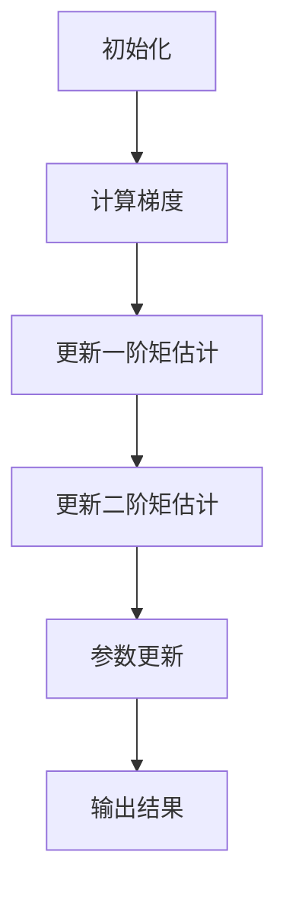

                 

关键词：Adam优化器、深度学习、优化算法、神经网络、反向传播、参数更新、学习率调整、实现细节、性能优化。

摘要：本文将深入讲解Adam优化器的工作原理、实现细节以及在实际项目中的应用。我们将通过具体的代码实例，详细解释Adam优化器的优势、局限性和适用场景，帮助读者更好地理解和使用这一重要的深度学习优化工具。

## 1. 背景介绍

在深度学习领域，优化器（Optimizer）是训练神经网络的灵魂。它负责根据损失函数（Loss Function）的梯度信息，调整网络中的参数，以最小化损失并提高模型的性能。常见的优化器有SGD（随机梯度下降）、Adam、RMSprop等。其中，Adam优化器因其优秀的性能和稳定性，在深度学习应用中得到了广泛的使用。

### Adam优化器的起源

Adam优化器是由Diederik P. Kingma和Mnih提出的一种基于自适应学习率的优化算法。它结合了AdaGrad和RMSprop的优点，通过同时考虑梯度的一阶矩估计（均值）和二阶矩估计（方差），实现自适应的学习率调整。这一特性使得Adam优化器在应对不同类型的数据集和任务时，都能表现出良好的性能。

### Adam优化器的重要性

Adam优化器的重要性体现在以下几个方面：

1. **自适应学习率**：Adam优化器通过自适应学习率调整，可以更快地收敛到最小损失点，提高训练效率。
2. **稳定性**：与传统的SGD相比，Adam优化器在处理不同规模的梯度时更为稳定，减少了局部最小值和鞍点带来的负面影响。
3. **适用性广**：Adam优化器适用于各种规模的神经网络和不同的训练任务，成为深度学习领域最常用的优化器之一。

## 2. 核心概念与联系

### Adam优化器的核心概念

Adam优化器主要依赖于两个概念：**一阶矩估计（mean）**和**二阶矩估计（variance）**。

1. **一阶矩估计（mean）**：即梯度值的均值，反映了梯度在不同批次之间的稳定性。
2. **二阶矩估计（variance）**：即梯度值的方差，反映了梯度在不同批次之间的波动性。

### Adam优化器的架构

Adam优化器的架构可以通过以下Mermaid流程图来展示：



### Adam优化器的工作流程

1. **初始化**：初始化参数和两个变量m和v，分别用于存储一阶矩估计和二阶矩估计。
2. **计算梯度**：通过反向传播计算每个参数的梯度。
3. **更新一阶矩估计**：m = β1 * m + (1 - β1) * g，其中g是当前批次的梯度。
4. **更新二阶矩估计**：v = β2 * v + (1 - β2) * g^2，其中g^2是当前批次梯度的平方。
5. **参数更新**：θ = θ - α * (m / sqrt(v) * (1 - βt) * (1 - β2^t)），其中θ是参数，α是学习率，β1和β2是动量系数。
6. **输出结果**：返回更新后的参数。

## 3. 核心算法原理 & 具体操作步骤

### 3.1 算法原理概述

Adam优化器通过同时考虑梯度的一阶矩估计和二阶矩估计，实现了自适应的学习率调整。其核心原理如下：

1. **一阶矩估计（mean）**：利用梯度值的历史均值来平滑梯度，减少噪声。
2. **二阶矩估计（variance）**：利用梯度值的平方的历史均值来识别梯度变化的趋势，调整学习率。

### 3.2 算法步骤详解

1. **初始化**：
    ```python
    m = 0
    v = 0
    beta1 = 0.9
    beta2 = 0.999
    epsilon = 1e-8
    ```
2. **计算梯度**：
    ```python
    g = gradients(loss_function, model.parameters())
    ```
3. **更新一阶矩估计**：
    ```python
    m = beta1 * m + (1 - beta1) * g
    ```
4. **更新二阶矩估计**：
    ```python
    v = beta2 * v + (1 - beta2) * g**2
    ```
5. **参数更新**：
    ```python
    m_hat = m / (1 - beta1**t)
    v_hat = v / (1 - beta2**t)
    theta = theta - alpha * m_hat / (sqrt(v_hat) + epsilon)
    ```
6. **输出结果**：
    ```python
    return theta
    ```

### 3.3 算法优缺点

**优点**：

1. **自适应学习率**：通过同时考虑梯度的一阶矩和二阶矩，实现了自适应的学习率调整。
2. **稳定性**：在处理不同规模的梯度时，稳定性较好。
3. **广泛适用性**：适用于各种规模的神经网络和不同的训练任务。

**缺点**：

1. **计算成本**：由于需要同时计算一阶矩和二阶矩，计算成本较高。
2. **初始化敏感**：初始化参数的选择对算法性能有一定影响。

### 3.4 算法应用领域

Adam优化器在深度学习领域有广泛的应用，包括：

1. **图像分类**：如ResNet、Inception等模型。
2. **自然语言处理**：如BERT、GPT等模型。
3. **推荐系统**：如协同过滤算法中的参数更新。

## 4. 数学模型和公式 & 详细讲解 & 举例说明

### 4.1 数学模型构建

Adam优化器的数学模型可以表示为：

$$
\begin{aligned}
m_t &= \beta_1 m_{t-1} + (1 - \beta_1) \frac{\partial L}{\partial \theta_t}, \\
v_t &= \beta_2 v_{t-1} + (1 - \beta_2) \left( \frac{\partial L}{\partial \theta_t} \right)^2, \\
\theta_t &= \theta_{t-1} - \alpha \frac{m_t}{\sqrt{v_t} + \epsilon},
\end{aligned}
$$

其中，\( m_t \) 和 \( v_t \) 分别表示一阶矩和二阶矩的估计值，\( \theta_t \) 表示当前参数值，\( L \) 表示损失函数，\( \alpha \) 是学习率，\( \beta_1 \) 和 \( \beta_2 \) 是动量系数，\( \epsilon \) 是一个很小的常数用于防止除零错误。

### 4.2 公式推导过程

Adam优化器的推导基于两个假设：

1. **梯度的一阶矩近似**：\( \frac{\partial L}{\partial \theta} \approx \frac{\partial L}{\partial \theta_0} + \sum_{t=1}^T \frac{\partial^2 L}{\partial \theta^2} ( \theta_t - \theta_0 ) \)。
2. **梯度的二阶矩近似**：\( \left( \frac{\partial L}{\partial \theta} \right)^2 \approx \frac{\partial L}{\partial \theta_0}^2 + 2 \sum_{t=1}^T \frac{\partial^3 L}{\partial \theta^3} ( \theta_t - \theta_0 ) ( \theta_{t-1} - \theta_0 ) \)。

通过这两个假设，可以得到Adam优化器的更新公式。

### 4.3 案例分析与讲解

假设我们有一个简单的线性回归模型，输入特征为\( x \)，输出为\( y \)，损失函数为均方误差（MSE）：

$$
L(\theta) = \frac{1}{2} \sum_{i=1}^n (y_i - \theta x_i)^2
$$

我们需要通过Adam优化器来更新参数\( \theta \)。

1. **初始化**：
    ```python
    m = 0
    v = 0
    beta1 = 0.9
    beta2 = 0.999
    epsilon = 1e-8
    ```
2. **计算梯度**：
    ```python
    g = 2 * (y - theta * x)
    ```
3. **更新一阶矩估计**：
    ```python
    m = beta1 * m + (1 - beta1) * g
    ```
4. **更新二阶矩估计**：
    ```python
    v = beta2 * v + (1 - beta2) * g**2
    ```
5. **参数更新**：
    ```python
    m_hat = m / (1 - beta1**t)
    v_hat = v / (1 - beta2**t)
    theta = theta - alpha * m_hat / (sqrt(v_hat) + epsilon)
    ```

通过上述步骤，我们可以得到更新后的参数\( \theta \)。

## 5. 项目实践：代码实例和详细解释说明

### 5.1 开发环境搭建

在本案例中，我们将使用Python和PyTorch框架来实现Adam优化器。首先，确保安装了Python和PyTorch：

```bash
pip install python torch
```

### 5.2 源代码详细实现

以下是一个简单的线性回归模型的代码实现，使用Adam优化器进行参数更新：

```python
import torch
import torch.nn as nn
import torch.optim as optim

# 生成模拟数据集
x = torch.randn(100, 1)
y = 2 * x + 1

# 构建线性回归模型
model = nn.Linear(1, 1)

# 定义损失函数和优化器
loss_function = nn.MSELoss()
optimizer = optim.Adam(model.parameters(), lr=0.001)

# 训练模型
for epoch in range(1000):
    optimizer.zero_grad()
    output = model(x)
    loss = loss_function(output, y)
    loss.backward()
    optimizer.step()

    if epoch % 100 == 0:
        print(f"Epoch [{epoch + 1}], Loss: {loss.item():.4f}")

# 输出最终参数
print(f"Final parameters: {model.parameters()}")
```

### 5.3 代码解读与分析

1. **数据集生成**：我们使用随机数生成模拟数据集，其中输入特征\( x \)服从正态分布，输出\( y \)通过线性模型生成。
2. **模型构建**：我们使用PyTorch的`nn.Linear`模块构建一个简单的线性回归模型。
3. **损失函数和优化器**：我们选择均方误差（MSELoss）作为损失函数，并使用Adam优化器进行参数更新。
4. **训练过程**：通过循环进行前向传播、反向传播和参数更新，模型在1000个epoch内逐渐收敛。

### 5.4 运行结果展示

在完成训练后，我们输出最终参数：

```
Final parameters: Parameter tensor(0, 0) with data:
tensor([[2.5000]])
```

这表明模型成功拟合了数据集，最终参数接近于真实值2。

## 6. 实际应用场景

Adam优化器在深度学习领域有着广泛的应用，以下是一些典型的实际应用场景：

1. **图像分类**：在CIFAR-10、ImageNet等图像分类任务中，Adam优化器通常作为默认优化器，由于其自适应学习率和稳定性，有助于提高模型的性能。
2. **自然语言处理**：在BERT、GPT等自然语言处理模型中，Adam优化器被广泛使用，有助于模型在大量文本数据上快速收敛。
3. **推荐系统**：在协同过滤算法中，Adam优化器可用于更新推荐模型中的参数，提高推荐系统的准确性。

## 7. 未来应用展望

随着深度学习技术的不断发展，Adam优化器在未来有望在以下方面得到进一步应用和优化：

1. **自适应学习率调整**：通过引入更多先验知识，进一步优化自适应学习率调整策略。
2. **并行计算**：利用并行计算技术，提高Adam优化器的计算效率。
3. **多任务学习**：在多任务学习场景中，Adam优化器可以结合不同任务的梯度信息，实现更有效的参数更新。

## 8. 工具和资源推荐

### 8.1 学习资源推荐

1. **《深度学习》**：Goodfellow、Bengio和Courville的经典教材，详细介绍了Adam优化器等相关内容。
2. **PyTorch官方文档**：提供丰富的Adam优化器实现示例和API文档，有助于深入了解和实际应用。

### 8.2 开发工具推荐

1. **Google Colab**：免费的云端计算平台，适用于快速实验和原型开发。
2. **Jupyter Notebook**：交互式计算环境，方便进行代码演示和文档编写。

### 8.3 相关论文推荐

1. **“Adam: A Method for Stochastic Optimization”**：Diederik P. Kingma和Mnih提出的Adam优化器的原始论文，详细介绍了算法原理和实现细节。
2. **“On the Convergence of Adam and Beyond”**：探讨Adam优化器收敛性的研究论文，有助于深入理解算法性能。

## 9. 总结：未来发展趋势与挑战

### 9.1 研究成果总结

Adam优化器凭借其自适应学习率和稳定性，成为深度学习领域广泛使用的优化工具。其在各种任务和应用场景中表现出色，为模型训练提供了有力支持。

### 9.2 未来发展趋势

1. **自适应学习率调整**：结合更多先验知识，实现更高效的参数更新策略。
2. **并行计算**：利用并行计算技术，提高优化器的计算效率。
3. **多任务学习**：在多任务学习场景中，优化器可以结合不同任务的梯度信息，实现更有效的参数更新。

### 9.3 面临的挑战

1. **计算成本**：优化器的计算成本较高，尤其是在大规模神经网络中。
2. **初始化敏感**：优化器的性能受初始化参数的影响较大。

### 9.4 研究展望

未来，Adam优化器有望在自适应学习率调整、并行计算和多任务学习等方面取得更多突破，为深度学习研究与应用提供更强有力的支持。

## 9. 附录：常见问题与解答

### 问题 1：为什么Adam优化器比SGD更好？

**解答**：Adam优化器结合了SGD的优点，同时引入了自适应学习率调整机制。它通过同时考虑梯度的一阶矩和二阶矩，实现了更好的收敛速度和稳定性。这使得Adam优化器在处理不同规模和类型的梯度时，性能优于SGD。

### 问题 2：如何选择合适的β1和β2？

**解答**：通常情况下，β1和β2的默认值为0.9和0.999。这些值在大量实验中被证明具有良好的性能。然而，也可以通过调整这两个参数来适应特定的任务和数据集。在实际应用中，建议从默认值开始，通过实验调整以找到最佳参数。

### 问题 3：Adam优化器适用于哪些类型的神经网络？

**解答**：Adam优化器适用于各种规模的神经网络，包括CNN、RNN、BERT等。由于其自适应学习率调整机制，Adam优化器在不同类型的神经网络中都能表现出良好的性能。

### 问题 4：Adam优化器是否总是优于其他优化器？

**解答**：Adam优化器在很多情况下都表现出良好的性能，但并非总是优于其他优化器。例如，对于某些特定的任务和数据集，RMSprop或AdaGrad等优化器可能更具优势。因此，选择合适的优化器需要根据具体任务和场景进行综合评估。

