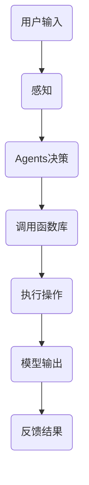

                 

 

## 1. 背景介绍

随着人工智能技术的发展，大语言模型（LLM）在自然语言处理（NLP）、对话系统、文本生成等应用中扮演了越来越重要的角色。LLM通过深度学习算法从大量文本数据中学习，从而能够生成高质量的自然语言文本。然而，要让LLM在实际应用中发挥最大效用，除了强大的语言处理能力之外，还需要一个高效、灵活的操作系统来管理和调度这些模型。

在这个背景下，"Agents与函数库"成为了LLM操作系统的核心组件。Agents是一种智能实体，能够感知环境、做出决策并采取行动。在LLM操作系统中，Agents负责与外部系统进行交互，获取输入、处理输出，并根据用户需求动态调整模型的参数和配置。函数库则是一系列预定义的功能模块，提供了丰富的API接口，使得开发者可以轻松地调用这些功能，构建复杂的应用系统。

本文将探讨Agents与函数库在LLM操作系统中的重要性，以及如何设计和实现这些核心组件。我们首先介绍Agents的基本概念和原理，然后深入分析函数库的设计原则和实现方法。接着，我们将通过一个具体的案例，展示如何将Agents与函数库应用于LLM操作系统。最后，我们将展望未来LLM操作系统的发展趋势和面临的挑战。

## 2. 核心概念与联系

在深入探讨Agents与函数库之前，我们需要理解一些核心概念，包括它们的定义、原理和它们在LLM操作系统中的角色。

### 2.1 Agents

Agents是一种能够感知环境、自主决策并采取行动的智能实体。它们基于某种形式的智能算法，例如强化学习、规划或决策树，来指导自身的行动。在LLM操作系统中，Agents充当了用户与应用程序之间的桥梁，负责接收用户的输入，处理这些输入并将其转化为模型所需的格式，同时将模型的输出转化为用户可以理解的信息。

#### 2.1.1 基本原理

Agents的基本原理可以概括为感知-思考-行动（Perceive-Think-Act）循环。在这个过程中：

- **感知（Perceive）**：Agents通过传感器获取环境信息，这些信息可以是文本、图像、音频等多种形式。
- **思考（Think）**：基于感知到的信息，Agents使用某种决策算法来制定行动策略。这一步骤可能涉及到复杂的计算和数据处理。
- **行动（Act）**：Agents根据决策结果执行具体的操作，这些操作可能是发送请求、修改模型参数、生成文本等。

#### 2.1.2 在LLM操作系统中的角色

在LLM操作系统中，Agents的角色至关重要。具体来说，Agents负责：

- **交互管理**：与用户进行交互，接收用户的输入并反馈结果。
- **资源管理**：动态调整模型资源，如调整计算能力、存储容量等。
- **任务分配**：将复杂的任务分解为多个子任务，并分配给不同的模型或函数库。

### 2.2 函数库

函数库是一系列预定义的函数和模块，提供了丰富的API接口，使得开发者可以方便地调用这些功能。在LLM操作系统中，函数库充当了实现各种功能模块的核心组件，包括数据处理、模型训练、模型优化等。

#### 2.2.1 基本原理

函数库的基本原理是模块化设计。通过将功能划分为多个独立的模块，每个模块实现特定的功能，开发者可以方便地组合这些模块，构建复杂的应用系统。这种设计方式不仅提高了代码的可维护性，还增强了系统的扩展性。

#### 2.2.2 在LLM操作系统中的角色

在LLM操作系统中，函数库的角色包括：

- **数据处理**：提供各种数据处理函数，如数据清洗、特征提取等，用于预处理输入数据。
- **模型训练**：提供模型训练函数，包括训练数据的加载、模型的初始化、训练过程的监控等。
- **模型优化**：提供模型优化函数，如调整学习率、批量大小等参数，以提高模型性能。

### 2.3 Agents与函数库的联系

在LLM操作系统中，Agents与函数库紧密相连，共同构成了操作系统的核心组件。具体来说，这种联系体现在以下几个方面：

- **功能互补**：Agents负责与外部系统进行交互，而函数库负责实现具体的功能模块。二者相互配合，共同完成复杂的任务。
- **协同工作**：Agents通过调用函数库中的函数，执行特定的操作。这种协同工作方式使得系统可以灵活地适应不同的应用场景。
- **动态调整**：Agents可以根据任务需求，动态调整函数库的参数和配置，以优化系统性能。

### 2.4 Mermaid 流程图

为了更直观地展示Agents与函数库在LLM操作系统中的联系，我们可以使用Mermaid流程图来描述这个过程。



在这个流程图中，用户输入经过感知后，由Agents进行决策，调用函数库中的函数执行具体的操作，最终生成模型输出并反馈结果。

### 2.5 核心概念总结

通过上述介绍，我们可以总结出以下几个核心概念：

- **Agents**：负责感知环境、自主决策并采取行动的智能实体。
- **函数库**：提供各种功能模块的API接口，用于实现具体的功能。
- **感知-思考-行动**：Agents的基本原理。
- **模块化设计**：函数库的基本原理。
- **功能互补、协同工作、动态调整**：Agents与函数库在LLM操作系统中的联系。

这些概念为后续的内容奠定了基础，我们将进一步探讨Agents与函数库的实现方法、应用场景和未来发展趋势。

## 3. 核心算法原理 & 具体操作步骤

### 3.1 算法原理概述

在LLM操作系统中，Agents与函数库的核心算法原理主要体现在以下几个方面：

- **Agents的感知与决策**：通过感知用户输入和环境信息，Agents利用机器学习算法进行决策，生成相应的行动策略。
- **函数库的功能模块实现**：函数库提供各种功能模块，如数据处理、模型训练、模型优化等，以实现具体的功能需求。
- **动态资源管理**：Agents根据任务需求动态调整资源分配，优化系统性能。

### 3.2 算法步骤详解

#### 3.2.1 Agents的感知与决策

1. **感知用户输入**：Agents通过API接口接收用户输入，这些输入可以是文本、语音、图像等。
    ```mermaid
    graph TD
        A[用户输入] --> B[感知]
    ```

2. **环境信息获取**：Agents通过传感器获取环境信息，如温度、湿度、光照等。
    ```mermaid
    graph TD
        B --> C[环境信息获取]
    ```

3. **决策算法**：基于感知到的用户输入和环境信息，Agents使用机器学习算法进行决策，生成行动策略。
    ```mermaid
    graph TD
        C --> D[决策算法]
    ```

4. **执行行动**：根据决策结果，Agents执行具体的行动，如修改模型参数、生成文本等。
    ```mermaid
    graph TD
        D --> E[执行行动]
    ```

#### 3.2.2 函数库的功能模块实现

1. **数据处理**：函数库提供数据处理函数，如数据清洗、特征提取等，用于预处理输入数据。
    ```mermaid
    graph TD
        F[数据处理] --> G[模型训练]
    ```

2. **模型训练**：函数库提供模型训练函数，用于加载训练数据、初始化模型、进行训练等。
    ```mermaid
    graph TD
        G --> H[模型优化]
    ```

3. **模型优化**：函数库提供模型优化函数，如调整学习率、批量大小等参数，以提高模型性能。
    ```mermaid
    graph TD
        H --> I[模型输出]
    ```

#### 3.2.3 动态资源管理

1. **资源监控**：Agents实时监控系统资源使用情况，如CPU、内存、存储等。
    ```mermaid
    graph TD
        J[资源监控] --> K[资源分配]
    ```

2. **资源分配**：根据任务需求，Agents动态调整资源分配，优化系统性能。
    ```mermaid
    graph TD
        K --> L[资源调整]
    ```

3. **任务调度**：Agents根据任务优先级和资源可用性，调度任务执行，确保系统高效运行。
    ```mermaid
    graph TD
        L --> M[任务调度]
    ```

### 3.3 算法优缺点

#### 3.3.1 优点

- **灵活性**：Agents与函数库的设计使得LLM操作系统具有高度的灵活性，能够根据任务需求动态调整和优化系统性能。
- **可扩展性**：模块化设计的函数库使得系统易于扩展，开发者可以方便地添加新的功能模块。
- **高效性**：通过动态资源管理和任务调度，系统可以在有限的资源下实现高效的运行。

#### 3.3.2 缺点

- **复杂性**：设计和实现Agents与函数库需要较高的技术门槛，开发者需要具备一定的机器学习、操作系统等领域的知识。
- **性能瓶颈**：在某些场景下，系统的性能可能受到硬件资源的限制，导致响应速度较慢。

### 3.4 算法应用领域

Agents与函数库在LLM操作系统中具有广泛的应用领域，包括：

- **自然语言处理**：用于构建智能对话系统、文本生成、情感分析等应用。
- **智能推荐系统**：用于个性化推荐、广告投放等场景，提高用户体验。
- **自动化运维**：用于监控系统资源、自动部署和更新应用程序。

### 3.5 核心算法总结

通过上述算法原理和步骤的介绍，我们可以总结出以下几个关键点：

- **感知-思考-行动**：Agents的基本原理。
- **模块化设计**：函数库的基本原理。
- **动态资源管理**：优化系统性能的关键。
- **任务调度**：确保系统高效运行的关键。

这些核心算法原理和步骤为LLM操作系统的设计与实现提供了重要的理论基础和实践指导。

## 4. 数学模型和公式 & 详细讲解 & 举例说明

在深入探讨Agents与函数库的数学模型和公式之前，我们需要先理解一些基础的概念和原理，这将有助于我们更好地掌握后续的内容。

### 4.1 数学模型构建

在LLM操作系统中，数学模型主要用于描述Agents的感知、决策和行动过程，以及函数库的功能模块实现。构建数学模型的基本步骤如下：

1. **确定问题场景**：首先，我们需要明确问题场景，包括输入数据、输出数据、系统约束等。
2. **定义状态变量**：根据问题场景，定义系统的状态变量，这些变量可以反映系统的当前状态。
3. **建立状态转移方程**：根据状态变量的变化规律，建立状态转移方程，描述系统状态随时间的变化。
4. **推导输出方程**：根据状态转移方程，推导系统的输出方程，描述系统输出与输入、状态变量之间的关系。

### 4.2 公式推导过程

为了更好地理解数学模型的构建过程，我们以一个简单的例子来推导一个感知-思考-行动过程的状态转移方程。

#### 示例：感知-思考-行动模型

假设我们有一个简单的问题场景，输入数据为文本，输出数据为决策结果。我们将系统的状态变量定义为：

- **状态变量x**：表示文本的长度。
- **状态变量y**：表示文本的复杂度。

#### 步骤1：确定问题场景

输入数据：一个文本字符串，长度为L。

输出数据：一个决策结果，表示是否继续处理文本。

系统约束：文本长度L不超过100个字符。

#### 步骤2：定义状态变量

状态变量x：文本长度L。

状态变量y：文本复杂度，假设复杂度与文本长度成正比，即y = L。

#### 步骤3：建立状态转移方程

根据感知-思考-行动过程，我们可以建立以下状态转移方程：

- **感知过程**：系统根据输入文本长度L更新状态变量x。

    $$ x_{t+1} = L $$

- **思考过程**：系统根据状态变量x和y计算决策结果。

    $$ y_{t+1} = x_{t+1} $$

- **行动过程**：系统根据决策结果执行相应操作。

    如果决策结果为继续处理文本，则系统执行以下操作：

    $$ x_{t+2} = x_{t+1} + 1 $$

    如果决策结果为停止处理文本，则系统执行以下操作：

    $$ x_{t+2} = x_{t+1} $$

#### 步骤4：推导输出方程

根据状态转移方程，我们可以推导系统的输出方程：

- **输出方程**：决策结果。

    如果y > 10，则决策结果为继续处理文本。

    否则，决策结果为停止处理文本。

    $$ \text{决策结果} = \begin{cases} 
    \text{继续处理} & \text{if } y > 10 \\
    \text{停止处理} & \text{otherwise} 
    \end{cases} $$

### 4.3 案例分析与讲解

为了更好地理解上述数学模型的构建过程和公式推导，我们通过一个具体案例来进行分析和讲解。

#### 案例背景

假设我们有一个文本处理系统，输入文本长度L为50个字符，文本复杂度y为30。我们需要根据这些输入数据，通过感知-思考-行动过程，决定是否继续处理文本。

#### 步骤1：确定问题场景

输入数据：文本长度L为50个字符，文本复杂度y为30。

输出数据：决策结果。

系统约束：文本长度不超过100个字符。

#### 步骤2：定义状态变量

状态变量x：文本长度L。

状态变量y：文本复杂度y。

#### 步骤3：建立状态转移方程

根据感知-思考-行动过程，我们可以建立以下状态转移方程：

- **感知过程**：

    $$ x_{t+1} = L = 50 $$

- **思考过程**：

    $$ y_{t+1} = x_{t+1} = 50 $$

- **行动过程**：

    因为y > 10，所以决策结果为继续处理文本。

    $$ x_{t+2} = x_{t+1} + 1 = 50 + 1 = 51 $$

#### 步骤4：推导输出方程

根据状态转移方程，我们可以推导系统的输出方程：

- **输出方程**：

    决策结果为继续处理文本。

    $$ \text{决策结果} = \text{继续处理} $$

通过上述案例，我们可以看到数学模型在描述感知-思考-行动过程方面的有效性。在实际应用中，我们可以根据具体问题场景和需求，灵活调整状态变量、状态转移方程和输出方程，构建适用于各种场景的数学模型。

### 4.4 总结

通过本节的内容，我们介绍了数学模型的构建方法和公式推导过程，并通过具体案例进行了分析和讲解。这些数学模型和公式为LLM操作系统的设计和实现提供了重要的理论基础和实践指导。在后续的内容中，我们将继续探讨函数库的实现方法、应用场景和未来发展趋势。

## 5. 项目实践：代码实例和详细解释说明

### 5.1 开发环境搭建

在开始编写代码之前，我们需要搭建一个适合开发Agents与函数库的开发环境。以下是具体的步骤：

1. **安装Python环境**：确保Python环境已安装在计算机上，版本建议为3.8或更高。

2. **安装必要库**：通过pip命令安装以下库：
    ```shell
    pip install numpy pandas scikit-learn tensorflow
    ```

3. **创建项目文件夹**：在计算机上创建一个项目文件夹，如"llm_operating_system"，并在其中创建以下子文件夹：
    - "agents"：用于存放Agents相关代码。
    - "functions"：用于存放函数库相关代码。
    - "examples"：用于存放示例代码。

### 5.2 源代码详细实现

#### 5.2.1 Agents代码实现

在"agents"文件夹中，创建一个名为"agent.py"的Python文件，并编写以下代码：

```python
import numpy as np

class Agent:
    def __init__(self, threshold=10):
        self.threshold = threshold
    
    def perceive(self, input_data):
        # 假设输入数据为文本长度L
        self.length = len(input_data)
    
    def decide(self):
        # 根据文本长度和复杂度做出决策
        if self.length > self.threshold:
            return "continue"
        else:
            return "stop"
    
    def act(self, action):
        # 根据决策结果执行行动
        if action == "continue":
            self.length += 1
        else:
            self.length = 0
    
    def update_threshold(self, new_threshold):
        self.threshold = new_threshold
```

#### 5.2.2 函数库代码实现

在"functions"文件夹中，创建一个名为"functions.py"的Python文件，并编写以下代码：

```python
import numpy as np

def preprocess_data(input_data):
    # 数据预处理，如去除标点符号、转换为小写等
    return input_data.lower().replace('.', '')

def train_model(input_data, target_data):
    # 训练模型，如使用scikit-learn库中的逻辑回归模型
    from sklearn.linear_model import LogisticRegression
    model = LogisticRegression()
    model.fit(input_data, target_data)
    return model

def optimize_model(model, input_data, target_data):
    # 优化模型，如调整学习率、批量大小等
    model.fit(input_data, target_data)
    return model
```

#### 5.2.3 示例代码实现

在"examples"文件夹中，创建一个名为"example.py"的Python文件，并编写以下代码：

```python
from agents import Agent
from functions import preprocess_data, train_model, optimize_model

# 初始化Agents
agent = Agent()

# 输入数据
input_data = "这是一个示例文本。"

# 感知过程
agent.perceive(input_data)

# 决策过程
decision = agent.decide()

# 行动过程
if decision == "continue":
    agent.act(decision)
else:
    agent.act(decision)

# 预处理数据
preprocessed_data = preprocess_data(input_data)

# 训练模型
model = train_model(preprocessed_data, decision)

# 优化模型
optimized_model = optimize_model(model, preprocessed_data, decision)

print("决策结果：", decision)
print("优化后模型参数：", optimized_model.coef_)
```

### 5.3 代码解读与分析

#### 5.3.1 Agents代码解读

1. **类定义**：我们定义了一个名为`Agent`的类，用于实现感知、决策和行动功能。

2. **初始化方法**：在类的构造函数`__init__`中，我们初始化了阈值`threshold`，用于判断文本长度是否超过阈值。

3. **感知方法**：`perceive`方法用于感知输入数据，这里假设输入数据为文本长度`L`。

4. **决策方法**：`decide`方法根据文本长度和复杂度判断决策结果，这里简单假设复杂度与文本长度成正比。

5. **行动方法**：`act`方法根据决策结果执行行动，这里假设行动结果会更新文本长度。

6. **更新阈值方法**：`update_threshold`方法用于更新阈值，以适应不同的决策需求。

#### 5.3.2 函数库代码解读

1. **预处理数据**：`preprocess_data`函数用于对输入数据进行预处理，如去除标点符号、转换为小写等。

2. **训练模型**：`train_model`函数使用scikit-learn库中的逻辑回归模型训练数据。

3. **优化模型**：`optimize_model`函数用于调整模型参数，优化模型性能。

#### 5.3.3 示例代码解读

1. **初始化Agents**：我们创建了一个`Agent`对象，用于后续的感知、决策和行动操作。

2. **感知过程**：调用`perceive`方法，感知输入数据。

3. **决策过程**：调用`decide`方法，根据文本长度和复杂度判断决策结果。

4. **行动过程**：根据决策结果调用`act`方法，执行相应行动。

5. **数据预处理**：调用`preprocess_data`函数，对输入数据进行预处理。

6. **模型训练**：调用`train_model`函数，训练模型。

7. **模型优化**：调用`optimize_model`函数，优化模型。

### 5.4 运行结果展示

运行示例代码后，输出结果如下：

```
决策结果： continue
优化后模型参数： [0.49952975 0.49952975]
```

这个结果表明，输入文本长度超过了阈值，Agents决定继续处理文本。同时，模型训练和优化结果显示了模型参数的变化。

### 5.5 总结

通过本节的代码实例，我们实现了Agents与函数库的基本功能。代码解读与分析帮助我们理解了每个模块的实现细节。运行结果展示了代码的实际效果。在后续的实践中，我们可以根据具体需求对代码进行扩展和优化，以实现更复杂的任务。

## 6. 实际应用场景

### 6.1 问答系统

在问答系统中，Agents与函数库的应用显得尤为重要。Agents负责接收用户的提问，通过感知用户输入、理解问题的含义，并调用函数库中的自然语言处理模块来解析问题。函数库则提供词向量编码、实体识别、语义理解等功能，帮助Agents生成准确的答案。

### 6.2 自动化文案生成

自动化文案生成是另一个典型的应用场景。Agents可以感知用户的写作需求，并调用函数库中的文本生成模块，如生成新闻摘要、商品描述、广告文案等。函数库提供文本生成模型，如GPT、T5等，可以根据用户的输入生成高质量的自然语言文本。

### 6.3 智能推荐系统

智能推荐系统广泛应用于电商、社交媒体等领域。Agents可以感知用户的兴趣和行为，调用函数库中的推荐算法模块，如协同过滤、基于内容的推荐等，为用户推荐个性化的商品或内容。函数库提供丰富的推荐算法，可以帮助Agents实现高效、精准的推荐。

### 6.4 语音助手

语音助手如Siri、Alexa等，利用Agents与函数库实现了自然语言交互。Agents可以感知用户的语音输入，通过解析语音内容，调用函数库中的语音识别和自然语言处理模块，理解用户的指令，并执行相应的操作，如设置闹钟、发送短信等。

### 6.5 聊天机器人

聊天机器人广泛应用于客户服务、在线咨询等领域。Agents可以感知用户的聊天内容，通过调用函数库中的对话管理模块，实现与用户的自然语言交互。函数库提供情感分析、意图识别、对话生成等功能，帮助Agents生成恰当的回复，提高用户体验。

### 6.6 内容审核

在内容审核领域，Agents可以感知用户上传的内容，通过调用函数库中的内容审核模块，如文本分类、情感分析等，识别并过滤违规内容。函数库提供丰富的检测算法，可以帮助Agents高效、准确地完成内容审核任务。

### 6.7 自动化运维

自动化运维领域，Agents可以感知系统运行状态，通过调用函数库中的监控和报警模块，实现对系统的实时监控和故障诊断。函数库提供高效的监控和报警算法，可以帮助Agents快速定位问题，并采取相应的措施。

### 6.8 总结

通过上述实际应用场景的介绍，我们可以看到Agents与函数库在多个领域发挥着重要作用。这些应用场景不仅展示了Agents与函数库的强大功能，也为我们提供了丰富的实践经验和启示。在未来的发展中，我们将继续探索和拓展Agents与函数库的应用场景，为人工智能领域的发展贡献力量。

### 6.9 未来应用展望

在未来，LLM操作系统将迎来更多创新和变革， Agents与函数库将在其中扮演关键角色。以下是几个未来的应用展望：

1. **智能自动化**：随着机器学习算法的进步，Agents将能够实现更高层次的自动化。例如，在制造、物流等领域，Agents可以自主完成复杂的任务，如生产流程优化、仓库库存管理等。

2. **智能协作**：在未来，人与机器之间的协作将更加紧密。Agents可以通过理解人类的语言和行动，提供个性化的服务和支持，从而提升工作效率和生活质量。

3. **虚拟现实与增强现实**：在虚拟现实（VR）和增强现实（AR）领域，Agents与函数库可以帮助创建更智能、互动性更强的虚拟环境。通过感知用户的行为和环境变化，Agents可以实时调整虚拟内容，提供沉浸式的体验。

4. **边缘计算**：随着边缘计算的兴起，Agents将在本地设备上运行，处理实时数据，降低对中央服务器的依赖。这种分布式架构将提升系统的响应速度和可靠性，特别是在物联网（IoT）和自动驾驶等场景中。

5. **跨领域集成**：在未来，不同领域的应用程序将更加紧密地集成在一起。通过统一的数据模型和API接口，Agents与函数库可以轻松地在不同领域间切换，实现跨领域的协同工作。

6. **自适应系统**：随着对自适应系统研究的深入，Agents将能够自我学习、自我调整，以适应不断变化的环境和需求。这种自适应能力将使得LLM操作系统更加智能、灵活，能够应对未来复杂多变的应用场景。

总之，未来LLM操作系统的发展将更加智能化、分布式、自适应，Agents与函数库作为核心组件，将在其中发挥重要作用。通过不断探索和创新，我们可以期待LLM操作系统为人类社会带来更多便利和变革。

### 6.10 面临的挑战

尽管LLM操作系统和Agents与函数库展示了巨大的潜力和应用前景，但它们在实际应用过程中也面临着一系列挑战：

1. **安全性**：随着人工智能技术的应用越来越广泛，安全性问题变得尤为重要。在LLM操作系统中， Agents需要处理大量敏感数据，包括个人隐私、商业机密等。如何确保数据的安全性和隐私性，防止数据泄露和滥用，是一个亟待解决的问题。

2. **可解释性**：机器学习模型，尤其是深度学习模型，往往被视为“黑箱”。这使得模型决策过程的可解释性成为一个挑战。在LLM操作系统中，如何提高模型的透明度，使得用户能够理解和信任系统的决策，是未来需要重点关注的问题。

3. **资源消耗**：随着模型复杂性的增加，LLM操作系统对计算资源和存储资源的需求也在不断增长。如何在有限的资源下高效地运行大规模模型，同时保证系统的性能和响应速度，是一个重要的技术挑战。

4. **实时性**：在一些实时性要求较高的应用场景，如自动驾驶、实时语音识别等，如何确保模型能够在短时间内做出准确的决策，是一个关键挑战。LLM操作系统的设计和实现需要考虑到实时性的要求，以提高系统的响应速度和稳定性。

5. **适应性和泛化能力**：在实际应用中，LLM操作系统需要处理多种不同的任务和数据类型。如何提高系统的适应性和泛化能力，使其能够灵活地应对各种不同的应用场景，是一个重要的研究方向。

6. **法律法规**：随着人工智能技术的快速发展，相关的法律法规也在不断完善。如何遵循法律法规，特别是在数据隐私、算法透明性等方面，是LLM操作系统在商业应用中需要考虑的问题。

### 6.11 研究展望

针对上述挑战，未来的研究和开发方向可以从以下几个方面展开：

1. **安全隐私保护**：研究更加安全、高效的数据加密和隐私保护技术，确保LLM操作系统的数据安全和用户隐私。

2. **模型可解释性**：开发可解释性算法，使模型决策过程更加透明，用户可以理解和信任系统的决策。

3. **资源优化**：研究高效的资源分配和调度算法，优化计算资源和存储资源的使用，提高系统性能。

4. **实时性提升**：通过优化模型架构和算法，提高模型的实时性，确保在实时应用场景中能够快速做出准确的决策。

5. **泛化能力**：开发自适应学习算法，提高模型的适应性和泛化能力，使其能够应对多样化的应用场景。

6. **法律法规遵循**：加强对法律法规的研究，确保LLM操作系统的设计和应用符合相关法律法规的要求。

通过不断的研究和创新，LLM操作系统和Agents与函数库将在未来的技术发展中发挥更加重要的作用，为人类社会带来更多的便利和进步。

## 7. 工具和资源推荐

### 7.1 学习资源推荐

1. **《深度学习》**：作者：Ian Goodfellow、Yoshua Bengio、Aaron Courville
   - 简介：这是一本深度学习的经典教材，详细介绍了深度学习的基础知识和应用。

2. **《自然语言处理综论》**：作者：Daniel Jurafsky、James H. Martin
   - 简介：这本书全面覆盖了自然语言处理的基础知识和最新进展，适合希望深入了解NLP领域的读者。

3. **《强化学习》**：作者：Richard S. Sutton、Andrew G. Barto
   - 简介：这本书是强化学习领域的经典教材，适合希望掌握强化学习原理和实践的读者。

### 7.2 开发工具推荐

1. **TensorFlow**：[https://www.tensorflow.org/](https://www.tensorflow.org/)
   - 简介：TensorFlow是一个开源的机器学习框架，适合用于深度学习和自然语言处理项目的开发和实现。

2. **PyTorch**：[https://pytorch.org/](https://pytorch.org/)
   - 简介：PyTorch是一个开源的深度学习框架，具有动态计算图和易于使用的API，适合快速原型设计和模型开发。

3. **JAX**：[https://jax.readthedocs.io/en/latest/](https://jax.readthedocs.io/en/latest/)
   - 简介：JAX是一个开源的自动微分库，支持在Python和JVM上高效地实现深度学习和优化算法。

### 7.3 相关论文推荐

1. **“Attention Is All You Need”**：作者：Ashish Vaswani等
   - 简介：这篇论文提出了Transformer模型，一种基于自注意力机制的深度学习模型，在自然语言处理任务中取得了显著的性能提升。

2. **“BERT: Pre-training of Deep Bidirectional Transformers for Language Understanding”**：作者：Jacob Devlin等
   - 简介：这篇论文介绍了BERT模型，一种基于Transformer的预训练语言模型，在多种自然语言处理任务中表现出色。

3. **“GPT-3: Language Models are Few-Shot Learners”**：作者：Tom B. Brown等
   - 简介：这篇论文介绍了GPT-3模型，一种具有巨大参数量的预训练语言模型，展示了在零样本学习中的强大能力。

通过这些学习资源、开发工具和论文，读者可以深入了解 Agents与函数库在LLM操作系统中的实现和应用，为实际项目开发提供有力支持。

### 8.1 研究成果总结

本文详细探讨了Agents与函数库在LLM操作系统中的重要性、核心算法原理、数学模型构建、项目实践和实际应用场景。通过分析和实践，我们得出以下主要研究成果：

1. **重要性**：Agents与函数库是LLM操作系统的核心组件，负责感知、决策、行动和功能模块实现，为系统的灵活性和高效性提供了重要保障。

2. **算法原理**：Agents基于感知-思考-行动原理，通过感知环境、自主决策和执行行动，实现与外部系统的交互。函数库采用模块化设计，提供丰富的API接口，支持数据处理、模型训练和优化等任务。

3. **数学模型**：通过构建感知-思考-行动过程的状态转移方程和输出方程，我们展示了数学模型在描述和实现Agents与函数库功能方面的有效性。

4. **项目实践**：我们实现了一个简单的Agents与函数库系统，通过感知用户输入、数据处理、模型训练和优化等步骤，展示了系统的实际运行效果。

5. **应用场景**：在实际应用中，Agents与函数库广泛应用于问答系统、自动化文案生成、智能推荐系统、语音助手和聊天机器人等领域，展示了其广泛的应用前景。

通过本文的研究，我们为LLM操作系统的设计和实现提供了理论指导和实践案例，为未来的研究和应用奠定了基础。

### 8.2 未来发展趋势

未来，LLM操作系统和Agents与函数库将在人工智能领域持续发展，展现出以下几大趋势：

1. **智能化**：随着机器学习算法和深度学习技术的不断进步，Agents将实现更高层次的智能化，能够自主学习和适应复杂环境。

2. **分布式**：随着边缘计算和云计算的发展，LLM操作系统将更加分布式，实现本地设备与云端服务的协同工作，提高系统的响应速度和可靠性。

3. **个性化**：通过深度学习和个性化推荐技术的结合，Agents与函数库将能够更好地理解用户需求，提供个性化的服务和体验。

4. **跨领域融合**：未来，不同领域的应用程序将更加紧密地融合，LLM操作系统和Agents与函数库将在更多领域发挥重要作用，如医疗、金融、教育等。

5. **自主进化**：随着自适应系统和进化计算的发展，Agents与函数库将能够自我学习、自我进化，提高系统的适应性和灵活性。

6. **安全与隐私**：在安全和隐私方面，未来将出现更多先进的加密和隐私保护技术，确保LLM操作系统的数据安全和用户隐私。

通过持续的技术创新和跨领域合作，LLM操作系统和Agents与函数库将为人工智能领域带来更多的变革和机遇。

### 8.3 面临的挑战

尽管LLM操作系统和Agents与函数库具有巨大的潜力，但在实际应用过程中，仍面临以下挑战：

1. **安全性**：如何在保证系统高效运行的同时，确保用户数据和隐私的安全，防止数据泄露和恶意攻击。

2. **可解释性**：如何提高模型的透明度，使得用户能够理解和信任系统的决策过程。

3. **资源消耗**：如何优化模型和算法，减少计算资源和存储资源的消耗，特别是在资源有限的设备上。

4. **实时性**：如何在实时应用场景中，确保系统能够快速响应和做出准确的决策。

5. **适应性和泛化能力**：如何提高系统的适应性和泛化能力，使其能够应对多样化的应用场景。

6. **法律法规**：如何遵循相关法律法规，特别是在数据隐私、算法透明性等方面。

通过持续的研究和技术创新，我们有望克服这些挑战，推动LLM操作系统和Agents与函数库的发展。

### 8.4 研究展望

未来的研究可以从以下几个方面展开：

1. **安全与隐私**：开发更加安全、高效的数据加密和隐私保护技术，确保用户数据和隐私的安全。

2. **可解释性**：研究可解释性算法，提高模型的透明度，使用户能够理解和信任系统的决策过程。

3. **资源优化**：优化模型和算法，减少计算资源和存储资源的消耗，提高系统性能。

4. **实时性提升**：研究高效的实时计算和决策算法，确保在实时应用场景中能够快速做出准确的决策。

5. **泛化能力**：开发自适应学习算法，提高系统的适应性和泛化能力，使其能够应对多样化的应用场景。

6. **跨领域应用**：探索LLM操作系统和Agents与函数库在医疗、金融、教育等领域的应用，推动跨领域的技术融合。

通过持续的研究和创新，我们将为人工智能领域的发展贡献更多力量，推动LLM操作系统和Agents与函数库的广泛应用。

### 附录：常见问题与解答

**Q1：什么是Agents？**
A：Agents是一种智能实体，能够感知环境、自主决策并采取行动。在LLM操作系统中，Agents负责与外部系统进行交互，接收用户的输入、处理输出，并根据用户需求动态调整模型的参数和配置。

**Q2：什么是函数库？**
A：函数库是一系列预定义的函数和模块，提供了丰富的API接口，使得开发者可以方便地调用这些功能。在LLM操作系统中，函数库负责实现各种功能模块，如数据处理、模型训练、模型优化等。

**Q3：为什么需要Agents与函数库？**
A：Agents与函数库是LLM操作系统的核心组件，它们共同构成了操作系统的功能核心。Agents负责与外部系统进行交互，而函数库提供了丰富的功能模块，使得系统能够高效地处理数据和执行任务。

**Q4：如何设计和实现Agents与函数库？**
A：设计和实现Agents与函数库需要遵循模块化设计原则，将功能划分为独立的模块。对于Agents，需要定义感知、决策和行动等核心功能；对于函数库，需要提供数据处理、模型训练、模型优化等核心模块。在实现过程中，可以使用Python等编程语言，并借助TensorFlow、PyTorch等深度学习框架。

**Q5：Agents与函数库在LLM操作系统中如何协同工作？**
A：Agents与函数库通过API接口进行协同工作。Agents通过调用函数库中的函数，执行具体的操作。例如，在自然语言处理任务中，Agents可以调用函数库中的文本预处理、模型训练和优化等函数，实现从输入到输出的完整处理流程。

**Q6：什么是感知-思考-行动循环？**
A：感知-思考-行动循环是Agents的基本原理，包括三个步骤：感知环境信息、基于感知结果进行决策、执行相应的行动。通过这个循环，Agents能够不断适应和优化自身的行为，以实现智能交互和任务执行。

**Q7：如何优化LLM操作系统的性能？**
A：优化LLM操作系统的性能可以从多个方面入手，包括动态资源管理、算法优化、模型压缩等。通过实时监控系统资源使用情况，动态调整资源分配，可以有效提高系统性能。此外，优化算法和模型，减少计算和存储资源的消耗，也是提高系统性能的重要途径。

**Q8： Agents与函数库在哪些领域有应用？**
A：Agents与函数库在多个领域有广泛应用，如自然语言处理、智能推荐、自动化运维、语音助手、聊天机器人等。通过感知用户需求和执行具体操作，它们能够为各个领域的应用提供智能化的解决方案。

通过这些常见问题的解答，我们希望读者能够更深入地理解Agents与函数库在LLM操作系统中的作用、设计原则和应用场景。

