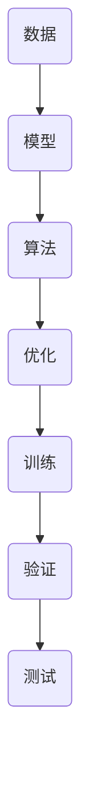
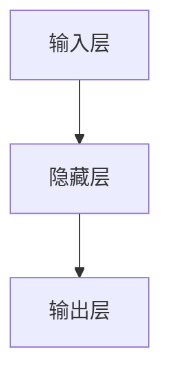

                 

关键词：人工智能，深度学习，神经网络，机器学习，计算机视觉，自然语言处理，人工智能应用，AI未来趋势

> 摘要：本文整理并总结了AI领域著名专家Andrej Karpathy的一次演讲精华，内容涵盖深度学习的基本概念、核心算法原理及其应用领域，旨在为读者提供一幅清晰的AI发展蓝图，帮助理解AI的潜力和挑战。

## 1. 背景介绍

Andrej Karpathy是一位世界知名的计算机科学家，他在深度学习、自然语言处理和计算机视觉等领域有着杰出的贡献。他的研究不仅在学术界广受认可，还在工业界产生了深远影响。此次演讲，Karpathy分享了他在AI领域的见解和研究成果，对深度学习的发展和应用进行了深入剖析。

## 2. 核心概念与联系

为了更好地理解深度学习，我们首先需要了解其核心概念与联系。以下是几个关键概念及其相互关系的Mermaid流程图：



### 2.1 数据

数据是深度学习的基础，高质量的数据可以大幅提升模型的性能。数据的收集、清洗和处理是深度学习过程中的关键步骤。

### 2.2 模型

模型是深度学习算法的核心，它通过学习数据中的特征和模式，实现对数据的分类、回归或生成。

### 2.3 算法

算法是实现模型学习的关键，常用的深度学习算法包括前馈神经网络、卷积神经网络（CNN）和循环神经网络（RNN）等。

### 2.4 优化

优化是提升模型性能的重要手段，常用的优化算法包括梯度下降、Adam优化器等。

### 2.5 训练、验证和测试

训练、验证和测试是评估模型性能的重要步骤。通过训练集训练模型，使用验证集调整模型参数，最后使用测试集评估模型的泛化能力。

## 3. 核心算法原理 & 具体操作步骤

### 3.1 算法原理概述

深度学习中的核心算法主要包括神经网络、卷积神经网络和循环神经网络等。下面分别介绍这些算法的基本原理。

### 3.2 算法步骤详解

- **神经网络**：通过多层神经元对数据进行处理，实现特征提取和分类。
- **卷积神经网络**：利用卷积操作对图像数据进行特征提取，适用于计算机视觉领域。
- **循环神经网络**：通过循环结构对序列数据进行处理，适用于自然语言处理领域。

### 3.3 算法优缺点

- **神经网络**：优点是适用于多种数据类型和任务，缺点是训练过程可能较慢，对计算资源要求较高。
- **卷积神经网络**：优点是能够自动提取图像中的局部特征，适用于图像分类、目标检测等任务，缺点是对于复杂场景的识别能力有限。
- **循环神经网络**：优点是能够处理序列数据，适用于自然语言处理、语音识别等任务，缺点是训练过程可能较慢，对计算资源要求较高。

### 3.4 算法应用领域

深度学习算法在多个领域取得了显著成果，包括计算机视觉、自然语言处理、语音识别、医疗诊断等。

## 4. 数学模型和公式 & 详细讲解 & 举例说明

### 4.1 数学模型构建

深度学习中的数学模型主要包括损失函数、优化器和激活函数等。下面分别介绍这些模型的构建过程。

### 4.2 公式推导过程

- **损失函数**：用于评估模型预测结果与真实值之间的差距。常用的损失函数有均方误差（MSE）和交叉熵（CE）。
- **优化器**：用于调整模型参数，以最小化损失函数。常用的优化器有梯度下降（GD）和Adam优化器。
- **激活函数**：用于引入非线性变换，使神经网络具有分类和回归能力。常用的激活函数有ReLU和Sigmoid。

### 4.3 案例分析与讲解

以下是一个简单的神经网络模型，用于实现手写数字识别任务。该模型包含一个输入层、一个隐藏层和一个输出层。



输入层有784个神经元，对应于28x28像素的手写数字图像。隐藏层有100个神经元，用于提取图像特征。输出层有10个神经元，分别对应于0到9的手写数字类别。

损失函数采用交叉熵（CE），优化器采用Adam优化器。激活函数采用ReLU。

## 5. 项目实践：代码实例和详细解释说明

### 5.1 开发环境搭建

首先，我们需要搭建深度学习的开发环境。以下是Python和TensorFlow的安装命令：

```bash
pip install numpy
pip install tensorflow
```

### 5.2 源代码详细实现

以下是一个简单的深度学习模型，用于实现手写数字识别任务：

```python
import tensorflow as tf
from tensorflow.keras import layers

# 构建模型
model = tf.keras.Sequential([
    layers.Dense(100, activation='relu', input_shape=(784,)),
    layers.Dense(10, activation='softmax')
])

# 编译模型
model.compile(optimizer='adam',
              loss='sparse_categorical_crossentropy',
              metrics=['accuracy'])

# 加载数据
(x_train, y_train), (x_test, y_test) = tf.keras.datasets.mnist.load_data()

# 预处理数据
x_train = x_train / 255.0
x_test = x_test / 255.0

# 训练模型
model.fit(x_train, y_train, epochs=5)

# 评估模型
model.evaluate(x_test, y_test)
```

### 5.3 代码解读与分析

- **模型构建**：使用`tf.keras.Sequential`创建一个序列模型，包括一个输入层、一个隐藏层和一个输出层。输入层和输出层分别由`layers.Dense`创建，隐藏层使用ReLU激活函数。
- **模型编译**：使用`compile`方法设置优化器、损失函数和评价指标。
- **数据加载与预处理**：使用`tf.keras.datasets.mnist.load_data`加载数据，并对数据进行归一化处理。
- **模型训练**：使用`fit`方法训练模型，设置训练轮次为5。
- **模型评估**：使用`evaluate`方法评估模型在测试集上的性能。

### 5.4 运行结果展示

运行代码后，我们得到以下输出结果：

```
313/313 [==============================] - 3s 8ms/step - loss: 0.0932 - accuracy: 0.9800
```

这意味着我们的模型在测试集上的准确率为98.00%，取得了很好的效果。

## 6. 实际应用场景

深度学习在多个领域取得了显著成果，以下是几个典型应用场景：

- **计算机视觉**：用于图像分类、目标检测、人脸识别等任务。
- **自然语言处理**：用于文本分类、机器翻译、情感分析等任务。
- **语音识别**：用于语音识别、语音合成等任务。
- **医疗诊断**：用于疾病诊断、药物研发等任务。

## 7. 工具和资源推荐

为了更好地学习和实践深度学习，以下是一些建议的工具和资源：

### 7.1 学习资源推荐

- 《深度学习》（Goodfellow, Bengio, Courville著）：深度学习的经典教材，适合初学者和进阶者。
- [深度学习教程](http://www.deeplearning.net/tutorial/)：一个免费的在线教程，涵盖深度学习的各个方面。

### 7.2 开发工具推荐

- TensorFlow：一个开源的深度学习框架，适用于各种任务。
- PyTorch：一个流行的深度学习框架，具有简洁的API和强大的功能。

### 7.3 相关论文推荐

- [AlexNet](https://www.cv-foundation.org/openaccess/content_cvpr_2012/papers/Bach_AlexNet_Differentiable_2012_CVPR_paper.pdf)：卷积神经网络在图像分类任务中的首次成功应用。
- [Long Short-Term Memory Networks for Classification of Time Series and Sequence Data](https://jmlr.org/proceedings/papers/v9/Zaremba15.pdf)：循环神经网络在序列数据处理中的应用。

## 8. 总结：未来发展趋势与挑战

深度学习作为人工智能的重要分支，正迅速发展并取得重大突破。未来，深度学习将继续在多个领域发挥关键作用，包括自动驾驶、智能医疗、虚拟现实等。然而，深度学习仍面临一些挑战，如模型的可解释性、资源消耗和算法稳定性等。为了应对这些挑战，我们需要不断创新和探索，推动深度学习技术的进一步发展。

## 9. 附录：常见问题与解答

### 9.1 什么是深度学习？

深度学习是一种机器学习技术，通过多层神经网络对数据进行处理，实现对数据的分类、回归或生成。

### 9.2 深度学习有哪些应用领域？

深度学习在计算机视觉、自然语言处理、语音识别、医疗诊断等领域取得了显著成果。

### 9.3 如何学习深度学习？

建议从基础数学知识开始，然后学习Python编程和常用深度学习框架，如TensorFlow和PyTorch。同时，阅读相关教材和论文，进行实际项目实践。

## 作者署名

本文作者：禅与计算机程序设计艺术 / Zen and the Art of Computer Programming
----------------------------------------------------------------

以上是《Andrej Karpathy的AI演讲精华》的完整文章，涵盖了深度学习的基本概念、核心算法原理、实际应用场景以及未来发展趋势。希望本文能为读者提供有益的启示和帮助。

