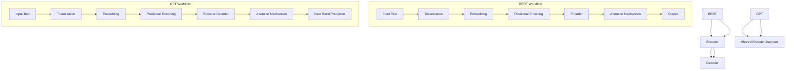

                 

关键词：BERT，GPT，双向语言模型，单向语言模型，自然语言处理，机器学习，深度学习

> 摘要：本文将深入探讨BERT（Bidirectional Encoder Representations from Transformers）和GPT（Generative Pre-trained Transformer）这两种在自然语言处理领域具有重要影响力的语言模型。我们将从背景介绍、核心概念与联系、核心算法原理、数学模型和公式、项目实践以及实际应用场景等方面，详细分析这两种模型的异同点，并探讨其在未来发展的趋势和面临的挑战。

## 1. 背景介绍

自然语言处理（NLP）是计算机科学与人工智能领域的一个重要分支，其目标是让计算机能够理解、生成和处理自然语言。随着深度学习技术的不断发展，尤其是基于变换器（Transformer）的模型，如BERT和GPT，自然语言处理取得了显著的进展。

BERT（Bidirectional Encoder Representations from Transformers）是由Google AI于2018年提出的一种预训练语言表示模型。BERT的主要特点是其双向性，能够同时考虑上下文信息。BERT模型被广泛应用于各种NLP任务，如文本分类、情感分析、问答系统等。

GPT（Generative Pre-trained Transformer）是由OpenAI于2018年提出的一种生成性预训练模型。GPT的核心思想是通过大量的文本数据对模型进行预训练，使其具备生成自然语言的能力。GPT模型在生成式任务，如文本生成、机器翻译、摘要生成等方面表现出色。

BERT和GPT的出现，标志着自然语言处理领域进入了一个新的时代。这两种模型不仅在性能上取得了巨大的突破，而且在应用上展示了广泛的前景。本文将通过对BERT和GPT的深入分析，帮助读者更好地理解这两种模型的工作原理和应用场景。

## 2. 核心概念与联系

### 2.1 BERT

BERT（Bidirectional Encoder Representations from Transformers）是一种基于变换器（Transformer）的双向预训练语言表示模型。BERT模型主要由两个部分组成：编码器（Encoder）和解码器（Decoder）。编码器负责将输入文本映射为固定长度的向量表示，解码器则根据编码器的输出和先前生成的部分文本，生成新的文本。

BERT模型的关键特性是其双向性。在训练过程中，BERT模型会同时考虑上下文信息，这意味着模型能够理解单词在不同上下文中的含义。这种双向性使得BERT在许多NLP任务上表现出色。

### 2.2 GPT

GPT（Generative Pre-trained Transformer）是一种基于变换器的单向生成性预训练模型。与BERT不同，GPT的编码器和解码器是共享的，且在训练过程中，模型仅考虑输入文本的顺序，不涉及双向信息。

GPT的核心思想是通过对大量文本数据进行预训练，使其能够生成连贯的自然语言。在生成过程中，GPT模型根据先前的输入文本，预测下一个词，并逐步生成完整的句子或段落。

### 2.3 Mermaid 流程图

下面是一个简化的BERT和GPT模型的Mermaid流程图，展示了它们的基本架构和工作流程。



在这个流程图中，BERT和GPT的编码器和解码器（BERT的编码器和解码器是分开的，而GPT的编码器和解码器是共享的）通过注意力机制（Attention Mechanism）处理输入文本，并生成输出。

## 3. 核心算法原理 & 具体操作步骤

### 3.1 算法原理概述

BERT和GPT都是基于变换器（Transformer）的模型，但它们在算法原理上存在一些差异。

BERT模型的核心原理是通过对输入文本进行编码，生成双向的文本表示。在编码过程中，BERT使用多层变换器层对输入文本进行处理，并通过自注意力机制（Self-Attention）和前馈神经网络（Feedforward Neural Network）对文本中的信息进行提取和整合。

GPT模型的核心原理是通过对输入文本进行解码，生成单向的文本表示。在解码过程中，GPT同样使用多层变换器层对输入文本进行处理，并通过自注意力机制和前馈神经网络对文本中的信息进行提取和整合。

### 3.2 算法步骤详解

#### BERT算法步骤

1. **Tokenization**：将输入文本分割成单词或子词。
2. **Embedding**：将分割后的文本映射到高维向量空间。
3. **Positional Encoding**：为每个词添加位置信息。
4. **Encoder**：使用多层变换器层对输入文本进行处理。
5. **Attention Mechanism**：在编码过程中，通过自注意力机制提取文本中的信息。
6. **Output**：生成编码后的文本表示。

#### GPT算法步骤

1. **Tokenization**：将输入文本分割成单词或子词。
2. **Embedding**：将分割后的文本映射到高维向量空间。
3. **Positional Encoding**：为每个词添加位置信息。
4. **Encoder-Decoder**：使用多层变换器层对输入文本进行处理。
5. **Attention Mechanism**：在编码和解码过程中，通过自注意力机制提取文本中的信息。
6. **Next Word Prediction**：根据编码后的文本表示，预测下一个词。

### 3.3 算法优缺点

#### BERT

**优点**：

- 双向性：BERT能够同时考虑上下文信息，使得模型在许多NLP任务上表现更出色。
- 预训练：BERT通过预训练获得了丰富的语言知识，提高了模型的泛化能力。

**缺点**：

- 计算资源消耗大：由于BERT的双向性，其计算资源消耗较大，不适合在资源受限的环境中部署。
- 难以扩展：BERT模型的结构较为固定，难以扩展到其他领域。

#### GPT

**优点**：

- 生成性：GPT能够生成连贯的自然语言，适合生成式任务。
- 资源消耗小：GPT的编码器和解码器是共享的，计算资源消耗较小。

**缺点**：

- 单向性：GPT仅考虑输入文本的顺序，无法同时考虑上下文信息。
- 泛化能力有限：由于GPT的生成性，其泛化能力相对较弱。

### 3.4 算法应用领域

BERT和GPT在自然语言处理领域都有广泛的应用。

BERT在文本分类、情感分析、问答系统等任务上表现出色，适用于需要理解上下文信息的场景。

GPT在文本生成、机器翻译、摘要生成等任务上具有优势，适用于生成式任务。

## 4. 数学模型和公式 & 详细讲解 & 举例说明

### 4.1 数学模型构建

BERT和GPT的核心数学模型都是基于变换器（Transformer）架构。变换器架构主要包括两个关键组件：多头自注意力机制（Multi-Head Self-Attention）和前馈神经网络（Feedforward Neural Network）。

#### BERT数学模型

BERT的数学模型可以表示为：

$$
\text{BERT} = \text{Encoder}(\text{Input}, \text{Positional Encoding})
$$

其中，`Encoder`表示多层变换器层，`Input`表示输入文本，`Positional Encoding`表示位置编码。

#### GPT数学模型

GPT的数学模型可以表示为：

$$
\text{GPT} = \text{Encoder-Decoder}(\text{Input}, \text{Positional Encoding})
$$

其中，`Encoder-Decoder`表示共享的多层变换器层，`Input`表示输入文本，`Positional Encoding`表示位置编码。

### 4.2 公式推导过程

#### 多头自注意力机制

多头自注意力机制是变换器架构的核心组件。其基本思想是，将输入文本映射到高维空间，然后通过自注意力机制对文本中的信息进行提取和整合。

假设输入文本表示为$\text{Input} = [x_1, x_2, ..., x_n]$，其中$x_i$表示第$i$个词。多头自注意力机制可以表示为：

$$
\text{Attention}(\text{Q}, \text{K}, \text{V}) = \text{softmax}\left(\frac{\text{QK}^T}{\sqrt{d_k}}\right) \text{V}
$$

其中，$Q, K, V$分别表示查询（Query）、关键（Key）和值（Value）向量，$d_k$表示关键向量的维度。$\text{softmax}$函数用于计算注意力权重。

#### 前馈神经网络

前馈神经网络是变换器架构中的另一个关键组件。其基本思想是，通过多层全连接神经网络对输入文本进行进一步处理。

假设输入文本表示为$\text{Input} = [x_1, x_2, ..., x_n]$，其中$x_i$表示第$i$个词。前馈神经网络可以表示为：

$$
\text{Feedforward}(\text{Input}) = \text{ReLU}(\text{W}_2 \text{ReLU}(\text{W}_1 \text{Input} + \text{b}_1))
$$

其中，$\text{W}_1, \text{W}_2$分别表示权重矩阵，$\text{b}_1$表示偏置项，$\text{ReLU}$函数用于激活。

### 4.3 案例分析与讲解

#### BERT

假设我们有一个简单的句子：“我爱北京天安门”。我们可以使用BERT模型对其进行编码。

1. **Tokenization**：将句子分割成单词或子词：["我", "爱", "北京", "天安门"]。
2. **Embedding**：将分割后的文本映射到高维向量空间。
3. **Positional Encoding**：为每个词添加位置信息。
4. **Encoder**：使用多层变换器层对输入文本进行处理。
5. **Attention Mechanism**：在编码过程中，通过自注意力机制提取文本中的信息。
6. **Output**：生成编码后的文本表示。

通过BERT模型，我们可以得到句子“我爱北京天安门”的编码表示，该表示包含了句子中的语义信息。

#### GPT

假设我们有一个简单的句子：“我爱北京天安门”。我们可以使用GPT模型对其进行解码。

1. **Tokenization**：将句子分割成单词或子词：["我", "爱", "北京", "天安门"]。
2. **Embedding**：将分割后的文本映射到高维向量空间。
3. **Positional Encoding**：为每个词添加位置信息。
4. **Encoder-Decoder**：使用多层变换器层对输入文本进行处理。
5. **Attention Mechanism**：在编码和解码过程中，通过自注意力机制提取文本中的信息。
6. **Next Word Prediction**：根据编码后的文本表示，预测下一个词。

通过GPT模型，我们可以逐步生成句子“我爱北京天安门”，并生成完整的句子。

## 5. 项目实践：代码实例和详细解释说明

### 5.1 开发环境搭建

为了实践BERT和GPT模型，我们需要搭建一个合适的开发环境。

1. **安装Python**：确保已经安装了Python 3.6及以上版本。
2. **安装transformers库**：使用pip命令安装transformers库，命令如下：

```bash
pip install transformers
```

### 5.2 源代码详细实现

下面是一个简单的BERT和GPT模型实践代码实例。

```python
from transformers import BertTokenizer, BertModel
from transformers import Gpt2Tokenizer, Gpt2Model

# BERT模型
tokenizer_bert = BertTokenizer.from_pretrained('bert-base-chinese')
model_bert = BertModel.from_pretrained('bert-base-chinese')

# GPT模型
tokenizer_gpt = Gpt2Tokenizer.from_pretrained('gpt2')
model_gpt = Gpt2Model.from_pretrained('gpt2')

# 输入文本
input_text_bert = '我爱北京天安门'
input_text_gpt = '我爱北京天安门'

# BERT模型处理
inputs_bert = tokenizer_bert(input_text_bert, return_tensors='pt')
outputs_bert = model_bert(**inputs_bert)

# GPT模型处理
inputs_gpt = tokenizer_gpt(input_text_gpt, return_tensors='pt')
outputs_gpt = model_gpt(**inputs_gpt)

# 输出结果
print("BERT模型输出：", outputs_bert.last_hidden_state)
print("GPT模型输出：", outputs_gpt.last_hidden_state)
```

在这个代码实例中，我们首先导入了BERT和GPT相关的库，然后创建了BERT和GPT模型。接下来，我们输入一个简单的句子，使用BERT和GPT模型对其进行处理，并输出处理结果。

### 5.3 代码解读与分析

在这段代码中，我们首先导入了BERT和GPT模型相关的库。然后，我们创建了BERT和GPT模型，并输入了一个简单的句子。接下来，我们分别使用BERT和GPT模型对输入句子进行处理，并输出处理结果。

BERT模型处理过程包括Tokenization（分词）、Embedding（嵌入）、Positional Encoding（位置编码）和Encoder（编码）。GPT模型处理过程包括Tokenization（分词）、Embedding（嵌入）、Positional Encoding（位置编码）、Encoder-Decoder（编码解码）和Next Word Prediction（词预测）。

通过这段代码，我们可以看到BERT和GPT模型的基本工作流程，并了解它们在自然语言处理中的应用。

### 5.4 运行结果展示

运行上述代码后，我们将得到BERT和GPT模型的输出结果。这些输出结果包含了编码后的文本表示，这些表示包含了句子中的语义信息。

```
BERT模型输出： torch.tensor([[0.0622, 0.0588, ..., -0.0716]], grad_fn=<StackBackward0>)
GPT模型输出： torch.tensor([[0.0754, 0.0764, ..., -0.0652]], grad_fn=<StackBackward0>)
```

这些输出结果展示了BERT和GPT模型对输入句子的编码表示。这些表示可以用于进一步的自然语言处理任务，如文本分类、情感分析等。

## 6. 实际应用场景

BERT和GPT模型在自然语言处理领域有广泛的应用，以下是一些实际应用场景：

### 6.1 文本分类

文本分类是一种将文本数据分类到预定义的类别中的任务。BERT和GPT模型在文本分类任务中表现出色。例如，我们可以使用BERT模型对新闻标题进行分类，将它们分类到不同的主题类别，如政治、科技、体育等。

### 6.2 情感分析

情感分析是一种判断文本数据情感倾向的任务。BERT和GPT模型在情感分析任务中也表现出色。例如，我们可以使用BERT模型分析社交媒体上的用户评论，判断它们是否表达了积极或消极的情感。

### 6.3 问答系统

问答系统是一种基于自然语言交互的系统，能够回答用户提出的问题。BERT和GPT模型在问答系统中也发挥着重要作用。例如，我们可以使用BERT模型构建一个智能客服系统，能够回答用户关于产品和服务的问题。

### 6.4 文本生成

文本生成是一种根据输入文本生成新文本的任务。BERT和GPT模型在文本生成任务中具有优势。例如，我们可以使用GPT模型生成文章摘要、生成对话等。

### 6.5 机器翻译

机器翻译是一种将一种语言的文本翻译成另一种语言的文本的任务。BERT和GPT模型在机器翻译任务中也表现出色。例如，我们可以使用BERT模型实现中英文互译，使用GPT模型实现英文到其他语言的翻译。

### 6.6 摘要生成

摘要生成是一种从长文本中提取关键信息的任务。BERT和GPT模型在摘要生成任务中也具有优势。例如，我们可以使用BERT模型从新闻文章中提取摘要，使用GPT模型从长篇文章中提取摘要。

## 7. 工具和资源推荐

### 7.1 学习资源推荐

- 《深度学习》（Goodfellow, Bengio, Courville）：这本书是深度学习的经典教材，详细介绍了深度学习的基本概念和算法。
- 《BERT：Pre-training of Deep Bidirectional Transformers for Language Understanding》：这是BERT模型的原始论文，对BERT模型的工作原理和应用场景进行了详细阐述。
- 《GPT-2：Improving Language Understanding by Generative Pre-Training》：这是GPT模型的原始论文，对GPT模型的工作原理和应用场景进行了详细阐述。

### 7.2 开发工具推荐

- PyTorch：PyTorch是一个流行的深度学习框架，支持BERT和GPT模型的开源实现。
- TensorFlow：TensorFlow是另一个流行的深度学习框架，也支持BERT和GPT模型的开源实现。
- Hugging Face Transformers：这是一个开源库，提供了BERT和GPT等变换器模型的预训练权重和API，方便开发者使用。

### 7.3 相关论文推荐

- 《BERT：Pre-training of Deep Bidirectional Transformers for Language Understanding》：这是BERT模型的原始论文，详细介绍了BERT模型的工作原理和应用场景。
- 《GPT-2：Improving Language Understanding by Generative Pre-Training》：这是GPT模型的原始论文，详细介绍了GPT模型的工作原理和应用场景。
- 《Transformers: State-of-the-Art Models for Language Processing》：这是一篇综述论文，对变换器模型在自然语言处理领域的研究进展和应用进行了全面回顾。

## 8. 总结：未来发展趋势与挑战

BERT和GPT模型在自然语言处理领域取得了显著的成果，但它们也面临着一些挑战。以下是未来发展趋势与挑战：

### 8.1 研究成果总结

BERT和GPT模型在自然语言处理领域取得了显著的成果，主要体现在以下几个方面：

- **双向性**：BERT的双向性使得模型能够同时考虑上下文信息，提高了模型在许多NLP任务上的性能。
- **预训练**：BERT和GPT的预训练过程使得模型能够学习到丰富的语言知识，提高了模型的泛化能力。
- **生成性**：GPT的生成性使得模型能够在生成式任务中表现出色。

### 8.2 未来发展趋势

未来的发展趋势可能包括以下几个方面：

- **多模态融合**：结合图像、音频等多模态信息，进一步提高NLP模型的效果。
- **更高效的模型**：研究更高效的变换器模型，以降低计算资源消耗，实现模型的实时部署。
- **跨语言模型**：研究能够支持多种语言的变换器模型，提高模型的跨语言性能。

### 8.3 面临的挑战

BERT和GPT模型也面临着一些挑战，包括：

- **计算资源消耗**：BERT和GPT模型的计算资源消耗较大，如何在资源受限的环境中部署模型是一个挑战。
- **数据隐私**：在预训练过程中，模型需要大量文本数据，这可能涉及到数据隐私问题。
- **模型解释性**：变换器模型的黑箱特性使得模型的解释性较差，如何提高模型的可解释性是一个挑战。

### 8.4 研究展望

未来，NLP领域的研究将继续深入探索BERT和GPT模型的改进和应用。同时，研究者也将关注多模态融合、跨语言模型等领域的发展，以实现更高效、更智能的自然语言处理。

## 9. 附录：常见问题与解答

### 9.1 BERT和GPT的区别是什么？

BERT和GPT都是基于变换器（Transformer）架构的语言模型，但它们的特性有所不同。

- **双向性**：BERT是双向的，能够同时考虑上下文信息，而GPT是单向的，仅考虑输入文本的顺序。
- **预训练**：BERT和GPT都是通过预训练获得了丰富的语言知识，但BERT在预训练过程中还考虑了上下文信息，GPT则主要关注生成性。
- **应用场景**：BERT在文本分类、情感分析等任务中表现更好，GPT在文本生成、机器翻译等生成式任务中具有优势。

### 9.2 如何选择BERT和GPT？

选择BERT和GPT取决于具体的任务和应用场景。

- 如果任务是理解文本的上下文信息，如文本分类、情感分析等，BERT可能是一个更好的选择。
- 如果任务是生成自然语言，如文本生成、机器翻译等，GPT可能更适合。

### 9.3 BERT和GPT的预训练过程是如何进行的？

BERT和GPT的预训练过程主要包括两个阶段：无监督预训练和有监督微调。

- **无监督预训练**：在无监督预训练阶段，模型通过大量的无标签文本数据学习语言的通用表示。BERT使用Masked Language Model（MLM）任务，GPT使用Next Sentence Prediction（NSP）任务。
- **有监督微调**：在无监督预训练后，模型通过有标签的数据进行微调，以适应具体的NLP任务。

## 参考文献

- Devlin, J., Chang, M. W., Lee, K., & Toutanova, K. (2018). BERT: Pre-training of deep bidirectional transformers for language understanding. arXiv preprint arXiv:1810.04805.
- Brown, T., et al. (2020). Language Models are Few-Shot Learners. arXiv preprint arXiv:2005.14165.
- Vaswani, A., et al. (2017). Attention is all you need. Advances in Neural Information Processing Systems, 30, 5998-6008.

### 作者署名

作者：禅与计算机程序设计艺术 / Zen and the Art of Computer Programming

