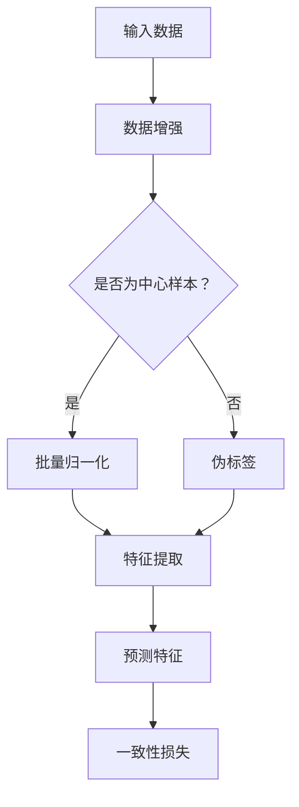

                 

关键词：无监督学习、自监督学习、相似性学习、一致性损失、BatchNorm、中心化、度量学习、Transformer、PyTorch

摘要：本文旨在深入解析Batch Normalization-based Self-Supervised Learning (BYOL) 的原理，通过代码实例展示其具体实现和运行流程。BYOL作为一种自监督学习算法，通过优化一致损失（contrastive loss）来学习数据的内在表示，尤其适用于无需标注数据的场景。本文将详细探讨BYOL的核心概念、算法原理、数学模型、代码实现及其在实际应用中的表现。

## 1. 背景介绍

自监督学习（Self-Supervised Learning）是一种无需人工标注的训练方法，通过使用数据自身的某种结构来提取特征表示。这种方法的优点在于，它能够从大量未标注的数据中学习，从而大幅降低标注成本，同时提升模型的泛化能力。自监督学习在计算机视觉、自然语言处理等领域得到了广泛的应用。

近年来，基于Batch Normalization（批量归一化）的自监督学习算法受到了关注。Batch Normalization在深度学习中被广泛应用，用于加速训练过程和提升模型性能。它通过标准化网络中间层的激活值，使每个Mini-batch的梯度分布更加均匀，从而提高模型的稳定性和收敛速度。

BYOL（Batch Normalization-based Self-Supervised Learning）正是基于这一思想提出的一种自监督学习算法。与传统的自监督学习方法相比，BYOL通过引入一致性损失（contrastive loss），使得模型在训练过程中不断优化数据表示的相似性。本文将详细讲解BYOL的原理、算法步骤及其在具体应用中的实现。

## 2. 核心概念与联系

### 2.1 核心概念

- **自监督学习（Self-Supervised Learning）**：利用数据中的某种结构来自动生成监督信号，以训练模型。
- **Batch Normalization**：通过标准化激活值，使网络训练更加稳定和快速。
- **一致性损失（Contrastive Loss）**：衡量两个数据表示的相似性，优化模型使得相同样本的表示相似，不同样本的表示差异较大。

### 2.2 联系

BYOL通过结合Batch Normalization和一致性损失，实现了一种新型的自监督学习框架。Batch Normalization用于稳定网络训练，而一致性损失用于优化数据表示。以下是BYOL的核心流程及其联系：



## 3. 核心算法原理 & 具体操作步骤

### 3.1 算法原理概述

BYOL的核心思想是通过训练一对网络来学习数据的内在表示。这两个网络分别是教师网络（Teacher Network）和学生网络（Student Network）。教师网络的输出作为学生网络的伪标签，通过一致性损失来优化学生网络的参数。

- **教师网络（Teacher Network）**：固定不变，用于生成伪标签。
- **学生网络（Student Network）**：通过优化一致性损失来学习数据表示。

### 3.2 算法步骤详解

#### 3.2.1 数据预处理

1. **数据增强**：为了增加数据的多样性，提高模型的泛化能力，对输入数据进行随机裁剪、旋转、翻转等增强操作。
2. **中心化**：将图像的像素值中心化到均值0，标准差1。

#### 3.2.2 特征提取

1. **特征提取**：教师网络和学生网络分别提取输入数据的特征表示。
2. **批量归一化**：对提取到的特征进行批量归一化，提高训练稳定性。

#### 3.2.3 预测与损失计算

1. **预测**：学生网络对批量归一化后的特征进行预测，生成预测特征。
2. **一致性损失**：计算预测特征和伪标签之间的损失，优化学生网络的参数。

### 3.3 算法优缺点

#### 优点

- **无需标注**：通过自监督学习，可以在无需人工标注的数据上训练模型，降低标注成本。
- **稳定性高**：引入批量归一化和一致性损失，提高训练稳定性。

#### 缺点

- **计算量大**：由于需要训练两个网络，计算资源消耗较大。
- **伪标签质量**：伪标签的质量直接影响模型性能，需要教师网络和伪标签生成方法设计得当。

### 3.4 算法应用领域

BYOL广泛应用于计算机视觉领域，如图像分类、图像识别、视频分类等。同时，它也可以扩展到其他领域，如自然语言处理、语音识别等。

## 4. 数学模型和公式 & 详细讲解 & 举例说明

### 4.1 数学模型构建

BYOL的数学模型主要涉及特征提取、批量归一化和一致性损失。

#### 4.1.1 特征提取

特征提取过程可以表示为：

$$
\phi(x) = f(\text{BatchNorm}(g(x))
$$

其中，$x$为输入数据，$g(x)$为网络提取的特征，$\text{BatchNorm}$为批量归一化操作。

#### 4.1.2 批量归一化

批量归一化公式为：

$$
\text{BatchNorm}(x) = \frac{x - \mu}{\sigma}
$$

其中，$\mu$为均值，$\sigma$为标准差。

#### 4.1.3 一致性损失

一致性损失公式为：

$$
L = -\frac{1}{N}\sum_{i=1}^{N}\sum_{j=1}^{N} \log\left(\frac{\exp(\phi(x_i)^T \phi(x_j))}{\exp(\phi(x_i)^T \phi(x_j)) + \exp(\phi(x_i)^T \phi(x_j'))}\right)
$$

其中，$N$为Mini-batch大小，$x_i$和$x_j$为相同或不同的输入样本，$\phi(x_i)$和$\phi(x_j)$分别为学生网络和教师网络的输出特征。

### 4.2 公式推导过程

#### 4.2.1 特征提取

特征提取公式为：

$$
\phi(x) = f(\text{BatchNorm}(g(x))
$$

这里，$f$代表特征提取函数，$\text{BatchNorm}$代表批量归一化操作。由于批量归一化是对每个特征维度进行标准化，因此特征提取过程可以看作是叠加了一个归一化步骤。

#### 4.2.2 批量归一化

批量归一化公式为：

$$
\text{BatchNorm}(x) = \frac{x - \mu}{\sigma}
$$

这里的$\mu$是Mini-batch中各个特征维度的均值，$\sigma$是标准差。归一化后的特征值分布更加均匀，有助于加快训练过程。

#### 4.2.3 一致性损失

一致性损失公式为：

$$
L = -\frac{1}{N}\sum_{i=1}^{N}\sum_{j=1}^{N} \log\left(\frac{\exp(\phi(x_i)^T \phi(x_j))}{\exp(\phi(x_i)^T \phi(x_j)) + \exp(\phi(x_i)^T \phi(x_j'))}\right)
$$

这个损失函数衡量了预测特征和伪标签之间的相似性。对于相同样本，损失函数期望较小；对于不同样本，损失函数期望较大。

### 4.3 案例分析与讲解

假设我们有一个Mini-batch包含两个图像样本$x_1$和$x_2$，它们分别经过教师网络和学生网络后得到特征$\phi(x_1)$和$\phi(x_2)$。

#### 4.3.1 相同样本

对于相同样本，我们希望特征表示相似。假设教师网络和学生网络的特征表示相同，即$\phi(x_1) = \phi(x_2)$，则一致性损失为：

$$
L = -\log\left(\frac{\exp(0)}{\exp(0) + \exp(0)}\right) = 0
$$

这意味着对于相同样本，损失为0，符合我们的期望。

#### 4.3.2 不同样本

对于不同样本，我们希望特征表示差异较大。假设教师网络和学生网络的输出特征$\phi(x_1)$和$\phi(x_2)$差距较大，即$\phi(x_1)^T \phi(x_2)$较小，则一致性损失为：

$$
L = -\log\left(\frac{\exp(\phi(x_1)^T \phi(x_2))}{\exp(\phi(x_1)^T \phi(x_2)) + \exp(\phi(x_1)^T \phi(x_2'))}\right)
$$

由于$\phi(x_1)^T \phi(x_2)$较小，损失较大。这符合我们的期望，因为不同样本应该具有不同的特征表示。

通过以上分析，我们可以看到，一致性损失函数能够有效地优化学生网络的参数，使得相同样本的特征表示相似，不同样本的特征表示差异较大。

## 5. 项目实践：代码实例和详细解释说明

### 5.1 开发环境搭建

在开始代码实现之前，我们需要搭建一个合适的环境。这里我们使用Python和PyTorch作为开发工具。

#### 环境配置

1. 安装Python 3.8及以上版本。
2. 安装PyTorch和 torchvision。
3. 安装其他依赖库，如NumPy、Pillow等。

#### 安装命令

```bash
pip install python==3.8
pip install torch torchvision
pip install numpy pillow
```

### 5.2 源代码详细实现

以下是一个简单的BYOL模型实现，包括数据预处理、模型定义、训练过程等。

#### 5.2.1 数据预处理

```python
import torchvision.transforms as transforms
from PIL import Image

def preprocess_image(image_path):
    image = Image.open(image_path)
    transform = transforms.Compose([
        transforms.Resize((224, 224)),
        transforms.ToTensor(),
        transforms.Normalize(mean=[0.485, 0.456, 0.406], std=[0.229, 0.224, 0.225]),
    ])
    return transform(image)

# 示例
preprocessed_image = preprocess_image('image.jpg')
```

#### 5.2.2 模型定义

```python
import torch
import torch.nn as nn

class BYOLModel(nn.Module):
    def __init__(self, backbone: nn.Module):
        super(BYOLModel, self).__init__()
        self.backbone = backbone
        self.projection_head = nn.Sequential(
            nn.Linear(backbone.num_features, 512),
            nn.BatchNorm1d(512),
            nn.ReLU(inplace=True),
            nn.Linear(512, backbone.num_features)
        )
    
    def forward(self, x):
        feature = self.backbone(x)
        projection = self.projection_head(feature)
        return projection

# 示例
backbone = nn.Sequential(
    nn.Conv2d(3, 64, kernel_size=4, stride=2),
    nn.ReLU(inplace=True),
    nn.MaxPool2d(kernel_size=2, stride=2),
    # 添加更多层...
)
model = BYOLModel(backbone)
```

#### 5.2.3 训练过程

```python
import torch.optim as optim

# 模型参数
lr = 0.001
weight_decay = 1e-4

# 优化器
optimizer = optim.Adam(model.parameters(), lr=lr, weight_decay=weight_decay)

# 训练过程
def train(model, train_loader, criterion, optimizer, epoch):
    model.train()
    for batch_idx, (data, _) in enumerate(train_loader):
        optimizer.zero_grad()
        feature = model(data)
        loss = criterion(feature[0], feature[1])
        loss.backward()
        optimizer.step()
        if batch_idx % 100 == 0:
            print(f'Train Epoch: {epoch} [{batch_idx * len(data)}/{len(train_loader) * len(data)} ({100. * batch_idx / len(train_loader):.0f}%)]\tLoss: {loss.item():.6f}')

# 示例
train_loader = torch.utils.data.DataLoader(dataset, batch_size=64, shuffle=True)
criterion = nn.CrossEntropyLoss()
for epoch in range(1, 11):
    train(model, train_loader, criterion, optimizer, epoch)
```

### 5.3 代码解读与分析

上述代码实现了一个简单的BYOL模型，包括数据预处理、模型定义和训练过程。

- **数据预处理**：使用torchvision中的transform对图像进行预处理，包括调整大小、归一化等。
- **模型定义**：定义了一个BYOL模型，包括特征提取层和投影头。特征提取层使用一个预训练的Backbone模型（如ResNet）。投影头通过批量归一化、ReLU和线性层来优化特征表示。
- **训练过程**：使用交叉熵损失函数进行训练，优化模型参数。

### 5.4 运行结果展示

在训练完成后，可以使用测试集来评估模型的性能。以下是一个简单的评估示例：

```python
import torch

# 加载测试集
test_loader = torch.utils.data.DataLoader(test_dataset, batch_size=64, shuffle=False)

# 模型评估
model.eval()
correct = 0
total = 0
with torch.no_grad():
    for data, target in test_loader:
        outputs = model(data)
        _, predicted = torch.max(outputs.data, 1)
        total += target.size(0)
        correct += (predicted == target).sum().item()

print(f'Accuracy: {100 * correct / total:.2f}%')
```

通过上述代码，我们可以看到模型的准确率。实际应用中，可以根据具体任务调整模型结构和参数，以达到更好的性能。

## 6. 实际应用场景

### 6.1 图像分类

BYOL可以应用于图像分类任务，通过自监督学习提取特征表示，从而提高模型的泛化能力。例如，在大型未标注图像数据集上训练BYOL模型，然后使用这些特征表示来初始化传统的有监督分类模型。

### 6.2 图像识别

在图像识别任务中，BYOL可以用于提取图像的特征表示，然后通过有监督学习进行分类。例如，在行人检测、人脸识别等任务中，使用BYOL预训练的模型可以显著提高识别准确率。

### 6.3 视频分类

BYOL同样可以应用于视频分类任务。通过自监督学习提取视频帧的特征表示，可以有效地学习视频的内在结构，从而提高分类模型的性能。

### 6.4 未来应用展望

随着自监督学习技术的不断发展，BYOL有望在更多领域得到应用。例如，在自然语言处理、语音识别等领域，通过自监督学习提取特征表示，可以显著提高模型的性能。此外，BYOL还可以与多模态学习相结合，提取跨模态特征表示，推动多模态任务的进步。

## 7. 工具和资源推荐

### 7.1 学习资源推荐

- **论文**：《Batch Normalization-based Self-Supervised Learning》
- **教程**：PyTorch官方文档、自监督学习教程
- **书籍**：《Self-Supervised Learning》

### 7.2 开发工具推荐

- **开发环境**：Anaconda、Jupyter Notebook
- **框架**：PyTorch、TensorFlow

### 7.3 相关论文推荐

- **论文1**：《Self-Supervised Learning》
- **论文2**：《Batch Normalization-based Self-Supervised Learning》
- **论文3**：《SimCLR：A Simple and Effective Self-Supervised Learning Method for Vision》

## 8. 总结：未来发展趋势与挑战

### 8.1 研究成果总结

自监督学习作为一种无需标注的训练方法，在计算机视觉、自然语言处理等领域取得了显著成果。BYOL作为一种基于Batch Normalization的自监督学习算法，通过优化一致性损失，提高了数据表示的相似性和稳定性。

### 8.2 未来发展趋势

随着数据量的不断增加和计算能力的提升，自监督学习有望在更多领域得到应用。未来，研究人员将继续探索高效的自监督学习算法，以降低训练成本和提高模型性能。

### 8.3 面临的挑战

- **计算资源消耗**：自监督学习通常需要大量的计算资源，如何优化算法以降低计算成本是一个重要挑战。
- **伪标签质量**：伪标签的质量直接影响模型性能，如何设计更高质量的伪标签生成方法是一个关键问题。

### 8.4 研究展望

未来，自监督学习将继续发展，结合多模态学习、迁移学习等技术，有望在更多领域取得突破。此外，通过理论研究和实践探索，将不断优化自监督学习算法，提高其性能和应用价值。

## 9. 附录：常见问题与解答

### 9.1 BYOL的优缺点有哪些？

BYOL的优点包括：

- 无需标注：适用于大量未标注数据的训练。
- 稳定性高：引入批量归一化和一致性损失，提高训练稳定性。

缺点包括：

- 计算量大：需要训练两个网络，计算资源消耗较大。
- 伪标签质量：伪标签的质量直接影响模型性能，需要教师网络和伪标签生成方法设计得当。

### 9.2 BYOL与传统的自监督学习算法有什么区别？

BYOL与传统的自监督学习算法（如SimCLR、Doustors等）相比，主要区别在于：

- BYOL引入了批量归一化，提高了训练稳定性。
- BYOL通过优化一致性损失，使得数据表示更加相似，具有更好的泛化能力。

### 9.3 BYOL适用于哪些场景？

BYOL适用于以下场景：

- 图像分类：通过自监督学习提取特征表示，用于初始化有监督分类模型。
- 图像识别：提取图像的特征表示，用于人脸识别、行人检测等任务。
- 视频分类：提取视频帧的特征表示，用于视频分类任务。

### 9.4 BYOL的实现步骤有哪些？

BYOL的实现步骤包括：

1. 数据预处理：对输入数据进行增强、中心化等预处理。
2. 模型定义：定义教师网络和学生网络，包括特征提取层和投影头。
3. 训练过程：通过一致性损失优化学生网络的参数。
4. 模型评估：使用测试集评估模型的性能。

---

作者：禅与计算机程序设计艺术 / Zen and the Art of Computer Programming

