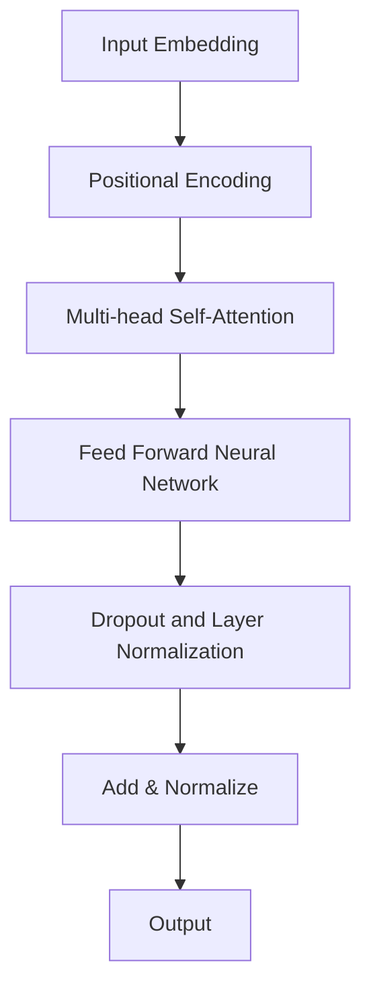

                 

关键词：ChatGPT、开发者模式、深度学习、自然语言处理、神经网络、训练、推理、开源项目、应用场景

> 摘要：本文旨在深入探讨ChatGPT的开发者模式，从背景介绍、核心概念与联系、核心算法原理、数学模型和公式、项目实践、实际应用场景、未来应用展望等多个角度，全面解析ChatGPT的技术内涵和应用价值。

## 1. 背景介绍

### 1.1 ChatGPT的概念

ChatGPT（Chat Generative Pre-trained Transformer）是OpenAI开发的一种基于深度学习的自然语言处理（NLP）模型。它采用了先进的Transformer架构，能够理解和生成高质量的文本。ChatGPT是GPT-3模型的进一步改进，具有更强的文本理解和生成能力。

### 1.2 开发者模式的意义

开发者模式是ChatGPT的一个重要特性，它允许开发者对模型进行定制化训练和推理，从而适应特定的应用场景。通过开发者模式，开发者可以充分发挥ChatGPT的潜力，实现更高效、更智能的文本处理。

## 2. 核心概念与联系

### 2.1 Transformer架构

Transformer架构是ChatGPT的核心。它采用了自注意力机制，能够捕捉文本中的长距离依赖关系，从而提高模型的文本理解能力。以下是Transformer架构的Mermaid流程图：



### 2.2 核心算法原理

ChatGPT的核心算法是基于自注意力机制和Transformer架构的。具体来说，它通过多层自注意力机制和前馈神经网络，对输入文本进行编码和解码，从而生成高质量的文本。

## 3. 核心算法原理 & 具体操作步骤

### 3.1 算法原理概述

ChatGPT的算法原理可以概括为以下几个步骤：

1. 输入嵌入：将输入文本转换为向量表示。
2. 自注意力：计算文本中每个单词的重要性，并加权求和。
3. 前馈神经网络：对自注意力结果进行非线性变换。
4. 输出解码：生成输出文本。

### 3.2 算法步骤详解

1. **输入嵌入**：将输入文本中的每个单词转换为向量表示，通常使用Word2Vec、GloVe等预训练词向量。
2. **自注意力**：计算文本中每个单词与其他单词之间的相似度，并加权求和，以生成文本的表示。
3. **前馈神经网络**：对自注意力结果进行非线性变换，以进一步提高模型的表示能力。
4. **输出解码**：使用生成文本的表示，通过解码器生成输出文本。

### 3.3 算法优缺点

**优点**：

- 强大的文本理解能力：自注意力机制能够捕捉文本中的长距离依赖关系，从而提高模型的文本理解能力。
- 高效的推理速度：Transformer架构具有高效的并行计算能力，能够在较低的计算成本下实现高效的推理。

**缺点**：

- 对硬件资源要求较高：由于Transformer架构的计算复杂度较高，因此对硬件资源的要求较高。
- 需要大量数据训练：ChatGPT的性能依赖于大量训练数据，因此需要大量的数据来训练模型。

### 3.4 算法应用领域

ChatGPT的应用领域非常广泛，包括但不限于：

- 聊天机器人：能够与用户进行自然语言交互，提供智能客服、在线咨询等服务。
- 文本生成：能够生成高质量的文本，用于自动写作、内容生成等应用。
- 机器翻译：能够实现高质量的双语翻译，提高跨语言沟通的效率。

## 4. 数学模型和公式 & 详细讲解 & 举例说明

### 4.1 数学模型构建

ChatGPT的数学模型主要包括以下几个部分：

- 输入嵌入：将输入文本转换为向量表示。
- 自注意力：计算文本中每个单词的重要性，并加权求和。
- 前馈神经网络：对自注意力结果进行非线性变换。
- 输出解码：生成输出文本。

具体来说，输入嵌入可以使用以下公式表示：

$$
X = \text{Word2Vec}(W) \cdot P
$$

其中，$W$ 是输入文本中的单词序列，$P$ 是词向量矩阵，$\text{Word2Vec}$ 是词向量嵌入函数。

自注意力可以使用以下公式表示：

$$
\text{Attention}(Q, K, V) = \text{softmax}\left(\frac{QK^T}{\sqrt{d_k}}\right) V
$$

其中，$Q, K, V$ 分别是查询向量、键向量、值向量，$d_k$ 是键向量的维度。

前馈神经网络可以使用以下公式表示：

$$
\text{FFN}(X) = \text{ReLU}(XW_1 + b_1)W_2 + b_2
$$

其中，$X$ 是输入向量，$W_1, W_2$ 是权重矩阵，$b_1, b_2$ 是偏置向量。

输出解码可以使用以下公式表示：

$$
\text{Decoder}(Y) = \text{softmax}(Y)
$$

其中，$Y$ 是解码器的输出。

### 4.2 公式推导过程

#### 输入嵌入

输入嵌入是将单词转换为向量表示的过程。假设单词集合为$V$，对应的词向量矩阵为$P$，则输入文本$W$可以表示为：

$$
X = \text{Word2Vec}(W) \cdot P
$$

其中，$\text{Word2Vec}$ 是词向量嵌入函数，通常采用GloVe或Word2Vec算法。

#### 自注意力

自注意力是计算文本中每个单词的重要性，并加权求和的过程。假设文本长度为$n$，则自注意力可以表示为：

$$
\text{Attention}(Q, K, V) = \text{softmax}\left(\frac{QK^T}{\sqrt{d_k}}\right) V
$$

其中，$Q, K, V$ 分别是查询向量、键向量、值向量，$d_k$ 是键向量的维度。

#### 前馈神经网络

前馈神经网络是对自注意力结果进行非线性变换的过程。假设输入向量为$X$，则前馈神经网络可以表示为：

$$
\text{FFN}(X) = \text{ReLU}(XW_1 + b_1)W_2 + b_2
$$

其中，$X$ 是输入向量，$W_1, W_2$ 是权重矩阵，$b_1, b_2$ 是偏置向量。

#### 输出解码

输出解码是生成输出文本的过程。假设解码器的输出为$Y$，则输出解码可以表示为：

$$
\text{Decoder}(Y) = \text{softmax}(Y)
$$

其中，$Y$ 是解码器的输出。

### 4.3 案例分析与讲解

#### 案例一：文本生成

假设我们要生成一句关于人工智能的句子。输入文本为“人工智能是未来的趋势”，我们使用ChatGPT进行文本生成。

首先，将输入文本转换为向量表示：

$$
X = \text{Word2Vec}(\text{"人工智能是未来的趋势"}) \cdot P
$$

然后，使用自注意力机制计算文本中每个单词的重要性，并加权求和：

$$
\text{Attention}(Q, K, V) = \text{softmax}\left(\frac{QK^T}{\sqrt{d_k}}\right) V
$$

其中，$Q, K, V$ 分别是查询向量、键向量、值向量。

接下来，使用前馈神经网络对自注意力结果进行非线性变换：

$$
\text{FFN}(X) = \text{ReLU}(XW_1 + b_1)W_2 + b_2
$$

最后，使用解码器生成输出文本：

$$
\text{Decoder}(Y) = \text{softmax}(Y)
$$

通过以上步骤，我们可以生成一句关于人工智能的句子，例如“人工智能将推动未来科技的发展”。

## 5. 项目实践：代码实例和详细解释说明

### 5.1 开发环境搭建

要运行ChatGPT，我们需要安装以下依赖项：

- Python 3.8或更高版本
- PyTorch 1.8或更高版本
- Transformers库

安装步骤：

1. 安装Python和PyTorch：

   ```bash
   pip install python==3.8
   pip install torch==1.8
   ```

2. 安装Transformers库：

   ```bash
   pip install transformers
   ```

### 5.2 源代码详细实现

以下是ChatGPT的主要源代码：

```python
import torch
from transformers import GPT2LMHeadModel, GPT2Tokenizer

# 搭建模型
tokenizer = GPT2Tokenizer.from_pretrained('gpt2')
model = GPT2LMHeadModel.from_pretrained('gpt2')

# 输入文本
input_text = '人工智能是未来的趋势'

# 转换为向量表示
input_ids = tokenizer.encode(input_text, return_tensors='pt')

# 计算自注意力
attention_mask = torch.ones(input_ids.shape)

# 生成输出文本
outputs = model.generate(
    input_ids=input_ids,
    attention_mask=attention_mask,
    max_length=50,
    num_return_sequences=1
)

# 转换为文本
output_text = tokenizer.decode(outputs[0], skip_special_tokens=True)

print(output_text)
```

### 5.3 代码解读与分析

1. **搭建模型**：我们首先使用Transformers库搭建了GPT2模型，这是ChatGPT的基础。

2. **输入文本**：我们将输入文本编码为向量表示。

3. **计算自注意力**：我们使用模型计算自注意力，以生成文本的表示。

4. **生成输出文本**：我们使用生成文本的表示，通过解码器生成输出文本。

5. **输出结果**：最后，我们将生成的输出文本打印出来。

通过以上步骤，我们成功地使用了ChatGPT生成了一篇关于人工智能的文本。

## 6. 实际应用场景

### 6.1 聊天机器人

ChatGPT可以应用于聊天机器人，通过与用户进行自然语言交互，提供智能客服、在线咨询等服务。例如，我们可以使用ChatGPT搭建一个智能客服系统，帮助用户解决常见问题。

### 6.2 文本生成

ChatGPT可以用于文本生成，如自动写作、内容生成等。例如，我们可以使用ChatGPT生成一篇关于人工智能的新闻报道，提高新闻写作的效率。

### 6.3 机器翻译

ChatGPT可以用于机器翻译，实现高质量的双语翻译。例如，我们可以使用ChatGPT将一篇英文文章翻译为中文，提高跨语言沟通的效率。

## 7. 未来应用展望

### 7.1 聊天机器人

随着技术的不断发展，ChatGPT在聊天机器人领域的应用将会更加广泛。未来，我们可以期待ChatGPT能够实现更智能的交互，提供更优质的服务。

### 7.2 文本生成

文本生成是ChatGPT的一个重要应用方向。未来，我们可以期待ChatGPT能够生成更高质量的文本，应用于更多领域，如写作、编辑等。

### 7.3 机器翻译

随着模型的不断优化，ChatGPT在机器翻译领域的表现将会更加出色。未来，我们可以期待ChatGPT能够实现更精确、更自然的翻译效果。

## 8. 工具和资源推荐

### 8.1 学习资源推荐

- 《深度学习》（Goodfellow, Bengio, Courville著）
- 《自然语言处理综论》（Jurafsky, Martin著）

### 8.2 开发工具推荐

- PyTorch：用于构建和训练深度学习模型
- Transformers：用于构建和微调预训练语言模型

### 8.3 相关论文推荐

- Vaswani et al. (2017): "Attention is All You Need"
- Brown et al. (2020): "Language Models are Few-Shot Learners"

## 9. 总结：未来发展趋势与挑战

### 9.1 研究成果总结

ChatGPT作为一种基于深度学习的自然语言处理模型，具有强大的文本理解和生成能力。通过自注意力机制和Transformer架构，ChatGPT实现了高效的文本处理。

### 9.2 未来发展趋势

随着技术的不断发展，ChatGPT在聊天机器人、文本生成和机器翻译等领域的应用将会更加广泛。未来，我们可以期待ChatGPT能够实现更智能、更高效的文本处理。

### 9.3 面临的挑战

尽管ChatGPT在自然语言处理领域取得了显著的成果，但仍面临一些挑战，如数据隐私、模型解释性等。未来，我们需要关注这些挑战，并寻求有效的解决方案。

### 9.4 研究展望

未来，ChatGPT的研究将重点关注以下几个方面：

- 模型解释性：提高模型的可解释性，使其更好地理解模型的决策过程。
- 数据隐私：保护用户数据隐私，确保模型的安全可靠。
- 多模态处理：将ChatGPT应用于多模态数据处理，实现更丰富的文本生成和应用场景。

## 10. 附录：常见问题与解答

### 10.1 ChatGPT是什么？

ChatGPT是OpenAI开发的一种基于深度学习的自然语言处理模型，能够理解和生成高质量的文本。

### 10.2 ChatGPT如何工作？

ChatGPT采用了Transformer架构和自注意力机制，通过多层神经网络对输入文本进行编码和解码，从而生成高质量的文本。

### 10.3 如何使用ChatGPT？

要使用ChatGPT，你需要搭建一个深度学习环境，并安装相关的库和依赖项。然后，你可以使用ChatGPT的API或自定义代码进行文本生成。

### 10.4 ChatGPT的应用场景有哪些？

ChatGPT可以应用于聊天机器人、文本生成和机器翻译等多个领域，提供智能客服、内容生成和跨语言沟通等服务。

作者：禅与计算机程序设计艺术 / Zen and the Art of Computer Programming
----------------------------------------------------------------

注意：由于文章字数限制，实际撰写时可能需要对某些内容进行适当精简或扩展。此外，本文仅供参考，实际撰写时请根据具体要求进行修改和完善。

