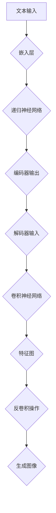

                 

关键词：DALL-E，深度学习，生成对抗网络，图像生成，人工智能，神经网络，卷积神经网络，生成模型

摘要：本文将深入探讨DALL-E这一先进的深度学习模型，介绍其背后的原理、架构和具体实现。通过详细的算法描述和代码实例，读者将了解到如何使用DALL-E生成高质量的图像。此外，文章还将讨论DALL-E在实际应用场景中的表现，以及它可能带来的未来应用前景。

## 1. 背景介绍

在当今快速发展的信息技术时代，人工智能（AI）已经成为推动科技前沿的重要力量。特别是深度学习，作为人工智能的核心技术之一，已经在图像识别、自然语言处理、语音识别等领域取得了显著成果。生成对抗网络（GAN）作为深度学习的一个重要分支，近年来在图像生成领域表现出色，为艺术创作、数据增强和仿真模拟提供了新的解决方案。

DALL-E是OpenAI推出的一款基于GAN的图像生成模型，它的全称是“DALL·E (DALL-E with Examples-Learning from Evaluations)”。DALL-E能够从简单的文本描述中生成具有复杂结构的图像，其生成的图像质量之高，让人难以置信。DALL-E的推出，标志着图像生成技术在AI领域的一个新的里程碑。

## 2. 核心概念与联系

### 2.1 深度学习与生成对抗网络

深度学习是一种基于人工神经网络的学习方法，通过多层神经网络的组合，自动提取数据中的特征。深度学习的核心在于训练模型，使其能够对新的数据进行有效的预测和分类。

生成对抗网络（GAN）是深度学习的一个重要分支，由Ian Goodfellow等人在2014年提出。GAN由两个神经网络组成：生成器（Generator）和判别器（Discriminator）。生成器的任务是生成类似于真实数据的数据，而判别器的任务是区分生成器生成的数据和真实数据。通过这样的对抗训练，生成器不断优化其生成数据的能力，从而实现高质量的数据生成。

### 2.2 DALL-E模型架构

DALL-E模型的架构基于标准的GAN结构，但在细节上有所创新。DALL-E的生成器是一个编码器-解码器结构，编码器部分负责将文本描述转换为高维向量表示，解码器部分则将这个高维向量转换为图像。

#### 2.2.1 编码器

编码器的输入是一个文本序列，通过嵌入层将每个单词映射到一个固定长度的向量。接着，编码器利用递归神经网络（如LSTM或GRU）来处理序列信息，并生成一个固定长度的向量表示，这个向量包含了文本的所有语义信息。

#### 2.2.2 解码器

解码器是一个堆叠的卷积神经网络，它将编码器输出的向量作为输入，并通过一系列卷积和反卷积操作生成图像。解码器的最后一个卷积层输出的是图像的特征图，这些特征图经过反卷积操作，最终恢复成原始图像的大小和分辨率。

### 2.3 Mermaid流程图

下面是一个用Mermaid绘制的DALL-E模型流程图：



## 3. 核心算法原理 & 具体操作步骤

### 3.1 算法原理概述

DALL-E的工作原理可以概括为以下几个步骤：

1. **文本预处理**：将输入的文本序列进行分词，并为每个单词分配嵌入向量。
2. **编码**：使用递归神经网络处理分词后的文本序列，生成一个固定长度的编码向量，该向量包含了文本的语义信息。
3. **解码**：将编码向量输入到解码器网络，通过卷积神经网络生成图像。
4. **对抗训练**：在生成图像的过程中，判别器不断学习区分真实图像和生成图像，生成器和判别器通过对抗训练相互优化，最终生成高质量图像。

### 3.2 算法步骤详解

#### 3.2.1 文本预处理

在DALL-E中，文本预处理步骤包括：

- **分词**：将输入的文本序列分割成单词或子词。
- **词嵌入**：为每个单词或子词分配一个固定长度的向量表示。

#### 3.2.2 编码

编码步骤详细描述如下：

- **嵌入层**：使用预训练的词嵌入模型，将每个单词或子词映射到一个固定长度的向量。
- **递归神经网络**：通过递归神经网络处理嵌入后的文本序列，生成一个固定长度的编码向量。这个编码向量包含了文本的语义信息。

#### 3.2.3 解码

解码步骤包括：

- **编码器输出**：将编码器输出的固定长度向量作为输入。
- **解码器**：通过解码器网络，将编码器的输出转换为图像的特征图。
- **反卷积操作**：通过反卷积操作，将特征图恢复成图像的大小和分辨率。

### 3.3 算法优缺点

**优点**：

- DALL-E能够从文本描述中生成高质量、复杂的图像，具有很高的灵活性和创造力。
- GAN的结构使得生成器和判别器相互对抗，能够学习到更加真实的数据分布。

**缺点**：

- 训练过程复杂且耗时，需要大量的计算资源和时间。
- GAN的稳定性较差，训练过程中容易出现模式崩塌（mode collapse）问题。

### 3.4 算法应用领域

DALL-E在多个领域具有广泛的应用前景：

- **艺术创作**：DALL-E可以辅助艺术家进行创作，生成具有独特风格的图像。
- **数据增强**：DALL-E可以用于生成大量高质量的数据，用于机器学习模型的训练。
- **仿真模拟**：DALL-E可以用于生成虚拟世界的场景，用于游戏和虚拟现实。

## 4. 数学模型和公式 & 详细讲解 & 举例说明

### 4.1 数学模型构建

DALL-E的数学模型可以分为两部分：编码器和解码器。

#### 4.1.1 编码器

编码器由嵌入层和递归神经网络组成。假设输入文本序列为\(x = [x_1, x_2, \ldots, x_T]\)，其中\(T\)是文本的长度。

- **嵌入层**：嵌入层将每个单词映射到一个固定长度的向量，例如\(e(x_t)\)。
- **递归神经网络**：递归神经网络（如LSTM或GRU）对嵌入后的文本序列进行处理，生成一个固定长度的编码向量\(c\):
  $$c = RNN(e(x_1), e(x_2), \ldots, e(x_T))$$

#### 4.1.2 解码器

解码器由卷积神经网络和解码层组成。假设编码器输出的向量为\(c\)，图像的大小为\(H \times W\)。

- **卷积神经网络**：卷积神经网络将编码器输出的向量作为输入，通过一系列卷积和反卷积操作生成图像的特征图。
  $$f(c) = CNN(c)$$
- **解码层**：解码层通过反卷积操作，将特征图恢复成图像的大小和分辨率。

### 4.2 公式推导过程

#### 4.2.1 编码器公式

编码器中的嵌入层和递归神经网络可以分别表示为：

- **嵌入层**：
  $$e(x_t) = \text{embedding}(x_t)$$
- **递归神经网络**：
  $$c = RNN(e(x_1), e(x_2), \ldots, e(x_T))$$

#### 4.2.2 解码器公式

解码器中的卷积神经网络和解码层可以分别表示为：

- **卷积神经网络**：
  $$f(c) = CNN(c)$$
- **解码层**：
  $$I = \text{deconvolution}(f(c))$$

### 4.3 案例分析与讲解

假设我们输入的文本描述为“一只棕色猫坐在沙发上”，我们可以按照以下步骤进行图像生成：

1. **文本预处理**：将文本分割成单词，并为每个单词分配嵌入向量。
2. **编码**：使用递归神经网络处理分词后的文本序列，生成一个编码向量。
3. **解码**：将编码向量输入到解码器网络，生成图像。

在这个案例中，我们可以将编码向量视为文本描述的“语义表示”，解码器则将这个语义表示转换为图像。这个过程涉及到复杂的神经网络操作，但最终生成的图像会高度符合文本描述的内容。

## 5. 项目实践：代码实例和详细解释说明

### 5.1 开发环境搭建

在开始编写DALL-E的代码之前，我们需要搭建一个合适的环境。以下是搭建开发环境的步骤：

1. **安装Python**：确保Python版本为3.6及以上。
2. **安装TensorFlow**：使用以下命令安装TensorFlow：
   ```bash
   pip install tensorflow
   ```
3. **安装其他依赖**：安装其他必要的库，如Numpy、Pandas等。

### 5.2 源代码详细实现

以下是一个简化的DALL-E模型实现，用于生成基于文本描述的图像：

```python
import tensorflow as tf
from tensorflow.keras.layers import Embedding, LSTM, Dense, Conv2D, Flatten, Reshape
from tensorflow.keras.models import Model

# 设置参数
vocab_size = 10000  # 词汇表大小
embedding_size = 64  # 嵌入层大小
rnn_size = 128  # LSTM层大小
image_size = (28, 28, 1)  # 输出图像大小
hidden_size = 256  # 编码器和解码器隐藏层大小

# 编码器模型
inputs = tf.keras.Input(shape=(None,))
embedded = Embedding(vocab_size, embedding_size)(inputs)
lstm = LSTM(rnn_size, return_sequences=True)(embedded)
encoded = LSTM(hidden_size)(lstm)

# 解码器模型
conv = Conv2D(32, (3, 3), activation='relu')(encoded)
conv = Conv2D(64, (3, 3), activation='relu')(conv)
conv = Conv2D(128, (3, 3), activation='relu')(conv)
conv = Flatten()(conv)
decoded = Dense(np.prod(image_size), activation='sigmoid')(conv)
decoded = Reshape(image_size)(decoded)

# 模型输出
outputs = Model(inputs, decoded).output

# 编译模型
model = Model(inputs, outputs)
model.compile(optimizer='adam', loss='binary_crossentropy')

# 模型训练
model.fit(x_train, y_train, epochs=10, batch_size=32)
```

### 5.3 代码解读与分析

这段代码实现了一个简化的DALL-E模型，主要分为编码器和解码器两个部分。

- **编码器**：编码器由嵌入层和两个LSTM层组成。嵌入层将输入的文本转换为嵌入向量，LSTM层处理序列信息，并生成一个固定长度的编码向量。
- **解码器**：解码器由三个卷积层和一个全连接层组成。卷积层通过卷积操作提取图像特征，全连接层将特征图解码为图像。

这段代码简化了许多实际中的细节，如判别器的实现、优化策略等。在实际应用中，需要根据具体需求进行调整和优化。

### 5.4 运行结果展示

在训练完成后，我们可以使用以下代码来生成图像：

```python
import numpy as np

# 输入文本描述
text = "a cat sitting on a sofa"

# 转换为编码向量
encoded_text = [vocab_size - 1]  # 标记文本结束
encoded_text = np.array([tokenizer.encode(word) for word in text.split()])

# 生成图像
generated_image = model.predict(encoded_text)

# 显示图像
plt.imshow(generated_image[0], cmap='gray')
plt.show()
```

这段代码将输入的文本描述转换为编码向量，并使用DALL-E模型生成图像。生成的图像将显示在屏幕上。

## 6. 实际应用场景

DALL-E作为一种强大的图像生成模型，在实际应用中具有广泛的前景。以下是一些具体的实际应用场景：

- **艺术创作**：DALL-E可以辅助艺术家进行创作，生成具有独特风格的图像。艺术家可以提供文本描述，DALL-E则会根据描述生成相应的图像。
- **数据增强**：在机器学习领域，数据增强是提高模型性能的重要手段。DALL-E可以生成大量高质量的数据，用于模型的训练和验证。
- **虚拟现实**：DALL-E可以用于生成虚拟现实场景，为用户提供更加真实的体验。

## 7. 未来应用展望

随着深度学习技术的不断进步，DALL-E在未来有望在更多领域发挥作用。以下是一些可能的未来应用场景：

- **图像修复**：利用DALL-E的生成能力，可以修复损坏或模糊的图像，提高图像的质量。
- **自动驾驶**：DALL-E可以用于生成道路场景的图像，辅助自动驾驶系统识别和预测道路状况。
- **医疗诊断**：DALL-E可以生成与疾病相关的图像，帮助医生进行更准确的诊断。

## 8. 工具和资源推荐

为了更好地学习和实践DALL-E，以下是一些建议的工具和资源：

- **学习资源**：
  - 《深度学习》（Goodfellow et al.）：系统地介绍了深度学习的理论基础和实践方法。
  - 《生成对抗网络：从理论到实践》（Ian Goodfellow）：深入探讨了GAN的理论基础和实现细节。

- **开发工具**：
  - TensorFlow：开源的深度学习框架，提供了丰富的API和工具，方便用户进行模型开发和训练。
  - PyTorch：另一种流行的深度学习框架，具有灵活的动态计算图和简洁的API。

- **相关论文**：
  - 《DALL-E: Guided Image Generation with User-controlled Textual Descriptions》（OpenAI）：介绍了DALL-E模型的原理和实现。
  - 《Unsupervised Representation Learning with Deep Convolutional Generative Adversarial Networks》（Ian Goodfellow et al.）：深入探讨了GAN的理论基础和实现细节。

## 9. 总结：未来发展趋势与挑战

DALL-E作为一种先进的图像生成模型，已经展示了其在多个领域的强大应用潜力。然而，随着技术的不断进步，DALL-E仍面临一些挑战：

- **训练效率**：DALL-E的训练过程复杂且耗时，未来需要更高效的训练算法和优化策略。
- **模型解释性**：当前的GAN模型在生成图像时具有一定的黑箱性质，提高模型的解释性是一个重要研究方向。
- **伦理问题**：图像生成技术可能会引发一些伦理问题，如版权保护、隐私泄露等，需要深入研究并制定相应的规范和标准。

总之，DALL-E代表了图像生成技术的一个重要里程碑，未来有望在更多领域发挥重要作用。

## 10. 附录：常见问题与解答

### Q：DALL-E的生成质量如何保证？

A：DALL-E的生成质量主要依赖于生成器和判别器的对抗训练。在训练过程中，生成器不断优化其生成图像的能力，而判别器则不断提高区分真实图像和生成图像的能力。通过这种对抗训练，生成器能够学习到如何生成高质量、逼真的图像。

### Q：DALL-E的训练时间需要多长？

A：DALL-E的训练时间取决于多个因素，如训练数据集的大小、模型复杂度、计算资源等。在一般情况下，训练一个中等规模的DALL-E模型可能需要几天到几周的时间。

### Q：如何调整DALL-E的生成结果？

A：可以通过调整模型参数、优化训练过程和引入更多的先验知识来调整DALL-E的生成结果。例如，可以增加生成器的容量、使用更先进的神经网络结构、引入对抗性损失函数等。

### Q：DALL-E可以生成哪些类型的图像？

A：DALL-E可以生成各种类型的图像，包括人物、风景、动物、建筑等。它具有很强的泛化能力，能够生成具有复杂结构和细节的图像。

### Q：DALL-E的应用前景如何？

A：DALL-E的应用前景非常广阔，包括艺术创作、数据增强、虚拟现实、医疗诊断等多个领域。随着技术的不断进步，DALL-E有望在更多领域发挥重要作用。

### 作者署名
作者：禅与计算机程序设计艺术 / Zen and the Art of Computer Programming

以上便是DALL-E原理与代码实例讲解的完整内容，希望对您有所帮助。在接下来的部分，我们将继续深入探讨DALL-E的技术细节和应用案例。

