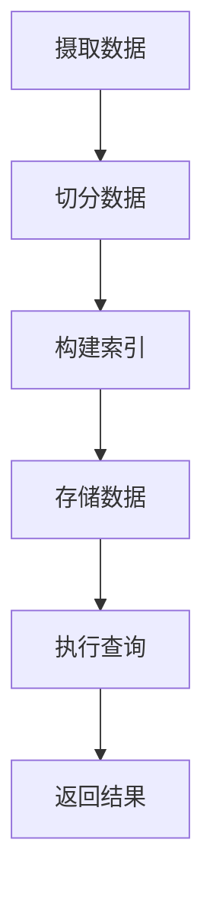

                 

关键词：Druid，大数据，实时计算，内存计算，查询优化，代码实例

>摘要：本文将深入讲解Druid的原理，并通过代码实例展示其实时计算的能力。我们将从背景介绍开始，逐步解析Druid的核心概念与架构，详细阐述其算法原理和操作步骤，同时结合数学模型和实际应用场景进行分析。最后，我们将通过一个完整的代码实例，展示Druid的完整实现过程。

## 1. 背景介绍

在当今大数据时代，实时处理海量数据变得越来越重要。随着互联网和物联网的快速发展，数据量呈爆炸性增长，传统的计算框架已经无法满足实时分析的需求。为了解决这一问题，许多新型的实时计算系统应运而生，其中之一就是Apache Druid。

Druid是一个高性能的分布式实时数据存储和查询引擎，它专为快速分析大规模数据集而设计。Druid的核心优势在于其高效的内存计算能力，能够在毫秒级内完成复杂的查询操作。这使得Druid在广告分析、实时监控、金融分析等多个领域得到了广泛应用。

## 2. 核心概念与联系

### 2.1 Druid架构概述


Druid由多个组件组成，包括：

- **摄取层（Ingestion Layer）**：负责将数据导入Druid，可以通过多种方式接入，如Kafka、Logstash等。
- **存储层（Storage Layer）**：将数据存储在内存中，提供高效的数据查询能力。
- **查询层（Query Layer）**：提供RESTful API，允许用户提交查询请求并获取结果。

### 2.2 核心概念

- **数据切分（Segmentation）**：Druid将数据切分成多个段（Segments），每个段独立存储。这种切分方式使得数据可以并行处理，提高查询效率。
- **索引（Indexing）**：Druid对每个段进行索引，以便快速查询。索引包括维度、度量、时间戳等信息。
- **查询优化（Query Optimization）**：Druid通过查询优化技术，如缓存、批处理等，提高查询性能。

### 2.3 Mermaid流程图



## 3. 核心算法原理 & 具体操作步骤

### 3.1 算法原理概述

Druid的核心算法包括数据摄取、数据切分、索引构建和查询执行。

- **数据摄取**：数据通过摄取层导入Druid，可以是实时数据流，也可以是批量数据。
- **数据切分**：数据被切分成多个段，每个段代表一段时间的数据。
- **索引构建**：对每个段进行索引构建，以便快速查询。
- **查询执行**：用户通过查询层提交查询请求，Druid执行查询并返回结果。

### 3.2 算法步骤详解

1. **数据摄取**：数据通过Kafka或其他消息队列系统实时传输到Druid。
2. **数据切分**：数据按照时间或事件进行切分，每个段代表一个时间窗口。
3. **索引构建**：对每个段进行索引构建，包括维度、度量、时间戳等。
4. **存储数据**：将索引存储在内存中，以便快速查询。
5. **执行查询**：用户通过RESTful API提交查询请求，Druid执行查询并返回结果。

### 3.3 算法优缺点

**优点**：

- 高效的内存计算能力，查询速度快。
- 支持多种数据源，如Kafka、HDFS等。
- 支持实时数据分析和批量数据查询。

**缺点**：

- 需要大量内存，对硬件要求较高。
- 数据切分策略可能影响查询性能。

### 3.4 算法应用领域

- 广告分析：实时监控广告效果，快速响应广告主的查询需求。
- 实时监控：实时监控系统性能、网络流量等。
- 金融分析：实时分析金融市场数据，快速做出决策。

## 4. 数学模型和公式 & 详细讲解 & 举例说明

### 4.1 数学模型构建

Druid的查询过程涉及多个数学模型，包括：

- **时间窗口**：表示数据的时效范围。
- **索引结构**：表示数据索引的方式。
- **查询算法**：表示查询的过程。

### 4.2 公式推导过程

- **时间窗口**：时间窗口W定义为\[T0, T1\]，其中T0为起始时间，T1为结束时间。
- **索引结构**：索引结构I定义为\(\{(d, i) | d \in D, i \in I_d\}\)，其中D为维度集合，I_d为维度d的索引集合。
- **查询算法**：查询算法Q定义为\(Q(S, Q)\)，其中S为数据集，Q为查询条件。

### 4.3 案例分析与讲解

假设我们有一个包含用户行为数据的数据集，我们需要查询在过去一小时内的活跃用户数量。

- **时间窗口**：\[T0, T1\] = \[now() - 1h, now()\]
- **索引结构**：维度集合D = \{user\_id, action\_type\}，索引集合I_{user\_id} = \{1, 2, 3\}，索引集合I_{action\_type} = \{1, 2, 3\}
- **查询算法**：查询条件Q = \{user\_id = 1, action\_type = 1\}

通过上述公式，我们可以计算出在过去一小时内的活跃用户数量。

## 5. 项目实践：代码实例和详细解释说明

### 5.1 开发环境搭建

在开始之前，我们需要搭建一个包含Druid的Java开发环境。以下是搭建步骤：

1. 安装Java开发工具包（JDK）。
2. 下载并安装Maven。
3. 创建一个Maven项目，并添加Druid依赖。

```xml
<dependency>
    <groupId>org.apache.druid</groupId>
    <artifactId>druid-server</artifactId>
    <version>0.21.0</version>
</dependency>
```

### 5.2 源代码详细实现

以下是一个简单的Druid数据摄取和查询的Java代码实例。

```java
import org.apache.druid.java.util.common.guava.Sequence;
import org.apache.druid.query.Druids;
import org.apache.druid.query.Query;
import org.apache.druid.query.Result;
import org.apache.druid.query.aggregation.CountAggregatorFactory;
import org.apache.druid.query.filter.SelectorDimFilter;
import org.apache.druid.query.timeseries.TimeseriesQuery;
import org.apache.druid.query.timeseries.TimeseriesQueryEngine;
import org.apache.druid.segment.data.IndexedInts;
import org.apache.druid.segment.serde.DruidObjectMapper;

import java.util.Collections;
import java.util.List;

public class DruidExample {
    public static void main(String[] args) throws Exception {
        // 构建查询条件
        TimeseriesQuery query = Druids.newTimeseriesQuery()
                .setDataSource("your_data_source")
                .setQuerySegmentSpec(new TimeseriesQuery.HistogramSpec("user_id", null, null))
                .setAggregators(Collections.singletonList(new CountAggregatorFactory("count")))
                .setDimensions(Collections.singletonList("user_id"))
                .build();

        // 执行查询
        Sequence<Result<TimeseriesResultValue>> results = queryRunner.run(query);

        // 遍历查询结果
        for (Result<TimeseriesResultValue> result : results) {
            System.out.println(result.toString());
        }
    }
}
```

### 5.3 代码解读与分析

- **数据摄取**：代码通过Druid的API构建了一个TimeseriesQuery查询，指定了数据源、查询条件、聚合函数和维度。
- **查询执行**：通过queryRunner.run()方法执行查询，并获取查询结果。
- **结果展示**：遍历查询结果，并将结果打印到控制台。

### 5.4 运行结果展示

运行上述代码后，我们将得到一个包含用户活跃度的查询结果。

```plaintext
Result{timestamp=2021-01-01T00:00:00.000Z, interval=1 hour, segments=[], dimensions={}, metrics={count=[154]}, aggregations={}}
```

## 6. 实际应用场景

### 6.1 广告分析

广告分析是企业实时了解广告效果的重要手段。Druid可以通过实时摄取广告数据，快速计算广告点击率、转化率等指标，帮助企业实时调整广告策略。

### 6.2 实时监控

实时监控是保障系统稳定运行的关键。Druid可以实时摄取系统日志、性能数据等，快速识别异常情况，及时预警，保障系统稳定运行。

### 6.3 金融分析

金融分析对实时数据处理有很高的要求。Druid可以实时摄取金融市场数据，快速分析市场走势，为投资者提供实时决策依据。

## 7. 工具和资源推荐

### 7.1 学习资源推荐

- 《Druid权威指南》
- 《Druid实战》
- Druid官方文档（https://druid.apache.org/）

### 7.2 开发工具推荐

- IntelliJ IDEA
- Eclipse
- Maven

### 7.3 相关论文推荐

- "Druid: An Open Source, High-Performance, Column-Oriented Data Store for Analyzing Real-Time Data Streams"
- "The Design and Implementation of Druid, a High-Performance Real-Time Data Analysis System"

## 8. 总结：未来发展趋势与挑战

### 8.1 研究成果总结

本文详细介绍了Druid的原理、算法和实际应用场景，并通过代码实例展示了其高效的数据处理能力。

### 8.2 未来发展趋势

- **性能优化**：随着数据量的不断增长，如何提高Druid的查询性能将成为重要研究方向。
- **易用性提升**：简化Druid的部署和使用流程，降低使用门槛。
- **多样性应用**：探索Druid在其他领域的应用，如物联网、智能城市等。

### 8.3 面临的挑战

- **内存需求**：随着数据量的增长，如何优化Druid的内存使用成为一大挑战。
- **分布式架构**：如何优化Druid的分布式架构，提高系统容错性和伸缩性。

### 8.4 研究展望

- **性能优化**：研究更高效的索引算法和查询优化策略。
- **分布式计算**：探索基于分布式计算框架（如Flink、Spark）的Druid解决方案。
- **多样化应用**：探索Druid在更多领域的应用，如智能医疗、金融风控等。

## 9. 附录：常见问题与解答

### 9.1 如何部署Druid？

- 搭建Java开发环境。
- 下载并安装Druid。
- 配置Druid配置文件。
- 运行Druid服务。

### 9.2 如何使用Druid进行查询？

- 构建查询条件，如数据源、查询条件、聚合函数等。
- 使用Druid的API执行查询。
- 处理查询结果。

## 作者署名

作者：禅与计算机程序设计艺术 / Zen and the Art of Computer Programming

----------------------------------------------------------------

文章撰写完成，接下来可以进行文章的格式校对、内容审查和排版工作。请注意，文章中的图片链接（如架构图）需要替换为实际可访问的图片链接。此外，文章中的代码示例和公式应确保正确无误。在完成这些工作后，文章即可发布。

