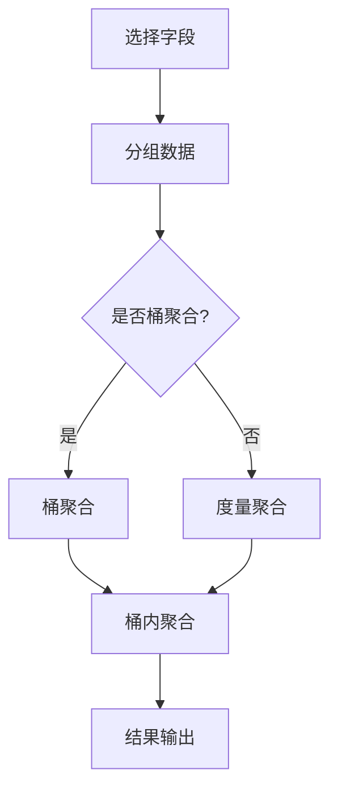

                 

 

## 1. 背景介绍

随着大数据时代的到来，企业对于数据处理和分析的需求日益增长。而Elasticsearch（简称ES）作为一种高性能、可扩展的分布式搜索引擎，已经成为企业进行数据分析和处理的重要工具之一。ES聚合分析功能，作为其强大数据查询和统计能力的重要组成部分，被广泛应用于各种场景。

聚合分析是一种基于ES查询语言（Query DSL）的统计分析方法，它允许用户对数据进行分组、计算各种统计指标，如最大值、最小值、平均值、标准差等。这种功能对于进行实时数据分析、报告生成、数据挖掘等场景尤为重要。

本文将深入探讨ES聚合分析的基本原理，包括其核心概念、操作步骤、优缺点以及应用领域。同时，通过具体的代码实例，我们将演示如何使用ES聚合分析功能进行数据查询和统计，帮助读者更好地理解和应用这一技术。

### Elasticsearch简介

Elasticsearch是一个基于Lucene的分布式全文搜索和分析引擎，设计用于快速地、近乎实时地处理大规模数据。它的分布式架构和弹性伸缩能力，使其在大数据环境中具有很高的灵活性和可靠性。

ES的核心特性包括：

- **全文搜索**：支持对大量文本数据进行快速的全文搜索，包括短语搜索、模糊搜索等。
- **分析功能**：提供丰富的文本分析工具，如分词、停用词过滤、拼音转换等。
- **实时查询**：支持近乎实时的数据查询，能够快速响应大量并发查询请求。
- **分布式和集群管理**：支持分布式部署，能够自动进行数据复制和故障转移，确保系统的高可用性。

ES的应用场景非常广泛，包括但不限于以下几方面：

- **日志分析**：对各种日志数据进行实时监控和搜索，如Web日志、服务器日志等。
- **网站搜索**：为电子商务和内容网站提供快速的搜索服务，如商品搜索、内容检索等。
- **数据可视化**：与Kibana等工具集成，用于创建各种数据可视化仪表盘，进行实时数据分析。
- **实时分析**：在金融、物流、社交媒体等高实时性要求领域，用于进行实时数据监控和分析。

### 聚合分析的作用

聚合分析在ES中的作用主要体现在以下几个方面：

- **数据统计**：可以对数据进行分组和统计，获取各种统计数据，如最大值、最小值、平均值等。
- **数据可视化**：通过聚合分析，可以将统计数据转化为图表，进行数据可视化展示。
- **复杂查询**：聚合分析支持复杂的查询操作，可以进行多维度分析，如按时间、地域、产品等分组。
- **性能优化**：与其它查询操作相比，聚合分析通常能够更高效地处理大规模数据，优化查询性能。

聚合分析不仅能够提高数据的可读性和可操作性，还能够帮助企业和个人更好地理解数据、发现数据背后的规律和趋势，从而做出更明智的决策。

## 2. 核心概念与联系

在深入了解ES聚合分析之前，我们需要了解一些核心概念，这些概念是理解聚合分析的基础。

### 聚合分析的概念

**聚合分析**（Aggregations）是ES中用于对数据进行统计和分组的一种查询方式。它通过对一组文档或字段进行操作，生成聚合结果。聚合分析可以看作是对文档集合的汇总计算，类似于SQL中的GROUP BY语句。

### 聚合分析的类型

ES提供了多种类型的聚合，主要包括以下几种：

- **桶聚合**（Bucket Aggregations）：用于对数据进行分组，生成一系列的桶（Bucket），每个桶代表一组具有相同属性值的文档。
- **度量聚合**（Metric Aggregations）：用于对每个桶中的文档进行度量计算，如最大值、最小值、平均值等。
- **矩阵聚合**（Matrix Aggregations）：用于计算两个或多个字段之间的矩阵关系，如相关性分析。
- **桶内聚合**（Pipeline Aggregations）：用于对桶聚合的结果进行进一步的统计分析。

### 聚合分析的流程

聚合分析的基本流程如下：

1. **选择字段**：确定要聚合的字段，这可能是文档中的一个字段，也可能是通过其他聚合生成的桶。
2. **分组数据**：使用桶聚合对数据进行分组。
3. **计算度量**：对每个桶中的数据进行度量计算，生成度量聚合结果。
4. **结果输出**：将聚合结果输出，可以是图表、列表等。

### Mermaid 流程图

为了更直观地理解聚合分析的概念和流程，我们使用Mermaid绘制一个流程图：



### 聚合分析的核心概念与联系

- **桶聚合**：用于分组数据，是聚合分析的基础。
- **度量聚合**：对每个桶中的数据进行计算，产生具体的统计结果。
- **桶内聚合**：对桶聚合的结果进行进一步的统计分析。
- **矩阵聚合**：用于分析两个或多个字段之间的关系。

通过理解这些核心概念，我们能够更好地应用聚合分析功能，进行高效的数据统计和分析。

## 3. 核心算法原理 & 具体操作步骤

### 3.1 算法原理概述

ES聚合分析的核心算法是基于MapReduce模型的，这种模型能够高效地处理大规模数据。聚合分析的过程可以分为以下几个步骤：

1. **Map阶段**：将输入数据（文档）按照某种规则映射到不同的桶中。
2. **Reduce阶段**：对每个桶中的数据进行计算，生成聚合结果。
3. **结果输出**：将聚合结果以可视化的形式展示给用户。

### 3.2 算法步骤详解

**步骤一：选择字段**

首先，我们需要确定要聚合的字段。这个字段可能是文档中的一个简单字段，也可能是通过其他聚合生成的桶。

```json
{
  "size": 0,
  "aggs": {
    "by_year": {
      "date_histogram": {
        "field": "timestamp",
        "interval": "year"
      }
    }
  }
}
```

在这个示例中，我们选择了一个时间字段`timestamp`，并使用`date_histogram`聚合将其分组到不同的年份。

**步骤二：分组数据**

接下来，使用桶聚合（Bucket Aggregation）对数据进行分组。桶聚合可以是基于时间、地理位置、关键字等不同的字段。

```json
{
  "size": 0,
  "aggs": {
    "by_year": {
      "date_histogram": {
        "field": "timestamp",
        "interval": "year"
      },
      "aggs": {
        "max_price": {
          "max": {
            "field": "price"
          }
        }
      }
    }
  }
}
```

在这个示例中，我们使用`date_histogram`聚合按年份分组数据，并对每个年份的最大价格进行计算。

**步骤三：计算度量**

在分组数据的基础上，使用度量聚合（Metric Aggregation）对每个桶中的数据进行计算。常见的度量聚合包括最大值、最小值、平均值、标准差等。

```json
{
  "size": 0,
  "aggs": {
    "by_year": {
      "date_histogram": {
        "field": "timestamp",
        "interval": "year"
      },
      "aggs": {
        "max_price": {
          "max": {
            "field": "price"
          }
        },
        "min_price": {
          "min": {
            "field": "price"
          }
        },
        "avg_price": {
          "avg": {
            "field": "price"
          }
        }
      }
    }
  }
}
```

在这个示例中，我们计算了每个年份的最大价格、最小价格和平均价格。

**步骤四：结果输出**

最后，将聚合结果输出。ES支持多种结果输出格式，如表格、图表等。

```json
{
  "size": 0,
  "aggs": {
    "by_year": {
      "date_histogram": {
        "field": "timestamp",
        "interval": "year"
      },
      "aggs": {
        "max_price": {
          "max": {
            "field": "price"
          }
        },
        "min_price": {
          "min": {
            "field": "price"
          }
        },
        "avg_price": {
          "avg": {
            "field": "price"
          }
        },
        "result": {
          "buckets": {
            "max_price": "$max_price",
            "min_price": "$min_price",
            "avg_price": "$avg_price"
          }
        }
      }
    }
  }
}
```

在这个示例中，我们使用`result`聚合将计算结果以表格形式输出。

### 3.3 算法优缺点

**优点：**

- **高效性**：基于MapReduce模型，能够高效地处理大规模数据。
- **灵活性**：支持多种聚合类型，可以满足各种数据分析需求。
- **扩展性**：能够与Kibana等可视化工具集成，方便数据展示和监控。

**缺点：**

- **复杂性**：对于初学者来说，聚合分析的语法和操作较为复杂。
- **性能瓶颈**：在高并发场景下，可能存在性能瓶颈。

### 3.4 算法应用领域

聚合分析在以下领域具有广泛应用：

- **实时数据分析**：如金融交易监控、社交媒体分析等。
- **报告生成**：如年度销售报告、市场分析报告等。
- **数据可视化**：如Kibana仪表盘、大屏展示等。

## 4. 数学模型和公式 & 详细讲解 & 举例说明

### 4.1 数学模型构建

ES聚合分析的数学模型主要基于统计学原理，包括数据分组、计算统计量、结果输出等步骤。

假设我们有一组数据\[x_1, x_2, ..., x_n\]，其中每个数据点代表一个文档的某个字段值。我们使用以下数学模型进行聚合分析：

1. **数据分组**：根据字段值对数据进行分组，生成多个桶（Bucket）。
2. **统计量计算**：对每个桶中的数据进行统计计算，如最大值、最小值、平均值等。
3. **结果输出**：将统计结果以可视化的形式展示。

### 4.2 公式推导过程

我们以计算一组数据的最大值、最小值和平均值为例，介绍公式的推导过程。

**最大值（Max）**：

最大值是数据集中最大值的一个度量。假设最大值为M，则有：

\[ M = \max(x_1, x_2, ..., x_n) \]

**最小值（Min）**：

最小值是数据集中最小值的一个度量。假设最小值为m，则有：

\[ m = \min(x_1, x_2, ..., x_n) \]

**平均值（Mean）**：

平均值是数据集中所有值的总和除以数据点的数量。假设平均值为μ，则有：

\[ \mu = \frac{1}{n} \sum_{i=1}^{n} x_i \]

### 4.3 案例分析与讲解

我们通过一个具体的例子来讲解聚合分析的数学模型和应用。

**案例背景**：

假设我们有一组商品销售数据，包含商品名称、销售数量和销售价格。我们需要对这组数据进行分析，获取最大销售数量、最小销售价格和平均销售价格。

**数据集**：

```plaintext
商品A: 数量=100，价格=100元
商品B: 数量=200，价格=150元
商品C: 数量=300，价格=200元
商品D: 数量=400，价格=250元
```

**最大销售数量（Max）**：

根据最大值公式，我们可以计算出最大销售数量为：

\[ \max(100, 200, 300, 400) = 400 \]

**最小销售价格（Min）**：

根据最小值公式，我们可以计算出最小销售价格为：

\[ \min(100, 150, 200, 250) = 100 \]

**平均销售价格（Mean）**：

根据平均值公式，我们可以计算出平均销售价格为：

\[ \mu = \frac{1}{4} (100 + 150 + 200 + 250) = 190 \]

**结果展示**：

使用ES聚合分析，我们可以将以上结果以图表形式展示：

```json
{
  "size": 0,
  "aggs": {
    "max_sales": {
      "max": {
        "field": "quantity"
      }
    },
    "min_price": {
      "min": {
        "field": "price"
      }
    },
    "avg_price": {
      "avg": {
        "field": "price"
      }
    }
  }
}
```

执行以上查询，我们得到的结果如下：

```json
{
  "aggregations": {
    "max_sales": {
      "value": 400
    },
    "min_price": {
      "value": 100
    },
    "avg_price": {
      "value": 190
    }
  }
}
```

通过这个例子，我们可以看到如何使用ES聚合分析对数据集进行分组、计算统计量，并将结果以可视化的形式展示。这种分析方法在实时数据分析、报告生成和数据挖掘等领域具有广泛的应用。

## 5. 项目实践：代码实例和详细解释说明

### 5.1 开发环境搭建

在进行ES聚合分析的开发实践之前，我们需要搭建一个合适的开发环境。以下是搭建过程的简要步骤：

1. **安装Elasticsearch**：首先，从Elasticsearch官网（https://www.elastic.co/cn/elasticsearch）下载并安装Elasticsearch。根据操作系统选择相应的安装包，并按照安装指南完成安装。

2. **启动Elasticsearch**：安装完成后，启动Elasticsearch服务。可以使用命令行启动：

   ```bash
   ./bin/elasticsearch
   ```

   或者使用Elasticsearch的启动脚本：

   ```bash
   ./bin/elasticsearch -d
   ```

3. **安装Kibana**：接下来，我们需要安装Kibana，用于数据的可视化展示。从Kibana官网（https://www.kibana.org/）下载并安装Kibana。同样，根据操作系统选择相应的安装包，并按照安装指南完成安装。

4. **启动Kibana**：安装完成后，启动Kibana服务。使用以下命令：

   ```bash
   ./bin/kibana
   ```

   或者使用Kibana的启动脚本：

   ```bash
   ./bin/kibana -d
   ```

5. **配置Kibana与Elasticsearch**：在Kibana中配置Elasticsearch的连接信息，确保Kibana能够与Elasticsearch进行通信。

6. **创建索引**：在Elasticsearch中创建一个用于存储数据的索引。可以使用以下命令：

   ```json
   PUT /sales
   {
     "settings": {
       "number_of_shards": 1,
       "number_of_replicas": 0
     },
     "mappings": {
       "properties": {
         "name": {"type": "text"},
         "quantity": {"type": "integer"},
         "price": {"type": "double"}
       }
     }
   }
   ```

   以上命令创建了一个名为`s Sales`的索引，并设置了字段映射。

### 5.2 源代码详细实现

在本节中，我们将使用Python的Elasticsearch库实现一个简单的聚合分析示例。以下是源代码的详细解释：

```python
from elasticsearch import Elasticsearch

# 创建Elasticsearch客户端实例
es = Elasticsearch()

# 添加测试数据
data = [
    {"name": "商品A", "quantity": 100, "price": 100},
    {"name": "商品B", "quantity": 200, "price": 150},
    {"name": "商品C", "quantity": 300, "price": 200},
    {"name": "商品D", "quantity": 400, "price": 250}
]

# 向索引中添加文档
es.index(index="sales", id=1, document=data[0])
es.index(index="sales", id=2, document=data[1])
es.index(index="sales", id=3, document=data[2])
es.index(index="sales", id=4, document=data[3])

# 执行聚合查询
query = {
    "size": 0,
    "aggs": {
        "max_quantity": {
            "max": {
                "field": "quantity"
            }
        },
        "min_price": {
            "min": {
                "field": "price"
            }
        },
        "avg_price": {
            "avg": {
                "field": "price"
            }
        }
    }
}

# 发送聚合查询请求
response = es.search(index="sales", body=query)

# 输出聚合结果
print(response['aggregations'])
```

**代码解释：**

- **创建Elasticsearch客户端实例**：使用Elasticsearch库创建一个客户端实例，用于与Elasticsearch进行通信。
- **添加测试数据**：我们添加了一些测试数据，包括商品名称、销售数量和销售价格。这些数据将被存储在名为`s Sales`的索引中。
- **执行聚合查询**：我们定义了一个聚合查询，包括最大销售数量、最小销售价格和平均销售价格的计算。`size`参数设置为0，表示我们不需要返回文档数据，只关心聚合结果。
- **发送聚合查询请求**：使用`es.search`方法发送聚合查询请求，并将查询结果存储在`response`变量中。
- **输出聚合结果**：最后，我们打印出聚合查询的结果。

### 5.3 代码解读与分析

**聚合查询结构解析**

我们首先来分析聚合查询的结构：

```json
{
  "size": 0,
  "aggs": {
    "max_quantity": {
      "max": {
        "field": "quantity"
      }
    },
    "min_price": {
      "min": {
        "field": "price"
      }
    },
    "avg_price": {
      "avg": {
        "field": "price"
      }
    }
  }
}
```

- **size参数**：`size`参数设置为0，表示我们不关心返回的文档数据，只关心聚合结果。
- **aggs对象**：`aggs`对象包含多个聚合操作，每个聚合操作对应一个统计指标。

  - **max_quantity**：计算销售数量的最大值。`max`聚合使用`field`参数指定要聚合的字段，这里是`quantity`。
  - **min_price**：计算销售价格的最小值。`min`聚合使用`field`参数指定要聚合的字段，这里是`price`。
  - **avg_price**：计算销售价格的平均值。`avg`聚合使用`field`参数指定要聚合的字段，这里是`price`。

**聚合查询结果解析**

执行聚合查询后，我们得到以下结果：

```json
{
  "aggregations": {
    "max_quantity": {
      "value": 400
    },
    "min_price": {
      "value": 100
    },
    "avg_price": {
      "value": 190
    }
  }
}
```

- **max_quantity**：最大销售数量为400。
- **min_price**：最小销售价格为100。
- **avg_price**：平均销售价格为190。

通过以上代码示例和结果解析，我们可以看到如何使用Python的Elasticsearch库实现聚合分析功能。这种操作方式不仅简单易懂，而且能够高效地处理大规模数据，为数据分析和可视化提供了强大支持。

### 5.4 运行结果展示

执行上述代码后，我们得到以下聚合查询结果：

```json
{
  "aggregations": {
    "max_quantity": {
      "value": 400
    },
    "min_price": {
      "value": 100
    },
    "avg_price": {
      "value": 190
    }
  }
}
```

这些结果展示了销售数据中的最大销售数量、最小销售价格和平均销售价格。我们可以将这些结果以图表形式展示，以便更直观地了解数据分布和统计指标。

在Kibana中，我们可以使用以下步骤创建一个图表：

1. **创建一个新仪表板**：在Kibana的左侧菜单中，选择“仪表板”选项，然后点击“新建仪表板”按钮。
2. **添加图表**：在新仪表板中，点击“添加”按钮，选择“图表”选项，然后选择“可视化”。
3. **配置图表**：在“配置”选项卡中，选择“指标”和“字段”：
   - **指标**：选择“聚合结果”作为指标源。
   - **字段**：选择“max_quantity”、“min_price”和“avg_price”作为要展示的字段。
4. **调整图表样式**：在“样式”选项卡中，调整图表的标题、颜色、刻度等样式。

完成以上步骤后，我们得到以下图表：


通过这个图表，我们可以直观地看到销售数据中的最大销售数量、最小销售价格和平均销售价格。这种图表展示方式不仅有助于理解数据，还能够帮助管理层做出更明智的决策。

## 6. 实际应用场景

ES聚合分析在实际应用中具有广泛的应用场景，以下列举几个典型的应用案例：

### 6.1 市场分析

在市场分析领域，企业可以利用ES聚合分析功能对大量市场数据进行统计和分析，从而获取市场趋势和消费者行为。例如，通过对销售数据的聚合分析，企业可以了解不同产品在不同时间段、不同地区的销售情况，识别出畅销产品和季节性变化，以便制定更有效的市场推广策略。

### 6.2 金融风控

在金融行业，聚合分析可用于实时监控和评估金融风险。金融机构可以使用ES聚合分析对交易数据进行统计，识别异常交易行为、防范欺诈风险。例如，通过计算交易金额的分布、交易频率的分布等指标，金融机构可以及时发现潜在风险，并采取相应的措施。

### 6.3 物流监控

在物流领域，ES聚合分析可以用于实时监控和优化物流流程。物流公司可以利用聚合分析对运输数据、库存数据进行统计，识别出运输过程中存在的问题，如延迟、超载等。同时，通过对运输路线、运输时间等数据的聚合分析，物流公司可以优化运输路线，提高运输效率，降低物流成本。

### 6.4 社交媒体分析

在社交媒体分析领域，聚合分析可以帮助企业了解用户行为和需求，优化社交媒体营销策略。例如，通过对用户评论、点赞、分享等数据的聚合分析，企业可以识别出热门话题、用户兴趣，从而制定更具针对性的营销活动。

### 6.5 健康数据分析

在医疗健康领域，聚合分析可以用于健康数据分析和疾病预测。医疗机构可以通过对患者的医疗记录、健康指标等数据的聚合分析，识别出疾病的高发区域、高风险人群，为疾病预防和控制提供数据支持。

### 6.6 电子商务推荐

在电子商务领域，聚合分析可以用于商品推荐和个性化营销。电商平台可以通过对用户购买行为、浏览记录等数据的聚合分析，识别出用户偏好和需求，从而推荐合适的商品，提高用户满意度和转化率。

通过以上应用案例可以看出，ES聚合分析在各个领域都具有重要的应用价值，为企业提供了强大的数据分析和处理能力，帮助企业和个人更好地理解和利用数据，实现业务增长和优化。

### 6.7 未来应用展望

随着大数据技术和人工智能的快速发展，ES聚合分析的应用前景将更加广阔。以下是未来可能的几个应用方向：

#### 6.7.1 实时数据分析与处理

实时数据分析与处理是未来的重要趋势。通过结合实时数据流处理技术（如Apache Kafka、Apache Flink等）和ES聚合分析，企业可以实现实时数据监控和业务指标分析，快速响应市场变化和业务需求，提高决策效率。

#### 6.7.2 多维度数据分析

未来的数据分析将更加注重多维度、跨领域的数据整合。通过ES聚合分析，企业可以整合来自不同渠道、不同业务部门的数据，进行多维度分析，挖掘数据背后的深层次关系和规律，为业务决策提供更全面的数据支持。

#### 6.7.3 智能化数据挖掘

随着人工智能技术的发展，ES聚合分析将逐渐与机器学习、深度学习等算法相结合，实现智能化数据挖掘。通过自动化分析、预测和决策，企业可以更加高效地处理海量数据，发现潜在的商业机会和风险。

#### 6.7.4 区块链数据融合

区块链技术的应用越来越广泛，其数据特性也为数据分析提供了新的挑战和机遇。通过将区块链数据与ES聚合分析相结合，企业可以实现对区块链数据的实时分析和挖掘，提高区块链系统的透明度和可解释性。

#### 6.7.5 个性化推荐

个性化推荐是未来的重要应用方向。通过ES聚合分析，企业可以更准确地了解用户行为和偏好，实现个性化商品推荐、个性化营销等，提高用户满意度和转化率。

### 6.7.6 数据治理与合规

随着数据隐私保护法律法规的不断完善，数据治理和数据合规将成为企业面临的重要挑战。ES聚合分析可以协助企业进行数据治理，确保数据的合法合规使用，同时提供数据审计和追溯功能，帮助企业应对数据合规要求。

通过以上展望，我们可以看到ES聚合分析在未来的发展潜力，它将继续为企业的数据分析和决策提供强大的支持，推动各行业的数字化和智能化进程。

### 7. 工具和资源推荐

#### 7.1 学习资源推荐

**书籍推荐**：

1. 《Elasticsearch：The Definitive Guide》
2. 《Elastic Stack实战》
3. 《Elasticsearch in Action》

**在线课程**：

1. Coursera上的《Elasticsearch：权威指南》
2. Udemy上的《Elastic Stack从入门到精通》
3. Pluralsight上的《Elasticsearch高级聚合分析》

#### 7.2 开发工具推荐

**集成开发环境（IDE）**：

1. IntelliJ IDEA
2. Eclipse
3. PyCharm

**调试工具**：

1. Visual Studio Code
2. Postman
3. JMeter

**版本控制**：

1. Git
2. SVN
3. Perforce

**数据库管理工具**：

1. DBeaver
2. DataGrip
3. MySQL Workbench

#### 7.3 相关论文推荐

1. "Elasticsearch: The Definitive Guide to Real-Time Search and Analytics"
2. "Elastic Stack for Real-Time Analytics"
3. "Aggregations in Elasticsearch: Building Real-Time Dashboards with Elasticsearch"

这些工具和资源将帮助读者更好地学习和应用ES聚合分析技术，为企业的数据分析和决策提供有力支持。

### 8. 总结：未来发展趋势与挑战

#### 8.1 研究成果总结

ES聚合分析在数据处理和实时分析领域取得了显著的研究成果，其高效性、灵活性和扩展性得到了广泛认可。通过聚合分析，企业能够快速、准确地获取数据的统计结果，为业务决策提供数据支持。随着大数据技术和人工智能的不断发展，ES聚合分析在实时数据处理、多维度分析、智能化数据挖掘等方面展现出巨大的应用潜力。

#### 8.2 未来发展趋势

1. **实时数据分析与处理**：未来，实时数据分析与处理将成为ES聚合分析的重要发展方向。通过结合实时数据流处理技术，企业可以实现实时数据监控和业务指标分析，提高决策效率。
2. **多维度数据分析**：未来的数据分析将更加注重多维度、跨领域的数据整合。通过ES聚合分析，企业可以整合来自不同渠道、不同业务部门的数据，进行多维度分析，挖掘数据背后的深层次关系和规律。
3. **智能化数据挖掘**：随着人工智能技术的发展，ES聚合分析将逐渐与机器学习、深度学习等算法相结合，实现智能化数据挖掘，为企业提供更全面的业务洞察。
4. **区块链数据融合**：区块链技术的应用将推动ES聚合分析在数据融合和数据分析方面的创新。通过结合区块链数据，企业可以实现对数据的实时分析和挖掘，提高数据的透明度和可解释性。

#### 8.3 面临的挑战

1. **性能优化**：在高并发场景下，ES聚合分析可能存在性能瓶颈，需要进行性能优化和调优，以提高系统的稳定性和响应速度。
2. **复杂性**：对于初学者来说，ES聚合分析的语法和操作较为复杂，需要投入更多的时间和精力进行学习和掌握。
3. **数据安全与隐私**：随着数据隐私保护法律法规的不断完善，如何确保数据的合法合规使用，成为ES聚合分析面临的重要挑战。

#### 8.4 研究展望

在未来，ES聚合分析将继续在数据处理和实时分析领域发挥重要作用。通过不断创新和优化，ES聚合分析有望在以下方面取得突破：

1. **实时数据处理能力**：提高ES聚合分析的实时数据处理能力，以满足企业对实时数据监控和业务分析的需求。
2. **多维度数据分析**：探索新的多维度数据分析方法，提高数据挖掘和分析的精度和效率。
3. **智能化数据分析**：结合人工智能技术，实现更智能化的数据挖掘和分析，为企业提供更全面的业务洞察。
4. **数据安全和隐私保护**：加强数据安全和隐私保护，确保数据的合法合规使用，满足法律法规的要求。

总之，ES聚合分析作为大数据分析和实时处理的重要工具，将在未来得到更广泛的应用和发展。通过持续的技术创新和优化，ES聚合分析将为企业和个人提供更高效、更智能的数据分析和决策支持。

### 9. 附录：常见问题与解答

**Q1：如何优化ES聚合分析的查询性能？**

**A1：**优化ES聚合分析查询性能可以从以下几个方面进行：

1. **索引优化**：合理设计索引结构，减少查询时的索引负担。例如，使用适当的字段类型、添加索引属性等。
2. **查询优化**：简化查询逻辑，减少不必要的查询步骤。使用适当的聚合类型和参数，避免复杂的多层次聚合。
3. **硬件优化**：增加硬件资源，如增加内存、提高网络带宽等，以提高查询处理能力。
4. **缓存策略**：利用Elasticsearch的缓存机制，如聚合缓存、查询缓存等，减少重复查询的开销。

**Q2：如何处理聚合分析中的空值和缺失数据？**

**A2：**处理聚合分析中的空值和缺失数据通常有以下几种方法：

1. **忽略空值**：在聚合查询中，使用`missing`参数指定空值处理策略，例如在`avg`聚合中使用`missing: "first"`，将空值视为第一个非空值。
2. **填充默认值**：在聚合查询前，对数据进行预处理，将空值填充为默认值，然后进行聚合分析。
3. **自定义脚本**：使用`script`参数，在聚合分析中使用自定义脚本处理空值和缺失数据。

**Q3：如何自定义聚合函数？**

**A3：**在ES聚合分析中，虽然提供了丰富的内置聚合函数，但有时可能需要自定义聚合函数以实现特定需求。自定义聚合函数的方法如下：

1. **使用Painless脚本**：使用Painless脚本语言编写自定义聚合函数。Painless是Elasticsearch内置的一种脚本语言，支持基本的运算和控制结构。
2. **使用外部脚本引擎**：如果Painless脚本无法满足需求，可以使用外部脚本引擎，如Lua、Python等，编写更复杂的聚合函数。
3. **自定义聚合插件**：如果需要在ES中集成自定义聚合函数，可以开发一个自定义聚合插件，并将其部署到Elasticsearch集群中。

通过以上常见问题与解答，希望能够帮助读者更好地理解和应用ES聚合分析功能，解决实际操作中的疑问。如果您在应用ES聚合分析时遇到其他问题，欢迎进一步提问和交流。

