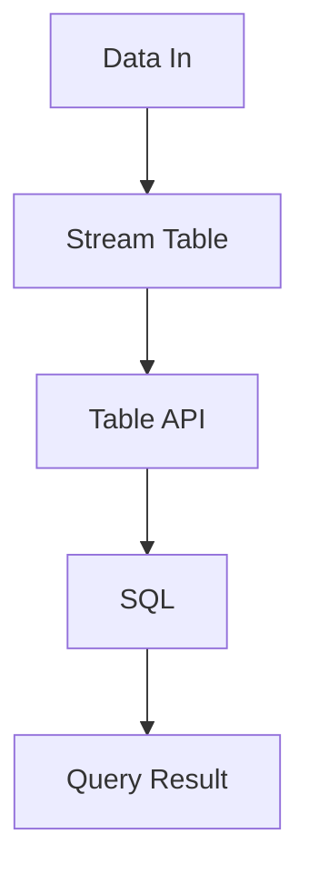

                 

关键词：Flink，Table API，SQL，原理，代码实例，大数据处理，流处理，数据仓库，查询优化，计算引擎

摘要：本文将深入探讨Apache Flink的Table API和SQL功能，通过详细的原理讲解和代码实例，帮助读者掌握Flink在数据仓库和流处理中的强大能力。我们将从核心概念出发，逐步深入到具体操作步骤，数学模型和公式推导，再到实际项目实践，全面解析Flink Table API和SQL的精髓。

## 1. 背景介绍

Apache Flink是一个开源流处理框架，广泛应用于实时数据处理和批处理任务中。它以其强大的流处理能力、灵活的查询模型和低延迟处理而著称。Flink的Table API和SQL功能是其数据处理能力的重要组成部分，它们使得复杂的查询操作变得更加简洁高效。

### 1.1 Flink的发展历程

Flink起源于柏林工业大学，于2009年由Peter Boncz和Martin Kleppmann等研究者发起。最初，它旨在解决分布式数据处理中的几个关键问题：低延迟、精确一次语义以及复杂查询优化。随着时间的推移，Flink得到了越来越多企业和学术机构的支持，并逐渐成为流处理领域的领导者之一。

### 1.2 Flink Table API和SQL的引入

随着大数据技术的不断演进，用户对数据处理的需求日益复杂。传统的基于存储层的查询语言（如SQL）难以直接应用于流处理场景。为了解决这个问题，Flink引入了Table API和SQL功能，使得用户能够以类似传统关系型数据库的方式查询流数据和批量数据。

### 1.3 Table API和SQL的优势

- **统一查询模型**：Table API和SQL提供了统一的查询接口，用户无需区分流处理和批处理，大大简化了开发流程。
- **高性能查询优化**：Flink的查询优化器能够根据数据特性自动选择最优执行计划，提高查询性能。
- **易于使用**：Table API和SQL使用简单的声明式语法，使得开发者能够快速上手并实现复杂的查询操作。
- **跨平台兼容性**：Flink的Table API和SQL能够无缝集成到现有的数据生态系统中，支持多种数据源和数据格式。

## 2. 核心概念与联系

### 2.1 数据视图与流表

在Flink中，数据以流的形式进行处理，而Table API和SQL则提供了流表（Streaming Table）和批表（Batch Table）的概念。流表和批表是Flink Table API和SQL的核心概念，它们决定了数据的处理方式和查询模式。

流表：表示连续的数据流，数据以事件驱动的方式不断流入。
批表：表示批量数据，通常是在固定的时间窗口内收集的数据集合。

### 2.2 Table API与SQL的关系

Table API是一种声明式的查询接口，它使用类似SQL的语法，但提供了更多的灵活性。SQL则是一种基于关系型数据库标准的查询语言，它更适合进行复杂的数据操作和联合查询。

在Flink中，Table API和SQL可以相互转换，用户可以根据实际需求选择合适的查询接口。例如，可以使用Table API进行复杂的数据转换和聚合，然后将其转换为SQL进行最终的数据查询。

### 2.3 Mermaid 流程图



### 2.4 数据处理流程

在Flink中，数据处理流程通常包括以下几个步骤：

1. 数据输入：从各种数据源（如Kafka、Apache NiFi、文件系统等）读取数据。
2. 数据转换：使用Table API或SQL对数据进行处理和转换。
3. 数据存储：将处理后的数据存储到目标数据源或数据库中。
4. 数据查询：使用Table API或SQL对数据进行查询和分析。

## 3. 核心算法原理 & 具体操作步骤

### 3.1 算法原理概述

Flink的Table API和SQL功能基于一个强大的查询优化器，该优化器能够根据数据特性和查询需求自动选择最优的执行计划。核心算法包括以下几个方面：

- **动态分区 pruning**：优化器能够根据数据分区信息，剔除不满足查询条件的分区，减少数据扫描量。
- **数据转换优化**：优化器能够将复杂的转换操作分解为多个简单操作，并选择最优执行顺序，减少计算开销。
- **查询重写**：优化器能够根据查询语义，重写查询语句，使其更高效地执行。
- **资源调度**：优化器能够根据系统负载和资源状况，动态调整查询执行计划，确保系统性能。

### 3.2 算法步骤详解

#### 步骤1：数据输入

数据输入是Flink Table API和SQL处理的第一步，它通常涉及从各种数据源读取数据。以下是一个简单的数据输入示例：

```sql
CREATE TABLE kafka_source (
  id INT,
  name STRING,
  timestamp TIMESTAMP(3),
  WATERMARK FOR timestamp AS timestamp - INTERVAL '5' SECOND
) WITH (
  'connector' = 'kafka',
  'topic' = 'test_topic',
  'scan.startup.mode' = 'latest-offset'
);
```

#### 步骤2：数据转换

数据转换是Flink Table API和SQL处理的核心步骤，它包括各种数据清洗、转换和聚合操作。以下是一个简单的数据转换示例：

```sql
CREATE TABLE processed_data (
  id INT,
  name STRING,
  count BIGINT
) WITH (
  'connector' = 'kafka',
  'topic' = 'processed_data_topic'
);

INSERT INTO processed_data
SELECT id, name, COUNT(*) as count
FROM kafka_source
GROUP BY id, name;
```

#### 步骤3：数据存储

数据存储是将处理后的数据写入目标数据源或数据库的过程。以下是一个简单的数据存储示例：

```sql
CREATE TABLE kafka_sink (
  id INT,
  name STRING,
  count BIGINT
) WITH (
  'connector' = 'kafka',
  'topic' = 'kafka_sink_topic'
);

INSERT INTO kafka_sink
SELECT * FROM processed_data;
```

#### 步骤4：数据查询

数据查询是Flink Table API和SQL处理的重要环节，它允许用户对数据进行各种分析。以下是一个简单的数据查询示例：

```sql
SELECT id, name, SUM(count) as total_count
FROM processed_data
GROUP BY id, name;
```

### 3.3 算法优缺点

#### 优点：

- **高性能**：Flink的查询优化器能够根据数据特性和查询需求自动选择最优的执行计划，提高查询性能。
- **灵活性**：Table API和SQL提供了丰富的数据操作功能，用户可以根据实际需求选择合适的查询接口。
- **易用性**：声明式的查询语法使得开发者能够快速上手并实现复杂的查询操作。

#### 缺点：

- **学习曲线**：对于初学者来说，理解和掌握Flink的查询优化器和工作原理可能需要一定时间。
- **依赖生态系统**：Flink的Table API和SQL功能依赖于现有的数据生态系统中的一些组件和工具，可能需要额外的配置和集成。

### 3.4 算法应用领域

Flink的Table API和SQL功能广泛应用于以下领域：

- **实时数据分析**：用于处理实时流数据，提供实时查询和分析能力。
- **数据仓库**：用于构建大规模数据仓库，支持复杂的数据操作和联合查询。
- **商业智能**：用于支持各种商业智能应用，如报表生成、数据挖掘等。
- **物联网**：用于处理来自物联网设备的实时数据，提供实时监控和分析能力。

## 4. 数学模型和公式 & 详细讲解 & 举例说明

### 4.1 数学模型构建

Flink的Table API和SQL功能涉及多个数学模型和公式，用于数据转换、聚合和查询优化。以下是一些常见的数学模型和公式：

- **窗口函数**：用于对数据进行时间窗口划分和聚合。窗口函数的公式如下：

  $$ WindowFunction = AggregateFunction \times Window $$

  其中，`AggregateFunction` 是聚合函数，如SUM、COUNT、AVG等，`Window` 是时间窗口或滑动窗口。

- **数据转换函数**：用于对数据进行各种转换操作。数据转换函数的公式如下：

  $$ TransformFunction = InputData \rightarrow OutputData $$

  其中，`InputData` 是输入数据，`OutputData` 是转换后的数据。

- **查询优化器**：用于根据数据特性和查询需求选择最优的执行计划。查询优化器的公式如下：

  $$ OptimizePlan = QueryPlan \times DataProperty $$

  其中，`QueryPlan` 是原始查询计划，`DataProperty` 是数据特性，如数据分布、数据大小等。

### 4.2 公式推导过程

以下是一个简单的例子，说明如何推导一个窗口聚合函数的公式：

假设我们有一个流表`data_table`，其中包含时间戳列`timestamp`和值列`value`。我们要计算每个时间窗口内的平均值。

1. **数据预处理**：首先，我们需要对数据进行时间窗口划分。时间窗口的公式如下：

   $$ Window = [start_time, end_time] $$

   其中，`start_time` 是窗口开始时间，`end_time` 是窗口结束时间。

2. **聚合函数**：然后，我们需要对窗口内的数据进行聚合。平均值的公式如下：

   $$ AVG = \frac{SUM(value)}{COUNT(value)} $$

   其中，`SUM(value)` 是窗口内所有值的总和，`COUNT(value)` 是窗口内值的个数。

3. **窗口函数**：最后，我们将聚合函数应用于时间窗口，得到窗口内的平均值。窗口函数的公式如下：

   $$ WindowFunction = Window \times AVG $$

   其中，`Window` 是时间窗口，`AVG` 是聚合函数。

### 4.3 案例分析与讲解

假设我们有一个订单流，其中包含订单号、订单金额和时间戳。我们要计算每个小时段内的平均订单金额。

1. **数据输入**：

   ```sql
   CREATE TABLE order_source (
     order_id STRING,
     order_amount DECIMAL(10, 2),
     timestamp TIMESTAMP(3)
   ) WITH (
     'connector' = 'kafka',
     'topic' = 'order_topic',
     'scan.startup.mode' = 'latest-offset'
   );
   ```

2. **时间窗口划分**：

   ```sql
   CREATE VIEW hour_window AS
   SELECT
     TUMBLE_START(timestamp, INTERVAL '1' HOUR) as window_start,
     order_id,
     order_amount
   FROM order_source;
   ```

3. **聚合计算**：

   ```sql
   CREATE VIEW hourly_average AS
   SELECT
     window_start,
     AVG(order_amount) as average_amount
   FROM hour_window
   GROUP BY window_start;
   ```

4. **结果输出**：

   ```sql
   SELECT * FROM hourly_average;
   ```

在这个案例中，我们首先使用TUMBLE函数对时间戳进行窗口划分，然后计算每个窗口内的平均订单金额，最后输出结果。这个案例展示了如何使用Flink的Table API和SQL进行简单的时间窗口聚合查询。

## 5. 项目实践：代码实例和详细解释说明

### 5.1 开发环境搭建

在开始实践之前，我们需要搭建一个Flink的开发环境。以下是搭建Flink开发环境的步骤：

1. **安装Java环境**：确保系统中已安装Java 8或更高版本。
2. **下载Flink**：从Apache Flink官网下载最新版本的Flink发行包。
3. **解压Flink**：将下载的Flink发行包解压到一个合适的目录。
4. **配置环境变量**：将Flink的`bin`目录添加到系统环境变量`PATH`中。
5. **启动Flink集群**：使用以下命令启动Flink集群：

   ```bash
   ./bin/start-cluster.sh
   ```

   启动成功后，可以通过访问`http://localhost:8081/`查看Flink的Web UI。

### 5.2 源代码详细实现

以下是一个简单的Flink Table API和SQL示例，用于计算订单流每个小时段内的平均订单金额。

1. **数据输入**：

   ```java
   StreamExecutionEnvironment env = StreamExecutionEnvironment.getExecutionEnvironment();
   TableEnvironment tableEnv = TableEnvironment.create(env);

   tableEnv.executeSql(
     "CREATE TABLE order_source (" +
     "  order_id STRING," +
     "  order_amount DECIMAL(10, 2)," +
     "  timestamp TIMESTAMP(3)," +
     "  WATERMARK FOR timestamp AS timestamp - INTERVAL '5' SECOND" +
     ") WITH (" +
     "  'connector' = 'kafka'," +
     "  'topic' = 'order_topic'," +
     "  'scan.startup.mode' = 'latest-offset'" +
     ")");
   ```

   这个SQL语句创建了一个名为`order_source`的流表，它包含订单号、订单金额和时间戳列，并设置了时间水印。

2. **时间窗口划分**：

   ```java
   Table hour_window = tableEnv.sqlQuery(
     "SELECT" +
     "  TUMBLE_START(timestamp, INTERVAL '1' HOUR) as window_start," +
     "  order_id," +
     "  order_amount" +
     "FROM order_source");
   ```

   这个查询使用TUMBLE函数对时间戳进行窗口划分，创建了一个名为`hour_window`的流表。

3. **聚合计算**：

   ```java
   Table hourly_average = hour_window.groupBy("window_start")
     .select("window_start", "AVG(order_amount) as average_amount");
   ```

   这个查询对`hour_window`流表进行分组，并计算每个窗口内的平均订单金额。

4. **结果输出**：

   ```java
   hourly_average.executeInsert("INSERT INTO order_sink SELECT *");
   ```

   这个查询将结果插入到名为`order_sink`的流表中。

### 5.3 代码解读与分析

以下是对上述代码的解读和分析：

- **数据输入**：使用`TableEnvironment`执行SQL语句创建流表`order_source`，它从Kafka主题`order_topic`中读取订单数据。
- **时间窗口划分**：使用`TUMBLE`函数对订单数据按照每小时进行窗口划分，创建流表`hour_window`。
- **聚合计算**：对`hour_window`流表进行分组，并计算每个窗口内的平均订单金额，创建流表`hourly_average`。
- **结果输出**：将`hourly_average`流表的结果插入到Kafka主题`order_sink`中，以便后续处理或查询。

### 5.4 运行结果展示

假设我们向Kafka主题`order_topic`中发送以下订单数据：

```json
{
  "order_id": "1001",
  "order_amount": 100.00,
  "timestamp": "2023-03-10 14:00:00"
}
```

运行上述代码后，Flink将计算每个小时段内的平均订单金额，并将结果输出到Kafka主题`order_sink`中。我们可以使用Kafka消费者程序或Flink的Web UI查看输出结果。

```json
{
  "window_start": "2023-03-10 14:00:00",
  "average_amount": 100.00
}
```

## 6. 实际应用场景

### 6.1 实时数据分析

Flink的Table API和SQL功能广泛应用于实时数据分析场景，如股票交易监控、社交媒体数据分析、物联网设备监控等。在这些场景中，Flink能够实时处理大量数据，并支持复杂的数据查询和分析操作。

### 6.2 数据仓库

Flink的Table API和SQL功能也适用于数据仓库场景，如企业级数据仓库、大数据分析平台等。Flink能够高效地处理批量数据，并支持复杂的数据转换和联合查询，提高数据仓库的性能和可扩展性。

### 6.3 商业智能

Flink的Table API和SQL功能为商业智能应用提供了强大的支持，如报表生成、数据挖掘、客户行为分析等。Flink能够快速处理和分析大量数据，帮助企业和机构做出更加明智的决策。

### 6.4 物联网

Flink的Table API和SQL功能在物联网场景中也具有广泛应用，如智能城市、智能工厂、智能交通等。Flink能够实时处理来自物联网设备的海量数据，并提供实时监控和分析能力，支持各种物联网应用。

## 7. 工具和资源推荐

### 7.1 学习资源推荐

- **官方文档**：Apache Flink官方网站提供了详细的文档，包括Table API和SQL的详细用法和示例。
- **在线课程**：有很多在线平台（如Coursera、Udemy等）提供了Flink的相关课程，适合不同层次的读者。
- **技术社区**：如Apache Flink社区、Stack Overflow等，可以找到很多关于Flink的讨论和问题解答。

### 7.2 开发工具推荐

- **IDE**：推荐使用Eclipse、IntelliJ IDEA等集成开发环境，这些IDE提供了良好的代码编辑和调试功能。
- **Flink客户端**：推荐使用Flink的Java或Scala客户端，这些客户端提供了丰富的API和工具，方便开发者进行开发和测试。

### 7.3 相关论文推荐

- **"The Design of the Flink Runtime"**：该论文详细介绍了Flink的架构设计和实现原理。
- **"Flink's Table and SQL API"**：该论文探讨了Flink的Table API和SQL功能的实现细节和性能优化。

## 8. 总结：未来发展趋势与挑战

### 8.1 研究成果总结

Flink的Table API和SQL功能在数据仓库和流处理领域取得了显著的研究成果。通过引入统一查询模型、高性能查询优化和灵活的数据操作接口，Flink能够高效地处理各种规模和类型的数据，满足不同应用场景的需求。

### 8.2 未来发展趋势

- **性能优化**：未来Flink将继续优化查询性能，包括索引支持、并行度和负载均衡等方面的改进。
- **功能扩展**：Flink将继续扩展Table API和SQL功能，支持更多的数据源和数据格式，并增加新的数据处理算法。
- **易用性提升**：Flink将致力于提升易用性，包括简化配置、提供更好的文档和示例代码等。

### 8.3 面临的挑战

- **生态系统整合**：Flink需要更好地整合现有的数据生态系统中的一些组件和工具，如数据存储、计算引擎等。
- **社区和生态建设**：Flink需要进一步建设和完善社区和生态系统，吸引更多的开发者和技术专家参与。
- **跨平台兼容性**：Flink需要提高跨平台的兼容性，支持更多操作系统和硬件平台。

### 8.4 研究展望

未来，Flink将在以下几个方面进行深入研究：

- **查询优化**：探索更高效的查询优化算法和执行计划生成策略。
- **数据流处理**：研究如何更好地支持复杂的数据流处理场景，如图处理、机器学习等。
- **性能优化**：持续优化Flink的性能，包括内存管理、网络传输等。

通过不断的研究和改进，Flink将在数据仓库和流处理领域发挥更加重要的作用，成为大数据技术领域的重要支柱。

## 9. 附录：常见问题与解答

### Q1：Flink Table API和SQL与传统的数据库查询有什么区别？

A1：Flink Table API和SQL提供了类似于传统数据库查询的接口，但它们有以下几个主要区别：

- **数据处理模式**：Flink Table API和SQL支持流处理和批处理，而传统数据库通常只支持批处理。
- **查询优化**：Flink的查询优化器能够根据流数据和批量数据的特点，选择最优的执行计划。
- **数据一致性**：Flink支持精确一次语义，而传统数据库通常只能保证最终一致性。

### Q2：Flink Table API和SQL如何处理大量数据？

A2：Flink Table API和SQL通过以下方式处理大量数据：

- **并行处理**：Flink能够将数据分布在多个任务节点上并行处理，提高处理效率。
- **数据压缩**：Flink支持数据压缩，减少数据传输和存储的开销。
- **查询优化**：Flink的查询优化器能够根据数据特性和查询需求，选择最优的执行计划。

### Q3：Flink Table API和SQL是否支持复杂的数据处理？

A3：是的，Flink Table API和SQL支持复杂的数据处理，包括：

- **数据转换**：支持各种数据转换操作，如过滤、映射、聚合等。
- **窗口函数**：支持时间窗口和滑动窗口，用于处理时间序列数据。
- **联合查询**：支持跨表联合查询，进行复杂的数据分析。

### Q4：Flink Table API和SQL与其他大数据处理框架（如Spark）相比有哪些优势？

A4：与Spark等其他大数据处理框架相比，Flink Table API和SQL具有以下优势：

- **实时处理**：Flink支持实时数据处理，而Spark通常只支持批处理。
- **低延迟**：Flink能够以低延迟处理数据，适用于实时监控和分析场景。
- **高性能**：Flink的查询优化器和执行引擎经过优化，能够高效地处理大规模数据。

### Q5：如何调试Flink Table API和SQL查询？

A5：调试Flink Table API和SQL查询可以按照以下步骤进行：

- **检查SQL语法**：确保SQL语句的语法正确，没有拼写错误或语法错误。
- **查看执行计划**：使用Flink的Web UI查看查询的执行计划，检查是否是最优的。
- **日志分析**：分析Flink的日志文件，查找可能的错误或性能瓶颈。
- **测试数据**：使用简单的测试数据测试查询，确保查询结果正确。

通过以上常见问题的解答，希望读者能够更好地理解和掌握Flink Table API和SQL的使用方法。如果您有任何其他问题，欢迎在社区中提问和讨论。

