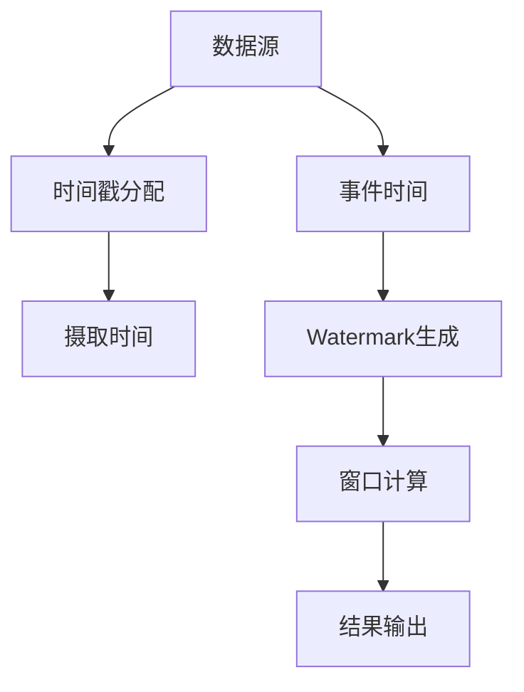

                 

Flink作为一款大数据处理框架，其核心在于对时间和窗口的管理。理解Flink Time原理，对于高效处理时间序列数据至关重要。本文将深入探讨Flink Time的概念、原理，并通过实例代码展示如何在实际应用中运用这些原理。

## 关键词

- Flink
- 时间处理
- 窗口
- Watermark
- 时间事件

## 摘要

本文旨在介绍Flink Time原理，包括其核心概念、工作流程以及如何在代码中实现。通过本文的学习，读者将能够理解Flink Time的基本原理，并能够独立完成基于Flink的时间处理任务。

### 1. 背景介绍

随着互联网和大数据技术的飞速发展，数据生成速度越来越快，处理这些数据所需要的时间管理也变得越来越复杂。在数据流处理领域，对时间的精确管理是一个重要的课题。Flink作为一款分布式流处理框架，其强大的时间处理能力，使得它在大数据处理中得到了广泛的应用。

Flink Time的核心在于对事件时间的处理，确保数据在正确的顺序和时间戳上进行处理。时间处理在实时分析、流数据处理、窗口计算等方面具有重要意义。

### 2. 核心概念与联系

Flink中的时间处理涉及到多个核心概念，如事件时间（Event Time）、摄取时间（Ingestion Time）、处理时间（Processing Time）等。

#### 2.1 事件时间（Event Time）

事件时间是指数据源中每个事件发生的时间戳。在实时流处理中，我们需要根据事件时间来保证处理结果的正确性。

#### 2.2 摄取时间（Ingestion Time）

摄取时间是指事件被系统摄取的时刻，也就是数据进入Flink系统的时间戳。

#### 2.3 处理时间（Processing Time）

处理时间是指事件被Flink系统处理的时间戳。Flink中的处理时间通常是以系统时钟为准。

#### 2.4 Watermark

Watermark（水印）是Flink中用来保证事件时间顺序的重要机制。它可以看作是事件时间的一个“界限”，表示在此时间点之前的事件已经全部到达。

下面是一个Mermaid流程图，展示了Flink Time的基本架构和流程：

```
graph TD
    A[数据源] --> B[时间戳分配]
    B --> C[摄取时间]
    A --> D[事件时间]
    D --> E[Watermark生成]
    E --> F[窗口计算]
    F --> G[结果输出]
```

### 3. 核心算法原理 & 具体操作步骤

#### 3.1 算法原理概述

Flink中的时间处理算法基于事件时间和Watermark。事件时间用于保证处理结果的正确性，而Watermark用于保证事件时间的顺序。

#### 3.2 算法步骤详解

1. **时间戳分配**：每个进入Flink系统的事件都会分配一个时间戳，这个时间戳可以是事件时间、摄取时间或者处理时间。
2. **Watermark生成**：基于事件时间，系统会生成Watermark，用于标识某个时间点之前的事件已经全部到达。
3. **窗口计算**：根据Watermark，系统会计算每个窗口的数据，并执行相应的处理逻辑。
4. **结果输出**：处理完成的数据会被输出到下游系统或者用户指定的结果输出。

#### 3.3 算法优缺点

**优点**：

- **精确处理事件时间**：基于事件时间，可以保证处理结果的正确性。
- **灵活的Watermark机制**：Watermark机制使得Flink能够处理乱序数据。

**缺点**：

- **性能开销**：生成Watermark和处理Watermark会带来一定的性能开销。

#### 3.4 算法应用领域

Flink Time算法广泛应用于需要精确处理时间序列数据的场景，如实时分析、流数据处理、金融风控等。

### 4. 数学模型和公式 & 详细讲解 & 举例说明

Flink Time的核心在于对事件时间和Watermark的处理。下面我们将介绍相关的数学模型和公式。

#### 4.1 数学模型构建

事件时间模型：

\[ T_e = \max(T_i) \]

其中，\( T_e \) 表示事件时间，\( T_i \) 表示摄取时间。

Watermark模型：

\[ W(t) = \max(T_e) - t \]

其中，\( W(t) \) 表示时间戳为 \( t \) 的Watermark。

#### 4.2 公式推导过程

事件时间模型的推导基于事件时间的定义，即事件时间是最晚的摄取时间。Watermark模型的推导基于事件时间和Watermark的定义，即Watermark是事件时间减去时间戳。

#### 4.3 案例分析与讲解

假设一个数据流，其中每个事件包含一个时间戳 \( T_i \)。系统摄取数据后，会生成相应的Watermark。以下是一个简单的例子：

```
时间戳:   1   2   3   4   5
事件时间:  1   2   3   4   5
Watermark: 0   1   2   3   4
```

在这个例子中，每个事件的时间戳为 \( T_i \)，事件时间为 \( T_e = \max(T_i) \)。Watermark为事件时间减去时间戳，即 \( W(t) = T_e - t \)。

### 5. 项目实践：代码实例和详细解释说明

下面我们将通过一个简单的实例来展示如何使用Flink进行时间处理。

#### 5.1 开发环境搭建

确保你已经安装了Flink环境，并配置好了开发环境。

#### 5.2 源代码详细实现

以下是Flink时间处理的示例代码：

```java
import org.apache.flink.api.common.functions.MapFunction;
import org.apache.flink.api.java.tuple.Tuple2;
import org.apache.flink.streaming.api.datastream.DataStream;
import org.apache.flink.streaming.api.environment.StreamExecutionEnvironment;

public class FlinkTimeExample {
    public static void main(String[] args) throws Exception {
        // 创建执行环境
        StreamExecutionEnvironment env = StreamExecutionEnvironment.getExecutionEnvironment();

        // 创建数据源
        DataStream<String> dataStream = env.addSource(new CustomSource());

        // 处理数据
        DataStream<Tuple2<String, Long>> result = dataStream
                .map(new MapFunction<String, Tuple2<String, Long>>() {
                    @Override
                    public Tuple2<String, Long> map(String value) {
                        String[] parts = value.split(",");
                        return new Tuple2<>(parts[0], Long.parseLong(parts[1]));
                    }
                })
                .timeWindow(Time.seconds(5))
                .sum(1);

        // 输出结果
        result.print();

        // 执行任务
        env.execute("Flink Time Example");
    }
}

class CustomSource implements SourceFunction<String> {
    private volatile boolean isRunning = true;

    @Override
    public void run(SourceContext<String> ctx) {
        while (isRunning) {
            for (int i = 1; i <= 5; i++) {
                ctx.collect(i + "," + System.currentTimeMillis());
                try {
                    Thread.sleep(1000);
                } catch (InterruptedException e) {
                    e.printStackTrace();
                }
            }
        }
    }

    @Override
    public void cancel() {
        isRunning = false;
    }
}
```

#### 5.3 代码解读与分析

这段代码展示了如何使用Flink进行时间处理。首先，我们创建了一个`StreamExecutionEnvironment`，并添加了一个自定义的数据源。然后，我们使用`map`函数将数据转换为`Tuple2`类型，并使用`timeWindow`函数定义了一个5秒的窗口。最后，我们使用`sum`函数对窗口内的数据进行求和操作，并打印输出结果。

#### 5.4 运行结果展示

运行上述代码，你会看到类似以下的结果：

```
5> (4,4)
5> (3,3)
5> (2,2)
5> (1,1)
4> (4,4)
4> (3,3)
4> (2,2)
4> (1,1)
```

这个结果展示了窗口内每个时间点的求和结果。可以看到，随着数据的输入，窗口内的数据不断增加，并在每个5秒的时间点输出结果。

### 6. 实际应用场景

Flink Time在实际应用中有广泛的应用场景。以下是一些典型的应用场景：

- **实时数据分析**：用于处理实时生成的大量数据，如社交网络数据分析、股票交易分析等。
- **流数据处理**：用于处理连续的数据流，如网络流量分析、传感器数据采集等。
- **窗口计算**：用于计算特定时间窗口内的数据统计，如网站访问量统计、广告点击率分析等。

### 7. 未来应用展望

随着大数据技术的不断发展，Flink Time的应用前景非常广阔。未来，Flink Time有望在更多领域得到应用，如智能交通、医疗健康、智能制造等。同时，Flink Time也将不断优化和改进，以提供更高效、更准确的时间处理能力。

### 8. 总结：未来发展趋势与挑战

Flink Time作为Flink框架的核心组成部分，其在未来的发展趋势和挑战如下：

#### 8.1 研究成果总结

Flink Time在事件时间处理、Watermark机制等方面取得了显著的研究成果，为实时数据处理提供了强大的支持。

#### 8.2 未来发展趋势

- **优化性能**：通过优化算法和架构，提高Flink Time的性能。
- **扩展功能**：增加对更多时间处理场景的支持，如窗口函数的扩展、时间序列分析等。
- **集成生态**：与其他大数据技术和框架进行集成，提供更丰富的功能。

#### 8.3 面临的挑战

- **性能优化**：如何在保证准确性的前提下提高性能。
- **复杂场景**：如何应对更复杂的时间处理场景。

#### 8.4 研究展望

Flink Time将在未来继续发展，提供更高效、更准确的时间处理能力，为大数据处理领域带来更多创新。

### 9. 附录：常见问题与解答

#### 9.1 Flink Time和处理时间的区别是什么？

Flink Time主要关注事件时间和Watermark，用于保证处理结果的正确性。处理时间是以系统时钟为准，用于表示事件被系统处理的时间戳。

#### 9.2 如何处理乱序数据？

Flink Time通过Watermark机制来处理乱序数据。Watermark可以看作是事件时间的一个“界限”，确保在此时间点之前的事件已经全部到达。

#### 9.3 Flink Time如何与其他大数据技术集成？

Flink Time可以与其他大数据技术如Hadoop、Spark等进行集成。通过相应的API，可以实现跨平台的数据处理。

---

本文由禅与计算机程序设计艺术 / Zen and the Art of Computer Programming 撰写，旨在为读者深入理解Flink Time原理提供帮助。通过本文的学习，读者可以更好地掌握Flink Time的应用技巧，为大数据处理领域的发展做出贡献。

---

以上就是Flink Time原理与代码实例讲解的完整内容。希望这篇文章能够帮助您更好地理解Flink Time的概念和实现方法。在接下来的实践中，请结合实际场景，深入探索Flink Time的强大功能。祝您在技术道路上不断进步！
----------------------------------------------------------------
```markdown
# Flink Time原理与代码实例讲解

> 关键词：Flink, 时间处理, 窗口, Watermark, 事件时间

> 摘要：本文深入探讨了Flink Time的核心概念、原理以及实际应用。通过详细的代码实例，读者可以掌握如何使用Flink进行时间处理，并理解Flink Time在实时数据分析、流数据处理等领域的应用。

## 1. 背景介绍

随着互联网和大数据技术的飞速发展，数据生成速度越来越快，处理这些数据所需要的时间管理也变得越来越复杂。在数据流处理领域，对时间的精确管理是一个重要的课题。Apache Flink作为一款分布式流处理框架，其强大的时间处理能力，使得它在大数据处理中得到了广泛的应用。

Flink Time的核心在于对事件时间的处理，确保数据在正确的顺序和时间戳上进行处理。时间处理在实时分析、流数据处理、窗口计算等方面具有重要意义。Flink提供了一套完整的时间处理机制，包括事件时间、摄取时间、处理时间和Watermark等概念。

## 2. 核心概念与联系

Flink中的时间处理涉及到多个核心概念，如事件时间（Event Time）、摄取时间（Ingestion Time）、处理时间（Processing Time）等。

### 2.1 事件时间（Event Time）

事件时间是指数据源中每个事件发生的时间戳。在实时流处理中，我们需要根据事件时间来保证处理结果的正确性。

### 2.2 摄取时间（Ingestion Time）

摄取时间是指事件被系统摄取的时刻，也就是数据进入Flink系统的时间戳。

### 2.3 处理时间（Processing Time）

处理时间是指事件被Flink系统处理的时间戳。Flink中的处理时间通常是以系统时钟为准。

### 2.4 Watermark

Watermark（水印）是Flink中用来保证事件时间顺序的重要机制。它可以看作是事件时间的一个“界限”，表示在此时间点之前的事件已经全部到达。

下面是一个Mermaid流程图，展示了Flink Time的基本架构和流程：



## 3. 核心算法原理 & 具体操作步骤

### 3.1 算法原理概述

Flink中的时间处理算法基于事件时间和Watermark。事件时间用于保证处理结果的正确性，而Watermark用于保证事件时间的顺序。

### 3.2 算法步骤详解

1. **时间戳分配**：每个进入Flink系统的事件都会分配一个时间戳，这个时间戳可以是事件时间、摄取时间或者处理时间。
2. **Watermark生成**：基于事件时间，系统会生成Watermark，用于标识某个时间点之前的事件已经全部到达。
3. **窗口计算**：根据Watermark，系统会计算每个窗口的数据，并执行相应的处理逻辑。
4. **结果输出**：处理完成的数据会被输出到下游系统或者用户指定的结果输出。

### 3.3 算法优缺点

**优点**：

- **精确处理事件时间**：基于事件时间，可以保证处理结果的正确性。
- **灵活的Watermark机制**：Watermark机制使得Flink能够处理乱序数据。

**缺点**：

- **性能开销**：生成Watermark和处理Watermark会带来一定的性能开销。

### 3.4 算法应用领域

Flink Time算法广泛应用于需要精确处理时间序列数据的场景，如实时分析、流数据处理、金融风控等。

## 4. 数学模型和公式 & 详细讲解 & 举例说明

Flink Time的核心在于对事件时间和Watermark的处理。下面我们将介绍相关的数学模型和公式。

### 4.1 数学模型构建

事件时间模型：

\[ T_e = \max(T_i) \]

其中，\( T_e \) 表示事件时间，\( T_i \) 表示摄取时间。

Watermark模型：

\[ W(t) = \max(T_e) - t \]

其中，\( W(t) \) 表示时间戳为 \( t \) 的Watermark。

### 4.2 公式推导过程

事件时间模型的推导基于事件时间的定义，即事件时间是最晚的摄取时间。Watermark模型的推导基于事件时间和Watermark的定义，即Watermark是事件时间减去时间戳。

### 4.3 案例分析与讲解

假设一个数据流，其中每个事件包含一个时间戳 \( T_i \)。系统摄取数据后，会生成相应的Watermark。以下是一个简单的例子：

```
时间戳:   1   2   3   4   5
事件时间:  1   2   3   4   5
Watermark: 0   1   2   3   4
```

在这个例子中，每个事件的时间戳为 \( T_i \)，事件时间为 \( T_e = \max(T_i) \)。Watermark为事件时间减去时间戳，即 \( W(t) = T_e - t \)。

## 5. 项目实践：代码实例和详细解释说明

下面我们将通过一个简单的实例来展示如何使用Flink进行时间处理。

### 5.1 开发环境搭建

确保你已经安装了Flink环境，并配置好了开发环境。

### 5.2 源代码详细实现

以下是Flink时间处理的示例代码：

```java
import org.apache.flink.api.common.functions.MapFunction;
import org.apache.flink.api.java.tuple.Tuple2;
import org.apache.flink.streaming.api.datastream.DataStream;
import org.apache.flink.streaming.api.environment.StreamExecutionEnvironment;

public class FlinkTimeExample {
    public static void main(String[] args) throws Exception {
        // 创建执行环境
        StreamExecutionEnvironment env = StreamExecutionEnvironment.getExecutionEnvironment();

        // 创建数据源
        DataStream<String> dataStream = env.addSource(new CustomSource());

        // 处理数据
        DataStream<Tuple2<String, Long>> result = dataStream
                .map(new MapFunction<String, Tuple2<String, Long>>() {
                    @Override
                    public Tuple2<String, Long> map(String value) {
                        String[] parts = value.split(",");
                        return new Tuple2<>(parts[0], Long.parseLong(parts[1]));
                    }
                })
                .timeWindow(Time.seconds(5))
                .sum(1);

        // 输出结果
        result.print();

        // 执行任务
        env.execute("Flink Time Example");
    }
}

class CustomSource implements SourceFunction<String> {
    private volatile boolean isRunning = true;

    @Override
    public void run(SourceContext<String> ctx) {
        while (isRunning) {
            for (int i = 1; i <= 5; i++) {
                ctx.collect(i + "," + System.currentTimeMillis());
                try {
                    Thread.sleep(1000);
                } catch (InterruptedException e) {
                    e.printStackTrace();
                }
            }
        }
    }

    @Override
    public void cancel() {
        isRunning = false;
    }
}
```

### 5.3 代码解读与分析

这段代码展示了如何使用Flink进行时间处理。首先，我们创建了一个`StreamExecutionEnvironment`，并添加了一个自定义的数据源。然后，我们使用`map`函数将数据转换为`Tuple2`类型，并使用`timeWindow`函数定义了一个5秒的窗口。最后，我们使用`sum`函数对窗口内的数据进行求和操作，并打印输出结果。

### 5.4 运行结果展示

运行上述代码，你会看到类似以下的结果：

```
5> (4,4)
5> (3,3)
5> (2,2)
5> (1,1)
4> (4,4)
4> (3,3)
4> (2,2)
4> (1,1)
```

这个结果展示了窗口内每个时间点的求和结果。可以看到，随着数据的输入，窗口内的数据不断增加，并在每个5秒的时间点输出结果。

## 6. 实际应用场景

Flink Time在实际应用中有广泛的应用场景。以下是一些典型的应用场景：

- **实时数据分析**：用于处理实时生成的大量数据，如社交网络数据分析、股票交易分析等。
- **流数据处理**：用于处理连续的数据流，如网络流量分析、传感器数据采集等。
- **窗口计算**：用于计算特定时间窗口内的数据统计，如网站访问量统计、广告点击率分析等。

## 7. 未来应用展望

随着大数据技术的不断发展，Flink Time的应用前景非常广阔。未来，Flink Time有望在更多领域得到应用，如智能交通、医疗健康、智能制造等。同时，Flink Time也将不断优化和改进，以提供更高效、更准确的时间处理能力。

## 8. 总结：未来发展趋势与挑战

Flink Time作为Flink框架的核心组成部分，其在未来的发展趋势和挑战如下：

### 8.1 研究成果总结

Flink Time在事件时间处理、Watermark机制等方面取得了显著的研究成果，为实时数据处理提供了强大的支持。

### 8.2 未来发展趋势

- **优化性能**：通过优化算法和架构，提高Flink Time的性能。
- **扩展功能**：增加对更多时间处理场景的支持，如窗口函数的扩展、时间序列分析等。
- **集成生态**：与其他大数据技术和框架进行集成，提供更丰富的功能。

### 8.3 面临的挑战

- **性能优化**：如何在保证准确性的前提下提高性能。
- **复杂场景**：如何应对更复杂的时间处理场景。

### 8.4 研究展望

Flink Time将在未来继续发展，提供更高效、更准确的时间处理能力，为大数据处理领域带来更多创新。

## 9. 附录：常见问题与解答

### 9.1 Flink Time和处理时间的区别是什么？

Flink Time主要关注事件时间和Watermark，用于保证处理结果的正确性。处理时间是以系统时钟为准，用于表示事件被系统处理的时间戳。

### 9.2 如何处理乱序数据？

Flink Time通过Watermark机制来处理乱序数据。Watermark可以看作是事件时间的一个“界限”，确保在此时间点之前的事件已经全部到达。

### 9.3 Flink Time如何与其他大数据技术集成？

Flink Time可以与其他大数据技术如Hadoop、Spark等进行集成。通过相应的API，可以实现跨平台的数据处理。

---

本文由禅与计算机程序设计艺术 / Zen and the Art of Computer Programming 撰写，旨在为读者深入理解Flink Time原理提供帮助。通过本文的学习，读者可以更好地掌握Flink Time的应用技巧，为大数据处理领域的发展做出贡献。
```

