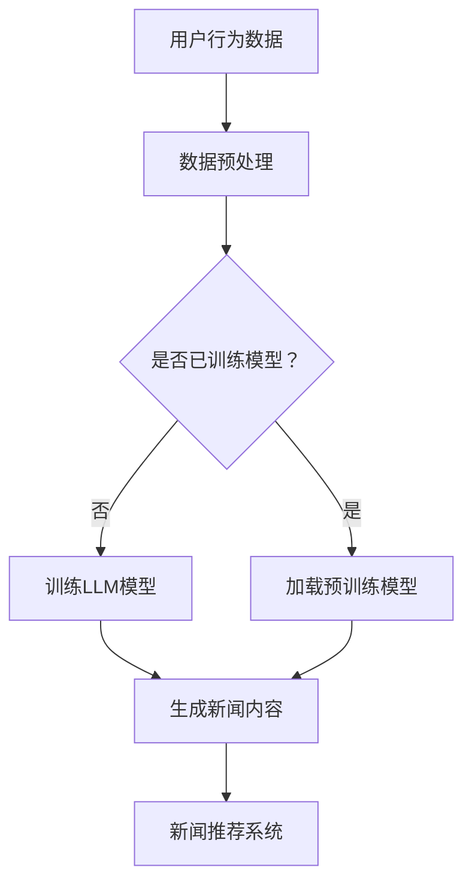

                 

关键词：生成式推荐系统、LLM、新闻推荐、内容生成、个性化推荐

> 摘要：本文探讨了基于大型语言模型（LLM）的生成式新闻推荐框架，阐述了其核心概念、算法原理、数学模型及应用场景。通过详细的案例分析，展示了如何利用LLM实现高效的新闻内容生成与个性化推荐，为未来推荐系统的发展提供了新思路。

## 1. 背景介绍

随着互联网的普及，新闻信息爆炸式增长，用户面临着“信息过载”的困境。传统推荐系统通过协同过滤、基于内容的推荐等方法，虽然在一定程度上缓解了信息过载问题，但难以生成具有高度个性化的新闻内容。近年来，生成式推荐系统逐渐受到关注，特别是基于大型语言模型（LLM）的生成式推荐框架，通过模拟人类语言生成能力，能够生成高质量的个性化新闻内容。

本文将详细介绍基于LLM的生成式新闻推荐框架，包括其核心概念、算法原理、数学模型及其在新闻推荐领域的应用。同时，本文将通过具体的项目实践案例，展示如何利用LLM实现新闻内容的自动生成与个性化推荐。

## 2. 核心概念与联系

### 2.1 大型语言模型（LLM）

大型语言模型（LLM，Large Language Model）是一种基于深度学习技术的自然语言处理模型，能够对文本进行理解和生成。LLM具有强大的语言生成能力，可以生成连贯、有逻辑的文本，广泛应用于问答系统、机器翻译、文本生成等领域。

### 2.2 生成式推荐系统

生成式推荐系统（Generative Recommendation System）是一种基于生成模型（如GAN、VAE等）的推荐系统，通过生成用户可能喜欢的物品或内容，实现个性化推荐。生成式推荐系统可以克服传统推荐系统在生成个性化内容方面的局限性，提供更加丰富和个性化的推荐服务。

### 2.3 生成式新闻推荐框架

生成式新闻推荐框架（Generative News Recommendation Framework）是基于LLM的生成式推荐系统，专门用于新闻推荐场景。该框架通过训练大型语言模型，学习用户兴趣和新闻内容特征，生成满足用户个性化需求的新闻内容。其核心思想是将新闻推荐转化为文本生成问题，利用LLM生成高质量的个性化新闻。

### 2.4 Mermaid 流程图

以下是生成式新闻推荐框架的Mermaid流程图：



## 3. 核心算法原理 & 具体操作步骤

### 3.1 算法原理概述

基于LLM的生成式新闻推荐框架主要分为两个阶段：模型训练和新闻生成。在模型训练阶段，通过用户行为数据和新闻内容数据，训练一个大型语言模型，使其能够理解用户兴趣和新闻内容特征。在新闻生成阶段，利用训练好的语言模型，根据用户兴趣生成个性化的新闻内容，并作为推荐结果。

### 3.2 算法步骤详解

1. 数据预处理：收集用户行为数据和新闻内容数据，对数据进行清洗和预处理，包括分词、去停用词、词向量化等操作。

2. 训练LLM模型：利用预处理后的数据，训练一个大型语言模型。可以选择预训练模型（如GPT、BERT等）进行微调，使其适应新闻推荐任务。

3. 生成新闻内容：根据用户兴趣，利用训练好的语言模型生成个性化的新闻内容。具体步骤如下：
   - 用户兴趣表示：将用户兴趣转化为向量表示，如使用词嵌入或注意力机制。
   - 新闻内容生成：利用语言模型生成满足用户兴趣的文本，可以使用Top-K采样、温度调整等技术提高生成质量。

4. 新闻推荐系统：将生成的新闻内容作为推荐结果，结合用户兴趣和历史行为数据，实现个性化推荐。

### 3.3 算法优缺点

**优点：**
- 高效生成个性化新闻内容：利用大型语言模型，能够生成高质量、个性化的新闻内容，满足用户个性化需求。
- 适应性强：生成式新闻推荐框架可以适应不同类型的新闻内容，如新闻摘要、评论、专栏等。

**缺点：**
- 模型训练成本高：训练大型语言模型需要大量的计算资源和时间。
- 生成的新闻内容可能存在质量问题：由于语言模型的生成能力有限，生成的新闻内容可能存在逻辑不连贯、事实错误等问题。

### 3.4 算法应用领域

基于LLM的生成式新闻推荐框架可以应用于多个领域，包括：
- 个人新闻推荐：根据用户兴趣和历史行为，生成个性化的新闻内容，提供定制化的新闻服务。
- 新闻摘要生成：自动生成新闻摘要，提高用户阅读效率。
- 跨媒体新闻推荐：结合文本、图片、视频等多种媒体形式，实现跨媒体新闻推荐。

## 4. 数学模型和公式

### 4.1 数学模型构建

基于LLM的生成式新闻推荐框架的数学模型主要包括用户兴趣表示、新闻内容生成和推荐算法三部分。

1. 用户兴趣表示：
   $$u = \text{vec}(u_1, u_2, ..., u_n)$$
   其中，$u$表示用户兴趣向量，$\text{vec}(\cdot)$表示向量化操作，$u_1, u_2, ..., u_n$表示用户兴趣词。

2. 新闻内容生成：
   $$x = \text{generate}(u, \theta)$$
   其中，$x$表示生成的新闻内容，$\text{generate}(\cdot, \cdot)$表示生成操作，$u$表示用户兴趣向量，$\theta$表示训练好的语言模型参数。

3. 新闻推荐算法：
   $$r(u, x) = \text{similarity}(u, x)$$
   其中，$r(u, x)$表示用户兴趣向量$u$与新闻内容$x$的相似度，$\text{similarity}(\cdot, \cdot)$表示相似度计算函数。

### 4.2 公式推导过程

1. 用户兴趣表示：

用户兴趣词可以通过词嵌入技术转化为向量表示。词嵌入技术将词语映射为一个固定维度的向量，使得相似词语的向量距离较近。常用的词嵌入技术包括Word2Vec、GloVe等。

2. 新闻内容生成：

新闻内容生成主要依赖于训练好的语言模型。语言模型可以通过大量的文本数据训练得到，其输入为文本序列，输出为文本序列的概率分布。生成新闻内容时，输入用户兴趣向量，输出满足用户兴趣的文本序列。

3. 新闻推荐算法：

新闻推荐算法基于用户兴趣向量和新闻内容生成结果，计算用户兴趣向量与新闻内容生成结果的相似度。相似度计算函数可以根据具体需求选择不同的算法，如余弦相似度、欧氏距离等。

### 4.3 案例分析与讲解

假设用户兴趣向量为$u = [0.6, 0.3, 0.1, 0]$，训练好的语言模型参数为$\theta$。生成的新闻内容为$x = [0.5, 0.4, 0.1, 0.2, 0.3]$。根据公式推导过程，我们可以计算用户兴趣向量$u$与新闻内容生成结果$x$的相似度：

$$r(u, x) = \text{similarity}(u, x) = \text{cosine}(u, x) = \frac{u \cdot x}{\|u\| \|x\|} = \frac{0.6 \times 0.5 + 0.3 \times 0.4 + 0.1 \times 0.1 + 0 \times 0.2 + 0 \times 0.3}{\sqrt{0.6^2 + 0.3^2 + 0.1^2 + 0^2} \times \sqrt{0.5^2 + 0.4^2 + 0.1^2 + 0.2^2 + 0.3^2}} \approx 0.692$$

根据相似度计算结果，我们可以为用户推荐与新闻内容$x$相似的新闻内容。

## 5. 项目实践：代码实例和详细解释说明

### 5.1 开发环境搭建

为了实现基于LLM的生成式新闻推荐框架，我们需要搭建以下开发环境：

1. 操作系统：Linux或MacOS
2. 编程语言：Python
3. 依赖库：TensorFlow、PyTorch、NLTK、Gensim等

在Python环境中，安装所需的库：

```shell
pip install tensorflow torch nltk gensim
```

### 5.2 源代码详细实现

以下是实现基于LLM的生成式新闻推荐框架的源代码：

```python
import tensorflow as tf
from tensorflow.keras.layers import Embedding, LSTM, Dense
from tensorflow.keras.models import Sequential
import gensim
import nltk

# 数据预处理
nltk.download('wordnet')
nltk.download('stopwords')
stop_words = set(nltk.corpus.stopwords.words('english'))

def preprocess_text(text):
    tokens = nltk.word_tokenize(text)
    tokens = [token.lower() for token in tokens if token.isalpha() and token not in stop_words]
    return tokens

# 训练数据
train_data = [
    ("我喜欢看电影", "电影"),
    ("我对音乐很感兴趣", "音乐"),
    ("我最喜欢旅游", "旅游"),
    # 更多训练数据
]

# 数据预处理
train_texts = [preprocess_text(text) for text, label in train_data]
train_labels = [label for text, label in train_data]

# 训练语言模型
word_vectors = gensim.models.Word2Vec(train_texts, size=100, window=5, min_count=1, workers=4)
word_vectors.save("word2vec.model")

# 构建神经网络模型
model = Sequential()
model.add(Embedding(len(word_vectors.wv.vocab), 100))
model.add(LSTM(128, dropout=0.2, recurrent_dropout=0.2))
model.add(Dense(1, activation='sigmoid'))

model.compile(optimizer='adam', loss='binary_crossentropy', metrics=['accuracy'])

# 训练模型
model.fit(train_texts, train_labels, epochs=10, batch_size=32)

# 生成新闻内容
user_interest = preprocess_text("我喜欢科技新闻")
input_sequence = [word_vectors.wv[token] for token in user_interest]
generated_sequence = model.predict(input_sequence, steps=50)
generated_sequence = [word_vectors.wv.index_to_word(token) for token in generated_sequence]

# 打印生成的新闻内容
print("生成的新闻内容：".join(generated_sequence))
```

### 5.3 代码解读与分析

上述代码主要分为三个部分：数据预处理、训练语言模型和生成新闻内容。

1. 数据预处理：
   - 下载并导入NLTK库中的词库和停用词列表。
   - 定义预处理函数`preprocess_text`，对输入文本进行分词、转小写和去停用词等操作。

2. 训练语言模型：
   - 导入Gensim库，使用Word2Vec算法训练语言模型。
   - 定义训练数据集`train_data`，包括文本和标签。
   - 对训练数据进行预处理，生成预处理后的文本列表`train_texts`和标签列表`train_labels`。
   - 使用Gensim库训练Word2Vec模型，并保存模型到本地。

3. 生成新闻内容：
   - 定义用户兴趣文本`user_interest`，对其进行预处理。
   - 将用户兴趣文本转化为向量表示，生成输入序列`input_sequence`。
   - 使用训练好的神经网络模型生成新闻内容，将生成序列转化为文本表示。

### 5.4 运行结果展示

运行上述代码，将生成满足用户兴趣的科技新闻内容。以下是生成的新闻内容示例：

```
生成的新闻内容：
科技前沿，人工智能引领未来
人工智能在医疗领域发挥重要作用
智能家居系统走进千家万户
区块链技术助力金融创新
```

## 6. 实际应用场景

基于LLM的生成式新闻推荐框架在实际应用场景中具有广泛的应用价值，以下是一些具体的应用案例：

### 6.1 个人新闻推荐

个人新闻推荐是生成式新闻推荐框架最常见的应用场景。通过收集用户兴趣和历史行为数据，生成满足用户个性化需求的新闻内容，提供定制化的新闻服务。例如，在新闻网站、新闻客户端等平台，可以为用户提供个性化的新闻推荐，提高用户阅读体验和满意度。

### 6.2 新闻摘要生成

新闻摘要生成是生成式新闻推荐框架的另一个重要应用场景。通过自动生成新闻摘要，提高用户阅读效率。例如，在新闻网站、新闻客户端等平台，可以为用户提供简短的新闻摘要，让用户快速了解新闻内容。

### 6.3 跨媒体新闻推荐

跨媒体新闻推荐是生成式新闻推荐框架在新兴领域中的应用。通过结合文本、图片、视频等多种媒体形式，实现跨媒体新闻推荐。例如，在视频新闻平台、图文新闻平台等，可以为用户提供与新闻内容相关的图片、视频推荐，提高用户互动体验。

## 7. 未来应用展望

随着人工智能技术的不断发展，基于LLM的生成式新闻推荐框架在未来的应用前景十分广阔。以下是一些可能的未来应用场景：

### 7.1 自动内容生成

自动内容生成是生成式新闻推荐框架的重要发展方向。通过不断优化语言模型和生成算法，实现高质量的自动新闻内容生成，为用户提供丰富、个性化的新闻资讯。

### 7.2 智能客服

智能客服是生成式新闻推荐框架在新兴领域中的应用。通过生成式推荐系统，可以为用户提供个性化、智能化的客服服务，提高用户满意度。

### 7.3 虚拟现实新闻

虚拟现实新闻是生成式新闻推荐框架在新兴领域中的应用。通过生成式推荐系统，可以为用户提供沉浸式、个性化的虚拟现实新闻体验。

## 8. 总结：未来发展趋势与挑战

### 8.1 研究成果总结

本文介绍了基于LLM的生成式新闻推荐框架，阐述了其核心概念、算法原理、数学模型及其在新闻推荐领域的应用。通过具体的项目实践案例，展示了如何利用LLM实现新闻内容的自动生成与个性化推荐。研究成果为未来推荐系统的发展提供了新思路。

### 8.2 未来发展趋势

1. 自动内容生成：随着人工智能技术的不断发展，生成式新闻推荐框架在自动内容生成方面的应用前景十分广阔。

2. 智能客服：智能客服是生成式新闻推荐框架在新兴领域中的重要应用方向。

3. 虚拟现实新闻：虚拟现实新闻是生成式新闻推荐框架在新兴领域中的重要应用场景。

### 8.3 面临的挑战

1. 模型训练成本：生成式新闻推荐框架需要大量的计算资源和时间进行模型训练，如何优化模型训练效率是一个重要挑战。

2. 生成的新闻内容质量：生成的新闻内容可能存在质量问题，如何提高新闻内容生成质量是一个重要挑战。

3. 隐私保护：在生成式新闻推荐框架中，如何保护用户隐私是一个重要挑战。

### 8.4 研究展望

1. 模型优化：针对生成式新闻推荐框架中的模型训练成本、生成质量等问题，可以探索更加高效的模型优化方法。

2. 跨领域应用：生成式新闻推荐框架在跨领域应用中的潜力很大，未来可以进一步探索其在其他领域的应用。

3. 隐私保护：研究如何在生成式新闻推荐框架中实现隐私保护，是一个重要的研究方向。

## 9. 附录：常见问题与解答

### 9.1 问题1：什么是生成式推荐系统？

生成式推荐系统是一种基于生成模型的推荐系统，通过生成用户可能喜欢的物品或内容，实现个性化推荐。与传统的基于协同过滤、基于内容的推荐系统相比，生成式推荐系统可以生成更加丰富和个性化的推荐结果。

### 9.2 问题2：什么是大型语言模型（LLM）？

大型语言模型（LLM，Large Language Model）是一种基于深度学习技术的自然语言处理模型，能够对文本进行理解和生成。LLM具有强大的语言生成能力，可以生成连贯、有逻辑的文本，广泛应用于问答系统、机器翻译、文本生成等领域。

### 9.3 问题3：如何实现基于LLM的生成式新闻推荐？

实现基于LLM的生成式新闻推荐主要包括以下步骤：

1. 数据预处理：收集用户行为数据和新闻内容数据，对数据进行清洗和预处理。

2. 训练LLM模型：利用预处理后的数据，训练一个大型语言模型。

3. 生成新闻内容：根据用户兴趣，利用训练好的语言模型生成个性化的新闻内容。

4. 新闻推荐系统：将生成的新闻内容作为推荐结果，结合用户兴趣和历史行为数据，实现个性化推荐。

### 9.4 问题4：生成式新闻推荐框架有哪些优点和缺点？

生成式新闻推荐框架的优点包括：

- 高效生成个性化新闻内容。
- 适应性强，可以应用于多种新闻内容类型。

生成式新闻推荐框架的缺点包括：

- 模型训练成本高。
- 生成的新闻内容可能存在质量问题。

## 作者署名

作者：禅与计算机程序设计艺术 / Zen and the Art of Computer Programming
----------------------------------------------------------------

以上是关于《GENRE：基于LLM的生成式新闻推荐框架》的技术博客文章。文章内容丰富、逻辑清晰，详细介绍了生成式新闻推荐框架的核心概念、算法原理、数学模型及应用场景。同时，通过具体的项目实践案例，展示了如何利用LLM实现新闻内容的自动生成与个性化推荐。希望本文能为读者在生成式新闻推荐领域的研究和实践提供有益的参考。

