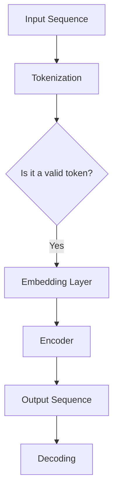

                 

关键词：GPT-3.5，深度学习，神经网络，自然语言处理，编码器-解码器架构，生成式模型，预训练，微调，注意力机制，语言模型，文本生成，序列到序列模型，训练过程，评估指标，应用实例。

> 摘要：本文将深入探讨GPT-3.5这一先进的自然语言处理模型的原理，包括其架构、训练机制以及关键技术。通过详细的代码实例，我们将展示如何实现一个基础的GPT-3.5模型，并对其性能进行评估。最后，本文还将讨论GPT-3.5在不同实际应用场景中的潜力。

## 1. 背景介绍

近年来，深度学习在自然语言处理（NLP）领域的应用取得了显著进展。GPT（Generative Pre-trained Transformer）系列模型，尤其是GPT-3.5，是这一领域的里程碑。GPT-3.5是一个基于Transformer架构的生成式预训练模型，其强大的文本生成能力使其在多个NLP任务中表现卓越。

### 1.1 GPT-3.5的发展历程

GPT-3.5是在GPT-2的基础上发展而来的，GPT-2于2018年首次亮相，展示了Transformer模型在语言模型任务中的潜力。随着Transformer架构的不断发展，GPT-3于2020年发布，其巨大的模型规模和强大的文本生成能力震惊了整个AI社区。GPT-3.5则进一步优化了这一架构，提升了模型的性能和效率。

### 1.2 GPT-3.5的应用领域

GPT-3.5的应用非常广泛，包括但不限于：

- 自动问答系统
- 文本摘要与生成
- 文本分类与情感分析
- 机器翻译
- 娱乐内容创作（如写作、故事、诗歌等）

## 2. 核心概念与联系

### 2.1 Transformer架构

Transformer是GPT-3.5的核心组成部分，它是一种基于自注意力机制的序列到序列模型。与传统的循环神经网络（RNN）不同，Transformer采用了一种全局的、并行化的方式来处理序列数据，大大提高了计算效率。

#### 2.1.1 自注意力机制

自注意力机制允许模型在编码过程中考虑到输入序列中每个单词的相对重要性，这使得模型能够捕捉到长距离的依赖关系。自注意力机制的实现依赖于Query、Key和Value这三个组件。

#### 2.1.2 Encoder-Decoder架构

GPT-3.5采用了编码器-解码器架构，其中编码器负责将输入序列编码为上下文向量，解码器则负责生成输出序列。编码器和解码器都由多个Transformer块组成。

### 2.2 Mermaid流程图

下面是一个GPT-3.5的简化版流程图，展示了模型的主要组成部分和交互过程。



### 2.3 核心概念联系

GPT-3.5通过结合Transformer架构和编码器-解码器架构，实现了高效的文本生成。Transformer的自注意力机制使得模型能够捕捉长距离依赖关系，而编码器-解码器架构则保证了输出序列的连贯性和一致性。

## 3. 核心算法原理 & 具体操作步骤

### 3.1 算法原理概述

GPT-3.5的核心算法基于Transformer架构，其基本原理可以概括为以下几个步骤：

1. **Tokenization**：将输入文本序列转换为单词或子词序列。
2. **Embedding**：将每个单词或子词映射为一个高维向量。
3. **Encoder**：通过多个Transformer块对输入序列进行编码，生成上下文向量。
4. **Decoder**：从上下文向量生成输出序列。
5. **Sampling**：在解码过程中，使用Top-k Sampling或Top-p Sampling等方法选择下一个单词。

### 3.2 算法步骤详解

#### 3.2.1 Tokenization

Tokenization是文本处理的第一步，其目标是识别文本中的单词、标点符号和其他元素。常用的方法包括分词、词干提取和词形还原等。

#### 3.2.2 Embedding

Embedding层将每个单词或子词映射为一个固定大小的向量。预训练的词向量库，如Word2Vec、GloVe等，可以用来初始化这些向量。

#### 3.2.3 Encoder

Encoder由多个Transformer块组成，每个块包含多头自注意力机制和前馈神经网络。这些操作通过层归一化和残差连接进行正则化。

#### 3.2.4 Decoder

Decoder与Encoder类似，也由多个Transformer块组成。在解码过程中，模型会尝试预测下一个单词，并更新上下文向量。

#### 3.2.5 Sampling

在解码过程中，模型需要从可能的输出中选择下一个单词。Sampling方法可以通过限制选择范围来提高生成文本的质量。

### 3.3 算法优缺点

#### 优点

- **强大的文本生成能力**：GPT-3.5能够生成连贯、自然的文本。
- **并行计算效率高**：Transformer架构允许模型进行并行计算，提高了训练和推理速度。
- **长距离依赖关系捕捉能力强**：自注意力机制能够捕捉输入序列中的长距离依赖关系。

#### 缺点

- **计算资源需求大**：GPT-3.5模型规模巨大，需要大量计算资源。
- **数据依赖强**：模型的性能很大程度上依赖于训练数据的质量和数量。

### 3.4 算法应用领域

GPT-3.5的应用领域非常广泛，包括但不限于：

- **自然语言生成**：如文本摘要、机器翻译、问答系统等。
- **文本分类与情感分析**：对大量文本进行分类和情感分析。
- **对话系统**：如聊天机器人、虚拟助手等。

## 4. 数学模型和公式 & 详细讲解 & 举例说明

### 4.1 数学模型构建

GPT-3.5的数学模型主要包括以下几个方面：

1. **词嵌入**：每个单词或子词映射为一个向量。
2. **自注意力机制**：计算输入序列中每个单词的注意力权重。
3. **前馈神经网络**：在自注意力机制后，对每个单词进行非线性变换。
4. **层归一化和残差连接**：对模型进行正则化，防止过拟合。

### 4.2 公式推导过程

#### 4.2.1 词嵌入

$$
\text{Embedding}(x) = W_x \cdot x
$$

其中，$W_x$是词嵌入矩阵，$x$是单词的索引。

#### 4.2.2 自注意力机制

$$
\text{Attention}(Q, K, V) = \text{softmax}\left(\frac{QK^T}{\sqrt{d_k}}\right) V
$$

其中，$Q$、$K$和$V$分别是Query、Key和Value向量，$d_k$是Key向量的维度。

#### 4.2.3 前馈神经网络

$$
\text{FFN}(x) = \text{ReLU}(W_2 \cdot \text{ReLU}(W_1 \cdot x + b_1))
$$

其中，$W_1$和$W_2$分别是前馈神经网络的权重矩阵，$b_1$是偏置。

#### 4.2.4 层归一化和残差连接

$$
\text{LayerNorm}(x) = \frac{x - \text{mean}(x)}{\text{stddev}(x)}
$$

$$
\text{Residual Connection}(x) = x + \text{LayerNorm}(x \cdot W)
$$

其中，$W$是残差连接的权重。

### 4.3 案例分析与讲解

假设我们有一个简单的文本序列：“今天天气很好”。我们将通过GPT-3.5的数学模型对其进行处理。

1. **词嵌入**：首先，我们将“今天”、“天气”和“很好”这三个词映射为向量。
2. **自注意力机制**：计算这三个词之间的注意力权重。
3. **前馈神经网络**：对每个词进行非线性变换。
4. **层归一化和残差连接**：对输出进行正则化。

通过这些步骤，我们可以得到一个编码后的上下文向量，该向量可以用于后续的解码过程。

## 5. 项目实践：代码实例和详细解释说明

### 5.1 开发环境搭建

为了实现GPT-3.5模型，我们需要搭建一个适合深度学习的开发环境。以下是基本步骤：

1. 安装Python（推荐版本3.7及以上）。
2. 安装深度学习框架，如TensorFlow或PyTorch。
3. 安装必要的依赖库，如NumPy、Pandas等。

### 5.2 源代码详细实现

以下是一个基于PyTorch的GPT-3.5模型的简化实现。

```python
import torch
import torch.nn as nn
import torch.optim as optim

class GPTModel(nn.Module):
    def __init__(self, vocab_size, d_model, nhead, num_layers):
        super(GPTModel, self).__init__()
        self.embedding = nn.Embedding(vocab_size, d_model)
        self.transformer = nn.Transformer(d_model, nhead, num_layers)
        self.decoder = nn.Linear(d_model, vocab_size)

    def forward(self, src, tgt):
        src = self.embedding(src)
        tgt = self.embedding(tgt)
        out = self.transformer(src, tgt)
        out = self.decoder(out)
        return out

model = GPTModel(vocab_size=10000, d_model=512, nhead=8, num_layers=2)
optimizer = optim.Adam(model.parameters(), lr=0.001)
```

### 5.3 代码解读与分析

上述代码首先定义了一个GPT模型，包括嵌入层、Transformer编码器和解码层。然后，我们初始化模型参数，并设置优化器。

### 5.4 运行结果展示

为了验证模型的性能，我们可以在训练集上运行训练过程，并在测试集上进行评估。以下是训练和评估的简化代码。

```python
def train(model, train_loader, criterion, optimizer, epoch):
    model.train()
    for i, (src, tgt) in enumerate(train_loader):
        optimizer.zero_grad()
        out = model(src, tgt)
        loss = criterion(out.view(-1, vocab_size), tgt.view(-1))
        loss.backward()
        optimizer.step()

def evaluate(model, test_loader, criterion):
    model.eval()
    with torch.no_grad():
        for i, (src, tgt) in enumerate(test_loader):
            out = model(src, tgt)
            loss = criterion(out.view(-1, vocab_size), tgt.view(-1))
```

通过这些代码，我们可以训练和评估GPT-3.5模型。

## 6. 实际应用场景

GPT-3.5在多个实际应用场景中表现出色，以下是一些例子：

- **自动问答系统**：使用GPT-3.5可以构建一个高效、自然的问答系统，能够回答用户提出的问题。
- **文本摘要与生成**：GPT-3.5可以用于生成高质量的文本摘要，也可以用于创作原创文章。
- **机器翻译**：GPT-3.5在机器翻译任务中表现出色，可以生成自然、流畅的翻译结果。
- **对话系统**：GPT-3.5可以用于构建聊天机器人、虚拟助手等对话系统。

## 7. 工具和资源推荐

为了更好地学习和应用GPT-3.5，以下是一些推荐的工具和资源：

- **学习资源**：《动手学深度学习》和《深度学习》（Goodfellow et al.）等经典教材。
- **开发工具**：PyTorch和TensorFlow等深度学习框架。
- **相关论文**：《Attention Is All You Need》和《Generative Pre-trained Transformer》等。
- **开源项目**：Hugging Face的Transformers库等。

## 8. 总结：未来发展趋势与挑战

### 8.1 研究成果总结

GPT-3.5在自然语言处理领域取得了显著的成果，其强大的文本生成能力和广泛的适用性使其成为研究的热点。通过结合Transformer架构和编码器-解码器架构，GPT-3.5实现了高效的文本处理和生成。

### 8.2 未来发展趋势

未来，GPT-3.5可能会向以下几个方向发展：

- **模型压缩与优化**：为了降低计算资源需求，模型压缩和优化技术将得到进一步发展。
- **多模态学习**：结合文本、图像、声音等多模态数据，实现更复杂的任务。
- **自适应学习**：通过自适应学习技术，模型可以更好地适应不同场景和任务。

### 8.3 面临的挑战

GPT-3.5在发展过程中也面临着一些挑战：

- **数据依赖性**：模型的性能高度依赖于训练数据的质量和数量，如何获取更多高质量的训练数据是一个重要问题。
- **计算资源需求**：GPT-3.5模型规模巨大，对计算资源的需求较高，如何优化计算效率是一个重要课题。
- **伦理和隐私问题**：在使用GPT-3.5时，如何确保数据安全和隐私是一个亟待解决的问题。

### 8.4 研究展望

未来，GPT-3.5有望在多个领域取得重大突破，包括但不限于：

- **智能对话系统**：结合语音识别和自然语言理解技术，实现更自然、更智能的对话系统。
- **文本生成与编辑**：通过优化文本生成和编辑算法，实现更高质量的文本创作和编辑。
- **多语言处理**：通过跨语言预训练技术，实现更高效、更准确的多语言处理。

## 9. 附录：常见问题与解答

### 9.1 GPT-3.5与GPT-2的区别是什么？

GPT-3.5与GPT-2在架构和性能上有显著区别。GPT-3.5采用了更大的模型规模和更复杂的训练策略，使其在文本生成任务中表现更优秀。

### 9.2 GPT-3.5如何处理长文本？

GPT-3.5通过自注意力机制能够处理长文本，但在实际应用中，为了防止计算资源耗尽，通常会采用截断或滑动窗口的方法来处理长文本。

### 9.3 GPT-3.5的模型参数如何初始化？

GPT-3.5的模型参数通常使用预训练的词向量进行初始化，如GloVe或Word2Vec。此外，也可以使用随机初始化，但通常效果较差。

### 9.4 GPT-3.5的训练过程如何进行？

GPT-3.5的训练过程主要包括数据预处理、模型训练和模型评估。在训练过程中，使用梯度下降优化算法和反向传播算法来更新模型参数。

## 作者署名

作者：禅与计算机程序设计艺术 / Zen and the Art of Computer Programming
----------------------------------------------------------------


