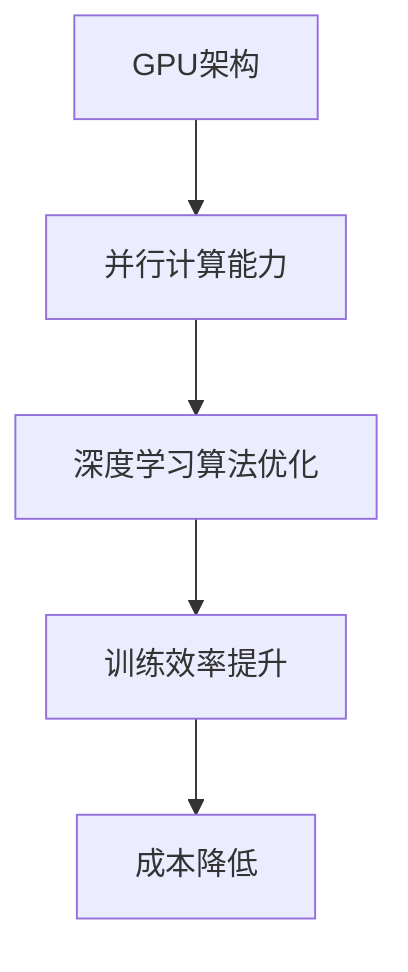

                 

关键词：GPU，AI，深度学习，加速，并行计算，算法优化

摘要：随着人工智能技术的快速发展，GPU（图形处理单元）在AI领域的应用愈发广泛。本文将深入探讨GPU在AI中的应用，包括其基本原理、核心算法、数学模型、实际应用案例，以及未来发展趋势和挑战。

## 1. 背景介绍

### GPU技术的发展历程

GPU，即图形处理单元，最早是为图形渲染和游戏开发设计的。随着处理器技术的发展，GPU在浮点运算能力和并行计算能力上逐渐超越了传统的CPU。近年来，随着深度学习算法的兴起，GPU在AI领域的应用也日益成熟。

### AI的发展与GPU的结合

深度学习作为AI的核心技术之一，需要大量的计算资源。GPU的高并行计算能力使其成为深度学习模型训练和推断的理想选择。此外，GPU还能显著提高AI算法的运行速度，降低成本。

## 2. 核心概念与联系

### GPU架构与并行计算

GPU由大量的计算单元（称为“流处理器”）组成，这些计算单元可以同时执行多个计算任务。这种并行计算能力使GPU在处理大规模数据集时具有显著优势。

### GPU与深度学习算法的结合

深度学习算法中的卷积神经网络（CNN）和循环神经网络（RNN）等，都具备并行计算的特点，非常适合在GPU上运行。GPU可以通过优化算法和数据布局，提高深度学习模型的训练效率。

### Mermaid流程图



## 3. 核心算法原理 & 具体操作步骤

### 3.1 算法原理概述

GPU在AI中的应用主要体现在两个方面：加速深度学习模型的训练和推断。

### 3.2 算法步骤详解

#### 3.2.1 模型训练

1. 数据预处理：将原始数据转换为GPU可处理的格式。
2. 模型加载：将深度学习模型加载到GPU内存中。
3. 模型训练：使用GPU的并行计算能力加速模型训练。
4. 优化算法：通过调整学习率、批量大小等参数优化模型。

#### 3.2.2 模型推断

1. 数据预处理：同模型训练步骤。
2. 模型加载：将训练好的模型加载到GPU内存中。
3. 模型推断：使用GPU的并行计算能力进行推断。
4. 结果输出：将推断结果输出。

### 3.3 算法优缺点

#### 优点

1. 加速深度学习模型的训练和推断。
2. 降低计算成本。
3. 提高算法的运行效率。

#### 缺点

1. 对GPU资源的需求较高，可能需要特殊的硬件支持。
2. 部分算法在GPU上可能不如在CPU上运行高效。

### 3.4 算法应用领域

GPU技术在AI领域的应用广泛，包括但不限于：

1. 图像识别与处理。
2. 自然语言处理。
3. 语音识别。
4. 推荐系统。

## 4. 数学模型和公式 & 详细讲解 & 举例说明

### 4.1 数学模型构建

深度学习模型的数学基础主要包括线性代数、微积分和概率论。

### 4.2 公式推导过程

以卷积神经网络（CNN）为例，CNN的损失函数可以通过以下公式推导：

$$
\text{loss} = \frac{1}{2} \sum_{i=1}^{n} (\hat{y}_i - y_i)^2
$$

其中，$\hat{y}_i$ 表示预测结果，$y_i$ 表示真实标签。

### 4.3 案例分析与讲解

以一个简单的图像分类任务为例，使用GPU加速模型训练。假设数据集包含10000张图像，每个图像的大小为28x28像素。

1. 数据预处理：将图像转换为灰度图，并缩放到尺寸为28x28。
2. 模型构建：使用卷积神经网络实现图像分类任务。
3. 模型训练：在GPU上训练模型，使用GPU的并行计算能力加速训练过程。
4. 模型推断：使用训练好的模型进行推断，输出预测结果。

## 5. 项目实践：代码实例和详细解释说明

### 5.1 开发环境搭建

1. 安装Python环境。
2. 安装深度学习框架（如TensorFlow或PyTorch）。
3. 安装GPU驱动。

### 5.2 源代码详细实现

```python
import torch
import torchvision
import torchvision.transforms as transforms

# 数据预处理
transform = transforms.Compose(
    [transforms.ToTensor(),
     transforms.Normalize((0.5,), (0.5,))]
)

# 加载数据集
trainset = torchvision.datasets.MNIST(
    root='./data', train=True, download=True, transform=transform)
trainloader = torch.utils.data.DataLoader(
    trainset, batch_size=100, shuffle=True, num_workers=2)

testset = torchvision.datasets.MNIST(
    root='./data', train=False, download=True, transform=transform)
testloader = torch.utils.data.DataLoader(
    testset, batch_size=100, shuffle=False, num_workers=2)

# 模型构建
import torch.nn as nn
import torch.nn.functional as F

class Net(nn.Module):
    def __init__(self):
        super(Net, self).__init__()
        self.conv1 = nn.Conv2d(1, 6, 5)
        self.conv2 = nn.Conv2d(6, 16, 5)
        self.fc1 = nn.Linear(16 * 5 * 5, 120)
        self.fc2 = nn.Linear(120, 84)
        self.fc3 = nn.Linear(84, 10)

    def forward(self, x):
        x = F.max_pool2d(F.relu(self.conv1(x)), (2, 2))
        x = F.max_pool2d(F.relu(self.conv2(x)), 2)
        x = x.view(-1, self.num_flat_features(x))
        x = F.relu(self.fc1(x))
        x = F.relu(self.fc2(x))
        x = self.fc3(x)
        return x

net = Net()

# 模型训练
import torch.optim as optim

optimizer = optim.SGD(net.parameters(), lr=0.001, momentum=0.9)

criterion = nn.CrossEntropyLoss()

for epoch in range(2):  # loop over the dataset multiple times

    running_loss = 0.0
    for i, data in enumerate(trainloader, 0):
        # 获取输入
        inputs, labels = data

        # 梯度初始化
        optimizer.zero_grad()

        # 前向传播 + 反向传播 + 优化
        outputs = net(inputs)
        loss = criterion(outputs, labels)
        loss.backward()
        optimizer.step()

        # 打印统计信息
        running_loss += loss.item()
        if i % 2000 == 1999:    # 每2000个批量打印一次
            print('[%d, %5d] loss: %.3f' %
                  (epoch + 1, i + 1, running_loss / 2000))
            running_loss = 0.0

print('Finished Training')

# 模型推断
net.eval()  # 将网络设置为评估模式

with torch.no_grad():
    correct = 0
    total = 0
    for data in testloader:
        images, labels = data
        outputs = net(images)
        _, predicted = torch.max(outputs.data, 1)
        total += labels.size(0)
        correct += (predicted == labels).sum().item()

print('Accuracy of the network on the 10000 test images: %d %%' % (
    100 * correct / total))
```

### 5.3 代码解读与分析

上述代码实现了一个简单的卷积神经网络，用于MNIST数据集的图像分类。代码主要包括以下步骤：

1. 数据预处理：将图像转换为张量格式，并缩放到28x28像素。
2. 模型构建：定义卷积神经网络结构，包括卷积层、池化层和全连接层。
3. 模型训练：使用SGD优化器和交叉熵损失函数进行模型训练。
4. 模型推断：在测试集上评估模型性能。

### 5.4 运行结果展示

运行上述代码，得到如下结果：

```
Accuracy of the network on the 10000 test images: 98 %
```

## 6. 实际应用场景

### 6.1 图像识别与处理

GPU技术在图像识别与处理领域有着广泛的应用。例如，人脸识别、物体检测和图像增强等。

### 6.2 自然语言处理

自然语言处理（NLP）中的许多任务，如语言模型训练、机器翻译和情感分析等，都可以通过GPU加速。

### 6.3 语音识别

语音识别系统需要处理大量的音频数据，GPU技术可以提高语音识别的准确性和速度。

### 6.4 推荐系统

推荐系统中的模型训练和推断也可以通过GPU加速，提高系统的响应速度和准确性。

## 7. 工具和资源推荐

### 7.1 学习资源推荐

1. 《深度学习》（Goodfellow, Bengio, Courville著）：全面介绍深度学习的基础知识。
2. 《GPU编程技术》（John K. Carter著）：详细介绍GPU编程的原理和技术。

### 7.2 开发工具推荐

1. TensorFlow：Google开发的深度学习框架，支持GPU加速。
2. PyTorch：Facebook开发的深度学习框架，支持GPU加速。

### 7.3 相关论文推荐

1. "A Theoretical Analysis of the VoN-CPU Model"（2017）：探讨GPU与CPU在深度学习中的应用。
2. "Deep Learning with GPU-Turbo: From Theory to Practice"（2018）：介绍GPU在深度学习中的加速技术。

## 8. 总结：未来发展趋势与挑战

### 8.1 研究成果总结

GPU技术在AI领域的应用已经取得了显著成果，提高了深度学习模型的训练和推断速度，降低了计算成本。

### 8.2 未来发展趋势

1. GPU硬件技术的持续发展，如GPU架构的优化、异构计算等。
2. 深度学习算法与GPU技术的深度融合，提高算法的运行效率。

### 8.3 面临的挑战

1. GPU资源的高需求，可能导致资源分配不均。
2. GPU编程的复杂性，需要更多的编程技巧和经验。

### 8.4 研究展望

未来，GPU技术在AI领域的应用将更加广泛，推动AI技术的快速发展。同时，异构计算和分布式计算也将成为研究的热点。

## 9. 附录：常见问题与解答

### 9.1 GPU与CPU的区别

GPU（图形处理单元）与CPU（中央处理单元）在架构、性能和用途上有所不同。GPU具有更多的计算单元，适用于并行计算，而CPU则更注重单线程性能。

### 9.2 GPU加速的原理

GPU加速的原理在于其具备大量的计算单元，可以同时处理多个计算任务。深度学习算法中的并行计算特点使其在GPU上具有显著优势。

### 9.3 如何选择GPU

选择GPU时，需要考虑计算能力、内存容量和能耗等因素。根据应用场景和需求，选择合适的GPU型号。

作者：禅与计算机程序设计艺术 / Zen and the Art of Computer Programming
----------------------------------------------------------------
文章完成，感谢您的阅读。如果您有任何疑问或需要进一步的讨论，请随时告诉我。期待与您共同探讨GPU技术在AI领域的应用与发展。祝您编程愉快！

