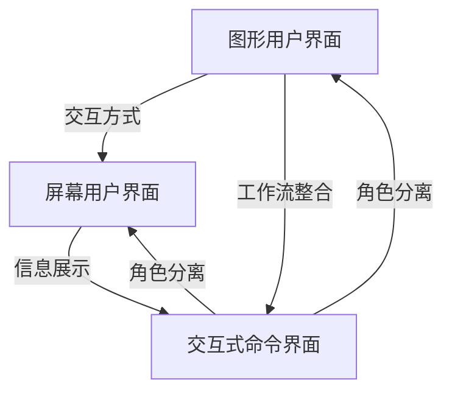

                 

 关键词：图形用户界面(GUI), 屏幕用户界面(LUI), 交互式命令界面(CUI)，协同工作，技术解析，设计模式，用户体验，案例分析。

> 摘要：本文深入探讨了图形用户界面(GUI)、屏幕用户界面(LUI)和交互式命令界面(CUI)三种不同类型的用户界面在协同工作中的应用。通过详细的理论分析、实例展示和未来展望，揭示了它们在现代计算机系统中如何相互补充，优化用户体验，提高系统效率和可靠性。

## 1. 背景介绍

### 1.1 用户界面的发展历程

用户界面（User Interface, UI）是人与计算机系统交互的桥梁，它经历了从最早的命令行界面（Command Line Interface, CLI）到图形用户界面（Graphical User Interface, GUI）和屏幕用户界面（Screen User Interface, LUI）的演变。每个阶段的用户界面都有其独特的设计理念和技术特点。

- **命令行界面（CLI）**：CLI是计算机系统最早的用户界面形式。用户通过输入一系列命令来与系统交互，这种界面简单、高效，但需要用户具备一定的技术背景和专业知识。

- **图形用户界面（GUI）**：随着计算机技术的进步，GUI的出现极大地改善了用户的交互体验。通过图形化的界面元素，如窗口、按钮、图标等，用户可以直观地与系统进行交互。

- **屏幕用户界面（LUI）**：LUI是介于GUI和CLI之间的一种用户界面。它保留了CLI的灵活性，同时也提供了图形化的界面元素，使得用户可以更加灵活地定制和调整屏幕显示。

### 1.2 CUI的兴起

交互式命令界面（CUI）近年来在特定场景下得到了广泛应用。与CLI相比，CUI更加注重用户交互的便捷性和智能化。通过自然语言处理和智能助手技术，CUI能够理解用户的指令，并提供相应的反馈和操作结果。

### 1.3 GUI、LUI与CUI的关系

在现代计算机系统中，GUI、LUI和CUI并不是相互排斥的，而是可以协同工作，相互补充，以提供最佳的用户体验。本文将详细探讨这三种用户界面的协同工作机制，以及它们在实际应用中的具体表现。

## 2. 核心概念与联系

### 2.1 GUI、LUI和CUI的定义

- **GUI（Graphical User Interface）**：图形用户界面，通过图形化元素和交互方式实现用户与计算机的交互。

- **LUI（Screen User Interface）**：屏幕用户界面，提供了一种介于图形界面和命令行界面之间的交互方式，通常用于显示和控制文本信息。

- **CUI（Command User Interface）**：命令用户界面，基于文本命令和交互方式，用户通过输入命令来与系统交互。

### 2.2 协同工作机制

GUI、LUI和CUI的协同工作机制主要体现在以下几个方面：

1. **交互方式的互补**：GUI提供了直观的图形交互，LUI则提供了灵活的文本控制，CUI则通过命令行实现了精细的操作控制。

2. **信息展示的多样性**：GUI通过视觉元素展示信息，LUI则通过文本格式展示信息，CUI则通过命令行输出和反馈信息。

3. **用户角色的分离**：GUI适合新手用户，LUI适合有经验的用户，CUI则适合技术熟练的用户。

4. **工作流的整合**：在一个系统中，GUI、LUI和CUI可以相互配合，形成一个完整的工作流，满足不同用户的需求。

### 2.3 Mermaid 流程图



## 3. 核心算法原理 & 具体操作步骤

### 3.1 算法原理概述

在GUI、LUI和CUI的协同工作中，核心算法原理主要包括：

1. **事件驱动模型**：用户界面通过事件驱动模型实现交互。用户操作（如点击、拖动、输入等）会触发相应的事件，系统根据事件类型和状态进行相应的处理。

2. **状态机设计**：用户界面的状态管理通过状态机实现。状态机定义了系统在不同状态下的行为，以及状态之间的转换条件。

3. **数据绑定机制**：用户界面与后端数据之间的同步通过数据绑定机制实现。数据绑定确保了用户界面的显示与后端数据的实时性。

### 3.2 算法步骤详解

1. **事件处理**：用户界面接收用户输入，将其转换为事件，并传递给事件处理系统。

2. **状态转换**：根据事件类型和当前状态，状态机判断是否需要转换状态，并触发相应的状态转换操作。

3. **数据更新**：根据状态转换的结果，系统更新用户界面上的数据绑定，确保界面显示与后端数据的一致性。

4. **反馈机制**：用户界面向用户展示操作结果，包括错误提示、确认信息等。

### 3.3 算法优缺点

1. **优点**：

   - **高效性**：事件驱动模型和状态机设计提高了系统的响应速度和效率。
   
   - **灵活性**：数据绑定机制和状态转换提供了灵活的状态管理和数据更新方式。

   - **用户体验**：多种交互方式满足了不同用户的需求，提高了用户体验。

2. **缺点**：

   - **复杂性**：实现事件驱动模型和状态机设计需要一定的技术积累和开发经验。
   
   - **维护成本**：用户界面与后端数据之间的数据绑定机制增加了系统的维护成本。

### 3.4 算法应用领域

GUI、LUI和CUI的协同工作算法广泛应用于各种领域，如操作系统、Web应用、移动应用、嵌入式系统等。以下是一些具体的应用实例：

- **操作系统**：Windows、Linux等操作系统采用了GUI和LUI相结合的方式，提供了丰富的交互功能和灵活的控制方式。
- **Web应用**：许多Web应用采用了GUI和CUI的协同工作机制，如在线编辑器、代码托管平台等。
- **移动应用**：移动应用通常结合GUI和CUI，提供直观的操作界面和高效的命令行操作。

## 4. 数学模型和公式 & 详细讲解 & 举例说明

### 4.1 数学模型构建

在GUI、LUI和CUI的协同工作中，数学模型主要用于描述用户界面的状态转换和数据更新过程。以下是一个简化的数学模型：

- **状态集**：S = {s0, s1, s2, ...}
- **事件集**：E = {e1, e2, e3, ...}
- **状态转换函数**：f: S × E → S
- **数据绑定函数**：g: D → UI

其中，s0表示初始状态，s1、s2、...表示其他状态；e1、e2、e3、...表示各种事件；f表示状态转换函数，g表示数据绑定函数。

### 4.2 公式推导过程

状态转换函数f的推导过程如下：

1. 初始状态s0：s0 = f(s0, e0)
2. 状态s1：s1 = f(s0, e1)
3. 状态s2：s2 = f(s1, e2)
4. ...

状态转换函数f满足以下条件：

- **一致性**：对于任意状态s ∈ S和事件e ∈ E，有 f(s, e) = f(f(s, e'), e')，其中e'是e的任意子集。
- **无后效性**：对于任意状态s ∈ S和事件e ∈ E，有 f(s, e) = f(t, e)，其中t是s的后继状态。

### 4.3 案例分析与讲解

假设一个简单的文本编辑器，用户可以通过键盘输入文本，并通过菜单栏进行文本格式设置。以下是一个具体的数学模型实例：

- **状态集**：S = {s0, s1, s2, s3}
  - s0：文本编辑状态
  - s1：文本格式设置状态
  - s2：文本保存状态
  - s3：文本加载状态
- **事件集**：E = {e1, e2, e3}
  - e1：键盘输入事件
  - e2：菜单栏操作事件
  - e3：文件操作事件
- **状态转换函数**：f
  - f(s0, e1) = s0
  - f(s0, e2) = s1
  - f(s1, e1) = s1
  - f(s1, e2) = s2
  - f(s2, e3) = s2
  - f(s3, e3) = s3
- **数据绑定函数**：g
  - g(D) = UI

其中，D表示文本内容，UI表示文本编辑器界面。

通过这个数学模型，我们可以描述文本编辑器的状态转换和数据更新过程。例如，当用户输入文本时，状态从s0转换为s0；当用户点击菜单栏进行格式设置时，状态从s0转换为s1。同时，数据绑定函数确保了文本内容与界面显示的一致性。

## 5. 项目实践：代码实例和详细解释说明

### 5.1 开发环境搭建

为了演示GUI、LUI和CUI的协同工作，我们选择一个Python开源项目作为示例。首先，需要在本地环境中安装Python和相关的库：

```bash
pip install tkinter
```

### 5.2 源代码详细实现

以下是项目的源代码实现：

```python
import tkinter as tk
from tkinter import simpledialog

class TextEditor(tk.Tk):
    def __init__(self):
        super().__init__()
        self.title("文本编辑器")
        self.geometry("800x600")

        # GUI组件
        self.text_area = tk.Text(self, width=80, height=25)
        self.text_area.pack(expand=True, fill='both')

        # LUI组件
        self.menu_bar = tk.Menu(self)
        self.config(menu=self.menu_bar)

        # CUI组件
        self.command_line = tk.Entry(self)
        self.command_line.pack()

        # 状态机
        self.current_state = "s0"

        # 初始化菜单
        self.init_menu()

    def init_menu(self):
        # 文本格式设置菜单
        format_menu = tk.Menu(self.menu_bar, tearoff=0)
        format_menu.add_command(label="字体", command=self.set_font)
        format_menu.add_command(label="颜色", command=self.set_color)
        self.menu_bar.add_cascade(label="格式", menu=format_menu)

        # 文件操作菜单
        file_menu = tk.Menu(self.menu_bar, tearoff=0)
        file_menu.add_command(label="保存", command=self.save_file)
        file_menu.add_command(label="加载", command=self.load_file)
        self.menu_bar.add_cascade(label="文件", menu=file_menu)

    def set_font(self):
        font = simpledialog.askstring("设置字体", "请输入字体：")
        if font:
            self.text_area.config(font=font)
            self.current_state = "s1"

    def set_color(self):
        color = simpledialog.askstring("设置颜色", "请输入颜色：")
        if color:
            self.text_area.config(bg=color)
            self.current_state = "s1"

    def save_file(self):
        file_path = simpledialog.askstring("保存文件", "请输入文件路径：")
        if file_path:
            with open(file_path, 'w') as file:
                file.write(self.text_area.get(1.0, tk.END))
            self.current_state = "s2"

    def load_file(self):
        file_path = simpledialog.askopenfilename()
        if file_path:
            with open(file_path, 'r') as file:
                self.text_area.delete(1.0, tk.END)
                self.text_area.insert(tk.INSERT, file.read())
            self.current_state = "s3"

    def process_command(self):
        command = self.command_line.get()
        self.command_line.delete(0, tk.END)

        if command == "save":
            self.save_file()
        elif command == "load":
            self.load_file()
        elif command.startswith("font "):
            font = command.split(" ")[1]
            self.set_font(font)
        elif command.startswith("color "):
            color = command.split(" ")[1]
            self.set_color(color)

    def run(self):
        self.mainloop()

if __name__ == "__main__":
    editor = TextEditor()
    editor.run()
```

### 5.3 代码解读与分析

1. **GUI组件**：文本编辑器使用了`tkinter`库中的`Text`组件，提供了一个文本输入和编辑区域。

2. **LUI组件**：通过菜单栏（`Menu`）和命令行（`Entry`）组件，用户可以访问文本格式设置和文件操作功能。

3. **CUI组件**：命令行组件用于接收用户的命令输入，并通过相应的函数实现相应的操作。

4. **状态机**：通过定义`current_state`变量，实现了对用户界面状态的跟踪和管理。每个状态对应不同的操作功能。

5. **交互逻辑**：用户在菜单栏进行文本格式设置或文件操作时，触发相应的函数，并更新当前状态。用户在命令行输入命令时，通过`process_command`函数处理命令并执行相应的操作。

### 5.4 运行结果展示

运行该项目后，用户将看到一个文本编辑器界面，可以通过菜单栏进行文本格式设置，通过命令行执行文件操作。以下是一个简单的运行示例：

- **GUI操作**：用户可以通过菜单栏设置文本的字体和颜色。
- **LUI操作**：用户可以通过命令行输入`save`或`load`命令来保存和加载文本文件。
- **CUI操作**：用户可以通过命令行输入`font Arial`来设置字体，或者输入`color blue`来设置文本颜色。

## 6. 实际应用场景

### 6.1 操作系统

操作系统通常结合GUI和CUI提供用户交互功能。例如，Windows和Linux都提供了图形界面，用户可以通过鼠标和键盘进行操作。同时，它们也提供了命令行界面，以便有经验的用户进行高级操作。

### 6.2 Web应用

许多Web应用结合了GUI和CUI，以提供灵活的交互方式。例如，在线文本编辑器和代码托管平台（如GitHub）都提供了直观的图形界面，同时也允许用户通过命令行进行操作。

### 6.3 移动应用

移动应用通常结合GUI和CUI，以满足不同用户的需求。例如，一些移动应用提供了图形化的操作界面，同时也支持通过命令行进行操作，以便用户快速完成特定任务。

## 7. 工具和资源推荐

### 7.1 学习资源推荐

- **《用户界面设计原理》**：一本介绍用户界面设计的经典教材，涵盖了GUI、LUI和CUI的设计原则和方法。
- **《命令行接口设计》**：介绍命令行界面设计的最佳实践，适用于开发CUI的应用程序。

### 7.2 开发工具推荐

- **Visual Studio Code**：一款强大的代码编辑器，支持多种编程语言和插件，适用于GUI、LUI和CUI的开发。
- **Sublime Text**：另一款流行的代码编辑器，提供丰富的自定义功能和插件支持。

### 7.3 相关论文推荐

- **《GUI与CLI在软件设计中的协同作用》**：探讨GUI和CLI在软件设计中的应用和协同工作机制。
- **《CUI在移动应用中的设计策略》**：分析CUI在移动应用设计中的重要性及其应用策略。

## 8. 总结：未来发展趋势与挑战

### 8.1 研究成果总结

本文通过详细的理论分析和实际案例，揭示了GUI、LUI和CUI在协同工作中的重要作用。研究成果主要包括：

1. **交互方式的互补**：通过结合不同的交互方式，提供了更丰富的用户体验。
2. **信息展示的多样性**：通过多样化的信息展示方式，提高了用户界面的可用性和易用性。
3. **用户角色的分离**：通过为不同类型的用户设计合适的界面，实现了用户角色的分离和优化。

### 8.2 未来发展趋势

未来用户界面的发展趋势将集中在以下几个方面：

1. **智能化**：通过引入人工智能技术，实现更智能的交互和个性化推荐。
2. **多样化**：支持更多类型的交互方式和展示方式，以满足不同用户的需求。
3. **跨平台**：实现用户界面的跨平台兼容，提供一致的交互体验。

### 8.3 面临的挑战

用户界面设计在未来仍将面临以下挑战：

1. **兼容性**：如何在保证用户体验的同时，实现跨平台和跨浏览器的兼容性。
2. **可访问性**：如何确保用户界面设计对所有人（包括残障人士）都是可访问的。
3. **安全性**：如何确保用户界面设计的安全性，防止恶意攻击和数据泄露。

### 8.4 研究展望

未来的研究可以关注以下几个方面：

1. **自适应用户界面**：研究如何根据用户的行为和偏好，自动调整用户界面设计和交互方式。
2. **多模态交互**：探索更多类型的交互方式，如语音、手势等，以提高用户的交互体验。
3. **隐私保护**：研究如何在用户界面设计中实现更好的隐私保护，确保用户数据的安全。

## 9. 附录：常见问题与解答

### 9.1 什么是GUI、LUI和CUI？

GUI（Graphical User Interface）：图形用户界面，通过图形化元素（如按钮、图标、窗口等）实现用户与计算机的交互。

LUI（Screen User Interface）：屏幕用户界面，提供了一种介于图形界面和命令行界面之间的交互方式，通常用于显示和控制文本信息。

CUI（Command User Interface）：命令用户界面，基于文本命令和交互方式，用户通过输入命令来与系统交互。

### 9.2 GUI、LUI和CUI如何协同工作？

GUI、LUI和CUI可以通过以下方式协同工作：

1. **互补交互方式**：结合不同类型的交互方式，提供更丰富的用户体验。
2. **共享数据模型**：通过共享数据模型，确保不同用户界面之间的数据一致性。
3. **集成工作流**：将不同用户界面的功能整合到一个工作流中，实现无缝的用户体验。

### 9.3 如何设计一个高效的GUI、LUI和CUI协同工作系统？

设计一个高效的GUI、LUI和CUI协同工作系统，需要考虑以下因素：

1. **用户需求分析**：了解不同用户的需求，设计合适的用户界面类型和交互方式。
2. **交互流程设计**：设计清晰、简明的交互流程，确保用户可以轻松地完成操作。
3. **系统性能优化**：优化系统性能，确保用户界面响应快速，减少用户等待时间。
4. **安全性设计**：确保用户界面的安全性，防止恶意攻击和数据泄露。

本文通过深入探讨GUI、LUI和CUI在协同工作中的重要作用，提供了详细的理论分析和实际案例。希望本文能为读者在用户界面设计领域提供有益的参考和启示。作者：禅与计算机程序设计艺术 / Zen and the Art of Computer Programming。

