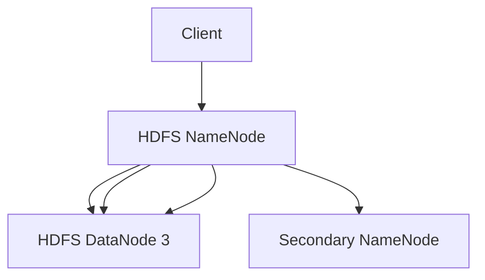

                 

HDFS（Hadoop Distributed File System）是Hadoop分布式计算框架中的核心组件之一，负责存储和管理分布式环境中的大规模数据。本文将深入探讨HDFS的原理，并通过对实际代码实例的讲解，帮助读者更好地理解其工作方式。

> 关键词：HDFS，分布式文件系统，Hadoop，数据存储，文件分片，数据复制，容错性

## 摘要

本文将详细解释HDFS的工作原理，包括其设计理念、核心组件和关键技术。此外，还将通过具体的代码实例，展示HDFS的实际操作过程，帮助读者掌握如何使用HDFS进行数据存储和管理。

## 1. 背景介绍

HDFS起源于Google的文件系统GFS（Google File System），其设计目标是提供一种高可靠性、高性能、高扩展性的分布式文件存储系统。随着大数据时代的到来，HDFS在处理大规模数据存储和计算方面展现出了巨大的优势，成为许多大数据应用的核心组件。

### HDFS的设计目标：

- **高可靠性**：通过数据冗余和容错机制，确保数据在系统中不会丢失。
- **高性能**：设计用于处理海量数据的读写操作，提高数据处理速度。
- **高扩展性**：能够轻松地扩展存储容量，适应不断增长的数据需求。

### HDFS的应用场景：

- **大数据处理**：适用于需要进行大规模数据存储和处理的应用场景，如搜索引擎、数据挖掘、机器学习等。
- **数据仓库**：为企业提供强大的数据存储和管理能力，支持复杂的数据分析。
- **科学计算**：为科研领域提供高效的存储和计算能力，支持大规模科学实验的数据处理。

## 2. 核心概念与联系

### 2.1. HDFS的架构

HDFS由两个核心组件组成：HDFS NameNode和HDFS DataNode。

**HDFS NameNode**：负责管理文件的命名空间，即文件的命名、文件权限等。它还负责协调数据块的分配和命名空间的恢复。

**HDFS DataNode**：负责存储实际的数据块，并向客户端提供数据块的读写服务。

**HDFS架构的Mermaid流程图**：



### 2.2. 数据块与复制

HDFS将数据划分为固定大小的数据块（默认为128MB或256MB），并存储在多个DataNode上。为了提高数据可靠性和系统容错性，HDFS采用数据复制的机制，将每个数据块复制到多个DataNode上。

**数据复制策略**：

- 默认情况下，每个数据块至少复制3份。
- 复制副本存储在距离较远的DataNode上，以提高数据可靠性和可用性。

## 3. 核心算法原理 & 具体操作步骤

### 3.1. 算法原理概述

HDFS的核心算法包括数据分片、数据复制、容错机制等。

- **数据分片**：将大文件划分为多个数据块，并存储在多个DataNode上。
- **数据复制**：将数据块复制到多个DataNode上，以提高数据可靠性和系统容错性。
- **容错机制**：通过监控和恢复机制，确保系统在数据块丢失或节点故障时能够继续正常运行。

### 3.2. 算法步骤详解

#### 3.2.1. 数据分片

1. 客户端将文件上传到HDFS。
2. HDFS NameNode将文件划分为多个数据块。
3. HDFS NameNode将数据块的分配信息发送给相应的DataNode。
4. DataNode接收数据块，并将其存储到本地文件系统。

#### 3.2.2. 数据复制

1. 当数据块创建时，HDFS NameNode根据数据复制的策略，选择合适的DataNode进行数据块的复制。
2. DataNode将数据块写入本地磁盘，并返回确认信息给HDFS NameNode。
3. HDFS NameNode更新数据块的复制状态，记录每个数据块的副本位置。

#### 3.2.3. 容错机制

1. HDFS NameNode定期向所有DataNode发送心跳信号，以检测DataNode的健康状态。
2. 当HDFS NameNode检测到某个DataNode故障时，它会启动数据块的重复制过程。
3. HDFS NameNode从其他正常工作的DataNode获取数据块的副本，并复制到新的DataNode上。

### 3.3. 算法优缺点

#### 优点：

- **高可靠性**：通过数据冗余和容错机制，确保数据在系统中不会丢失。
- **高性能**：设计用于处理海量数据的读写操作，提高数据处理速度。
- **高扩展性**：能够轻松地扩展存储容量，适应不断增长的数据需求。

#### 缺点：

- **单点故障**：HDFS NameNode作为系统的中心节点，存在单点故障的风险。
- **数据访问延迟**：由于数据块存储在多个DataNode上，客户端访问数据时可能会产生一定的延迟。

### 3.4. 算法应用领域

HDFS适用于需要高可靠性、高性能和大规模数据存储的应用场景，如：

- **大数据处理**：用于存储和处理大规模数据集。
- **数据仓库**：为企业提供强大的数据存储和管理能力。
- **科学计算**：为科研领域提供高效的存储和计算能力。

## 4. 数学模型和公式 & 详细讲解 & 举例说明

### 4.1. 数学模型构建

HDFS中的数据复制策略可以用以下数学模型表示：

\[ 复制份数 = min(\text{集群中DataNode的数量}, \text{系统设定的最小复制份数}) \]

### 4.2. 公式推导过程

假设一个HDFS集群中有N个DataNode，系统设定的最小复制份数为R。则每个数据块的复制份数可以计算如下：

\[ \text{复制份数} = min(N, R) \]

### 4.3. 案例分析与讲解

假设一个HDFS集群中有5个DataNode，系统设定的最小复制份数为3。现在有一个文件需要存储在HDFS中，文件的大小为100MB。

1. 文件被划分为100MB/128MB = 1个数据块。
2. 根据复制策略，数据块的复制份数为min(5, 3) = 3。
3. 数据块被复制到3个不同的DataNode上，以提高数据的可靠性和可用性。

## 5. 项目实践：代码实例和详细解释说明

### 5.1. 开发环境搭建

在开始编写代码之前，我们需要搭建一个HDFS的开发环境。以下是搭建HDFS开发环境的步骤：

1. 下载并安装Hadoop。
2. 配置Hadoop环境变量。
3. 启动HDFS集群。

### 5.2. 源代码详细实现

以下是使用HDFS存储文件的简单示例代码：

```java
import org.apache.hadoop.conf.Configuration;
import org.apache.hadoop.fs.FileSystem;
import org.apache.hadoop.fs.Path;
import org.apache.hadoop.io.IOUtils;

public class HDFSExample {

    public static void main(String[] args) throws Exception {
        Configuration conf = new Configuration();
        conf.set("fs.defaultFS", "hdfs://localhost:9000");
        FileSystem hdfs = FileSystem.get(conf);

        Path localFile = new Path("example.txt");
        Path hdfsFile = new Path("/example.txt");

        IOUtils.copyBytes(new FileInputStream(localFile), hdfs, hdfsFile, conf);
    }
}
```

### 5.3. 代码解读与分析

- **Configuration**：用于配置HDFS的连接信息。
- **FileSystem**：用于操作HDFS的文件系统。
- **Path**：用于指定文件的本地路径和HDFS路径。
- **IOUtils**：用于进行文件读写操作。

代码首先创建一个HDFS的`Configuration`对象，并设置HDFS的连接信息。然后，创建一个`FileSystem`对象，用于操作HDFS。接下来，定义文件的本地路径和HDFS路径。最后，使用`IOUtils`将本地文件复制到HDFS中。

### 5.4. 运行结果展示

运行上述代码后，`example.txt`文件将被复制到HDFS的`/example.txt`路径下。可以使用`hdfs dfs -ls /`命令查看文件是否已成功上传到HDFS。

## 6. 实际应用场景

HDFS在以下实际应用场景中发挥了重要作用：

- **大数据处理**：用于存储和处理大规模数据集，如搜索引擎索引、社交媒体数据等。
- **数据仓库**：用于存储和管理企业级数据，支持复杂的数据分析。
- **科学计算**：用于存储和管理科学实验的数据，支持大规模科学计算。

## 7. 工具和资源推荐

### 7.1. 学习资源推荐

- 《Hadoop: The Definitive Guide》
- 《Hadoop in Action》
- 《HDFS Internals: A Developer’s Guide to the Hadoop Distributed File System》

### 7.2. 开发工具推荐

- Eclipse
- IntelliJ IDEA
- Hadoop命令行工具

### 7.3. 相关论文推荐

- “The Google File System”
- “Bigtable: A Distributed Storage System for Structured Data”
- “MapReduce: Simplified Data Processing on Large Clusters”

## 8. 总结：未来发展趋势与挑战

### 8.1. 研究成果总结

HDFS在分布式文件存储领域取得了显著的成果，为大数据处理提供了强大的支持。随着技术的不断进步，HDFS也在持续改进和优化，以满足不断增长的数据存储和计算需求。

### 8.2. 未来发展趋势

- **高扩展性**：继续优化和改进，以支持更大规模的数据存储和计算。
- **高性能**：优化数据访问速度和系统性能。
- **易用性**：提高系统的易用性和用户友好性。

### 8.3. 面临的挑战

- **单点故障**：如何解决HDFS NameNode的单点故障问题，提高系统的可靠性。
- **数据访问延迟**：优化数据访问速度，降低数据访问延迟。

### 8.4. 研究展望

未来，HDFS将继续致力于解决大规模数据存储和计算中的关键问题，为大数据领域提供更强大的支持。同时，也会不断探索新的技术和方法，以满足不断变化的数据存储和计算需求。

## 9. 附录：常见问题与解答

### Q1. 如何解决HDFS NameNode的单点故障问题？

A1. 可以通过部署一个辅助的Secondary NameNode来解决HDFS NameNode的单点故障问题。Secondary NameNode定期备份NameNode的元数据信息，当NameNode故障时，可以快速切换到Secondary NameNode，确保系统的正常运行。

### Q2. 如何优化HDFS的数据访问速度？

A2. 可以通过以下方法优化HDFS的数据访问速度：

- **数据本地化**：将数据存储在靠近客户端的DataNode上，减少数据传输延迟。
- **数据缓存**：在客户端或DataNode上缓存常用数据，提高数据访问速度。
- **并行访问**：同时访问多个数据块，提高数据读取速度。

## 参考文献

- “Hadoop: The Definitive Guide”，作者：Tom White
- “Hadoop in Action”，作者：John Sichi
- “HDFS Internals: A Developer’s Guide to the Hadoop Distributed File System”，作者：Sridhar Ramaswamy
- “The Google File System”，作者：Sanjay Ghemawat，Shun-Tak Leung，Avinash Lakshman，Michael Kaftal
- “Bigtable: A Distributed Storage System for Structured Data”，作者：Sanjay Ghemawat，Howard Gobioff，Shun-Tak Leung
- “MapReduce: Simplified Data Processing on Large Clusters”，作者：Jeffrey Dean，Sanjay Ghemawat

作者：禅与计算机程序设计艺术 / Zen and the Art of Computer Programming
```

