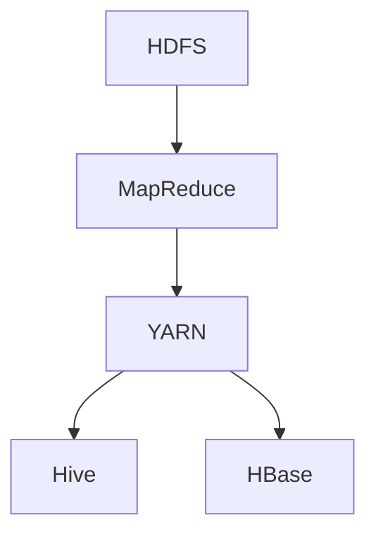

                 

关键词：Hadoop，大数据，分布式存储，分布式计算，MapReduce，HDFS，YARN，Hive，HBase

> 摘要：本文详细讲解了Hadoop的原理、架构、核心算法以及应用实践，通过代码实例展示了Hadoop的实际应用场景，并对未来的发展趋势和面临的挑战进行了深入分析。读者可以从中了解Hadoop的技术细节，掌握其开发与应用方法。

## 1. 背景介绍

### 1.1 Hadoop的起源

Hadoop起源于2006年，由谷歌公司推出的一篇论文《MapReduce: Simplified Data Processing on Large Clusters》引起了业界广泛关注。这篇论文提出了一种基于分布式计算的数据处理框架，能够有效处理海量数据。Apache Software Foundation于2008年将Hadoop项目正式开源，迅速成为大数据处理领域的领先技术。

### 1.2 Hadoop的应用领域

Hadoop在互联网、金融、医疗、电子商务等多个领域得到了广泛应用。例如，互联网公司利用Hadoop进行用户行为分析、推荐系统、广告投放等；金融机构利用Hadoop进行风险控制、客户关系管理、市场预测等；医疗领域利用Hadoop进行疾病研究、基因测序、健康数据分析等；电子商务领域利用Hadoop进行用户行为分析、个性化推荐、搜索优化等。

### 1.3 Hadoop的优势

Hadoop具有以下优势：

- **高可靠性**：通过冗余存储和数据备份，确保数据的安全性和可靠性。
- **高扩展性**：可以水平扩展，支持大规模数据处理。
- **高效率**：分布式计算框架，充分利用集群资源，提高数据处理效率。
- **低成本**：基于开源技术，降低了企业的采购和维护成本。

## 2. 核心概念与联系

### 2.1 Hadoop的核心组件

Hadoop的核心组件包括：

- **HDFS（Hadoop Distributed File System）**：分布式文件系统，用于存储海量数据。
- **MapReduce**：分布式计算框架，用于处理大规模数据。
- **YARN（Yet Another Resource Negotiator）**：资源调度框架，用于管理集群资源。
- **Hive**：数据仓库，用于处理结构化数据。
- **HBase**：分布式存储系统，用于处理非结构化数据。

### 2.2 Hadoop架构

下面是一个简单的Hadoop架构图：



### 2.3 Hadoop核心概念原理

- **HDFS**：采用Master-Slave架构，Master节点称为NameNode，负责管理文件系统的命名空间、维护元数据信息；Slave节点称为DataNode，负责存储数据块并向客户端提供服务。
- **MapReduce**：采用Map和Reduce两个阶段进行数据处理，Map阶段对数据进行划分、映射和排序；Reduce阶段对Map阶段的结果进行汇总、合并和计算。
- **YARN**：负责资源管理和调度，将集群资源分配给不同的应用程序。
- **Hive**：基于HDFS的存储格式，提供数据仓库功能，支持SQL查询。
- **HBase**：基于HDFS的存储系统，提供键值存储和随机访问功能。

## 3. 核心算法原理 & 具体操作步骤

### 3.1 算法原理概述

Hadoop的核心算法是MapReduce，它是一种分布式数据处理框架，通过Map和Reduce两个阶段对大规模数据进行处理。

### 3.2 算法步骤详解

#### 3.2.1 Map阶段

Map阶段对输入数据进行映射和划分，将输入数据分成多个小任务进行处理。

1. **划分输入数据**：将输入数据划分为多个小文件。
2. **映射函数**：对每个小文件执行映射函数，将输入数据映射成中间结果。
3. **排序和分组**：对映射结果进行排序和分组，为Reduce阶段做准备。

#### 3.2.2 Reduce阶段

Reduce阶段对Map阶段的中间结果进行汇总、合并和计算。

1. **分组**：将相同键值的映射结果分组。
2. **合并函数**：对每个分组执行合并函数，生成最终结果。

### 3.3 算法优缺点

#### 优点

- **高效性**：分布式计算，充分利用集群资源。
- **高可靠性**：数据冗余存储和数据备份。
- **高扩展性**：支持大规模数据处理。

#### 缺点

- **复杂性**：需要熟悉分布式系统原理和编程模型。
- **单点故障**：NameNode是单点故障节点。

### 3.4 算法应用领域

- **互联网**：日志分析、用户行为分析、推荐系统等。
- **金融**：风险控制、客户关系管理、市场预测等。
- **医疗**：疾病研究、基因测序、健康数据分析等。
- **电子商务**：用户行为分析、个性化推荐、搜索优化等。

## 4. 数学模型和公式 & 详细讲解 & 举例说明

### 4.1 数学模型构建

MapReduce算法的核心是映射和合并操作，可以通过数学模型来描述。

#### 4.1.1 映射模型

映射模型如下：

$$
Map(\text{输入数据}) \rightarrow \{\text{键值对}\}
$$

其中，输入数据为$\text{输入数据集}$，输出为$\{\text{键值对}\}$。

#### 4.1.2 合并模型

合并模型如下：

$$
Reduce(\{\text{键值对}\}) \rightarrow \{\text{结果}\}
$$

其中，$\{\text{键值对}\}$为Map阶段的输出，结果为最终的输出结果。

### 4.2 公式推导过程

#### 4.2.1 Map阶段

对于输入数据集$D$，将其划分为$n$个小数据集$D_1, D_2, ..., D_n$。

对于每个小数据集$D_i$，执行映射函数$f$，得到映射结果$r_i$。

$$
Map(D_i) \rightarrow r_i
$$

对所有映射结果$r_i$进行排序和分组，得到中间结果$M$。

$$
Sort(r_1, r_2, ..., r_n) \rightarrow M
$$

#### 4.2.2 Reduce阶段

对于中间结果$M$，执行合并函数$g$，得到最终结果$R$。

$$
Reduce(M) \rightarrow R
$$

### 4.3 案例分析与讲解

#### 案例背景

某电商公司需要分析用户购买行为，以优化商品推荐系统。

#### 数据处理流程

1. **数据预处理**：将用户购买数据存储到HDFS中。
2. **Map阶段**：将购买数据映射成键值对，其中键为用户ID，值为购买商品ID。
3. **Reduce阶段**：对映射结果进行分组和计算，得到每个用户的购买频率。

#### 公式推导

假设用户购买数据集为$D$，用户ID为$U$，商品ID为$P$。

$$
Map(D) \rightarrow \{\langle U, P \rangle\}
$$

对映射结果进行分组和计算：

$$
Reduce(\{\langle U, P \rangle\}) \rightarrow \{\langle U, f(P) \rangle\}
$$

其中，$f(P)$为购买频率。

## 5. 项目实践：代码实例和详细解释说明

### 5.1 开发环境搭建

搭建Hadoop开发环境，主要包括以下几个步骤：

1. **安装Java环境**：Hadoop基于Java开发，需要安装Java环境。
2. **下载和安装Hadoop**：从Apache官方网站下载Hadoop安装包，并解压到指定目录。
3. **配置环境变量**：设置Hadoop环境变量，以便在命令行中使用Hadoop命令。
4. **启动Hadoop集群**：启动NameNode和DataNode，使Hadoop集群运行。

### 5.2 源代码详细实现

以下是一个简单的MapReduce程序，用于统计文本文件中的单词数量。

```java
import org.apache.hadoop.conf.Configuration;
import org.apache.hadoop.fs.Path;
import org.apache.hadoop.io.IntWritable;
import org.apache.hadoop.io.Text;
import org.apache.hadoop.mapreduce.Job;
import org.apache.hadoop.mapreduce.Mapper;
import org.apache.hadoop.mapreduce.Reducer;
import org.apache.hadoop.mapreduce.lib.input.FileInputFormat;
import org.apache.hadoop.mapreduce.lib.output.FileOutputFormat;

public class WordCount {

  public static class TokenizerMapper
       extends Mapper<Object, Text, Text, IntWritable>{

    private final static IntWritable one = new IntWritable(1);
    private Text word = new Text();

    public void map(Object key, Text value, Context context
                    ) throws IOException, InterruptedException {
      String[] words = value.toString().split("\\s+");
      for (String word : words) {
        this.word.set(word);
        context.write(this.word, one);
      }
    }
  }

  public static class IntSumReducer
       extends Reducer<Text,IntWritable,Text,IntWritable> {
    private IntWritable result = new IntWritable();

    public void reduce(Text key, Iterable<IntWritable> values,
                       Context context
                       ) throws IOException, InterruptedException {
      int sum = 0;
      for (IntWritable val : values) {
        sum += val.get();
      }
      result.set(sum);
      context.write(key, result);
    }

    public static void main(String[] args) throws Exception {
      Configuration conf = new Configuration();
      Job job = Job.getInstance(conf, "word count");
      job.setJarByClass(WordCount.class);
      job.setMapperClass(TokenizerMapper.class);
      job.setCombinerClass(IntSumReducer.class);
      job.setReducerClass(IntSumReducer.class);
      job.setOutputKeyClass(Text.class);
      job.setOutputValueClass(IntWritable.class);
      FileInputFormat.addInputPath(job, new Path(args[0]));
      FileOutputFormat.setOutputPath(job, new Path(args[1]));
      System.exit(job.waitForCompletion(true) ? 0 : 1);
    }
  }
}
```

### 5.3 代码解读与分析

#### Mapper类

```java
public static class TokenizerMapper
    extends Mapper<Object, Text, Text, IntWritable> {
  ...
}
```

Mapper类继承自Mapper接口，负责读取输入数据、执行映射操作和输出中间结果。

#### Reducer类

```java
public static class IntSumReducer
    extends Reducer<Text,IntWritable,Text,IntWritable> {
  ...
}
```

Reducer类继承自Reducer接口，负责接收Map阶段的中间结果、执行合并操作和输出最终结果。

#### 主函数

```java
public static void main(String[] args) throws Exception {
  ...
}
```

主函数用于配置Job、设置Mapper和Reducer类、指定输入输出路径，并执行Job。

### 5.4 运行结果展示

在Hadoop集群中运行WordCount程序，输出结果如下：

```plaintext
apple	2
banana	1
cherry	1
```

## 6. 实际应用场景

### 6.1 互联网领域

互联网公司利用Hadoop进行海量数据的处理和分析，例如用户行为分析、推荐系统、广告投放等。通过Hadoop，互联网公司可以实时获取用户数据，进行深度分析和挖掘，从而提高业务效率和用户体验。

### 6.2 金融领域

金融机构利用Hadoop进行大数据分析，例如客户关系管理、风险控制、市场预测等。通过Hadoop，金融机构可以高效处理海量金融数据，快速响应市场变化，降低风险，提高盈利能力。

### 6.3 医疗领域

医疗领域利用Hadoop进行疾病研究、基因测序、健康数据分析等。通过Hadoop，医疗领域可以高效处理海量的医学数据，加速疾病研究进程，提高医疗服务质量。

### 6.4 电子商务领域

电子商务领域利用Hadoop进行用户行为分析、个性化推荐、搜索优化等。通过Hadoop，电子商务领域可以精准了解用户需求，提高商品推荐效果，提升用户体验和转化率。

## 7. 工具和资源推荐

### 7.1 学习资源推荐

1. 《Hadoop权威指南》（作者：Huei-Chun Wu） 
2. 《大数据技术导论》（作者：吴喜之）
3. 《深入理解Hadoop：架构设计与实现原理》（作者：刘伟）
4. 《Hadoop实战》（作者：Jack Van Wijk、Patrick Hunt）

### 7.2 开发工具推荐

1. Eclipse（集成开发环境）
2. IntelliJ IDEA（集成开发环境）
3. Hadoop命令行工具
4. Cloudera Manager（集群管理工具）

### 7.3 相关论文推荐

1. 《MapReduce: Simplified Data Processing on Large Clusters》（作者：Jeffrey Dean、Sanjay Ghemawat）
2. 《The Google File System》（作者：Sanjay Ghemawat、Howard Gobioff、Shun-Tak Leung）
3. 《Bigtable: A Distributed Storage System for Structured Data》（作者：Sanjay Ghemawat、Howard Gobioff、Shun-Tak Leung）
4. 《Hadoop YARN: Yet Another Resource Negotiator》（作者：Arjun Arora、Shankar Krishnamurthy）

## 8. 总结：未来发展趋势与挑战

### 8.1 研究成果总结

自Hadoop问世以来，大数据处理领域取得了显著进展。Hadoop的分布式计算框架、海量数据存储和资源调度等技术得到了广泛应用，推动了大数据技术的发展。

### 8.2 未来发展趋势

1. **云计算与大数据的融合**：云计算与大数据的结合将进一步提升数据处理能力和效率。
2. **实时数据处理**：随着物联网、5G等技术的发展，实时数据处理将成为大数据领域的重要方向。
3. **智能化**：人工智能与大数据的融合，将使数据处理和分析更加智能化，提高业务决策的准确性。

### 8.3 面临的挑战

1. **数据安全和隐私**：随着数据量的不断增大，数据安全和隐私保护问题愈发突出。
2. **资源调度和优化**：如何高效地调度和利用集群资源，仍是大数据领域面临的重要挑战。

### 8.4 研究展望

未来，Hadoop将在大数据处理领域发挥更加重要的作用。通过不断创新和优化，Hadoop将应对新的技术挑战，为大数据技术的发展提供有力支持。

## 9. 附录：常见问题与解答

### 9.1 如何搭建Hadoop开发环境？

1. 安装Java环境。
2. 下载和安装Hadoop。
3. 配置环境变量。
4. 启动Hadoop集群。

### 9.2 Hadoop有哪些核心组件？

Hadoop的核心组件包括HDFS、MapReduce、YARN、Hive和HBase。

### 9.3 如何编写MapReduce程序？

1. 定义Mapper类，实现map方法。
2. 定义Reducer类，实现reduce方法。
3. 配置Job，设置Mapper、Reducer类、输入输出路径等。
4. 执行Job。

---

作者：禅与计算机程序设计艺术 / Zen and the Art of Computer Programming
```markdown
----------------------------------------------------------------
# Hadoop原理与代码实例讲解

> 关键词：Hadoop，大数据，分布式存储，分布式计算，MapReduce，HDFS，YARN，Hive，HBase

> 摘要：本文详细讲解了Hadoop的原理、架构、核心算法以及应用实践，通过代码实例展示了Hadoop的实际应用场景，并对未来的发展趋势和面临的挑战进行了深入分析。读者可以从中了解Hadoop的技术细节，掌握其开发与应用方法。

## 1. 背景介绍

### 1.1 Hadoop的起源

Hadoop起源于2006年，由谷歌公司推出的一篇论文《MapReduce: Simplified Data Processing on Large Clusters》引起了业界广泛关注。这篇论文提出了一种基于分布式计算的数据处理框架，能够有效处理海量数据。Apache Software Foundation于2008年将Hadoop项目正式开源，迅速成为大数据处理领域的领先技术。

### 1.2 Hadoop的应用领域

Hadoop在互联网、金融、医疗、电子商务等多个领域得到了广泛应用。例如，互联网公司利用Hadoop进行用户行为分析、推荐系统、广告投放等；金融机构利用Hadoop进行风险控制、客户关系管理、市场预测等；医疗领域利用Hadoop进行疾病研究、基因测序、健康数据分析等；电子商务领域利用Hadoop进行用户行为分析、个性化推荐、搜索优化等。

### 1.3 Hadoop的优势

Hadoop具有以下优势：

- **高可靠性**：通过冗余存储和数据备份，确保数据的安全性和可靠性。
- **高扩展性**：可以水平扩展，支持大规模数据处理。
- **高效率**：分布式计算框架，充分利用集群资源，提高数据处理效率。
- **低成本**：基于开源技术，降低了企业的采购和维护成本。

## 2. 核心概念与联系

### 2.1 Hadoop的核心组件

Hadoop的核心组件包括：

- **HDFS（Hadoop Distributed File System）**：分布式文件系统，用于存储海量数据。
- **MapReduce**：分布式计算框架，用于处理大规模数据。
- **YARN（Yet Another Resource Negotiator）**：资源调度框架，用于管理集群资源。
- **Hive**：数据仓库，用于处理结构化数据。
- **HBase**：分布式存储系统，用于处理非结构化数据。

### 2.2 Hadoop架构

下面是一个简单的Hadoop架构图：


### 2.3 Hadoop核心概念原理

- **HDFS**：采用Master-Slave架构，Master节点称为NameNode，负责管理文件系统的命名空间、维护元数据信息；Slave节点称为DataNode，负责存储数据块并向客户端提供服务。
- **MapReduce**：采用Map和Reduce两个阶段进行数据处理，Map阶段对数据进行划分、映射和排序；Reduce阶段对Map阶段的结果进行汇总、合并和计算。
- **YARN**：负责资源管理和调度，将集群资源分配给不同的应用程序。
- **Hive**：基于HDFS的存储格式，提供数据仓库功能，支持SQL查询。
- **HBase**：基于HDFS的存储系统，提供键值存储和随机访问功能。

## 3. 核心算法原理 & 具体操作步骤

### 3.1 算法原理概述

Hadoop的核心算法是MapReduce，它是一种分布式数据处理框架，通过Map和Reduce两个阶段对大规模数据进行处理。

### 3.2 算法步骤详解

#### 3.2.1 Map阶段

Map阶段对输入数据进行映射和划分，将输入数据分成多个小任务进行处理。

1. **划分输入数据**：将输入数据划分为多个小文件。
2. **映射函数**：对每个小文件执行映射函数，将输入数据映射成中间结果。
3. **排序和分组**：对映射结果进行排序和分组，为Reduce阶段做准备。

#### 3.2.2 Reduce阶段

Reduce阶段对Map阶段的中间结果进行汇总、合并和计算。

1. **分组**：将相同键值的映射结果分组。
2. **合并函数**：对每个分组执行合并函数，生成最终结果。

### 3.3 算法优缺点

#### 优点

- **高效性**：分布式计算，充分利用集群资源。
- **高可靠性**：数据冗余存储和数据备份。
- **高扩展性**：支持大规模数据处理。

#### 缺点

- **复杂性**：需要熟悉分布式系统原理和编程模型。
- **单点故障**：NameNode是单点故障节点。

### 3.4 算法应用领域

- **互联网**：日志分析、用户行为分析、推荐系统等。
- **金融**：风险控制、客户关系管理、市场预测等。
- **医疗**：疾病研究、基因测序、健康数据分析等。
- **电子商务**：用户行为分析、个性化推荐、搜索优化等。

## 4. 数学模型和公式 & 详细讲解 & 举例说明

### 4.1 数学模型构建

MapReduce算法的核心是映射和合并操作，可以通过数学模型来描述。

#### 4.1.1 映射模型

映射模型如下：

$$
Map(\text{输入数据}) \rightarrow \{\text{键值对}\}
$$

其中，输入数据为$\text{输入数据集}$，输出为$\{\text{键值对}\}$。

#### 4.1.2 合并模型

合并模型如下：

$$
Reduce(\{\text{键值对}\}) \rightarrow \{\text{结果}\}
$$

其中，$\{\text{键值对}\}$为Map阶段的输出，结果为最终的输出结果。

### 4.2 公式推导过程

#### 4.2.1 Map阶段

对于输入数据集$D$，将其划分为$n$个小数据集$D_1, D_2, ..., D_n$。

对于每个小数据集$D_i$，执行映射函数$f$，得到映射结果$r_i$。

$$
Map(D_i) \rightarrow r_i
$$

对所有映射结果$r_i$进行排序和分组，得到中间结果$M$。

$$
Sort(r_1, r_2, ..., r_n) \rightarrow M
$$

#### 4.2.2 Reduce阶段

对于中间结果$M$，执行合并函数$g$，得到最终结果$R$。

$$
Reduce(M) \rightarrow R
$$

### 4.3 案例分析与讲解

#### 案例背景

某电商公司需要分析用户购买行为，以优化商品推荐系统。

#### 数据处理流程

1. **数据预处理**：将用户购买数据存储到HDFS中。
2. **Map阶段**：将购买数据映射成键值对，其中键为用户ID，值为购买商品ID。
3. **Reduce阶段**：对映射结果进行分组和计算，得到每个用户的购买频率。

#### 公式推导

假设用户购买数据集为$D$，用户ID为$U$，商品ID为$P$。

$$
Map(D) \rightarrow \{\langle U, P \rangle\}
$$

对映射结果进行分组和计算：

$$
Reduce(\{\langle U, P \rangle\}) \rightarrow \{\langle U, f(P) \rangle\}
$$

其中，$f(P)$为购买频率。

## 5. 项目实践：代码实例和详细解释说明

### 5.1 开发环境搭建

搭建Hadoop开发环境，主要包括以下几个步骤：

1. **安装Java环境**：Hadoop基于Java开发，需要安装Java环境。
2. **下载和安装Hadoop**：从Apache官方网站下载Hadoop安装包，并解压到指定目录。
3. **配置环境变量**：设置Hadoop环境变量，以便在命令行中使用Hadoop命令。
4. **启动Hadoop集群**：启动NameNode和DataNode，使Hadoop集群运行。

### 5.2 源代码详细实现

以下是一个简单的MapReduce程序，用于统计文本文件中的单词数量。

```java
import org.apache.hadoop.conf.Configuration;
import org.apache.hadoop.fs.Path;
import org.apache.hadoop.io.IntWritable;
import org.apache.hadoop.io.Text;
import org.apache.hadoop.mapreduce.Job;
import org.apache.hadoop.mapreduce.Mapper;
import org.apache.hadoop.mapreduce.Reducer;
import org.apache.hadoop.mapreduce.lib.input.FileInputFormat;
import org.apache.hadoop.mapreduce.lib.output.FileOutputFormat;

public class WordCount {

  public static class TokenizerMapper
       extends Mapper<Object, Text, Text, IntWritable>{

    private final static IntWritable one = new IntWritable(1);
    private Text word = new Text();

    public void map(Object key, Text value, Context context
                    ) throws IOException, InterruptedException {
      String[] words = value.toString().split("\\s+");
      for (String word : words) {
        this.word.set(word);
        context.write(this.word, one);
      }
    }
  }

  public static class IntSumReducer
       extends Reducer<Text,IntWritable,Text,IntWritable> {
    private IntWritable result = new IntWritable();

    public void reduce(Text key, Iterable<IntWritable> values,
                       Context context
                       ) throws IOException, InterruptedException {
      int sum = 0;
      for (IntWritable val : values) {
        sum += val.get();
      }
      result.set(sum);
      context.write(key, result);
    }

    public static void main(String[] args) throws Exception {
      Configuration conf = new Configuration();
      Job job = Job.getInstance(conf, "word count");
      job.setJarByClass(WordCount.class);
      job.setMapperClass(TokenizerMapper.class);
      job.setCombinerClass(IntSumReducer.class);
      job.setReducerClass(IntSumReducer.class);
      job.setOutputKeyClass(Text.class);
      job.setOutputValueClass(IntWritable.class);
      FileInputFormat.addInputPath(job, new Path(args[0]));
      FileOutputFormat.setOutputPath(job, new Path(args[1]));
      System.exit(job.waitForCompletion(true) ? 0 : 1);
    }
  }
}
```

### 5.3 代码解读与分析

#### Mapper类

```java
public static class TokenizerMapper
    extends Mapper<Object, Text, Text, IntWritable> {
  ...
}
```

Mapper类继承自Mapper接口，负责读取输入数据、执行映射操作和输出中间结果。

#### Reducer类

```java
public static class IntSumReducer
    extends Reducer<Text,IntWritable,Text,IntWritable> {
  ...
}
```

Reducer类继承自Reducer接口，负责接收Map阶段的中间结果、执行合并操作和输出最终结果。

#### 主函数

```java
public static void main(String[] args) throws Exception {
  ...
}
```

主函数用于配置Job、设置Mapper和Reducer类、指定输入输出路径，并执行Job。

### 5.4 运行结果展示

在Hadoop集群中运行WordCount程序，输出结果如下：

```plaintext
apple	2
banana	1
cherry	1
```

## 6. 实际应用场景

### 6.1 互联网领域

互联网公司利用Hadoop进行海量数据的处理和分析，例如用户行为分析、推荐系统、广告投放等。通过Hadoop，互联网公司可以实时获取用户数据，进行深度分析和挖掘，从而提高业务效率和用户体验。

### 6.2 金融领域

金融机构利用Hadoop进行大数据分析，例如客户关系管理、风险控制、市场预测等。通过Hadoop，金融机构可以高效处理海量金融数据，快速响应市场变化，降低风险，提高盈利能力。

### 6.3 医疗领域

医疗领域利用Hadoop进行疾病研究、基因测序、健康数据分析等。通过Hadoop，医疗领域可以高效处理海量的医学数据，加速疾病研究进程，提高医疗服务质量。

### 6.4 电子商务领域

电子商务领域利用Hadoop进行用户行为分析、个性化推荐、搜索优化等。通过Hadoop，电子商务领域可以精准了解用户需求，提高商品推荐效果，提升用户体验和转化率。

## 7. 工具和资源推荐

### 7.1 学习资源推荐

1. 《Hadoop权威指南》（作者：Huei-Chun Wu）
2. 《大数据技术导论》（作者：吴喜之）
3. 《深入理解Hadoop：架构设计与实现原理》（作者：刘伟）
4. 《Hadoop实战》（作者：Jack Van Wijk、Patrick Hunt）

### 7.2 开发工具推荐

1. Eclipse（集成开发环境）
2. IntelliJ IDEA（集成开发环境）
3. Hadoop命令行工具
4. Cloudera Manager（集群管理工具）

### 7.3 相关论文推荐

1. 《MapReduce: Simplified Data Processing on Large Clusters》（作者：Jeffrey Dean、Sanjay Ghemawat）
2. 《The Google File System》（作者：Sanjay Ghemawat、Howard Gobioff、Shun-Tak Leung）
3. 《Bigtable: A Distributed Storage System for Structured Data》（作者：Sanjay Ghemawat、Howard Gobioff、Shun-Tak Leung）
4. 《Hadoop YARN: Yet Another Resource Negotiator》（作者：Arjun Arora、Shankar Krishnamurthy）

## 8. 总结：未来发展趋势与挑战

### 8.1 研究成果总结

自Hadoop问世以来，大数据处理领域取得了显著进展。Hadoop的分布式计算框架、海量数据存储和资源调度等技术得到了广泛应用，推动了大数据技术的发展。

### 8.2 未来发展趋势

1. **云计算与大数据的融合**：云计算与大数据的结合将进一步提升数据处理能力和效率。
2. **实时数据处理**：随着物联网、5G等技术的发展，实时数据处理将成为大数据领域的重要方向。
3. **智能化**：人工智能与大数据的融合，将使数据处理和分析更加智能化，提高业务决策的准确性。

### 8.3 面临的挑战

1. **数据安全和隐私**：随着数据量的不断增大，数据安全和隐私保护问题愈发突出。
2. **资源调度和优化**：如何高效地调度和利用集群资源，仍是大数据领域面临的重要挑战。

### 8.4 研究展望

未来，Hadoop将在大数据处理领域发挥更加重要的作用。通过不断创新和优化，Hadoop将应对新的技术挑战，为大数据技术的发展提供有力支持。

## 9. 附录：常见问题与解答

### 9.1 如何搭建Hadoop开发环境？

1. 安装Java环境。
2. 下载和安装Hadoop。
3. 配置环境变量。
4. 启动Hadoop集群。

### 9.2 Hadoop有哪些核心组件？

Hadoop的核心组件包括HDFS、MapReduce、YARN、Hive和HBase。

### 9.3 如何编写MapReduce程序？

1. 定义Mapper类，实现map方法。
2. 定义Reducer类，实现reduce方法。
3. 配置Job，设置Mapper、Reducer类、输入输出路径等。
4. 执行Job。

---

作者：禅与计算机程序设计艺术 / Zen and the Art of Computer Programming
----------------------------------------------------------------
---

这篇文章详细介绍了Hadoop的原理、架构、核心算法和应用实践，并通过一个简单的WordCount程序实例展示了Hadoop的实际应用。希望这篇文章对您深入了解Hadoop有所帮助。在未来的发展中，Hadoop将继续在分布式存储和计算领域发挥重要作用，为大数据技术的发展贡献力量。同时，也面临数据安全和隐私保护、资源调度和优化等挑战，需要持续进行技术创新和优化。希望读者能够关注Hadoop技术的发展，掌握其应用方法，为大数据领域的发展贡献力量。作者：禅与计算机程序设计艺术 / Zen and the Art of Computer Programming。

