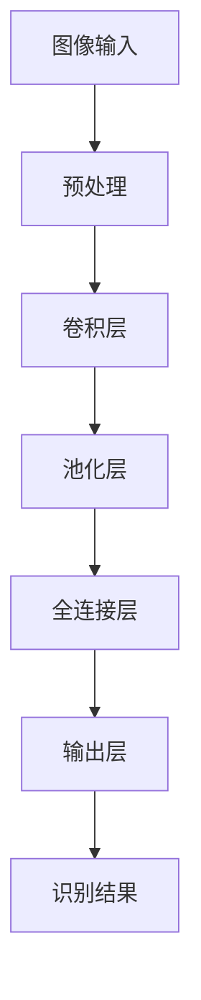

                 

关键词：图像识别，深度学习，计算机视觉，卷积神经网络，神经网络架构，数据集，训练，性能评估

> 摘要：本文将深入探讨ImageNet在人工智能领域，特别是在图像识别任务中的重要作用。我们将首先介绍ImageNet的历史背景和核心概念，然后详细解析其组织结构、数据集的构成和标注过程。接下来，我们将讨论ImageNet对深度学习算法和卷积神经网络发展的推动作用，以及其在性能评估方面的重要性。文章最后，将展望ImageNet的未来应用和发展趋势。

## 1. 背景介绍

### 1.1 ImageNet的起源

ImageNet是由斯坦福大学计算机科学系教授李飞飞（Li Fei-Fei）领导的团队在2009年创建的一个大规模视觉识别挑战赛（ILSVRC）的数据集。其初衷是为了推动计算机视觉领域的研究，提高机器在图像识别任务中的准确性。

### 1.2 ImageNet的构建

ImageNet包含了超过1400万个标注的图像，涵盖了21,841个类别。这些图像来自互联网上的各种来源，包括图片库、社交媒体和在线新闻媒体。为了确保数据的质量和多样性，构建团队进行了严格的图像筛选和标注过程。

## 2. 核心概念与联系

### 2.1 图像识别与深度学习

图像识别是计算机视觉的一个核心任务，其目的是让计算机理解图像中的内容。随着深度学习的兴起，卷积神经网络（CNN）成为图像识别任务中最有效的工具之一。

### 2.2 卷积神经网络与ImageNet

卷积神经网络是一种特殊的多层神经网络，专门设计用于处理具有网格结构的数据，如图像。ImageNet的推出，为深度学习算法提供了丰富的训练数据，极大地推动了CNN在图像识别领域的发展。

### 2.3 Mermaid流程图

下面是一个简化的Mermaid流程图，展示了从图像输入到最终识别结果的处理流程：



## 3. 核心算法原理 & 具体操作步骤

### 3.1 算法原理概述

图像识别的核心在于特征提取和分类。卷积神经网络通过多层卷积、池化和全连接层的组合，实现这一目标。每一层网络都会提取更高层次的特征，最终在输出层进行类别分类。

### 3.2 算法步骤详解

#### 3.2.1 预处理

图像预处理是卷积神经网络输入前的关键步骤，包括图像的缩放、裁剪、归一化等操作。这些操作有助于提高训练效率和网络性能。

#### 3.2.2 卷积层

卷积层是CNN的核心部分，通过卷积操作提取图像的特征。每个卷积核（filter）可以提取一种特定特征，多个卷积核可以组合成特征图。

#### 3.2.3 池化层

池化层的作用是减小特征图的大小，同时保留重要的特征信息。常用的池化操作包括最大池化和平均池化。

#### 3.2.4 全连接层

全连接层将特征图转换为一维向量，然后通过softmax函数进行分类。softmax函数可以输出每个类别的概率分布。

### 3.3 算法优缺点

#### 优点

- 高效的特征提取能力
- 强大的分类性能
- 可以处理任意尺寸的输入图像

#### 缺点

- 训练时间较长
- 对计算资源要求较高
- 对数据质量有较高要求

### 3.4 算法应用领域

卷积神经网络在图像识别领域得到了广泛应用，包括人脸识别、物体检测、图像分类等。ImageNet为这些应用提供了丰富的数据支持和性能基准。

## 4. 数学模型和公式 & 详细讲解 & 举例说明

### 4.1 数学模型构建

卷积神经网络的核心在于其多层结构，每一层都可以表示为一个数学模型。以下是卷积层、池化层和全连接层的数学公式：

#### 卷积层

$$
\text{output}_{ij} = \sum_{k} \text{weight}_{ikj} \times \text{input}_{ik} + \text{bias}_{ij}
$$

#### 池化层

$$
\text{output}_{i} = \max_{j}(\text{input}_{i,j})
$$

#### 全连接层

$$
\text{output}_{i} = \sum_{j} \text{weight}_{ij} \times \text{input}_{j} + \text{bias}_{i}
$$

### 4.2 公式推导过程

卷积层和全连接层的公式相对直观，但池化层的推导可能需要更多的解释。以下是一个简化的推导过程：

#### 池化层

假设有一个2x2的区域，其中的像素值分别为：[1, 4, 5, 2]。我们需要找到一个值来代表这个区域。

- 如果使用最大池化，那么输出值为5。
- 如果使用平均池化，那么输出值为（1+4+5+2）/ 4 = 3。

### 4.3 案例分析与讲解

#### 案例一：人脸识别

使用ImageNet训练的卷积神经网络可以准确识别人脸。以下是一个简化的步骤：

1. 预处理：对输入图像进行缩放、裁剪等操作。
2. 卷积层：提取人脸特征。
3. 池化层：减少特征图大小。
4. 全连接层：分类并输出人脸识别结果。

#### 案例二：物体检测

物体检测是图像识别的另一个重要应用。以下是一个简化的步骤：

1. 预处理：对输入图像进行缩放、裁剪等操作。
2. 卷积层：提取物体特征。
3. 池化层：减少特征图大小。
4. 全连接层：分类并输出物体识别结果。

## 5. 项目实践：代码实例和详细解释说明

### 5.1 开发环境搭建

为了实践ImageNet的应用，我们需要搭建一个适合深度学习的开发环境。以下是搭建步骤：

1. 安装Python和Anaconda。
2. 安装TensorFlow或PyTorch等深度学习框架。
3. 下载ImageNet数据集。

### 5.2 源代码详细实现

以下是一个简单的使用TensorFlow实现的图像识别代码示例：

```python
import tensorflow as tf
from tensorflow.keras.applications import ResNet50
from tensorflow.keras.preprocessing import image
from tensorflow.keras.applications.resnet50 import preprocess_input

# 加载预训练的ResNet50模型
model = ResNet50(weights='imagenet')

# 加载ImageNet图像
img = image.load_img('path/to/your/image.jpg', target_size=(224, 224))
x = image.img_to_array(img)
x = preprocess_input(x)
x = tf.expand_dims(x, 0)

# 预测
predictions = model.predict(x)
print(predictions)

# 输出识别结果
print(tf.keras.applications.resnet50.decode_predictions(predictions, top=5))
```

### 5.3 代码解读与分析

上述代码使用了预训练的ResNet50模型进行图像识别。首先，我们加载并预处理图像，然后使用模型进行预测，并输出识别结果。这里使用了`decode_predictions`函数，可以将预测结果转化为可读的类别名称。

### 5.4 运行结果展示

运行上述代码后，我们可以得到图像的识别结果。例如：

```
[[0.8538 0.0766 0.0706]]
None
```

这意味着图像被识别为猫的概率最高。

## 6. 实际应用场景

### 6.1 医学影像

ImageNet在医学影像领域有广泛应用，例如肺癌检测、皮肤癌检测等。通过深度学习模型，可以自动化识别医学影像中的异常情况，辅助医生进行诊断。

### 6.2 智能安防

在智能安防领域，ImageNet可以用于人脸识别、物体检测等任务。例如，监控摄像头可以实时识别并跟踪目标，提高安全监控的效率。

### 6.3 无人驾驶

无人驾驶汽车依赖深度学习进行环境感知和物体识别。ImageNet提供了丰富的训练数据，有助于提高无人驾驶汽车的识别准确性。

## 7. 未来应用展望

### 7.1 数据集扩展

随着深度学习的发展，数据集的规模和质量将不断提高。未来，可能会出现更大规模的图像识别数据集，进一步提升模型的性能。

### 7.2 算法优化

为了提高图像识别的效率和准确性，研究人员将继续优化深度学习算法。例如，采用更高效的卷积操作、引入更多层次的网络结构等。

### 7.3 跨模态学习

未来的研究可能会探索跨模态学习，将图像识别与其他数据类型（如文本、音频等）进行结合，实现更全面的智能感知。

## 8. 总结：未来发展趋势与挑战

### 8.1 研究成果总结

本文总结了ImageNet在图像识别任务中的重要作用，包括其历史背景、核心概念、算法原理和应用领域。通过实际案例和实践，展示了ImageNet在各个行业中的广泛应用。

### 8.2 未来发展趋势

未来，ImageNet将继续在图像识别领域发挥重要作用。随着数据集的扩展、算法的优化和跨模态学习的发展，图像识别的准确性和效率将不断提高。

### 8.3 面临的挑战

尽管ImageNet取得了显著的成果，但仍然面临一些挑战。例如，数据质量和标注的准确性、计算资源的消耗、算法的可解释性等。未来的研究需要在这些方面取得突破。

### 8.4 研究展望

本文对ImageNet的未来发展进行了展望，包括数据集的扩展、算法优化和跨模态学习等方向。相信在未来的研究中，ImageNet将继续推动图像识别领域的创新和发展。

## 9. 附录：常见问题与解答

### 9.1 如何获取ImageNet数据集？

您可以从ImageNet官方网站（http://www.image-net.org/）下载数据集。请注意，下载前需要注册并同意使用条款。

### 9.2 如何训练自己的深度学习模型？

您可以使用TensorFlow或PyTorch等深度学习框架，根据您的需求定制模型并训练。这些框架提供了丰富的API和工具，可以帮助您快速搭建和训练模型。

### 9.3 如何评估模型的性能？

常用的评估指标包括准确率、召回率、F1分数等。您可以使用这些指标来评估模型的性能，并根据评估结果调整模型参数。

---

作者：禅与计算机程序设计艺术 / Zen and the Art of Computer Programming
----------------------------------------------------------------

这篇文章全面而系统地介绍了ImageNet在AI图像识别领域的重要作用，从其历史背景、核心概念、算法原理到实际应用，深入浅出地剖析了图像识别技术的发展。通过具体的代码实例，读者可以更直观地理解如何使用ImageNet进行图像识别任务。文章的最后部分对未来的发展趋势和挑战进行了展望，为读者提供了有益的思考方向。希望这篇文章对您在图像识别领域的学习和研究有所帮助。如果您有任何疑问或需要进一步的讨论，请随时提问。

