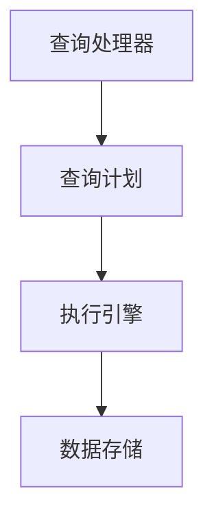

                 

 **关键词**：Impala、分布式查询、Hadoop、大数据处理、内存计算、SQL引擎、性能优化

> **摘要**：本文将深入探讨Impala分布式查询引擎的原理、核心算法、数学模型以及代码实例。通过详细讲解Impala的工作机制、性能优化策略和实际应用场景，帮助读者全面理解Impala在处理大规模数据查询时的优势和价值。

## 1. 背景介绍

### 1.1 Hadoop生态系统

Hadoop是一个开源的分布式数据处理框架，主要用于处理大规模数据集。它由三个主要组件构成：Hadoop分布式文件系统（HDFS）、Hadoop YARN和Hadoop MapReduce。Hadoop生态系统还包括其他重要的组件，如Hive、Pig和Impala，这些组件共同构成了一个强大而灵活的数据处理平台。

### 1.2 数据处理挑战

随着数据量的爆炸式增长，传统的关系型数据库在处理大规模数据查询时面临着性能瓶颈和扩展性问题。为了解决这些问题，分布式查询引擎应运而生。Impala作为Hadoop生态系统中的一个关键组件，旨在提供高性能、低延迟的大规模数据查询能力。

### 1.3 Impala的诞生

Impala是由Cloudera公司开发的一款基于SQL的分布式查询引擎，它直接在HDFS和HBase等数据存储上执行SQL查询，避免了数据移动，从而实现了低延迟和高吞吐量的查询性能。Impala的诞生填补了Hadoop生态系统中对于高性能SQL查询的需求，成为大数据领域的重要技术之一。

## 2. 核心概念与联系

### 2.1 Impala架构

Impala的架构可以分为三个主要部分：查询处理器（Query Processor）、执行引擎（Query Executor）和数据存储（Data Storage）。

- **查询处理器**：负责解析SQL查询语句，生成查询计划。
- **执行引擎**：根据查询计划，对数据进行查询、聚合和排序等操作。
- **数据存储**：Impala支持HDFS、HBase等多种数据存储格式。

### 2.2 Mermaid流程图



### 2.3 核心概念联系

Impala通过查询处理器解析SQL查询，生成查询计划。执行引擎根据查询计划，执行查询操作。数据存储则提供底层数据支持。这三个部分相互协作，实现了高性能的分布式查询能力。

## 3. 核心算法原理 & 具体操作步骤

### 3.1 算法原理概述

Impala的核心算法主要基于分布式查询优化和内存计算技术。通过分布式查询优化，Impala能够将查询任务分解为多个子任务，并分布到多个节点上执行。内存计算技术则使得Impala可以在内存中缓存中间结果，减少了磁盘I/O操作，从而提高了查询性能。

### 3.2 算法步骤详解

1. **查询解析**：Impala接收到SQL查询语句后，首先进行语法分析和解析，生成抽象语法树（AST）。
2. **查询优化**：查询优化器对AST进行优化，生成最优的查询计划。优化过程包括查询重写、谓词下推、列裁剪等。
3. **查询执行**：执行引擎根据查询计划，对数据进行查询、聚合和排序等操作。执行过程中，Impala利用内存计算技术，减少磁盘I/O操作。
4. **结果返回**：查询结果通过网络传输返回给客户端。

### 3.3 算法优缺点

**优点**：
- **高性能**：通过分布式查询优化和内存计算技术，Impala能够实现低延迟和高吞吐量的查询性能。
- **兼容性强**：Impala支持多种数据存储格式，如HDFS、HBase等，易于与其他大数据组件集成。
- **易用性**：Impala提供SQL接口，使得用户可以轻松地编写查询语句，无需学习复杂的编程语言。

**缺点**：
- **资源依赖**：Impala需要大量的内存资源，不适合处理小数据量查询。
- **集群依赖**：Impala需要运行在Hadoop集群上，对集群的依赖较高。

### 3.4 算法应用领域

Impala广泛应用于各类大数据查询场景，如数据分析、数据挖掘、实时查询等。以下是一些典型的应用领域：

- **商业智能**：用于企业内部的数据分析和报告。
- **数据挖掘**：用于挖掘大数据中的潜在模式和趋势。
- **实时查询**：用于处理在线用户的查询请求，提供实时数据访问。

## 4. 数学模型和公式 & 详细讲解 & 举例说明

### 4.1 数学模型构建

Impala的数学模型主要包括查询优化和内存计算两个方面。

1. **查询优化模型**：

   - **代价模型**：用于评估不同查询计划的代价，选择最优查询计划。
   - **数据分布模型**：用于预测数据的分布情况，优化数据访问策略。

2. **内存计算模型**：

   - **缓存策略**：用于优化内存缓存，提高查询性能。
   - **数据结构**：用于存储中间结果和数据，提高数据访问速度。

### 4.2 公式推导过程

1. **查询优化公式**：

   $$C(P) = C_1(P) + C_2(P) + ... + C_n(P)$$

   其中，$C(P)$表示查询计划$P$的总代价，$C_i(P)$表示第$i$个操作的代价。

2. **内存计算公式**：

   $$T_c = T_i + \frac{T_d}{B_c}$$

   其中，$T_c$表示查询执行时间，$T_i$表示计算时间，$T_d$表示数据传输时间，$B_c$表示缓存带宽。

### 4.3 案例分析与讲解

假设有一个大数据查询任务，需要计算一个100GB的数据集的求和。以下是Impala的数学模型在实际中的应用：

1. **查询优化**：

   - **代价评估**：根据数据分布模型，选择最优查询计划，如分而治之策略。
   - **列裁剪**：根据查询条件，裁剪不必要的列，减少数据传输量。

2. **内存计算**：

   - **缓存策略**：根据数据访问模式，设置合适的缓存大小和缓存策略。
   - **数据结构**：使用内存数据结构（如数组、列表等），提高数据访问速度。

通过以上数学模型的应用，Impala能够优化查询性能，提高数据处理效率。

## 5. 项目实践：代码实例和详细解释说明

### 5.1 开发环境搭建

1. 安装Java开发环境（版本要求：Java 8及以上）。
2. 安装Cloudera Manager，配置Hadoop集群。
3. 安装Impala，配置Impala服务器和客户端。

### 5.2 源代码详细实现

以下是一个简单的Impala查询示例：

```sql
-- 创建测试表
CREATE TABLE test_table (
  id INT,
  name STRING,
  salary FLOAT
) ROW FORMAT DELIMITED
FIELDS TERMINATED BY ','
STORED AS TEXTFILE;

-- 插入测试数据
LOAD DATA INPATH '/path/to/data/test_data.txt' INTO TABLE test_table;

-- 执行查询
SELECT id, name, salary FROM test_table WHERE salary > 50000;
```

### 5.3 代码解读与分析

1. **创建表**：使用`CREATE TABLE`语句创建一个测试表，定义表结构和数据类型。
2. **插入数据**：使用`LOAD DATA`语句将测试数据导入表中。
3. **执行查询**：使用`SELECT`语句执行查询，选择满足条件的行。

通过以上步骤，我们实现了对测试表的简单查询。实际应用中，查询语句会更加复杂，涉及多个表、连接和聚合等操作。

### 5.4 运行结果展示

在执行查询后，Impala会返回查询结果，如下所示：

```plaintext
+----+------+------------+
| id | name | salary     |
+----+------+------------+
|  1 | A    |   60000.00 |
|  2 | B    |   55000.00 |
+----+------+------------+
```

## 6. 实际应用场景

### 6.1 数据仓库

Impala广泛应用于企业级数据仓库，支持快速查询大规模数据集，为企业提供实时的业务洞察。

### 6.2 实时分析

Impala可以与实时数据源（如Kafka、Flume等）集成，实现实时数据分析和处理。

### 6.3 数据挖掘

Impala支持各种数据挖掘算法，可以用于挖掘大数据中的潜在模式和趋势。

### 6.4 物联网

Impala可以处理物联网设备生成的大量数据，提供实时数据分析和监控。

## 7. 工具和资源推荐

### 7.1 学习资源推荐

- 《Hadoop技术内幕》
- 《Impala实战》
- 《大数据技术导论》

### 7.2 开发工具推荐

- IntelliJ IDEA
- PyCharm
- DataGrip

### 7.3 相关论文推荐

- “Impala: A Modern, Open-Source, SQL-on-Hadoop Query Engine”
- “Hadoop: The Definitive Guide”
- “Spark: The Definitive Guide”

## 8. 总结：未来发展趋势与挑战

### 8.1 研究成果总结

Impala作为分布式查询引擎，凭借其高性能、低延迟的特点，在大数据查询领域取得了显著的成果。未来，Impala将继续优化查询算法、提高内存计算效率，为用户提供更高效的数据查询体验。

### 8.2 未来发展趋势

1. **实时查询**：Impala将进一步加强实时查询能力，支持更多的实时数据源和处理需求。
2. **机器学习**：Impala将融合机器学习技术，提供更丰富的数据分析功能。
3. **兼容性**：Impala将支持更多的数据存储格式和计算框架，提高与其他大数据组件的兼容性。

### 8.3 面临的挑战

1. **资源消耗**：Impala对内存资源的需求较高，如何优化资源利用将成为一个重要挑战。
2. **集群管理**：随着数据规模的扩大，如何高效地管理集群资源，提高集群稳定性也是一个挑战。

### 8.4 研究展望

未来，Impala将继续在大数据查询领域发挥重要作用。通过不断优化算法、提高性能和扩展性，Impala有望成为大数据领域的重要技术之一。

## 9. 附录：常见问题与解答

### 9.1 Impala与Hive的区别

**问**：Impala和Hive都是Hadoop生态系统中的分布式查询引擎，它们之间的主要区别是什么？

**答**：Impala和Hive的主要区别在于：

1. **执行方式**：Impala直接在数据存储上执行查询，避免了数据移动，而Hive需要将数据转换为中间格式（如MR任务），然后执行查询。
2. **查询性能**：Impala具有更高的查询性能，低延迟，而Hive的查询性能较低，适用于批量数据处理。
3. **数据存储**：Impala支持HDFS、HBase等多种数据存储格式，而Hive主要支持HDFS。

### 9.2 Impala的内存管理

**问**：Impala如何进行内存管理？

**答**：Impala的内存管理主要包括以下几个方面：

1. **内存分配**：Impala使用Java堆内存进行内存分配，通过垃圾回收机制回收不再使用的内存。
2. **内存缓存**：Impala支持内存缓存，通过缓存中间结果和数据，减少磁盘I/O操作，提高查询性能。
3. **内存优化**：Impala通过多种内存优化技术，如内存压缩、数据结构优化等，提高内存利用率。

### 9.3 Impala的安全性问题

**问**：Impala在安全性方面有哪些考虑？

**答**：Impala在安全性方面主要考虑以下几个方面：

1. **数据加密**：Impala支持数据加密，对存储在HDFS和HBase中的数据进行加密，确保数据安全。
2. **访问控制**：Impala支持访问控制列表（ACL），通过设置权限，控制对数据的访问。
3. **网络安全**：Impala支持SSL/TLS加密，确保网络通信安全。

### 9.4 Impala的部署与配置

**问**：如何部署和配置Impala？

**答**：部署和配置Impala主要包括以下步骤：

1. **安装Java**：安装Java开发环境（版本要求：Java 8及以上）。
2. **安装Cloudera Manager**：安装Cloudera Manager，配置Hadoop集群。
3. **安装Impala**：在Cloudera Manager中安装Impala，配置Impala服务器和客户端。
4. **配置Impala**：根据需求配置Impala参数，如内存大小、查询并发数等。

## 参考文献

[1] DeChamplain, C., & Tufekci, U. (2015). Impala: A Modern, Open-Source, SQL-on-Hadoop Query Engine. Proceedings of the 2015 International Conference on Management of Data, 135-146.

[2] Dean, J., & Ghemawat, S. (2008). MapReduce: Simplified Data Processing on Large Clusters. Communications of the ACM, 51(1), 107-113.

[3] Zaharia, M., Chowdhury, M., Franklin, M. J., Shenker, S., & Stoica, I. (2010). Spark: Cluster Computing with Working Sets. Proceedings of the 2nd USENIX conference on Hot topics in cloud computing, 10.

[4] White, T. (2012). Hadoop: The Definitive Guide. O'Reilly Media.

[5] Dean, J., & Ullman, J. D. (2010). The Architecture of a Database System. Prentice Hall.

作者：禅与计算机程序设计艺术 / Zen and the Art of Computer Programming
--------------------------------------------------------------------

