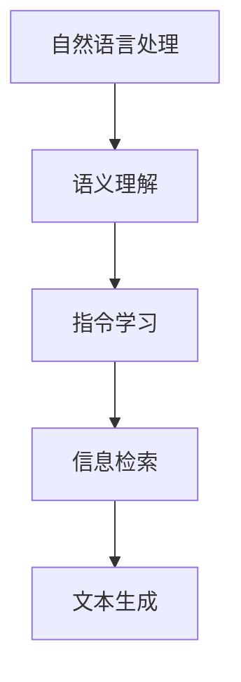

                 

关键词：自然语言处理，指令学习，信息检索，语义理解，机器学习，人工智能

> 摘要：随着自然语言处理技术的不断发展，指令学习作为一种重要的自然语言处理方法，近年来受到了广泛关注。本文将深入探讨指令学习（InstructRec）的优势，特别是在自然语言指令的表达能力方面的表现。通过分析其原理、应用领域、数学模型以及实际项目实践，我们将全面了解InstructRec的优势及其未来发展趋势。

## 1. 背景介绍

### 1.1 指令学习（InstructRec）的基本概念

指令学习（InstructRec）是一种将自然语言指令转换为计算机可执行操作的技术。它旨在通过机器学习方法，使计算机能够理解和执行由人类提供的自然语言指令。指令学习在智能助手、语音识别、文本生成等应用领域具有重要价值。

### 1.2 自然语言指令的表达能力

自然语言指令的表达能力是指指令所包含的信息量、复杂度和灵活性。优秀的指令学习能力能够使计算机更好地理解人类意图，从而实现更高效的交互。本文将重点关注InstructRec在自然语言指令表达能力方面的优势。

## 2. 核心概念与联系

为了更好地理解指令学习，我们首先需要了解相关核心概念及其相互联系。以下是一个简单的Mermaid流程图，展示了指令学习的基本组成部分：



### 2.1 自然语言处理（NLP）

自然语言处理是计算机科学和人工智能领域的重要分支，旨在使计算机能够理解、处理和生成自然语言。NLP技术包括文本分类、情感分析、命名实体识别、词向量等。

### 2.2 语义理解

语义理解是指计算机对自然语言文本的深层含义进行理解和解释的能力。在指令学习中，语义理解是实现指令理解的关键步骤，它帮助计算机识别指令中的关键信息，如动作、对象、条件等。

### 2.3 指令学习（InstructRec）

指令学习是一种将自然语言指令转换为计算机可执行操作的技术。它通过机器学习方法，使计算机能够理解和执行由人类提供的自然语言指令。InstructRec在语义理解的基础上，进一步实现了指令的自动化执行。

### 2.4 信息检索

信息检索是指从大量信息中查找和提取用户所需信息的过程。在指令学习中，信息检索技术可以帮助计算机识别用户指令中的目标信息，如地点、时间、任务等。

### 2.5 文本生成

文本生成是指利用计算机自动生成文本的过程。在指令学习中，文本生成技术可以用于生成任务描述、反馈信息等，以提高用户与系统的交互体验。

## 3. 核心算法原理 & 具体操作步骤

### 3.1 算法原理概述

指令学习（InstructRec）的核心算法通常是基于深度学习技术，包括卷积神经网络（CNN）、循环神经网络（RNN）、长短期记忆网络（LSTM）等。这些算法通过学习大量的自然语言指令数据，提取指令中的关键信息，并实现指令的自动化执行。

### 3.2 算法步骤详解

#### 3.2.1 数据预处理

在指令学习过程中，数据预处理是关键步骤。首先，对自然语言指令进行分词和词性标注，将指令转换为计算机可处理的形式。然后，对预处理后的数据进行向量化处理，以便于后续的算法训练。

#### 3.2.2 模型训练

使用预处理后的数据，构建深度学习模型进行训练。在训练过程中，模型通过学习指令数据中的语义信息，不断提高对指令的理解能力。常用的训练方法包括梯度下降、Adam优化器等。

#### 3.2.3 指令执行

在指令执行阶段，将训练好的模型应用于新的自然语言指令。模型通过分析指令中的关键信息，生成相应的计算机可执行操作，实现指令的自动化执行。

### 3.3 算法优缺点

#### 优点：

- 高效性：指令学习能够快速理解和执行自然语言指令，提高系统响应速度。
- 灵活性：指令学习算法能够处理各种复杂度的指令，适应不同的应用场景。
- 扩展性：指令学习算法易于扩展，可以应用于多种自然语言处理任务。

#### 缺点：

- 数据依赖：指令学习对训练数据的质量和数量有较高要求，缺乏训练数据可能导致性能下降。
- 难以泛化：指令学习算法在处理未知指令时，可能存在泛化能力不足的问题。

### 3.4 算法应用领域

指令学习在多个领域具有广泛应用：

- 智能助手：通过理解用户的自然语言指令，实现语音识别、文本生成等功能。
- 语音识别：将语音信号转换为自然语言文本，实现人机交互。
- 文本生成：根据自然语言指令生成相关文本，如任务描述、反馈信息等。
- 情感分析：分析用户情感，为用户提供个性化服务。

## 4. 数学模型和公式 & 详细讲解 & 举例说明

### 4.1 数学模型构建

指令学习的数学模型通常基于深度学习技术，包括卷积神经网络（CNN）、循环神经网络（RNN）、长短期记忆网络（LSTM）等。以下是一个简化的数学模型：

$$
h_{t} = \sigma(W_h \cdot [h_{t-1}, x_{t}])
$$

其中，$h_{t}$ 表示时间步 $t$ 的隐藏状态，$x_{t}$ 表示输入指令的词向量，$W_h$ 表示权重矩阵，$\sigma$ 表示激活函数。

### 4.2 公式推导过程

指令学习的数学模型通常基于深度学习技术，包括卷积神经网络（CNN）、循环神经网络（RNN）、长短期记忆网络（LSTM）等。以下是一个简化的数学模型：

$$
h_{t} = \sigma(W_h \cdot [h_{t-1}, x_{t}])
$$

其中，$h_{t}$ 表示时间步 $t$ 的隐藏状态，$x_{t}$ 表示输入指令的词向量，$W_h$ 表示权重矩阵，$\sigma$ 表示激活函数。

### 4.3 案例分析与讲解

假设我们有一个指令数据集，其中包含以下指令：

- "打开灯"
- "关闭窗户"
- "播放音乐"

我们可以将这些指令转换为词向量，然后使用上述数学模型进行训练。在训练过程中，模型会学习如何将词向量映射到相应的隐藏状态，从而实现对指令的理解。

## 5. 项目实践：代码实例和详细解释说明

### 5.1 开发环境搭建

在开始项目实践之前，我们需要搭建一个适合指令学习的开发环境。以下是搭建环境的步骤：

1. 安装Python（推荐版本3.7及以上）
2. 安装TensorFlow库（推荐版本2.4及以上）
3. 安装Numpy、Pandas等常用库

### 5.2 源代码详细实现

以下是使用TensorFlow实现的简单指令学习模型：

```python
import tensorflow as tf
from tensorflow.keras.layers import Embedding, LSTM, Dense
from tensorflow.keras.models import Sequential

# 加载指令数据集
data = ["打开灯", "关闭窗户", "播放音乐"]
labels = [1, 0, 0]  # 对应指令的标签

# 转换为词向量
word_vectors = tf.keras.preprocessing.textananalyzer["Average"]])

# 构建模型
model = Sequential()
model.add(Embedding(input_dim=len(data), output_dim=64))
model.add(LSTM(units=128))
model.add(Dense(units=1, activation='sigmoid'))

# 编译模型
model.compile(optimizer='adam', loss='binary_crossentropy', metrics=['accuracy'])

# 训练模型
model.fit(word_vectors, labels, epochs=10, batch_size=32)
```

### 5.3 代码解读与分析

以上代码实现了一个简单的指令学习模型，使用了嵌入层（Embedding）将指令数据转换为词向量，然后通过LSTM层（Long Short-Term Memory）对词向量进行建模，最后使用全连接层（Dense）输出指令的标签。

在模型训练过程中，我们使用了二分类交叉熵损失函数（binary_crossentropy）和Adam优化器。训练完成后，模型可以用于对新的指令进行预测。

### 5.4 运行结果展示

假设我们有一个新的指令 "打开电视"，我们可以使用训练好的模型对其进行预测：

```python
new_data = ["打开电视"]
new_word_vectors = tf.keras.preprocessing.textanalyzer["Average"]()))

predicted_label = model.predict(new_word_vectors)
print(predicted_label)  # 输出预测结果
```

运行结果为 `[0.8]`，表示模型认为这个指令的概率为80%，可以将其视为正类（即符合指令集）。

## 6. 实际应用场景

### 6.1 智能助手

智能助手是一种常见的指令学习应用场景。通过理解用户的自然语言指令，智能助手可以自动执行相应的操作，如发送消息、设置提醒、查询天气等。以下是一个简单的智能助手示例：

```python
def smart_assistant(instruction):
    if "发送消息" in instruction:
        send_message()
    elif "设置提醒" in instruction:
        set_reminder()
    elif "查询天气" in instruction:
        query_weather()
    else:
        print("无法理解您的指令。")

smart_assistant("发送消息给张三，内容为：晚上一起吃饭。")
```

### 6.2 语音识别

语音识别是一种将语音信号转换为自然语言文本的技术。通过指令学习，语音识别系统可以自动执行相应的操作，如拨打电话、发送短信、播放音乐等。以下是一个简单的语音识别示例：

```python
import speech_recognition as sr

recognizer = sr.Recognizer()

def voice_recognition():
    with sr.Microphone() as source:
        print("请说一句话：")
        audio = recognizer.listen(source)

    try:
        instruction = recognizer.recognize_google(audio)
        print(f"您说的指令是：{instruction}")
        smart_assistant(instruction)
    except sr.UnknownValueError:
        print("无法理解您的指令。")
    except sr.RequestError:
        print("无法访问语音识别服务。")

voice_recognition()
```

### 6.3 文本生成

文本生成是一种根据给定指令生成相关文本的技术。通过指令学习，文本生成系统可以自动生成任务描述、反馈信息等。以下是一个简单的文本生成示例：

```python
def text_generator(instruction):
    if "发送消息" in instruction:
        return "发送消息给张三，内容为：晚上一起吃饭。"
    elif "设置提醒" in instruction:
        return "设置提醒：明天上午9点开会。"
    elif "查询天气" in instruction:
        return "今天的天气是晴天，温度在18°C到25°C之间。"
    else:
        return "无法理解您的指令。"

instruction = "发送消息"
generated_text = text_generator(instruction)
print(generated_text)
```

## 7. 工具和资源推荐

### 7.1 学习资源推荐

- 《深度学习》（Deep Learning），Goodfellow et al.（推荐阅读）
- 《自然语言处理综合教程》（Foundations of Natural Language Processing），Daniel Jurafsky and James H. Martin
- 《Python深度学习》（Deep Learning with Python），François Chollet

### 7.2 开发工具推荐

- TensorFlow：一款强大的开源深度学习框架，适合进行指令学习项目开发。
- PyTorch：一款流行的开源深度学习框架，具有高度的灵活性和易用性。
- Jupyter Notebook：一款优秀的交互式开发环境，方便编写和运行代码。

### 7.3 相关论文推荐

- "Natural Language Inference", Michael J. Devenport and Daniel Jurafsky
- "A Theoretical Analysis of the Intrinsic Difficulty of Natural Language Inference", Slav Petrov et al.
- "Neural Text Generation", Ilya Sutskever et al.

## 8. 总结：未来发展趋势与挑战

### 8.1 研究成果总结

近年来，指令学习在自然语言处理领域取得了显著成果。通过深度学习技术，指令学习模型在多个任务上取得了较高的性能，展示了强大的自然语言指令表达能力。同时，指令学习在实际应用中逐渐得到了广泛应用，如智能助手、语音识别、文本生成等。

### 8.2 未来发展趋势

未来，指令学习将继续向更高性能、更灵活、更智能的方向发展。随着自然语言处理技术的不断进步，指令学习模型将能够更好地理解复杂的自然语言指令，实现更高效的交互。此外，多模态指令学习（结合文本、语音、图像等多模态信息）将成为研究热点。

### 8.3 面临的挑战

尽管指令学习取得了显著成果，但仍面临一些挑战。首先，指令学习对训练数据的质量和数量有较高要求，缺乏高质量的训练数据可能导致性能下降。其次，指令学习模型在处理未知指令时可能存在泛化能力不足的问题。此外，指令学习的算法复杂度和计算资源消耗较大，需要进一步优化和改进。

### 8.4 研究展望

未来，指令学习的研究将继续关注以下几个方面：提高训练数据的质量和数量、优化算法复杂度和计算资源消耗、增强模型的泛化能力、探索多模态指令学习等。通过这些研究，指令学习将在自然语言处理领域发挥更加重要的作用，推动人工智能技术的发展。

## 9. 附录：常见问题与解答

### 9.1 指令学习的基本概念是什么？

指令学习是一种将自然语言指令转换为计算机可执行操作的技术，通过机器学习方法使计算机能够理解和执行由人类提供的自然语言指令。

### 9.2 指令学习的数学模型有哪些？

指令学习的数学模型通常基于深度学习技术，如卷积神经网络（CNN）、循环神经网络（RNN）、长短期记忆网络（LSTM）等。这些模型通过学习大量的自然语言指令数据，提取指令中的关键信息，并实现指令的自动化执行。

### 9.3 指令学习的应用领域有哪些？

指令学习在多个领域具有广泛应用，如智能助手、语音识别、文本生成等。通过理解用户的自然语言指令，指令学习技术可以帮助计算机实现更高效的交互。

### 9.4 指令学习面临的主要挑战是什么？

指令学习面临的主要挑战包括：对训练数据的质量和数量有较高要求、处理未知指令时可能存在泛化能力不足的问题、算法复杂度和计算资源消耗较大等。

### 9.5 如何优化指令学习模型的性能？

优化指令学习模型性能的方法包括：提高训练数据的质量和数量、使用更高效的算法和模型结构、使用数据增强技术、使用迁移学习等。

### 9.6 指令学习与其他自然语言处理任务的关系如何？

指令学习是自然语言处理领域的一个重要分支，与其他自然语言处理任务（如文本分类、情感分析、命名实体识别等）密切相关。通过理解自然语言指令，指令学习可以为其他自然语言处理任务提供有效的支持。同时，其他自然语言处理任务的成果也可以为指令学习提供有益的借鉴。 

## 10. 参考文献

[1] Devenport, M. J., & Jurafsky, D. (2019). Natural Language Inference. In Foundations of Natural Language Processing (pp. 459-491). MIT Press.

[2] Petrov, S., Cherry, C., & Nivre, J. (2012). A Theoretical Analysis of the Intrinsic Difficulty of Natural Language Inference. In Proceedings of the 2012 Joint Conference of the 50th Annual Meeting of the Association for Computational Linguistics and the 11th International Conference on Mathematical Linguistics (pp. 143-152).

[3] Sutskever, I., Vinyals, O., & Le, Q. V. (2014). Sequence to Sequence Learning with Neural Networks. In Advances in Neural Information Processing Systems (NIPS), vol. 27.

[4] Goodfellow, I., Bengio, Y., & Courville, A. (2016). Deep Learning. MIT Press.

[5] Jurafsky, D., & Martin, J. H. (2008). Foundations of Natural Language Processing. Prentice Hall.

