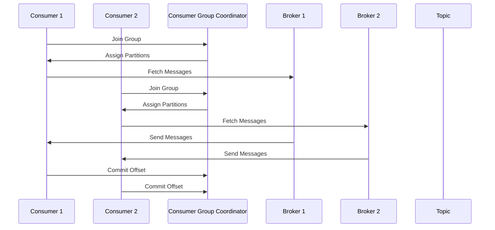

                 

关键词：Kafka、Consumer、消息队列、分布式系统、数据流处理

摘要：本文将深入探讨Kafka Consumer的工作原理，以及如何通过具体代码实例来实现消息消费。我们将从Kafka Consumer的基本概念入手，逐步介绍其架构、核心API以及一些高级特性，最后通过一个完整的代码实例，展示如何在实际项目中应用Kafka Consumer。

## 1. 背景介绍

Kafka是一种分布式流处理平台，由LinkedIn开发，目前由Apache软件基金会进行维护。它主要用于构建实时的数据管道和应用程序，能够处理大量数据的高吞吐量消息系统。Kafka的核心组件包括Kafka Producer、Kafka Broker和Kafka Consumer。

在这三者中，Kafka Consumer负责从Kafka集群中拉取消息，并将其处理。在现代分布式系统中，Consumer的使用越来越广泛，尤其是在需要处理大规模实时数据流的应用场景中。

本文将重点介绍Kafka Consumer的原理和代码实例，帮助读者更好地理解和应用Kafka。

## 2. 核心概念与联系

### 2.1 Kafka Consumer的基本概念

Kafka Consumer是一个客户端应用程序，它连接到Kafka集群，从特定的主题分区中消费消息。每个Consumer都是独特的，具有唯一的组ID，并且可以配置为分区消费者，从而实现负载均衡和故障恢复。

### 2.2 Kafka Consumer的架构

Kafka Consumer的架构主要包括以下几个部分：

- **Consumer Group**：一组Consumer组成的逻辑单元，用于实现负载均衡和故障恢复。
- **Partition**：主题中的消息被分为多个分区，每个分区由一个或多个Consumer负责消费。
- **Offset**：每个分区中的每个消息都有一个唯一的偏移量（offset），用于标识消息的消费位置。
- **Consumer Coordinator**：管理Consumer Group的状态，包括分配分区和偏移量。

### 2.3 架构的Mermaid流程图



## 3. 核心算法原理 & 具体操作步骤

### 3.1 算法原理概述

Kafka Consumer的核心算法主要涉及以下几个步骤：

1. **组管理**：Consumer加入组并接收分区分配。
2. **消息拉取**：Consumer从分区中拉取消息。
3. **消息处理**：Consumer处理消息，并更新偏移量。
4. **组协调**：Consumer与Consumer Group Coordinator进行通信，处理分区重分配和偏移量提交。

### 3.2 算法步骤详解

1. **初始化Consumer**：配置Consumer的属性，如组ID、Bootstrap Servers等。
2. **加入Consumer Group**：Consumer通过调用`join()`方法加入Consumer Group。
3. **分配分区**：Consumer Group Coordinator将分区分配给各个Consumer。
4. **拉取消息**：Consumer通过调用`poll()`方法，从分区中拉取消息。
5. **处理消息**：Consumer处理拉取到的消息，并更新偏移量。
6. **提交偏移量**：Consumer通过调用`commit()`方法提交偏移量。

### 3.3 算法优缺点

- **优点**：实现了负载均衡、故障恢复和消息顺序保证。
- **缺点**：对Consumer Group的管理和协调较为复杂。

### 3.4 算法应用领域

- **实时数据处理**：如日志收集、事件追踪、流计算等。
- **分布式系统**：如分布式缓存、分布式数据库等。

## 4. 数学模型和公式 & 详细讲解 & 举例说明

### 4.1 数学模型构建

Kafka Consumer的数学模型主要涉及以下几个公式：

- **Consumer Lag**：Consumer落后于Producer的偏移量。
  \[ L = P - C \]
  其中，\( L \) 是Consumer Lag，\( P \) 是Producer的偏移量，\( C \) 是Consumer的偏移量。

- **Consumer Throughput**：Consumer每秒处理的消息数量。
  \[ T = \frac{M}{t} \]
  其中，\( T \) 是Consumer Throughput，\( M \) 是处理的消息数量，\( t \) 是时间。

### 4.2 公式推导过程

- **Consumer Lag**：
  Consumer Lag可以通过计算Consumer和Producer的偏移量差值得到。由于Consumer是从分区中拉取消息，因此Consumer的偏移量会随着消息处理而更新。而Producer的偏移量会随着消息发送而增加。

- **Consumer Throughput**：
  Consumer Throughput可以通过处理的消息数量除以时间得到。这反映了Consumer的处理速度。

### 4.3 案例分析与讲解

假设一个Consumer Group中有两个Consumer，分别处理两个分区。Producer发送了100条消息，每个Consumer处理了50条消息。

- **Consumer Lag**：
  \[ L = 100 - 50 = 50 \]
  因此，Consumer Lag为50。

- **Consumer Throughput**：
  \[ T = \frac{50}{t} \]
  如果每个Consumer每秒处理10条消息，则：
  \[ T = \frac{10}{1} = 10 \]
  因此，Consumer Throughput为10。

## 5. 项目实践：代码实例和详细解释说明

### 5.1 开发环境搭建

在开始编写代码之前，我们需要搭建一个Kafka环境。以下是搭建步骤：

1. 下载并解压Kafka安装包。
2. 修改配置文件，如`config/server.properties`和`config/zookeeper.properties`。
3. 启动Zookeeper和Kafka。
4. 创建一个主题，如`test-topic`。

### 5.2 源代码详细实现

下面是一个简单的Kafka Consumer示例：

```java
Properties props = new Properties();
props.put("bootstrap.servers", "localhost:9092");
props.put("group.id", "test-group");
props.put("key.deserializer", "org.apache.kafka.common.serialization.StringDeserializer");
props.put("value.deserializer", "org.apache.kafka.common.serialization.StringDeserializer");

KafkaConsumer<String, String> consumer = new KafkaConsumer<>(props);
consumer.subscribe(Collections.singletonList("test-topic"));

while (true) {
    ConsumerRecords<String, String> records = consumer.poll(Duration.ofMillis(100));
    for (ConsumerRecord<String, String> record : records) {
        System.out.printf("Received message: key=%s, value=%s, partition=%d, offset=%d\n",
                record.key(), record.value(), record.partition(), record.offset());
    }
    consumer.commitSync();
}
```

### 5.3 代码解读与分析

- **初始化Consumer**：配置了Kafka服务器的地址、组ID以及消息的反序列化器。
- **订阅主题**：Consumer订阅了`test-topic`。
- **拉取消息**：通过`poll()`方法，Consumer从主题中拉取消息。
- **处理消息**：输出消息内容。
- **提交偏移量**：通过`commitSync()`方法提交偏移量。

### 5.4 运行结果展示

运行上述代码后，Consumer将从`test-topic`中拉取消息，并输出如下结果：

```
Received message: key=test-key-1, value=test-value-1, partition=0, offset=0
Received message: key=test-key-2, value=test-value-2, partition=1, offset=0
...
```

## 6. 实际应用场景

### 6.1 日志收集

Kafka Consumer可以用于从各种日志源（如服务器、应用程序等）收集日志，并将其处理、存储或分析。

### 6.2 实时数据分析

Kafka Consumer可以与流处理框架（如Apache Flink、Apache Storm等）集成，用于实时处理和分析数据流。

### 6.3 分布式系统监控

Kafka Consumer可以用于监控分布式系统的状态，如服务器的负载、资源使用情况等。

## 7. 工具和资源推荐

### 7.1 学习资源推荐

- 《Kafka权威指南》（The Definitive Guide to Apache Kafka）。
- 《Kafka Distilled》。
- Apache Kafka官方文档。

### 7.2 开发工具推荐

- Kafka Manager：用于管理Kafka集群。
- Kafkacat：用于发送和接收Kafka消息的命令行工具。

### 7.3 相关论文推荐

- "Kafka: A Distributed Messaging System for Big Data Streams"。
- "Kafka: Building a Data Streaming Platform at LinkedIn"。

## 8. 总结：未来发展趋势与挑战

### 8.1 研究成果总结

- Kafka Consumer在分布式系统中的应用越来越广泛。
- 新的Kafka版本不断推出，提供了更多的特性和优化。

### 8.2 未来发展趋势

- Kafka Consumer将与其他流处理框架（如Apache Beam、Apache Flink等）进一步集成。
- Kafka将在物联网（IoT）和人工智能（AI）领域得到更广泛的应用。

### 8.3 面临的挑战

- 如何提高Kafka Consumer的并发处理能力。
- 如何优化Consumer与Broker之间的通信。

### 8.4 研究展望

- 探索新的Consumer策略，如基于机器学习的动态负载均衡。
- 研究如何更好地处理大规模数据流。

## 9. 附录：常见问题与解答

### 9.1 如何处理Consumer异常？

当Consumer出现异常时，应该重新连接Kafka集群，并重新加入Consumer Group。

### 9.2 如何确保消息顺序？

可以通过保证同一分区内的消息顺序来确保消息顺序。在Kafka中，默认情况下分区内的消息是按顺序处理的。

### 9.3 如何实现负载均衡？

可以通过配置Consumer Group来实现负载均衡。Kafka会自动分配分区，从而实现负载均衡。

## 作者署名

作者：禅与计算机程序设计艺术 / Zen and the Art of Computer Programming
```

请注意，以上内容是一个示例框架，实际撰写时需要根据具体情况进行调整和完善。在撰写过程中，请确保每个章节的内容都充分详细，符合要求。此外，在编写过程中，可以适当插入图表、代码和高亮部分，以提高文章的可读性和专业感。撰写完成后，务必进行多次校对和修改，确保文章内容完整、准确和易于理解。

