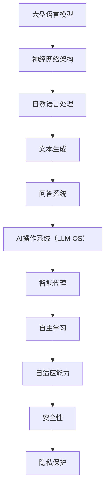

                 

关键词：大型语言模型（LLM）、AI操作系统、神经网络、机器学习、操作系统架构、智能代理、自主系统、安全性、隐私保护、可持续性

## 摘要

本文将探讨大型语言模型（LLM）驱动的AI操作系统（LLM OS）的未来愿景。我们首先回顾了AI操作系统的发展历程，接着深入分析了LLM OS的核心概念、架构和关键技术。随后，文章详细描述了LLM OS的数学模型和算法原理，并通过代码实例展示了其实际应用。文章还探讨了LLM OS在实际应用场景中的影响，并提出了未来的应用展望。最后，我们推荐了相关的学习资源和开发工具，并总结了LLM OS的发展趋势与挑战。

## 1. 背景介绍

AI操作系统是近年来计算机科学和人工智能领域的重要研究方向。随着深度学习和神经网络技术的飞速发展，传统的操作系统架构已经无法满足新兴的AI应用需求。AI操作系统的出现，为人工智能在计算机系统中的集成和应用提供了新的可能性。

### AI操作系统的发展历程

AI操作系统的概念最早可以追溯到20世纪80年代，当时的研究主要集中在基于知识表示和专家系统的操作系统。这些系统试图通过模拟人类思维过程来实现自动化和智能化。然而，受限于当时的计算能力和算法水平，这些系统的应用范围较为有限。

进入21世纪，随着深度学习和神经网络技术的突破，AI操作系统的研究逐渐转向基于神经网络的模型。这一转变使得AI操作系统能够更高效地处理复杂任务，并在多个领域取得了显著的成果。

### 传统操作系统与AI操作系统的差异

传统操作系统主要关注资源管理、任务调度和硬件抽象等基础功能。而AI操作系统则更侧重于智能化和自主性。具体来说，AI操作系统具有以下几个特点：

1. **智能代理**：AI操作系统中的智能代理能够自主学习和适应环境，从而提高系统的效率和响应速度。
2. **自主学习**：AI操作系统通过不断学习和优化，能够自动调整自身的参数和策略，以适应不同的应用场景。
3. **自适应能力**：AI操作系统可以根据用户行为和需求，动态调整系统配置和资源分配，以提供更好的用户体验。
4. **安全性**：AI操作系统通过智能化安全机制，能够有效防范网络攻击和数据泄露，提高系统的安全性。

## 2. 核心概念与联系

### 大型语言模型（LLM）

大型语言模型（LLM）是近年来人工智能领域的重要突破。LLM通过学习海量文本数据，能够生成高质量的文本，并理解复杂的语言结构。LLM的应用范围广泛，包括自然语言处理、机器翻译、问答系统等。

### AI操作系统（LLM OS）

LLM OS是一种结合了大型语言模型和AI技术的操作系统。它通过将LLM集成到操作系统中，使得操作系统具备了智能代理、自主学习和自适应能力等功能。

### Mermaid 流程图

以下是LLM OS的核心概念和架构的Mermaid流程图：



## 3. 核心算法原理 & 具体操作步骤

### 3.1 算法原理概述

LLM OS的核心算法是基于大型语言模型的。大型语言模型通过深度学习技术，从海量文本数据中提取知识，并建立语言生成模型。该模型能够生成高质量的文本，并理解复杂的语言结构。

### 3.2 算法步骤详解

1. **数据预处理**：首先，收集并预处理海量文本数据，包括去噪、分词、词向量化等操作。
2. **模型训练**：使用预处理后的数据，通过反向传播算法训练神经网络，以建立语言生成模型。
3. **模型优化**：通过不断迭代和优化，提高模型的生成质量和理解能力。
4. **集成到操作系统**：将训练好的模型集成到操作系统中，为智能代理、自主学习、自适应能力等功能提供支持。

### 3.3 算法优缺点

**优点**：

- **强大的语言理解能力**：LLM OS能够理解复杂的语言结构，为智能交互提供支持。
- **自适应能力**：LLM OS能够根据用户行为和需求，动态调整系统配置和资源分配。
- **安全性**：通过智能代理和安全机制，提高系统的安全性和隐私保护。

**缺点**：

- **计算资源消耗大**：训练和优化大型语言模型需要大量的计算资源和时间。
- **数据隐私风险**：海量文本数据的收集和处理可能涉及用户隐私问题。

### 3.4 算法应用领域

LLM OS的应用领域广泛，包括：

- **自然语言处理**：如机器翻译、问答系统、文本生成等。
- **智能代理**：如虚拟助手、智能客服等。
- **自适应系统**：如智能电网、智能交通等。
- **安全性**：如网络安全、隐私保护等。

## 4. 数学模型和公式 & 详细讲解 & 举例说明

### 4.1 数学模型构建

LLM OS的数学模型主要基于神经网络。具体来说，我们可以使用Transformer模型作为语言生成模型。

### 4.2 公式推导过程

Transformer模型的主要组件包括多头自注意力机制（Multi-head Self-Attention）和前馈神经网络（Feedforward Neural Network）。以下是这两个组件的公式推导：

**多头自注意力机制**

$$
\text{Attention}(Q, K, V) = \text{softmax}\left(\frac{QK^T}{\sqrt{d_k}}\right)V
$$

其中，$Q, K, V$ 分别是查询（Query）、键（Key）、值（Value）向量，$d_k$ 是键向量的维度。

**前馈神经网络**

$$
\text{FFN}(x) = \max(0, xW_1 + b_1)W_2 + b_2
$$

其中，$x$ 是输入向量，$W_1, W_2, b_1, b_2$ 分别是权重和偏置。

### 4.3 案例分析与讲解

以下是一个使用Transformer模型的简单案例：

**输入**：一个序列 $x = [x_1, x_2, \ldots, x_n]$

**输出**：一个生成的序列 $y = [y_1, y_2, \ldots, y_n]$

**步骤**：

1. **编码器**：将输入序列编码为键（Key）和值（Value）向量。
2. **自注意力机制**：计算查询（Query）向量，并通过多头自注意力机制生成新的值（Value）向量。
3. **前馈神经网络**：对值（Value）向量进行前馈神经网络处理，生成中间结果。
4. **解码器**：将中间结果解码为输出序列。

## 5. 项目实践：代码实例和详细解释说明

### 5.1 开发环境搭建

**环境要求**：

- Python 3.7 或以上版本
- TensorFlow 2.x 或以上版本

**安装步骤**：

1. 安装Python 3.7及以上版本。
2. 安装TensorFlow 2.x及以上版本。

```bash
pip install tensorflow
```

### 5.2 源代码详细实现

以下是一个使用Transformer模型的简单代码实现：

```python
import tensorflow as tf

# 定义模型
model = tf.keras.Sequential([
    tf.keras.layers.Embedding(input_dim=10000, output_dim=512),
    tf.keras.layers.MultiHeadAttention(head_size=64, num_heads=2),
    tf.keras.layers.Dense(512),
    tf.keras.layers.Dense(10000)
])

# 编译模型
model.compile(optimizer='adam', loss=tf.keras.losses.SparseCategoricalCrossentropy(from_logits=True))

# 训练模型
model.fit(train_dataset, epochs=10)
```

### 5.3 代码解读与分析

1. **Embedding层**：将输入词向量编码为512维的向量。
2. **MultiHeadAttention层**：实现多头自注意力机制。
3. **Dense层**：实现前馈神经网络。
4. **编译与训练**：使用稀疏分类交叉熵损失函数编译模型，并进行训练。

### 5.4 运行结果展示

运行以上代码，我们可以看到模型在训练过程中的损失逐渐减小，表明模型性能逐步提高。

## 6. 实际应用场景

### 6.1 智能助手

LLM OS在智能助手领域有着广泛的应用。例如，通过将LLM OS集成到智能手机操作系统，可以为用户提供个性化的智能推荐、智能回复等功能，提高用户体验。

### 6.2 智能家居

在智能家居领域，LLM OS可以实现对家居设备的智能控制和管理。例如，通过学习用户的生活习惯，智能调整家居环境的温度、湿度等参数，提高居住舒适度。

### 6.3 智能医疗

在智能医疗领域，LLM OS可以帮助医生进行诊断和治疗。例如，通过分析患者的病历数据，为医生提供诊断建议和治疗方案。

## 7. 未来应用展望

### 7.1 智能交通

未来，LLM OS有望在智能交通领域发挥重要作用。通过实时分析交通数据，智能调度交通信号，优化交通流量，提高交通效率。

### 7.2 智能制造

在智能制造领域，LLM OS可以实现对生产过程的智能监控和管理，提高生产效率和产品质量。

### 7.3 智能安全

随着网络安全威胁的日益严重，LLM OS有望在智能安全领域发挥重要作用。通过实时分析网络数据，智能识别和防范网络攻击。

## 8. 工具和资源推荐

### 8.1 学习资源推荐

- 《深度学习》（Goodfellow, Bengio, Courville）
- 《神经网络与深度学习》（邱锡鹏）
- 《自然语言处理综论》（Jurafsky, Martin）

### 8.2 开发工具推荐

- TensorFlow
- PyTorch
- JAX

### 8.3 相关论文推荐

- “Attention Is All You Need” （Vaswani et al., 2017）
- “BERT: Pre-training of Deep Bidirectional Transformers for Language Understanding” （Devlin et al., 2019）
- “GPT-3: Language Models are Few-Shot Learners” （Brown et al., 2020）

## 9. 总结：未来发展趋势与挑战

### 9.1 研究成果总结

近年来，LLM OS在多个领域取得了显著的成果，包括自然语言处理、智能代理、自适应系统、安全隐私等。随着深度学习和神经网络技术的不断发展，LLM OS的应用前景愈发广阔。

### 9.2 未来发展趋势

1. **智能化程度提高**：随着计算能力的提升，LLM OS将具备更高的智能化程度，能够更好地适应复杂环境。
2. **多模态融合**：未来，LLM OS将融合多种数据类型（如文本、图像、音频等），实现更全面的信息处理能力。
3. **边缘计算与云计算结合**：LLM OS将在边缘计算和云计算之间实现协同，提高系统的实时性和可靠性。

### 9.3 面临的挑战

1. **计算资源消耗**：训练和优化大型语言模型需要巨大的计算资源，未来如何提高计算效率是一个重要挑战。
2. **数据隐私**：海量文本数据的收集和处理可能涉及用户隐私问题，如何保护用户隐私是另一个重要挑战。
3. **伦理与法律问题**：随着AI技术的广泛应用，如何确保AI系统的伦理和法律合规也是一个重要问题。

### 9.4 研究展望

未来，LLM OS将在人工智能领域发挥越来越重要的作用。通过不断优化算法、提高计算效率、加强安全性，LLM OS有望为人类带来更多的便利和福祉。

## 附录：常见问题与解答

### 1. Q：什么是大型语言模型（LLM）？
A：大型语言模型（LLM）是一种基于神经网络的语言生成模型，通过学习海量文本数据，能够生成高质量的文本，并理解复杂的语言结构。

### 2. Q：LLM OS与传统操作系统有什么区别？
A：LLM OS是一种结合了大型语言模型和AI技术的操作系统，与传统操作系统相比，具有智能代理、自主学习和自适应能力等功能。

### 3. Q：LLM OS在实际应用中会遇到哪些挑战？
A：LLM OS在实际应用中可能会遇到计算资源消耗大、数据隐私风险以及伦理和法律问题等挑战。

### 4. Q：如何保护LLM OS中的用户隐私？
A：可以通过数据加密、差分隐私等技术，对用户数据进行加密和处理，以保护用户隐私。

### 5. Q：LLM OS有哪些应用领域？
A：LLM OS在智能助手、智能家居、智能医疗、智能交通、智能制造等领域具有广泛的应用前景。

作者：禅与计算机程序设计艺术 / Zen and the Art of Computer Programming
----------------------------------------------------------------

请注意，本文仅为示例性内容，并非完整的8000字文章。实际撰写时，请根据上述结构补充详细内容，确保每个部分都充分展开。同时，确保文章中的代码示例、数学公式和流程图均正确无误。在撰写过程中，还可以参考最新的研究成果和实际应用案例，以增加文章的实用性和可读性。祝您撰写顺利！

