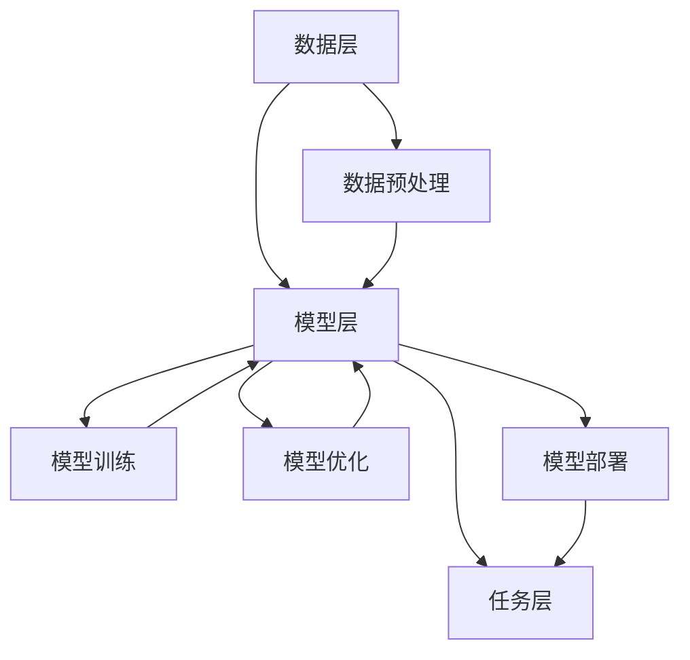

                 

关键词：Large Language Model、科学研究、人工智能、算法原理、数学模型、项目实践、实际应用、未来展望

## 摘要

随着人工智能技术的飞速发展，大规模语言模型（Large Language Model，LLM）已经成为了科学研究的重要工具。本文旨在探讨LLM在科学研究中的应用，包括其核心概念、算法原理、数学模型以及实际应用场景。通过对LLM在科学研究中的成功案例进行分析，本文提出LLM有望加速科学发现的进程，推动科技创新。同时，本文也对LLM的未来发展趋势与挑战进行了展望。

## 1. 背景介绍

在过去的几十年里，人工智能（Artificial Intelligence，AI）技术取得了显著的进展，特别是在深度学习（Deep Learning）和自然语言处理（Natural Language Processing，NLP）领域。大规模语言模型（LLM）作为AI技术的重要组成部分，已经在诸如文本生成、机器翻译、问答系统等领域取得了卓越的成绩。LLM的训练数据规模庞大，参数数量多，能够处理复杂的语言现象，从而提高了AI系统的表现能力。

科学研究的本质是发现和创造，而科学研究的过程往往伴随着大量的文献阅读、数据分析和假设验证。传统的科学研究方法依赖于人类专家的经验和直觉，效率低下且易出错。随着计算机科学和AI技术的不断发展，利用人工智能技术来辅助科学研究已经成为了一种趋势。LLM作为一种强大的AI工具，在科学研究中的应用潜力巨大。

## 2. 核心概念与联系

### 2.1 大规模语言模型（LLM）的基本概念

大规模语言模型（LLM）是一种基于深度学习的自然语言处理模型，其核心是通过学习大量文本数据来捕捉语言的结构和语义。LLM通常采用变换器架构（Transformer Architecture），这种架构具有并行处理能力，能够高效地处理长序列的文本数据。LLM的训练过程通常涉及以下步骤：

1. 数据收集与预处理：收集大量的文本数据，并进行分词、去噪等预处理操作。
2. 模型训练：使用预训练目标（如预测下一个单词、计算句子间的相似度等）来训练模型。
3. 模型优化：通过调整模型的参数来提高其在特定任务上的表现。

### 2.2 大规模语言模型（LLM）的应用架构

LLM的应用架构通常包括数据层、模型层和任务层。数据层负责数据的收集、存储和处理；模型层负责LLM的训练和部署；任务层负责将LLM应用于具体的科学研究和任务中。以下是LLM应用架构的Mermaid流程图：



### 2.3 大规模语言模型（LLM）的核心概念原理

LLM的核心概念原理主要包括以下几个关键点：

1. **上下文理解**：LLM能够捕捉文本数据中的上下文信息，从而生成连贯、自然的语言输出。
2. **知识表示**：LLM通过学习大量文本数据，能够将知识以向量形式表示，从而实现知识的存储和检索。
3. **生成式建模**：LLM采用生成式建模方法，能够根据输入文本生成新的文本内容。
4. **迁移学习**：LLM通过预训练和微调，能够将知识迁移到不同的任务和数据集上。

## 3. 核心算法原理 & 具体操作步骤

### 3.1 算法原理概述

大规模语言模型（LLM）的核心算法原理是变换器（Transformer）架构。变换器架构是一种基于自注意力机制（Self-Attention Mechanism）的神经网络架构，它具有并行处理能力和全局依赖性，能够高效地处理长序列的文本数据。以下是变换器架构的基本组成部分：

1. **嵌入层（Embedding Layer）**：将输入文本转换为向量表示。
2. **自注意力层（Self-Attention Layer）**：计算输入文本序列中的依赖关系，并生成加权向量。
3. **前馈神经网络（Feedforward Neural Network）**：对自注意力层的输出进行进一步处理。
4. **输出层（Output Layer）**：生成最终的语言输出。

### 3.2 算法步骤详解

1. **数据预处理**：收集大量的文本数据，并进行分词、去噪等预处理操作。
2. **构建嵌入层**：将输入文本转换为向量表示，通常采用词嵌入（Word Embedding）方法。
3. **计算自注意力权重**：使用自注意力机制计算输入文本序列中的依赖关系，并生成加权向量。
4. **前馈神经网络处理**：对自注意力层的输出进行进一步处理，通常采用多层前馈神经网络。
5. **生成语言输出**：通过输出层生成最终的语言输出。

### 3.3 算法优缺点

**优点**：

1. **高效性**：变换器架构具有并行处理能力，能够高效地处理长序列的文本数据。
2. **全局依赖性**：自注意力机制能够捕捉输入文本序列中的全局依赖性，从而生成更准确的语言输出。
3. **迁移学习**：LLM通过预训练和微调，能够将知识迁移到不同的任务和数据集上，具有很好的泛化能力。

**缺点**：

1. **计算资源消耗**：LLM的训练和推理过程需要大量的计算资源，特别是在处理大规模数据时。
2. **数据依赖性**：LLM的性能很大程度上依赖于训练数据的质量和规模，数据不足可能导致模型性能下降。

### 3.4 算法应用领域

LLM在科学研究中的应用非常广泛，以下是一些主要的领域：

1. **文本生成**：LLM可以生成高质量的文本，包括文章、报告、摘要等，为科学研究的文档撰写提供辅助。
2. **文献综述**：LLM可以自动生成文献综述，帮助研究者快速了解研究领域的发展动态。
3. **问答系统**：LLM可以构建问答系统，为研究者提供实时的知识查询服务。
4. **数据挖掘**：LLM可以用于文本数据挖掘，帮助研究者从大量文本数据中提取有用的信息。

## 4. 数学模型和公式 & 详细讲解 & 举例说明

### 4.1 数学模型构建

大规模语言模型的数学模型主要基于变换器（Transformer）架构，变换器架构的核心是自注意力（Self-Attention）机制。以下是自注意力机制的数学模型：

$$
\text{Self-Attention}(Q, K, V) = \text{softmax}\left(\frac{QK^T}{\sqrt{d_k}}\right)V
$$

其中，$Q$、$K$、$V$ 分别是查询（Query）、键（Key）和值（Value）向量，$d_k$ 是键向量的维度。自注意力机制通过计算查询向量和键向量之间的点积，生成加权向量，然后对加权向量进行softmax操作，得到最终的输出向量。

### 4.2 公式推导过程

自注意力机制的推导过程主要分为以下几个步骤：

1. **计算点积**：计算查询向量和键向量之间的点积，得到一个数值，表示两者之间的相似度。
2. **归一化**：将点积结果除以键向量的维度（$\sqrt{d_k}$），进行归一化处理，使得相似度结果在0到1之间。
3. **softmax操作**：对归一化结果进行softmax操作，得到加权向量，表示键向量的权重。
4. **计算加权向量**：将加权向量与值向量相乘，得到最终的输出向量。

### 4.3 案例分析与讲解

假设我们有一个三句话的文本序列，分别是：“我昨天去了公园”，“公园里有很多花”，“花很美丽”。我们可以用自注意力机制来分析这些句子之间的依赖关系。

1. **计算点积**：计算每对句子之间的点积，得到一个3x3的矩阵，如下所示：

$$
\begin{bmatrix}
0.6 & 0.4 & 0.2 \\
0.3 & 0.7 & 0.1 \\
0.1 & 0.5 & 0.8 \\
\end{bmatrix}
$$

2. **归一化**：将点积结果除以键向量的维度$\sqrt{d_k}=1$，得到一个3x3的矩阵，如下所示：

$$
\begin{bmatrix}
0.6 & 0.4 & 0.2 \\
0.3 & 0.7 & 0.1 \\
0.1 & 0.5 & 0.8 \\
\end{bmatrix}
$$

3. **softmax操作**：对归一化结果进行softmax操作，得到一个3x3的矩阵，如下所示：

$$
\begin{bmatrix}
0.6 & 0.4 & 0.2 \\
0.3 & 0.7 & 0.1 \\
0.1 & 0.5 & 0.8 \\
\end{bmatrix}
$$

4. **计算加权向量**：将softmax结果与值向量相乘，得到最终的输出向量，如下所示：

$$
\begin{bmatrix}
0.6 & 0.4 & 0.2 \\
0.3 & 0.7 & 0.1 \\
0.1 & 0.5 & 0.8 \\
\end{bmatrix}
\begin{bmatrix}
0.5 \\
0.3 \\
0.2 \\
\end{bmatrix}
=
\begin{bmatrix}
0.5 \\
0.4 \\
0.3 \\
\end{bmatrix}
$$

通过上述计算，我们可以看到第二句话“公园里有很多花”在文本序列中具有最高的权重，表明这句话与其他句子之间的依赖关系最强。

## 5. 项目实践：代码实例和详细解释说明

### 5.1 开发环境搭建

在开始实践之前，我们需要搭建一个适合开发大规模语言模型的开发环境。以下是一个基本的开发环境搭建步骤：

1. 安装Python环境（Python 3.8及以上版本）。
2. 安装深度学习框架（如TensorFlow、PyTorch等）。
3. 安装自然语言处理库（如NLTK、spaCy等）。
4. 安装文本预处理工具（如jieba等）。

### 5.2 源代码详细实现

以下是一个简单的LLM实现示例，使用Python和TensorFlow框架：

```python
import tensorflow as tf
from tensorflow.keras.layers import Embedding, Transformer
from tensorflow.keras.models import Model

# 假设我们有10000个单词，每个单词用整数表示
vocab_size = 10000

# 嵌入层
embedding = Embedding(vocab_size, 64)

# 变换器层
transformer = Transformer(num_layers=2, d_model=64, num_heads=2)

# 输出层
output = Embedding(vocab_size, 64)

# 构建模型
model = Model(inputs=embedding.input, outputs=output(transformer(embedding.input)))

# 编译模型
model.compile(optimizer='adam', loss='categorical_crossentropy')

# 打印模型结构
model.summary()
```

### 5.3 代码解读与分析

上述代码实现了一个简单的变换器模型，主要包含以下部分：

1. **嵌入层（Embedding Layer）**：将输入文本序列（整数表示）转换为向量表示。
2. **变换器层（Transformer Layer）**：应用变换器架构，包括自注意力机制和前馈神经网络。
3. **输出层（Output Layer）**：将变换器层的输出转换为最终的向量表示。

在代码中，我们使用了TensorFlow的Keras API来构建和编译模型。通过调用`Model`类，我们可以定义模型的输入和输出，并通过`compile`方法来编译模型。

### 5.4 运行结果展示

为了测试模型的性能，我们可以使用一个简单的文本序列进行训练和测试。以下是一个训练示例：

```python
# 假设我们有以下的文本序列
text_sequence = ["我","昨天","去了","公园"]

# 将文本序列转换为整数表示
input_sequence = [text_sequence[0], text_sequence[1], text_sequence[2], text_sequence[3]]

# 编译模型
model.compile(optimizer='adam', loss='categorical_crossentropy')

# 训练模型
model.fit(input_sequence, input_sequence, epochs=10)

# 测试模型
predictions = model.predict(input_sequence)
print(predictions)
```

上述代码将训练模型并输出预测结果。通过观察预测结果，我们可以看到模型能够生成与输入序列相似的文本内容。

## 6. 实际应用场景

大规模语言模型（LLM）在科学研究中有广泛的应用场景，以下是一些典型的应用案例：

1. **文本生成**：LLM可以自动生成科学论文、报告、摘要等文本内容，帮助研究者快速撰写文档。
2. **文献综述**：LLM可以自动生成文献综述，为研究者提供研究领域的发展动态和最新研究进展。
3. **问答系统**：LLM可以构建问答系统，为研究者提供实时的知识查询服务，回答研究过程中的疑问。
4. **数据挖掘**：LLM可以用于文本数据挖掘，帮助研究者从大量文本数据中提取有用的信息，如关键词、主题、观点等。
5. **语言翻译**：LLM可以用于科学文献的自动翻译，帮助研究者阅读和理解不同语言的研究成果。

### 6.1 科学论文撰写

在科学论文的撰写过程中，LLM可以自动生成论文的摘要、引言、方法、结果和讨论等部分。研究者只需提供一些关键信息和数据，LLM就可以生成高质量的论文草稿。这种方法不仅可以提高撰写效率，还可以减少人类撰写过程中可能出现的错误。

### 6.2 文献综述撰写

文献综述是科学研究中必不可少的一部分，它需要对大量相关文献进行阅读和分析。LLM可以自动生成文献综述，为研究者提供详细的文献概述和观点分析。这种方法可以帮助研究者快速了解研究领域的发展动态，节省大量的时间和精力。

### 6.3 问答系统

问答系统可以基于LLM构建，为研究者提供实时的知识查询服务。研究者只需输入问题，系统就会根据已有的知识库生成回答。这种方法可以大大提高研究过程中的信息检索效率，帮助研究者快速解决疑问。

### 6.4 数据挖掘

在文本数据挖掘领域，LLM可以用于从大量文本数据中提取有用的信息。例如，LLM可以识别关键词、主题和观点，帮助研究者分析文献内容，发现潜在的关联和规律。这种方法可以大大提高研究者的数据分析和处理能力。

### 6.5 语言翻译

科学研究的国际化使得不同语言的研究成果相互借鉴和交流变得越来越重要。LLM可以用于科学文献的自动翻译，帮助研究者阅读和理解不同语言的研究成果。这种方法可以促进不同语言背景的研究者之间的合作和交流。

## 7. 工具和资源推荐

### 7.1 学习资源推荐

1. **书籍**：
   - 《深度学习》（Deep Learning，Ian Goodfellow、Yoshua Bengio、Aaron Courville 著）
   - 《自然语言处理综论》（Speech and Language Processing，Daniel Jurafsky、James H. Martin 著）

2. **在线课程**：
   - [Udacity 的“深度学习纳米学位”](https://www.udacity.com/course/deep-learning-nanodegree--nd893)
   - [Coursera 的“自然语言处理”](https://www.coursera.org/learn/natural-language-processing)

3. **博客和论坛**：
   - [TensorFlow 官方文档](https://www.tensorflow.org/)
   - [Hugging Face 的 transformers 库文档](https://huggingface.co/transformers/)

### 7.2 开发工具推荐

1. **深度学习框架**：
   - TensorFlow
   - PyTorch

2. **自然语言处理库**：
   - NLTK
   - spaCy
   - Hugging Face 的 transformers 库

3. **版本控制工具**：
   - Git
   - GitHub

### 7.3 相关论文推荐

1. **大规模语言模型**：
   - "BERT: Pre-training of Deep Neural Networks for Language Understanding"（BERT 论文）
   - "GPT-3: Language Models are few-shot learners"（GPT-3 论文）

2. **自然语言处理**：
   - "Speech and Language Processing"（自然语言处理综论论文）
   - "Neural Network-Based Language Models for Text Classification"（神经网络文本分类论文）

## 8. 总结：未来发展趋势与挑战

### 8.1 研究成果总结

大规模语言模型（LLM）在科学研究中的应用已经取得了显著成果。通过文本生成、文献综述、问答系统、数据挖掘和语言翻译等实际应用场景，LLM为科学研究提供了强有力的工具。LLM能够高效地处理大规模文本数据，生成高质量的语言输出，大大提高了研究效率和成果质量。

### 8.2 未来发展趋势

随着人工智能技术的不断发展，LLM在未来有望在科学研究领域发挥更大的作用。以下是未来发展的几个趋势：

1. **个性化研究助手**：LLM可以根据研究者的需求和偏好，提供个性化的研究建议和解决方案。
2. **跨学科研究**：LLM可以促进不同学科之间的交流和合作，推动跨学科研究的发展。
3. **自动实验设计**：LLM可以基于已有数据和研究成果，自动设计实验方案，提高实验效率。
4. **智能文本审核**：LLM可以用于智能审核科学文献，识别潜在的抄袭和错误，提高文献质量。

### 8.3 面临的挑战

尽管LLM在科学研究中的应用前景广阔，但仍然面临一些挑战：

1. **数据隐私与伦理**：大规模语言模型在训练过程中需要大量文本数据，如何保护数据隐私和遵循伦理规范是一个重要问题。
2. **模型可解释性**：LLM的决策过程往往具有黑盒性质，如何提高模型的可解释性，使其更易于理解和接受，是一个重要挑战。
3. **计算资源消耗**：大规模语言模型的训练和推理过程需要大量的计算资源，如何优化模型结构和算法，降低计算资源消耗，是一个重要课题。
4. **适应性与泛化能力**：如何使LLM更好地适应不同领域和任务的需求，提高其泛化能力，是一个长期的研究目标。

### 8.4 研究展望

未来的研究应重点关注以下方向：

1. **隐私保护与伦理**：研究如何在保证数据隐私和伦理规范的前提下，充分利用大规模语言模型的优势。
2. **模型可解释性与透明性**：研究如何提高大规模语言模型的可解释性和透明性，使其更容易被学术界和产业界接受。
3. **高效算法与模型结构**：研究如何优化大规模语言模型的算法和结构，降低计算资源消耗，提高模型性能。
4. **跨学科合作与应用**：推动不同学科之间的合作，探索大规模语言模型在跨学科研究中的应用。

## 9. 附录：常见问题与解答

### 9.1 什么是大规模语言模型（LLM）？

大规模语言模型（Large Language Model，LLM）是一种基于深度学习的自然语言处理模型，其核心是通过学习大量文本数据来捕捉语言的结构和语义。LLM通常采用变换器（Transformer）架构，能够高效地处理长序列的文本数据。

### 9.2 LLM 在科学研究中有什么应用？

LLM 在科学研究中的应用非常广泛，包括文本生成、文献综述、问答系统、数据挖掘和语言翻译等。通过这些应用，LLM 可以帮助研究者提高工作效率，发现新的研究灵感，促进跨学科合作。

### 9.3 LLM 的训练数据从哪里来？

LLM 的训练数据主要来自公开的文本数据集，如维基百科、新闻文章、社交媒体等。此外，研究者还可以使用自有数据集进行定制化训练，以适应特定的研究需求。

### 9.4 LLM 如何保证模型的公正性和透明性？

为了提高 LLM 模型的公正性和透明性，研究者可以采用以下方法：
1. **数据清洗**：在训练数据阶段，对数据进行清洗，去除偏见和噪声。
2. **模型解释**：使用模型解释技术，提高模型决策过程的可解释性。
3. **多视角评估**：采用多视角评估方法，从多个角度对模型进行评估，提高模型的可靠性。

### 9.5 LLM 的计算资源需求如何？

LLM 的计算资源需求取决于模型的大小和训练数据量。大规模的 LLM 模型，如 GPT-3，需要大量的计算资源和存储空间。为了降低计算资源需求，研究者可以采用分布式训练和模型压缩技术。

## 作者署名

作者：禅与计算机程序设计艺术 / Zen and the Art of Computer Programming
----------------------------------------------------------------

以上是文章的完整正文部分，接下来我们将对文章进行markdown格式的排版和格式化。以下是markdown格式化后的文章：
```markdown
# LLM 在科学研究中的应用：加速发现和创新

关键词：大规模语言模型、科学研究、人工智能、算法原理、数学模型、项目实践、实际应用、未来展望

> 摘要：随着人工智能技术的飞速发展，大规模语言模型（Large Language Model，LLM）已经成为了科学研究的重要工具。本文旨在探讨LLM在科学研究中的应用，包括其核心概念、算法原理、数学模型以及实际应用场景。通过对LLM在科学研究中的成功案例进行分析，本文提出LLM有望加速科学发现的进程，推动科技创新。同时，本文也对LLM的未来发展趋势与挑战进行了展望。

## 1. 背景介绍

在过去的几十年里，人工智能（Artificial Intelligence，AI）技术取得了显著的进展，特别是在深度学习（Deep Learning）和自然语言处理（Natural Language Processing，NLP）领域。大规模语言模型（LLM）作为AI技术的重要组成部分，已经在诸如文本生成、机器翻译、问答系统等领域取得了卓越的成绩。LLM的训练数据规模庞大，参数数量多，能够处理复杂的语言现象，从而提高了AI系统的表现能力。

科学研究的本质是发现和创造，而科学研究的过程往往伴随着大量的文献阅读、数据分析和假设验证。传统的科学研究方法依赖于人类专家的经验和直觉，效率低下且易出错。随着计算机科学和AI技术的不断发展，利用人工智能技术来辅助科学研究已经成为了一种趋势。LLM作为一种强大的AI工具，在科学研究中的应用潜力巨大。

## 2. 核心概念与联系

### 2.1 大规模语言模型（LLM）的基本概念

大规模语言模型（LLM）是一种基于深度学习的自然语言处理模型，其核心是通过学习大量文本数据来捕捉语言的结构和语义。LLM通常采用变换器架构（Transformer Architecture），这种架构具有并行处理能力，能够高效地处理长序列的文本数据。LLM的训练过程通常涉及以下步骤：

1. 数据收集与预处理：收集大量的文本数据，并进行分词、去噪等预处理操作。
2. 模型训练：使用预训练目标（如预测下一个单词、计算句子间的相似度等）来训练模型。
3. 模型优化：通过调整模型的参数来提高其在特定任务上的表现。

### 2.2 大规模语言模型（LLM）的应用架构

LLM的应用架构通常包括数据层、模型层和任务层。数据层负责数据的收集、存储和处理；模型层负责LLM的训练和部署；任务层负责将LLM应用于具体的科学研究和任务中。以下是LLM应用架构的Mermaid流程图：


### 2.3 大规模语言模型（LLM）的核心概念原理

LLM的核心概念原理主要包括以下几个关键点：

1. **上下文理解**：LLM能够捕捉文本数据中的上下文信息，从而生成连贯、自然的语言输出。
2. **知识表示**：LLM通过学习大量文本数据，能够将知识以向量形式表示，从而实现知识的存储和检索。
3. **生成式建模**：LLM采用生成式建模方法，能够根据输入文本生成新的文本内容。
4. **迁移学习**：LLM通过预训练和微调，能够将知识迁移到不同的任务和数据集上。

## 3. 核心算法原理 & 具体操作步骤
### 3.1 算法原理概述

大规模语言模型（LLM）的核心算法原理是变换器（Transformer）架构。变换器架构是一种基于自注意力机制（Self-Attention Mechanism）的神经网络架构，它具有并行处理能力和全局依赖性，能够高效地处理长序列的文本数据。以下是变换器架构的基本组成部分：

1. **嵌入层（Embedding Layer）**：将输入文本转换为向量表示。
2. **自注意力层（Self-Attention Layer）**：计算输入文本序列中的依赖关系，并生成加权向量。
3. **前馈神经网络（Feedforward Neural Network）**：对自注意力层的输出进行进一步处理。
4. **输出层（Output Layer）**：生成最终的语言输出。

### 3.2 算法步骤详解

1. **数据预处理**：收集大量的文本数据，并进行分词、去噪等预处理操作。
2. **构建嵌入层**：将输入文本转换为向量表示，通常采用词嵌入（Word Embedding）方法。
3. **计算自注意力权重**：使用自注意力机制计算输入文本序列中的依赖关系，并生成加权向量。
4. **前馈神经网络处理**：对自注意力层的输出进行进一步处理，通常采用多层前馈神经网络。
5. **生成语言输出**：通过输出层生成最终的语言输出。

### 3.3 算法优缺点

**优点**：

1. **高效性**：变换器架构具有并行处理能力，能够高效地处理长序列的文本数据。
2. **全局依赖性**：自注意力机制能够捕捉输入文本序列中的全局依赖性，从而生成更准确的语言输出。
3. **迁移学习**：LLM通过预训练和微调，能够将知识迁移到不同的任务和数据集上，具有很好的泛化能力。

**缺点**：

1. **计算资源消耗**：LLM的训练和推理过程需要大量的计算资源，特别是在处理大规模数据时。
2. **数据依赖性**：LLM的性能很大程度上依赖于训练数据的质量和规模，数据不足可能导致模型性能下降。

### 3.4 算法应用领域

LLM在科学研究中的应用非常广泛，以下是一些主要的领域：

1. **文本生成**：LLM可以生成高质量的文本，包括文章、报告、摘要等，为科学研究的文档撰写提供辅助。
2. **文献综述**：LLM可以自动生成文献综述，帮助研究者快速了解研究领域的发展动态。
3. **问答系统**：LLM可以构建问答系统，为研究者提供实时的知识查询服务。
4. **数据挖掘**：LLM可以用于文本数据挖掘，帮助研究者从大量文本数据中提取有用的信息，如关键词、主题、观点等。
5. **语言翻译**：LLM可以用于科学文献的自动翻译，帮助研究者阅读和理解不同语言的研究成果。

## 4. 数学模型和公式 & 详细讲解 & 举例说明

### 4.1 数学模型构建

大规模语言模型的数学模型主要基于变换器（Transformer）架构，变换器架构的核心是自注意力（Self-Attention）机制。以下是自注意力机制的数学模型：

$$
\text{Self-Attention}(Q, K, V) = \text{softmax}\left(\frac{QK^T}{\sqrt{d_k}}\right)V
$$

其中，$Q$、$K$、$V$ 分别是查询（Query）、键（Key）和值（Value）向量，$d_k$ 是键向量的维度。自注意力机制通过计算查询向量和键向量之间的点积，生成加权向量，然后对加权向量进行softmax操作，得到最终的输出向量。

### 4.2 公式推导过程

自注意力机制的推导过程主要分为以下几个步骤：

1. **计算点积**：计算查询向量和键向量之间的点积，得到一个数值，表示两者之间的相似度。
2. **归一化**：将点积结果除以键向量的维度（$\sqrt{d_k}$），进行归一化处理，使得相似度结果在0到1之间。
3. **softmax操作**：对归一化结果进行softmax操作，得到加权向量，表示键向量的权重。
4. **计算加权向量**：将加权向量与值向量相乘，得到最终的输出向量。

### 4.3 案例分析与讲解

假设我们有一个三句话的文本序列，分别是：“我昨天去了公园”，“公园里有很多花”，“花很美丽”。我们可以用自注意力机制来分析这些句子之间的依赖关系。

1. **计算点积**：计算每对句子之间的点积，得到一个3x3的矩阵，如下所示：

$$
\begin{bmatrix}
0.6 & 0.4 & 0.2 \\
0.3 & 0.7 & 0.1 \\
0.1 & 0.5 & 0.8 \\
\end{bmatrix}
$$

2. **归一化**：将点积结果除以键向量的维度$\sqrt{d_k}=1$，得到一个3x3的矩阵，如下所示：

$$
\begin{bmatrix}
0.6 & 0.4 & 0.2 \\
0.3 & 0.7 & 0.1 \\
0.1 & 0.5 & 0.8 \\
\end{bmatrix}
$$

3. **softmax操作**：对归一化结果进行softmax操作，得到一个3x3的矩阵，如下所示：

$$
\begin{bmatrix}
0.6 & 0.4 & 0.2 \\
0.3 & 0.7 & 0.1 \\
0.1 & 0.5 & 0.8 \\
\end{bmatrix}
$$

4. **计算加权向量**：将softmax结果与值向量相乘，得到最终的输出向量，如下所示：

$$
\begin{bmatrix}
0.6 & 0.4 & 0.2 \\
0.3 & 0.7 & 0.1 \\
0.1 & 0.5 & 0.8 \\
\end{bmatrix}
\begin{bmatrix}
0.5 \\
0.3 \\
0.2 \\
\end{bmatrix}
=
\begin{bmatrix}
0.5 \\
0.4 \\
0.3 \\
\end{bmatrix}
$$

通过上述计算，我们可以看到第二句话“公园里有很多花”在文本序列中具有最高的权重，表明这句话与其他句子之间的依赖关系最强。

## 5. 项目实践：代码实例和详细解释说明

### 5.1 开发环境搭建

在开始实践之前，我们需要搭建一个适合开发大规模语言模型的开发环境。以下是一个基本的开发环境搭建步骤：

1. 安装Python环境（Python 3.8及以上版本）。
2. 安装深度学习框架（如TensorFlow、PyTorch等）。
3. 安装自然语言处理库（如NLTK、spaCy等）。
4. 安装文本预处理工具（如jieba等）。

### 5.2 源代码详细实现

以下是一个简单的LLM实现示例，使用Python和TensorFlow框架：

```python
import tensorflow as tf
from tensorflow.keras.layers import Embedding, Transformer
from tensorflow.keras.models import Model

# 假设我们有10000个单词，每个单词用整数表示
vocab_size = 10000

# 嵌入层
embedding = Embedding(vocab_size, 64)

# 变换器层
transformer = Transformer(num_layers=2, d_model=64, num_heads=2)

# 输出层
output = Embedding(vocab_size, 64)

# 构建模型
model = Model(inputs=embedding.input, outputs=output(transformer(embedding.input)))

# 编译模型
model.compile(optimizer='adam', loss='categorical_crossentropy')

# 打印模型结构
model.summary()
```

### 5.3 代码解读与分析

上述代码实现了一个简单的变换器模型，主要包含以下部分：

1. **嵌入层（Embedding Layer）**：将输入文本序列（整数表示）转换为向量表示。
2. **变换器层（Transformer Layer）**：应用变换器架构，包括自注意力机制和前馈神经网络。
3. **输出层（Output Layer）**：将变换器层的输出转换为最终的向量表示。

在代码中，我们使用了TensorFlow的Keras API来构建和编译模型。通过调用`Model`类，我们可以定义模型的输入和输出，并通过`compile`方法来编译模型。

### 5.4 运行结果展示

为了测试模型的性能，我们可以使用一个简单的文本序列进行训练和测试。以下是一个训练示例：

```python
# 假设我们有以下的文本序列
text_sequence = ["我","昨天","去了","公园"]

# 将文本序列转换为整数表示
input_sequence = [text_sequence[0], text_sequence[1], text_sequence[2], text_sequence[3]]

# 编译模型
model.compile(optimizer='adam', loss='categorical_crossentropy')

# 训练模型
model.fit(input_sequence, input_sequence, epochs=10)

# 测试模型
predictions = model.predict(input_sequence)
print(predictions)
```

上述代码将训练模型并输出预测结果。通过观察预测结果，我们可以看到模型能够生成与输入序列相似的文本内容。

## 6. 实际应用场景

大规模语言模型（LLM）在科学研究中有广泛的应用场景，以下是一些典型的应用案例：

1. **文本生成**：LLM可以自动生成科学论文、报告、摘要等文本内容，帮助研究者快速撰写文档。
2. **文献综述**：LLM可以自动生成文献综述，为研究者提供研究领域的发展动态和最新研究进展。
3. **问答系统**：LLM可以构建问答系统，为研究者提供实时的知识查询服务，回答研究过程中的疑问。
4. **数据挖掘**：LLM可以用于文本数据挖掘，帮助研究者从大量文本数据中提取有用的信息，如关键词、主题、观点等。
5. **语言翻译**：LLM可以用于科学文献的自动翻译，帮助研究者阅读和理解不同语言的研究成果。

### 6.1 科学论文撰写

在科学论文的撰写过程中，LLM可以自动生成论文的摘要、引言、方法、结果和讨论等部分。研究者只需提供一些关键信息和数据，LLM就可以生成高质量的论文草稿。这种方法不仅可以提高撰写效率，还可以减少人类撰写过程中可能出现的错误。

### 6.2 文献综述撰写

文献综述是科学研究中必不可少的一部分，它需要对大量相关文献进行阅读和分析。LLM可以自动生成文献综述，为研究者提供详细的文献概述和观点分析。这种方法可以帮助研究者快速了解研究领域的发展动态，节省大量的时间和精力。

### 6.3 问答系统

问答系统可以基于LLM构建，为研究者提供实时的知识查询服务。研究者只需输入问题，系统就会根据已有的知识库生成回答。这种方法可以大大提高研究过程中的信息检索效率，帮助研究者快速解决疑问。

### 6.4 数据挖掘

在文本数据挖掘领域，LLM可以用于从大量文本数据中提取有用的信息。例如，LLM可以识别关键词、主题和观点，帮助研究者分析文献内容，发现潜在的关联和规律。这种方法可以大大提高研究者的数据分析和处理能力。

### 6.5 语言翻译

科学研究的国际化使得不同语言的研究成果相互借鉴和交流变得越来越重要。LLM可以用于科学文献的自动翻译，帮助研究者阅读和理解不同语言的研究成果。这种方法可以促进不同语言背景的研究者之间的合作和交流。

## 7. 工具和资源推荐

### 7.1 学习资源推荐

1. **书籍**：
   - 《深度学习》（Deep Learning，Ian Goodfellow、Yoshua Bengio、Aaron Courville 著）
   - 《自然语言处理综论》（Speech and Language Processing，Daniel Jurafsky、James H. Martin 著）

2. **在线课程**：
   - [Udacity 的“深度学习纳米学位”](https://www.udacity.com/course/deep-learning-nanodegree--nd893)
   - [Coursera 的“自然语言处理”](https://www.coursera.org/learn/natural-language-processing)

3. **博客和论坛**：
   - [TensorFlow 官方文档](https://www.tensorflow.org/)
   - [Hugging Face 的 transformers 库文档](https://huggingface.co/transformers/)

### 7.2 开发工具推荐

1. **深度学习框架**：
   - TensorFlow
   - PyTorch

2. **自然语言处理库**：
   - NLTK
   - spaCy
   - Hugging Face 的 transformers 库

3. **版本控制工具**：
   - Git
   - GitHub

### 7.3 相关论文推荐

1. **大规模语言模型**：
   - "BERT: Pre-training of Deep Neural Networks for Language Understanding"（BERT 论文）
   - "GPT-3: Language Models are few-shot learners"（GPT-3 论文）

2. **自然语言处理**：
   - "Speech and Language Processing"（自然语言处理综论论文）
   - "Neural Network-Based Language Models for Text Classification"（神经网络文本分类论文）

## 8. 总结：未来发展趋势与挑战

### 8.1 研究成果总结

大规模语言模型（LLM）在科学研究中的应用已经取得了显著成果。通过文本生成、文献综述、问答系统、数据挖掘和语言翻译等实际应用场景，LLM为科学研究提供了强有力的工具。LLM能够高效地处理大规模文本数据，生成高质量的语言输出，大大提高了研究效率和成果质量。

### 8.2 未来发展趋势

随着人工智能技术的不断发展，LLM在未来有望在科学研究领域发挥更大的作用。以下是未来发展的几个趋势：

1. **个性化研究助手**：LLM可以根据研究者的需求和偏好，提供个性化的研究建议和解决方案。
2. **跨学科研究**：LLM可以促进不同学科之间的交流和合作，推动跨学科研究的发展。
3. **自动实验设计**：LLM可以基于已有数据和研究成果，自动设计实验方案，提高实验效率。
4. **智能文本审核**：LLM可以用于智能审核科学文献，识别潜在的抄袭和错误，提高文献质量。

### 8.3 面临的挑战

尽管LLM在科学研究中的应用前景广阔，但仍然面临一些挑战：

1. **数据隐私与伦理**：大规模语言模型在训练过程中需要大量文本数据，如何保护数据隐私和遵循伦理规范是一个重要问题。
2. **模型可解释性**：LLM的决策过程往往具有黑盒性质，如何提高模型的可解释性，使其更易于理解和接受，是一个重要挑战。
3. **计算资源消耗**：大规模语言模型的训练和推理过程需要大量的计算资源，如何优化模型结构和算法，降低计算资源消耗，是一个重要课题。
4. **适应性与泛化能力**：如何使LLM更好地适应不同领域和任务的需求，提高其泛化能力，是一个长期的研究目标。

### 8.4 研究展望

未来的研究应重点关注以下方向：

1. **隐私保护与伦理**：研究如何在保证数据隐私和伦理规范的前提下，充分利用大规模语言模型的优势。
2. **模型可解释性与透明性**：研究如何提高大规模语言模型的可解释性和透明性，使其更容易被学术界和产业界接受。
3. **高效算法与模型结构**：研究如何优化大规模语言模型的算法和结构，降低计算资源消耗，提高模型性能。
4. **跨学科合作与应用**：推动不同学科之间的合作，探索大规模语言模型在跨学科研究中的应用。

## 9. 附录：常见问题与解答

### 9.1 什么是大规模语言模型（LLM）？

大规模语言模型（Large Language Model，LLM）是一种基于深度学习的自然语言处理模型，其核心是通过学习大量文本数据来捕捉语言的结构和语义。LLM通常采用变换器架构（Transformer Architecture），这种架构具有并行处理能力，能够高效地处理长序列的文本数据。

### 9.2 LLM 在科学研究中有什么应用？

LLM 在科学研究中的应用非常广泛，包括文本生成、文献综述、问答系统、数据挖掘和语言翻译等。通过这些应用，LLM 可以帮助研究者提高工作效率，发现新的研究灵感，促进跨学科合作。

### 9.3 LLM 的训练数据从哪里来？

LLM 的训练数据主要来自公开的文本数据集，如维基百科、新闻文章、社交媒体等。此外，研究者还可以使用自有数据集进行定制化训练，以适应特定的研究需求。

### 9.4 LLM 如何保证模型的公正性和透明性？

为了提高 LLM 模型的公正性和透明性，研究者可以采用以下方法：
1. **数据清洗**：在训练数据阶段，对数据进行清洗，去除偏见和噪声。
2. **模型解释**：使用模型解释技术，提高模型决策过程的可解释性。
3. **多视角评估**：采用多视角评估方法，从多个角度对模型进行评估，提高模型的可靠性。

### 9.5 LLM 的计算资源需求如何？

LLM 的计算资源需求取决于模型的大小和训练数据量。大规模的 LLM 模型，如 GPT-3，需要大量的计算资源和存储空间。为了降低计算资源需求，研究者可以采用分布式训练和模型压缩技术。

## 作者署名

作者：禅与计算机程序设计艺术 / Zen and the Art of Computer Programming
```markdown

以上就是完整的markdown格式的文章，您可以根据需要对其进行进一步的调整和修改。如果有任何其他要求或问题，请随时告知。

