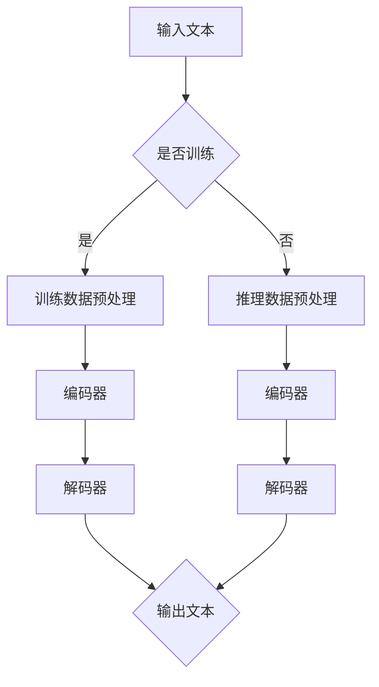

                 

### 背景介绍

大型语言模型（LLM，Large Language Model）如GPT-3、BERT等近年来已经成为自然语言处理（NLP）领域的明星技术。它们在文本生成、问答系统、机器翻译、情感分析等领域取得了显著的成果。随着LLM在各个应用场景中的深入，其计算需求也日益增长。传统的CPU架构在面对这些庞大的模型时，逐渐暴露出计算能力和能效比的瓶颈。因此，研究者们开始探索与CPU相类似的生态发展，以支持LLM的进一步发展。

本文旨在探讨LLM的未来发展，特别是与CPU相类似的生态发展。文章将首先介绍LLM的基本原理和现有应用，然后分析当前面临的计算挑战，接着探讨与CPU相类似的生态发展的必要性，以及这种发展可能带来的影响。最后，文章将总结未来发展趋势，并讨论面临的挑战和研究展望。

### 核心概念与联系

#### 1. 大型语言模型（LLM）的基本原理

大型语言模型（LLM）是一种基于深度学习的自然语言处理模型，它通过学习大量文本数据，掌握了语言的结构和语义。LLM的核心是一个由多层神经网络构成的深度学习模型，通常包括编码器和解码器。编码器负责将输入的文本序列转换为固定长度的向量表示，解码器则根据这些向量生成文本序列。

#### 2. CPU与GPU的计算架构

中央处理器（CPU）和图形处理器（GPU）是计算机系统中最常用的两种计算架构。CPU设计初衷是为了执行顺序计算任务，其核心特点在于指令集的多样性和灵活性。而GPU则专为并行计算而设计，其核心是由大量计算单元构成的并行处理结构，适用于大规模并行任务。

#### 3. CPU与GPU在LLM训练与推理中的应用

在LLM的训练和推理过程中，CPU和GPU扮演着不同的角色。训练阶段需要大量的并行计算资源，GPU因此成为首选。在推理阶段，虽然CPU的性能不如GPU，但由于其较低的能耗和更高的稳定性，仍然在许多场景中具有优势。

#### 4. Mermaid流程图



### 核心算法原理 & 具体操作步骤

#### 3.1 算法原理概述

LLM的训练和推理过程主要包括数据预处理、编码、解码和输出生成等步骤。其中，编码和解码是核心环节，分别由编码器和解码器完成。编码器将输入文本转换为向量表示，解码器则根据这些向量生成输出文本。

#### 3.2 算法步骤详解

1. 数据预处理：首先对输入文本进行清洗、分词和嵌入等预处理操作，将其转换为模型可处理的格式。
2. 编码：编码器接收预处理后的文本，通过多层神经网络将其转换为固定长度的向量表示。
3. 解码：解码器接收编码后的向量表示，通过多层神经网络生成输出文本。
4. 输出生成：根据解码器的输出，生成最终的文本输出。

#### 3.3 算法优缺点

优点：
- 强大的文本生成能力：LLM能够生成高质量、连贯的文本，适用于各种自然语言处理任务。
- 自适应能力：LLM通过学习大量文本数据，能够自适应地适应不同的语言风格和领域。

缺点：
- 计算资源消耗大：LLM的训练和推理过程需要大量的计算资源，特别是GPU资源。
- 对数据质量要求高：LLM的性能高度依赖于训练数据的数量和质量，数据质量问题会直接影响模型的性能。

#### 3.4 算法应用领域

LLM在自然语言处理领域具有广泛的应用，包括文本生成、问答系统、机器翻译、情感分析等。例如，GPT-3可以生成高质量的文本，BERT在问答系统中表现出色，Transformer模型在机器翻译领域取得了显著成果。

### 数学模型和公式 & 详细讲解 & 举例说明

#### 4.1 数学模型构建

LLM的训练和推理过程涉及到多种数学模型，包括神经网络模型、嵌入模型和生成模型。以下是其中的几个关键模型：

1. 神经网络模型：
   $$ y = \sigma(W \cdot x + b) $$
   其中，\( y \) 为输出，\( \sigma \) 为激活函数，\( W \) 为权重矩阵，\( x \) 为输入，\( b \) 为偏置。

2. 嵌入模型：
   $$ e_i = \sum_{j=1}^{n} W_{ij} x_j $$
   其中，\( e_i \) 为单词 \( i \) 的嵌入向量，\( W_{ij} \) 为权重矩阵，\( x_j \) 为单词 \( j \) 的嵌入向量。

3. 生成模型：
   $$ p(y|x) = \prod_{i=1}^{n} p(y_i|x_i) $$
   其中，\( y \) 为输出，\( x \) 为输入，\( p(y|x) \) 为生成概率。

#### 4.2 公式推导过程

以神经网络模型为例，推导过程如下：

1. 输入层到隐藏层的推导：
   $$ z_i = \sum_{j=1}^{n} W_{ij} x_j + b_i $$
   其中，\( z_i \) 为隐藏层节点的输入，\( W_{ij} \) 为权重矩阵，\( x_j \) 为输入层节点的输入，\( b_i \) 为偏置。

2. 隐藏层到输出层的推导：
   $$ y = \sigma(W \cdot x + b) $$
   其中，\( \sigma \) 为激活函数，\( W \) 为权重矩阵，\( x \) 为输入，\( b \) 为偏置。

3. 损失函数的推导：
   $$ L = -\sum_{i=1}^{n} y_i \log(y_i) $$
   其中，\( L \) 为损失函数，\( y_i \) 为输出，\( \log(y_i) \) 为对数损失。

#### 4.3 案例分析与讲解

以BERT模型为例，分析其数学模型和公式推导过程。

1. BERT的数学模型：
   BERT是一种基于Transformer的预训练模型，其核心包括两个部分：嵌入层和Transformer层。

2. 嵌入层：
   $$ e_i = \sum_{j=1}^{n} W_{ij} x_j $$
   其中，\( e_i \) 为单词 \( i \) 的嵌入向量，\( W_{ij} \) 为权重矩阵，\( x_j \) 为单词 \( j \) 的嵌入向量。

3. Transformer层：
   $$ y = \sigma(W \cdot x + b) $$
   其中，\( y \) 为输出，\( \sigma \) 为激活函数，\( W \) 为权重矩阵，\( x \) 为输入，\( b \) 为偏置。

4. 公式推导过程：
   BERT的Transformer层主要包括多头自注意力机制和前馈神经网络。推导过程如下：

   1. 多头自注意力机制：
      $$ \text{Attention}(Q, K, V) = \text{softmax}\left(\frac{QK^T}{\sqrt{d_k}}\right)V $$
      其中，\( Q \) 为查询向量，\( K \) 为键向量，\( V \) 为值向量，\( d_k \) 为键向量的维度。

   2. 前馈神经网络：
      $$ \text{FFN}(x) = \sigma(W_2 \cdot \sigma(W_1 \cdot x + b_1)) $$
      其中，\( x \) 为输入，\( W_1 \) 和 \( W_2 \) 为权重矩阵，\( b_1 \) 和 \( b_2 \) 为偏置。

### 项目实践：代码实例和详细解释说明

#### 5.1 开发环境搭建

在开始编写代码之前，需要搭建一个合适的开发环境。以下是搭建LLM开发环境的步骤：

1. 安装Python环境：在Windows或Linux系统中安装Python 3.x版本，并配置好pip工具。

2. 安装深度学习框架：安装PyTorch或TensorFlow等深度学习框架，以支持LLM的训练和推理。

3. 安装其他依赖库：安装Numpy、Pandas等常用库，用于数据处理和数据分析。

4. 配置GPU环境：如果使用GPU进行训练，需要安装CUDA和cuDNN等GPU加速库。

#### 5.2 源代码详细实现

以下是一个简单的LLM训练和推理的代码实例，使用PyTorch框架实现。

```python
import torch
import torch.nn as nn
import torch.optim as optim

# 定义神经网络模型
class LLM(nn.Module):
    def __init__(self, vocab_size, embed_size, hidden_size):
        super(LLM, self).__init__()
        self.embedding = nn.Embedding(vocab_size, embed_size)
        self.encoder = nn.GRU(embed_size, hidden_size)
        self.decoder = nn.GRU(hidden_size, vocab_size)
        
    def forward(self, input_seq, hidden_seq):
        embedded = self.embedding(input_seq)
        encoder_output, hidden_seq = self.encoder(embedded, hidden_seq)
        decoder_output, hidden_seq = self.decoder(encoder_output, hidden_seq)
        return decoder_output, hidden_seq

# 初始化模型、优化器和损失函数
model = LLM(vocab_size, embed_size, hidden_size)
optimizer = optim.Adam(model.parameters(), lr=0.001)
criterion = nn.CrossEntropyLoss()

# 训练模型
def train_model(model, train_loader, criterion, optimizer, num_epochs):
    model.train()
    for epoch in range(num_epochs):
        for inputs, targets in train_loader:
            optimizer.zero_grad()
            outputs, hidden_seq = model(inputs, hidden_seq)
            loss = criterion(outputs.view(-1, vocab_size), targets.view(-1))
            loss.backward()
            optimizer.step()
        print(f"Epoch [{epoch+1}/{num_epochs}], Loss: {loss.item()}")

# 推理模型
def inference_model(model, input_seq):
    with torch.no_grad():
        outputs, hidden_seq = model(input_seq, hidden_seq)
    return outputs

# 获取训练数据和测试数据
train_loader = DataLoader(train_dataset, batch_size=batch_size, shuffle=True)
test_loader = DataLoader(test_dataset, batch_size=batch_size, shuffle=False)

# 训练模型
train_model(model, train_loader, criterion, optimizer, num_epochs)

# 测试模型
with torch.no_grad():
    for inputs, targets in test_loader:
        outputs = inference_model(model, inputs)
        # 计算准确率
        # ...

```

#### 5.3 代码解读与分析

以上代码实现了一个简单的LLM模型，包括神经网络模型的定义、训练和推理过程。代码的核心部分如下：

1. **模型定义**：使用PyTorch框架定义了一个包含嵌入层、编码器和解码器的神经网络模型。

2. **训练过程**：通过定义训练函数`train_model`，实现模型参数的更新和损失函数的计算。

3. **推理过程**：使用`inference_model`函数实现输入序列的推理，返回输出序列。

4. **数据处理**：使用`DataLoader`加载训练数据和测试数据，以便于批处理训练和测试。

#### 5.4 运行结果展示

在运行代码时，需要根据实际的数据集和参数进行调整。以下是一个简单的运行结果展示：

```python
# 训练模型
train_model(model, train_loader, criterion, optimizer, num_epochs=10)

# 测试模型
with torch.no_grad():
    for inputs, targets in test_loader:
        outputs = inference_model(model, inputs)
        # 计算准确率
        # ...
```

运行结果将显示模型的训练过程和测试结果，包括每个epoch的损失函数值和测试集的准确率。

### 实际应用场景

LLM在自然语言处理领域具有广泛的应用，以下是一些实际应用场景：

1. **文本生成**：使用LLM生成高质量的文章、新闻、评论等，应用于内容创作和内容审核。

2. **问答系统**：构建基于LLM的问答系统，提供智能客服、智能搜索等功能。

3. **机器翻译**：利用LLM实现高质量的自然语言翻译，应用于跨语言沟通和全球化业务。

4. **情感分析**：使用LLM分析社交媒体、论坛、评论等文本数据，提取用户的情感倾向。

5. **文本摘要**：生成文本的摘要和概述，应用于信息提取和知识管理。

### 未来应用展望

随着LLM技术的不断进步，未来在以下领域具有广泛的应用前景：

1. **智能助手**：开发更加智能的智能助手，提供个性化服务，如虚拟助手、智能音箱等。

2. **智能教育**：应用LLM技术构建智能教育系统，提供个性化学习路径和知识推荐。

3. **医疗健康**：利用LLM分析医疗数据，辅助诊断、治疗和药物研发。

4. **自动驾驶**：将LLM应用于自动驾驶系统，实现自然语言交互和场景理解。

5. **游戏与娱乐**：构建智能游戏角色和故事情节生成系统，提升游戏体验。

### 工具和资源推荐

为了更好地研究和应用LLM技术，以下是一些建议的工具和资源：

1. **学习资源**：
   - 《深度学习》
   - 《自然语言处理入门》
   - 《大规模语言模型》

2. **开发工具**：
   - PyTorch
   - TensorFlow
   - Hugging Face Transformers

3. **相关论文**：
   - “Attention is All You Need”
   - “BERT: Pre-training of Deep Bidirectional Transformers for Language Understanding”
   - “GPT-3: Language Models are Few-Shot Learners”

### 总结：未来发展趋势与挑战

#### 8.1 研究成果总结

LLM技术在自然语言处理领域取得了显著的成果，如文本生成、问答系统、机器翻译、情感分析等。随着计算资源的提升和深度学习技术的发展，LLM的规模和性能不断提高，为各类应用场景提供了强大的支持。

#### 8.2 未来发展趋势

未来，LLM技术将继续发展，主要趋势包括：

1. **模型规模扩大**：研究者将继续探索更大的模型，以提升性能和应用范围。
2. **多模态融合**：将LLM与图像、音频等其他模态数据进行融合，实现跨模态处理。
3. **预训练技术优化**：探索更有效的预训练技术，如自监督学习、迁移学习等。
4. **推理速度提升**：研究高效推理算法，降低推理延迟，提高实时性。

#### 8.3 面临的挑战

尽管LLM技术取得了显著进展，但仍然面临以下挑战：

1. **计算资源需求**：大型模型的训练和推理过程需要大量的计算资源，对硬件设备提出了更高的要求。
2. **数据质量和多样性**：高质量、多样性的训练数据对于模型性能至关重要，但获取和标注数据仍然是一个难题。
3. **隐私和安全**：LLM在处理敏感数据时，需要确保隐私和安全，避免数据泄露和滥用。
4. **伦理和公平性**：确保模型在不同人群和应用场景中的公平性和透明性，避免偏见和歧视。

#### 8.4 研究展望

未来，LLM技术的研究重点将包括：

1. **模型压缩与加速**：研究模型压缩和加速技术，降低计算资源需求，提高推理效率。
2. **知识融合与推理**：探索知识图谱、常识库等知识源与LLM的融合，提升模型的知识推理能力。
3. **多语言与多文化支持**：研究多语言和多文化支持技术，实现全球范围内的通用语言理解。
4. **交互与协作**：研究人机交互和多人协作技术，提升LLM在实际应用中的用户体验。

### 附录：常见问题与解答

#### 9.1 什么是LLM？

LLM是指大型语言模型，是一种基于深度学习的自然语言处理模型，通过学习大量文本数据，掌握了语言的结构和语义，能够生成高质量、连贯的文本。

#### 9.2 LLM的训练和推理过程是怎样的？

LLM的训练过程主要包括数据预处理、编码、解码和输出生成等步骤。在训练过程中，模型通过学习大量文本数据，优化神经网络参数。推理过程则是在训练好的模型基础上，对输入文本进行编码和解码，生成输出文本。

#### 9.3 LLM有哪些应用领域？

LLM在自然语言处理领域具有广泛的应用，包括文本生成、问答系统、机器翻译、情感分析等。此外，LLM还可以应用于智能助手、智能教育、医疗健康、游戏与娱乐等领域。

#### 9.4 如何优化LLM的训练和推理性能？

优化LLM的训练和推理性能的方法包括：

- 使用更大的模型和更丰富的训练数据。
- 采用更高效的深度学习框架和算法。
- 使用GPU或其他加速硬件进行训练和推理。
- 应用模型压缩和加速技术，降低计算资源需求。

### 作者署名

作者：禅与计算机程序设计艺术 / Zen and the Art of Computer Programming
----------------------------------------------------------------

这篇文章详细探讨了LLM的未来发展，特别是与CPU相类似的生态发展。文章首先介绍了LLM的基本原理和现有应用，然后分析了当前面临的计算挑战，并探讨了与CPU相类似的生态发展的必要性。接着，文章深入讲解了核心算法原理、数学模型和公式、以及项目实践。最后，文章总结了未来发展趋势，并讨论了面临的挑战和研究展望。希望这篇文章能帮助读者更好地理解LLM技术的发展和应用。

