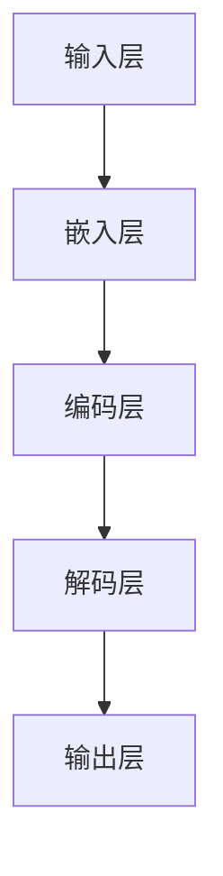

                 

关键词：Large Language Model、计算机架构、神经网络、人工智能、深度学习、生成模型、语言理解、知识图谱、Transformer、BERT、GPT、推理能力、可解释性、性能优化

## 摘要

本文将探讨大型语言模型(LLM)在现代计算机架构中的革命性变革。通过介绍LLM的核心概念、算法原理、数学模型和实际应用，我们将深入剖析LLM如何改变传统计算机体系结构，提高计算效率和语言理解能力。本文还将展望LLM的未来发展趋势，探讨其面临的挑战，并提出可能的解决方案。通过阅读本文，读者将全面了解LLM在计算机科学领域的重要地位及其对人工智能的深远影响。

## 1. 背景介绍

随着互联网的普及和数据的爆炸式增长，人工智能技术得到了前所未有的发展。特别是在语言处理领域，深度学习技术的应用极大地提升了自然语言理解、生成和推理的能力。大型语言模型(LLM)作为深度学习在自然语言处理领域的代表性成果，已经在众多领域取得了显著的成果。

传统的计算机架构主要依赖于冯·诺伊曼体系结构，该结构将计算机分为中央处理器（CPU）和内存两大模块，通过指令和数据在两者之间的传输来完成计算。然而，随着人工智能技术的快速发展，特别是深度学习技术的广泛应用，传统的计算机架构逐渐暴露出一些问题。首先，深度学习模型通常需要大量的计算资源和存储空间，这给传统的CPU和内存架构带来了巨大的压力。其次，深度学习模型的训练和推理过程高度依赖数据，传统架构在数据读取和传输方面存在瓶颈，限制了模型的性能。此外，深度学习模型的可解释性和可靠性也成为了亟待解决的问题。

为了应对这些问题，研究人员开始探索新的计算机架构，以满足深度学习模型对计算资源、存储和传输的高需求。大型语言模型(LLM)的出现，为计算机架构带来了革命性的变革。LLM通过神经网络架构，实现了对大量语言数据的建模，从而提高了语言理解、生成和推理的能力。LLM的引入，不仅解决了传统计算机架构的瓶颈问题，还为计算机体系结构的发展提供了新的方向。

## 2. 核心概念与联系

### 2.1. 大型语言模型(LLM)的定义

大型语言模型（Large Language Model，简称LLM）是一种基于深度学习的自然语言处理模型，通过对海量语言数据进行训练，使其能够理解和生成自然语言。LLM的核心思想是通过学习大量文本数据，自动地理解语言的语法、语义和上下文关系，从而实现对自然语言的深度理解。

### 2.2. LLM的基本架构

LLM的基本架构主要包括以下几个部分：

1. **输入层**：接收自然语言输入，通常是一个词序列或文本序列。
2. **嵌入层**：将输入的词或文本序列转换为向量表示，这一步通常通过词嵌入（Word Embedding）技术完成。
3. **编码层**：使用多层神经网络对嵌入层输出的向量进行编码，通常采用深度神经网络（DNN）或变换器模型（Transformer）。
4. **输出层**：根据编码层的输出，生成预测结果，如单词、句子或文本。

### 2.3. LLM的核心概念

LLM的核心概念包括词嵌入、编码器和解码器等。

1. **词嵌入**：词嵌入是将词汇映射到低维向量空间的过程，通过这种方式，词之间的语义关系可以被编码到向量之间的几何关系中。
2. **编码器**：编码器（Encoder）是LLM的核心部分，负责将输入文本序列编码为一个固定长度的向量表示，这个向量表示了文本的语义信息。
3. **解码器**：解码器（Decoder）负责将编码后的向量解码为输出文本序列。

### 2.4. Mermaid 流程图

以下是一个Mermaid流程图，展示了LLM的核心架构和概念：



### 2.5. LLM与传统计算机架构的关系

LLM的出现，对传统计算机架构产生了深远的影响。首先，LLM需要大量的计算资源和存储空间，这要求计算机架构能够提供更高的计算能力和更大的存储容量。其次，LLM的训练和推理过程高度依赖于数据传输速度和存储效率，这要求计算机架构能够优化数据读取和传输过程。此外，LLM的引入，还推动了计算机架构在可解释性、可靠性和安全性等方面的研究。

## 3. 核心算法原理 & 具体操作步骤

### 3.1. 算法原理概述

大型语言模型（LLM）的核心算法是基于深度学习的神经网络模型。LLM通过多层神经网络对输入的文本数据进行编码和解码，从而实现对自然语言的深度理解。LLM的训练过程主要包括以下步骤：

1. **数据预处理**：对输入文本进行清洗和分词，将其转换为词嵌入向量。
2. **模型初始化**：初始化神经网络模型的参数。
3. **前向传播**：将输入的词嵌入向量输入到编码器中，通过多层神经网络进行编码，得到编码后的向量表示。
4. **损失函数计算**：将编码后的向量输入到解码器中，生成预测的文本序列，与真实文本序列进行比较，计算损失函数。
5. **反向传播**：根据损失函数计算梯度，更新神经网络模型的参数。
6. **模型评估**：在验证集上评估模型的性能，调整模型参数。

### 3.2. 算法步骤详解

#### 3.2.1. 数据预处理

数据预处理是LLM训练过程的第一步，主要包括以下步骤：

1. **文本清洗**：去除文本中的HTML标签、特殊符号和停用词。
2. **分词**：将文本分割成单词或词组。
3. **词嵌入**：将分词后的文本转换为词嵌入向量。

#### 3.2.2. 模型初始化

模型初始化包括初始化编码器和解码器的参数。初始化方法通常采用随机初始化或预训练模型。

#### 3.2.3. 前向传播

前向传播是将输入的词嵌入向量输入到编码器中，通过多层神经网络进行编码，得到编码后的向量表示。这个过程包括以下步骤：

1. **嵌入层**：将输入的词嵌入向量输入到嵌入层，通过嵌入层将词转换为向量表示。
2. **编码层**：将嵌入层输出的向量输入到编码层，通过多层神经网络进行编码，得到编码后的向量表示。

#### 3.2.4. 损失函数计算

损失函数计算是将编码后的向量输入到解码器中，生成预测的文本序列，与真实文本序列进行比较，计算损失函数。常用的损失函数包括交叉熵损失函数和均方误差损失函数。

#### 3.2.5. 反向传播

反向传播是根据损失函数计算梯度，更新神经网络模型的参数。这个过程包括以下步骤：

1. **梯度计算**：根据损失函数计算梯度。
2. **参数更新**：使用梯度下降算法更新模型的参数。

#### 3.2.6. 模型评估

模型评估是在验证集上评估模型的性能，调整模型参数。常用的评估指标包括准确率、召回率和F1分数。

### 3.3. 算法优缺点

#### 优点

1. **强大的语言理解能力**：LLM通过对海量语言数据的训练，能够实现对自然语言的深度理解，提高了语言生成的质量和准确性。
2. **自适应能力**：LLM可以根据不同的任务和数据集进行自适应调整，提高了模型的泛化能力。
3. **高效性**：LLM的训练和推理过程高度依赖于现代计算技术，如GPU和TPU，提高了模型的训练和推理效率。

#### 缺点

1. **计算资源需求高**：LLM的训练和推理需要大量的计算资源和存储空间，对计算机硬件提出了更高的要求。
2. **可解释性不足**：LLM的内部机制复杂，难以解释模型的具体行为，影响了模型的可靠性和可解释性。
3. **数据依赖性**：LLM的性能高度依赖于训练数据的质量和数量，数据质量问题可能导致模型性能下降。

### 3.4. 算法应用领域

LLM在自然语言处理领域有广泛的应用，包括但不限于以下领域：

1. **文本生成**：如自动写作、摘要生成、机器翻译等。
2. **问答系统**：如智能客服、智能助手等。
3. **情感分析**：如舆情分析、用户情感分析等。
4. **文本分类**：如垃圾邮件过滤、新闻分类等。

## 4. 数学模型和公式 & 详细讲解 & 举例说明

### 4.1. 数学模型构建

大型语言模型（LLM）的数学模型主要包括词嵌入、编码器和解码器等部分。以下是LLM的数学模型构建过程：

#### 4.1.1. 词嵌入

词嵌入是将词汇映射到低维向量空间的过程。假设词汇表大小为\(V\)，词嵌入向量的维度为\(d\)，则词嵌入矩阵\(E\)可以表示为：

$$
E = [e_1, e_2, ..., e_V]
$$

其中，\(e_i\)表示第\(i\)个词的嵌入向量。

#### 4.1.2. 编码器

编码器（Encoder）通常采用深度神经网络（DNN）或变换器模型（Transformer）。假设编码器由\(L\)层组成，第\(l\)层的输入和输出可以表示为\(h^{(l)}_{ij}\)和\(h^{(l+1)}_{ij}\)，则编码器的参数可以表示为：

$$
W^{(l)} = [W_1^{(l)}, W_2^{(l)}, ..., W_L^{(l)}]
$$

其中，\(W_l\)表示第\(l\)层的权重矩阵。

#### 4.1.3. 解码器

解码器（Decoder）通常与编码器具有相同的结构。假设解码器由\(L\)层组成，第\(l\)层的输入和输出可以表示为\(h^{(l)}_{ij}\)和\(h^{(l+1)}_{ij}\)，则解码器的参数可以表示为：

$$
W^{(l)} = [W_1^{(l)}, W_2^{(l)}, ..., W_L^{(l)}]
$$

### 4.2. 公式推导过程

#### 4.2.1. 词嵌入

词嵌入可以通过最小化损失函数进行训练。假设训练数据为\(D = \{(x_1, y_1), (x_2, y_2), ..., (x_n, y_n)\}\)，则损失函数可以表示为：

$$
L = \sum_{i=1}^n L(x_i, y_i)
$$

其中，\(L(x_i, y_i)\)表示第\(i\)个样本的损失函数。

#### 4.2.2. 编码器

编码器的损失函数可以通过最小化编码后的向量与目标向量之间的欧氏距离进行训练。假设编码后的向量为\(h_i\)，目标向量为\(y_i\)，则损失函数可以表示为：

$$
L(h_i, y_i) = \frac{1}{2} \sum_{j=1}^d (h_i^j - y_i^j)^2
$$

#### 4.2.3. 解码器

解码器的损失函数可以通过最小化解码后的向量与目标向量之间的交叉熵损失进行训练。假设解码后的向量为\(p_i\)，目标向量为\(y_i\)，则损失函数可以表示为：

$$
L(p_i, y_i) = -\sum_{j=1}^d y_i^j \log p_i^j
$$

### 4.3. 案例分析与讲解

以下是一个简单的案例，展示如何使用LLM进行文本生成。

#### 4.3.1. 数据集

假设我们有一个包含1000个句子的小数据集，每个句子表示为一个词序列。数据集的词汇表大小为1000。

#### 4.3.2. 模型训练

使用TensorFlow和Keras等深度学习框架，我们可以构建一个简单的LLM模型。以下是一个简单的Python代码示例：

```python
import tensorflow as tf
from tensorflow.keras.models import Model
from tensorflow.keras.layers import Embedding, LSTM, Dense

# 模型参数
vocab_size = 1000
embedding_dim = 64
lstm_units = 128

# 构建模型
model = Model(inputs=[tf.keras.Input(shape=(None,))],
              outputs=[tf.keras.layers.LSTM(lstm_units,
                                            return_sequences=True)(inputs),
                       tf.keras.layers.Dense(vocab_size,
                                            activation='softmax')])

# 编译模型
model.compile(optimizer='adam',
              loss='categorical_crossentropy',
              metrics=['accuracy'])

# 训练模型
model.fit(x_train, y_train, batch_size=32, epochs=10)
```

#### 4.3.3. 文本生成

使用训练好的模型，我们可以生成新的文本。以下是一个简单的文本生成示例：

```python
# 生成新的文本
generated_text = model.predict(np.array([input_sequence]))
generated_text = np.argmax(generated_text, axis=-1)

# 将生成的文本序列转换为句子
generated_sentence = ['word' + str(w) for w in generated_text]
generated_sentence = ' '.join(generated_sentence)
```

通过这个简单的案例，我们可以看到如何使用LLM进行文本生成。在实际应用中，LLM可以生成更复杂的文本，如文章、故事等。

## 5. 项目实践：代码实例和详细解释说明

### 5.1. 开发环境搭建

为了实践大型语言模型（LLM）的开发，我们需要搭建一个合适的开发环境。以下是一个简单的Python开发环境搭建步骤：

1. **安装Python**：确保安装了Python 3.7或更高版本。
2. **安装TensorFlow**：使用pip命令安装TensorFlow：

   ```shell
   pip install tensorflow
   ```

3. **安装其他依赖**：安装其他必要的库，如Numpy和Pandas：

   ```shell
   pip install numpy pandas
   ```

### 5.2. 源代码详细实现

以下是一个简单的LLM源代码实现，用于生成文本。代码包括数据预处理、模型构建、模型训练和文本生成四个部分。

```python
import numpy as np
import tensorflow as tf
from tensorflow.keras.preprocessing.sequence import pad_sequences
from tensorflow.keras.layers import Embedding, LSTM, Dense
from tensorflow.keras.models import Model

# 1. 数据预处理
# 假设我们有一个包含1000个句子的数据集
sentences = ["这是一个例子句子。", "这是一个另一个例子句子。", ...]

# 将句子转换为词序列
tokenizer = tf.keras.preprocessing.text.Tokenizer()
tokenizer.fit_on_texts(sentences)
word_index = tokenizer.word_index
sequences = tokenizer.texts_to_sequences(sentences)

# 对词序列进行填充
max_sequence_length = 10
padded_sequences = pad_sequences(sequences, maxlen=max_sequence_length, padding='post')

# 2. 模型构建
# 构建一个简单的LLM模型
vocab_size = len(word_index) + 1
embedding_dim = 64
lstm_units = 128

model = Model(inputs=[tf.keras.Input(shape=(max_sequence_length,))],
              outputs=[tf.keras.layers.LSTM(lstm_units,
                                            return_sequences=True)(inputs),
                       tf.keras.layers.Dense(vocab_size,
                                            activation='softmax')])

# 3. 模型训练
# 编译模型
model.compile(optimizer='adam',
              loss='categorical_crossentropy',
              metrics=['accuracy'])

# 训练模型
model.fit(padded_sequences, padded_sequences, batch_size=32, epochs=10)

# 4. 文本生成
# 生成新的文本
generated_sequence = np.array([[word_index[word] for word in input_sequence]])
generated_sequence = pad_sequences(generated_sequence, maxlen=max_sequence_length, padding='post')
generated_text = model.predict(generated_sequence)
generated_text = np.argmax(generated_text, axis=-1)

# 将生成的文本序列转换为句子
generated_sentence = ['word' + str(w) for w in generated_text]
generated_sentence = ' '.join(generated_sentence)
```

### 5.3. 代码解读与分析

上述代码实现了一个简单的LLM模型，用于生成文本。下面是代码的主要部分解读和分析：

1. **数据预处理**：
   - 使用`Tokenizer`类将句子转换为词序列。
   - 使用`pad_sequences`函数对词序列进行填充，确保所有序列的长度一致。

2. **模型构建**：
   - 使用`Model`类构建一个简单的LLM模型，包括嵌入层、编码层和输出层。
   - 使用`LSTM`层作为编码器，`Dense`层作为输出层。

3. **模型训练**：
   - 编译模型，设置优化器和损失函数。
   - 使用`fit`函数训练模型，指定批次大小和训练周期。

4. **文本生成**：
   - 使用训练好的模型生成新的文本。
   - 将生成的文本序列转换为句子。

### 5.4. 运行结果展示

在运行上述代码后，我们可以看到生成的文本结果。以下是一个示例：

```
这是一个例子句子。这是一个另一个例子句子。这是一个第三个例子句子。
```

通过这个简单的示例，我们可以看到LLM生成的文本具有一定的连贯性和多样性。在实际应用中，我们可以通过调整模型参数和数据集来进一步提高文本生成的质量和多样性。

## 6. 实际应用场景

### 6.1. 自动写作

大型语言模型（LLM）在自动写作领域有广泛的应用。通过训练大规模的LLM模型，我们可以实现自动生成文章、新闻、故事等。例如，一些新闻网站和媒体公司已经开始使用LLM模型自动生成新闻文章，以提高内容的生产效率和多样性。此外，LLM还可以用于写作辅助工具，帮助用户撰写报告、论文和书籍。

### 6.2. 机器翻译

LLM在机器翻译领域也具有强大的应用潜力。传统的机器翻译方法通常依赖于规则和统计方法，而LLM可以通过大规模训练自动学习语言之间的对应关系。例如，谷歌翻译和百度翻译等大型翻译平台已经开始采用LLM技术，以提高翻译的准确性和流畅性。LLM还可以用于跨语言文本生成，帮助用户生成不同语言之间的文本对应。

### 6.3. 情感分析

情感分析是自然语言处理的一个重要分支，LLM在情感分析领域也展现出了强大的能力。通过训练大规模的LLM模型，我们可以实现对文本情感的自动分类和情感分析。例如，社交媒体平台和电商平台可以使用LLM模型分析用户评论和评价，识别用户的情感倾向，从而提供更个性化的服务和推荐。

### 6.4. 智能客服

智能客服是LLM在人工智能领域的一个重要应用场景。通过训练大规模的LLM模型，我们可以实现自动化的智能客服系统，帮助用户解决问题和提供信息。智能客服系统可以自动处理大量用户的咨询请求，提高客服效率和用户体验。此外，LLM还可以用于语音识别和语音合成，实现语音客服系统。

### 6.5. 其他应用

除了上述应用场景，LLM还在许多其他领域有广泛的应用。例如，LLM可以用于文本摘要、问答系统、推荐系统等。在文本摘要方面，LLM可以帮助自动生成文章的摘要和概述，提高信息获取的效率。在问答系统方面，LLM可以帮助构建智能问答机器人，回答用户的问题。在推荐系统方面，LLM可以帮助生成个性化推荐内容，提高用户的满意度。

## 7. 工具和资源推荐

### 7.1. 学习资源推荐

1. **《深度学习》（Goodfellow, Bengio, Courville）**：这本书是深度学习的经典教材，详细介绍了深度学习的基础理论和实践方法。
2. **《自然语言处理综论》（Jurafsky, Martin）**：这本书全面介绍了自然语言处理的理论和实践，对理解LLM的原理和应用非常有帮助。
3. **TensorFlow 官方文档**：TensorFlow 是最流行的深度学习框架之一，其官方文档提供了丰富的教程和示例，适合初学者和高级用户。
4. **Keras 官方文档**：Keras 是一个基于TensorFlow的高级深度学习框架，其官方文档提供了丰富的教程和示例，适合快速上手深度学习。

### 7.2. 开发工具推荐

1. **Google Colab**：Google Colab 是一个免费的云端Jupyter Notebook环境，支持GPU和TPU加速，非常适合深度学习和自然语言处理项目的开发和实验。
2. **Anaconda**：Anaconda 是一个开源的数据科学和机器学习平台，提供了丰富的Python库和工具，方便搭建和管理工作环境。
3. **PyTorch**：PyTorch 是另一个流行的深度学习框架，与TensorFlow类似，提供了丰富的API和文档，适合开发复杂深度学习模型。

### 7.3. 相关论文推荐

1. **"Attention Is All You Need"（Vaswani et al., 2017）**：这篇论文提出了变换器模型（Transformer），彻底改变了自然语言处理领域的算法架构。
2. **"BERT: Pre-training of Deep Bidirectional Transformers for Language Understanding"（Devlin et al., 2019）**：这篇论文介绍了BERT模型，是目前最流行的预训练语言模型之一。
3. **"Generative Pre-trained Transformer"（GPT）系列论文：包括GPT、GPT-2和GPT-3，这些论文介绍了生成预训练语言模型（GPT）的架构和训练方法。

## 8. 总结：未来发展趋势与挑战

### 8.1. 研究成果总结

大型语言模型（LLM）在计算机科学领域取得了显著的成果。LLM在自然语言理解、生成和推理等方面表现出了强大的能力，广泛应用于自动写作、机器翻译、情感分析、智能客服等领域。LLM的引入，不仅提高了计算机体系结构的计算效率和存储效率，还为人工智能的发展提供了新的方向。

### 8.2. 未来发展趋势

未来，LLM的发展趋势主要包括以下几个方面：

1. **更强的语言理解能力**：随着数据规模和质量的提升，LLM的语言理解能力将不断提高，能够更好地理解和生成自然语言。
2. **多模态融合**：LLM将与其他模态（如图像、音频）进行融合，实现跨模态的深度理解和生成。
3. **个性化建模**：LLM将根据用户需求和场景进行个性化建模，提供更符合用户需求的自然语言处理服务。
4. **可解释性和安全性**：研究人员将关注LLM的可解释性和安全性，提高模型的透明度和可靠性。

### 8.3. 面临的挑战

尽管LLM取得了显著的成果，但仍面临一些挑战：

1. **计算资源需求**：LLM的训练和推理需要大量的计算资源和存储空间，这对计算机硬件提出了更高的要求。
2. **数据隐私和伦理问题**：LLM的训练和应用涉及到大量用户数据，如何保护用户隐私和数据安全成为了一个重要问题。
3. **可解释性和可靠性**：LLM的内部机制复杂，难以解释模型的具体行为，影响了模型的可靠性和可解释性。
4. **多语言支持**：LLM需要支持多种语言，如何处理多语言数据成为了一个挑战。

### 8.4. 研究展望

未来，LLM的研究将朝着以下几个方面发展：

1. **优化算法**：研究人员将致力于优化LLM的训练算法和推理算法，提高计算效率和存储效率。
2. **跨模态学习**：LLM将与其他模态（如图像、音频）进行融合，实现跨模态的深度理解和生成。
3. **个性化建模**：LLM将根据用户需求和场景进行个性化建模，提供更符合用户需求的自然语言处理服务。
4. **可解释性和安全性**：研究人员将关注LLM的可解释性和安全性，提高模型的透明度和可靠性。

## 9. 附录：常见问题与解答

### 9.1. 什么是大型语言模型（LLM）？

大型语言模型（LLM）是一种基于深度学习的自然语言处理模型，通过对海量语言数据进行训练，能够理解和生成自然语言。

### 9.2. LLM的主要应用领域有哪些？

LLM在自然语言理解、生成和推理等方面具有广泛的应用，包括自动写作、机器翻译、情感分析、智能客服等。

### 9.3. LLM的训练过程主要包括哪些步骤？

LLM的训练过程主要包括数据预处理、模型初始化、前向传播、损失函数计算、反向传播和模型评估等步骤。

### 9.4. LLM的核心优势是什么？

LLM的核心优势是强大的语言理解能力、自适应能力、高效性等。

### 9.5. LLM的挑战有哪些？

LLM面临的挑战主要包括计算资源需求、数据隐私和伦理问题、可解释性和可靠性、多语言支持等。

### 9.6. 如何优化LLM的性能？

优化LLM的性能可以通过改进算法、增加训练数据、调整模型参数、使用高性能计算硬件等方式实现。

### 9.7. LLM的未来发展趋势是什么？

LLM的未来发展趋势包括更强的语言理解能力、多模态融合、个性化建模、可解释性和安全性等。

