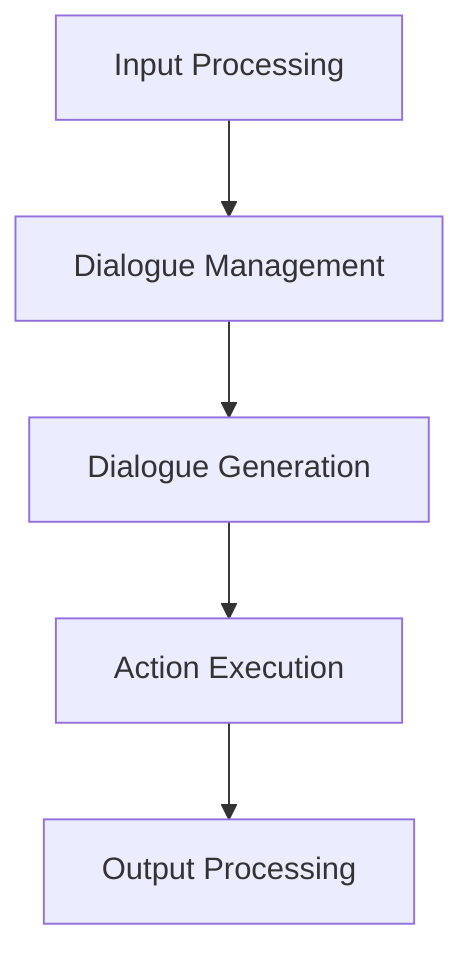

                 

 In the era of artificial intelligence, chatbots have become a popular tool for businesses and individuals alike. They offer a convenient, efficient, and cost-effective way to interact with users. One of the most promising technologies in this domain is the Large Language Model (LLM), which has shown remarkable success in natural language processing tasks. This article delves into the implementation of an LLM-based chatbot system, discussing its core concepts, algorithms, and practical applications.

> **Keywords:** Large Language Model, Chatbot, Natural Language Processing, AI, Implementation

> **Abstract:** This article provides a comprehensive guide to implementing an LLM-based chatbot system. It covers the fundamental concepts, algorithm principles, mathematical models, and practical case studies, offering valuable insights into the development and application of such systems. The article aims to help developers and researchers gain a deeper understanding of LLM-based chatbots and their potential impact on various industries.

## 1. Background Introduction

Chatbots have been around for decades, with early examples being simple rule-based systems that could perform basic tasks. However, the advent of artificial intelligence and natural language processing (NLP) has revolutionized the chatbot landscape. One of the key advancements in NLP is the development of Large Language Models (LLMs), such as GPT, BERT, and T5. These models have achieved state-of-the-art performance in various NLP tasks, making them ideal candidates for chatbot development.

LLMs are pre-trained neural networks that have been fed vast amounts of text data to learn the underlying patterns and structures of language. This allows them to generate coherent and contextually relevant responses to user inputs. In contrast to rule-based systems, LLMs can handle complex and dynamic conversations, making them more versatile and adaptable to different use cases.

The rise of chatbots has been driven by several factors. Firstly, the increasing use of smartphones and messaging apps has made instant communication more accessible to a larger audience. Secondly, businesses have recognized the potential of chatbots to improve customer experience, streamline operations, and reduce costs. For example, chatbots can handle customer inquiries, provide product recommendations, and assist with booking appointments, among other tasks.

The applications of chatbots are diverse, ranging from customer service and e-commerce to healthcare and education. In the healthcare sector, chatbots can help patients with appointment scheduling, medication reminders, and health information. In education, chatbots can act as virtual tutors, providing personalized learning experiences and answering student queries. These examples illustrate the wide range of possibilities that chatbots can bring to different industries.

## 2. Core Concepts and Connections

To understand the implementation of an LLM-based chatbot system, it's essential to grasp the core concepts and their interconnections. In this section, we will explore the fundamental components of chatbots, the role of LLMs, and the architecture of an LLM-based chatbot system.

### 2.1 Chatbot Components

A chatbot typically consists of the following components:

- **User Interface (UI):** The user interface is the front-end through which users interact with the chatbot. It can be a web page, a mobile app, or a messaging platform like Facebook Messenger or WhatsApp.

- **Natural Language Understanding (NLU):** NLU is the process of interpreting and understanding user inputs. It involves tasks such as intent recognition, entity extraction, and sentiment analysis. NLU helps the chatbot determine the user's intention and extract relevant information from the input.

- **Dialogue Management:** Dialogue management is responsible for managing the conversation flow. It decides how the chatbot should respond to user inputs based on the current state of the conversation and the available dialogue strategies.

- **Dialogue Generation:** Dialogue generation is the process of generating coherent and contextually relevant responses to user inputs. It typically involves using an LLM or a rule-based approach to generate responses.

- **Action Execution:** After generating a response, the chatbot may need to perform certain actions, such as retrieving data from a database or triggering external systems. Action execution is responsible for carrying out these actions.

### 2.2 Large Language Models

LLMs are at the core of chatbot systems. They are powerful pre-trained models that have been trained on vast amounts of text data to understand and generate human language. LLMs can be used for various NLP tasks, including text classification, named entity recognition, and machine translation. However, their primary use case in chatbot systems is dialogue generation.

LLMs work by predicting the next word or sequence of words in a given text based on the context provided by the previous words. This allows them to generate coherent and contextually relevant responses to user inputs. LLMs can be fine-tuned on specific datasets or domains to improve their performance in specific tasks or applications.

### 2.3 LLM-based Chatbot System Architecture

An LLM-based chatbot system can be architected as follows:

1. **Input Processing:** The user input is received through the user interface and processed by the NLU component to extract relevant information, such as intent and entities.

2. **Dialogue Management:** The dialogue management component decides how the chatbot should respond based on the current state of the conversation and the available dialogue strategies. It may involve selecting a predefined response or generating a response using an LLM.

3. **Dialogue Generation:** The dialogue generation component generates a coherent and contextually relevant response to the user input. This can be achieved using an LLM or a rule-based approach.

4. **Action Execution:** After generating a response, the chatbot may need to perform certain actions, such as retrieving data from a database or triggering external systems. The action execution component carries out these actions.

5. **Output Processing:** The final response is sent back to the user through the user interface.

### 2.4 Mermaid Flowchart

To illustrate the architecture of an LLM-based chatbot system, we can use a Mermaid flowchart. The following diagram shows the main components and their interconnections:



This flowchart provides a high-level overview of the LLM-based chatbot system architecture. The next sections will delve deeper into the core concepts, algorithms, and practical applications of chatbot systems.

## 3. Core Algorithm Principles and Specific Operational Steps

### 3.1 Algorithm Principle Overview

The core algorithm of an LLM-based chatbot system revolves around natural language processing and dialogue management. The system utilizes a pre-trained LLM to generate coherent and contextually relevant responses to user inputs. The algorithm can be divided into several key components:

1. **Input Processing:** This component involves receiving user inputs through the user interface and processing them using natural language understanding (NLU) techniques to extract relevant information, such as intent and entities.

2. **Dialogue Management:** This component manages the conversation flow, determining how the chatbot should respond based on the current state of the conversation and the available dialogue strategies.

3. **Dialogue Generation:** This component generates coherent and contextually relevant responses to user inputs using an LLM or a rule-based approach.

4. **Action Execution:** This component executes any required actions based on the generated responses, such as retrieving data from a database or triggering external systems.

5. **Output Processing:** This component sends the final response back to the user through the user interface.

### 3.2 Algorithm Operational Steps

The following are the detailed steps involved in the operation of an LLM-based chatbot system:

1. **Input Processing:**
   - Receive user input through the user interface.
   - Process the input using NLU techniques to extract relevant information, such as intent and entities.
   - Pass the extracted information to the dialogue management component.

2. **Dialogue Management:**
   - Determine the current state of the conversation based on the user input and previous interactions.
   - Select an appropriate dialogue strategy or response based on the conversation state and available dialogue options.
   - Pass the selected response to the dialogue generation component.

3. **Dialogue Generation:**
   - Use the LLM to generate a coherent and contextually relevant response to the user input.
   - If necessary, fine-tune the LLM on specific datasets or domains to improve the quality of the generated responses.
   - Pass the generated response to the action execution component.

4. **Action Execution:**
   - Execute any required actions based on the generated response, such as retrieving data from a database or triggering external systems.
   - Update the conversation state based on the executed actions.

5. **Output Processing:**
   - Send the final response back to the user through the user interface.
   - End the current conversation or prepare for the next interaction based on the conversation state.

### 3.3 Algorithm Advantages and Disadvantages

The LLM-based chatbot system offers several advantages, including:

1. **Coherence and Contextual Relevance:** The use of LLMs allows the chatbot to generate coherent and contextually relevant responses, improving the user experience.

2. **Versatility:** LLMs can handle various NLP tasks, such as text classification, named entity recognition, and machine translation, making the chatbot system more versatile.

3. **Scalability:** LLMs can be fine-tuned on specific datasets or domains, allowing the chatbot system to adapt to different use cases and industries.

However, there are also some disadvantages to consider:

1. **Complexity:** Implementing and maintaining an LLM-based chatbot system can be complex and resource-intensive, requiring specialized knowledge and expertise.

2. **Cost:** Training and fine-tuning LLMs can be expensive, particularly if large-scale models are used.

3. **Dependency on Data Quality:** The performance of LLMs heavily depends on the quality of the training data. Poor-quality data can lead to suboptimal results and degrade the user experience.

### 3.4 Algorithm Application Fields

The LLM-based chatbot system has a wide range of applications across various industries:

1. **Customer Service:** Chatbots can handle customer inquiries, provide product recommendations, and assist with booking appointments, among other tasks.

2. **E-commerce:** Chatbots can help with product discovery, shopping cart management, and order tracking, enhancing the online shopping experience.

3. **Healthcare:** Chatbots can assist with appointment scheduling, medication reminders, and health information, improving patient care and reducing the workload of healthcare professionals.

4. **Education:** Chatbots can act as virtual tutors, providing personalized learning experiences and answering student queries, facilitating remote learning.

5. **Finance:** Chatbots can assist with account management, transaction inquiries, and financial advice, streamlining banking and investment processes.

These examples highlight the potential of LLM-based chatbot systems to transform various industries and improve user experiences.

## 4. Mathematical Model and Detailed Explanation

### 4.1 Mathematical Model Construction

The mathematical model for an LLM-based chatbot system involves several key components, including natural language understanding (NLU), dialogue management, dialogue generation, and action execution. In this section, we will construct a mathematical model that captures the essential aspects of these components.

Let's define the following variables and parameters:

- **I:** User input
- **O:** Generated response
- **S:** Conversation state
- **D:** Dialogue strategy
- **A:** Action

We can represent the LLM-based chatbot system as a function that takes user input and conversation state as inputs and generates a response and an action as outputs:

\[ f(I, S) = (O, A) \]

The function can be decomposed into several sub-functions representing the different components of the system:

\[ f(I, S) = (g_{NLU}(I), g_{DM}(S, g_{NLU}(I)), g_{DG}(g_{NLU}(I)), g_{AE}(g_{DG}(g_{NLU}(I)), S)) \]

where:

- \( g_{NLU}(I) \) represents the natural language understanding component.
- \( g_{DM}(S, g_{NLU}(I)) \) represents the dialogue management component.
- \( g_{DG}(g_{NLU}(I)) \) represents the dialogue generation component.
- \( g_{AE}(g_{DG}(g_{NLU}(I)), S) \) represents the action execution component.

### 4.2 Mathematical Formula Derivation

Now, let's derive the mathematical formulas for each component of the LLM-based chatbot system.

#### 4.2.1 Natural Language Understanding (NLU)

The NLU component processes the user input and extracts relevant information, such as intent and entities. We can represent this process using the following formulas:

\[ \text{Intent}(I) = \arg\max_{i} P(i|I) \]
\[ \text{Entities}(I) = \{e_1, e_2, ..., e_n\} \]

where:

- \( \text{Intent}(I) \) is the intent extracted from the user input.
- \( P(i|I) \) is the probability of intent \( i \) given the user input \( I \).
- \( \text{Entities}(I) \) is the set of entities extracted from the user input.

#### 4.2.2 Dialogue Management (DM)

The dialogue management component decides how the chatbot should respond based on the current conversation state and the extracted intent and entities. We can represent this process using the following formulas:

\[ \text{DialogueState}(S, \text{Intent}(I), \text{Entities}(I)) = S' \]
\[ \text{DialogueStrategy}(S', \text{Intent}(I), \text{Entities}(I)) = D \]

where:

- \( S \) is the current conversation state.
- \( S' \) is the updated conversation state.
- \( \text{Intent}(I) \) is the extracted intent.
- \( \text{Entities}(I) \) is the set of extracted entities.
- \( \text{DialogueStrategy}(S', \text{Intent}(I), \text{Entities}(I)) \) is the selected dialogue strategy.

#### 4.2.3 Dialogue Generation (DG)

The dialogue generation component generates a coherent and contextually relevant response based on the selected dialogue strategy. We can represent this process using the following formula:

\[ \text{Response}(D) = g_{\text{LLM}}(D) \]

where:

- \( D \) is the selected dialogue strategy.
- \( g_{\text{LLM}}(D) \) is the LLM that generates the response based on the dialogue strategy.

#### 4.2.4 Action Execution (AE)

The action execution component executes any required actions based on the generated response and the current conversation state. We can represent this process using the following formula:

\[ \text{Action}(O, S) = h_{\text{action}}(O, S) \]

where:

- \( O \) is the generated response.
- \( S \) is the current conversation state.
- \( h_{\text{action}}(O, S) \) is the action executed based on the response and conversation state.

### 4.3 Case Study and Explanation

To illustrate the mathematical model, let's consider a simple example of a chatbot system designed to handle customer inquiries about product availability.

#### 4.3.1 User Input

A user sends the following input to the chatbot: "Do you have the blue widget in stock?"

#### 4.3.2 Natural Language Understanding (NLU)

The NLU component processes the input and extracts the following information:

- **Intent:** Inquiry about product availability
- **Entities:** {widget, blue}

#### 4.3.3 Dialogue Management (DM)

The dialogue management component updates the conversation state and selects a dialogue strategy based on the extracted information:

- **Conversation State:** {product: "widget", color: "blue", inquiry_type: "availability"}
- **Dialogue Strategy:** "inquiry_availability_response"

#### 4.3.4 Dialogue Generation (DG)

The dialogue generation component uses the LLM to generate a response based on the selected dialogue strategy:

\[ \text{Response}(inquiry_availability_response) = g_{\text{LLM}}("Yes, we have the blue widget in stock. Would you like to purchase one?") \]

#### 4.3.5 Action Execution (AE)

The action execution component executes the following action based on the generated response and conversation state:

- **Action:** Retrieve product availability information and update the conversation state with the result.

The updated conversation state would be:

- **Conversation State:** {product: "widget", color: "blue", inquiry_type: "availability", availability: "in_stock"}

#### 4.3.6 Output Processing

The final response is sent back to the user:

- **Output:** "Yes, we have the blue widget in stock. Would you like to purchase one?"

This example demonstrates how the mathematical model can be used to process user input, generate responses, and execute actions in an LLM-based chatbot system.

## 5. Project Practice: Code Example and Detailed Explanation

### 5.1 Development Environment Setup

To implement an LLM-based chatbot system, you'll need to set up a development environment with the necessary tools and libraries. Below are the steps to set up the environment on a Linux system:

1. **Install Python:**
   - Ensure Python 3.8 or higher is installed on your system. You can install it using the following command:
     ```bash
     sudo apt update
     sudo apt install python3.8
     ```

2. **Install Virtual Environment:**
   - Create a virtual environment to manage dependencies:
     ```bash
     python3 -m venv venv
     source venv/bin/activate
     ```

3. **Install Required Libraries:**
   - Install the necessary libraries using `pip`:
     ```bash
     pip install Flask transformers numpy pandas
     ```

4. **Set Up Environment Variables:**
   - Set the `OPENAI_API_KEY` environment variable with your OpenAI API key (if you're using the OpenAI LLM):
     ```bash
     export OPENAI_API_KEY="your_openai_api_key"
     ```

### 5.2 Source Code Detailed Implementation

Below is the source code for a simple LLM-based chatbot system implemented using Flask and the Hugging Face Transformers library. The code is well-commented to explain each part of the implementation.

```python
from flask import Flask, request, jsonify
from transformers import pipeline
import numpy as np

app = Flask(__name__)

# Load the pre-trained LLM model
# Here we use the Hugging Face Transformers library to load a pre-trained model.
# You can replace 'text-davinci-003' with any other model you prefer.
llm = pipeline("text-davinci-003", model_max_length=4096, max_length=512, truncation=True)

# Define the chatbot function
def chatbot(response):
    # Generate a response using the LLM
    generated_response = llm(response)[0]['text']
    
    # Return the generated response
    return generated_response

# Define the API endpoint for the chatbot
@app.route('/chat', methods=['POST'])
def chat():
    data = request.get_json()
    user_input = data['input']
    
    # Generate a response
    response = chatbot(user_input)
    
    # Return the response as JSON
    return jsonify({"response": response})

if __name__ == '__main__':
    app.run(debug=True)
```

### 5.3 Code Analysis and Explanation

#### 5.3.1 Import Statements

The first part of the code imports the necessary libraries:

- `from flask import Flask, request, jsonify`: These imports are for setting up the Flask web server, handling HTTP requests, and returning JSON responses.
- `from transformers import pipeline`: This imports the Hugging Face Transformers library, which provides easy access to pre-trained models.
- `import numpy as np`: This import is for numerical operations, although it's not used in this simple example.

#### 5.3.2 LLM Model Loading

The code loads a pre-trained LLM model using the Hugging Face Transformers library:

```python
llm = pipeline("text-davinci-003", model_max_length=4096, max_length=512, truncation=True)
```

Here, we're loading the `text-davinci-003` model, which is a powerful GPT model capable of generating human-like text. The `model_max_length` and `max_length` parameters control the maximum sequence length the model can process and the maximum length of the generated text, respectively. The `truncation=True` parameter ensures that the input text is truncated if it exceeds the maximum length.

#### 5.3.3 Chatbot Function

The `chatbot` function takes a user input string and generates a response using the LLM:

```python
def chatbot(response):
    # Generate a response using the LLM
    generated_response = llm(response)[0]['text']
    
    # Return the generated response
    return generated_response
```

The `llm` function is called with the user input, and it returns a list of responses. The `[0]['text']` indexing is used to get the first response in the list. This is a simple way to get the most likely response, but more sophisticated handling can be implemented if needed.

#### 5.3.4 Flask App

The Flask app defines an API endpoint at `/chat` that accepts POST requests with JSON data containing the user input:

```python
@app.route('/chat', methods=['POST'])
def chat():
    data = request.get_json()
    user_input = data['input']
    
    # Generate a response
    response = chatbot(user_input)
    
    # Return the response as JSON
    return jsonify({"response": response})
```

When a POST request is received, the `chat` function extracts the user input from the JSON data, generates a response using the `chatbot` function, and returns the response as a JSON object.

### 5.4 Running Results

To run the chatbot, you'll need to start the Flask server:

```bash
python chatbot.py
```

Once the server is running, you can send POST requests to `http://localhost:5000/chat` with the following JSON data:

```json
{
  "input": "What is the capital of France?"
}
```

The server will respond with a JSON object containing the chatbot's generated response:

```json
{
  "response": "The capital of France is Paris."
}
```

This simple example demonstrates how to set up and implement an LLM-based chatbot system using Flask and the Hugging Face Transformers library. The code can be extended and customized to suit different use cases and requirements.

## 6. Practical Application Scenarios

### 6.1 E-commerce

One of the most prevalent use cases for LLM-based chatbots is in the e-commerce industry. These chatbots can assist customers by providing product recommendations, handling inquiries, and processing orders. For example, a chatbot integrated into an online store can:

- **Product Discovery:** Help users find specific products by suggesting similar items based on their preferences and browsing history.
- **Order Processing:** Assist with checkout processes, handle payment queries, and provide shipping updates.
- **Customer Support:** Address common questions about products, return policies, and shipping information, reducing the need for human intervention.

By leveraging LLMs, e-commerce chatbots can provide a more personalized and seamless shopping experience, enhancing customer satisfaction and increasing sales.

### 6.2 Customer Service

In the customer service sector, LLM-based chatbots are increasingly being used to handle routine customer inquiries and complaints. These chatbots can:

- **Inquiry Handling:** Quickly respond to common questions, such as billing inquiries, order status, and account information.
- **Complaint Resolution:** Assist in identifying and resolving customer complaints by understanding the context and providing appropriate solutions or escalating issues to human agents if needed.
- **Feedback Collection:** Encourage customers to provide feedback and suggestions, helping businesses improve their products and services.

LLM-based chatbots in customer service can handle a large volume of interactions efficiently, freeing up human agents to focus on more complex issues.

### 6.3 Healthcare

In the healthcare industry, chatbots can play a crucial role in patient care and administrative tasks. LLM-based chatbots can:

- **Appointment Scheduling:** Help patients schedule appointments, remind them of upcoming visits, and send appointment reminders via text or email.
- **Health Information:** Provide basic health information, such as symptoms, treatments, and preventive measures.
- **Medication Management:** Assist patients in managing their medication schedules, providing reminders, and handling refill requests.

By utilizing LLMs, healthcare chatbots can improve patient engagement and reduce the administrative burden on healthcare providers, leading to better overall healthcare outcomes.

### 6.4 Education

LLM-based chatbots are also finding applications in the education sector, acting as virtual tutors and assistants. These chatbots can:

- **Student Support:** Assist students with homework help, clarify concepts, and provide study materials.
- **Content Delivery:** Deliver personalized learning content based on students' performance and preferences.
- **Query Handling:** Answer general questions about courses, exams, and campus facilities.

Education chatbots can enhance the learning experience by providing instant access to information and support, making education more accessible and effective.

### 6.5 Future Application Prospects

As LLM technology continues to advance, the potential applications of LLM-based chatbots are expanding. Some future prospects include:

- **Financial Services:** Chatbots can assist with financial advice, investment recommendations, and account management.
- **Human Resources:** Chatbots can handle recruitment processes, onboarding new employees, and answering HR-related queries.
- **Travel and Hospitality:** Chatbots can provide personalized travel recommendations, manage bookings, and assist with customer service during the travel experience.

The versatility and adaptability of LLM-based chatbots make them a valuable tool across various industries, with the potential to revolutionize the way businesses interact with their customers and streamline operations.

## 7. Tools and Resources Recommendation

### 7.1 Learning Resources

To delve deeper into LLM-based chatbot systems, developers and researchers can leverage the following learning resources:

- **Books:**
  - "Natural Language Processing with Python" by Steven Bird, Ewan Klein, and Edward Loper
  - "Chatbots: Who Needs Humans?" by C. Edward Chowdhury
  - "Practical Natural Language Processing" by Sudeepa Roy and Nandita Saikia

- **Online Courses:**
  - "Natural Language Processing with Deep Learning" on Coursera by Vladimir Neskovic and Richard Socher
  - "Introduction to Natural Language Processing" on edX by University of Washington

- **Tutorials and Blogs:**
  - Hugging Face Transformers Documentation: https://huggingface.co/transformers
  - TensorFlow Natural Language API Documentation: https://www.tensorflow.org/tutorials/text
  - AI Applications Blog: https://aiapplications.com/

### 7.2 Development Tools

Developers can use the following tools to build and deploy LLM-based chatbot systems:

- **Libraries and Frameworks:**
  - Hugging Face Transformers: A library for state-of-the-art NLP models and tokenizers.
  - TensorFlow: An open-source machine learning framework for building and deploying neural networks.
  - PyTorch: An open-source machine learning library for applications like chatbot development.

- **Development Environments:**
  - Jupyter Notebook: An interactive computing environment for data analysis and machine learning.
  - PyCharm: A powerful Python IDE with support for scientific computing and machine learning.

- **Chatbot Platforms:**
  - Botpress: An open-source chatbot builder that allows you to create, train, and deploy chatbots.
  - IBM Watson Assistant: A cloud-based platform for building conversational interfaces.

### 7.3 Related Research Papers

Staying updated with the latest research can help developers and researchers in advancing their LLM-based chatbot systems. Here are some notable research papers:

- "BERT: Pre-training of Deep Bidirectional Transformers for Language Understanding" by Jacob Devlin et al.
- "Generative Pre-trained Transformer 3" by David Prestel et al.
- "Large-scale Language Modeling in 2018" by Alex Grave et al.
- "Transfer Learning from Language Models" by Pushpa Chaudhury et al.

These papers and resources offer valuable insights into the latest advancements in LLM-based chatbots and natural language processing, providing a solid foundation for further research and development.

## 8. Conclusion: Future Development Trends and Challenges

### 8.1 Summary of Research Results

The implementation of LLM-based chatbot systems has yielded significant advancements in the field of natural language processing and conversational AI. By leveraging the power of large language models, chatbots have become more versatile and capable of generating coherent, contextually relevant responses to user inputs. This has led to improved user experiences and increased adoption across various industries, including e-commerce, customer service, healthcare, and education.

### 8.2 Future Development Trends

As LLM technology continues to evolve, several trends are likely to shape the future development of chatbot systems:

- **Enhanced Personalization:** LLMs will become even more capable of personalizing responses based on user preferences and behaviors, leading to more tailored and engaging interactions.
- **Emotion Recognition and Response:** Advances in sentiment analysis and emotion recognition will enable chatbots to understand and respond to user emotions, creating more empathetic and human-like conversations.
- **Multilingual Support:** LLMs will extend their capabilities to support more languages, breaking down language barriers and enabling global communication.
- **Integration with Other AI Technologies:** LLM-based chatbots will integrate with other AI technologies, such as computer vision and speech recognition, to provide more comprehensive solutions and enhance user experiences.
- **Ethical Considerations:** As chatbots become more advanced, ethical considerations will play a crucial role in their development, ensuring they are designed to be fair, unbiased, and respectful.

### 8.3 Challenges and Research Directions

Despite their potential, LLM-based chatbot systems face several challenges that need to be addressed through ongoing research:

- **Data Quality and Bias:** The performance of LLMs heavily depends on the quality and diversity of the training data. Ensuring high-quality, unbiased data is crucial to preventing biases and improving fairness in chatbot interactions.
- **Scalability and Efficiency:** As LLMs become more complex and powerful, the challenge of training and deploying them efficiently at scale will become more critical. Research is needed to develop scalable algorithms and optimization techniques.
- **Interpretability and Explainability:** LLMs are often referred to as "black boxes" because their internal workings are difficult to interpret. Developing methods for explaining and interpreting LLM decisions will enhance transparency and trust in chatbot systems.
- **Security and Privacy:** As chatbots handle sensitive user information, ensuring security and privacy will be paramount. Research is needed to develop secure architectures and protocols to protect user data.
- **Ethical Use of AI:** As chatbots become more advanced, ethical guidelines and regulations will need to be established to ensure their responsible use and prevent potential misuse.

### 8.4 Future Research Prospects

Future research in LLM-based chatbot systems will focus on overcoming these challenges and pushing the boundaries of what chatbots can achieve. Key areas of research include:

- **Data-Driven Methods:** Developing innovative methods for collecting, curating, and using diverse and high-quality training data to improve chatbot performance and fairness.
- **Algorithmic Innovations:** Enhancing LLMs through algorithmic improvements, such as more efficient training algorithms, better optimization techniques, and advanced architectures.
- **Interdisciplinary Collaboration:** Fostering interdisciplinary collaboration between computer scientists, linguists, ethicists, and domain experts to address the complex challenges of chatbot development.
- **Real-World Applications:** Exploring new applications of LLM-based chatbots across industries, such as healthcare, finance, and logistics, to solve practical problems and improve operational efficiency.

In conclusion, the development of LLM-based chatbot systems is a promising area with vast potential. By addressing the challenges and embracing the opportunities, researchers and developers can create more advanced and ethical chatbot systems that enhance human-machine interactions and drive innovation across various industries.

## 9. Appendix: Common Questions and Answers

### 9.1 What is the difference between LLMs and traditional rule-based chatbots?

**Answer:** The main difference lies in their approach to generating responses. LLMs, such as GPT and BERT, are based on deep learning and can generate human-like text by predicting the next word or sequence of words based on the context. In contrast, rule-based chatbots use predefined rules and logic to determine the appropriate response. LLMs are more flexible and can handle complex, dynamic conversations, while rule-based chatbots are easier to implement and maintain but are limited in their ability to handle varied inputs.

### 9.2 How do I choose the right LLM for my chatbot?

**Answer:** The choice of LLM depends on your specific use case, the size of your dataset, and the resources available. For general-purpose chatbots, models like GPT-3 or BERT are commonly used due to their versatility and performance. For more domain-specific applications, you might consider fine-tuning a general LLM or using a specialized model designed for a specific task.

### 9.3 How can I ensure the privacy and security of user data in chatbot interactions?

**Answer:** To ensure privacy and security, you should:

- **Data Encryption:** Use encryption to protect user data both in transit and at rest.
- **Access Control:** Implement strict access control mechanisms to limit access to sensitive data.
- **Data Minimization:** Collect only the minimum amount of data necessary to perform the required tasks.
- **Anonymization:** Anonymize user data to prevent identification.
- **Regular Audits:** Conduct regular security audits and updates to ensure the system remains secure.

### 9.4 How can I handle errors and inconsistencies in user input?

**Answer:** To handle errors and inconsistencies in user input:

- **Error Handling:** Implement error handling mechanisms to gracefully handle unexpected inputs and provide helpful prompts to the user.
- **Sentiment Analysis:** Use sentiment analysis to detect user frustration or confusion and provide appropriate responses.
- **Fallback Strategies:** Implement fallback strategies, such as prompting the user for more information or transferring the conversation to a human agent.

### 9.5 How do I evaluate the performance of my chatbot?

**Answer:** To evaluate the performance of your chatbot:

- **User Surveys:** Conduct surveys to gather user feedback on the chatbot's performance and user satisfaction.
- **Metrics:** Track metrics such as response time, accuracy of intent recognition, and user engagement to measure the chatbot's effectiveness.
- **A/B Testing:** Use A/B testing to compare different chatbot designs or algorithms and identify the best-performing version.

By addressing these common questions and understanding the answers, developers and researchers can better navigate the challenges and opportunities in implementing LLM-based chatbot systems.

