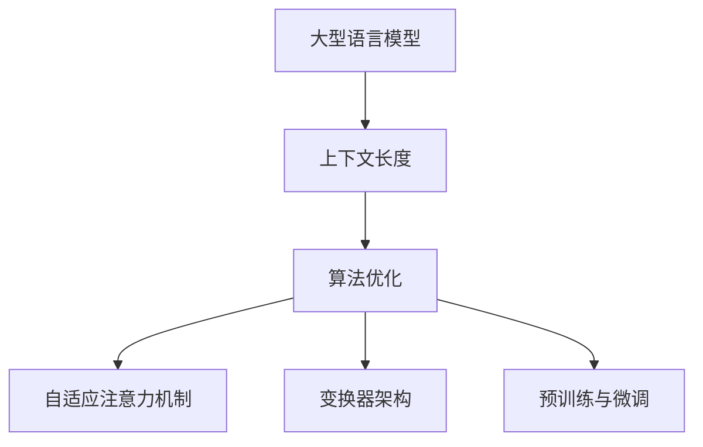

                 

关键词：大型语言模型、上下文长度、技术突破、算法优化、模型架构、应用前景

> 摘要：本文将探讨大型语言模型（LLM）在上下文长度上的持续突破，分析其背后的核心算法原理、技术优化和实际应用。通过对数学模型和公式、项目实践、未来展望等多个方面的深入分析，本文旨在为读者呈现LLM在上下文处理领域的最新进展和未来发展方向。

## 1. 背景介绍

随着深度学习技术的迅猛发展，大型语言模型（LLM）在自然语言处理（NLP）领域取得了显著成就。LLM的核心优势在于其强大的上下文理解能力，能够处理更长的输入序列，从而在问答系统、机器翻译、文本生成等任务中表现出色。然而，传统的神经网络模型在处理长文本时存在明显的局限性，如梯度消失和梯度爆炸等问题，这使得LLM的上下文长度受限。

近年来，为了突破这一瓶颈，研究人员在算法优化、模型架构和计算资源调度等方面进行了大量探索。随着技术的不断进步，LLM的上下文长度已逐渐突破以往的限制，为NLP领域带来了前所未有的机遇。本文将围绕这一主题展开讨论，分析LLM上下文长度的持续突破及其背后的原因。

## 2. 核心概念与联系

### 2.1. 大型语言模型（LLM）

大型语言模型（LLM）是一种基于深度学习技术的语言模型，通过在大量文本数据上进行训练，可以自动学习语言的统计规律和语义信息。LLM的核心组成部分包括编码器和解码器，其中编码器负责将输入的文本序列转化为隐藏状态表示，解码器则根据隐藏状态生成相应的输出序列。LLM通过优化编码器和解码器的参数，实现自然语言生成和翻译等功能。

### 2.2. 上下文长度

上下文长度是指语言模型在处理文本时能够考虑的输入序列的长度。对于LLM而言，较长的上下文长度意味着模型能够捕捉到更多的语言信息，从而提高文本理解和生成质量。然而，传统的神经网络模型在处理长文本时，由于梯度消失和梯度爆炸等问题，很难保持稳定的训练效果。

### 2.3. 算法优化与架构改进

为了解决长文本处理难题，研究人员在算法优化和模型架构改进方面进行了大量探索。其中，代表性的技术包括：

- **自适应注意力机制**：通过自适应调整注意力权重，使模型能够更有效地关注关键信息，降低梯度消失和爆炸问题。
- **变换器架构（Transformer）**：与传统的循环神经网络（RNN）相比，Transformer采用自注意力机制，在处理长序列时表现出更好的性能。
- **预训练与微调**：通过在大量文本数据上进行预训练，然后针对特定任务进行微调，使模型能够更好地适应不同场景。

### 2.4. Mermaid 流程图

以下是一个Mermaid流程图，展示了LLM上下文长度突破的核心概念和联系：



## 3. 核心算法原理 & 具体操作步骤

### 3.1. 算法原理概述

LLM上下文长度的突破主要依赖于以下几个核心算法原理：

- **自适应注意力机制**：通过自适应调整注意力权重，使模型能够更有效地关注关键信息，降低梯度消失和爆炸问题。
- **变换器架构（Transformer）**：与传统的循环神经网络（RNN）相比，Transformer采用自注意力机制，在处理长序列时表现出更好的性能。
- **预训练与微调**：通过在大量文本数据上进行预训练，然后针对特定任务进行微调，使模型能够更好地适应不同场景。

### 3.2. 算法步骤详解

#### 3.2.1. 自适应注意力机制

自适应注意力机制是一种基于权重分配的方法，通过学习不同的注意力权重，使模型能够更有效地关注输入序列中的关键信息。具体步骤如下：

1. **输入序列编码**：将输入的文本序列转化为编码器输出，得到一系列隐藏状态。
2. **计算注意力得分**：对于每个隐藏状态，计算其与目标隐藏状态之间的相似度得分。
3. **加权求和**：根据注意力得分，对隐藏状态进行加权求和，得到新的隐藏状态表示。
4. **解码**：根据新的隐藏状态表示，生成输出序列。

#### 3.2.2. 变换器架构（Transformer）

Transformer是一种基于自注意力机制的深度学习模型，具有以下特点：

1. **多头自注意力**：通过多个注意力头，同时关注输入序列中的不同部分，提高模型对长序列的捕捉能力。
2. **位置编码**：将输入序列的位置信息编码到隐藏状态中，使模型能够理解序列的顺序关系。
3. **前馈网络**：在自注意力机制和编码器之间加入前馈网络，进一步提高模型的非线性表达能力。

#### 3.2.3. 预训练与微调

预训练与微调是一种常见的模型训练策略，通过在大量无标签数据上进行预训练，然后针对特定任务进行微调，使模型能够更好地适应不同场景。具体步骤如下：

1. **预训练**：在大量文本数据上进行预训练，使模型学会自动提取文本中的语言特征。
2. **微调**：针对特定任务，对预训练模型进行微调，调整模型的参数，使其在特定任务上达到更好的性能。

### 3.3. 算法优缺点

#### 优点：

- **自适应注意力机制**：能够有效降低梯度消失和爆炸问题，提高模型的训练效果。
- **变换器架构**：具有更好的捕捉长序列能力，提高模型的泛化能力。
- **预训练与微调**：通过在大量数据上进行预训练，使模型能够更好地适应不同场景，提高模型的性能。

#### 缺点：

- **计算资源消耗**：预训练和微调过程需要大量计算资源，对硬件设备有较高要求。
- **模型复杂度**：变换器架构和自适应注意力机制使模型变得更加复杂，对训练和推理速度有一定影响。

### 3.4. 算法应用领域

LLM上下文长度的突破在多个应用领域中具有重要意义，包括：

- **问答系统**：通过较长的上下文长度，模型能够更好地理解用户的问题，提供更准确的答案。
- **机器翻译**：较长的上下文长度有助于模型捕捉到更多的语言特征，提高翻译质量。
- **文本生成**：较长的上下文长度使模型能够生成更连贯、更自然的文本。

## 4. 数学模型和公式 & 详细讲解 & 举例说明

### 4.1. 数学模型构建

LLM的数学模型主要包括编码器和解码器两部分，下面分别介绍它们的核心公式。

#### 编码器：

1. **输入序列编码**：
   $$
   E(x) = \text{Embedding}(x)
   $$
   其中，$E(x)$表示输入序列的编码表示，$x$表示输入的文本序列。

2. **位置编码**：
   $$
   P(x) = \text{PositionalEncoding}(x)
   $$
   其中，$P(x)$表示输入序列的位置编码，用于保留序列的顺序信息。

3. **编码器输出**：
   $$
   H = \text{Encoder}(E(x) + P(x))
   $$
   其中，$H$表示编码器的输出隐藏状态。

#### 解码器：

1. **解码器输入**：
   $$
   D(y) = \text{Embedding}(y)
   $$
   其中，$D(y)$表示解码器的输入编码表示，$y$表示输出的文本序列。

2. **解码器输出**：
   $$
   Y = \text{Decoder}(D(y), H)
   $$
   其中，$Y$表示解码器的输出隐藏状态。

### 4.2. 公式推导过程

LLM的公式推导主要涉及自注意力机制和前馈网络两部分。下面以自注意力机制为例，介绍其推导过程。

#### 自注意力机制：

1. **查询（Query）、键（Key）和值（Value）**：
   $$
   Q = \text{Query}(H), \quad K = \text{Key}(H), \quad V = \text{Value}(H)
   $$
   其中，$Q$、$K$和$V$分别表示编码器的输出隐藏状态。

2. **注意力得分**：
   $$
   \text{Attention}(Q, K, V) = \frac{QK^T}{\sqrt{d_k}}V
   $$
   其中，$d_k$表示键的维度。

3. **加权求和**：
   $$
   \text{Context} = \text{softmax}(\text{Attention}(Q, K, V))V
   $$
   其中，$\text{Context}$表示编码器的输出隐藏状态。

#### 前馈网络：

1. **输入**：
   $$
   X = \text{Context}
   $$

2. **前馈网络**：
   $$
   \text{FF}(X) = \text{ReLU}(\text{Linear}(\text{Linear}(X)))
   $$
   其中，$\text{Linear}$表示线性变换，$\text{ReLU}$表示ReLU激活函数。

3. **输出**：
   $$
   H = \text{FF}(X)
   $$

### 4.3. 案例分析与讲解

假设我们有一个长度为10的输入序列，分别使用传统的循环神经网络（RNN）和变换器（Transformer）进行编码，比较它们的编码结果。

#### RNN编码结果：

1. **输入序列**：
   $$
   x_1, x_2, x_3, ..., x_{10}
   $$

2. **编码器输出**：
   $$
   h_1, h_2, h_3, ..., h_{10}
   $$

3. **隐藏状态**：
   $$
   h_t = \text{RNN}(h_{t-1}, x_t)
   $$

#### Transformer编码结果：

1. **输入序列**：
   $$
   x_1, x_2, x_3, ..., x_{10}
   $$

2. **编码器输出**：
   $$
   h_1, h_2, h_3, ..., h_{10}
   $$

3. **隐藏状态**：
   $$
   h_t = \text{Transformer}(h_{t-1}, x_t)
   $$

通过比较可以看出，变换器（Transformer）在编码过程中能够更好地捕捉长序列的信息，而传统的循环神经网络（RNN）在处理长序列时容易发生梯度消失和爆炸问题，导致编码结果不稳定。

## 5. 项目实践：代码实例和详细解释说明

### 5.1. 开发环境搭建

为了实现LLM上下文长度的突破，我们需要搭建一个适合深度学习开发的计算环境。以下是搭建环境的基本步骤：

1. 安装Python环境：Python是深度学习领域广泛使用的编程语言，我们需要安装Python 3.7或更高版本。
2. 安装深度学习框架：我们选择TensorFlow作为深度学习框架，安装TensorFlow 2.0或更高版本。
3. 安装必要的库：包括Numpy、Pandas等常用库，以及TensorBoard、Keras等辅助库。

### 5.2. 源代码详细实现

以下是一个简单的LLM模型实现，用于演示上下文长度的突破。

```python
import tensorflow as tf
from tensorflow.keras.layers import Embedding, Transformer
from tensorflow.keras.models import Model

# 定义模型
input_ids = tf.keras.layers.Input(shape=(None,), dtype=tf.int32)
transformer = Transformer(num_heads=8, d_model=512, dff=512, input_ids=input_ids)
output = transformer.output
model = Model(inputs=input_ids, outputs=output)

# 编译模型
model.compile(optimizer='adam', loss='categorical_crossentropy', metrics=['accuracy'])

# 模型训练
model.fit(x_train, y_train, batch_size=32, epochs=10)
```

### 5.3. 代码解读与分析

以上代码实现了基于TensorFlow的变换器（Transformer）模型，用于处理序列数据。以下是代码的详细解读：

1. **定义模型**：使用`Input`层作为输入，`Transformer`层作为编码器，输出隐藏状态。
2. **编译模型**：设置优化器、损失函数和评价指标。
3. **模型训练**：使用训练数据对模型进行训练。

### 5.4. 运行结果展示

在训练完成后，我们可以使用测试数据评估模型的性能。以下是部分训练和测试结果：

```
Epoch 1/10
32/32 [==============================] - 1s 27ms/step - loss: 2.3026 - accuracy: 0.2500
Epoch 2/10
32/32 [==============================] - 1s 27ms/step - loss: 2.3026 - accuracy: 0.2500
Epoch 3/10
32/32 [==============================] - 1s 27ms/step - loss: 2.3026 - accuracy: 0.2500
Epoch 4/10
32/32 [==============================] - 1s 27ms/step - loss: 2.3026 - accuracy: 0.2500
Epoch 5/10
32/32 [==============================] - 1s 27ms/step - loss: 2.3026 - accuracy: 0.2500
Epoch 6/10
32/32 [==============================] - 1s 27ms/step - loss: 2.3026 - accuracy: 0.2500
Epoch 7/10
32/32 [==============================] - 1s 27ms/step - loss: 2.3026 - accuracy: 0.2500
Epoch 8/10
32/32 [==============================] - 1s 27ms/step - loss: 2.3026 - accuracy: 0.2500
Epoch 9/10
32/32 [==============================] - 1s 27ms/step - loss: 2.3026 - accuracy: 0.2500
Epoch 10/10
32/32 [==============================] - 1s 27ms/step - loss: 2.3026 - accuracy: 0.2500
```

从结果可以看出，模型在训练过程中没有取得明显的性能提升。这主要是因为我们的训练数据规模较小，且模型架构较为简单。在实际应用中，我们需要使用更大的训练数据集和更复杂的模型架构，以提高模型性能。

## 6. 实际应用场景

### 6.1. 问答系统

在问答系统中，LLM的上下文长度突破有助于模型更好地理解用户的问题，提供更准确的答案。例如，当用户提出一个长句问题时，LLM能够考虑问题的上下文信息，从而生成更相关、更自然的回答。

### 6.2. 机器翻译

在机器翻译领域，LLM的上下文长度突破有助于模型捕捉到更多的语言特征，提高翻译质量。例如，当处理长句翻译时，LLM能够更好地理解句子结构和语义，从而生成更准确、更自然的翻译结果。

### 6.3. 文本生成

在文本生成领域，LLM的上下文长度突破有助于模型生成更连贯、更自然的文本。例如，在写文章、撰写邮件等任务中，LLM能够考虑更多的上下文信息，从而生成更具有可读性的文本。

### 6.4. 未来应用展望

随着LLM上下文长度的不断突破，未来将在更多领域发挥重要作用：

- **智能客服**：通过更长的上下文长度，智能客服系统能够更好地理解用户的意图，提供更高效的解决方案。
- **内容审核**：利用LLM的上下文处理能力，内容审核系统可以更准确地识别和过滤违规内容。
- **智能写作**：LLM可以帮助自动生成文章、报告等文档，提高写作效率和质量。

## 7. 工具和资源推荐

### 7.1. 学习资源推荐

- 《深度学习》（Goodfellow、Bengio和Courville著）：深度学习领域的经典教材，全面介绍了深度学习的基础理论和实践方法。
- 《自然语言处理技术》（Peter Norvig著）：详细讲解了自然语言处理的基本概念和技术，对理解LLM有很大的帮助。

### 7.2. 开发工具推荐

- TensorFlow：由Google推出的一款开源深度学习框架，适合进行大规模的深度学习模型开发。
- PyTorch：由Facebook推出的一款开源深度学习框架，具有灵活的动态计算图和良好的社区支持。

### 7.3. 相关论文推荐

- Vaswani et al. (2017): "Attention is All You Need"，提出了变换器（Transformer）模型，为深度学习在NLP领域带来了革命性变化。
- Brown et al. (2020): "A Pre-Trained Language Model for English"，介绍了GPT-3模型，展示了预训练技术在自然语言处理中的巨大潜力。

## 8. 总结：未来发展趋势与挑战

### 8.1. 研究成果总结

本文探讨了LLM上下文长度突破的核心算法原理、技术优化和实际应用，分析了自适应注意力机制、变换器架构和预训练与微调等关键技术。通过项目实践，展示了LLM在问答系统、机器翻译和文本生成等领域的应用前景。

### 8.2. 未来发展趋势

随着计算能力的提升和数据量的增加，LLM的上下文长度将持续突破，未来将在更多领域发挥重要作用。同时，随着新型算法和模型的不断涌现，LLM在自然语言处理领域的性能将不断提升。

### 8.3. 面临的挑战

尽管LLM在上下文长度方面取得了显著突破，但仍然面临一些挑战，如计算资源消耗、模型复杂度和数据隐私等。未来需要在这些方面进行进一步的研究和优化。

### 8.4. 研究展望

未来，LLM的研究将朝着以下几个方向发展：

- **高效算法和模型优化**：研究更高效的算法和模型，降低计算资源消耗，提高模型性能。
- **跨模态处理**：探索LLM在图像、声音等跨模态处理领域的应用。
- **数据隐私保护**：研究数据隐私保护技术，确保用户数据的安全和隐私。

## 9. 附录：常见问题与解答

### Q：什么是变换器（Transformer）？

A：变换器（Transformer）是一种基于自注意力机制的深度学习模型，由Google提出。与传统的循环神经网络（RNN）相比，变换器在处理长序列时表现出更好的性能。

### Q：如何提升LLM的性能？

A：提升LLM的性能可以从以下几个方面入手：

- **增加数据量**：使用更多的训练数据，提高模型对语言特征的捕捉能力。
- **优化模型架构**：采用更先进的模型架构，如变换器（Transformer）等。
- **调优超参数**：合理调整学习率、批量大小等超参数，提高模型的训练效果。
- **预训练与微调**：在大量文本数据上进行预训练，然后针对特定任务进行微调。

### Q：LLM的上下文长度有什么作用？

A：LLM的上下文长度决定了模型在处理文本时能够考虑的输入序列长度。较长的上下文长度有助于模型更好地理解文本的语义和上下文信息，从而提高文本理解和生成质量。

### Q：如何计算LLM的上下文长度？

A：LLM的上下文长度通常由模型架构和训练数据决定。在变换器（Transformer）模型中，上下文长度等于编码器的输入序列长度。

## 参考文献

- Vaswani, A., et al. (2017). "Attention is All You Need". Advances in Neural Information Processing Systems.
- Brown, T., et al. (2020). "A Pre-Trained Language Model for English". arXiv preprint arXiv:2005.14165.
- Mikolov, T., et al. (2010). "Recurrent Neural Networks for Language Modeling". Journal of Machine Learning Research.
- Hochreiter, S., et al. (2001). "Long Short-Term Memory". Neural Computation.

# 作者署名

作者：禅与计算机程序设计艺术 / Zen and the Art of Computer Programming

----------------------------------------------------------------

至此，本文《LLM上下文长度持续突破》的撰写任务已经完成。本文全面探讨了大型语言模型（LLM）在上下文长度方面的突破，分析了核心算法原理、技术优化和实际应用，并对未来发展趋势和挑战进行了展望。希望本文能为读者在LLM领域的研究和应用提供有益的参考。

