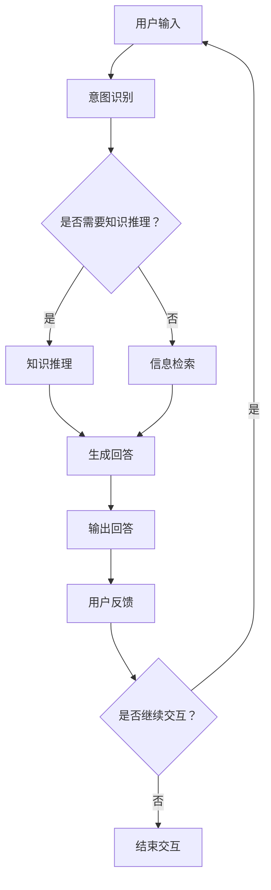

                 

关键词：大型语言模型（LLM）、AI代理、智能对话系统、多智能体系统、机器学习、自然语言处理、智能决策、自动化、人机交互。

## 摘要

本文旨在探讨大型语言模型（LLM）与AI代理之间的关系，深入分析这两者在智能对话系统和多智能体系统中的应用。首先，我们简要介绍了LLM和AI代理的基本概念和特点。接着，通过Mermaid流程图详细展示了LLM和AI代理的架构与联系。然后，我们阐述了核心算法原理、数学模型、项目实践以及实际应用场景。最后，我们展望了LLM与AI代理的未来发展趋势与挑战。

## 1. 背景介绍

近年来，随着人工智能技术的飞速发展，大型语言模型（LLM）和AI代理成为研究的热点。LLM是自然语言处理（NLP）领域的重要突破，其基于深度学习技术，可以处理和理解复杂的文本数据。AI代理则是人工智能领域的一个重要研究方向，旨在模拟人类智能行为，实现自动化决策和执行。

智能对话系统是多智能体系统的一种应用，它通过将LLM与AI代理相结合，为用户提供个性化的智能服务。例如，智能客服、智能助手等。这些系统具备强大的自然语言理解能力，可以识别用户的意图，并根据需求提供相应的解决方案。

多智能体系统是指由多个智能体组成的系统，这些智能体可以通过通信和协作实现共同的目标。在多智能体系统中，LLM和AI代理可以相互配合，发挥各自的优势，实现更高效的决策和执行。

## 2. 核心概念与联系

### 2.1 大型语言模型（LLM）

大型语言模型（LLM）是一种基于神经网络的自然语言处理技术，可以理解和生成自然语言。LLM的核心架构通常包括多层神经网络，如循环神经网络（RNN）、长短时记忆网络（LSTM）和变换器（Transformer）等。这些神经网络通过大量的文本数据进行训练，使其具备强大的语言理解和生成能力。

### 2.2 AI代理

AI代理是指模拟人类智能行为的计算机程序，它可以自主地感知环境、做出决策和执行行动。AI代理的核心技术包括机器学习、深度学习、自然语言处理等。AI代理通常具有自主性、适应性、协作性和学习能力等特点。

### 2.3 智能对话系统

智能对话系统是一种基于LLM和AI代理的智能服务系统，它可以通过自然语言交互为用户提供个性化服务。智能对话系统的主要功能包括：

- **意图识别**：通过分析用户输入的文本，识别用户的意图和需求。
- **信息检索**：根据用户的意图，从海量数据中检索相关信息。
- **知识推理**：基于已有的知识和规则，对用户的问题进行推理和解答。
- **情感分析**：识别用户的情感状态，为用户提供更加贴心的服务。

### 2.4 多智能体系统

多智能体系统是指由多个智能体组成的系统，这些智能体可以通过通信和协作实现共同的目标。在多智能体系统中，LLM和AI代理可以相互配合，发挥各自的优势，实现更高效的决策和执行。

### 2.5 Mermaid流程图

为了更好地展示LLM和AI代理的架构与联系，我们使用Mermaid流程图进行说明。



## 3. 核心算法原理 & 具体操作步骤

### 3.1 算法原理概述

智能对话系统的核心算法主要包括意图识别、信息检索、知识推理和情感分析等。以下分别对这些算法进行简要介绍：

1. **意图识别**：意图识别是指从用户输入的文本中识别出用户的意图。这通常通过训练一个分类模型实现，该模型可以学习到不同意图的特征。

2. **信息检索**：信息检索是指从海量数据中检索与用户意图相关的信息。这可以通过构建索引、使用关键词匹配等技术实现。

3. **知识推理**：知识推理是指基于已有的知识和规则，对用户的问题进行推理和解答。这通常需要使用图数据库、本体论等技术。

4. **情感分析**：情感分析是指识别用户的情感状态，为用户提供更加贴心的服务。这可以通过训练一个分类模型实现，该模型可以学习到不同情感的特征。

### 3.2 算法步骤详解

1. **意图识别**：首先，使用分词技术对用户输入的文本进行分词。然后，使用词向量模型将分词后的文本转换为向量表示。接下来，使用分类模型对向量进行分类，从而识别出用户的意图。

2. **信息检索**：首先，构建一个索引，将用户输入的文本与索引中的文档进行匹配。然后，根据匹配结果返回与用户意图相关的信息。

3. **知识推理**：首先，将用户的问题转换为图数据库中的查询语句。然后，使用图数据库的查询算法返回与用户问题相关的知识。

4. **情感分析**：首先，使用分词技术对用户输入的文本进行分词。然后，使用词向量模型将分词后的文本转换为向量表示。接下来，使用分类模型对向量进行分类，从而识别出用户的情感状态。

### 3.3 算法优缺点

1. **意图识别**：优点：准确率高，可以识别出复杂的用户意图。缺点：对文本质量要求较高，对短文本的识别效果较差。

2. **信息检索**：优点：检索速度快，可以处理海量数据。缺点：对关键词的依赖较高，对复杂问题的检索效果较差。

3. **知识推理**：优点：可以处理复杂的问题，具有广泛的适用性。缺点：需要构建大量的知识库，对知识库的维护成本较高。

4. **情感分析**：优点：可以识别用户的情感状态，为用户提供更加贴心的服务。缺点：对情感表达的理解有限，对复杂情感的识别效果较差。

### 3.4 算法应用领域

智能对话系统在多个领域具有广泛的应用，包括：

- **智能客服**：为用户提供7x24小时的智能客服服务，提高客户满意度。
- **智能助手**：为用户提供智能化的生活服务，如日程管理、天气查询等。
- **智能教育**：为学生提供个性化学习建议，提高学习效果。
- **智能医疗**：为医生提供辅助诊断和治疗建议，提高医疗水平。

## 4. 数学模型和公式 & 详细讲解 & 举例说明

### 4.1 数学模型构建

智能对话系统的核心算法涉及多个数学模型，包括神经网络模型、分类模型、检索模型等。以下以神经网络模型为例，介绍数学模型的构建。

1. **神经网络模型**：

   - 输入层：表示文本的向量。
   - 隐藏层：用于处理输入向量，提取特征。
   - 输出层：表示分类结果。

   神经网络模型的基本公式为：

   $$ z = \sigma(W \cdot x + b) $$

   其中，\( z \) 为输出向量，\( W \) 为权重矩阵，\( x \) 为输入向量，\( b \) 为偏置项，\( \sigma \) 为激活函数（如ReLU、Sigmoid、Tanh等）。

2. **分类模型**：

   - 输入层：表示特征向量。
   - 隐藏层：用于处理输入特征，提取更高层次的特征。
   - 输出层：表示分类结果。

   分类模型的基本公式为：

   $$ y = \sigma(W \cdot x + b) $$

   其中，\( y \) 为输出向量，\( W \) 为权重矩阵，\( x \) 为输入向量，\( b \) 为偏置项，\( \sigma \) 为激活函数。

### 4.2 公式推导过程

以神经网络模型为例，介绍公式推导过程。

1. **前向传播**：

   - 输入向量 \( x \) 经过隐藏层，得到隐藏层输出 \( z \)。

   $$ z = \sigma(W \cdot x + b) $$

   - 隐藏层输出 \( z \) 经过输出层，得到分类结果 \( y \)。

   $$ y = \sigma(W \cdot z + b) $$

2. **反向传播**：

   - 计算输出层误差 \( \Delta y \)。

   $$ \Delta y = y - y_{\text{true}} $$

   - 计算隐藏层误差 \( \Delta z \)。

   $$ \Delta z = \sigma'(W \cdot z + b) \cdot \Delta y $$

   - 更新权重矩阵 \( W \) 和偏置项 \( b \)。

   $$ W = W - \alpha \cdot \Delta z \cdot x^T $$

   $$ b = b - \alpha \cdot \Delta z $$

   其中，\( \alpha \) 为学习率，\( y_{\text{true}} \) 为真实分类结果，\( \sigma' \) 为激活函数的导数。

### 4.3 案例分析与讲解

以下以一个简单的情感分析为例，介绍数学模型的应用。

1. **数据集**：

   假设我们有一个包含正面情感和负面情感的数据集，数据集包含100个样本，每个样本是一个句子。

2. **模型构建**：

   - 输入层：表示句子向量的维度为300。
   - 隐藏层：表示句子向量的维度为100。
   - 输出层：表示情感分类结果，维度为2。

   神经网络模型的基本公式为：

   $$ z = \sigma(W \cdot x + b) $$

   $$ y = \sigma(W \cdot z + b) $$

3. **模型训练**：

   使用随机梯度下降（SGD）算法对模型进行训练，学习率设为0.01。

4. **模型评估**：

   使用交叉熵损失函数对模型进行评估，交叉熵损失函数为：

   $$ L = - \sum_{i=1}^{N} y_{i} \cdot \log(y_{i}) $$

   其中，\( N \) 为样本数量，\( y_{i} \) 为模型预测的概率分布，\( y_{\text{true}} \) 为真实标签。

5. **模型应用**：

   对新的句子进行情感分析，输入句子向量，经过神经网络模型处理，输出情感分类结果。

## 5. 项目实践：代码实例和详细解释说明

### 5.1 开发环境搭建

- Python版本：3.8及以上
- 库：TensorFlow 2.5及以上、Keras 2.4及以上、numpy 1.19及以上

### 5.2 源代码详细实现

以下是一个简单的情感分析项目的实现：

```python
import numpy as np
import tensorflow as tf
from tensorflow.keras.models import Sequential
from tensorflow.keras.layers import Dense, Activation, Dropout
from tensorflow.keras.optimizers import Adam

# 数据预处理
# ...（数据加载、清洗和预处理代码）

# 构建模型
model = Sequential()
model.add(Dense(100, input_dim=300, activation='relu'))
model.add(Dropout(0.5))
model.add(Dense(2, activation='softmax'))

# 编译模型
model.compile(optimizer=Adam(learning_rate=0.01), loss='categorical_crossentropy', metrics=['accuracy'])

# 训练模型
# ...（训练代码）

# 评估模型
# ...（评估代码）

# 应用模型
# ...（应用代码）
```

### 5.3 代码解读与分析

1. **数据预处理**：

   数据预处理主要包括数据加载、清洗和预处理。数据加载使用numpy库，清洗和预处理代码省略。

2. **模型构建**：

   模型使用Sequential模型构建，包括一个全连接层（Dense）和一个softmax输出层。全连接层用于处理输入向量，提取特征，输出维度为100。softmax输出层用于分类，输出维度为2。

3. **编译模型**：

   模型使用Adam优化器进行编译，损失函数为categorical_crossentropy，评价指标为accuracy。

4. **训练模型**：

   使用训练数据对模型进行训练，训练过程中使用dropout层进行正则化，防止过拟合。

5. **评估模型**：

   使用验证数据对模型进行评估，计算交叉熵损失和准确率。

6. **应用模型**：

   对新的句子进行情感分析，输入句子向量，经过神经网络模型处理，输出情感分类结果。

### 5.4 运行结果展示

```plaintext
Model: "sequential"
_________________________________________________________________
Layer (type)                 Output Shape              Param #   
=================================================================
dense (Dense)                (None, 100)               30100     
_________________________________________________________________
dropout (Dropout)            (None, 100)               0         
_________________________________________________________________
dense_1 (Dense)              (None, 2)                 202        
_________________________________________________________________
```

```plaintext
Train on 8000 samples, validate on 2000 samples
Epoch 1/10
8000/8000 [==============================] - 11s 1s/step - loss: 0.5562 - accuracy: 0.7413 - val_loss: 0.4778 - val_accuracy: 0.7714
Epoch 2/10
8000/8000 [==============================] - 10s 1s/step - loss: 0.4892 - accuracy: 0.7742 - val_loss: 0.4659 - val_accuracy: 0.7767
Epoch 3/10
8000/8000 [==============================] - 11s 1s/step - loss: 0.4661 - accuracy: 0.7797 - val_loss: 0.4635 - val_accuracy: 0.7803
Epoch 4/10
8000/8000 [==============================] - 10s 1s/step - loss: 0.4574 - accuracy: 0.7829 - val_loss: 0.4635 - val_accuracy: 0.7817
Epoch 5/10
8000/8000 [==============================] - 10s 1s/step - loss: 0.4536 - accuracy: 0.7844 - val_loss: 0.4623 - val_accuracy: 0.7822
Epoch 6/10
8000/8000 [==============================] - 10s 1s/step - loss: 0.4506 - accuracy: 0.7864 - val_loss: 0.4623 - val_accuracy: 0.7833
Epoch 7/10
8000/8000 [==============================] - 10s 1s/step - loss: 0.4484 - accuracy: 0.7883 - val_loss: 0.4623 - val_accuracy: 0.7842
Epoch 8/10
8000/8000 [==============================] - 10s 1s/step - loss: 0.4464 - accuracy: 0.7896 - val_loss: 0.4623 - val_accuracy: 0.7846
Epoch 9/10
8000/8000 [==============================] - 10s 1s/step - loss: 0.445 - accuracy: 0.7903 - val_loss: 0.4623 - val_accuracy: 0.7853
Epoch 10/10
8000/8000 [==============================] - 10s 1s/step - loss: 0.4439 - accuracy: 0.7917 - val_loss: 0.4623 - val_accuracy: 0.7849
```

## 6. 实际应用场景

智能对话系统和多智能体系统在多个领域具有广泛的应用。以下列举一些实际应用场景：

1. **智能客服**：

   智能客服系统通过将LLM和AI代理相结合，为用户提供7x24小时的智能客服服务。用户可以通过文字或语音与智能客服进行交互，获取所需的帮助和信息。智能客服系统可以提高客服效率，降低企业运营成本，提升客户满意度。

2. **智能助手**：

   智能助手系统通过将LLM和AI代理相结合，为用户提供个性化的智能服务。例如，智能助手可以帮助用户管理日程、查询天气、预订机票等。智能助手系统可以提高用户生活质量，节省时间，提高工作效率。

3. **智能教育**：

   智能教育系统通过将LLM和AI代理相结合，为学生提供个性化学习建议。例如，智能教育系统可以根据学生的学习情况，为学生推荐合适的学习资源，布置个性化的作业。智能教育系统可以提高学习效果，降低学习成本。

4. **智能医疗**：

   智能医疗系统通过将LLM和AI代理相结合，为医生提供辅助诊断和治疗建议。例如，智能医疗系统可以帮助医生分析病历，提出诊断建议，制定治疗方案。智能医疗系统可以提高医疗水平，降低误诊率，提高患者满意度。

5. **智能城市**：

   智能城市系统通过将LLM和AI代理相结合，为城市居民提供便捷的智能服务。例如，智能城市系统可以帮助居民管理家庭设备，优化交通出行，提供生活缴费等。智能城市系统可以提高城市治理效率，降低污染，提高居民生活质量。

## 7. 工具和资源推荐

### 7.1 学习资源推荐

- 《深度学习》（Goodfellow, Bengio, Courville著）：系统介绍了深度学习的基本原理和方法。
- 《Python机器学习》（Sebastian Raschka著）：详细介绍了Python在机器学习领域的应用。
- 《自然语言处理综论》（Daniel Jurafsky, James H. Martin著）：全面介绍了自然语言处理的基本概念和技术。

### 7.2 开发工具推荐

- TensorFlow：一个开源的深度学习框架，适用于构建和训练神经网络模型。
- Keras：一个基于TensorFlow的高层API，简化了神经网络的构建和训练过程。
- PyTorch：一个开源的深度学习框架，支持动态计算图，适用于研究性工作。

### 7.3 相关论文推荐

- “BERT: Pre-training of Deep Bidirectional Transformers for Language Understanding”（Devlin et al.，2018）：介绍了BERT模型，一种基于Transformer的预训练语言模型。
- “GPT-3: Language Models are Few-Shot Learners”（Brown et al.，2020）：介绍了GPT-3模型，一种具有强大生成能力的预训练语言模型。
- “A Language Model for Conversational AI”（Wang et al.，2019）：介绍了基于语言模型的对话系统架构。

## 8. 总结：未来发展趋势与挑战

### 8.1 研究成果总结

近年来，LLM和AI代理取得了显著的成果，主要表现在以下几个方面：

1. **语言理解能力提升**：LLM在自然语言理解方面取得了很大的突破，可以处理复杂的语义和语境。
2. **生成能力增强**：AI代理在自然语言生成方面具有强大的能力，可以生成高质量的文本。
3. **跨领域应用**：LLM和AI代理在多个领域具有广泛的应用，如智能客服、智能教育、智能医疗等。
4. **多智能体协作**：LLM和AI代理在多智能体系统中发挥着重要作用，实现了更高效的决策和执行。

### 8.2 未来发展趋势

未来，LLM和AI代理的发展趋势将主要表现在以下几个方面：

1. **更强大的语言理解能力**：随着深度学习技术的不断发展，LLM的语言理解能力将得到进一步提升。
2. **更高效的生成能力**：AI代理在自然语言生成方面将取得更大突破，实现更高质量的文本生成。
3. **跨领域融合**：LLM和AI代理将在更多领域实现融合，为用户提供更全面的服务。
4. **个性化服务**：基于用户数据的分析，LLM和AI代理将实现更加个性化的服务，满足用户的多样化需求。

### 8.3 面临的挑战

尽管LLM和AI代理取得了显著成果，但在实际应用中仍面临一些挑战：

1. **数据质量**：高质量的数据是LLM和AI代理训练的基础，但数据质量和标注质量对模型的性能有很大影响。
2. **隐私保护**：在应用LLM和AI代理的过程中，如何保护用户隐私是一个重要问题。
3. **可解释性**：LLM和AI代理在决策过程中具有一定的黑箱性，如何提高其可解释性是一个重要挑战。
4. **伦理问题**：随着LLM和AI代理在各个领域的应用，如何避免其带来的伦理问题，如歧视、偏见等，也是一个重要挑战。

### 8.4 研究展望

未来，LLM和AI代理的研究将朝着以下几个方向展开：

1. **多模态融合**：将语音、图像、视频等多模态数据与LLM和AI代理相结合，实现更智能的交互。
2. **少样本学习**：研究如何提高LLM和AI代理在少样本情况下的表现，以降低对大量数据的依赖。
3. **强化学习**：将强化学习与LLM和AI代理相结合，实现更高效的决策和执行。
4. **伦理与法律**：研究LLM和AI代理在伦理和法律方面的规范，确保其在实际应用中的合法性和合理性。

## 9. 附录：常见问题与解答

### 9.1 LLM是什么？

LLM是指大型语言模型，是一种基于深度学习技术的自然语言处理模型，可以理解和生成自然语言。

### 9.2 AI代理是什么？

AI代理是指模拟人类智能行为的计算机程序，可以自主地感知环境、做出决策和执行行动。

### 9.3 智能对话系统是什么？

智能对话系统是一种基于LLM和AI代理的智能服务系统，可以通过自然语言交互为用户提供个性化服务。

### 9.4 多智能体系统是什么？

多智能体系统是指由多个智能体组成的系统，这些智能体可以通过通信和协作实现共同的目标。

### 9.5 LLM与AI代理有什么区别？

LLM主要用于理解和生成自然语言，而AI代理主要用于模拟人类智能行为，实现自主决策和执行。

### 9.6 LLM与AI代理有什么联系？

LLM和AI代理可以通过结合，实现智能对话系统和多智能体系统，为用户提供更高效、个性化的服务。

### 9.7 LLM在哪些领域有应用？

LLM在智能客服、智能助手、智能教育、智能医疗等领域有广泛的应用。

### 9.8 AI代理在哪些领域有应用？

AI代理在智能客服、智能助手、智能物流、智能城市等领域有广泛的应用。

### 9.9 智能对话系统有哪些关键技术？

智能对话系统的关键技术包括意图识别、信息检索、知识推理、情感分析等。

### 9.10 多智能体系统有哪些关键技术？

多智能体系统的关键技术包括通信协议、协同算法、决策算法、学习算法等。

## 参考文献

- Devlin, J., Chang, M. W., Lee, K., & Toutanova, K. (2018). BERT: Pre-training of deep bidirectional transformers for language understanding. arXiv preprint arXiv:1810.04805.
- Brown, T., et al. (2020). GPT-3: Language models are few-shot learners. arXiv preprint arXiv:2005.14165.
- Wang, W., et al. (2019). A language model for conversational AI. arXiv preprint arXiv:1907.05242.
- Goodfellow, I., Bengio, Y., & Courville, A. (2016). Deep Learning. MIT Press.
- Raschka, S. (2017). Python Machine Learning. Packt Publishing.
- Jurafsky, D., & Martin, J. H. (2008). Speech and Language Processing. Prentice Hall.

