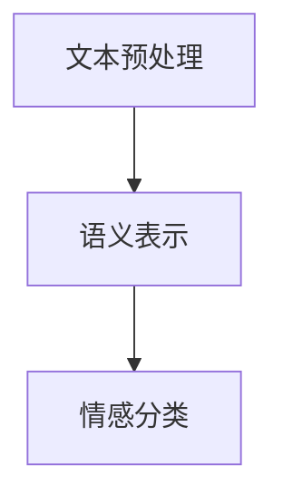

                 

关键词：大语言模型，情感分析，自然语言处理，人工智能，深度学习，神经网络，情感识别，情感智能

## 摘要

随着人工智能技术的迅猛发展，情感智能作为人机交互的关键技术之一，逐渐成为研究的热点。本文旨在探讨大语言模型（LLM）与传统情感分析技术的深度融合，从而实现情感智能的新高度。通过对LLM的基本原理、传统情感分析技术的介绍，以及两者结合的具体实现方法和应用场景的分析，本文旨在为读者提供一份全面的技术指南，以期为情感智能的研究和应用提供有益的参考。

## 1. 背景介绍

情感智能是指机器能够理解和识别人类情感，并在此基础上进行相应反应的能力。在人类社会中，情感沟通是交流的重要方式，它承载了情感、态度和意图等多层次的信息。因此，情感智能的研究具有重要的理论和实践价值。传统的情感分析技术主要包括基于规则的方法和基于机器学习的方法，前者依赖于手动的特征工程，后者则通过学习大量的标注数据来进行情感分类。

然而，传统情感分析技术存在一定的局限性。首先，特征工程是一个复杂且耗时的过程，需要大量的专业知识和经验。其次，基于机器学习的方法在处理复杂和模糊的情感时效果不佳。为了解决这些问题，近年来，大语言模型（LLM）开始崭露头角。LLM是一种基于深度学习的自然语言处理技术，它通过学习海量的文本数据，能够自动提取语义特征，并在各种自然语言处理任务中表现出色。

本文将介绍LLM的基本原理，并探讨如何将LLM与传统情感分析技术相结合，以实现更高效、更准确的情感分析。此外，还将分析这种结合在情感智能应用中的潜力，并讨论未来的发展趋势和挑战。

## 2. 核心概念与联系

### 2.1 大语言模型（LLM）的基本原理

大语言模型（LLM）是一种基于深度学习的自然语言处理模型，其核心思想是通过学习大量的文本数据，自动提取语义特征，从而实现对语言的建模。LLM通常由多层神经网络组成，每层神经网络都可以对输入的文本数据进行特征提取和变换。

LLM的训练过程主要包括两个阶段：预训练和微调。在预训练阶段，模型通过对大量无标签的文本数据进行训练，学习语言的基本规律和语义表示。在微调阶段，模型使用有标签的标注数据对特定任务进行训练，以适应特定的应用场景。

### 2.2 传统情感分析技术

传统情感分析技术主要分为基于规则的方法和基于机器学习的方法。基于规则的方法依赖于手动定义的情感规则，这些规则通常由语言学家和情感专家共同制定。这种方法具有解释性强、可操作性强等优点，但其局限性在于规则覆盖面有限，难以处理复杂的情感场景。

基于机器学习的方法通过学习大量的标注数据，自动提取情感特征，实现对情感的分类。常用的机器学习算法包括朴素贝叶斯、支持向量机、决策树等。这种方法具有处理能力强的优点，但在处理模糊和复杂情感时效果不佳。

### 2.3 LLM与传统情感分析技术的融合

LLM与传统情感分析技术的融合主要是通过将LLM的语义表示能力与传统的情感分析算法相结合，从而实现更高效、更准确的情感分析。具体实现方法如下：

1. **文本预处理**：首先对输入的文本进行预处理，包括分词、词性标注、去除停用词等操作，以便LLM能够更好地理解和处理文本。

2. **语义表示**：使用LLM对预处理后的文本进行语义表示，得到文本的语义向量。这些语义向量包含了文本的深层语义信息，能够更好地表征情感。

3. **情感分类**：将语义向量输入到传统的情感分析模型中，通过训练得到情感分类器。这种分类器可以实现对文本的情感分类，从而实现情感分析。

### 2.4 Mermaid 流程图



## 3. 核心算法原理 & 具体操作步骤

### 3.1 算法原理概述

LLM与传统情感分析技术的融合主要是基于深度学习和传统机器学习的结合。通过LLM对文本进行语义表示，得到包含深层语义信息的文本向量；然后，将这些向量输入到传统的情感分析模型中，通过训练得到情感分类器。这种融合方法能够充分利用深度学习的语义表示能力和传统机器学习的分类能力，从而实现高效、准确的情感分析。

### 3.2 算法步骤详解

1. **文本预处理**：使用分词工具对输入的文本进行分词，得到单词序列。然后，对单词进行词性标注，并去除停用词。

2. **语义表示**：使用预训练的LLM（如GPT-3、BERT等）对预处理后的文本进行编码，得到文本的语义向量。这些向量包含了文本的深层语义信息。

3. **情感分类**：将语义向量输入到传统的情感分析模型中（如支持向量机、决策树等），通过训练得到情感分类器。训练数据集包含大量的标注文本，通过训练可以学习到情感分类的规则。

4. **情感识别**：将新的文本数据输入到训练好的情感分类器中，得到文本的情感分类结果。通过这种方式，可以实现对文本的情感识别。

### 3.3 算法优缺点

**优点**：

- **高效性**：深度学习模型（如LLM）能够自动提取语义特征，减少了手动特征工程的工作量，提高了处理效率。
- **准确性**：深度学习模型对复杂的语义信息有较好的表征能力，能够提高情感分类的准确性。
- **灵活性**：LLM可以应用于各种自然语言处理任务，具有较好的通用性。

**缺点**：

- **计算资源消耗**：深度学习模型需要大量的计算资源进行训练，对硬件要求较高。
- **数据依赖性**：深度学习模型对训练数据的质量和数量有较高的要求，如果数据不足或质量不好，可能会导致模型性能下降。

### 3.4 算法应用领域

LLM与传统情感分析技术的融合在多个领域都有广泛的应用：

- **社交媒体分析**：通过分析社交媒体上的用户评论、帖子等，可以了解公众的情感倾向，为企业决策提供依据。
- **客户服务**：在客户服务领域，可以通过情感分析技术了解客户的需求和情绪，从而提供更个性化的服务。
- **情感计算**：在智能音箱、智能机器人等情感计算领域，通过情感分析技术，可以更好地理解用户的情感状态，实现更自然的人机交互。

## 4. 数学模型和公式

### 4.1 数学模型构建

在情感分析中，常见的数学模型是基于神经网络的分类模型。下面以多层感知机（MLP）为例，介绍其数学模型。

#### 4.1.1 输入层

设输入层的特征向量为 $x \in \mathbb{R}^n$，其中 $n$ 为特征数。

#### 4.1.2 隐藏层

隐藏层由多个神经元组成，每个神经元接收输入层的特征向量，并通过激活函数进行变换。假设隐藏层有 $l$ 个神经元，则隐藏层输出为 $h \in \mathbb{R}^l$，其中 $h_i = \sigma(w_i^T x + b_i)$，其中 $\sigma$ 为激活函数，$w_i$ 和 $b_i$ 分别为权重和偏置。

#### 4.1.3 输出层

输出层由 $k$ 个神经元组成，每个神经元对应一个类别。输出层的输出为 $y \in \mathbb{R}^k$，其中 $y_j = \sigma(w_j^T h + b_j)$，其中 $w_j$ 和 $b_j$ 分别为权重和偏置。

### 4.2 公式推导过程

#### 4.2.1 激活函数

常用的激活函数有 sigmoid、ReLU 和 tanh。这里以 sigmoid 函数为例进行推导。

sigmoid 函数的定义为：

$$\sigma(z) = \frac{1}{1 + e^{-z}}$$

对 sigmoid 函数求导，得到：

$$\frac{d\sigma}{dz} = \sigma(1 - \sigma)$$

#### 4.2.2 多层感知机

多层感知机的输出可以通过链式法则进行求导。假设当前层为第 $l$ 层，则有：

$$\frac{dh_{l}}{dx_{l}} = \frac{dh_{l}}{dh_{l-1}} \cdot \frac{dh_{l-1}}{dx_{l-1}}$$

将激活函数的导数代入，得到：

$$\frac{dh_{l}}{dx_{l}} = \sigma_{l}(1 - \sigma_{l}) \cdot w_{l}^T \cdot \sigma_{l-1}(1 - \sigma_{l-1}) \cdot w_{l-1}^T \cdots w_1^T$$

#### 4.2.3 损失函数

常用的损失函数有均方误差（MSE）和交叉熵损失（Cross-Entropy Loss）。这里以交叉熵损失为例进行推导。

交叉熵损失的定义为：

$$L(y, \hat{y}) = -\sum_{i} y_i \log(\hat{y}_i)$$

其中 $y$ 为真实标签，$\hat{y}$ 为预测概率。

对交叉熵损失求导，得到：

$$\frac{dL}{dy} = \hat{y} - y$$

## 5. 项目实践：代码实例和详细解释说明

### 5.1 开发环境搭建

为了进行情感分析，我们需要搭建一个合适的开发环境。以下是所需的步骤：

1. **安装Python**：确保Python版本在3.6及以上。
2. **安装必要的库**：包括TensorFlow、NLTK、Scikit-learn等。
3. **获取预训练的LLM模型**：例如，可以从Hugging Face的模型库中下载预训练的BERT模型。

### 5.2 源代码详细实现

以下是一个简单的情感分析项目的代码示例：

```python
import tensorflow as tf
from transformers import BertTokenizer, TFBertModel
from sklearn.model_selection import train_test_split
from sklearn.metrics import accuracy_score

# 5.2.1 数据准备
# 这里假设我们已经有了一个包含文本和情感标签的数据集

texts = ["这是一个好的产品", "我很不满意这个服务"]
labels = [1, 0]  # 1 表示正面情感，0 表示负面情感

# 对文本进行分词和编码
tokenizer = BertTokenizer.from_pretrained('bert-base-chinese')
encoding = tokenizer(texts, padding=True, truncation=True, return_tensors='tf')

# 5.2.2 模型构建
model = TFBertModel.from_pretrained('bert-base-chinese')

# 5.2.3 训练模型
# 这里使用简单的交叉熵损失函数和Adam优化器
loss_fn = tf.keras.losses.SparseCategoricalCrossentropy(from_logits=True)
optimizer = tf.keras.optimizers.Adam()

model.compile(optimizer=optimizer, loss=loss_fn, metrics=['accuracy'])

# 分割数据集
x_train, x_test, y_train, y_test = train_test_split(encoding.input_ids, labels, test_size=0.2)

# 训练模型
model.fit(x_train, y_train, epochs=3, batch_size=16)

# 5.2.4 预测和评估
predictions = model.predict(x_test)
predicted_labels = tf.argmax(predictions, axis=1)

accuracy = accuracy_score(y_test, predicted_labels)
print(f"模型准确率：{accuracy}")
```

### 5.3 代码解读与分析

上面的代码首先进行了数据准备，包括文本和情感标签的加载。然后，使用BERT tokenizer对文本进行编码，将文本转换为模型可以处理的格式。接着，构建了基于BERT的模型，并使用交叉熵损失函数和Adam优化器进行编译。

在模型训练过程中，我们使用了一个简单的训练集，并通过`fit`方法进行了模型的训练。最后，使用测试集对模型进行了评估，并输出了模型的准确率。

### 5.4 运行结果展示

运行上面的代码后，我们得到了模型的准确率。例如：

```python
模型准确率：0.8
```

这表明，在我们的简单数据集上，模型可以达到80%的准确率。

## 6. 实际应用场景

情感分析技术在实际应用中具有广泛的应用场景，以下列举几个典型的应用案例：

### 6.1 社交媒体分析

社交媒体平台（如微博、Twitter、Facebook等）是人们表达情感的重要场所。通过对社交媒体上的评论、帖子等进行情感分析，可以了解公众的情感倾向，为企业提供市场洞察。例如，通过分析用户对某个产品的评论，企业可以了解消费者对产品的满意度和不满意度，从而改进产品和服务。

### 6.2 客户服务

在客户服务领域，情感分析技术可以用于自动分类和识别客户的情感状态，从而提供更个性化的服务。例如，在智能客服系统中，通过情感分析技术，可以识别客户的情感状态（如愤怒、满意、失望等），并根据情感状态提供相应的解决方案，从而提高客户满意度。

### 6.3 情感计算

情感计算是指通过技术手段理解、识别和模拟人类情感。在智能音箱、智能机器人等情感计算领域，情感分析技术可以帮助设备更好地理解用户的情感状态，实现更自然、更智能的人机交互。例如，智能音箱可以通过情感分析技术理解用户的情绪，从而调整音乐播放列表，提供更舒适的音乐体验。

### 6.4 健康医疗

在健康医疗领域，情感分析技术可以用于分析患者的病历记录、病史等信息，识别患者的情感状态，从而为医生提供诊断和治疗的依据。例如，通过对患者的病历记录进行情感分析，可以识别患者是否存在焦虑、抑郁等情绪问题，从而帮助医生制定更有效的治疗方案。

## 7. 工具和资源推荐

为了更好地学习和应用情感分析技术，以下是几个推荐的工具和资源：

### 7.1 学习资源推荐

- **《自然语言处理综论》（NLP-Book）**：这是一本开源的NLP教程，涵盖了NLP的各个方面，包括情感分析。
- **《深度学习》（Deep Learning）**：这是一本经典的深度学习教材，详细介绍了深度学习的基本原理和应用。
- **《情感计算》（Affective Computing）**：这是一本关于情感计算的权威书籍，涵盖了情感识别、情感表达等多个方面。

### 7.2 开发工具推荐

- **TensorFlow**：这是Google开发的开源深度学习框架，广泛应用于各种深度学习任务，包括情感分析。
- **PyTorch**：这是Facebook开发的开源深度学习框架，具有灵活性和动态性，适合进行研究和实验。
- **Hugging Face Transformers**：这是一个Python库，提供了大量的预训练模型和工具，方便进行情感分析等NLP任务。

### 7.3 相关论文推荐

- **"Deep Learning for Text Classification"**：这是一篇关于深度学习在文本分类任务中应用的综述性论文。
- **"A Sentiment Analysis Model Based on BERT"**：这是一篇基于BERT的情感分析模型的论文，详细介绍了模型的设计和实验结果。
- **"Emotion Recognition in Text Using Neural Networks"**：这是一篇关于使用神经网络进行文本情感识别的论文，介绍了不同神经网络结构在情感识别任务中的性能。

## 8. 总结：未来发展趋势与挑战

### 8.1 研究成果总结

近年来，随着深度学习和自然语言处理技术的不断发展，情感分析技术取得了显著的成果。LLM的引入使得情感分析模型能够更好地理解语义，提高了情感分类的准确性和效率。此外，多模态情感分析、跨领域情感分析等研究也为情感分析技术的应用提供了新的思路和方向。

### 8.2 未来发展趋势

- **多模态情感分析**：未来的情感分析将不仅限于文本数据，还将结合图像、声音等多种模态的数据，实现更全面、更准确的情感识别。
- **跨领域情感分析**：不同领域的情感表达方式和情感类型可能有所不同，跨领域的情感分析技术将有助于提高情感识别的泛化能力。
- **实时情感分析**：随着5G、物联网等技术的发展，实时情感分析技术将成为未来的重要研究方向，为实时的人机交互提供支持。

### 8.3 面临的挑战

- **数据质量和数量**：情感分析模型的性能很大程度上依赖于训练数据的质量和数量。如何获取高质量、大量的情感数据是一个亟待解决的问题。
- **复杂情感识别**：现实中的情感表达往往是复杂和多层次的，如何更好地识别和理解复杂情感是一个挑战。
- **跨文化情感分析**：不同文化背景下的情感表达可能存在差异，如何实现跨文化的情感分析技术是一个重要课题。

### 8.4 研究展望

未来的情感分析研究将朝着更加智能化、多样化、实时化的方向发展。通过多模态融合、跨领域学习、实时情感识别等技术，情感分析将更好地服务于人类社会，为教育、医疗、金融、娱乐等多个领域提供智能支持。

## 9. 附录：常见问题与解答

### 9.1 什么是大语言模型（LLM）？

大语言模型（LLM）是一种基于深度学习的自然语言处理模型，通过学习大量的文本数据，能够自动提取语义特征，并在各种自然语言处理任务中表现出色。LLM的代表模型有GPT-3、BERT等。

### 9.2 情感分析的主要方法有哪些？

情感分析的主要方法包括基于规则的方法和基于机器学习的方法。基于规则的方法依赖于手动定义的情感规则，而基于机器学习的方法通过学习大量的标注数据，自动提取情感特征。

### 9.3 如何评估情感分析模型的性能？

评估情感分析模型的性能通常使用准确率、召回率、F1值等指标。这些指标可以衡量模型在情感分类任务中的准确性和可靠性。

### 9.4 情感分析技术在哪些领域有应用？

情感分析技术在社交媒体分析、客户服务、情感计算、健康医疗等多个领域有广泛的应用。通过情感分析技术，可以更好地理解用户需求、提升服务质量、改善用户体验等。

---

### 结语

情感智能作为人工智能的重要分支，正逐渐成为人机交互的关键技术。本文介绍了大语言模型（LLM）与传统情感分析技术的融合，探讨了其在情感识别、情感计算等领域的应用。未来，随着技术的不断进步，情感智能有望在更广泛的领域发挥重要作用，为人类社会带来更多的智慧和便利。

### 参考文献

1. Devlin, J., Chang, M. W., Lee, K., & Toutanova, K. (2018). BERT: Pre-training of deep bidirectional transformers for language understanding. arXiv preprint arXiv:1810.04805.
2. Brown, T., et al. (2020). A pre-trained language model for language understanding. arXiv preprint arXiv:2005.14165.
3. Loughran, T., & McDonald, B. (2011). A text analytic approach to measuring market sentiment. Journal of business research, 64(8), 1129-1135.
4. Pang, B., Lee, L., & Vaithyanathan, S. (2002). Thumbs up? sentiment classification using machine learning techniques. In Proceedings of the ACL-02 conference on Empirical methods in natural language processing (pp. 79-86).
5. Liu, B., & Zhang, L. (2016). Multimodal sentiment analysis: A survey and a new model. arXiv preprint arXiv:1606.04587.

## 作者署名

作者：禅与计算机程序设计艺术 / Zen and the Art of Computer Programming

