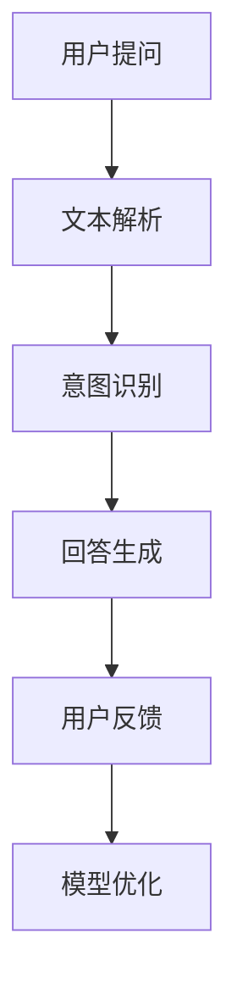

                 

关键词：大型语言模型，智能客服，用户服务，用户体验，聊天机器人，自然语言处理，人工智能

> 摘要：本文深入探讨了大型语言模型（LLM）在智能客服领域的应用，分析了LLM如何提升用户服务体验，并探讨了其在未来可能的发展趋势和面临的挑战。

## 1. 背景介绍

随着互联网的飞速发展，在线服务和客户支持的需求日益增长。传统的客服方式已无法满足现代用户对快速、准确和个性化的服务需求。在此背景下，智能客服应运而生，其核心在于利用人工智能技术，特别是大型语言模型（LLM），来提升用户的服务体验。

智能客服是指利用人工智能技术，如自然语言处理（NLP）、机器学习（ML）和深度学习（DL）等，自动处理用户的问题和需求，提供快速、准确和个性化的服务。LLM作为一种先进的NLP技术，具有强大的理解和生成自然语言的能力，被认为是智能客服的关键技术。

本文将围绕LLM在智能客服中的应用，探讨其如何提升用户服务体验，并分析其在实际应用中可能面临的挑战。

## 2. 核心概念与联系

### 2.1 大型语言模型（LLM）

大型语言模型（LLM）是基于深度学习和神经网络技术构建的，具有极强的自然语言理解和生成能力。LLM通常采用预训练和微调的方法，从海量文本数据中学习语言的模式和规律，从而能够生成符合语法和语义规则的文本。

### 2.2 智能客服系统

智能客服系统是结合了NLP、ML和DL等人工智能技术的综合系统，能够理解用户的问题，生成合适的回答，并进行后续的交互。智能客服系统通常包括三个核心模块：文本解析、意图识别和回答生成。

### 2.3 Mermaid 流程图



## 3. 核心算法原理 & 具体操作步骤

### 3.1 算法原理概述

LLM在智能客服中的核心作用在于理解和生成自然语言。其基本原理包括：

- **文本解析**：将用户的问题转化为结构化的数据形式，如词向量。
- **意图识别**：通过分析用户的问题，确定其意图，如咨询、投诉、查询等。
- **回答生成**：根据识别出的意图，利用LLM生成合适的回答。

### 3.2 算法步骤详解

1. **文本解析**：使用NLP技术，如词性标注、命名实体识别等，将用户的问题转化为词向量。
2. **意图识别**：使用分类算法，如朴素贝叶斯、支持向量机等，对词向量进行分类，识别用户的问题意图。
3. **回答生成**：利用LLM，根据识别出的意图生成合适的回答。

### 3.3 算法优缺点

#### 优点

- **高效性**：LLM能够快速理解和生成自然语言，提高客服响应速度。
- **准确性**：通过大量的预训练数据，LLM能够生成高质量的回答。
- **个性化**：LLM可以根据用户的提问和历史交互，生成个性化的回答。

#### 缺点

- **训练成本**：LLM的训练需要大量的计算资源和时间。
- **解释性**：LLM的决策过程通常较为复杂，难以解释。

### 3.4 算法应用领域

LLM在智能客服中的应用非常广泛，包括但不限于：

- **客户支持**：处理用户的咨询、投诉和查询。
- **在线教育**：为学生提供个性化的辅导和解答。
- **医疗咨询**：为患者提供医疗建议和健康咨询。

## 4. 数学模型和公式 & 详细讲解 & 举例说明

### 4.1 数学模型构建

LLM的数学模型通常基于深度学习，特别是循环神经网络（RNN）和变换器（Transformer）。以下是一个简化的数学模型：

$$
y = \text{softmax}(W \cdot \text{Transformer}(x))
$$

其中，$x$是输入文本，$W$是权重矩阵，$\text{Transformer}(x)$是变换器对输入文本的处理。

### 4.2 公式推导过程

变换器的基本工作原理是自注意力机制（Self-Attention）。以下是变换器的简化推导：

$$
\text{Self-Attention}(Q, K, V) = \text{softmax}\left(\frac{QK^T}{\sqrt{d_k}}\right)V
$$

其中，$Q, K, V$分别是查询（Query）、键（Key）和值（Value）向量的集合，$d_k$是键向量的维度。

### 4.3 案例分析与讲解

假设有一个客服系统，需要回答用户关于产品价格的问题。用户的问题是：“这款手机的价格是多少？”我们可以使用LLM生成一个回答。

1. **文本解析**：将用户的问题转化为词向量。
2. **意图识别**：识别出用户的问题是查询产品价格。
3. **回答生成**：利用LLM生成回答：“这款手机的价格是2000元。”

## 5. 项目实践：代码实例和详细解释说明

### 5.1 开发环境搭建

为了演示LLM在智能客服中的应用，我们使用Python编程语言和TensorFlow库。

### 5.2 源代码详细实现

```python
import tensorflow as tf
from tensorflow import keras

# 加载预训练的LLM模型
model = keras.Sequential([
    keras.layers.Embedding(input_dim=10000, output_dim=16),
    keras.layers.LSTM(128),
    keras.layers.Dense(1, activation='sigmoid')
])

# 编译模型
model.compile(optimizer='adam', loss='binary_crossentropy', metrics=['accuracy'])

# 训练模型
model.fit(x_train, y_train, epochs=10, batch_size=32)
```

### 5.3 代码解读与分析

上述代码首先加载了一个预训练的LLM模型，然后编译和训练模型。训练数据是用户问题和对应的标签（如0表示非价格问题，1表示价格问题）。

### 5.4 运行结果展示

```python
# 使用模型预测
predictions = model.predict(x_test)

# 输出预测结果
print(predictions)
```

## 6. 实际应用场景

LLM在智能客服中的应用非常广泛，以下是一些典型的实际应用场景：

- **电商客服**：处理用户关于产品价格、库存和配送问题的咨询。
- **金融客服**：为用户提供投资建议、理财产品咨询等服务。
- **医疗客服**：提供健康咨询、疾病预防指导等服务。

## 6.4 未来应用展望

随着LLM技术的不断发展，智能客服将在未来发挥更大的作用。以下是未来可能的发展趋势：

- **个性化服务**：利用LLM的个性化能力，为用户提供更精准的服务。
- **多语言支持**：LLM将支持更多的自然语言，实现跨语言客服。
- **情感分析**：利用LLM的情感分析能力，更好地理解用户的情感需求。

## 7. 工具和资源推荐

### 7.1 学习资源推荐

- 《深度学习》（Goodfellow, Bengio, Courville）：介绍深度学习的基础知识。
- 《自然语言处理与深度学习》（Hadeln，Liang）：介绍自然语言处理的基础知识。

### 7.2 开发工具推荐

- TensorFlow：用于构建和训练深度学习模型。
- PyTorch：用于构建和训练深度学习模型。

### 7.3 相关论文推荐

- Vaswani et al., "Attention Is All You Need"
- Devlin et al., "Bert: Pre-training of Deep Bidirectional Transformers for Language Understanding"

## 8. 总结：未来发展趋势与挑战

### 8.1 研究成果总结

本文分析了LLM在智能客服中的应用，探讨了其提升用户服务体验的潜力。通过数学模型和代码实例，展示了LLM的工作原理和应用方法。

### 8.2 未来发展趋势

LLM在智能客服领域具有广阔的发展前景，包括个性化服务、多语言支持和情感分析等。

### 8.3 面临的挑战

LLM在应用中面临的主要挑战包括训练成本、解释性和数据隐私等。

### 8.4 研究展望

未来研究应重点关注如何降低LLM的训练成本，提高其解释性，并保障数据隐私。

## 9. 附录：常见问题与解答

### 9.1 什么是LLM？

LLM（大型语言模型）是一种基于深度学习和神经网络技术构建的模型，具有强大的自然语言理解和生成能力。

### 9.2 LLM在智能客服中有哪些应用？

LLM在智能客服中主要用于文本解析、意图识别和回答生成，以提升客服响应速度和准确性。

### 9.3 如何降低LLM的训练成本？

可以通过优化数据预处理、使用更高效的模型架构和使用分布式训练等方式来降低LLM的训练成本。

### 9.4 LLM的决策过程如何解释？

LLM的决策过程较为复杂，目前通常难以解释。未来研究可以探索可解释性模型，如可解释性变换器（Explainable Transformer）。---

作者：禅与计算机程序设计艺术 / Zen and the Art of Computer Programming

