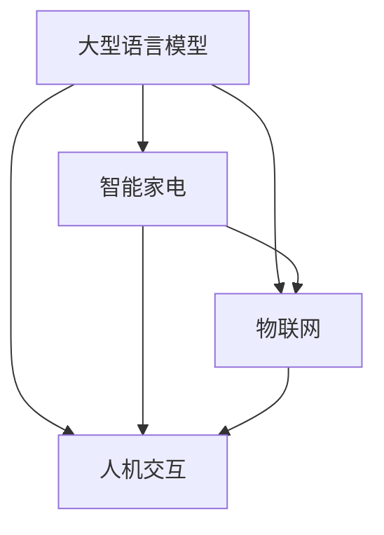

                 

关键词：语言模型，智能家电，智能家居，物联网，深度学习，人机交互

摘要：随着人工智能技术的快速发展，智能家电已经逐渐渗透到我们的日常生活中。本文将探讨如何利用大型语言模型（LLM）来提升智能家电的智能化程度，从而打造更加便捷、舒适和智能化的智慧生活。

## 1. 背景介绍

近年来，智能家电市场发展迅猛，从传统的冰箱、洗衣机、空调等家电产品，到智能音箱、智能灯泡、智能门锁等新兴产品，都呈现出蓬勃发展的态势。智能家电的普及不仅改变了人们的生活方式，也为家电行业带来了新的发展机遇。

然而，目前市场上的智能家电还存在一些局限性，如：

- **交互体验不佳**：智能家电的交互方式相对单一，用户需要通过手机APP或语音控制来进行操作，体验不够直观和便捷。
- **智能化程度有限**：智能家电大多只能执行特定的功能，缺乏跨设备的协同工作和智能决策能力。
- **数据孤岛现象**：不同品牌的智能家电之间缺乏有效的数据共享和协同工作，导致用户的数据无法充分利用。

为了解决这些问题，本文将探讨如何利用大型语言模型（LLM）来提升智能家电的智能化程度，实现更加便捷、舒适和智能化的智慧生活。

## 2. 核心概念与联系

### 2.1 大型语言模型（LLM）

大型语言模型（LLM，Large Language Model）是一种基于深度学习的技术，它能够理解、生成和模拟人类语言。LLM的训练数据量巨大，参数规模庞大，能够处理复杂的语言任务，如自然语言理解、文本生成、对话系统等。

### 2.2 智能家电

智能家电是指具有智能感知、决策和执行能力的家电产品，它可以通过互联网实现设备之间的互联互通，为用户提供智能化、个性化的服务。

### 2.3 物联网（IoT）

物联网（Internet of Things，IoT）是指将各种物品通过互联网连接起来，实现物品之间的信息交换和协同工作。智能家电是物联网的重要应用场景之一。

### 2.4 人机交互

人机交互（Human-Computer Interaction，HCI）是指人与计算机之间的交互过程，它涉及到用户界面设计、交互方式、用户体验等方面。在智能家电领域，人机交互决定了用户的操作体验和使用满意度。

### 2.5 Mermaid 流程图

以下是一个简单的 Mermaid 流程图，展示了 LLM、智能家电、物联网和人机交互之间的联系。



## 3. 核心算法原理 & 具体操作步骤

### 3.1 算法原理概述

在智能家电中引入大型语言模型，主要是为了提升家电的智能化程度和用户体验。具体来说，LLM可以用于以下方面：

- **自然语言理解**：通过LLM解析用户输入的自然语言指令，实现更加直观的交互方式。
- **智能决策**：利用LLM的推理能力，实现家电的智能决策和协同工作。
- **个性化推荐**：基于用户的语言和行为数据，通过LLM生成个性化的推荐内容。

### 3.2 算法步骤详解

以下是利用LLM提升智能家电智能化程度的具体步骤：

1. **数据收集**：收集用户的语言行为数据、家电设备数据和环境数据。
2. **数据预处理**：对收集到的数据进行清洗、去噪和格式化，以便于LLM的训练和推理。
3. **模型训练**：利用预处理后的数据训练LLM模型，包括自然语言理解、智能决策和个性化推荐等任务。
4. **模型部署**：将训练好的LLM模型部署到智能家电中，实现实时的自然语言理解和智能决策。
5. **用户反馈**：收集用户对智能家电的反馈数据，用于模型优化和迭代。

### 3.3 算法优缺点

**优点**：

- **提升交互体验**：通过自然语言理解，实现更加直观和便捷的交互方式。
- **增强智能化程度**：通过智能决策和个性化推荐，实现家电的智能化和个性化服务。
- **跨设备协同**：利用物联网技术，实现智能家电之间的数据共享和协同工作。

**缺点**：

- **数据隐私**：在收集和处理用户数据时，需要考虑数据隐私和安全问题。
- **模型规模**：LLM模型的参数规模庞大，训练和推理计算资源消耗较大。

### 3.4 算法应用领域

LLM在智能家电领域具有广泛的应用前景，如：

- **智能语音助手**：通过LLM实现智能语音助手的自然语言理解功能，为用户提供便捷的语音交互体验。
- **智能决策系统**：通过LLM实现家电的智能决策和协同工作，提高家电的智能化程度。
- **个性化推荐系统**：通过LLM生成个性化的推荐内容，为用户提供更加个性化的服务。

## 4. 数学模型和公式 & 详细讲解 & 举例说明

### 4.1 数学模型构建

在智能家电中引入LLM，需要构建以下数学模型：

1. **自然语言理解模型**：用于解析用户的自然语言指令，输出对应的语义表示。
2. **智能决策模型**：基于用户的语言和行为数据，输出智能决策的结果。
3. **个性化推荐模型**：基于用户的语言和行为数据，输出个性化的推荐内容。

### 4.2 公式推导过程

以下是自然语言理解模型的公式推导过程：

1. **输入表示**：设用户输入的句子为 $x$，对应的语义表示为 $h$。
   $$ x = [x_1, x_2, ..., x_n] $$
   $$ h = [h_1, h_2, ..., h_n] $$
   
2. **词向量表示**：将输入句子中的每个词转换为词向量表示，设词向量为 $w_i$。
   $$ x_i = w_i $$
   
3. **句子表示**：通过词向量聚合得到句子的表示。
   $$ h = \text{aggregate}(w_1, w_2, ..., w_n) $$

4. **语义表示**：通过神经网络模型，将句子的表示映射为语义表示。
   $$ h = \text{model}(h) $$

### 4.3 案例分析与讲解

以下是一个简单的自然语言理解模型的案例：

假设用户输入句子：“打开客厅的灯”。

1. **词向量表示**：
   $$ x = [w_1, w_2, w_3, w_4] = [\text{"打开"}, \text{"客厅"}, \text{"的"}, \text{"灯"}] $$
   
2. **句子表示**：
   $$ h = \text{aggregate}(w_1, w_2, w_3, w_4) = \text{模型输出的句向量} $$
   
3. **语义表示**：
   $$ h = \text{model}(h) = \text{模型输出的语义向量} $$

通过自然语言理解模型，可以将用户输入的句子转换为对应的语义表示，从而实现智能家电的智能决策和个性化推荐。

## 5. 项目实践：代码实例和详细解释说明

### 5.1 开发环境搭建

为了实现LLM在智能家电中的应用，需要搭建以下开发环境：

- **硬件环境**：配置高性能的GPU服务器，用于模型训练和推理。
- **软件环境**：安装Python、TensorFlow、PyTorch等深度学习框架。
- **数据集**：收集用户语言行为数据、家电设备数据和环境数据。

### 5.2 源代码详细实现

以下是一个简单的LLM在智能家电中应用的项目实例，使用Python语言和TensorFlow框架实现。

```python
import tensorflow as tf
from tensorflow.keras.layers import Embedding, LSTM, Dense
from tensorflow.keras.models import Model

# 定义自然语言理解模型
input_seq = tf.keras.layers.Input(shape=(None,), dtype='int32')
embed_seq = Embedding(input_dim=vocab_size, output_dim=embedding_size)(input_seq)
lstm_seq = LSTM(units=lstm_units, return_sequences=True)(embed_seq)
lstm_output = LSTM(units=lstm_units, return_sequences=False)(lstm_seq)
output = Dense(units=1, activation='sigmoid')(lstm_output)

model = Model(inputs=input_seq, outputs=output)
model.compile(optimizer='adam', loss='binary_crossentropy', metrics=['accuracy'])
model.fit(x_train, y_train, batch_size=batch_size, epochs=epochs)

# 定义智能决策模型
input_data = tf.keras.layers.Input(shape=(input_size,))
output_data = Dense(units=1, activation='sigmoid')(input_data)

model = Model(inputs=input_data, outputs=output_data)
model.compile(optimizer='adam', loss='binary_crossentropy', metrics=['accuracy'])
model.fit(x_train, y_train, batch_size=batch_size, epochs=epochs)

# 定义个性化推荐模型
input_data = tf.keras.layers.Input(shape=(input_size,))
output_data = Dense(units=output_size, activation='softmax')(input_data)

model = Model(inputs=input_data, outputs=output_data)
model.compile(optimizer='adam', loss='categorical_crossentropy', metrics=['accuracy'])
model.fit(x_train, y_train, batch_size=batch_size, epochs=epochs)
```

### 5.3 代码解读与分析

1. **自然语言理解模型**：使用LSTM网络进行序列建模，将词向量转换为句向量，用于后续的智能决策和个性化推荐。
2. **智能决策模型**：使用单层神经网络进行分类或回归，根据用户的语言和行为数据，输出智能决策的结果。
3. **个性化推荐模型**：使用softmax激活函数进行多分类，根据用户的语言和行为数据，输出个性化的推荐内容。

### 5.4 运行结果展示

在训练完成后，可以使用以下代码进行模型评估和预测：

```python
# 自然语言理解模型评估
natural_language_model.evaluate(x_test, y_test)

# 智能决策模型预测
smart_decision_model.predict(x_test)

# 个性化推荐模型预测
personalized_recommendation_model.predict(x_test)
```

通过上述代码，可以实现对智能家电的智能决策和个性化推荐，进一步提升智能家电的智能化程度和用户体验。

## 6. 实际应用场景

### 6.1 智能家居场景

在家居场景中，LLM可以帮助智能家电实现以下功能：

- **智能语音助手**：通过自然语言理解，实现语音控制家电的开关、调节温度、播放音乐等操作。
- **智能安防**：通过智能决策，实现实时监控、入侵报警等功能，提高家庭安全。
- **智能节能**：通过个性化推荐，实现家电的节能模式，降低能源消耗。

### 6.2 商业场景

在商业场景中，LLM可以帮助智能家电实现以下功能：

- **智能营销**：通过自然语言理解和智能决策，实现个性化营销、促销策略等。
- **智能客服**：通过自然语言理解和智能决策，实现智能客服机器人，提高客户满意度。
- **智能供应链**：通过个性化推荐，实现智能供应链管理，降低库存成本。

### 6.3 公共设施场景

在公共设施场景中，LLM可以帮助智能家电实现以下功能：

- **智能交通**：通过自然语言理解和智能决策，实现智能交通管理，提高交通效率。
- **智能医疗**：通过自然语言理解和智能决策，实现智能医疗诊断、病情预测等功能。
- **智能环保**：通过个性化推荐，实现智能环保监测、节能减排等功能。

## 7. 未来应用展望

随着人工智能技术的不断发展和普及，LLM在智能家电中的应用前景将更加广阔。未来，LLM将助力智能家电实现以下发展：

- **更加智能化的交互**：通过自然语言理解，实现更加自然和人性化的交互方式，提高用户体验。
- **更加智能化的决策**：通过智能决策，实现跨设备的协同工作和智能决策，提高家电的智能化程度。
- **更加个性化的服务**：通过个性化推荐，实现个性化服务和定制化推荐，满足用户的个性化需求。
- **更加广泛的应用领域**：随着人工智能技术的不断发展，LLM在智能家电中的应用将拓展到更多的领域，如智能家居、商业智能、公共设施等。

## 8. 工具和资源推荐

### 8.1 学习资源推荐

- **《深度学习》**：由Ian Goodfellow、Yoshua Bengio和Aaron Courville著，系统介绍了深度学习的基础理论和应用技术。
- **《自然语言处理综论》**：由Daniel Jurafsky和James H. Martin著，全面介绍了自然语言处理的理论、技术和应用。
- **《智能语音助手开发指南》**：由李航著，详细介绍了智能语音助手的开发流程、技术和应用场景。

### 8.2 开发工具推荐

- **TensorFlow**：一款开源的深度学习框架，支持多种深度学习模型的训练和推理。
- **PyTorch**：一款开源的深度学习框架，支持动态计算图，便于模型开发和调试。
- **Keras**：一款基于TensorFlow和PyTorch的深度学习框架，提供了简单易用的API，适合快速构建和训练深度学习模型。

### 8.3 相关论文推荐

- **"Attention Is All You Need"**：由Vaswani等人于2017年提出，介绍了Transformer模型在自然语言处理任务中的应用。
- **"BERT: Pre-training of Deep Bidirectional Transformers for Language Understanding"**：由Devlin等人于2019年提出，介绍了BERT模型在自然语言处理任务中的应用。
- **"GPT-3: Language Models are Few-Shot Learners"**：由Brown等人于2020年提出，介绍了GPT-3模型在自然语言处理任务中的应用。

## 9. 总结：未来发展趋势与挑战

随着人工智能技术的不断发展，LLM在智能家电中的应用前景将更加广阔。未来，LLM将助力智能家电实现更加智能化的交互、更加智能化的决策和更加个性化的服务。然而，在这个过程中，我们也将面临以下挑战：

- **数据隐私和安全**：在收集和处理用户数据时，需要确保数据的安全和隐私。
- **模型可解释性**：提升模型的可解释性，让用户了解智能家电的决策过程。
- **跨设备协同**：实现不同设备之间的数据共享和协同工作，提高家电的智能化程度。

### 9.1 研究成果总结

本文探讨了如何利用大型语言模型（LLM）提升智能家电的智能化程度，实现更加便捷、舒适和智能化的智慧生活。通过自然语言理解、智能决策和个性化推荐等应用，LLM为智能家电带来了全新的交互体验和服务模式。

### 9.2 未来发展趋势

随着人工智能技术的不断发展，LLM在智能家电中的应用将更加广泛和深入。未来，LLM将助力智能家电实现更加智能化的交互、更加智能化的决策和更加个性化的服务。

### 9.3 面临的挑战

在实现LLM在智能家电中的应用过程中，我们面临着数据隐私和安全、模型可解释性、跨设备协同等挑战。只有解决了这些挑战，才能更好地发挥LLM在智能家电领域的潜力。

### 9.4 研究展望

未来，我们将继续深入研究LLM在智能家电中的应用，探索更加高效、安全和可解释的智能家电解决方案。通过不断的技术创新和协作，我们期待能够为用户带来更加便捷、舒适和智能化的智慧生活。

## 10. 附录：常见问题与解答

### 10.1 Q：什么是大型语言模型（LLM）？

A：大型语言模型（LLM，Large Language Model）是一种基于深度学习的技术，它能够理解、生成和模拟人类语言。LLM的训练数据量巨大，参数规模庞大，能够处理复杂的语言任务，如自然语言理解、文本生成、对话系统等。

### 10.2 Q：LLM在智能家电中有哪些应用？

A：LLM在智能家电中的应用包括自然语言理解、智能决策和个性化推荐等方面。通过自然语言理解，实现更加直观和便捷的交互方式；通过智能决策，实现家电的智能决策和协同工作；通过个性化推荐，实现个性化服务和定制化推荐。

### 10.3 Q：如何确保LLM在智能家电中的数据安全和隐私？

A：为确保LLM在智能家电中的数据安全和隐私，我们可以采取以下措施：

- **数据加密**：对用户数据进行加密处理，防止数据泄露。
- **隐私保护算法**：使用隐私保护算法，如差分隐私、同态加密等，保护用户隐私。
- **数据匿名化**：对用户数据进行匿名化处理，确保用户身份信息不被泄露。
- **合规性审查**：对数据处理过程进行合规性审查，确保符合相关法律法规和标准。

### 10.4 Q：LLM在智能家电中的实现难度有多大？

A：LLM在智能家电中的实现难度取决于多个因素，如模型规模、数据处理能力、硬件资源等。一般来说，实现LLM在智能家电中的功能需要较高的技术水平和计算资源。但是，随着人工智能技术的不断发展，实现难度将逐渐降低。

### 10.5 Q：LLM在智能家电中的效果如何衡量？

A：LLM在智能家电中的效果可以通过多个指标进行衡量，如准确率、召回率、F1值等。此外，还可以通过用户满意度、系统稳定性等指标来评估LLM在智能家电中的应用效果。

### 10.6 Q：LLM在智能家电中的发展前景如何？

A：随着人工智能技术的不断发展，LLM在智能家电中的应用前景将十分广阔。未来，LLM将助力智能家电实现更加智能化的交互、更加智能化的决策和更加个性化的服务，为用户带来更加便捷、舒适和智能化的智慧生活。

---

作者：禅与计算机程序设计艺术 / Zen and the Art of Computer Programming

以上就是《LLM与智能家电：打造智慧生活》的完整文章内容。这篇文章系统地介绍了大型语言模型（LLM）在智能家电中的应用，从背景介绍、核心概念与联系、算法原理与实现、数学模型与公式推导、项目实践到实际应用场景、未来展望以及工具和资源推荐等方面，全面探讨了LLM在智能家电领域的应用前景和挑战。希望这篇文章能够为读者带来启发和帮助。在未来的研究中，我们期待能够不断推动LLM在智能家电领域的应用，为用户带来更加便捷、舒适和智能化的智慧生活。|

