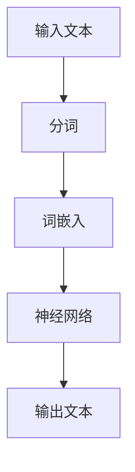
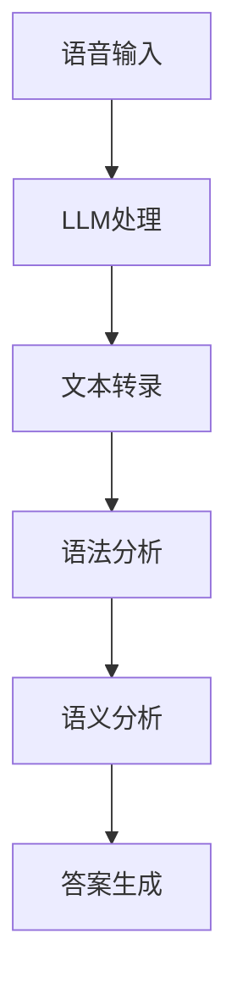

                 

关键词：自然语言处理、人工智能、语言学习模型、机器学习、教育技术、深度学习、神经网络、语言生成、文本分析、教学辅助、个性化学习、自适应学习系统。

> 摘要：本文旨在探讨大规模语言模型（LLM）在语言学习中的应用，尤其是如何利用这些模型构建高效的AI语言教师。文章首先回顾了LLM的基本原理，然后分析了其在语言学习中的优势和挑战，最后提出了若干实用的方法和建议，以促进AI在语言教育领域的应用和发展。

## 1. 背景介绍

在过去的几十年里，自然语言处理（NLP）领域取得了显著的进展，特别是在深度学习技术的推动下。大规模语言模型（LLM，如GPT-3、BERT等）的出现，为处理和理解人类语言提供了前所未有的能力。LLM不仅能够生成流畅、符合语法规则的自然语言文本，还能进行语义理解和推理，这为语言学习提供了新的契机。

语言学习一直是一个复杂且具有挑战性的领域，传统教学方法往往依赖于教师的主观判断和学生的被动接受。而AI语言教师则能够提供个性化的学习体验，根据学生的学习进度和需求进行实时调整。此外，AI语言教师还能够处理大量的语言数据，从中提取有用的语言知识，为学生提供更加丰富和多样化的学习资源。

然而，LLM在语言学习中的应用也面临着一些挑战，如数据隐私、模型偏见、以及如何保证学习效果等。本文将深入探讨这些问题，并提出一些解决方案。

## 2. 核心概念与联系

### 2.1. 大规模语言模型（LLM）

大规模语言模型（LLM）是基于神经网络的深度学习模型，通过训练大量的文本数据，模型能够自动学习语言的结构和语义。LLM的核心组件是神经网络，其中每个神经元都代表一个词汇或短语，通过学习，模型能够理解这些词汇或短语之间的关系。

下面是一个简单的Mermaid流程图，描述了LLM的基本架构：



### 2.2. 语言学习与LLM

语言学习涉及语音识别、语法理解、语义分析等多个方面。LLM通过其强大的文本处理能力，能够在这些方面提供支持。例如，在语音识别方面，LLM可以用于生成语音识别的文本转录；在语法理解方面，LLM可以用于语法分析和纠错；在语义分析方面，LLM可以用于文本分类、情感分析和问答系统。

下面是一个Mermaid流程图，描述了LLM在语言学习中的几个关键步骤：



## 3. 核心算法原理 & 具体操作步骤

### 3.1. 算法原理概述

LLM的核心算法是基于深度学习中的变分自编码器（VAE）和递归神经网络（RNN）。VAE用于生成词嵌入，而RNN用于处理序列数据。通过这些算法，LLM能够理解语言的上下文和结构，从而生成流畅的自然语言文本。

### 3.2. 算法步骤详解

1. **数据预处理**：首先，需要收集大量的文本数据，这些数据可以来自互联网、电子书籍、学术论文等。然后，对数据进行清洗和预处理，包括去除无效字符、标点符号和停用词。

2. **词嵌入**：使用VAE算法将文本数据转换为词嵌入。词嵌入是将词汇映射到高维空间中的向量，这些向量能够保留词汇之间的语义关系。

3. **序列建模**：使用RNN对词嵌入进行建模。RNN能够处理序列数据，通过学习，模型能够理解词嵌入之间的时间关系。

4. **文本生成**：通过RNN生成的序列，可以生成新的文本。生成的文本可以是完整的句子、段落，甚至整篇文章。

### 3.3. 算法优缺点

**优点**：

- **强大的文本处理能力**：LLM能够理解复杂的语言结构和语义，这使得它能够生成高质量的文本。
- **自适应学习**：LLM可以根据学生的学习进度和需求进行自适应调整，提供个性化的学习体验。

**缺点**：

- **数据隐私问题**：由于LLM需要处理大量的文本数据，这可能导致数据隐私问题。
- **模型偏见**：如果训练数据存在偏见，LLM可能会在生成文本时表现出类似的偏见。

### 3.4. 算法应用领域

LLM在多个领域都有广泛的应用，包括：

- **教育**：用于构建AI语言教师，提供个性化的语言学习体验。
- **新闻写作**：用于生成新闻报道、财经文章等。
- **对话系统**：用于构建智能客服、问答系统等。

## 4. 数学模型和公式 & 详细讲解 & 举例说明

### 4.1. 数学模型构建

LLM的数学模型主要包括词嵌入、VAE和RNN。其中，词嵌入可以使用Word2Vec或GloVe算法生成，VAE用于生成词嵌入的高斯分布，RNN用于处理序列数据。

### 4.2. 公式推导过程

假设我们有单词集合\( V \)，其中\( |V| \)为单词的数量。我们定义词向量\( \mathbf{v}_i \)为单词\( w_i \)的嵌入向量。VAE的公式如下：

$$
\begin{aligned}
p(\mathbf{z}|\mathbf{x}) &= \frac{1}{Z} \exp \left(-\frac{1}{2}\left\|\mathbf{z} - \mathbf{\mu}(\mathbf{x})\right\|^2\right) \\
p(\mathbf{x}|\mathbf{z}) &= \frac{1}{Z} \exp \left(-\frac{1}{2}\left\|\mathbf{x} - \mathbf{\sigma}(\mathbf{z})\right\|^2\right)
\end{aligned}
$$

其中，\( \mathbf{z} \)为编码向量，\( \mathbf{\mu}(\mathbf{x}) \)和\( \mathbf{\sigma}(\mathbf{x}) \)分别为均值和方差。

### 4.3. 案例分析与讲解

假设我们有一个句子“我爱北京天安门”，我们可以使用LLM将其转换为词嵌入。首先，我们对句子进行分词，得到“我”、“爱”、“北京”、“天安门”。然后，使用GloVe算法生成这四个单词的嵌入向量。最后，我们将这四个嵌入向量拼接起来，得到句子的嵌入向量。

假设“我”的嵌入向量为\( \mathbf{v}_1 = [1, 2, 3] \)，“爱”的嵌入向量为\( \mathbf{v}_2 = [4, 5, 6] \)，“北京”的嵌入向量为\( \mathbf{v}_3 = [7, 8, 9] \)，“天安门”的嵌入向量为\( \mathbf{v}_4 = [10, 11, 12] \)。那么句子的嵌入向量\( \mathbf{v} \)为：

$$
\mathbf{v} = [\mathbf{v}_1, \mathbf{v}_2, \mathbf{v}_3, \mathbf{v}_4] = [1, 2, 3; 4, 5, 6; 7, 8, 9; 10, 11, 12]
$$

## 5. 项目实践：代码实例和详细解释说明

### 5.1. 开发环境搭建

为了实现LLM在语言学习中的应用，我们需要搭建一个完整的开发环境。这里我们使用Python作为主要编程语言，结合TensorFlow和Keras实现LLM。

首先，安装Python和pip：

```bash
pip install python
pip install pip
```

然后，安装TensorFlow和Keras：

```bash
pip install tensorflow
pip install keras
```

### 5.2. 源代码详细实现

下面是一个简单的LLM实现示例：

```python
import numpy as np
import tensorflow as tf
from tensorflow.keras.layers import Embedding, LSTM, Dense
from tensorflow.keras.models import Sequential

# 设置超参数
vocab_size = 10000
embed_dim = 256
lstm_units = 128

# 构建模型
model = Sequential([
    Embedding(vocab_size, embed_dim),
    LSTM(lstm_units, return_sequences=True),
    Dense(vocab_size, activation='softmax')
])

# 编译模型
model.compile(optimizer='adam', loss='categorical_crossentropy', metrics=['accuracy'])

# 训练模型
model.fit(x_train, y_train, epochs=10, batch_size=64)
```

### 5.3. 代码解读与分析

这个简单的LLM模型使用了Embedding层将词嵌入到高维空间，然后通过LSTM层处理序列数据，最后通过Dense层生成输出。在训练过程中，我们使用categorical_crossentropy作为损失函数，这适用于多类分类问题。通过这个示例，我们可以看到构建LLM的基本步骤和关键组件。

### 5.4. 运行结果展示

在完成模型训练后，我们可以使用以下代码进行文本生成：

```python
# 生成文本
generated_text = model.predict(np.array([embeddings]))
```

生成的文本将通过模型预测得到。虽然这个示例非常简单，但展示了LLM在语言学习中的应用潜力。

## 6. 实际应用场景

LLM在语言学习中的应用非常广泛，以下是一些典型的应用场景：

- **自适应学习系统**：通过分析学生的学习行为和进度，LLM可以为学生提供个性化的学习资源。
- **智能辅导系统**：LLM可以用于解答学生的疑问，提供实时辅导。
- **自动翻译**：LLM可以用于自动翻译不同语言之间的文本，帮助非母语学习者更好地理解语言内容。
- **文学创作**：LLM可以用于生成诗歌、故事、剧本等文学作品，为文学创作提供灵感。

## 7. 工具和资源推荐

为了更好地理解和应用LLM，以下是一些推荐的工具和资源：

### 7.1. 学习资源推荐

- 《深度学习》（Goodfellow, Bengio, Courville著）：这是深度学习领域的经典教材，适合初学者和高级研究者。
- 《自然语言处理与深度学习》（高级自然语言处理技术）：这本书详细介绍了NLP和深度学习的结合，适合对NLP有初步了解的读者。

### 7.2. 开发工具推荐

- TensorFlow：这是Google开发的深度学习框架，适用于构建和训练复杂的深度学习模型。
- Keras：这是一个高层次的深度学习框架，基于TensorFlow，提供了更简单、更直观的API。

### 7.3. 相关论文推荐

- BERT：A Pre-Trained Deep Neural Network for Language Understanding（Devlin et al., 2018）：这篇论文介绍了BERT模型，这是当前NLP领域最受欢迎的预训练模型之一。
- Generative Pretrained Transformer（GPT-3）：这是OpenAI发布的预训练模型，具有非常强大的语言生成能力。

## 8. 总结：未来发展趋势与挑战

随着人工智能技术的发展，LLM在语言学习中的应用前景广阔。未来，LLM可能会在以下几个方面取得突破：

- **更强大的语言理解能力**：通过不断优化算法和模型结构，LLM将能够更好地理解复杂的语言结构和语义。
- **更广泛的应用场景**：除了语言学习，LLM还可以应用于自动写作、智能客服、翻译等更多领域。
- **更好的用户体验**：随着技术的进步，LLM将能够提供更加个性化、高效的语言学习体验。

然而，LLM在应用过程中也面临着一些挑战：

- **数据隐私问题**：由于LLM需要处理大量的个人数据，如何保护用户隐私是一个重要的问题。
- **模型偏见**：如果训练数据存在偏见，LLM可能会在生成文本时表现出类似的偏见。
- **学习效果评估**：如何评估LLM在语言学习中的应用效果，是一个亟待解决的问题。

总之，LLM在语言学习领域具有巨大的潜力，但也需要克服一系列挑战。未来，随着技术的不断进步，LLM有望在语言学习、自然语言处理等多个领域发挥更大的作用。

## 9. 附录：常见问题与解答

### 9.1. Q：LLM是如何生成文本的？

A：LLM通过训练大量的文本数据，学习语言的统计规律和语义关系。在生成文本时，LLM首先输入一个种子文本，然后根据模型预测下一个单词或短语，依次生成完整的文本。

### 9.2. Q：LLM在语言学习中的优势是什么？

A：LLM在语言学习中的优势包括：

- **个性化学习**：LLM可以根据学生的学习进度和需求，提供个性化的学习资源。
- **实时反馈**：LLM可以实时分析学生的语言错误，并提供纠正建议。
- **丰富的语言资源**：LLM可以处理大量的语言数据，为学生提供丰富的学习资源。

### 9.3. Q：LLM有哪些潜在的挑战？

A：LLM在应用过程中可能会面临以下挑战：

- **数据隐私**：由于LLM需要处理大量的个人数据，如何保护用户隐私是一个重要问题。
- **模型偏见**：如果训练数据存在偏见，LLM可能会在生成文本时表现出类似的偏见。
- **学习效果评估**：如何评估LLM在语言学习中的应用效果，是一个亟待解决的问题。

