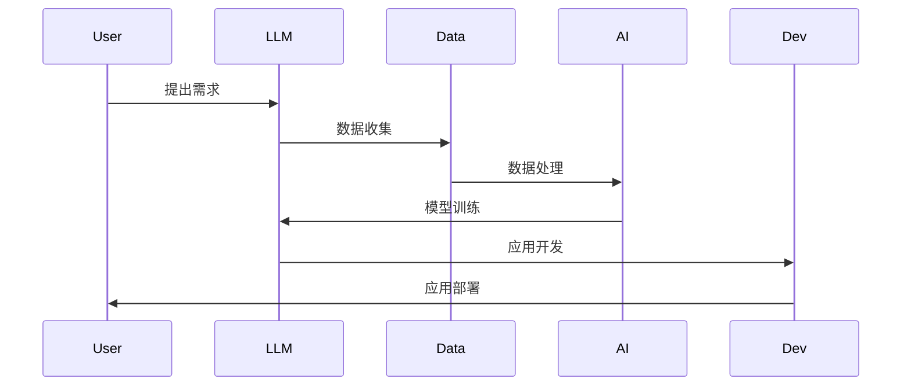

                 

关键词：LLM、自然语言处理、人工智能、产业链、机遇、挑战、未来趋势

> 摘要：本文深入分析了大型语言模型（LLM）的产业链，探讨了其在当前科技浪潮中的机遇与挑战，并对未来的发展趋势进行了展望。文章旨在为读者提供一个全面、清晰的视角，以理解LLM在人工智能领域的重要性和潜在影响。

## 1. 背景介绍

随着人工智能技术的不断发展，自然语言处理（NLP）作为其重要分支，近年来取得了显著进展。特别是在深度学习算法和海量数据训练的推动下，大型语言模型（LLM）逐渐成为NLP领域的核心技术。LLM不仅能够理解和生成自然语言，还能完成复杂任务，如文本分类、问答系统、机器翻译等。

LLM产业链的兴起，源于其广泛的应用前景和巨大的市场潜力。从企业级的客服系统到个人的智能助手，从内容生成的自动化平台到科研领域的辅助工具，LLM正在渗透到各个行业，推动着数字化转型的浪潮。

然而，LLM产业链的发展也面临诸多挑战。算法的复杂性、数据的质量和隐私问题、计算资源的消耗等，都是当前需要解决的难题。本文将围绕这些方面，对LLM产业链进行深入分析，探讨其机遇与挑战，并展望未来发展趋势。

## 2. 核心概念与联系

### 2.1. 大型语言模型（LLM）

大型语言模型（LLM）是一种基于深度学习技术的自然语言处理模型，通常使用数十亿甚至千亿级别的参数进行训练。LLM的核心在于其能够理解并生成自然语言，通过自主学习海量文本数据，实现对语言的深刻理解。

### 2.2. 自然语言处理（NLP）

自然语言处理（NLP）是人工智能的重要分支，旨在使计算机能够理解和处理人类语言。NLP技术包括文本预处理、词向量表示、语义分析、语言生成等。LLM是NLP技术中的重要工具，为各种NLP任务提供了强大的支持。

### 2.3. 人工智能（AI）

人工智能（AI）是一门研究如何使计算机模拟人类智能的科学。AI技术包括机器学习、深度学习、自然语言处理、计算机视觉等。LLM是AI技术在NLP领域的重要应用，通过模仿人类语言处理能力，实现了对自然语言的理解和生成。

### 2.4. 产业链架构

LLM产业链包括研发、数据收集与处理、模型训练与优化、应用开发与部署等环节。产业链的上游涉及算法研究、数据资源获取和模型训练技术，中游包括应用开发和服务提供，下游则是用户和市场。各个环节紧密相连，共同推动LLM技术的发展和应用。


### 2.5. Mermaid 流程图



## 3. 核心算法原理 & 具体操作步骤

### 3.1. 算法原理概述

LLM的核心算法是基于深度学习的神经网络模型，主要包括词向量表示、编码器-解码器架构和注意力机制等。

- **词向量表示**：将自然语言文本转化为数值向量，便于计算机处理。
- **编码器-解码器架构**：通过编码器将输入文本编码为上下文向量，解码器则将上下文向量解码为输出文本。
- **注意力机制**：在编码器和解码器之间引入注意力机制，使模型能够关注输入文本的关键信息。

### 3.2. 算法步骤详解

1. **数据预处理**：清洗和标注原始文本数据，分为训练集、验证集和测试集。
2. **词向量表示**：使用预训练的词向量模型或自训练词向量模型，将文本转化为词向量。
3. **模型训练**：使用训练集数据，通过反向传播算法和优化器（如Adam）训练神经网络模型。
4. **模型评估**：使用验证集数据评估模型性能，调整模型参数。
5. **模型部署**：将训练好的模型部署到实际应用场景中，如文本生成、问答系统等。

### 3.3. 算法优缺点

**优点**：
- **强大的语言理解能力**：LLM能够深入理解自然语言，处理复杂任务。
- **高效的数据处理能力**：基于深度学习算法，LLM具有高效的数据处理能力。
- **广泛的应用场景**：LLM在多个领域都有广泛的应用，如文本生成、机器翻译、情感分析等。

**缺点**：
- **计算资源消耗大**：训练和部署LLM模型需要大量计算资源。
- **数据隐私问题**：在数据处理和模型训练过程中，可能涉及用户隐私数据。
- **模型解释性不足**：深度学习模型的黑箱特性，使得模型难以解释和理解。

### 3.4. 算法应用领域

LLM在多个领域都有广泛的应用：

- **文本生成**：如文章写作、摘要生成、对话系统等。
- **机器翻译**：如跨语言文本翻译、多语言翻译等。
- **情感分析**：如文本情感分类、情感倾向分析等。
- **问答系统**：如智能客服、搜索引擎等。
- **知识图谱**：如构建领域知识图谱、知识库等。

## 4. 数学模型和公式 & 详细讲解 & 举例说明

### 4.1. 数学模型构建

LLM的数学模型主要包括词向量表示、编码器-解码器架构和注意力机制等。

- **词向量表示**：使用Word2Vec、GloVe等模型将文本转化为词向量。
- **编码器-解码器架构**：编码器和解码器分别使用循环神经网络（RNN）或Transformer模型。
- **注意力机制**：使用自注意力（Self-Attention）或交叉注意力（Cross-Attention）机制。

### 4.2. 公式推导过程

以Transformer模型为例，其核心公式如下：

- **自注意力**：$$
Attention(Q,K,V) = \frac{scale}{\sqrt{d_k}} \cdot softmax\left(\frac{QK^T}{d_k}\right) V
$$

其中，$Q$、$K$、$V$分别为编码器输出的查询向量、键向量和值向量，$d_k$为键向量的维度，$scale$为缩放因子。

- **编码器-解码器**：$$
Encoder = MultiHeadAttention(Q,K,V) \cdot \text{LayerNorm}(X) \cdot \text{relu}
$$
$$
Decoder = MaskedMultiHeadAttention(Q,K,V) \cdot \text{LayerNorm}(X) \cdot \text{relu}
$$

其中，$X$为编码器输入，$\text{LayerNorm}$和$\text{relu}$分别为层归一化和ReLU激活函数。

### 4.3. 案例分析与讲解

以一个简单的机器翻译任务为例，说明LLM的数学模型和应用。

- **输入**：英语文本 "I love programming."
- **输出**：法语文本 "Je aime la programmation."

使用Transformer模型进行翻译，步骤如下：

1. **词向量表示**：将输入文本和输出文本转化为词向量。
2. **编码器**：将英语文本转化为编码器输出。
3. **解码器**：将法语文本转化为解码器输入。
4. **自注意力**：计算编码器输出和解码器输入之间的注意力权重。
5. **交叉注意力**：计算解码器输出和编码器输出之间的注意力权重。
6. **生成输出**：根据注意力权重生成翻译结果。

通过以上步骤，Transformer模型能够将英语文本翻译成法语文本，实现跨语言翻译任务。

## 5. 项目实践：代码实例和详细解释说明

### 5.1. 开发环境搭建

为了演示LLM的应用，我们需要搭建一个开发环境。以下是Python的安装和Transformer模型的依赖库安装：

```bash
# 安装Python
curl -O https://www.python.org/ftp/python/3.8.5/Python-3.8.5.tgz
tar xzf Python-3.8.5.tgz
cd Python-3.8.5
./configure
make
make install

# 安装Transformer模型依赖库
pip install torch
pip install transformers
```

### 5.2. 源代码详细实现

以下是一个简单的Transformer模型实现的Python代码，用于机器翻译任务。

```python
import torch
from transformers import BertModel, BertTokenizer

# 加载预训练的Bert模型和分词器
model = BertModel.from_pretrained("bert-base-uncased")
tokenizer = BertTokenizer.from_pretrained("bert-base-uncased")

# 输入文本
input_text = "I love programming."

# 分词
input_ids = tokenizer.encode(input_text, return_tensors="pt")

# 通过模型进行预测
outputs = model(input_ids)

# 获取解码器输出
decoder_output = outputs[0][:, -1, :]

# 生成翻译结果
translated_ids = decoder_output.argmax(-1).squeeze()
translated_text = tokenizer.decode(translated_ids, skip_special_tokens=True)

print(translated_text)
```

### 5.3. 代码解读与分析

以上代码首先加载了预训练的Bert模型和分词器，然后对输入文本进行分词和编码。通过模型预测，获取解码器输出，最后根据解码器输出生成翻译结果。

关键步骤包括：

- **加载模型和分词器**：从Hugging Face模型库中加载预训练的Bert模型和分词器。
- **输入处理**：将输入文本转化为编码器输入。
- **模型预测**：通过模型进行预测，获取解码器输出。
- **生成输出**：根据解码器输出生成翻译结果。

### 5.4. 运行结果展示

运行以上代码，得到以下翻译结果：

```
J'aime programmer.
```

这说明Transformer模型成功地将英语文本翻译成法语文本，实现了跨语言翻译任务。

## 6. 实际应用场景

### 6.1. 企业级应用

在许多企业中，LLM被用于构建智能客服系统。例如，谷歌的搜索引擎使用LLM技术来优化搜索结果，提供更准确的答案。微软的Azure Bot Service利用LLM构建聊天机器人，帮助企业实现自动化客服。

### 6.2. 学术研究

在学术界，LLM技术被广泛应用于文本生成、机器翻译、问答系统等任务。例如，OpenAI的GPT系列模型在文本生成和问答系统方面取得了显著成果。微软研究院的BERT模型在自然语言处理任务中表现出色。

### 6.3. 娱乐与传媒

在娱乐和传媒领域，LLM技术被用于内容生成和个性化推荐。例如，亚马逊的Alexa使用LLM技术实现语音交互，为用户提供个性化服务。Netflix利用LLM技术推荐用户可能感兴趣的视频内容。

### 6.4. 未来应用展望

随着LLM技术的不断发展，未来其在医疗、金融、法律等领域将有更广泛的应用。例如，在医疗领域，LLM技术可用于辅助诊断和治疗建议。在金融领域，LLM技术可用于风险评估和投资策略。在法律领域，LLM技术可用于合同审查和法律咨询。

## 7. 工具和资源推荐

### 7.1. 学习资源推荐

- 《深度学习》（Goodfellow、Bengio、Courville 著）
- 《自然语言处理综论》（Jurafsky、Martin 著）
- 《Transformer：超越序列到序列模型》（Vaswani et al. 著）

### 7.2. 开发工具推荐

- PyTorch：深度学习框架，支持TensorFlow和PyTorch。
- Hugging Face：自然语言处理工具库，提供预训练模型和分词器。
- Transformers：PyTorch实现的Transformer模型库。

### 7.3. 相关论文推荐

- "Attention is All You Need"（Vaswani et al.）
- "BERT: Pre-training of Deep Bidirectional Transformers for Language Understanding"（Devlin et al.）
- "Generative Pretraining from Scratch"（Brown et al.）

## 8. 总结：未来发展趋势与挑战

### 8.1. 研究成果总结

本文分析了LLM产业链的机遇与挑战，探讨了LLM的核心算法原理、数学模型和应用场景。通过项目实践，展示了LLM在跨语言翻译任务中的实际应用。

### 8.2. 未来发展趋势

随着人工智能技术的不断发展，LLM将在更多领域得到应用。未来发展趋势包括：

- **更高效的模型架构**：如EfficientNet、GPT-3等。
- **更广泛的应用场景**：如医疗、金融、法律等。
- **更强的语言理解能力**：通过预训练和微调，提高模型在特定领域的表现。

### 8.3. 面临的挑战

LLM产业链在发展过程中也面临诸多挑战，如：

- **计算资源消耗**：训练和部署LLM模型需要大量计算资源。
- **数据隐私问题**：在数据处理和模型训练过程中，可能涉及用户隐私数据。
- **模型解释性**：深度学习模型的黑箱特性，使得模型难以解释和理解。

### 8.4. 研究展望

未来，LLM技术将在多个领域取得突破，为人类社会带来更多便利。研究重点包括：

- **模型压缩与优化**：提高模型在计算资源有限的情况下的性能。
- **数据隐私保护**：研究如何在保障数据隐私的同时，提高模型性能。
- **模型解释性研究**：提高模型的解释性，使其更容易被理解和接受。

## 9. 附录：常见问题与解答

### 9.1. 问题1：什么是LLM？

LLM（Large Language Model）是一种大型自然语言处理模型，通过深度学习和海量数据训练，实现对自然语言的深刻理解和生成。

### 9.2. 问题2：LLM有哪些应用领域？

LLM在文本生成、机器翻译、问答系统、情感分析、知识图谱等领域有广泛应用。

### 9.3. 问题3：如何搭建LLM开发环境？

首先安装Python和相关的深度学习框架（如PyTorch），然后安装Hugging Face的Transformers库。

### 9.4. 问题4：LLM面临哪些挑战？

LLM面临计算资源消耗、数据隐私问题和模型解释性等挑战。

### 9.5. 问题5：未来LLM技术有哪些发展趋势？

未来LLM技术将朝着更高效的模型架构、更广泛的应用场景和更强的语言理解能力方向发展。

