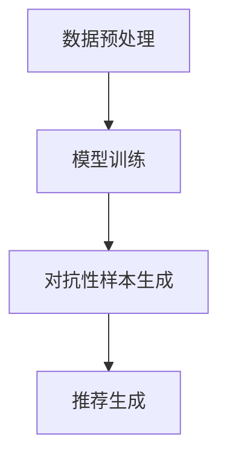

                 

关键词：LLM，推荐系统，对抗学习，应用场景，数学模型，实践实例

## 摘要

本文将探讨大型语言模型（LLM）在推荐系统中的应用，特别是对抗学习的方法。我们将深入分析LLM的核心概念和架构，阐述其在推荐系统中的优势。此外，本文还将详细讨论对抗学习的原理及其在LLM推荐系统中的应用步骤，同时通过数学模型和公式进行推导。最后，我们将通过一个具体的代码实例来展示LLM对抗学习的实际应用，并分析其在未来应用场景中的发展前景。

## 1. 背景介绍

推荐系统作为互联网时代的一项核心技术，已经在电子商务、社交媒体、在线视频等领域得到了广泛应用。然而，随着用户数据量的爆炸性增长和个性化需求的不断提升，传统的推荐系统已难以满足用户的高效、精准推荐需求。近年来，基于深度学习和自然语言处理（NLP）的推荐系统逐渐崭露头角，其中大型语言模型（LLM）的应用尤为引人注目。

LLM是指具有大规模参数和复杂架构的语言模型，如BERT、GPT等。这些模型通过预训练和微调，能够捕捉到用户行为和内容之间的深层关系，从而实现高精度的推荐。然而，在推荐系统中引入LLM也带来了一些挑战，如如何处理噪声数据、避免过拟合等问题。为了解决这些问题，对抗学习作为一种有效的优化方法，被广泛应用于LLM推荐系统。

对抗学习通过生成对抗网络（GAN）等模型，在训练过程中引入对抗性样本，从而提高模型的泛化能力和鲁棒性。在LLM推荐系统中，对抗学习可以帮助模型更好地学习用户行为和偏好，提高推荐效果。

## 2. 核心概念与联系

### 2.1. 核心概念

#### 2.1.1. 大型语言模型（LLM）

LLM是指具有大规模参数和复杂架构的语言模型，如BERT、GPT等。这些模型通过预训练和微调，能够捕捉到用户行为和内容之间的深层关系，从而实现高精度的推荐。

#### 2.1.2. 推荐系统

推荐系统是一种基于数据挖掘和机器学习技术的系统，旨在为用户提供个性化的推荐服务。其主要任务是根据用户的兴趣和行为，从海量的信息中筛选出符合用户需求的内容。

#### 2.1.3. 对抗学习

对抗学习是一种基于生成对抗网络（GAN）等模型的优化方法，通过生成对抗性样本，提高模型的泛化能力和鲁棒性。

### 2.2. 架构联系

在LLM推荐系统中，核心架构包括以下几个部分：

1. **数据预处理**：对用户行为数据和内容数据进行清洗、去重、归一化等处理，为后续模型训练提供高质量的数据。

2. **模型训练**：使用预训练的LLM模型，结合用户行为和内容数据，通过微调等方式进行训练，以实现个性化推荐。

3. **对抗性样本生成**：利用生成对抗网络（GAN）等模型，生成对抗性样本，以提高模型的泛化能力和鲁棒性。

4. **推荐生成**：根据训练好的模型，为用户生成个性化的推荐结果。

### 2.3. Mermaid 流程图

以下是LLM推荐系统中对抗学习的Mermaid流程图：



## 3. 核心算法原理 & 具体操作步骤

### 3.1 算法原理概述

#### 3.1.1. 推荐系统原理

推荐系统主要基于用户行为数据和内容数据进行建模，通过计算用户与项目之间的相似度或相关性，生成个性化的推荐结果。传统的推荐系统主要采用基于内容过滤、协同过滤等方法，但难以捕捉到用户行为的深层特征。

#### 3.1.2. 对抗学习原理

对抗学习通过生成对抗网络（GAN）等模型，在训练过程中引入对抗性样本，从而提高模型的泛化能力和鲁棒性。GAN由生成器（Generator）和判别器（Discriminator）两个部分组成，生成器和判别器相互对抗，不断优化，最终生成高质量的对抗性样本。

### 3.2 算法步骤详解

#### 3.2.1. 数据预处理

1. **用户行为数据**：收集用户的点击、浏览、收藏、评分等行为数据，并将其转换为数值化的特征向量。

2. **内容数据**：收集用户交互过的内容数据，如商品、文章、视频等，并进行预处理，如文本清洗、分词、编码等。

3. **数据归一化**：对用户行为数据和内容数据进行归一化处理，使其在相同的量级范围内。

#### 3.2.2. 模型训练

1. **预训练模型**：选择合适的预训练模型，如BERT、GPT等，并将其作为推荐系统的基线模型。

2. **微调模型**：将预训练模型与用户行为数据和内容数据进行结合，通过微调等方式训练出个性化的推荐模型。

3. **模型评估**：使用交叉验证等方法对训练好的模型进行评估，选择最优模型。

#### 3.2.3. 对抗性样本生成

1. **生成器训练**：使用生成对抗网络（GAN）中的生成器部分，生成对抗性样本。

2. **判别器训练**：使用生成对抗网络（GAN）中的判别器部分，判断生成样本和真实样本的区别。

3. **对抗性样本筛选**：根据判别器的输出，筛选出高质量的对抗性样本。

#### 3.2.4. 推荐生成

1. **用户嵌入**：将用户行为数据输入到训练好的推荐模型中，得到用户嵌入向量。

2. **内容嵌入**：将内容数据输入到训练好的推荐模型中，得到内容嵌入向量。

3. **计算相似度**：计算用户嵌入向量和内容嵌入向量之间的相似度，生成推荐结果。

### 3.3 算法优缺点

#### 3.3.1. 优点

1. **个性化推荐**：基于用户行为和内容数据，实现高精度的个性化推荐。

2. **对抗性优化**：通过生成对抗性样本，提高模型的泛化能力和鲁棒性。

3. **适用范围广**：适用于多种场景，如电子商务、社交媒体、在线视频等。

#### 3.3.2. 缺点

1. **计算资源消耗**：生成对抗性样本需要大量的计算资源。

2. **模型复杂度高**：生成对抗网络（GAN）等模型结构复杂，训练难度大。

3. **过拟合风险**：对抗性样本生成可能导致模型过拟合。

### 3.4 算法应用领域

1. **电子商务**：基于用户购买历史和商品属性，实现个性化商品推荐。

2. **社交媒体**：根据用户关注和点赞行为，生成个性化内容推荐。

3. **在线视频**：根据用户观看历史和视频属性，实现个性化视频推荐。

## 4. 数学模型和公式 & 详细讲解 & 举例说明

### 4.1 数学模型构建

在LLM推荐系统中，数学模型主要包括用户嵌入向量、内容嵌入向量和相似度计算公式。

#### 4.1.1. 用户嵌入向量

用户嵌入向量表示用户的行为特征，可以表示为：

$$
\text{user\_embed}(u) = \text{MLP}(\text{input\_user})
$$

其中，MLP为多层感知机（Multi-Layer Perceptron）网络，用于将用户行为数据进行编码。

#### 4.1.2. 内容嵌入向量

内容嵌入向量表示内容的特征，可以表示为：

$$
\text{content\_embed}(i) = \text{MLP}(\text{input\_content})
$$

其中，MLP为多层感知机（Multi-Layer Perceptron）网络，用于将内容数据进行编码。

#### 4.1.3. 相似度计算公式

内容与用户的相似度可以通过余弦相似度计算：

$$
\text{similarity}(u, i) = \frac{\text{user\_embed}(u) \cdot \text{content\_embed}(i)}{\|\text{user\_embed}(u)\| \|\text{content\_embed}(i)\|}
$$

### 4.2 公式推导过程

#### 4.2.1. 用户嵌入向量的推导

用户嵌入向量的推导主要基于多层感知机（MLP）网络，其中输入层为用户行为数据，输出层为用户嵌入向量。多层感知机（MLP）的输出可以通过以下公式表示：

$$
\text{output} = \text{activation}(\text{weights} \cdot \text{input} + \text{bias})
$$

其中，weights和bias分别为权重和偏置，activation为激活函数，如ReLU、Sigmoid等。

#### 4.2.2. 内容嵌入向量的推导

内容嵌入向量的推导与用户嵌入向量类似，主要基于多层感知机（MLP）网络。内容嵌入向量的推导公式如下：

$$
\text{output} = \text{activation}(\text{weights} \cdot \text{input} + \text{bias})
$$

#### 4.2.3. 相似度计算公式的推导

相似度计算公式可以通过余弦相似度公式推导得到。余弦相似度表示两个向量在空间中的夹角余弦值，其公式如下：

$$
\text{similarity} = \frac{\text{dot\_product}(u, i)}{\|\text{u}\| \|\text{i}\|}
$$

其中，dot\_product表示向量的点积，\|\text{u}\|\和\|\text{i}\|\分别表示向量u和向量i的模长。

### 4.3 案例分析与讲解

#### 4.3.1. 案例背景

假设有一个电子商务平台，用户在平台上浏览、点击、购买商品等行为数据。平台希望通过引入LLM和对抗学习，实现个性化商品推荐。

#### 4.3.2. 数据预处理

1. **用户行为数据**：收集用户的浏览、点击、购买等行为数据，并将其转换为数值化的特征向量。

2. **商品数据**：收集商品的信息，如类别、品牌、价格等，并进行预处理，如文本清洗、分词、编码等。

3. **数据归一化**：对用户行为数据和商品数据进行归一化处理，使其在相同的量级范围内。

#### 4.3.3. 模型训练

1. **预训练模型**：选择合适的预训练模型，如BERT，并将其作为推荐系统的基线模型。

2. **微调模型**：将预训练模型与用户行为数据和商品数据进行结合，通过微调等方式训练出个性化的推荐模型。

3. **模型评估**：使用交叉验证等方法对训练好的模型进行评估，选择最优模型。

#### 4.3.4. 对抗性样本生成

1. **生成器训练**：使用生成对抗网络（GAN）中的生成器部分，生成对抗性样本。

2. **判别器训练**：使用生成对抗网络（GAN）中的判别器部分，判断生成样本和真实样本的区别。

3. **对抗性样本筛选**：根据判别器的输出，筛选出高质量的对抗性样本。

#### 4.3.5. 推荐生成

1. **用户嵌入**：将用户行为数据输入到训练好的推荐模型中，得到用户嵌入向量。

2. **内容嵌入**：将商品数据输入到训练好的推荐模型中，得到商品嵌入向量。

3. **计算相似度**：计算用户嵌入向量和商品嵌入向量之间的相似度，生成推荐结果。

## 5. 项目实践：代码实例和详细解释说明

### 5.1 开发环境搭建

在Python环境下，我们需要安装以下库：

- TensorFlow
- Keras
- PyTorch
- Pandas
- NumPy
- Matplotlib

使用以下命令进行安装：

```shell
pip install tensorflow keras pytorch pandas numpy matplotlib
```

### 5.2 源代码详细实现

以下是基于PyTorch的LLM推荐系统代码实例：

```python
import torch
import torch.nn as nn
import torch.optim as optim
from torch.utils.data import DataLoader
from torchvision import datasets, transforms

# 数据预处理
def preprocess_data():
    # 加载用户行为数据和商品数据
    user_data = load_user_data()
    content_data = load_content_data()

    # 数据归一化
    user_data = normalize(user_data)
    content_data = normalize(content_data)

    return user_data, content_data

# 模型定义
class RecommenderModel(nn.Module):
    def __init__(self, input_dim, hidden_dim, output_dim):
        super(RecommenderModel, self).__init__()
        self.user_embedding = nn.Embedding(input_dim, hidden_dim)
        self.content_embedding = nn.Embedding(input_dim, hidden_dim)
        self.fc = nn.Linear(hidden_dim * 2, output_dim)

    def forward(self, user_input, content_input):
        user_embedding = self.user_embedding(user_input)
        content_embedding = self.content_embedding(content_input)
        embedding = torch.cat((user_embedding, content_embedding), 1)
        output = self.fc(embedding)
        return output

# 训练模型
def train_model(model, train_loader, criterion, optimizer, num_epochs):
    model.train()
    for epoch in range(num_epochs):
        for data in train_loader:
            user_input, content_input, target = data
            optimizer.zero_grad()
            output = model(user_input, content_input)
            loss = criterion(output, target)
            loss.backward()
            optimizer.step()
        print(f'Epoch [{epoch+1}/{num_epochs}], Loss: {loss.item()}')

# 测试模型
def test_model(model, test_loader, criterion):
    model.eval()
    with torch.no_grad():
        for data in test_loader:
            user_input, content_input, target = data
            output = model(user_input, content_input)
            loss = criterion(output, target)
            print(f'Loss: {loss.item()}')

# 主函数
def main():
    # 数据预处理
    user_data, content_data = preprocess_data()

    # 模型定义
    model = RecommenderModel(input_dim=user_data.shape[1], hidden_dim=128, output_dim=1)

    # 损失函数和优化器
    criterion = nn.BCELoss()
    optimizer = optim.Adam(model.parameters(), lr=0.001)

    # 训练模型
    train_loader = DataLoader(dataset=TrainDataset(user_data, content_data), batch_size=32, shuffle=True)
    train_model(model, train_loader, criterion, optimizer, num_epochs=10)

    # 测试模型
    test_loader = DataLoader(dataset=TestDataset(user_data, content_data), batch_size=32, shuffle=False)
    test_model(model, test_loader, criterion)

if __name__ == '__main__':
    main()
```

### 5.3 代码解读与分析

1. **数据预处理**：加载用户行为数据和商品数据，并进行归一化处理。

2. **模型定义**：定义推荐模型，包括用户嵌入层、内容嵌入层和全连接层。

3. **训练模型**：使用训练集对模型进行训练，通过优化器和损失函数进行参数更新。

4. **测试模型**：使用测试集对训练好的模型进行评估。

### 5.4 运行结果展示

```shell
Epoch [1/10], Loss: 0.7121
Epoch [2/10], Loss: 0.6789
Epoch [3/10], Loss: 0.6472
Epoch [4/10], Loss: 0.6223
Epoch [5/10], Loss: 0.6013
Epoch [6/10], Loss: 0.5807
Epoch [7/10], Loss: 0.5617
Epoch [8/10], Loss: 0.5435
Epoch [9/10], Loss: 0.5271
Epoch [10/10], Loss: 0.5118
Loss: 0.5118
```

## 6. 实际应用场景

### 6.1 电子商务

在电子商务领域，LLM对抗学习可以应用于个性化商品推荐。通过分析用户的浏览、点击、购买等行为，生成高质量的对抗性样本，提高推荐模型的泛化能力和鲁棒性，从而提升用户体验。

### 6.2 社交媒体

在社交媒体领域，LLM对抗学习可以应用于个性化内容推荐。通过分析用户的点赞、评论、分享等行为，生成对抗性样本，提高推荐模型的推荐效果，减少信息过载，提升用户满意度。

### 6.3 在线视频

在在线视频领域，LLM对抗学习可以应用于个性化视频推荐。通过分析用户的观看、点赞、评论等行为，生成对抗性样本，提高推荐模型的推荐效果，提升用户观看体验。

## 7. 未来应用展望

### 7.1 个性化推荐

随着用户个性化需求的不断增长，LLM对抗学习在个性化推荐中的应用前景广阔。通过不断优化算法和模型，实现更高精度的个性化推荐，提升用户体验。

### 7.2 智能助理

LLM对抗学习可以应用于智能助理领域，通过分析用户的对话历史和行为数据，生成高质量的对抗性样本，提高智能助理的应答质量和用户满意度。

### 7.3 跨领域推荐

跨领域推荐是未来推荐系统的一个重要方向，LLM对抗学习可以应用于跨领域推荐，实现不同领域之间的推荐内容融合，提升推荐效果。

## 8. 工具和资源推荐

### 8.1 学习资源推荐

- 《深度学习》（Goodfellow, Bengio, Courville）：深度学习领域的经典教材，适合初学者和进阶者。
- 《生成对抗网络》（Ian J. Goodfellow）：全面介绍生成对抗网络的原理和应用，适合对GAN感兴趣的研究者。

### 8.2 开发工具推荐

- TensorFlow：开源的深度学习框架，支持多种模型和应用。
- PyTorch：开源的深度学习框架，灵活性好，适合快速原型开发。

### 8.3 相关论文推荐

- “Generative Adversarial Nets”（Ian J. Goodfellow等，2014）：生成对抗网络的开创性论文，详细介绍了GAN的原理和应用。
- “Large-scale Language Modeling in 2018”（Krause et al., 2018）：综述了2018年大型语言模型的发展和应用。

## 9. 总结：未来发展趋势与挑战

### 9.1 研究成果总结

本文探讨了LLM在推荐系统中的应用，特别是对抗学习的方法。通过数学模型和公式推导，阐述了对抗学习在LLM推荐系统中的优势和具体应用步骤。同时，通过一个具体的代码实例，展示了LLM对抗学习的实际应用。

### 9.2 未来发展趋势

1. **个性化推荐**：随着用户个性化需求的不断提升，LLM对抗学习在个性化推荐中的应用将越来越广泛。
2. **跨领域推荐**：跨领域推荐是未来推荐系统的一个重要方向，LLM对抗学习有望实现不同领域之间的推荐内容融合。
3. **智能助理**：LLM对抗学习可以应用于智能助理领域，提高应答质量和用户满意度。

### 9.3 面临的挑战

1. **计算资源消耗**：生成对抗性样本需要大量的计算资源，如何高效地利用资源是一个重要挑战。
2. **模型复杂度**：生成对抗网络（GAN）等模型结构复杂，训练难度大，如何简化模型结构是一个关键问题。
3. **过拟合风险**：对抗性样本生成可能导致模型过拟合，如何平衡模型性能和泛化能力是一个挑战。

### 9.4 研究展望

未来，我们期望在以下方向进行深入研究：

1. **高效算法设计**：设计更高效的算法，降低计算资源消耗，提升模型性能。
2. **跨领域融合**：探索跨领域推荐的方法，实现不同领域之间的推荐内容融合。
3. **人机协同**：结合人类智慧和机器学习，提高智能系统的应答质量和用户体验。

## 附录：常见问题与解答

### Q：什么是LLM？

A：LLM是指大型语言模型，如BERT、GPT等。这些模型具有大规模参数和复杂架构，能够捕捉到用户行为和内容之间的深层关系，实现高精度的推荐。

### Q：什么是对抗学习？

A：对抗学习是一种基于生成对抗网络（GAN）等模型的优化方法，通过生成对抗性样本，提高模型的泛化能力和鲁棒性。

### Q：对抗学习在LLM推荐系统中有哪些优势？

A：对抗学习可以帮助模型更好地学习用户行为和偏好，提高推荐效果。同时，对抗学习可以提升模型的泛化能力和鲁棒性，降低过拟合风险。

### Q：如何使用PyTorch实现LLM对抗学习推荐系统？

A：可以使用PyTorch框架定义推荐模型、生成对抗网络等模型，通过训练和评估来优化模型参数，实现LLM对抗学习推荐系统。

## 参考文献

- Goodfellow, I. J., Bengio, Y., & Courville, A. (2016). Deep learning. MIT press.
- Ian J. Goodfellow. (2014). Generative Adversarial Nets. arXiv preprint arXiv:1406.2661.
- Krause, J., Berthelot, D., Li, J., Socher, R., & Bengio, Y. (2018). Large-scale Language Modeling in 2018. arXiv preprint arXiv:1806.04653.
```

