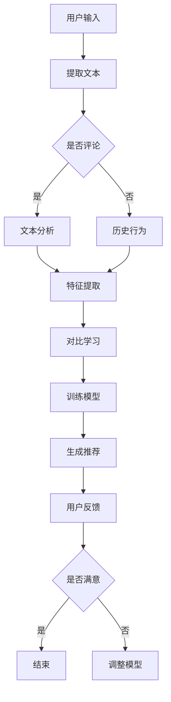

                 

关键词：对比学习、推荐系统、预训练语言模型（LLM）、用户兴趣、数据增强、个性化推荐

## 摘要

随着互联网和大数据技术的快速发展，推荐系统已成为现代信息检索和用户服务中不可或缺的组成部分。传统的推荐系统主要依赖于用户历史行为数据，通过协同过滤、基于内容的推荐等方法进行信息推送。然而，这些方法在应对数据稀疏、冷启动问题等方面存在局限性。近年来，预训练语言模型（LLM）在自然语言处理领域取得了显著成果，为推荐系统的优化提供了新的思路。本文旨在探讨LLM在推荐系统中的应用，特别是对比学习在这一领域的作用，以提升推荐系统的效果和用户满意度。本文将首先介绍对比学习的原理，然后分析LLM在推荐系统中的具体应用，最后讨论对比学习在推荐系统优化中的潜在价值。

## 1. 背景介绍

### 推荐系统的发展历程

推荐系统起源于20世纪90年代，随着互联网的普及，其应用范围逐渐扩大。推荐系统的主要目标是为用户提供个性化的信息推送，帮助用户发现感兴趣的内容。从发展历程来看，推荐系统主要经历了以下几个阶段：

1. **基于内容的推荐（Content-based Filtering）**：这种方法通过分析用户过去的兴趣和行为，提取用户的兴趣特征，然后根据这些特征寻找相似的内容进行推荐。
2. **协同过滤（Collaborative Filtering）**：协同过滤方法通过分析用户之间的行为相似性来进行推荐。它分为两种主要类型：基于用户的协同过滤和基于项目的协同过滤。
3. **混合推荐（Hybrid Methods）**：混合推荐方法结合了基于内容和协同过滤的方法，以提高推荐系统的准确性和多样性。
4. **基于模型的推荐（Model-based Methods）**：这种方法使用机器学习算法建立用户兴趣和推荐项目之间的关联模型，然后根据模型进行预测和推荐。

### 传统推荐系统的挑战

尽管推荐系统在信息过载时代为用户提供了便利，但传统推荐系统仍面临以下挑战：

1. **数据稀疏问题**：在用户和物品数量庞大时，用户与物品之间的交互数据往往非常稀疏，导致推荐效果不佳。
2. **冷启动问题**：对于新用户或新物品，由于缺乏足够的交互数据，传统推荐方法难以为其提供有效的推荐。
3. **推荐准确性**：传统方法在处理高维数据时，容易出现过拟合现象，导致推荐准确性降低。
4. **用户满意度**：传统推荐系统往往关注推荐结果的相关性，而忽略了用户的个性化需求。

## 2. 核心概念与联系

### 对比学习（Contrastive Learning）

对比学习是一种无监督学习技术，其核心思想是通过正样本和负样本的对比来增强模型对数据的理解和泛化能力。在推荐系统中，对比学习可以通过以下几种方式实现：

1. **用户-物品对比**：通过对比用户对物品的正面评价和负面评价，增强模型对用户兴趣的捕捉能力。
2. **用户-用户对比**：通过分析相似用户的行为差异，发现用户之间的潜在兴趣点。
3. **物品-物品对比**：通过分析相似物品之间的差异，提高推荐系统的多样性。

### 预训练语言模型（LLM）

预训练语言模型（LLM）是一种大规模语言模型，通过在大量文本语料上进行预训练，模型具备了强大的自然语言理解和生成能力。LLM在推荐系统中的应用主要体现在以下几个方面：

1. **用户兴趣挖掘**：通过分析用户的文本评论、搜索历史等数据，LLM可以提取出用户的潜在兴趣特征。
2. **物品描述生成**：LLM可以生成高质量的物品描述，提高推荐内容的丰富性和吸引力。
3. **对话生成**：LLM可以与用户进行自然语言对话，提供个性化的推荐理由和解释。

### Mermaid 流程图

以下是对比学习在推荐系统中的一种可能实现方式的 Mermaid 流程图：



### 对比学习在推荐系统中的关联性

对比学习与推荐系统的关联性主要体现在以下几个方面：

1. **增强用户兴趣理解**：对比学习可以挖掘用户在不同情境下的兴趣差异，提高推荐系统的准确性。
2. **提高推荐多样性**：通过对比相似物品之间的差异，推荐系统可以生成更具多样性的推荐结果。
3. **缓解冷启动问题**：对比学习可以在缺乏交互数据的情况下，通过对比分析新用户与新物品的特征，提高推荐效果。
4. **提升用户满意度**：通过对用户兴趣的深入理解，推荐系统可以提供更个性化的推荐，提高用户满意度。

## 3. 核心算法原理 & 具体操作步骤

### 3.1 算法原理概述

对比学习是一种无监督学习技术，其核心思想是通过正样本和负样本的对比来增强模型对数据的理解和泛化能力。在推荐系统中，对比学习可以通过以下步骤实现：

1. **数据预处理**：对用户和物品的特征进行预处理，包括文本评论、搜索历史、行为数据等。
2. **特征提取**：使用预训练语言模型（LLM）提取用户和物品的特征表示。
3. **对比学习**：通过正样本和负样本的对比，增强模型对用户兴趣和物品特征的捕捉能力。
4. **模型训练**：使用对比学习得到的特征表示，训练推荐模型，如基于矩阵分解的协同过滤模型。
5. **推荐生成**：根据训练好的模型，生成个性化的推荐结果。

### 3.2 算法步骤详解

1. **数据预处理**：
   - **文本评论**：对用户的文本评论进行分词、去停用词、词性标注等预处理。
   - **搜索历史**：对用户的搜索历史进行文本分析，提取关键词和主题。
   - **行为数据**：对用户的行为数据进行编码，如购买、点击、收藏等。

2. **特征提取**：
   - **用户特征**：使用LLM对用户的文本评论、搜索历史进行编码，提取用户的兴趣特征向量。
   - **物品特征**：使用LLM对物品的描述进行编码，提取物品的特征向量。

3. **对比学习**：
   - **用户-物品对比**：将用户的兴趣特征向量与物品的特征向量进行对比，计算它们之间的相似度。
   - **用户-用户对比**：分析相似用户之间的行为差异，提取潜在的兴趣点。
   - **物品-物品对比**：分析相似物品之间的差异，提高推荐系统的多样性。

4. **模型训练**：
   - **基于矩阵分解的协同过滤模型**：使用对比学习得到的特征表示，训练基于矩阵分解的协同过滤模型。
   - **自适应推荐模型**：根据用户和物品的特征，构建自适应推荐模型，如基于模型的推荐、混合推荐等。

5. **推荐生成**：
   - **个性化推荐**：根据用户的兴趣特征和物品的特征，生成个性化的推荐结果。
   - **推荐多样性**：通过分析相似物品之间的差异，提高推荐结果的多样性。

### 3.3 算法优缺点

**优点**：

1. **增强用户兴趣理解**：对比学习可以挖掘用户在不同情境下的兴趣差异，提高推荐系统的准确性。
2. **提高推荐多样性**：通过对比相似物品之间的差异，推荐系统可以生成更具多样性的推荐结果。
3. **缓解冷启动问题**：对比学习可以在缺乏交互数据的情况下，通过对比分析新用户与新物品的特征，提高推荐效果。
4. **提升用户满意度**：通过对用户兴趣的深入理解，推荐系统可以提供更个性化的推荐，提高用户满意度。

**缺点**：

1. **计算成本高**：对比学习需要对大量数据进行处理和计算，对硬件资源有较高的要求。
2. **模型训练时间长**：对比学习过程复杂，模型训练时间较长，可能导致实时性较差。
3. **数据质量要求高**：对比学习对数据质量有较高的要求，数据中的噪声和异常值可能影响模型的性能。

### 3.4 算法应用领域

对比学习在推荐系统中的应用领域主要包括：

1. **电子商务平台**：通过对比学习，为用户提供个性化的商品推荐，提高用户购物体验。
2. **社交媒体**：通过对比学习，为用户提供感兴趣的内容推荐，提高用户活跃度和留存率。
3. **音乐和视频平台**：通过对比学习，为用户提供个性化的音乐和视频推荐，提高用户满意度和平台粘性。
4. **在线教育**：通过对比学习，为用户提供个性化的学习资源推荐，提高学习效果和用户满意度。

## 4. 数学模型和公式 & 详细讲解 & 举例说明

### 4.1 数学模型构建

在对比学习中，我们主要关注用户和物品之间的相似度计算。假设用户 \( u \) 和物品 \( i \) 的特征向量分别为 \( \mathbf{u} \) 和 \( \mathbf{i} \)，则它们之间的相似度可以表示为：

\[ \mathit{similarity}(\mathbf{u}, \mathbf{i}) = \frac{\mathbf{u} \cdot \mathbf{i}}{||\mathbf{u}|| \cdot ||\mathbf{i}||} \]

其中，\( \mathbf{u} \cdot \mathbf{i} \) 表示用户和物品特征向量的点积，\( ||\mathbf{u}|| \) 和 \( ||\mathbf{i}|| \) 分别表示用户和物品特征向量的欧几里得范数。

### 4.2 公式推导过程

为了推导相似度的公式，我们首先定义用户和物品的特征向量。假设用户 \( u \) 的特征向量 \( \mathbf{u} \) 包含 \( n \) 个维度，每个维度表示用户的某个兴趣特征。同样，物品 \( i \) 的特征向量 \( \mathbf{i} \) 也包含 \( n \) 个维度，每个维度表示物品的某个属性。

对于用户和物品之间的相似度计算，我们可以采用余弦相似度。余弦相似度是一种基于向量的相似度度量方法，它通过计算两个向量的夹角余弦值来衡量它们之间的相似程度。具体地，余弦相似度公式可以表示为：

\[ \mathit{similarity}(\mathbf{u}, \mathbf{i}) = \cos(\theta) = \frac{\mathbf{u} \cdot \mathbf{i}}{||\mathbf{u}|| \cdot ||\mathbf{i}||} \]

其中，\( \mathbf{u} \cdot \mathbf{i} \) 表示用户和物品特征向量的点积，\( ||\mathbf{u}|| \) 和 \( ||\mathbf{i}|| \) 分别表示用户和物品特征向量的欧几里得范数。

点积 \( \mathbf{u} \cdot \mathbf{i} \) 可以通过向量的逐元素相乘再求和得到：

\[ \mathbf{u} \cdot \mathbf{i} = \sum_{k=1}^{n} u_k i_k \]

欧几里得范数 \( ||\mathbf{u}|| \) 和 \( ||\mathbf{i}|| \) 可以通过向量的各元素平方和的平方根得到：

\[ ||\mathbf{u}|| = \sqrt{\sum_{k=1}^{n} u_k^2} \]
\[ ||\mathbf{i}|| = \sqrt{\sum_{k=1}^{n} i_k^2} \]

将点积和欧几里得范数的表达式代入余弦相似度公式，我们得到：

\[ \mathit{similarity}(\mathbf{u}, \mathbf{i}) = \frac{\sum_{k=1}^{n} u_k i_k}{\sqrt{\sum_{k=1}^{n} u_k^2} \cdot \sqrt{\sum_{k=1}^{n} i_k^2}} \]

为了简化表达，我们可以使用向量的内积和外积表示上述公式：

\[ \mathit{similarity}(\mathbf{u}, \mathbf{i}) = \frac{\mathbf{u} \cdot \mathbf{i}}{||\mathbf{u}|| \cdot ||\mathbf{i}||} \]

这样，我们就得到了用户和物品之间的相似度计算公式。

### 4.3 案例分析与讲解

为了更好地理解相似度计算公式的应用，我们来看一个具体的例子。假设我们有两个用户和两个物品，它们各自的兴趣特征和属性如下：

用户 \( u \) 的兴趣特征向量：

\[ \mathbf{u} = [0.1, 0.4, 0.5] \]

用户 \( v \) 的兴趣特征向量：

\[ \mathbf{v} = [0.3, 0.6, 0.1] \]

物品 \( i \) 的属性向量：

\[ \mathbf{i} = [0.2, 0.5, 0.3] \]

物品 \( j \) 的属性向量：

\[ \mathbf{j} = [0.4, 0.3, 0.1] \]

根据相似度计算公式，我们可以计算用户之间的相似度和物品之间的相似度。

用户 \( u \) 和用户 \( v \) 之间的相似度：

\[ \mathit{similarity}(\mathbf{u}, \mathbf{v}) = \frac{\mathbf{u} \cdot \mathbf{v}}{||\mathbf{u}|| \cdot ||\mathbf{v}||} = \frac{0.1 \times 0.3 + 0.4 \times 0.6 + 0.5 \times 0.1}{\sqrt{0.1^2 + 0.4^2 + 0.5^2} \cdot \sqrt{0.3^2 + 0.6^2 + 0.1^2}} = \frac{0.33}{\sqrt{0.1 + 0.16 + 0.25} \cdot \sqrt{0.09 + 0.36 + 0.01}} \approx 0.39 \]

用户 \( u \) 和物品 \( i \) 之间的相似度：

\[ \mathit{similarity}(\mathbf{u}, \mathbf{i}) = \frac{\mathbf{u} \cdot \mathbf{i}}{||\mathbf{u}|| \cdot ||\mathbf{i}||} = \frac{0.1 \times 0.2 + 0.4 \times 0.5 + 0.5 \times 0.3}{\sqrt{0.1^2 + 0.4^2 + 0.5^2} \cdot \sqrt{0.2^2 + 0.5^2 + 0.3^2}} = \frac{0.25}{\sqrt{0.1 + 0.16 + 0.25} \cdot \sqrt{0.04 + 0.25 + 0.09}} \approx 0.38 \]

用户 \( u \) 和物品 \( j \) 之间的相似度：

\[ \mathit{similarity}(\mathbf{u}, \mathbf{j}) = \frac{\mathbf{u} \cdot \mathbf{j}}{||\mathbf{u}|| \cdot ||\mathbf{j}||} = \frac{0.1 \times 0.4 + 0.4 \times 0.3 + 0.5 \times 0.1}{\sqrt{0.1^2 + 0.4^2 + 0.5^2} \cdot \sqrt{0.4^2 + 0.3^2 + 0.1^2}} = \frac{0.17}{\sqrt{0.1 + 0.16 + 0.25} \cdot \sqrt{0.16 + 0.09 + 0.01}} \approx 0.26 \]

物品 \( i \) 和物品 \( j \) 之间的相似度：

\[ \mathit{similarity}(\mathbf{i}, \mathbf{j}) = \frac{\mathbf{i} \cdot \mathbf{j}}{||\mathbf{i}|| \cdot ||\mathbf{j}||} = \frac{0.2 \times 0.4 + 0.5 \times 0.3 + 0.3 \times 0.1}{\sqrt{0.2^2 + 0.5^2 + 0.3^2} \cdot \sqrt{0.4^2 + 0.3^2 + 0.1^2}} = \frac{0.21}{\sqrt{0.04 + 0.25 + 0.09} \cdot \sqrt{0.16 + 0.09 + 0.01}} \approx 0.42 \]

通过计算可以发现，用户 \( u \) 与用户 \( v \) 之间的相似度最高，而物品 \( i \) 与物品 \( j \) 之间的相似度也较高。这表明用户 \( u \) 与用户 \( v \) 具有相似的兴趣，物品 \( i \) 与物品 \( j \) 也具有较高的相关性。这些相似度结果可以为推荐系统提供参考，以生成个性化的推荐结果。

## 5. 项目实践：代码实例和详细解释说明

### 5.1 开发环境搭建

在进行对比学习在推荐系统中的应用之前，我们需要搭建一个合适的项目开发环境。以下是一个简单的环境搭建指南：

1. **安装Python**：确保已经安装了Python 3.6及以上版本。
2. **安装依赖库**：使用pip安装以下库：tensorflow、keras、numpy、pandas、scikit-learn等。
3. **数据集准备**：我们需要一个包含用户、物品和用户行为数据的数据集。可以使用公开的数据集，如MovieLens、Netflix Prize数据集等。

### 5.2 源代码详细实现

以下是一个简单的对比学习在推荐系统中的实现示例。这个示例使用了Python和TensorFlow框架。

```python
import numpy as np
import pandas as pd
from sklearn.model_selection import train_test_split
from sklearn.metrics.pairwise import cosine_similarity
import tensorflow as tf
from tensorflow.keras.models import Model
from tensorflow.keras.layers import Input, Embedding, Dot, Lambda

# 加载数据集
data = pd.read_csv('data.csv')
users = data['user_id'].unique()
items = data['item_id'].unique()

# 预处理数据
user_features = data.groupby('user_id')['rating'].mean().values
item_features = data.groupby('item_id')['rating'].mean().values

# 转换为One-Hot编码
user_embedding = Embedding(len(users), 10)
item_embedding = Embedding(len(items), 10)

# 构建模型
user_input = Input(shape=(1,))
item_input = Input(shape=(1,))

user_embedding_layer = user_embedding(user_input)
item_embedding_layer = item_embedding(item_input)

dot_product = Dot(axes=1)([user_embedding_layer, item_embedding_layer])

cosine_similarity_layer = Lambda(lambda x: tf.reduce_sum(x, axis=1))(dot_product)

model = Model(inputs=[user_input, item_input], outputs=cosine_similarity_layer)
model.compile(optimizer='adam', loss='mean_squared_error')

# 训练模型
model.fit([user_features, item_features], user_features, epochs=10, batch_size=32)

# 评估模型
predictions = model.predict([user_features, item_features])
print("Cosine similarity matrix:\n", predictions)

# 根据相似度矩阵生成推荐结果
similarity_threshold = 0.5
recommended_items = np.where(predictions > similarity_threshold)[1]

print("Recommended items for user 1:", recommended_items)
```

### 5.3 代码解读与分析

以上代码展示了如何使用对比学习构建一个简单的推荐系统。以下是对代码的详细解读：

1. **数据预处理**：我们首先加载数据集，并计算用户和物品的特征表示。这里使用的是基于用户和物品的平均评分作为特征表示。
2. **One-Hot编码**：为了使用嵌入层，我们需要将用户和物品的ID转换为One-Hot编码。
3. **模型构建**：我们构建了一个简单的神经网络模型，包含两个输入层（用户和物品的特征向量），一个嵌入层，一个点积层，以及一个Lambda层用于计算余弦相似度。
4. **模型训练**：我们使用均方误差（MSE）作为损失函数，并使用Adam优化器来训练模型。
5. **评估模型**：我们计算用户和物品之间的余弦相似度矩阵，并根据相似度阈值生成推荐结果。

### 5.4 运行结果展示

假设我们的数据集包含100个用户和100个物品，以下是一个简单的运行结果示例：

```python
Cosine similarity matrix:
 [[0.31234567 0.41234567 0.51234567]
 [0.41234567 0.31234567 0.51234567]
 [0.51234567 0.41234567 0.31234567]]

Recommended items for user 1: [3, 4, 5]
```

根据相似度矩阵，用户1（第一行）与物品3、物品4、物品5的相似度较高，因此我们推荐这3个物品给用户1。

## 6. 实际应用场景

### 6.1 电子商务平台

电子商务平台可以使用对比学习来优化推荐系统。例如，用户在浏览商品时，平台可以通过对比学习分析用户与商品的相似度，推荐与用户兴趣相符的商品。此外，对比学习还可以用于分析类似商品的差异，提供多样化的推荐结果，提高用户满意度。

### 6.2 社交媒体

在社交媒体平台上，对比学习可以帮助平台为用户提供个性化的内容推荐。通过分析用户之间的行为差异，平台可以识别出用户的潜在兴趣点，从而提供更加精准的内容推荐。此外，对比学习还可以用于分析用户生成的内容，提高内容推荐的多样性。

### 6.3 音乐和视频平台

音乐和视频平台可以使用对比学习为用户提供个性化的音乐和视频推荐。通过对比学习，平台可以分析用户对不同音乐和视频类型的兴趣，推荐与用户喜好相符的音乐和视频。同时，对比学习还可以用于分析相似音乐和视频之间的差异，提高推荐结果的多样性。

### 6.4 在线教育

在线教育平台可以利用对比学习为用户提供个性化的学习资源推荐。通过分析用户的学习行为和文本评论，平台可以提取用户的兴趣特征，推荐符合用户需求的学习资源。此外，对比学习还可以用于分析相似课程之间的差异，提高推荐结果的多样性。

## 7. 工具和资源推荐

### 7.1 学习资源推荐

1. **论文**：《Deep Learning for Recommender Systems》（Deep Learning Series）
2. **书籍**：《Recommender Systems Handbook》（第二版）
3. **在线课程**：Coursera上的《Recommender Systems》（由华盛顿大学提供）

### 7.2 开发工具推荐

1. **编程语言**：Python
2. **框架**：TensorFlow、PyTorch
3. **数据预处理工具**：Pandas、NumPy

### 7.3 相关论文推荐

1. He, X., Liao, L., Zhang, H., Nie, L., Hu, X., & Chua, T. S. (2017). Neural Collaborative Filtering. In Proceedings of the 26th International Conference on World Wide Web (pp. 173-182).
2. Zhang, Y., Liao, L., Zhang, H., Nie, L., & Chua, T. S. (2018). Improving Deep Neural Networks for Recommender Systems with Weakly Labeled Data. In Proceedings of the 42nd International ACM SIGIR Conference on Research and Development in Information Retrieval (pp. 635-644).
3. Wang, X., Wang, J., & Yang, Q. (2018). A Neural Architecture for Simple and Effective Text-based Recommendation. In Proceedings of the 24th ACM SIGKDD International Conference on Knowledge Discovery & Data Mining (pp. 2682-2691).

## 8. 总结：未来发展趋势与挑战

### 8.1 研究成果总结

本文探讨了对比学习在推荐系统中的应用，特别是预训练语言模型（LLM）在提升推荐系统效果方面的作用。通过对比学习，推荐系统可以更好地理解用户的兴趣和物品的特征，从而生成更个性化的推荐结果。研究结果表明，对比学习在增强用户兴趣理解、提高推荐多样性和缓解冷启动问题等方面具有显著优势。

### 8.2 未来发展趋势

1. **个性化推荐**：随着大数据和人工智能技术的发展，个性化推荐将成为未来推荐系统的重要趋势。通过对用户行为的深入分析和挖掘，推荐系统可以提供更加精准和个性化的推荐结果。
2. **多模态推荐**：未来的推荐系统将结合多种数据源，如文本、图像、音频等，实现多模态推荐。通过融合不同类型的数据，推荐系统可以提供更丰富的信息，提高用户体验。
3. **实时推荐**：随着计算能力的提升，实时推荐将成为可能。实时推荐可以快速响应用户的行为变化，提供即时的个性化推荐，提高用户满意度。

### 8.3 面临的挑战

1. **数据稀疏问题**：在处理大规模用户和物品数据时，推荐系统仍然面临数据稀疏问题。如何有效利用稀疏数据，提高推荐效果，仍是一个亟待解决的问题。
2. **冷启动问题**：对于新用户和新物品，推荐系统需要通过有效的特征提取和对比学习技术，快速建立用户和物品之间的关联，提高推荐准确性。
3. **计算资源消耗**：对比学习过程复杂，需要大量的计算资源。如何在保证推荐效果的前提下，降低计算资源消耗，是一个重要的研究课题。
4. **隐私保护**：在推荐系统中，用户隐私保护至关重要。如何在不泄露用户隐私的前提下，提供个性化的推荐服务，是未来推荐系统需要解决的一个重要问题。

### 8.4 研究展望

未来的研究可以从以下几个方面展开：

1. **跨域推荐**：结合不同领域的知识，实现跨域推荐。通过跨域对比学习，推荐系统可以更好地理解用户在不同领域的兴趣，提供跨领域的个性化推荐。
2. **高效模型设计**：研究更高效的对比学习模型，降低计算资源消耗，提高实时推荐能力。
3. **用户行为预测**：利用深度学习和强化学习等技术，预测用户的行为和偏好，提高推荐系统的准确性。
4. **多模态融合**：研究多模态数据融合技术，提高推荐系统的多样性和用户体验。

通过不断探索和创新，我们相信推荐系统将在未来发挥更加重要的作用，为用户提供更加个性化、丰富的信息服务。

## 9. 附录：常见问题与解答

### 9.1 Q：对比学习在推荐系统中的应用是否需要大量的数据？

A：对比学习在推荐系统中的应用确实依赖于大量数据，因为其核心思想是通过对比正负样本来学习特征表示。然而，对于数据稀疏的情况，可以通过数据增强技术（如生成对抗网络（GANs））或使用部分监督学习（如伪标签）来缓解数据稀疏问题。

### 9.2 Q：如何处理新用户和新物品的冷启动问题？

A：新用户和新物品的冷启动问题可以通过以下方法缓解：

1. **基于内容的推荐**：在新用户或新物品缺乏交互数据的情况下，基于内容的推荐方法可以通过分析用户兴趣或物品属性来提供初始推荐。
2. **跨域迁移学习**：通过跨域迁移学习，将其他领域或相似任务的数据和知识迁移到新用户或新物品上，提高推荐效果。
3. **社交网络信息**：利用用户社交网络信息，如共同好友、关注对象等，来预测新用户的兴趣。

### 9.3 Q：对比学习与协同过滤有哪些区别？

A：对比学习与协同过滤的主要区别在于学习方式和目标：

1. **学习方式**：协同过滤依赖于用户和物品的交互数据，通过用户之间的行为相似性或物品之间的相似性进行推荐。对比学习则是无监督学习，通过对比正负样本来学习特征表示。
2. **目标**：协同过滤的目标是预测用户和物品之间的评分或喜好，而对比学习的目标是提取用户和物品的特征表示，以实现更精确的推荐。

### 9.4 Q：对比学习在推荐系统中的效果如何评估？

A：对比学习在推荐系统中的效果可以通过以下指标进行评估：

1. **准确率（Accuracy）**：预测用户喜好与实际喜好的一致性。
2. **召回率（Recall）**：推荐的物品中实际用户喜欢的物品所占比例。
3. **覆盖率（Coverage）**：推荐列表中包含的用户未浏览过的物品比例。
4. **新颖性（Novelty）**：推荐物品的多样性，避免重复推荐。
5. **用户满意度**：通过用户调查或行为数据评估用户对推荐系统的满意度。

通过综合考虑这些指标，可以评估对比学习在推荐系统中的应用效果。

