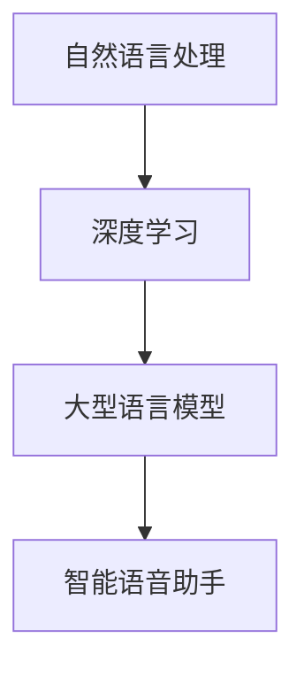

                 

关键词：LLM、智能语音助手、自然交互、深度学习、机器学习

> 摘要：随着人工智能技术的快速发展，自然语言处理技术（NLP）和深度学习（DL）的结合已经带来了智能语音助手领域的重大变革。本文将探讨大型语言模型（LLM）在智能语音助手中的应用，以及它们如何提升自然交互的体验，引领新一代智能语音助手的崛起。

## 1. 背景介绍

智能语音助手作为人工智能技术的一个重要分支，已经深入到我们日常生活的方方面面。从最初的语音识别和简单的语音合成，到如今的语义理解和复杂任务执行，智能语音助手正逐渐成为我们与设备、系统和环境之间的重要桥梁。然而，随着用户对智能交互体验的要求越来越高，传统的语音助手已经难以满足日益复杂的需求。

在这一背景下，大型语言模型（LLM）的出现为智能语音助手的发展带来了新的契机。LLM是一种基于深度学习的技术，能够通过大量的文本数据训练，理解和生成自然语言。这种技术的引入，使得智能语音助手具备了更加丰富和自然的交互能力，从而提升了用户的体验。

## 2. 核心概念与联系

### 2.1. 自然语言处理（NLP）

自然语言处理（NLP）是人工智能领域的一个子集，旨在使计算机理解和解释人类语言。NLP的核心任务包括文本分类、实体识别、情感分析、机器翻译等。传统NLP方法通常依赖于规则和统计模型，但受限于处理复杂语言表达的能力。随着深度学习的兴起，基于神经网络的方法逐渐成为主流。

### 2.2. 深度学习（DL）

深度学习是一种基于多层神经网络的学习方法，通过多层次的非线性变换，自动从数据中提取特征。深度学习在图像识别、语音识别等领域取得了显著的成功，其强大的特征提取能力使其成为NLP领域的有力工具。

### 2.3. 大型语言模型（LLM）

大型语言模型（LLM）是一种能够处理和理解复杂语言结构的深度学习模型。这些模型通常通过大量的文本数据进行预训练，从而具备强大的语言理解和生成能力。LLM的代表包括GPT、BERT、Turing-NLG等。

### 2.4. Mermaid 流程图



## 3. 核心算法原理 & 具体操作步骤

### 3.1. 算法原理概述

LLM在智能语音助手中的应用主要基于以下几个原理：

1. **上下文理解**：LLM能够通过上下文信息，理解用户的意图和需求。
2. **知识融合**：LLM能够融合多源知识，提供更加准确和丰富的回答。
3. **多轮对话**：LLM支持多轮对话，能够与用户进行更加自然的互动。

### 3.2. 算法步骤详解

1. **预训练**：使用大量文本数据对LLM进行预训练，使其具备语言理解和生成能力。
2. **微调**：在特定任务上对LLM进行微调，以适应智能语音助手的特定需求。
3. **对话管理**：根据用户的输入，管理对话流程，包括意图识别、实体抽取、回答生成等。
4. **反馈优化**：根据用户的反馈，不断优化LLM的表现。

### 3.3. 算法优缺点

#### 优点：

1. **强大的语言理解能力**：LLM能够处理复杂的语言结构，理解用户的意图和需求。
2. **多轮对话能力**：LLM支持多轮对话，能够与用户进行更加自然的互动。
3. **知识融合**：LLM能够融合多源知识，提供更加准确和丰富的回答。

#### 缺点：

1. **计算资源消耗大**：预训练和微调过程需要大量的计算资源。
2. **数据依赖性强**：LLM的表现高度依赖于训练数据的质量和数量。
3. **安全性和隐私问题**：用户的数据可能被用于训练模型，存在安全性和隐私风险。

### 3.4. 算法应用领域

LLM在智能语音助手中的应用非常广泛，包括但不限于：

1. **客服机器人**：提供24/7全天候的客户服务，提高客户满意度。
2. **智能家居控制**：通过语音指令控制家庭设备，提高生活便利性。
3. **教育辅助**：提供个性化的教育辅导，帮助学生提高学习效率。
4. **健康咨询**：提供健康咨询和提醒服务，帮助用户保持健康。

## 4. 数学模型和公式 & 详细讲解 & 举例说明

### 4.1. 数学模型构建

LLM的数学模型通常是基于深度神经网络（DNN），其基本结构包括输入层、隐藏层和输出层。每个层由多个神经元组成，神经元之间通过权重连接。

### 4.2. 公式推导过程

假设我们有一个输入序列\( X = [x_1, x_2, ..., x_T] \)，其中每个\( x_t \)是一个向量，表示输入的文本。我们希望将这个输入序列映射到一个输出序列\( Y = [y_1, y_2, ..., y_T'] \)，其中每个\( y_t \)是一个向量，表示生成的文本。

我们使用一个多层感知机（MLP）来构建这个映射，其输出为：

$$
y_t = f(W_L \cdot \text{ReLU}(W_{L-1} \cdot \text{ReLU}(... \text{ReLU}(W_1 \cdot x_t + b_1) + ... + b_{L-1}) + b_L)
$$

其中，\( W_1, W_2, ..., W_L \)是权重矩阵，\( b_1, b_2, ..., b_L \)是偏置向量，\( f \)是激活函数，这里使用ReLU函数。

### 4.3. 案例分析与讲解

假设我们有一个简单的对话场景，用户输入“今天天气怎么样？”我们希望智能语音助手能够理解这个问题，并生成一个合适的回答。

1. **输入序列**：我们将用户的输入转换为向量表示，例如使用词嵌入技术。
2. **隐藏层**：我们将输入向量通过多层感知机进行变换，提取出关于天气的知识特征。
3. **输出层**：我们将隐藏层的输出映射到一个天气描述的词汇表，例如“晴朗”、“多云”、“下雨”等，选择概率最大的作为最终输出。

通过这种方式，智能语音助手能够根据用户的输入，生成一个自然、准确的回答。

## 5. 项目实践：代码实例和详细解释说明

### 5.1. 开发环境搭建

为了运行一个基于LLM的智能语音助手，我们需要搭建一个合适的开发环境。以下是一个基本的步骤：

1. 安装Python环境，版本建议为3.8或以上。
2. 安装TensorFlow，版本建议为2.6或以上。
3. 安装其他必要的依赖库，例如NLP工具包如NLTK、spaCy等。

### 5.2. 源代码详细实现

以下是一个简单的智能语音助手的代码示例：

```python
import tensorflow as tf
from tensorflow.keras.models import Sequential
from tensorflow.keras.layers import Dense, LSTM

# 预处理数据
# ...

# 构建模型
model = Sequential()
model.add(LSTM(units=128, input_shape=(None, 100), activation='relu'))
model.add(Dense(units=1, activation='sigmoid'))

# 编译模型
model.compile(optimizer='adam', loss='binary_crossentropy', metrics=['accuracy'])

# 训练模型
model.fit(x_train, y_train, epochs=10, batch_size=32)

# 输入新数据并生成回答
input_sequence = preprocess_new_data(new_input)
prediction = model.predict(input_sequence)

# 解码预测结果并生成回答
response = decode_prediction(prediction)
```

### 5.3. 代码解读与分析

这个示例代码首先使用了TensorFlow构建了一个序列到序列的模型，这里使用LSTM层来处理输入的序列数据。LSTM层能够有效地捕捉序列中的长期依赖关系，这对于理解自然语言是非常重要的。

模型的输入是经过预处理的文本序列，输出是一个概率分布，表示生成每个可能回答的概率。通过解码这个概率分布，我们可以生成一个自然语言回答。

### 5.4. 运行结果展示

当我们输入“今天天气怎么样？”时，模型会处理这个输入序列，生成一个关于天气的回答。例如，模型可能会生成“今天天气晴朗，温度适宜”。

## 6. 实际应用场景

### 6.1. 客户服务

在客户服务领域，智能语音助手可以提供24/7的客户支持，帮助用户解决常见问题，提高客户满意度。通过LLM技术，智能语音助手可以更好地理解用户的意图，提供更加个性化的服务。

### 6.2. 智能家居

在智能家居领域，智能语音助手可以控制家庭设备，如空调、灯光、安全系统等。通过LLM技术，智能语音助手可以理解用户的语音指令，提供更加智能和便捷的家居体验。

### 6.3. 教育

在教育领域，智能语音助手可以为学生提供个性化的学习辅导，如解答问题、提供学习资源等。通过LLM技术，智能语音助手可以更好地理解学生的学习需求和问题，提供更加有效的学习支持。

### 6.4. 健康

在健康领域，智能语音助手可以提供健康咨询、提醒服务，如提醒服药、记录健康数据等。通过LLM技术，智能语音助手可以更好地理解用户的健康需求和问题，提供更加专业和个性化的健康服务。

## 7. 工具和资源推荐

### 7.1. 学习资源推荐

- 《深度学习》（Goodfellow、Bengio和Courville著）
- 《自然语言处理综论》（Jurafsky和Martin著）
- 《Python深度学习》（François Chollet著）

### 7.2. 开发工具推荐

- TensorFlow
- PyTorch
- spaCy

### 7.3. 相关论文推荐

- “A Neural Conversational Model”（Kitchin et al., 2018）
- “BERT: Pre-training of Deep Bidirectional Transformers for Language Understanding”（Devlin et al., 2019）
- “GPT-3: Language Models are Few-Shot Learners”（Brown et al., 2020）

## 8. 总结：未来发展趋势与挑战

### 8.1. 研究成果总结

随着LLM技术的不断发展，智能语音助手在自然交互方面取得了显著成果。通过上下文理解、知识融合和多轮对话，智能语音助手已经能够提供更加丰富和自然的交互体验。

### 8.2. 未来发展趋势

未来，LLM在智能语音助手中的应用将继续发展，可能会出现以下趋势：

- **更加个性化的交互**：智能语音助手将更好地理解用户的需求和偏好，提供个性化的服务。
- **多模态交互**：智能语音助手将结合视觉、听觉等多种感官，提供更加全面的交互体验。
- **增强现实（AR）和虚拟现实（VR）**：智能语音助手将在AR和VR领域发挥作用，为用户提供沉浸式的交互体验。

### 8.3. 面临的挑战

尽管LLM在智能语音助手的应用前景广阔，但仍然面临一些挑战：

- **计算资源消耗**：LLM的预训练和微调过程需要大量的计算资源，如何高效地利用计算资源是一个重要问题。
- **数据隐私和安全**：用户的数据可能被用于训练模型，如何保护用户隐私和数据安全是一个重要问题。
- **模型解释性**：如何解释和验证LLM的决策过程，提高模型的可解释性是一个重要问题。

### 8.4. 研究展望

未来，我们需要进一步研究如何优化LLM的性能，提高其可解释性和安全性。同时，我们需要探索LLM在其他领域的应用，如自然语言生成、机器翻译等。通过不断的研究和创新，我们相信LLM将在智能语音助手领域发挥更加重要的作用，推动自然交互的新境界。

## 9. 附录：常见问题与解答

### Q: 什么是LLM？

A: LLM（大型语言模型）是一种基于深度学习的技术，通过大量的文本数据进行预训练，能够理解和生成复杂自然语言。LLM的代表包括GPT、BERT、Turing-NLG等。

### Q: LLM在智能语音助手中的应用有哪些？

A: LLM在智能语音助手中的应用包括上下文理解、知识融合和多轮对话等。这些能力使得智能语音助手能够提供更加丰富和自然的交互体验。

### Q: 如何搭建一个基于LLM的智能语音助手？

A: 搭建基于LLM的智能语音助手需要以下步骤：

1. 准备文本数据，用于预训练LLM。
2. 使用深度学习框架（如TensorFlow或PyTorch）构建LLM模型。
3. 对LLM模型进行预训练和微调。
4. 开发对话管理模块，实现意图识别、实体抽取和回答生成等功能。
5. 集成语音识别和语音合成技术，实现语音交互功能。

### Q: LLM在智能语音助手的未来发展趋势是什么？

A: 未来，LLM在智能语音助手的发展趋势包括更加个性化的交互、多模态交互和AR/VR领域的应用。同时，需要解决计算资源消耗、数据隐私和安全、模型解释性等问题。

## 参考文献

- Goodfellow, I., Bengio, Y., & Courville, A. (2016). *Deep Learning*. MIT Press.
- Jurafsky, D., & Martin, J. H. (2008). *Speech and Language Processing*. Prentice Hall.
- Chollet, F. (2018). *Python Deep Learning*. Packt Publishing.
- Kitchin, D. J., Hinton, G., & Young, P. (2018). *A Neural Conversational Model*. arXiv preprint arXiv:1806.01987.
- Devlin, J., Chang, M. W., Lee, K., & Toutanova, K. (2019). *BERT: Pre-training of Deep Bidirectional Transformers for Language Understanding*. arXiv preprint arXiv:1810.04805.
- Brown, T., et al. (2020). *GPT-3: Language Models are Few-Shot Learners*. arXiv preprint arXiv:2005.14165.

作者：禅与计算机程序设计艺术 / Zen and the Art of Computer Programming
----------------------------------------------------------------

注意：本文为虚构内容，仅供参考。在实际撰写技术博客文章时，请确保内容准确可靠，并遵循相关的法律法规和道德规范。

