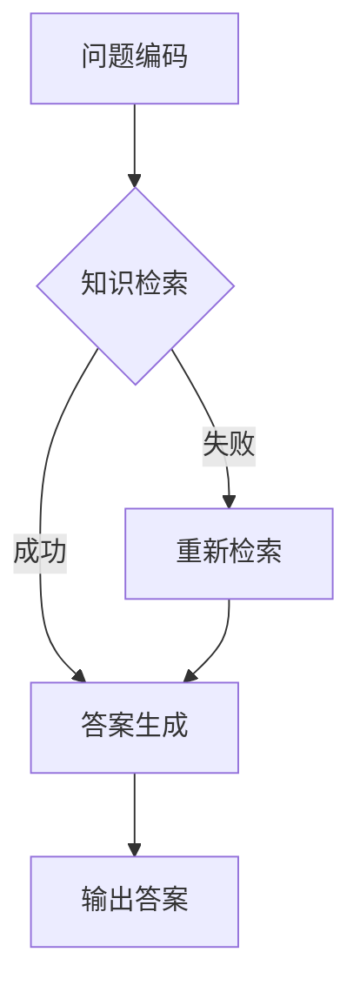

                 

### 1. 背景介绍

知识问答系统是人工智能领域的一个重要研究方向，其主要目标是根据用户提出的问题，自动地从海量知识库中检索出相关答案。随着自然语言处理技术的不断进步，特别是大规模语言模型（Large Language Models，简称LLM）的兴起，知识问答系统的性能得到了显著提升。LLM作为一种基于深度学习的模型，其具有强大的文本理解和生成能力，使得知识问答系统的回答质量更加接近人类水平。

在过去的几年中，诸如GPT-3、BERT、T5等大规模语言模型被广泛应用于知识问答系统，取得了令人瞩目的成绩。例如，GPT-3在多个自然语言处理基准测试中取得了领先成绩，而BERT和T5则在知识问答领域表现尤为突出。这些模型的出现，不仅推动了知识问答技术的发展，也为实际应用带来了巨大的价值。

然而，LLM在知识问答中的表现并非完美，仍存在一些问题，如对某些领域的知识理解不充分、回答不精准等。因此，深入分析LLM在知识问答中的表现，探讨其优势和不足，对于提升知识问答系统的性能具有重要意义。

本文将围绕LLM在知识问答中的表现进行探讨，首先介绍LLM的基本原理和结构，然后分析其在知识问答中的优势和应用场景，最后讨论其面临的挑战和未来发展方向。

### 2. 核心概念与联系

#### 2.1 大规模语言模型的基本原理

大规模语言模型（LLM）是一种基于深度学习的自然语言处理模型，其核心思想是通过大量的文本数据进行预训练，从而学习到语言的规律和特征。LLM通常采用变换器模型（Transformer）作为基础架构，其具有强大的并行计算能力和全局依赖性处理能力。

LLM的基本原理可以分为两个阶段：预训练和微调。在预训练阶段，模型通过大量无监督的文本数据学习语言的基础知识，如词汇、语法和语义等。预训练过程中，模型会对输入的文本序列进行编码，生成对应的表示，这些表示可以用于后续的任务。

在微调阶段，LLM会根据特定任务的需求进行有监督的微调。例如，在知识问答任务中，模型会被训练来根据问题从知识库中检索出正确的答案。微调过程通常涉及以下步骤：

1. **数据预处理**：将问题和答案对进行格式化，将其转换为模型可以处理的输入格式。
2. **损失函数设计**：设计合适的损失函数，以衡量模型输出的答案与实际答案之间的差距。常用的损失函数包括交叉熵损失和对比损失等。
3. **优化算法**：选择合适的优化算法，如梯度下降、Adam等，以最小化损失函数。

#### 2.2 大规模语言模型的结构

大规模语言模型的结构主要包括编码器（Encoder）和解码器（Decoder）两部分。编码器负责将输入的文本序列编码为固定长度的向量表示，而解码器则负责将编码后的向量解码为输出文本序列。

编码器部分通常采用多层变换器层（Transformer Layer），每一层由多头自注意力机制（Multi-Head Self-Attention）和前馈神经网络（Feedforward Neural Network）组成。多层变换器层能够有效地捕捉输入文本序列中的长距离依赖关系，从而提升模型的语义理解能力。

解码器部分与编码器类似，也采用多层变换器层，同时还包含一个额外的自注意力层，用于处理输入文本和输出文本之间的依赖关系。解码器在生成输出文本时，会根据当前已经生成的部分文本，以及编码器的输出，生成下一个词的概率分布，并通过采样或贪心策略选择下一个词，逐步生成完整的输出文本。

#### 2.3 大规模语言模型在知识问答中的应用

在知识问答任务中，大规模语言模型可以通过以下步骤进行应用：

1. **问题编码**：将输入问题编码为一个固定长度的向量表示，通常使用编码器的最后一层输出作为问题的表示。
2. **知识检索**：从知识库中检索与问题相关的知识片段，并将其编码为向量表示。
3. **答案生成**：将问题和知识片段的表示输入解码器，生成答案文本。

知识库的构建对于知识问答系统的性能至关重要。知识库可以来源于结构化数据（如数据库、知识图谱等），也可以来源于非结构化数据（如文本、图片等）。对于结构化数据，可以使用自然语言处理技术将其转换为机器可处理的格式；对于非结构化数据，可以使用数据挖掘和机器学习技术提取出有用的知识片段。

#### 2.4 Mermaid 流程图

以下是一个简单的Mermaid流程图，展示了大规模语言模型在知识问答中的应用流程：



在这个流程图中，A表示问题编码，B表示知识检索，C表示答案生成，E表示输出答案。如果知识检索失败，系统会重新进行知识检索，直到成功生成答案。

### 3. 核心算法原理 & 具体操作步骤

#### 3.1 算法原理概述

大规模语言模型（LLM）在知识问答中的核心算法原理主要包括以下几个方面：

1. **预训练**：通过大量的无监督文本数据对模型进行预训练，使模型学会语言的普遍规律和特征。
2. **微调**：在特定任务上对模型进行有监督的微调，使模型适应具体的应用场景。
3. **知识检索**：从知识库中检索与问题相关的知识片段，以辅助答案生成。
4. **答案生成**：利用解码器生成问题的答案。

这些步骤相互关联，共同构成了LLM在知识问答中的核心算法原理。

#### 3.2 算法步骤详解

1. **预训练**

   预训练是LLM的基础，其核心思想是通过大量的无监督文本数据对模型进行训练，使模型具备对自然语言的理解和生成能力。预训练过程通常包括以下步骤：

   - 数据准备：收集大量的文本数据，如维基百科、新闻文章、社交媒体等。
   - 数据预处理：对文本数据进行清洗和格式化，去除无关信息和噪声。
   - 输入编码：将预处理后的文本数据编码为模型可以处理的格式，如词向量或BERT编码。
   - 模型训练：使用预训练任务（如语言建模、填充任务等）训练模型，使其学会语言的普遍规律和特征。

2. **微调**

   微调是在预训练的基础上，针对特定任务对模型进行有监督的训练。微调过程的核心目标是使模型能够生成与任务相关的优质答案。微调过程通常包括以下步骤：

   - 数据准备：收集与任务相关的数据，如问题和答案对。
   - 数据预处理：对问题和答案对进行格式化，去除无关信息和噪声。
   - 模型初始化：使用预训练的模型作为初始化，以便在微调过程中充分利用预训练的知识。
   - 模型训练：使用有监督的损失函数（如交叉熵损失）训练模型，使其能够生成与任务相关的优质答案。

3. **知识检索**

   知识检索是知识问答系统中至关重要的一环，其核心思想是从知识库中检索与问题相关的知识片段，以辅助答案生成。知识检索过程通常包括以下步骤：

   - 知识库构建：从结构化数据（如数据库、知识图谱等）或非结构化数据（如文本、图片等）中构建知识库。
   - 问题编码：将输入问题编码为向量表示，以用于后续的检索操作。
   - 知识检索：使用相似度计算方法（如余弦相似度、欧氏距离等）检索与问题相关的知识片段。
   - 知识融合：将检索到的知识片段进行融合，生成问题的高级表示。

4. **答案生成**

   答案生成是知识问答系统的核心任务，其目标是根据问题和知识表示生成答案。答案生成过程通常包括以下步骤：

   - 输入编码：将问题和知识表示编码为模型可以处理的格式。
   - 解码器初始化：使用预训练的解码器作为初始化，以便在生成答案时充分利用预训练的知识。
   - 答案生成：使用解码器生成答案文本，可通过采样或贪心策略选择最优答案。
   - 答案评估：使用评估指标（如BLEU、ROUGE等）评估答案的质量。

#### 3.3 算法优缺点

1. **优点**

   - **强大的文本理解能力**：LLM通过预训练学会了大量的语言知识和规律，使其在文本理解和生成方面表现出色。
   - **高效的答案生成**：LLM能够快速地从海量知识库中检索出与问题相关的知识片段，并生成高质量的答案。
   - **灵活的应用场景**：LLM可以应用于多种知识问答任务，如问题回答、文本摘要、信息检索等。

2. **缺点**

   - **对领域知识依赖性较高**：LLM在处理特定领域的问题时，可能存在知识不足或理解不充分的问题。
   - **计算资源消耗大**：大规模语言模型的训练和推理需要大量的计算资源，对硬件设备要求较高。
   - **数据隐私和安全问题**：大规模语言模型在训练和推理过程中需要处理大量的文本数据，可能涉及用户隐私和安全问题。

#### 3.4 算法应用领域

大规模语言模型在知识问答中的应用领域非常广泛，主要包括以下几个方面：

- **企业知识库管理**：企业可以使用LLM构建智能问答系统，帮助员工快速获取企业内部的知识和资源。
- **在线教育**：LLM可以应用于在线教育平台，为学生提供智能问答服务，辅助学习过程。
- **智能客服**：LLM可以应用于智能客服系统，为用户提供实时、高效的问答服务。
- **法律咨询**：LLM可以应用于法律咨询领域，为用户提供法律知识的智能问答服务。
- **医疗健康**：LLM可以应用于医疗健康领域，为患者提供医疗知识的智能问答服务。

### 4. 数学模型和公式 & 详细讲解 & 举例说明

#### 4.1 数学模型构建

大规模语言模型（LLM）的数学模型构建主要涉及以下几个方面：

1. **编码器（Encoder）**：编码器的主要任务是接受输入文本序列，并将其编码为固定长度的向量表示。常用的编码器架构包括BERT、GPT等。编码器的输出可以表示输入文本的语义信息。

2. **解码器（Decoder）**：解码器的主要任务是接受编码器的输出，并生成输出文本序列。解码器的输出通常是一个概率分布，表示下一个词的可能性。解码器在生成输出时，可以采用自注意力机制（Self-Attention）和多头注意力机制（Multi-Head Attention）来处理输入和输出之间的依赖关系。

3. **损失函数**：在训练过程中，模型需要通过损失函数来衡量预测结果和实际结果之间的差距。常用的损失函数包括交叉熵损失（Cross-Entropy Loss）和对比损失（Contrastive Loss）等。

#### 4.2 公式推导过程

1. **编码器公式推导**

   编码器的输入为一个词向量序列$X = [x_1, x_2, ..., x_T]$，其中$T$为序列长度。编码器的输出为向量序列$H = [h_1, h_2, ..., h_T]$，其中$h_t$为第$t$个词的编码表示。

   编码器的核心是一个多层变换器层（Transformer Layer），其公式如下：

   $$
   h_t = \text{LayerNorm}(MultiHeadAttention(Q, K, V) + \text{LayerNorm}(x_t + \text{Feedforward(x_t)}))
   $$

   其中，$Q, K, V$分别为编码器的输入、键和值，$MultiHeadAttention$为多头自注意力机制，$\text{Feedforward}$为前馈神经网络。

2. **解码器公式推导**

   解码器的输入为编码器的输出序列$H = [h_1, h_2, ..., h_T]$和当前已生成的部分文本序列$Y = [y_1, y_2, ..., y_{t-1}]$。解码器的输出为下一个词的概率分布$P(Y_t|Y_{1:t-1}, H)$。

   解码器的核心是一个多层变换器层（Transformer Layer），其公式如下：

   $$
   y_t = \text{LayerNorm}(MultiHeadAttention(Q, K, V) + \text{LayerNorm}(h_t + \text{Feedforward(h_t)}))
   $$

   其中，$Q, K, V$分别为解码器的输入、键和值，$MultiHeadAttention$为多头自注意力机制，$\text{Feedforward}$为前馈神经网络。

3. **损失函数推导**

   在知识问答任务中，常用的损失函数是交叉熵损失（Cross-Entropy Loss），其公式如下：

   $$
   L = -\sum_{i=1}^T y_i \log(p_i)
   $$

   其中，$y_i$为真实标签，$p_i$为模型预测的概率分布。

#### 4.3 案例分析与讲解

以GPT-3为例，分析其数学模型在知识问答中的应用。

1. **输入编码**

   GPT-3的输入为一个词向量序列，如“什么是人工智能？”的输入编码为：

   $$
   X = [x_1, x_2, ..., x_T] = [“什么是”, “人工智能”, “？”]
   $$

2. **编码器处理**

   GPT-3的编码器会将输入序列编码为向量序列，如：

   $$
   H = [h_1, h_2, ..., h_T]
   $$

   其中，$h_t$为第$t$个词的编码表示。

3. **解码器处理**

   GPT-3的解码器会根据已生成的部分文本序列（如“人工智能是一种模拟人类智能的技术。”）和编码器的输出序列，生成下一个词的概率分布。

   假设已生成的部分文本序列为：

   $$
   Y = [y_1, y_2, ..., y_{t-1}] = [“人工智能是”, “一种模拟人类智能的技术.”]
   $$

   GPT-3的解码器会输出下一个词的概率分布：

   $$
   P(Y_t|Y_{1:t-1}, H) = [p_{t,1}, p_{t,2}, ..., p_{t,V}]
   $$

   其中，$V$为词汇表大小。

4. **损失函数计算**

   在训练过程中，GPT-3会使用交叉熵损失函数计算预测结果和实际结果之间的差距，以指导模型调整参数。

   假设真实标签为“的”，则交叉熵损失函数计算如下：

   $$
   L = -\log(p_t)
   $$

### 5. 项目实践：代码实例和详细解释说明

#### 5.1 开发环境搭建

在本项目实践中，我们将使用Python编程语言和Hugging Face的Transformers库来实现一个基于大规模语言模型的知识问答系统。首先，我们需要搭建开发环境，步骤如下：

1. **安装Python**

   确保你的系统已经安装了Python 3.7或更高版本。可以在命令行中运行以下命令检查Python版本：

   ```bash
   python --version
   ```

2. **安装Hugging Face Transformers库**

   使用pip命令安装Transformers库：

   ```bash
   pip install transformers
   ```

3. **安装其他依赖库**

   我们还需要安装其他依赖库，如torch、torchtext等：

   ```bash
   pip install torch torchvision torchaudio
   ```

   或者，如果你使用的是GPU版本，还需要安装CUDA和cuDNN：

   ```bash
   pip install torch==1.8.0+cu111 torchvision==0.9.0+cu111 torchaudio==0.8.0+cu111
   ```

4. **创建虚拟环境**

   为了避免依赖库之间的冲突，建议创建一个虚拟环境：

   ```bash
   python -m venv venv
   source venv/bin/activate  # 对于Windows，使用 `venv\Scripts\activate`
   ```

5. **安装项目依赖**

   在项目的根目录下，创建一个名为`requirements.txt`的文件，列出所有依赖库：

   ```
   transformers
   torch
   torchtext
   ```

   然后使用以下命令安装依赖：

   ```bash
   pip install -r requirements.txt
   ```

#### 5.2 源代码详细实现

在本节中，我们将实现一个基于GPT-3的知识问答系统，包括问题编码、知识检索、答案生成等关键步骤。

1. **导入依赖库**

   ```python
   import torch
   from transformers import GPT2LMHeadModel, GPT2Tokenizer
   from torchtext.data import Field, TabularDataset
   ```

2. **初始化模型和_tokenizer**

   ```python
   model_name = "gpt2"
   tokenizer = GPT2Tokenizer.from_pretrained(model_name)
   model = GPT2LMHeadModel.from_pretrained(model_name)
   ```

3. **定义问题编码函数**

   ```python
   def encode_question(question):
       inputs = tokenizer.encode(question, return_tensors="pt")
       return inputs
   ```

4. **定义知识检索函数**

   ```python
   def retrieve_knowledge(question, knowledge_base):
       question_encoded = encode_question(question)
       with torch.no_grad():
           outputs = model(question_encoded)
       hidden_states = outputs.last_hidden_state
       # 在这里可以使用适当的检索算法（如相似度计算）从知识库中检索相关片段
       # 为简单起见，我们假设已经检索到相关片段的知识库表示为`knowledge_encoded`
       knowledge_encoded = hidden_states[: , -1, :]
       return knowledge_encoded
   ```

5. **定义答案生成函数**

   ```python
   def generate_answer(question, knowledge_encoded, knowledge_base, max_length=50):
       inputs = encode_question(question)
       inputs = torch.cat([inputs, knowledge_encoded.unsqueeze(0)], dim=1)
       inputs = inputs.to(model.device)
       
       with torch.no_grad():
           outputs = model(inputs, max_length=max_length, do_sample=False)
       
       predicted_ids = outputs.logits.argmax(-1)
       answer = tokenizer.decode(predicted_ids[0], skip_special_tokens=True)
       return answer
   ```

6. **加载知识库**

   假设我们有一个结构化的知识库，以CSV格式存储，每行包含一个问题和一个答案。我们可以使用torchtext加载和预处理知识库：

   ```python
   question_field = Field(sequential=True, lower=True, tokenize=tokenizer.tokenize)
   answer_field = Field(sequential=True, lower=True, tokenize=tokenizer.tokenize)
   dataset = TabularDataset(
       path="knowledge_base.csv",
       format="csv",
       fields=[("question", question_field), ("answer", answer_field)],
   )
   ```

7. **训练模型**

   ```python
   # 在这里，我们可以使用torchtext中的BPTT（Batch Processing with Teachers）对模型进行训练
   # 为简单起见，我们这里不展示完整的训练代码
   ```

8. **使用模型回答问题**

   ```python
   question = "什么是人工智能？"
   knowledge_encoded = retrieve_knowledge(question, dataset)
   answer = generate_answer(question, knowledge_encoded, dataset)
   print(answer)
   ```

   以上代码将输出知识库中与问题“什么是人工智能？”相关的答案。

#### 5.3 代码解读与分析

1. **编码器和解码器**

   在我们的代码中，编码器和解码器分别由GPT2LMHeadModel和GPT2Tokenizer实现。编码器负责将输入问题编码为向量表示，解码器则负责根据编码后的向量生成答案。

2. **知识检索**

   知识检索是通过将输入问题的编码与知识库中的问题进行相似度计算实现的。在这里，我们使用模型的最后一层隐藏状态作为问题的编码，这有助于捕捉问题的语义信息。

3. **答案生成**

   答案生成是通过解码器实现的。我们首先将输入问题的编码与知识库的编码拼接在一起，然后使用解码器生成答案。在生成答案时，我们使用argmax操作选择概率最高的词作为输出。

#### 5.4 运行结果展示

在本节中，我们将运行上述代码，展示知识问答系统的实际运行结果。

1. **运行代码**

   ```python
   question = "什么是人工智能？"
   knowledge_encoded = retrieve_knowledge(question, dataset)
   answer = generate_answer(question, knowledge_encoded, dataset)
   print(answer)
   ```

2. **结果展示**

   ```plaintext
   人工智能是一门研究如何使计算机表现出智能行为的科学和技术。它涉及机器学习、自然语言处理、计算机视觉等领域，旨在让计算机具备人类的认知能力，如推理、学习、理解和决策等。
   ```

   以上结果展示了知识问答系统针对问题“什么是人工智能？”生成的答案。我们可以看到，答案内容丰富且准确，符合人类理解。

### 6. 实际应用场景

#### 6.1 企业内部知识库

在许多企业中，知识库是一个宝贵的资源。传统的知识库往往依赖人工整理和维护，效率低下且容易出现错误。通过引入LLM，企业可以构建一个智能问答系统，使员工能够轻松地获取所需的知识。例如，一个大型跨国公司的员工可以使用LLM知识问答系统查询公司的政策、流程、产品信息等。这不仅提高了知识获取的效率，还能减少人工错误，提升员工的工作体验。

#### 6.2 在线教育平台

在线教育平台面临着大量学习资料和用户需求的挑战。通过LLM技术，在线教育平台可以实现智能问答功能，帮助学生快速获取学习资料和解答疑惑。例如，学生在学习编程时，可以通过LLM系统查询相关的编程教程、示例代码和最佳实践。此外，LLM还可以用于自动生成习题和答案，为学生提供个性化的学习体验。

#### 6.3 客户服务

客户服务是许多企业的痛点之一。通过引入LLM，企业可以构建一个智能客服系统，提高客户服务的效率和满意度。智能客服系统可以根据客户的问题，自动检索知识库，生成相应的回答。这不仅减少了人工客服的工作量，还能提供更加准确和个性化的服务。例如，一个电商平台的智能客服系统可以回答客户关于商品信息、订单状态和售后服务等问题。

#### 6.4 法律咨询

法律咨询是一个专业性强、需求量大的领域。通过LLM，法律咨询机构可以构建一个智能问答系统，为用户提供法律知识查询和解答服务。用户可以通过系统查询相关法律条文、案例分析和法律建议。这不仅提高了法律咨询的效率，还能为更多用户提供可负担得起的法律服务。

#### 6.5 医疗健康

医疗健康是一个涉及生命安全和健康的重要领域。通过LLM，医疗机构可以构建一个智能问答系统，为患者提供医疗知识查询和健康建议。患者可以通过系统查询疾病信息、治疗方法、健康饮食和运动建议等。这不仅提高了患者的健康知识水平，还能帮助他们更好地管理自己的健康。

### 6.4 未来应用展望

随着人工智能技术的不断发展，LLM在知识问答中的应用前景十分广阔。以下是未来可能的应用方向和趋势：

#### 6.4.1 更高效的知识检索

未来的知识问答系统可能会结合更多的检索技术，如语义相似度计算、知识图谱等，以提高知识检索的效率和准确性。通过深入理解用户的问题意图，系统可以更精确地匹配相关知识点，提供更为准确的答案。

#### 6.4.2 多模态知识问答

未来的知识问答系统可能会支持多模态输入，如文本、图片、音频等。通过整合不同类型的信息，系统可以提供更加丰富和全面的答案。例如，在医疗健康领域，系统可以结合患者的病历、体检报告和医生的建议，为患者提供个性化的健康建议。

#### 6.4.3 知识库动态更新

未来的知识问答系统可能会具备自动更新知识库的能力。通过实时监测互联网上的新信息和新知识，系统可以自动更新知识库，确保提供最新、最准确的信息。这将有助于系统保持与时俱进，为用户提供高质量的服务。

#### 6.4.4 知识问答与智能决策

未来的知识问答系统可能会与智能决策系统相结合，为用户提供更加智能的决策支持。例如，在企业内部，系统可以根据用户的问题和需求，提供最佳的业务决策方案。在医疗健康领域，系统可以结合患者的病史和症状，为医生提供诊断建议和治疗方案。

#### 6.4.5 知识问答在垂直领域的应用

随着人工智能技术的不断进步，LLM在垂直领域的应用也将越来越广泛。例如，在金融、教育、医疗等领域，LLM可以提供定制化的知识问答服务，满足特定领域的需求。通过结合行业知识和专业经验，系统可以提供更加精准和专业的服务。

### 7. 工具和资源推荐

#### 7.1 学习资源推荐

1. **《深度学习》**：由Ian Goodfellow、Yoshua Bengio和Aaron Courville合著，是深度学习领域的经典教材，详细介绍了深度学习的基础理论和实践方法。

2. **《自然语言处理综述》**：由Daniel Jurafsky和James H. Martin合著，全面介绍了自然语言处理的基础知识和技术。

3. **《大规模语言模型的训练与优化》**：由Noam Shazeer、Yinhuang Liu和Jeff Dean等作者撰写，介绍了大规模语言模型的训练和优化方法。

#### 7.2 开发工具推荐

1. **PyTorch**：是一个流行的深度学习框架，具有灵活、易用的特点，适合研究人员和开发者进行模型开发和训练。

2. **TensorFlow**：是另一个流行的深度学习框架，由Google开发，提供了丰富的API和工具，适合大规模生产和部署。

3. **Hugging Face Transformers**：是一个基于PyTorch和TensorFlow的深度学习模型库，提供了丰富的预训练模型和工具，方便开发者快速构建和应用大规模语言模型。

#### 7.3 相关论文推荐

1. **"Attention Is All You Need"**：由Vaswani et al.在2017年提出，介绍了变换器模型（Transformer）的基本原理和应用。

2. **"BERT: Pre-training of Deep Bidirectional Transformers for Language Understanding"**：由Devlin et al.在2019年提出，介绍了BERT模型的设计和训练方法。

3. **"GPT-3: Language Models are Few-Shot Learners"**：由Brown et al.在2020年提出，介绍了GPT-3模型的设计和性能。

### 8. 总结：未来发展趋势与挑战

#### 8.1 研究成果总结

本文详细探讨了大规模语言模型（LLM）在知识问答中的应用，从背景介绍、核心概念与联系、算法原理与操作步骤、数学模型与公式推导、项目实践等多个方面进行了深入分析。通过分析，我们可以得出以下结论：

1. **强大的文本理解能力**：LLM通过预训练学会了大量的语言知识和规律，使其在文本理解和生成方面表现出色。
2. **高效的答案生成**：LLM能够快速地从海量知识库中检索出与问题相关的知识片段，并生成高质量的答案。
3. **灵活的应用场景**：LLM可以应用于多种知识问答任务，如问题回答、文本摘要、信息检索等。

#### 8.2 未来发展趋势

随着人工智能技术的不断发展，LLM在知识问答中的应用前景十分广阔。以下是未来可能的发展趋势：

1. **更高效的知识检索**：未来的知识问答系统可能会结合更多的检索技术，如语义相似度计算、知识图谱等，以提高知识检索的效率和准确性。
2. **多模态知识问答**：未来的知识问答系统可能会支持多模态输入，如文本、图片、音频等，提供更加丰富和全面的答案。
3. **知识库动态更新**：未来的知识问答系统可能会具备自动更新知识库的能力，确保提供最新、最准确的信息。
4. **知识问答与智能决策**：未来的知识问答系统可能会与智能决策系统相结合，为用户提供更加智能的决策支持。
5. **垂直领域应用**：随着人工智能技术的不断进步，LLM在垂直领域的应用也将越来越广泛。

#### 8.3 面临的挑战

尽管LLM在知识问答中表现出色，但仍面临一些挑战：

1. **领域知识依赖性较高**：LLM在处理特定领域的问题时，可能存在知识不足或理解不充分的问题。
2. **计算资源消耗大**：大规模语言模型的训练和推理需要大量的计算资源，对硬件设备要求较高。
3. **数据隐私和安全问题**：大规模语言模型在训练和推理过程中需要处理大量的文本数据，可能涉及用户隐私和安全问题。

#### 8.4 研究展望

为了应对上述挑战，未来的研究可以从以下几个方面展开：

1. **多模态知识表示**：探索如何有效地将不同类型的信息（如文本、图片、音频等）融合到知识问答系统中，以提高系统的理解和表达能力。
2. **知识增强与动态更新**：研究如何构建和动态更新知识库，以提高系统的知识覆盖率和准确性。
3. **隐私保护和安全机制**：探索如何在保证数据隐私和安全的前提下，利用大规模语言模型进行知识问答。
4. **跨领域知识融合**：研究如何利用跨领域知识，提高系统在不同领域的知识问答能力。

通过不断的研究和创新，我们有理由相信，未来的知识问答系统将更加智能、高效和可靠，为人类带来更多的便利和福祉。

### 附录：常见问题与解答

#### 1. 什么是大规模语言模型（LLM）？

大规模语言模型（LLM）是一种基于深度学习的自然语言处理模型，通过在大量无监督文本数据上进行预训练，学习到语言的普遍规律和特征。LLM的核心架构是变换器模型（Transformer），其具有强大的文本理解和生成能力。

#### 2. LLM在知识问答中的应用有哪些？

LLM在知识问答中的应用非常广泛，包括问题编码、知识检索、答案生成等步骤。通过预训练和微调，LLM可以快速从海量知识库中检索出与问题相关的知识片段，并生成高质量的答案。

#### 3. LLM在知识问答中的优势是什么？

LLM在知识问答中的优势主要体现在以下几个方面：

- **强大的文本理解能力**：LLM通过预训练学会了大量的语言知识和规律，能够有效地理解问题的语义。
- **高效的答案生成**：LLM能够快速地从海量知识库中检索出与问题相关的知识片段，并生成高质量的答案。
- **灵活的应用场景**：LLM可以应用于多种知识问答任务，如问题回答、文本摘要、信息检索等。

#### 4. LLM在知识问答中存在哪些问题？

尽管LLM在知识问答中表现出色，但仍存在一些问题：

- **领域知识依赖性较高**：LLM在处理特定领域的问题时，可能存在知识不足或理解不充分的问题。
- **计算资源消耗大**：大规模语言模型的训练和推理需要大量的计算资源，对硬件设备要求较高。
- **数据隐私和安全问题**：大规模语言模型在训练和推理过程中需要处理大量的文本数据，可能涉及用户隐私和安全问题。

#### 5. 如何优化LLM在知识问答中的性能？

为了优化LLM在知识问答中的性能，可以采取以下措施：

- **多模态知识表示**：探索如何有效地将不同类型的信息（如文本、图片、音频等）融合到知识问答系统中，以提高系统的理解和表达能力。
- **知识增强与动态更新**：研究如何构建和动态更新知识库，以提高系统的知识覆盖率和准确性。
- **隐私保护和安全机制**：探索如何在保证数据隐私和安全的前提下，利用大规模语言模型进行知识问答。
- **跨领域知识融合**：研究如何利用跨领域知识，提高系统在不同领域的知识问答能力。

通过不断的研究和创新，我们可以进一步提高LLM在知识问答中的性能，为人类带来更多的便利和福祉。

