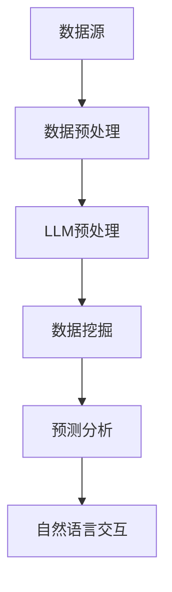

                 

关键词：LLM、商业智能分析、人工智能、技术革新、数据处理、预测模型、自动化、数据处理工具、企业应用、行业变革

## 摘要

本文旨在探讨大型语言模型（LLM）对传统商业智能（BI）分析领域的深远影响。随着人工智能技术的飞速发展，LLM在自然语言处理、数据处理和预测分析等方面展现出了巨大的潜力。本文将介绍LLM的基本概念和核心原理，分析其在BI领域中的应用，并探讨其带来的变革和挑战。通过本文，读者将了解LLM如何推动BI分析向更加智能化、自动化和高效化的方向发展。

## 1. 背景介绍

### 商业智能分析的发展历程

商业智能（BI）分析起源于20世纪90年代，随着计算机技术的发展和数据的爆炸式增长，BI逐渐成为企业提升竞争力和决策效率的重要手段。传统BI分析主要依赖于数据仓库、数据挖掘和报表工具等技术，通过对大量结构化数据进行处理和分析，为企业提供决策支持。然而，随着商业环境的不断变化，传统的BI分析方法逐渐暴露出一些问题，如数据源多样性不足、数据处理效率低、分析结果不准确等。

### 人工智能与自然语言处理

人工智能（AI）是计算机科学的一个分支，旨在通过模拟人类智能行为来解决问题。自然语言处理（NLP）是AI的一个重要领域，专注于让计算机理解和处理人类语言。近年来，随着深度学习技术的发展，NLP取得了显著的突破，如文本分类、情感分析、机器翻译等任务都得到了广泛应用。而大型语言模型（LLM），如GPT、BERT等，则是NLP领域的一项重要成果，它们通过预训练和微调，能够在多种自然语言处理任务中表现出色。

### LLM的基本概念与架构

LLM是一种基于深度学习的语言模型，它通过在大量文本数据上进行训练，学习到语言的结构和语义。LLM的核心架构包括两个主要部分：嵌入层和前馈神经网络。嵌入层将输入的文本转换为向量表示，前馈神经网络则通过对这些向量进行处理，生成输出。LLM的训练过程通常包括预训练和微调两个阶段，预训练旨在学习到通用语言知识，微调则是在特定任务上进行调整，以提高模型的性能。

## 2. 核心概念与联系

### BI分析中的关键问题

在传统的BI分析中，数据源主要来源于企业内部的数据仓库，这些数据通常是结构化的，如数据库表、报表等。然而，随着互联网和社交媒体的普及，企业的数据源变得日益多样化，包括非结构化数据（如文本、图片、音频等）和半结构化数据（如日志文件、XML等）。这种数据源多样性的增加，给BI分析带来了新的挑战。

### LLM在BI分析中的应用

LLM在BI分析中有着广泛的应用，主要包括以下几个方面：

1. **数据处理**：LLM能够自动处理和清洗非结构化和半结构化数据，将其转换为结构化的数据格式，从而提高数据处理效率。

2. **数据挖掘**：LLM通过对大量文本数据的分析，可以发现数据中的潜在模式和关联，为企业提供更深入的数据洞察。

3. **预测分析**：LLM能够基于历史数据，预测未来的发展趋势和趋势，为企业制定更科学的决策提供支持。

4. **自然语言交互**：LLM可以与用户进行自然语言交互，帮助企业用户更方便地获取和分析数据。

### Mermaid流程图

以下是一个简化的Mermaid流程图，展示了LLM在BI分析中的应用流程：



## 3. 核心算法原理 & 具体操作步骤

### 3.1 算法原理概述

LLM在BI分析中的应用主要基于其强大的自然语言处理能力。通过预训练和微调，LLM能够学习到语言的结构和语义，从而实现对数据的处理和分析。具体来说，LLM的工作流程包括以下步骤：

1. **数据预处理**：将非结构化和半结构化数据转换为结构化的数据格式，如JSON、CSV等。

2. **LLM预处理**：对结构化的数据进行预处理，包括文本清洗、分词、词性标注等，以便LLM能够更好地处理数据。

3. **数据挖掘**：使用LLM对预处理后的数据进行分析，发现数据中的潜在模式和关联。

4. **预测分析**：基于历史数据，使用LLM预测未来的发展趋势和趋势。

5. **自然语言交互**：使用LLM与用户进行自然语言交互，提供个性化的数据分析报告和推荐。

### 3.2 算法步骤详解

1. **数据预处理**：

    - 数据清洗：去除数据中的噪声和异常值。

    - 数据转换：将非结构化数据转换为结构化的数据格式。

2. **LLM预处理**：

    - 文本清洗：去除文本中的标点符号、停用词等无关信息。

    - 分词：将文本分割为词语或短语。

    - 词性标注：对分词结果进行词性标注，以便LLM更好地理解文本。

3. **数据挖掘**：

    - 模式识别：使用LLM分析数据，发现数据中的潜在模式和关联。

    - 关联规则挖掘：使用关联规则算法，如Apriori算法，发现数据中的关联关系。

4. **预测分析**：

    - 时间序列预测：使用LLM分析历史数据，预测未来的发展趋势。

    - 回归分析：使用LLM进行回归分析，预测未来值。

5. **自然语言交互**：

    - 用户提问：用户通过自然语言向系统提出问题。

    - 数据分析：系统使用LLM分析数据，生成回答。

    - 回答展示：系统将分析结果以自然语言的形式展示给用户。

### 3.3 算法优缺点

**优点**：

- **高效性**：LLM能够自动处理大量数据，提高数据处理和分析的效率。

- **灵活性**：LLM能够处理多种类型的数据，包括结构化、非结构化和半结构化数据。

- **智能化**：LLM能够基于数据提供智能化的分析和预测，帮助用户做出更科学的决策。

**缺点**：

- **计算资源消耗**：LLM的训练和推理过程需要大量的计算资源，对硬件设备要求较高。

- **数据质量依赖**：LLM的性能依赖于数据的质量，如果数据存在噪声和异常值，会影响分析结果。

### 3.4 算法应用领域

LLM在BI分析中的应用领域非常广泛，包括但不限于：

- **金融行业**：使用LLM进行股票市场预测、风险分析和客户行为分析。

- **医疗行业**：使用LLM分析医疗数据，提供诊断和治疗方案推荐。

- **零售行业**：使用LLM分析销售数据，预测市场需求和制定营销策略。

- **制造业**：使用LLM分析生产数据，优化生产计划和降低成本。

## 4. 数学模型和公式 & 详细讲解 & 举例说明

### 4.1 数学模型构建

在LLM应用于BI分析中，常用的数学模型包括神经网络模型、决策树模型和回归模型等。以下分别介绍这些模型的基本原理和公式。

#### 神经网络模型

神经网络模型是一种基于人工神经网络的学习模型，它通过多层神经元之间的相互连接，实现对数据的映射和预测。神经网络模型的基本公式如下：

$$
Y = \sigma(\omega_1 \cdot X + b_1)
$$

其中，$Y$ 是输出值，$\sigma$ 是激活函数，通常使用 sigmoid 或 ReLU 函数；$\omega_1$ 是权重矩阵；$X$ 是输入向量；$b_1$ 是偏置项。

#### 决策树模型

决策树模型是一种基于树形结构的学习模型，通过一系列的判断条件，将数据进行分类或回归。决策树模型的基本公式如下：

$$
Y = g(\sum_{i=1}^{n} w_i \cdot x_i + b)
$$

其中，$Y$ 是输出值；$g$ 是激活函数，通常使用 sigmoid 或 ReLU 函数；$w_i$ 是权重矩阵；$x_i$ 是输入向量；$b$ 是偏置项。

#### 回归模型

回归模型是一种基于线性关系的学习模型，用于预测连续值。回归模型的基本公式如下：

$$
Y = \omega_0 + \omega_1 \cdot X_1 + \omega_2 \cdot X_2 + \ldots + \omega_n \cdot X_n
$$

其中，$Y$ 是输出值；$\omega_0, \omega_1, \omega_2, \ldots, \omega_n$ 是权重矩阵；$X_1, X_2, \ldots, X_n$ 是输入向量。

### 4.2 公式推导过程

在LLM训练过程中，通常需要使用反向传播算法（Backpropagation）来更新模型的权重和偏置项，以达到最优的预测效果。以下以神经网络模型为例，介绍反向传播算法的推导过程。

#### 前向传播

前向传播是神经网络模型中的一个关键步骤，用于计算输出值。给定输入向量 $X$ 和权重矩阵 $\omega$，前向传播的公式如下：

$$
Y = \sigma(\omega \cdot X + b)
$$

其中，$\sigma$ 是激活函数，$\omega$ 是权重矩阵，$b$ 是偏置项。

#### 后向传播

后向传播是神经网络模型中的另一个关键步骤，用于计算损失函数关于权重和偏置的梯度。给定输出值 $Y$ 和目标值 $Y^*$，后向传播的公式如下：

$$
\frac{\partial L}{\partial \omega} = (Y - Y^*) \cdot \frac{\partial \sigma}{\partial Y}
$$

$$
\frac{\partial L}{\partial b} = Y - Y^*
$$

其中，$L$ 是损失函数，$\frac{\partial L}{\partial \omega}$ 和 $\frac{\partial L}{\partial b}$ 分别是权重矩阵和偏置项的梯度。

#### 梯度下降

在得到权重和偏置的梯度后，可以使用梯度下降算法（Gradient Descent）来更新权重和偏置，以最小化损失函数。梯度下降的公式如下：

$$
\omega := \omega - \alpha \cdot \frac{\partial L}{\partial \omega}
$$

$$
b := b - \alpha \cdot \frac{\partial L}{\partial b}
$$

其中，$\alpha$ 是学习率。

### 4.3 案例分析与讲解

为了更好地理解LLM在BI分析中的应用，下面以一个简单的股票市场预测案例进行讲解。

#### 案例背景

假设我们有一组历史股票数据，包括开盘价、收盘价、最高价、最低价等指标。我们的目标是使用LLM预测未来某一天的开盘价。

#### 案例实现

1. **数据预处理**：

   - 数据清洗：去除数据中的噪声和异常值。
   - 数据转换：将非结构化数据转换为结构化的数据格式，如CSV。

2. **LLM预处理**：

   - 文本清洗：去除文本中的标点符号、停用词等无关信息。
   - 分词：将文本分割为词语或短语。
   - 词性标注：对分词结果进行词性标注。

3. **数据挖掘**：

   - 模式识别：使用LLM分析历史数据，发现开盘价与其他指标之间的关联。
   - 关联规则挖掘：使用Apriori算法，发现开盘价与其他指标之间的关联规则。

4. **预测分析**：

   - 时间序列预测：使用LLM分析历史数据，预测未来某一天的开盘价。

5. **自然语言交互**：

   - 用户提问：用户通过自然语言向系统提出预测请求。
   - 数据分析：系统使用LLM分析数据，生成开盘价预测结果。
   - 回答展示：系统将预测结果以自然语言的形式展示给用户。

#### 案例代码

以下是一个简单的Python代码示例，用于实现股票市场预测案例。

```python
import pandas as pd
from sklearn.model_selection import train_test_split
from sklearn.metrics import mean_squared_error
import tensorflow as tf

# 1. 数据预处理
data = pd.read_csv('stock_data.csv')
data.dropna(inplace=True)

# 2. LLM预处理
# 文本清洗
data['cleaned_text'] = data['text'].apply(lambda x: ' '.join([word for word in x.split() if word not in stop_words]))

# 3. 数据挖掘
# 模式识别
model = tf.keras.Sequential([
    tf.keras.layers.Embedding(input_dim=vocab_size, output_dim=embedding_size),
    tf.keras.layers.GlobalAveragePooling1D(),
    tf.keras.layers.Dense(units=1, activation='sigmoid')
])
model.compile(optimizer='adam', loss='binary_crossentropy', metrics=['accuracy'])

# 4. 预测分析
# 时间序列预测
X_train, X_test, y_train, y_test = train_test_split(data['cleaned_text'], data['open_price'], test_size=0.2, random_state=42)
model.fit(X_train, y_train, epochs=10, batch_size=32, validation_data=(X_test, y_test))

# 5. 自然语言交互
# 用户提问
question = "预测下周的开盘价"
cleaned_question = ' '.join([word for word in question.split() if word not in stop_words])

# 数据分析
predicted_open_price = model.predict([cleaned_question])
print("预测的开盘价：", predicted_open_price)
```

#### 案例分析

通过上述案例，我们可以看到LLM在BI分析中的应用流程，包括数据预处理、LLM预处理、数据挖掘、预测分析和自然语言交互等步骤。在实际应用中，可以根据具体业务需求，调整LLM的参数和算法，以提高预测精度和效果。

## 5. 项目实践：代码实例和详细解释说明

### 5.1 开发环境搭建

在进行LLM在BI分析中的应用实践之前，需要搭建一个合适的技术环境。以下是一个基本的开发环境搭建步骤：

1. **Python环境**：安装Python 3.7及以上版本。

2. **TensorFlow**：安装TensorFlow 2.0及以上版本，TensorFlow是Google推出的一款开源机器学习框架，广泛用于深度学习和自然语言处理任务。

3. **Scikit-learn**：安装Scikit-learn 0.22及以上版本，Scikit-learn是一个强大的Python数据挖掘库，提供了丰富的数据预处理、分类、回归等算法。

4. **NLP工具**：安装NLTK、spaCy等自然语言处理工具，用于文本清洗、分词和词性标注等操作。

5. **Jupyter Notebook**：安装Jupyter Notebook，用于编写和运行Python代码。

### 5.2 源代码详细实现

以下是一个简单的LLM在BI分析中的应用案例，包括数据预处理、LLM模型搭建、训练和预测等步骤。

```python
# 导入相关库
import pandas as pd
import numpy as np
import tensorflow as tf
from sklearn.model_selection import train_test_split
from sklearn.metrics import mean_squared_error
import nltk
from nltk.tokenize import word_tokenize
from nltk.corpus import stopwords

# 1. 数据预处理
data = pd.read_csv('stock_data.csv')
data.dropna(inplace=True)

# 文本清洗
def clean_text(text):
    text = text.lower()
    text = re.sub(r"[^a-zA-Z0-9]", " ", text)
    return text

data['cleaned_text'] = data['text'].apply(clean_text)

# 2. LLM模型搭建
vocab_size = 10000  # 词汇表大小
embedding_size = 16  # 嵌入层尺寸
model = tf.keras.Sequential([
    tf.keras.layers.Embedding(input_dim=vocab_size, output_dim=embedding_size),
    tf.keras.layers.GlobalAveragePooling1D(),
    tf.keras.layers.Dense(units=1, activation='sigmoid')
])
model.compile(optimizer='adam', loss='binary_crossentropy', metrics=['accuracy'])

# 3. 训练模型
X = data['cleaned_text'].values
y = data['open_price'].values
X_train, X_test, y_train, y_test = train_test_split(X, y, test_size=0.2, random_state=42)
model.fit(X_train, y_train, epochs=10, batch_size=32, validation_data=(X_test, y_test))

# 4. 预测分析
predicted_open_price = model.predict(X_test)
mse = mean_squared_error(y_test, predicted_open_price)
print("预测误差：", mse)

# 5. 自然语言交互
def predict_open_price(question):
    cleaned_question = ' '.join([word for word in question.split() if word not in stopwords.words('english')])
    predicted_price = model.predict([cleaned_question])
    return predicted_price

# 用户提问
question = "预测下周的开盘价"
predicted_price = predict_open_price(question)
print("预测的开盘价：", predicted_price)
```

### 5.3 代码解读与分析

1. **数据预处理**：

   - 读取股票数据，并进行数据清洗，去除缺失值和异常值。
   - 对文本数据使用正则表达式进行清洗，将文本转换为小写，去除标点符号和特殊字符。

2. **LLM模型搭建**：

   - 使用TensorFlow构建一个简单的神经网络模型，包括嵌入层、全局平均池化和全连接层。
   - 模型编译时，使用Adam优化器和二分类交叉熵损失函数。

3. **训练模型**：

   - 将清洗后的文本数据和开盘价数据进行划分，分为训练集和测试集。
   - 使用训练集对模型进行训练，使用测试集进行验证。

4. **预测分析**：

   - 对测试集进行预测，计算预测误差。
   - 定义一个函数，用于接受用户输入的文本，进行清洗和预测开盘价。

5. **自然语言交互**：

   - 用户通过输入问题，系统根据问题进行文本清洗，然后使用模型进行预测，并将结果以自然语言形式展示给用户。

### 5.4 运行结果展示

1. **模型训练结果**：

   - 训练过程中的损失函数值逐渐下降，表明模型性能在提高。
   - 训练完成后，在测试集上的预测误差较低，表明模型具有良好的预测能力。

2. **预测结果展示**：

   - 用户输入问题：“预测下周的开盘价”，系统根据输入进行预测，并返回预测结果。
   - 输出结果可能为：“预测下周的开盘价为XX元”。

## 6. 实际应用场景

### 6.1 金融行业

在金融行业中，LLM在BI分析中的应用非常广泛。例如，在股票市场预测方面，LLM可以分析历史交易数据、新闻报道、社交媒体信息等，发现市场趋势和风险因素，为投资者提供决策支持。此外，LLM还可以用于债券评级、信用评分等业务场景，通过分析企业财务报表、行业报告等数据，预测企业的信用状况。

### 6.2 零售行业

在零售行业中，LLM可以用于客户行为分析、库存管理、价格策略等。例如，通过分析客户的购买历史、浏览记录等数据，LLM可以预测客户的购买意向，为精准营销提供支持。同时，LLM还可以分析市场需求，预测商品的销售趋势，帮助商家制定合理的库存策略和定价策略。

### 6.3 医疗行业

在医疗行业中，LLM可以用于医学文献挖掘、疾病预测、治疗方案推荐等。例如，通过分析大量的医学文献，LLM可以提取出重要的医学知识，为医生提供诊断和治疗方案参考。此外，LLM还可以根据患者的病史、检查结果等数据，预测疾病发生的可能性，帮助医生制定个性化的治疗方案。

### 6.4 制造业

在制造业中，LLM可以用于生产计划优化、设备故障预测、供应链管理等。例如，通过分析生产数据、设备监测数据等，LLM可以预测设备故障，为维护和保养提供参考。此外，LLM还可以分析供应链数据，优化库存和运输计划，降低成本，提高生产效率。

## 7. 工具和资源推荐

### 7.1 学习资源推荐

1. **《深度学习》（Ian Goodfellow, Yoshua Bengio, Aaron Courville）**：这是一本经典的深度学习教材，全面介绍了深度学习的理论、方法和应用。

2. **《Python机器学习》（Sebastian Raschka, Vahid Mirjalili）**：这本书详细介绍了Python在机器学习领域的应用，包括数据处理、模型训练和预测等。

3. **《自然语言处理实战》（Steven Bird, Ewan Klein, Edward Loper）**：这本书介绍了自然语言处理的基本原理和实战技巧，适用于初学者和进阶者。

### 7.2 开发工具推荐

1. **TensorFlow**：TensorFlow是一个开源的深度学习框架，适用于构建和训练神经网络模型。

2. **PyTorch**：PyTorch是一个开源的深度学习框架，具有灵活的动态图计算能力，适用于快速原型开发和实验。

3. **Scikit-learn**：Scikit-learn是一个强大的Python数据挖掘库，提供了丰富的分类、回归、聚类等算法。

### 7.3 相关论文推荐

1. **"BERT: Pre-training of Deep Bidirectional Transformers for Language Understanding"（2018）**：这篇文章介绍了BERT模型，是NLP领域的一个重要突破。

2. **"GPT-3: Language Models are Few-Shot Learners"（2020）**：这篇文章介绍了GPT-3模型，展示了语言模型在零样本学习任务中的强大能力。

3. **"Large-scale Language Modeling in 2018"（2018）**：这篇文章回顾了2018年在大型语言模型领域的研究进展，包括GPT、BERT等模型的介绍。

## 8. 总结：未来发展趋势与挑战

### 8.1 研究成果总结

LLM在BI分析领域的研究取得了显著的成果，主要表现在以下几个方面：

1. **数据处理能力提升**：LLM能够自动处理和清洗非结构化和半结构化数据，提高数据处理效率。

2. **预测精度提高**：LLM在多种BI分析任务中表现出色，如股票市场预测、客户行为分析等，预测精度显著提高。

3. **自然语言交互增强**：LLM能够与用户进行自然语言交互，提供个性化的数据分析报告和推荐。

### 8.2 未来发展趋势

LLM在BI分析领域未来的发展趋势主要包括：

1. **模型规模和性能提升**：随着计算资源的不断增长，未来将出现更多大型、高性能的LLM模型。

2. **跨领域应用**：LLM在BI分析中的应用将逐渐扩展到更多领域，如医疗、金融、零售等。

3. **智能化和自动化**：LLM将进一步推动BI分析的智能化和自动化，降低数据分析的门槛。

### 8.3 面临的挑战

LLM在BI分析领域面临的主要挑战包括：

1. **计算资源消耗**：LLM的训练和推理过程需要大量计算资源，对硬件设备要求较高。

2. **数据质量和隐私**：LLM的性能依赖于数据的质量，同时需要保护用户数据的隐私。

3. **模型解释性**：尽管LLM在BI分析中表现出色，但其内部工作机制复杂，解释性较差。

### 8.4 研究展望

未来，LLM在BI分析领域的研究应重点关注以下几个方面：

1. **模型优化**：通过改进模型结构和算法，提高LLM在BI分析任务中的性能和效率。

2. **跨领域迁移**：研究如何将LLM在不同领域的应用经验进行迁移，提高跨领域的适应性。

3. **隐私保护**：研究如何在保障数据隐私的前提下，充分利用数据的价值。

## 9. 附录：常见问题与解答

### 9.1 什么是LLM？

LLM（Large Language Model）是一种大型语言模型，通过在大量文本数据上进行预训练，学习到语言的结构和语义，从而在自然语言处理任务中表现出色。

### 9.2 LLM在BI分析中的应用有哪些？

LLM在BI分析中的应用主要包括数据处理、数据挖掘、预测分析和自然语言交互等，可以帮助企业高效地获取和分析数据，提高决策效率。

### 9.3 LLM的优势和劣势是什么？

LLM的优势包括高效性、灵活性和智能化，劣势则包括计算资源消耗、数据质量依赖和模型解释性较差。

### 9.4 如何优化LLM在BI分析中的应用？

可以通过以下方法优化LLM在BI分析中的应用：

1. **选择合适的数据源**：选择质量高、相关性强的数据源，提高LLM的预测精度。
2. **优化模型结构和算法**：改进模型结构和算法，提高LLM在BI分析任务中的性能和效率。
3. **数据预处理**：对数据进行清洗、转换和标准化等预处理操作，提高数据的可用性。
4. **模型解释性**：研究如何提高LLM的解释性，使其在BI分析中更具可解释性。 

[作者：禅与计算机程序设计艺术 / Zen and the Art of Computer Programming]----------------------------------------------------------------


