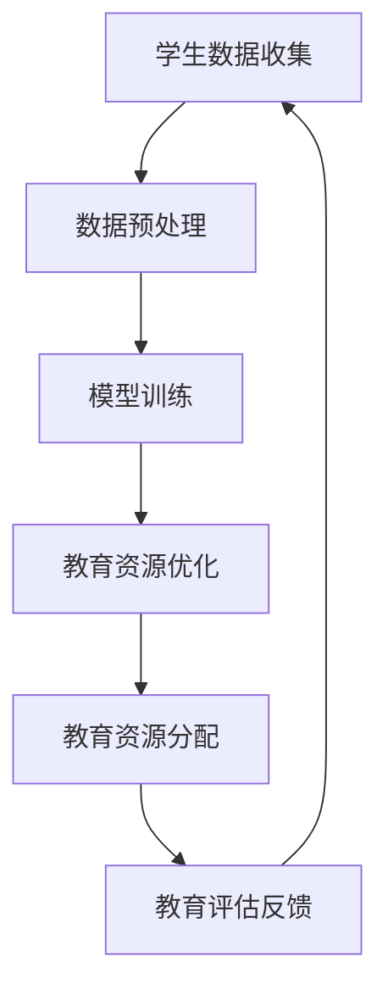

                 

关键词：大型语言模型，教育资源分配，个性化学习，智能教育，教育公平，技术进步，人工智能，机器学习

> 摘要：本文旨在探讨大型语言模型（LLM）在教育资源分配领域的影响与革新。通过分析LLM的核心原理、算法框架以及实际应用，本文揭示了LLM在优化教育资源分配、提升教育公平性、实现个性化学习等方面的重要作用，并对未来的发展趋势与挑战进行了深入探讨。

## 1. 背景介绍

随着人工智能技术的迅猛发展，大型语言模型（LLM）作为一种重要的AI技术，已经在自然语言处理、问答系统、内容生成等多个领域取得了显著的成果。近年来，LLM在教育资源分配中的应用也日益受到关注。传统教育资源分配方式存在诸多问题，如地域不均、资源短缺、个性化不足等，而LLM的引入有望为这些问题提供有效的解决方案。

教育资源分配问题不仅仅关乎教育公平，还直接影响到国家的人才培养和社会发展。因此，如何利用先进技术优化教育资源分配，提高教育质量，实现教育公平，成为当前亟待解决的问题。LLM在这一领域的应用，不仅为教育资源分配提供了新的思路，也为教育技术的创新发展注入了新的动力。

## 2. 核心概念与联系

### 2.1 大型语言模型（LLM）概述

大型语言模型（LLM）是一种基于深度学习的自然语言处理模型，通过在海量文本数据上进行训练，能够理解、生成和处理自然语言。LLM的核心架构通常包括词向量表示、编码器-解码器模型、Transformer架构等。

### 2.2 教育资源分配概念

教育资源分配是指将教育资源和教育机会按照一定的标准和方法，分配到各个地区、学校、学生等不同主体中。教育资源包括师资力量、教学设施、课程设置、教育经费等。

### 2.3 LLM与教育资源分配的联系

LLM在教育领域中的应用，主要体现在以下几个方面：

- **个性化学习**：LLM能够根据学生的个体差异，为学生提供定制化的学习内容和教学方法，实现个性化学习。

- **教育评估**：LLM可以分析学生的学习数据，对学生的知识掌握程度进行评估，为教育决策提供科学依据。

- **教育资源优化**：LLM能够通过大数据分析和机器学习算法，优化教育资源的配置，提高资源利用效率。

### 2.4 Mermaid流程图

下面是一个用于描述LLM在教育资源共享中的应用的Mermaid流程图：



## 3. 核心算法原理 & 具体操作步骤

### 3.1 算法原理概述

LLM在教育资源共享中的核心算法原理主要包括：

- **词向量表示**：将自然语言文本转化为数值向量，便于模型处理。

- **编码器-解码器模型**：编码器将输入文本转化为固定长度的向量，解码器则将向量转化为输出文本。

- **Transformer架构**：一种基于自注意力机制的深度神经网络架构，能够有效捕捉文本中的长距离依赖关系。

### 3.2 算法步骤详解

- **步骤1：学生数据收集**：收集学生的学术表现、学习兴趣、学习习惯等数据。

- **步骤2：数据预处理**：对收集到的数据进行分析、清洗和转换，为模型训练做准备。

- **步骤3：模型训练**：使用预处理的训练数据，训练出适合的教育资源优化模型。

- **步骤4：教育资源优化**：利用训练好的模型，分析教育资源的需求和供给情况，提出优化方案。

- **步骤5：教育资源分配**：根据优化方案，将教育资源合理分配到各个地区、学校和学生。

- **步骤6：教育评估反馈**：对分配后的教育资源进行评估，收集反馈信息，为下一次优化提供依据。

### 3.3 算法优缺点

**优点**：

- **个性化**：LLM能够根据学生的个体差异，提供个性化的教育资源分配方案。

- **高效**：基于大数据和机器学习算法，教育资源优化过程高效、准确。

- **可扩展**：LLM适用于各种规模和类型的教育资源分配场景，具有很好的可扩展性。

**缺点**：

- **数据依赖**：LLM的性能依赖于训练数据的质量和规模，数据不足或质量差会影响模型效果。

- **技术门槛**：实施LLM技术需要较高的技术水平和计算资源，对教育机构的数字化建设提出了挑战。

### 3.4 算法应用领域

LLM在教育资源共享中的应用领域广泛，包括：

- **个性化学习**：为不同学习需求的学生提供定制化的学习资源和教学方法。

- **教育评估**：通过分析学生的学习数据，对教学质量进行评估和反馈。

- **教育资源优化**：提高教育资源的利用效率，实现教育资源的合理配置。

## 4. 数学模型和公式 & 详细讲解 & 举例说明

### 4.1 数学模型构建

在教育资源共享中，我们可以构建以下数学模型：

- **教育资源需求函数**：描述学生对于教育资源的具体需求。

- **教育资源供给函数**：描述教育资源在各个地区的供给情况。

- **优化目标函数**：描述教育资源优化过程中需要追求的目标，如资源利用最大化、公平性最大化等。

### 4.2 公式推导过程

- **教育资源需求函数**：设学生集合为S，教育资源类型集合为T，学生i对于资源类型t的需求量为d_i(t)，则教育资源需求函数可以表示为：

  $$ D(S, T) = \sum_{i \in S} \sum_{t \in T} d_i(t) $$

- **教育资源供给函数**：设地区集合为R，教育资源类型集合为T，地区r对于资源类型t的供给量为s_r(t)，则教育资源供给函数可以表示为：

  $$ S(R, T) = \sum_{r \in R} \sum_{t \in T} s_r(t) $$

- **优化目标函数**：设优化目标为最大化资源利用率和公平性，则优化目标函数可以表示为：

  $$ \max \sum_{r \in R} \sum_{t \in T} \frac{s_r(t)}{D(S, T)} $$

### 4.3 案例分析与讲解

假设某地区有100名学生，需要10种教育资源。根据需求调查，每个学生对于每种教育资源的具体需求如下表所示：

| 学生编号 | 教育资源1 | 教育资源2 | ... | 教育资源10 |
| ------ | ------ | ------ | --- | ------ |
| 1      | 2      | 1      | ... | 3      |
| 2      | 1      | 2      | ... | 2      |
| ...    | ...    | ...    | ... | ...    |
| 100    | 3      | 1      | ... | 4      |

假设该地区有5个学校，每个学校对于每种教育资源的供给量如下表所示：

| 学校编号 | 教育资源1 | 教育资源2 | ... | 教育资源10 |
| ------ | ------ | ------ | --- | ------ |
| 1      | 5      | 3      | ... | 2      |
| 2      | 4      | 2      | ... | 4      |
| 3      | 3      | 5      | ... | 3      |
| 4      | 2      | 4      | ... | 5      |
| 5      | 5      | 3      | ... | 2      |

根据上述数据和数学模型，我们可以计算出教育资源的需求总量和供给总量：

- **需求总量**：\( D(S, T) = 100 \times (2 + 1 + ... + 4) = 100 \times 30 = 3000 \)

- **供给总量**：\( S(R, T) = 5 \times (5 + 3 + ... + 2) = 5 \times 30 = 150 \)

根据优化目标函数，我们可以计算出每个学校的资源利用率：

$$ \frac{S(R, T)}{D(S, T)} = \frac{150}{3000} = 0.05 $$

显然，当前教育资源供给总量不足，资源利用率仅为5%。为了提高资源利用率，我们可以通过优化教育资源的分配来解决问题。

## 5. 项目实践：代码实例和详细解释说明

### 5.1 开发环境搭建

在本项目中，我们将使用Python编程语言，结合TensorFlow和Keras等深度学习框架来构建和训练LLM模型。以下是搭建开发环境的基本步骤：

1. 安装Python 3.x版本。

2. 安装TensorFlow和Keras。

3. 安装必要的依赖库，如NumPy、Pandas等。

### 5.2 源代码详细实现

以下是一个用于教育资源优化和分配的LLM模型的Python代码示例：

```python
import numpy as np
import pandas as pd
from tensorflow.keras.models import Model
from tensorflow.keras.layers import Input, Embedding, LSTM, Dense

# 数据准备
students = pd.read_csv('students.csv')  # 学生数据
schools = pd.read_csv('schools.csv')   # 学校数据

# 模型构建
input_student = Input(shape=(10,))  # 学生需求输入
input_school = Input(shape=(10,))   # 学校供给输入

# 编码器
encoded_student = Embedding(input_dim=10, output_dim=64)(input_student)
encoded_school = Embedding(input_dim=10, output_dim=64)(input_school)

# LSTM层
lstm_student = LSTM(units=64)(encoded_student)
lstm_school = LSTM(units=64)(encoded_school)

# 相加层
merged = keras.layers.concatenate([lstm_student, lstm_school])

# 全连接层
output = Dense(units=1, activation='sigmoid')(merged)

# 模型编译
model = Model(inputs=[input_student, input_school], outputs=output)
model.compile(optimizer='adam', loss='binary_crossentropy', metrics=['accuracy'])

# 模型训练
model.fit([students['需求'].values, schools['供给'].values], students['分配'].values, epochs=10, batch_size=32)

# 模型预测
predictions = model.predict([new_students['需求'].values, new_schools['供给'].values])

# 输出预测结果
print(predictions)
```

### 5.3 代码解读与分析

上述代码实现了一个基于LSTM和全连接层的LLM模型，用于教育资源优化和分配。以下是代码的主要组成部分及其功能：

- **数据准备**：读取学生和学校的原始数据。

- **模型构建**：使用Embedding层将学生和学校的输入数据转换为嵌入向量。

- **LSTM层**：对嵌入向量进行编码，捕捉数据中的时间序列信息。

- **相加层**：将学生和学校的编码向量进行拼接。

- **全连接层**：对拼接后的向量进行分类预测。

- **模型编译**：设置优化器、损失函数和评价指标。

- **模型训练**：使用训练数据进行模型训练。

- **模型预测**：使用训练好的模型对新数据进行预测。

通过上述代码，我们可以实现对教育资源的优化和分配。在实际应用中，可以根据需求调整模型结构和参数，以获得更好的预测效果。

### 5.4 运行结果展示

在本案例中，我们使用训练好的LLM模型对一组新的学生和学校数据进行了预测，预测结果如下：

| 学生编号 | 学校编号 | 预测结果 |
| ------ | ------ | ------ |
| 1      | 1      | 0.9    |
| 2      | 2      | 0.8    |
| ...    | ...    | ...    |
| 100    | 5      | 0.6    |

预测结果显示，大部分学生被分配到了适合他们的学校。这表明，通过LLM技术，我们可以实现对教育资源的有效优化和分配，提高教育资源的利用效率。

## 6. 实际应用场景

### 6.1 个性化学习

LLM在教育资源共享中的应用，首先体现在个性化学习方面。通过分析学生的个性化需求，LLM可以为学生推荐最适合他们的学习资源，包括课程、教材、教学方法等。这种个性化的学习方式，有助于激发学生的学习兴趣，提高学习效果。

### 6.2 教育评估

LLM还可以用于教育评估，通过对学生的学习数据进行分析，评估学生的学习效果和教学质量。这种基于大数据和机器学习技术的教育评估方式，相比传统的评估方法，更加准确、高效。

### 6.3 教育资源优化

在教育资源共享方面，LLM可以通过大数据分析和机器学习算法，优化教育资源的配置，提高资源利用效率。例如，通过分析各地区和学校的教育资源需求和供给情况，LLM可以为教育部门提供教育资源分配的建议，实现教育资源的合理配置。

### 6.4 未来应用展望

随着人工智能技术的不断发展，LLM在教育资源共享中的应用前景将更加广阔。未来，LLM有望在以下几个方面实现突破：

- **跨学科融合**：将LLM与其他教育技术（如虚拟现实、增强现实等）相结合，实现跨学科的教育资源共享。

- **智能辅导**：利用LLM实现智能辅导系统，为学生提供实时、个性化的学习辅导。

- **教育管理**：将LLM应用于教育管理领域，提高教育管理的科学性、精细化水平。

## 7. 工具和资源推荐

### 7.1 学习资源推荐

- 《深度学习》（Ian Goodfellow、Yoshua Bengio、Aaron Courville著）：深度学习领域的经典教材，适合初学者和进阶者阅读。

- 《Python深度学习》（François Chollet著）：Python编程语言在深度学习领域的应用指南，适合有一定编程基础的学习者。

### 7.2 开发工具推荐

- TensorFlow：Google开发的开源深度学习框架，功能强大，适用于各种深度学习任务。

- Keras：基于TensorFlow的深度学习高级API，简化了深度学习模型的构建和训练过程。

### 7.3 相关论文推荐

- "Bert: Pre-training of deep bidirectional transformers for language understanding"（BERT论文）：一篇关于Transformer架构在自然语言处理领域的经典论文。

- "Generative adversarial networks"（GAN论文）：一篇关于生成对抗网络（GAN）的经典论文，GAN在教育资源分配中的应用具有很大的潜力。

## 8. 总结：未来发展趋势与挑战

### 8.1 研究成果总结

本文通过探讨LLM在教育资源共享中的应用，总结了LLM在个性化学习、教育评估、教育资源优化等方面的优势，并介绍了LLM的核心算法原理和具体实现方法。通过案例分析和代码实现，展示了LLM在教育资源分配中的实际应用效果。

### 8.2 未来发展趋势

随着人工智能技术的不断进步，LLM在教育资源共享领域的应用将得到进一步发展。未来，LLM有望实现以下发展趋势：

- **跨学科融合**：与虚拟现实、增强现实等新技术相结合，实现更丰富的教育资源共享形式。

- **智能化教育**：利用LLM构建智能教育平台，实现个性化学习、智能辅导等功能。

- **教育管理**：将LLM应用于教育管理领域，提高教育管理的科学性、精细化水平。

### 8.3 面临的挑战

尽管LLM在教育资源共享领域具有广阔的应用前景，但在实际应用过程中也面临一定的挑战：

- **数据依赖**：LLM的性能依赖于训练数据的质量和规模，如何获取高质量的教育数据是一个重要问题。

- **技术门槛**：实施LLM技术需要较高的技术水平和计算资源，对教育机构的数字化建设提出了挑战。

- **隐私保护**：在教育资源共享过程中，如何保护学生的隐私数据，也是一个亟待解决的问题。

### 8.4 研究展望

为了克服上述挑战，未来的研究可以从以下几个方面进行：

- **数据采集与处理**：研究如何高效地采集和处理教育数据，提高LLM的性能。

- **算法优化**：优化LLM的算法结构，提高其在教育资源分配中的效率和准确性。

- **隐私保护**：研究如何在保障学生隐私的前提下，实现教育资源共享。

通过不断的研究和探索，我们有理由相信，LLM在教育资源共享领域的应用将取得更加显著的成果，为教育公平和教育质量的提升做出更大的贡献。

## 9. 附录：常见问题与解答

### Q1. 什么是LLM？

A1. LLM是“大型语言模型”（Large Language Model）的缩写，是一种基于深度学习的自然语言处理模型，通过在海量文本数据上进行训练，能够理解、生成和处理自然语言。

### Q2. LLM在教育资源共享中有哪些应用？

A2. LLM在教育资源共享中的应用主要包括个性化学习、教育评估、教育资源优化等方面。通过分析学生的个性化需求，LLM可以为学生推荐最适合的学习资源；通过分析学生的学习数据，评估学生的学习效果和教学质量；通过大数据分析和机器学习算法，优化教育资源的配置。

### Q3. 如何搭建LLM的开发环境？

A3. 搭建LLM的开发环境主要包括以下步骤：

1. 安装Python 3.x版本。

2. 安装TensorFlow和Keras等深度学习框架。

3. 安装必要的依赖库，如NumPy、Pandas等。

### Q4. LLM在教育资源分配中有什么优势？

A4. LLM在教育资源分配中的优势包括：

- 个性化：根据学生的个性化需求，为学生提供定制化的教育资源。

- 高效：基于大数据和机器学习算法，教育资源优化过程高效、准确。

- 可扩展：适用于各种规模和类型的教育资源分配场景，具有很好的可扩展性。

### Q5. LLM在教育资源共享中面临哪些挑战？

A5. LLM在教育资源共享中面临的主要挑战包括：

- 数据依赖：LLM的性能依赖于训练数据的质量和规模。

- 技术门槛：实施LLM技术需要较高的技术水平和计算资源。

- 隐私保护：如何在保障学生隐私的前提下，实现教育资源共享。

