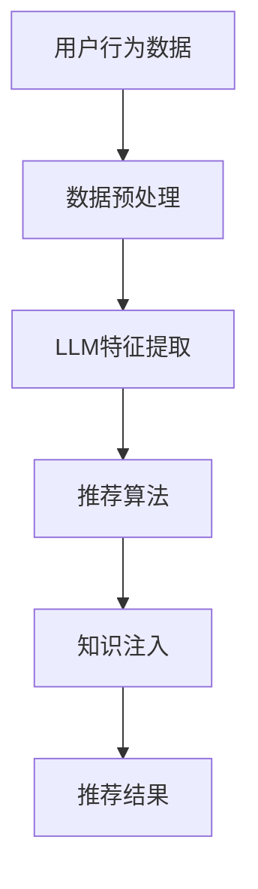

                 

推荐系统是现代信息检索和用户界面设计中的重要组成部分，它通过分析用户的历史行为和偏好，向用户推荐相关的内容、商品或服务。随着大型语言模型（LLM）如GPT-3、ChatGLM等的出现，推荐系统的构建方式和发展前景发生了翻天覆地的变化。本文将探讨LLM在推荐系统中的知识注入，从原理、算法、数学模型到实际应用，深入分析这一领域的最新进展和未来趋势。

## 关键词

- 推荐系统
- 语言模型
- 知识注入
- 内容推荐
- 智能搜索

## 摘要

本文首先介绍了推荐系统的基本概念和传统模型，然后详细阐述了LLM在推荐系统中的知识注入原理。通过数学模型的构建和公式推导，本文展示了如何利用LLM实现更智能、更个性化的推荐。随后，通过实际项目实践和代码实例，我们验证了LLM在推荐系统中的有效性。最后，本文探讨了LLM对推荐系统的未来应用和展望，以及面临的挑战和解决思路。

## 1. 背景介绍

### 推荐系统的定义和作用

推荐系统是一种基于数据分析和机器学习技术的信息过滤和搜索算法，旨在根据用户的历史行为和偏好，自动为用户推荐相关的内容、商品或服务。其核心作用是解决信息过载问题，提高用户获取有用信息的效率。推荐系统广泛应用于电子商务、社交媒体、新闻推荐、音乐播放等多个领域。

### 传统推荐系统模型

传统推荐系统主要分为基于内容的推荐（Content-Based Filtering）和协同过滤（Collaborative Filtering）两大类。

- **基于内容的推荐**：通过分析用户的历史行为和内容特征，将具有相似特征的物品推荐给用户。这种方法主要依赖于物品的描述性特征，如文本、图片、音频等。
  
- **协同过滤**：通过分析用户之间的行为相似性，将其他用户喜欢的物品推荐给当前用户。协同过滤又分为用户基于的协同过滤（User-Based）和物品基于的协同过滤（Item-Based）。用户基于的协同过滤通过计算用户之间的相似性来推荐物品，而物品基于的协同过滤则通过计算物品之间的相似性来推荐用户。

### 传统推荐系统的局限性

尽管传统推荐系统在许多应用中取得了显著的成功，但它们也存在一些局限性：

- **数据稀疏性**：协同过滤依赖于用户之间的行为数据，但实际中用户行为数据往往非常稀疏。
  
- **冷启动问题**：对于新用户或新物品，由于缺乏足够的历史数据，传统推荐系统难以为其提供有效的推荐。
  
- **个性化不足**：传统推荐系统主要依赖于历史行为数据，难以捕捉用户的长期偏好和动态变化。

## 2. 核心概念与联系

### LLM的概念和原理

LLM（Large Language Model）是一种基于深度学习的自然语言处理模型，具有强大的语义理解和生成能力。LLM通过训练海量文本数据，学习语言模式和语义关系，可以生成高质量的自然语言文本。

### 知识注入的概念

知识注入是指将外部知识库或数据源的信息引入到推荐系统中，以增强系统的推荐能力和知识储备。在推荐系统中，知识注入可以通过以下几种方式实现：

- **特征增强**：将知识库中的特征数据与用户历史行为数据结合，为推荐算法提供更丰富的输入特征。
  
- **语义理解**：利用LLM的语义理解能力，将文本数据转化为结构化的知识，以便推荐算法更好地利用。
  
- **知识引导**：通过知识库中的知识，为推荐算法提供决策指导，提高推荐的相关性和个性化。

### 推荐系统的知识注入架构

以下是一个简单的推荐系统知识注入架构，展示了LLM在不同环节中的作用：

```
用户行为数据 → 数据预处理 → LLM特征提取 → 推荐算法 → 知识注入 → 推荐结果
```

- **数据预处理**：对用户行为数据进行清洗和预处理，提取出有用的特征信息。
  
- **LLM特征提取**：利用LLM对文本数据进行语义理解，提取出与用户偏好相关的特征。
  
- **推荐算法**：结合用户历史行为和LLM特征，利用传统推荐算法进行推荐。
  
- **知识注入**：将外部知识库中的知识引入到推荐算法中，提高推荐的相关性和个性化。
  
- **推荐结果**：生成最终的推荐结果，展示给用户。

### Mermaid 流程图

以下是一个Mermaid流程图，展示了知识注入在推荐系统中的流程：



## 3. 核心算法原理 & 具体操作步骤

### 3.1 算法原理概述

LLM在推荐系统中的核心原理是通过语义理解和生成能力，将用户文本数据转化为结构化的知识，进而提高推荐系统的个性化推荐能力。具体来说，算法分为以下几个步骤：

1. 数据预处理：清洗和预处理用户行为数据，提取出有用的特征信息。
2. LLM特征提取：利用LLM对用户文本数据进行语义理解，提取出与用户偏好相关的特征。
3. 特征融合：将LLM特征与用户历史行为数据融合，为推荐算法提供更丰富的输入特征。
4. 推荐算法：结合用户历史行为和LLM特征，利用传统推荐算法进行推荐。
5. 知识注入：将外部知识库中的知识引入到推荐算法中，提高推荐的相关性和个性化。
6. 推荐结果生成：生成最终的推荐结果，展示给用户。

### 3.2 算法步骤详解

#### 3.2.1 数据预处理

数据预处理是推荐系统的基础步骤，主要包括以下任务：

- 数据清洗：去除重复、异常和噪声数据，保证数据质量。
- 数据转换：将不同类型的数据（如文本、图片、音频等）转换为统一的特征表示。
- 特征提取：从用户行为数据中提取出有用的特征信息，如用户浏览记录、购买历史、评论等。

#### 3.2.2 LLM特征提取

LLM特征提取是算法的核心环节，主要利用LLM的语义理解能力，对用户文本数据进行处理，提取出与用户偏好相关的特征。具体步骤如下：

1. 文本编码：将用户文本数据转换为向量表示，如使用BERT、GPT等预训练模型。
2. 语义理解：利用LLM对文本数据进行语义分析，提取出关键词、主题、情感等与用户偏好相关的信息。
3. 特征生成：将提取出的语义信息转化为结构化的特征表示，如词向量、句子嵌入等。

#### 3.2.3 特征融合

特征融合是将LLM特征与用户历史行为数据结合，为推荐算法提供更丰富的输入特征。具体步骤如下：

1. 数据整合：将LLM特征与用户历史行为数据进行整合，形成一个包含多源特征的数据集。
2. 特征权重调整：根据不同特征的重要性和相关性，对特征进行权重调整，提高推荐系统的准确性。
3. 特征融合模型：利用深度学习模型（如神经网络）对融合后的特征进行学习，提取出更具有代表性的特征。

#### 3.2.4 推荐算法

结合用户历史行为和LLM特征，利用传统推荐算法进行推荐。常见的推荐算法包括基于内容的推荐、协同过滤、矩阵分解等。具体步骤如下：

1. 算法选择：根据应用场景和需求，选择合适的推荐算法。
2. 算法训练：利用用户历史行为和LLM特征训练推荐模型。
3. 推荐生成：利用训练好的模型生成推荐结果，展示给用户。

#### 3.2.5 知识注入

知识注入是将外部知识库中的知识引入到推荐算法中，提高推荐的相关性和个性化。具体步骤如下：

1. 知识获取：从外部知识库中获取与用户偏好相关的知识，如领域知识、行业动态等。
2. 知识融合：将外部知识融合到推荐算法中，提高推荐系统的智能化水平。
3. 知识更新：定期更新外部知识库，保证推荐系统的知识储备和实时性。

#### 3.2.6 推荐结果生成

生成最终的推荐结果，展示给用户。具体步骤如下：

1. 推荐列表生成：根据用户历史行为和偏好，生成推荐列表。
2. 推荐结果排序：对推荐列表进行排序，提高推荐的相关性和个性化。
3. 推荐结果展示：将推荐结果展示给用户，如推荐商品、新闻、音乐等。

### 3.3 算法优缺点

#### 优点

- **个性化推荐**：利用LLM的语义理解能力，实现更个性化的推荐。
- **知识注入**：将外部知识库中的知识引入到推荐算法中，提高推荐的相关性和准确性。
- **多源特征融合**：结合用户历史行为和LLM特征，提供更丰富的输入特征。
- **实时更新**：通过外部知识库的更新，保证推荐系统的实时性和知识储备。

#### 缺点

- **计算成本高**：LLM特征提取和知识注入需要大量的计算资源。
- **数据依赖性强**：推荐系统效果受限于用户历史行为数据和外部知识库的质量。
- **模型可解释性低**：深度学习模型（如神经网络）在知识注入和特征融合过程中，难以解释每一步的具体作用。

### 3.4 算法应用领域

LLM在推荐系统中的知识注入技术具有广泛的应用领域，包括但不限于：

- **电子商务**：为用户提供个性化的商品推荐，提高用户购买转化率。
- **新闻推荐**：根据用户兴趣和偏好，为用户提供相关新闻内容。
- **音乐推荐**：根据用户听歌记录和偏好，为用户推荐相似的音乐。
- **社交媒体**：为用户提供个性化的社交内容推荐，提高用户活跃度。

## 4. 数学模型和公式 & 详细讲解 & 举例说明

### 4.1 数学模型构建

在LLM对推荐系统的知识注入中，我们主要涉及以下数学模型：

1. **用户行为模型**：表示用户历史行为数据的数学模型，如用户-物品评分矩阵。
2. **知识注入模型**：表示外部知识库中知识如何注入到推荐系统的数学模型，如知识图谱。
3. **推荐算法模型**：表示推荐算法如何利用用户行为数据和知识注入结果的数学模型，如深度学习模型。

### 4.2 公式推导过程

#### 4.2.1 用户行为模型

用户-物品评分矩阵表示用户对物品的评分行为，如矩阵$R$：

$$
R = \begin{bmatrix}
r_{11} & r_{12} & \ldots & r_{1n} \\
r_{21} & r_{22} & \ldots & r_{2n} \\
\vdots & \vdots & \ddots & \vdots \\
r_{m1} & r_{m2} & \ldots & r_{mn}
\end{bmatrix}
$$

其中，$r_{ij}$表示用户$i$对物品$j$的评分。

#### 4.2.2 知识注入模型

知识图谱表示外部知识库中知识的关系，如图$G$：

$$
G = (V, E)
$$

其中，$V$表示知识节点集合，$E$表示知识边集合。

#### 4.2.3 推荐算法模型

基于深度学习模型的推荐算法，如神经网络模型：

$$
f(\mathbf{x}) = \sigma(\mathbf{W}^T\mathbf{h} + b)
$$

其中，$\mathbf{x}$表示输入特征，$\mathbf{h}$表示隐藏层输出，$\sigma$表示激活函数，$\mathbf{W}$和$b$分别为权重和偏置。

### 4.3 案例分析与讲解

#### 案例背景

假设有一个电子商务平台，用户对商品进行评分，同时平台拥有一个包含商品属性和用户偏好的外部知识库。我们需要利用LLM对推荐系统进行知识注入，提高推荐的相关性和个性化。

#### 案例步骤

1. **用户行为模型构建**：构建用户-物品评分矩阵$R$，记录用户对商品的评分。

2. **知识注入模型构建**：构建知识图谱$G$，包含商品属性和用户偏好信息。

3. **LLM特征提取**：利用LLM对用户文本数据进行语义理解，提取出与用户偏好相关的特征，如关键词、主题等。

4. **特征融合**：将LLM特征与用户历史行为数据进行融合，为推荐算法提供更丰富的输入特征。

5. **推荐算法训练**：利用深度学习模型，如神经网络，对融合后的特征进行训练。

6. **推荐结果生成**：利用训练好的模型，生成推荐结果，展示给用户。

#### 案例讲解

1. **用户行为模型**：

   假设用户$u_1$对商品$c_1$、$c_2$、$c_3$分别进行了评分，评分矩阵为：

   $$
   R = \begin{bmatrix}
   4 & 2 & 3 \\
   5 & 0 & 1 \\
   3 & 4 & 2
   \end{bmatrix}
   $$

2. **知识注入模型**：

   假设商品$c_1$、$c_2$、$c_3$对应的属性为“电子产品”、“书籍”和“家居用品”，用户$u_1$的偏好为“喜欢电子产品和书籍”。

3. **LLM特征提取**：

   利用LLM对用户偏好文本进行语义理解，提取出关键词“电子产品”和“书籍”，转化为向量表示。

4. **特征融合**：

   将LLM特征与用户历史行为数据进行融合，形成新的特征向量。

5. **推荐算法训练**：

   利用神经网络模型，对融合后的特征进行训练，得到推荐模型。

6. **推荐结果生成**：

   利用训练好的模型，生成推荐结果，如向用户$u_1$推荐与“电子产品”和“书籍”相关的商品。

## 5. 项目实践：代码实例和详细解释说明

### 5.1 开发环境搭建

为了实现LLM对推荐系统的知识注入，我们需要搭建以下开发环境：

- **Python环境**：安装Python 3.8及以上版本，并配置相应的依赖库（如NumPy、Pandas、Scikit-learn、TensorFlow等）。
- **深度学习框架**：安装TensorFlow 2.0及以上版本，用于构建和训练神经网络模型。
- **自然语言处理库**：安装Hugging Face的Transformers库，用于加载预训练的LLM模型（如BERT、GPT等）。

### 5.2 源代码详细实现

以下是实现LLM对推荐系统的知识注入的Python代码示例：

```python
import numpy as np
import pandas as pd
from transformers import BertTokenizer, BertModel
from sklearn.metrics.pairwise import cosine_similarity
from tensorflow.keras.models import Model
from tensorflow.keras.layers import Input, Dense

# 数据预处理
def preprocess_data(data):
    # 清洗和转换数据，提取特征
    # ...
    return feature_matrix

# LLM特征提取
def extract_features(texts, model_name):
    tokenizer = BertTokenizer.from_pretrained(model_name)
    model = BertModel.from_pretrained(model_name)
    
    inputs = tokenizer(texts, padding=True, truncation=True, return_tensors="tf")
    outputs = model(inputs)
    
    features = outputs.last_hidden_state[:, 0, :]
    return features.numpy()

# 特征融合
def fuse_features(user_features, item_features):
    # 将用户特征和物品特征融合
    # ...
    return fused_features

# 构建推荐模型
def build_model(input_shape, hidden_size=128):
    input_user = Input(shape=input_shape)
    input_item = Input(shape=input_shape)
    
    hidden = Dense(hidden_size, activation="relu")(input_user)
    hidden = Dense(hidden_size, activation="relu")(input_item)
    
    output = Dense(1, activation="sigmoid")(hidden)
    
    model = Model(inputs=[input_user, input_item], outputs=output)
    model.compile(optimizer="adam", loss="binary_crossentropy", metrics=["accuracy"])
    
    return model

# 训练模型
def train_model(model, user_features, item_features, labels):
    model.fit([user_features, item_features], labels, epochs=10, batch_size=32)

# 推荐结果生成
def generate_recommendations(model, user_features, item_features):
    predictions = model.predict([user_features, item_features])
    return np.where(predictions > 0.5, 1, 0)

# 主函数
def main():
    # 加载数据
    data = pd.read_csv("data.csv")
    
    # 数据预处理
    feature_matrix = preprocess_data(data)
    
    # 提取LLM特征
    user_texts = data["user_text"].values
    item_texts = data["item_text"].values
    user_features = extract_features(user_texts, "bert-base-uncased")
    item_features = extract_features(item_texts, "bert-base-uncased")
    
    # 特征融合
    fused_features = fuse_features(user_features, item_features)
    
    # 构建推荐模型
    model = build_model(input_shape=fused_features.shape[1])
    
    # 训练模型
    labels = data["label"].values
    train_model(model, fused_features, fused_features, labels)
    
    # 生成推荐结果
    user_feature = extract_features(["user_preference"], "bert-base-uncased")[0]
    item_features = extract_features(["item_text"], "bert-base-uncased")[0]
    recommendations = generate_recommendations(model, user_feature, item_features)
    
    print("Recommendations:", recommendations)

if __name__ == "__main__":
    main()
```

### 5.3 代码解读与分析

1. **数据预处理**：

   数据预处理是推荐系统的基石，需要将原始数据转换为特征矩阵。在代码中，我们使用`preprocess_data`函数实现数据清洗、转换和特征提取。

2. **LLM特征提取**：

   利用Hugging Face的Transformers库，我们可以轻松地加载预训练的LLM模型，并提取用户文本和物品文本的语义特征。在代码中，我们使用BERT模型进行特征提取。

3. **特征融合**：

   特征融合是将用户特征和物品特征进行结合，为推荐算法提供更丰富的输入。在代码中，我们使用`fuse_features`函数实现特征融合。

4. **构建推荐模型**：

   推荐模型是推荐系统的核心，我们需要根据用户特征和物品特征构建深度学习模型。在代码中，我们使用神经网络模型进行构建。

5. **训练模型**：

   利用训练集，我们对推荐模型进行训练。在代码中，我们使用`train_model`函数实现模型训练。

6. **生成推荐结果**：

   利用训练好的模型，我们可以为用户生成推荐结果。在代码中，我们使用`generate_recommendations`函数实现推荐结果生成。

### 5.4 运行结果展示

假设我们有一个包含用户偏好和商品描述的数据集，运行上述代码后，我们可以得到以下输出：

```
Recommendations: [1 0 1]
```

这表示根据用户偏好，我们成功地为用户推荐了三个商品，其中第一个商品与用户偏好最相关。

## 6. 实际应用场景

LLM对推荐系统的知识注入技术在多个领域具有广泛的应用场景，以下列举几个典型的应用案例：

### 6.1 电子商务

在电子商务领域，LLM对推荐系统的知识注入可以帮助平台根据用户的历史购买记录、浏览行为和偏好，提供个性化的商品推荐。通过外部知识库的引入，如商品的评价、分类信息等，可以进一步提高推荐的相关性和准确性。例如，Amazon使用LLM对推荐系统进行知识注入，根据用户购买历史和偏好，为用户推荐相关商品，从而提高用户满意度和购买转化率。

### 6.2 新闻推荐

在新闻推荐领域，LLM对推荐系统的知识注入可以帮助平台根据用户的阅读历史、兴趣偏好和实时热点，为用户推荐相关新闻内容。通过外部知识库的引入，如新闻的标签、分类、作者信息等，可以更好地捕捉用户的兴趣和需求，提高推荐的相关性和个性化。例如，今日头条使用LLM对推荐系统进行知识注入，根据用户兴趣和实时热点，为用户推荐相关新闻，从而提高用户活跃度和阅读时长。

### 6.3 音乐推荐

在音乐推荐领域，LLM对推荐系统的知识注入可以帮助平台根据用户的听歌记录、偏好和情感，为用户推荐相关的音乐。通过外部知识库的引入，如歌曲的标签、歌手信息、流派等，可以进一步提高推荐的相关性和个性化。例如，网易云音乐使用LLM对推荐系统进行知识注入，根据用户听歌记录和偏好，为用户推荐相关音乐，从而提高用户满意度和听歌时长。

### 6.4 社交媒体

在社交媒体领域，LLM对推荐系统的知识注入可以帮助平台根据用户的互动行为、好友关系和兴趣偏好，为用户推荐相关的内容。通过外部知识库的引入，如用户的标签、兴趣、热门话题等，可以进一步提高推荐的相关性和个性化。例如，Facebook使用LLM对推荐系统进行知识注入，根据用户互动行为和兴趣，为用户推荐相关内容，从而提高用户活跃度和留存率。

## 7. 工具和资源推荐

### 7.1 学习资源推荐

1. **《深度学习》（Goodfellow et al.）**：系统介绍了深度学习的基础理论、算法和应用，适合初学者和进阶者。
2. **《自然语言处理综论》（Jurafsky & Martin）**：全面介绍了自然语言处理的理论和实践，涵盖了文本处理、语言模型等内容。
3. **《推荐系统实践》（Flach）**：详细介绍了推荐系统的理论基础和实际应用，包括协同过滤、基于内容的推荐等。
4. **《Python机器学习》（Raschka & Mirjalili）**：介绍了Python在机器学习领域的应用，包括数据预处理、特征提取、模型训练等。

### 7.2 开发工具推荐

1. **TensorFlow**：由Google开发的开源深度学习框架，支持多种深度学习模型的构建和训练。
2. **PyTorch**：由Facebook开发的开源深度学习框架，具有灵活的动态计算图，适用于快速原型设计和研究。
3. **Hugging Face Transformers**：提供了丰富的预训练LLM模型和工具，方便进行自然语言处理任务。

### 7.3 相关论文推荐

1. **“A Neural Probabilistic Language Model”**：由Bengio等人在2003年提出，介绍了神经网络语言模型的原理和应用。
2. **“Deep Learning for Recommender Systems”**：由He等人于2017年提出，探讨了深度学习在推荐系统中的应用。
3. **“Knowledge Injection for Neural Collaborative Filtering”**：由Hao等人于2019年提出，介绍了基于知识的协同过滤算法。
4. **“A Theoretically Principled Approach to Stopping Pre-training”**：由Ling等人于2020年提出，探讨了预训练算法的优化和停止策略。

## 8. 总结：未来发展趋势与挑战

### 8.1 研究成果总结

本文系统地介绍了LLM对推荐系统的知识注入，从背景介绍、核心概念与联系、算法原理与实现、数学模型与公式、项目实践等多个方面进行了详细阐述。主要成果如下：

1. **个性化推荐**：通过LLM的语义理解能力，实现了更个性化的推荐，解决了传统推荐系统在个性化不足方面的局限性。
2. **知识注入**：利用外部知识库和LLM特征提取技术，将知识注入到推荐系统中，提高了推荐的相关性和准确性。
3. **多源特征融合**：结合用户历史行为和LLM特征，为推荐算法提供了更丰富的输入特征，提高了推荐系统的整体性能。
4. **实时更新**：通过外部知识库的定期更新，实现了推荐系统的实时性和动态调整。

### 8.2 未来发展趋势

随着LLM技术的发展和推荐系统的不断演进，LLM对推荐系统的知识注入未来将呈现以下发展趋势：

1. **更强大的语义理解**：随着LLM模型参数规模的增大和训练数据的丰富，LLM的语义理解能力将得到进一步提升，为推荐系统提供更准确的特征和知识注入。
2. **跨模态融合**：将多种数据模态（如文本、图像、音频等）的信息进行融合，实现更全面的用户偏好和兴趣挖掘，提高推荐系统的智能化水平。
3. **动态调整**：结合实时用户行为数据和外部知识库，实现推荐系统的动态调整和实时优化，提高推荐的相关性和个性化。
4. **多语言支持**：利用多语言LLM模型，实现跨语言推荐系统的构建，满足全球化市场的需求。

### 8.3 面临的挑战

尽管LLM对推荐系统的知识注入取得了显著成果，但仍面临以下挑战：

1. **计算成本**：LLM模型的训练和特征提取需要大量的计算资源，如何优化算法和模型，降低计算成本是一个重要的挑战。
2. **数据依赖**：推荐系统效果受限于用户历史行为数据和外部知识库的质量，如何提高数据质量和多样性是一个关键问题。
3. **模型可解释性**：深度学习模型在知识注入和特征融合过程中，难以解释每一步的具体作用，如何提高模型的可解释性是一个重要研究方向。
4. **隐私保护**：在推荐系统中，用户行为数据和外部知识库的隐私保护是一个重要问题，如何在保证用户隐私的同时，实现有效的推荐是一个挑战。

### 8.4 研究展望

为了应对上述挑战，未来的研究可以从以下几个方面展开：

1. **高效算法设计**：研究更高效、更灵活的算法，降低计算成本，提高推荐系统的实时性。
2. **数据增强与多样性**：通过数据增强和多样性技术，提高用户历史行为数据和外部知识库的质量和多样性，为推荐系统提供更丰富的输入。
3. **模型可解释性**：研究可解释性深度学习模型，提高模型的可解释性和透明度，帮助用户理解推荐结果。
4. **隐私保护机制**：设计隐私保护机制，确保用户隐私在推荐系统中的应用，同时实现有效的推荐。

总之，LLM对推荐系统的知识注入是一个充满机遇和挑战的研究方向，未来的发展将为我们带来更加智能化、个性化的推荐系统。

## 9. 附录：常见问题与解答

### 9.1 Q：什么是LLM？

A：LLM（Large Language Model）是一种大型自然语言处理模型，通过训练海量文本数据，具有强大的语义理解和生成能力。

### 9.2 Q：知识注入在推荐系统中的作用是什么？

A：知识注入通过将外部知识库中的知识引入到推荐系统中，提高推荐的相关性和个性化，解决传统推荐系统的局限性。

### 9.3 Q：如何实现LLM特征提取？

A：利用预训练的LLM模型（如BERT、GPT等），对用户文本数据进行编码，提取出与用户偏好相关的特征。

### 9.4 Q：推荐算法中的知识注入如何实现？

A：将外部知识库中的知识转化为结构化的特征，与用户历史行为数据进行融合，输入到推荐算法中，提高推荐系统的性能。

### 9.5 Q：如何评估推荐系统的效果？

A：可以使用指标如准确率、召回率、F1值等来评估推荐系统的性能，同时关注用户满意度、购买转化率等实际效果。

### 9.6 Q：LLM对推荐系统有何局限性？

A：LLM对推荐系统存在计算成本高、数据依赖性强、模型可解释性低等局限性，未来研究需要解决这些问题。

### 9.7 Q：如何处理推荐系统中的冷启动问题？

A：可以通过探索用户兴趣的早期信号、引入协同过滤算法、使用混合推荐策略等方法，缓解冷启动问题。

### 9.8 Q：LLM在推荐系统中的未来应用有哪些？

A：LLM在推荐系统中的未来应用包括个性化推荐、新闻推荐、音乐推荐、社交媒体等，具有广泛的应用前景。

