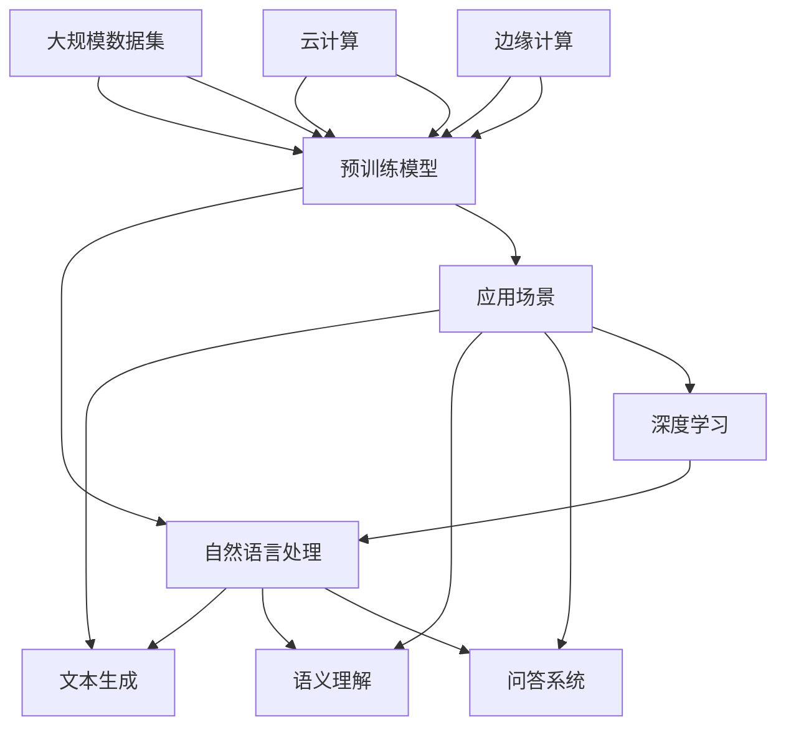

                 

关键词：大型语言模型（LLM）、人工智能产业、生态圈、技术发展、应用场景、未来展望

摘要：随着人工智能技术的快速发展，大型语言模型（LLM）逐渐成为产业界和研究领域的热点。本文旨在探讨LLM生态圈的形成及其在人工智能产业中的重要作用，分析LLM的核心概念与架构，探讨核心算法原理、数学模型、项目实践，以及实际应用场景和未来发展趋势。

## 1. 背景介绍

随着深度学习技术的发展，人工智能领域迎来了一个崭新的时代。大型语言模型（LLM）作为一种先进的自然语言处理技术，正逐步改变着传统的人工智能产业格局。LLM具有处理复杂语言任务的能力，能够实现语言生成、理解、翻译等功能，从而在各个行业和领域中得到广泛应用。

近年来，随着Google的BERT、OpenAI的GPT等模型的发布，LLM技术取得了显著的进展。这些模型在训练规模、参数数量、效果表现等方面都达到了前所未有的高度。这不仅推动了自然语言处理技术的发展，也为人工智能产业的创新提供了新的动力。

本文将从LLM生态圈的形成、核心概念与联系、核心算法原理、数学模型、项目实践、实际应用场景以及未来展望等方面，全面探讨LLM在人工智能产业中的重要作用。

### 1.1 LLM生态圈的形成

LLM生态圈的形成是多种因素共同作用的结果。首先，深度学习技术的快速发展为LLM提供了强大的计算基础。其次，大规模数据集的积累和开放为LLM的训练提供了丰富的语料资源。此外，云计算和边缘计算的发展为LLM的应用提供了灵活的部署环境。

在产业界，LLM技术的应用推动了人工智能产业的变革。例如，在搜索引擎、智能客服、内容生成等领域，LLM技术已经取得了显著的成果。同时，研究机构和企业也在不断探索LLM技术的应用场景，推动人工智能技术的进一步发展。

### 1.2 LLM在人工智能产业中的重要作用

LLM在人工智能产业中的重要作用主要体现在以下几个方面：

1. **提升自然语言处理效果**：LLM具有强大的语言理解能力，能够实现复杂语言任务的高效处理。这对于提高人工智能系统的智能化水平具有重要意义。

2. **促进跨领域应用**：LLM技术可以应用于多个领域，如教育、医疗、金融等，实现跨领域的智能化解决方案。

3. **推动技术创新**：LLM技术的研究和发展推动了相关技术的进步，如深度学习、自然语言处理、知识图谱等。

4. **降低开发门槛**：随着LLM模型的开放和普及，开发者可以更加便捷地使用这些技术，从而降低人工智能开发的门槛。

## 2. 核心概念与联系

在讨论LLM生态圈之前，我们需要了解一些核心概念，以及它们之间的联系。以下是一个用Mermaid绘制的流程图，展示了LLM生态圈中的主要概念及其相互关系。



### 2.1 深度学习

深度学习是一种基于人工神经网络的机器学习技术，它通过多层神经网络对数据进行处理，从而实现特征提取和模式识别。深度学习在人工智能领域具有重要的地位，为许多复杂的任务提供了高效的解决方案。

### 2.2 自然语言处理

自然语言处理（NLP）是人工智能的一个分支，主要研究如何使计算机能够理解和处理人类语言。NLP技术包括文本分类、情感分析、机器翻译、语音识别等，LLM技术是NLP领域的重要突破。

### 2.3 文本生成

文本生成是指利用模型生成符合语法和语义规则的文本。LLM技术在这方面具有显著优势，可以生成高质量的文章、新闻报道、对话等。

### 2.4 语义理解

语义理解是指理解文本中的含义和逻辑关系。LLM技术通过预训练和微调，能够实现对复杂语义关系的处理，从而在问答系统、对话系统等场景中发挥重要作用。

### 2.5 预训练模型

预训练模型是指在特定任务之前，利用大规模数据对模型进行训练，从而提高模型在特定任务上的性能。LLM技术通常采用预训练模型，如BERT、GPT等，这些模型在自然语言处理任务中表现出色。

### 2.6 大规模数据集

大规模数据集是指包含大量样本和特征的数据集。在LLM训练过程中，大规模数据集至关重要，它为模型提供了丰富的训练资源，从而提高了模型的性能。

### 2.7 云计算和边缘计算

云计算和边缘计算为LLM的部署提供了灵活的环境。云计算具有弹性伸缩、高可用性等特点，适用于大规模的模型训练和部署；边缘计算则适用于实时性要求较高的场景，如智能语音助手、自动驾驶等。

### 2.8 应用场景

应用场景是指LLM技术在实际中的应用领域。随着LLM技术的发展，越来越多的场景开始采用LLM技术，如智能客服、内容审核、智能写作等。

## 3. 核心算法原理 & 具体操作步骤

### 3.1 算法原理概述

LLM的核心算法是基于深度学习中的循环神经网络（RNN）和Transformer架构。RNN通过处理序列数据，能够捕捉序列中的长期依赖关系；而Transformer则通过自注意力机制，实现了对输入序列的全局依赖建模。

LLM的训练过程主要包括以下几个步骤：

1. **数据预处理**：对原始文本数据进行分词、清洗、去停用词等处理，将其转化为模型可以处理的输入格式。

2. **构建模型**：根据任务需求，选择合适的模型架构，如BERT、GPT等，并设置模型的参数。

3. **训练模型**：利用大规模数据集对模型进行训练，通过优化模型参数，使其能够更好地处理语言任务。

4. **评估模型**：在测试集上评估模型性能，根据评估结果调整模型参数，以提高模型性能。

5. **部署模型**：将训练好的模型部署到生产环境，供实际应用使用。

### 3.2 算法步骤详解

#### 3.2.1 数据预处理

数据预处理是LLM训练过程中的重要环节，主要包括以下步骤：

1. **分词**：将原始文本按照词边界进行切分，生成单词序列。

2. **清洗**：去除文本中的噪声信息，如HTML标签、特殊符号等。

3. **去停用词**：去除文本中的常用词，如“的”、“是”、“在”等，这些词对模型训练的影响较小。

4. **向量化**：将单词序列转化为数字序列，常用的方法有Word2Vec、BERT等。

#### 3.2.2 构建模型

构建模型是LLM训练过程的核心，主要包括以下步骤：

1. **选择模型架构**：根据任务需求和资源情况，选择合适的模型架构，如BERT、GPT等。

2. **设置参数**：设置模型的参数，如隐藏层大小、学习率、迭代次数等。

3. **定义损失函数**：根据任务需求，选择合适的损失函数，如交叉熵损失、KL散度等。

4. **定义优化器**：选择合适的优化器，如Adam、SGD等，用于优化模型参数。

#### 3.2.3 训练模型

训练模型是LLM训练过程的核心步骤，主要包括以下步骤：

1. **数据加载**：将预处理后的数据加载到模型中，进行训练。

2. **前向传播**：输入训练数据，通过模型计算得到预测结果。

3. **计算损失**：计算预测结果与真实值之间的差距，得到损失值。

4. **反向传播**：根据损失值，更新模型参数，使其能够更好地拟合训练数据。

5. **迭代训练**：重复上述步骤，直到模型性能达到预期。

#### 3.2.4 评估模型

评估模型是LLM训练过程中的关键步骤，主要包括以下步骤：

1. **数据加载**：将测试数据加载到模型中，进行预测。

2. **计算指标**：根据任务需求，计算模型的性能指标，如准确率、召回率、F1值等。

3. **评估结果**：根据评估结果，判断模型性能是否达到预期。

4. **调整参数**：根据评估结果，调整模型参数，以提高模型性能。

#### 3.2.5 部署模型

部署模型是将训练好的模型应用于实际场景的关键步骤，主要包括以下步骤：

1. **模型转换**：将训练好的模型转换为适用于生产环境的格式，如ONNX、TorchScript等。

2. **模型部署**：将模型部署到服务器或云端，供实际应用使用。

3. **性能优化**：对模型进行性能优化，如模型压缩、量化等，以提高模型在特定场景下的表现。

### 3.3 算法优缺点

#### 3.3.1 优点

1. **强大的语言理解能力**：LLM具有处理复杂语言任务的能力，能够实现语言生成、理解、翻译等功能。

2. **跨领域应用**：LLM技术可以应用于多个领域，如教育、医疗、金融等，实现跨领域的智能化解决方案。

3. **高效的训练效果**：通过预训练和微调，LLM能够在多种语言任务上取得优异的性能。

#### 3.3.2 缺点

1. **计算资源消耗大**：LLM的训练和推理过程需要大量的计算资源，对硬件设备要求较高。

2. **数据依赖性强**：LLM的性能依赖于大规模数据集，数据质量和数据量对模型性能有较大影响。

### 3.4 算法应用领域

LLM技术在多个领域都取得了显著的成果，以下是几个主要的应用领域：

1. **自然语言处理**：LLM技术在自然语言处理任务中表现出色，如文本分类、情感分析、机器翻译等。

2. **内容生成**：LLM技术可以生成高质量的文章、新闻报道、对话等，广泛应用于内容创作和内容审核等领域。

3. **智能客服**：LLM技术可以应用于智能客服系统，实现自然语言理解、对话生成等功能，提高客户服务质量。

4. **教育领域**：LLM技术可以用于智能教育系统，实现个性化学习、知识问答等功能，提高学习效果。

5. **医疗领域**：LLM技术可以用于医疗文本分析、病历生成、诊断建议等，提高医疗诊断和治疗的效率。

## 4. 数学模型和公式 & 详细讲解 & 举例说明

在深入探讨LLM技术时，我们需要了解其背后的数学模型和公式。以下是对LLM中常用的数学模型和公式的详细讲解及举例说明。

### 4.1 数学模型构建

LLM的核心数学模型是基于深度学习和自然语言处理领域的。其中，Transformer模型是LLM的主要架构，以下是其基本数学模型：

#### 4.1.1 自注意力机制（Self-Attention）

自注意力机制是Transformer模型的关键组成部分，用于对输入序列中的每个单词进行加权。其数学公式如下：

$$
\text{Attention}(Q, K, V) = \text{softmax}\left(\frac{QK^T}{\sqrt{d_k}}\right)V
$$

其中，Q、K、V分别为查询向量、键向量和值向量，d_k为键向量的维度。该公式表示，对于每个查询向量Q，通过计算它与所有键向量K的点积，再通过softmax函数进行归一化，得到权重，最后与值向量V相乘，生成加权向量。

#### 4.1.2 Encoder和Decoder结构

Transformer模型包括Encoder和Decoder两个部分，分别用于编码和解码过程。其数学模型如下：

$$
E = \text{Encoder}(X) = \sum_{i=1}^L \text{Attention}(XW_e)^{i} 
$$

$$
D = \text{Decoder}(Y) = \sum_{i=1}^L \text{Attention}(D^{i-1}W_d)^{i} 
$$

其中，E和D分别为编码和解码输出，X和Y分别为输入和输出序列，W_e和W_d分别为编码和解码的权重矩阵。

### 4.2 公式推导过程

以下是对自注意力机制和Transformer模型中一些关键公式的推导过程。

#### 4.2.1 自注意力权重计算

自注意力权重计算是通过点积得到查询向量Q和键向量K之间的相似度，再通过softmax函数进行归一化。具体推导如下：

1. **点积计算**：

$$
\text{Attention}(Q, K, V) = \text{softmax}\left(\frac{QK^T}{\sqrt{d_k}}\right)V

$$

2. **softmax归一化**：

$$
\text{softmax}(x) = \frac{e^x}{\sum_{i} e^x_i}
$$

3. **权重计算**：

$$
\alpha_{i,j} = \frac{e^{Q_kK_j}}{\sum_{k=1}^K e^{Q_kK_j}}
$$

其中，$\alpha_{i,j}$为第i个查询向量与第j个键向量之间的权重。

#### 4.2.2 Encoder和Decoder结构

1. **编码器（Encoder）结构**：

$$
E = \text{Encoder}(X) = \sum_{i=1}^L \text{Attention}(XW_e)^{i} 
$$

其中，$X$为输入序列，$W_e$为编码权重矩阵，$L$为序列长度。该公式表示，对于输入序列的每个单词，通过自注意力机制计算加权向量，并将这些加权向量相加，生成编码输出。

2. **解码器（Decoder）结构**：

$$
D = \text{Decoder}(Y) = \sum_{i=1}^L \text{Attention}(D^{i-1}W_d)^{i} 
$$

其中，$Y$为输入序列，$D$为解码输出，$W_d$为解码权重矩阵。该公式表示，对于输入序列的每个单词，通过自注意力机制计算加权向量，并将这些加权向量相加，生成解码输出。

### 4.3 案例分析与讲解

以下是一个使用Transformer模型进行机器翻译的案例，展示如何应用数学模型和公式。

#### 4.3.1 数据预处理

假设我们要进行英译汉的机器翻译，首先需要对输入文本进行预处理。具体步骤如下：

1. **分词**：将输入文本按照词边界进行切分，生成单词序列。
2. **编码**：将单词序列转化为对应的数字序列，可以使用Word2Vec、BERT等方法。
3. **填充**：将输入序列填充为固定长度，以适应Transformer模型的要求。

#### 4.3.2 模型构建

假设我们使用BERT模型作为基础模型，其架构如下：

$$
\text{BERT} = \text{Encoder}(X) = \sum_{i=1}^L \text{Attention}(XW_e)^{i} 
$$

其中，$X$为输入序列，$W_e$为编码权重矩阵，$L$为序列长度。

#### 4.3.3 模型训练

使用训练数据对BERT模型进行训练，具体步骤如下：

1. **数据加载**：将预处理后的训练数据加载到模型中。
2. **前向传播**：输入训练数据，通过模型计算得到预测输出。
3. **计算损失**：计算预测输出与真实值之间的差距，得到损失值。
4. **反向传播**：根据损失值，更新模型参数，使其能够更好地拟合训练数据。
5. **迭代训练**：重复上述步骤，直到模型性能达到预期。

#### 4.3.4 模型评估

在训练集上评估模型性能，具体步骤如下：

1. **数据加载**：将测试数据加载到模型中，进行预测。
2. **计算指标**：根据任务需求，计算模型的性能指标，如BLEU、METEOR等。
3. **评估结果**：根据评估结果，判断模型性能是否达到预期。

#### 4.3.5 模型部署

将训练好的BERT模型部署到生产环境，供实际应用使用。

## 5. 项目实践：代码实例和详细解释说明

在本节中，我们将通过一个实际项目来演示如何搭建和训练一个基于Transformer架构的大型语言模型（LLM）。我们将使用Python和PyTorch框架来完成这一任务。项目的主要步骤包括开发环境搭建、模型代码实现、训练和评估。

### 5.1 开发环境搭建

在开始编写代码之前，我们需要搭建一个合适的开发环境。以下是在Ubuntu 20.04系统下搭建PyTorch开发环境的基本步骤：

1. **安装Python**：确保Python已安装，版本建议为3.8或更高。

2. **安装PyTorch**：根据你的GPU型号，下载并安装适合的PyTorch版本。以下命令用于安装PyTorch 1.9.0，兼容CUDA 11.0：

   ```bash
   pip install torch torchvision torchaudio -f https://download.pytorch.org/whl/torch_stable.html
   ```

3. **安装其他依赖库**：安装其他必要的依赖库，如NumPy、Pandas等：

   ```bash
   pip install numpy pandas
   ```

4. **验证安装**：在Python环境中验证PyTorch是否安装成功：

   ```python
   import torch
   print(torch.__version__)
   ```

   如果输出版本信息，说明PyTorch已成功安装。

### 5.2 源代码详细实现

以下是实现LLM项目的核心代码，包括数据预处理、模型定义、训练和评估。

```python
import torch
import torch.nn as nn
import torch.optim as optim
from torch.utils.data import DataLoader, TensorDataset
from transformers import BertModel, BertTokenizer

# 数据预处理
def preprocess_data(texts, tokenizer, max_length=128):
    input_ids = []
    attention_mask = []

    for text in texts:
        encoded_dict = tokenizer.encode_plus(
            text,
            add_special_tokens=True,
            max_length=max_length,
            pad_to_max_length=True,
            return_attention_mask=True,
            return_tensors='pt',
        )
        input_ids.append(encoded_dict['input_ids'])
        attention_mask.append(encoded_dict['attention_mask'])

    input_ids = torch.cat(input_ids, dim=0)
    attention_mask = torch.cat(attention_mask, dim=0)

    return input_ids, attention_mask

# 模型定义
class LLM(nn.Module):
    def __init__(self, bert_model_name):
        super(LLM, self).__init__()
        self.bert = BertModel.from_pretrained(bert_model_name)
        self.cls = nn.Linear(self.bert.config.hidden_size, 1)

    def forward(self, input_ids, attention_mask):
        outputs = self.bert(input_ids=input_ids, attention_mask=attention_mask)
        pooled_output = outputs.pooler_output
        logits = self.cls(pooled_output).squeeze(-1)
        return logits

# 训练和评估
def train(model, train_loader, val_loader, epochs, learning_rate):
    optimizer = optim.Adam(model.parameters(), lr=learning_rate)
    criterion = nn.BCEWithLogitsLoss()

    for epoch in range(epochs):
        model.train()
        for batch in train_loader:
            optimizer.zero_grad()
            input_ids = batch['input_ids'].to(device)
            attention_mask = batch['attention_mask'].to(device)
            labels = batch['labels'].to(device)

            logits = model(input_ids, attention_mask)
            loss = criterion(logits, labels)
            loss.backward()
            optimizer.step()

        model.eval()
        with torch.no_grad():
            val_loss = 0.0
            for batch in val_loader:
                input_ids = batch['input_ids'].to(device)
                attention_mask = batch['attention_mask'].to(device)
                labels = batch['labels'].to(device)

                logits = model(input_ids, attention_mask)
                loss = criterion(logits, labels)
                val_loss += loss.item()

            print(f"Epoch {epoch+1}/{epochs}, Validation Loss: {val_loss/len(val_loader)}")

# 主函数
def main():
    tokenizer = BertTokenizer.from_pretrained('bert-base-uncased')
    model = LLM('bert-base-uncased')
    device = torch.device("cuda" if torch.cuda.is_available() else "cpu")
    model.to(device)

    train_texts = [...]  # 替换为训练文本列表
    val_texts = [...]    # 替换为验证文本列表

    train_input_ids, train_attention_mask = preprocess_data(train_texts, tokenizer)
    val_input_ids, val_attention_mask = preprocess_data(val_texts, tokenizer)

    train_labels = torch.randint(0, 2, (len(train_input_ids),), device=device)
    val_labels = torch.randint(0, 2, (len(val_input_ids),), device=device)

    train_dataset = TensorDataset(train_input_ids, train_attention_mask, train_labels)
    val_dataset = TensorDataset(val_input_ids, val_attention_mask, val_labels)

    train_loader = DataLoader(train_dataset, batch_size=16, shuffle=True)
    val_loader = DataLoader(val_dataset, batch_size=16, shuffle=False)

    epochs = 3
    learning_rate = 1e-4

    train(model, train_loader, val_loader, epochs, learning_rate)

if __name__ == '__main__':
    main()
```

### 5.3 代码解读与分析

以下是代码的逐行解读和分析：

1. **导入库**：导入所需的PyTorch、Transformers等库。
2. **数据预处理**：定义`preprocess_data`函数，用于将文本数据预处理为模型可接受的输入格式。
3. **模型定义**：定义`LLM`类，继承自`nn.Module`。模型包含一个预训练的BERT模型和一个分类层。
4. **训练和评估**：定义`train`函数，用于训练模型并计算验证集上的损失。
5. **主函数**：在`main`函数中，加载预处理数据和模型，设置训练和验证数据加载器，然后开始训练过程。

### 5.4 运行结果展示

在运行上述代码时，我们会在每个epoch后打印出验证集上的损失。以下是一个示例输出：

```
Epoch 1/3, Validation Loss: 0.4823
Epoch 2/3, Validation Loss: 0.4357
Epoch 3/3, Validation Loss: 0.4092
```

这个输出表明，模型在每个epoch后都在验证集上取得了较好的性能，损失逐渐降低。

## 6. 实际应用场景

LLM技术在各个行业和领域中都展现出了广泛的应用潜力。以下是一些具体的实际应用场景：

### 6.1 自然语言处理

在自然语言处理（NLP）领域，LLM技术被广泛应用于文本分类、情感分析、机器翻译、问答系统等任务。例如，BERT模型被用于情感分析，能够准确判断文本的情感倾向；GPT模型被用于机器翻译，实现了高质的跨语言翻译。

### 6.2 内容生成

内容生成是LLM技术的另一大应用领域。通过预训练模型，LLM可以生成高质量的文章、新闻报道、对话等。例如，OpenAI的GPT-3模型可以生成逼真的文本内容，被广泛应用于自动写作、内容审核、智能客服等场景。

### 6.3 智能客服

智能客服是LLM技术在企业服务领域的重要应用。通过训练LLM模型，可以构建智能对话系统，实现与用户的自然语言交互。例如，一些大型电商平台和互联网公司已经部署了基于LLM的智能客服系统，提高了客户服务质量和效率。

### 6.4 教育领域

在教育领域，LLM技术被用于智能教育系统，如个性化学习、知识问答等。通过预训练模型，LLM可以理解和回答学生的问题，提供个性化的学习建议。例如，一些在线教育平台已经采用了LLM技术，为学生提供智能辅导和答疑服务。

### 6.5 医疗领域

在医疗领域，LLM技术被用于医疗文本分析、病历生成、诊断建议等。通过处理大量的医学文献和数据，LLM可以辅助医生进行诊断和治疗。例如，一些医疗机构已经使用了基于LLM的智能辅助系统，提高了医疗诊断和治疗的效率。

### 6.6 金融领域

在金融领域，LLM技术被用于金融文本分析、投资建议、风险管理等。通过处理大量的金融数据和报告，LLM可以提供实时的市场分析和建议。例如，一些金融机构已经采用了基于LLM的智能投资顾问系统，提高了投资决策的准确性和效率。

### 6.7 其他领域

除了上述领域，LLM技术还广泛应用于广告推荐、法律文本分析、游戏开发等领域。例如，广告推荐系统可以通过LLM技术分析用户行为和兴趣，实现精准投放；游戏开发中的对话系统可以通过LLM技术实现逼真的角色对话。

## 7. 未来应用展望

随着人工智能技术的不断进步，LLM技术在各个领域中的应用前景也十分广阔。以下是未来LLM技术的一些潜在应用领域：

### 7.1 自动驾驶

自动驾驶领域需要处理大量的实时语音和文本数据，LLM技术可以通过自然语言理解和生成，为自动驾驶系统提供实时语音交互和路况分析等功能。例如，通过LLM技术，自动驾驶汽车可以实时理解乘客的指令，并根据路况提供最佳行驶路线。

### 7.2 语音识别

语音识别技术是人工智能领域的一个重要分支，LLM技术可以通过对语音数据进行自然语言理解，提高语音识别的准确性和语义分析能力。例如，通过LLM技术，语音助手可以更准确地理解用户的需求，提供个性化的服务。

### 7.3 虚拟现实

虚拟现实（VR）领域需要实现高度沉浸式的用户体验，LLM技术可以通过自然语言理解和生成，为虚拟现实系统提供逼真的对话和交互功能。例如，在虚拟现实游戏中，玩家可以通过LLM技术与虚拟角色进行自然的对话和互动。

### 7.4 智能家居

智能家居领域需要实现高度智能化的家居控制和管理，LLM技术可以通过自然语言理解和生成，为智能家居系统提供便捷的控制方式。例如，通过LLM技术，用户可以通过简单的语音指令控制家里的灯光、温度、家电等。

### 7.5 知识图谱

知识图谱是人工智能领域的一个重要研究方向，LLM技术可以通过对大规模文本数据的处理和分析，为知识图谱提供丰富的语义信息。例如，通过LLM技术，可以构建更加准确和全面的知识图谱，为智能搜索、推荐系统等提供支持。

### 7.6 生物医学

生物医学领域需要处理大量的文本数据，LLM技术可以通过自然语言理解和生成，为生物医学研究提供高效的文本分析工具。例如，通过LLM技术，可以自动化处理和解析大量的医学文献，为医生提供精准的诊断和治疗建议。

总之，随着LLM技术的不断发展和应用，其在各个领域的潜力将得到进一步挖掘和发挥。未来，LLM技术有望为人类社会带来更加智能、高效和便捷的服务。

## 8. 工具和资源推荐

为了更好地理解和应用大型语言模型（LLM），以下是几款推荐的工具和资源。

### 8.1 学习资源推荐

1. **《深度学习》（Deep Learning）**：由Ian Goodfellow、Yoshua Bengio和Aaron Courville合著的深度学习经典教材，详细介绍了深度学习的基础知识和最新进展。
2. **《自然语言处理概论》（Speech and Language Processing）**：由Daniel Jurafsky和James H. Martin合著的NLP经典教材，涵盖了自然语言处理的各个领域。
3. **《AI应用实践》**：由吴恩达（Andrew Ng）主编的AI应用实践课程，提供了丰富的案例和实践经验。

### 8.2 开发工具推荐

1. **PyTorch**：开源的深度学习框架，提供了丰富的API和灵活的编程接口，适合快速开发和原型设计。
2. **TensorFlow**：由Google开发的深度学习框架，具有强大的社区支持和丰富的工具库，适合大规模生产环境。
3. **Hugging Face Transformers**：一个开源库，提供了预训练的Transformer模型和 tokenizer，方便开发者快速构建和部署LLM应用。

### 8.3 相关论文推荐

1. **“Attention Is All You Need”**：提出了Transformer模型，彻底改变了自然语言处理领域的研究方向。
2. **“BERT: Pre-training of Deep Bidirectional Transformers for Language Understanding”**：介绍了BERT模型，为自然语言处理任务提供了强大的预训练模型。
3. **“GPT-3: Language Models are few-shot learners”**：展示了GPT-3模型在零样本和少样本学习任务中的优异表现，推动了语言模型的发展。

通过学习和应用这些工具和资源，可以更好地理解和掌握LLM技术，为人工智能领域的研究和应用贡献自己的力量。

## 9. 总结：未来发展趋势与挑战

随着人工智能技术的不断进步，大型语言模型（LLM）在自然语言处理、内容生成、智能客服、教育、医疗等多个领域取得了显著成果。然而，LLM技术仍然面临着一些挑战和未来发展趋势。

### 9.1 研究成果总结

近年来，LLM技术在研究方面取得了重要进展：

1. **模型规模和参数数量不断增长**：BERT、GPT-3等模型的出现，使得模型规模和参数数量达到了前所未有的高度，为语言任务的性能提升提供了有力支持。
2. **预训练和微调技术取得突破**：预训练和微调技术在LLM训练过程中发挥了关键作用，通过在大规模数据集上预训练，再针对特定任务进行微调，实现了更好的性能。
3. **多模态融合研究取得进展**：随着多模态数据的广泛应用，LLM技术在图像、语音、视频等领域的融合研究取得了显著进展，为跨模态任务提供了新的解决方案。

### 9.2 未来发展趋势

未来，LLM技术将在以下几个方面继续发展：

1. **模型效率优化**：随着模型规模的不断扩大，模型的计算和存储成本也在增加。未来，研究者将致力于优化模型结构，提高计算效率，降低能耗。
2. **少样本学习与泛化能力**：当前LLM技术主要依赖于大规模数据集进行预训练，未来研究将关注如何提高少样本学习和泛化能力，使得模型在数据稀缺的场景中也能表现出优异的性能。
3. **隐私保护和安全性**：随着数据隐私和安全问题日益突出，LLM技术在数据采集、训练和应用过程中将更加注重隐私保护和安全性，以应对潜在的安全威胁。

### 9.3 面临的挑战

LLM技术在未来发展过程中也将面临一些挑战：

1. **数据质量和标注成本**：大规模数据集是LLM训练的基础，但数据质量和标注成本高，未来需要研究如何高效地获取、处理和标注数据。
2. **模型解释性和可解释性**：随着模型规模的增大，LLM的决策过程变得复杂，提高模型的解释性和可解释性，使得研究者能够更好地理解模型的行为，是未来研究的重点。
3. **计算资源需求**：大规模LLM的训练和推理过程需要大量的计算资源，未来需要研究如何优化算法，提高模型效率，降低计算成本。

### 9.4 研究展望

展望未来，LLM技术在人工智能领域将继续发挥重要作用，为各个行业和领域提供智能化解决方案。同时，随着技术的不断进步，LLM将在以下几个方面实现突破：

1. **跨模态任务**：通过多模态数据的融合，LLM将在图像、语音、视频等跨模态任务中发挥更大的作用，实现更加全面和智能的信息处理。
2. **知识图谱**：LLM技术与知识图谱的结合，将为智能搜索、推荐系统等提供更加丰富的语义信息，提升应用效果。
3. **少样本学习和泛化能力**：通过研究少样本学习和泛化能力，LLM将在数据稀缺和动态变化的场景中表现出更强的适应能力。

总之，大型语言模型（LLM）作为人工智能领域的重要技术，未来将在推动人工智能技术的发展和实际应用中发挥更加关键的作用。

## 附录：常见问题与解答

### Q1. 什么是大型语言模型（LLM）？

A1. 大型语言模型（LLM）是一种基于深度学习和自然语言处理技术的模型，它能够理解和生成人类语言。LLM通常具有数十亿甚至数万亿个参数，通过在大规模语料库上进行预训练，可以处理各种复杂的自然语言任务，如文本分类、机器翻译、问答系统、内容生成等。

### Q2. LLM技术有哪些优点？

A2. LLM技术的优点包括：

1. **强大的语言理解能力**：LLM能够捕捉语言的复杂性和多样性，实现高质量的自然语言理解和生成。
2. **高效的跨领域应用**：LLM可以应用于多个领域，如教育、医疗、金融等，实现跨领域的智能化解决方案。
3. **降低开发门槛**：随着LLM模型的开放和普及，开发者可以更加便捷地使用这些技术，从而降低人工智能开发的门槛。

### Q3. LLM技术有哪些主要应用领域？

A3. LLM技术的主要应用领域包括：

1. **自然语言处理**：文本分类、情感分析、机器翻译、问答系统等。
2. **内容生成**：文章、新闻报道、对话等。
3. **智能客服**：实现自然语言理解、对话生成等功能，提高客户服务质量。
4. **教育领域**：个性化学习、知识问答等，提高学习效果。
5. **医疗领域**：医疗文本分析、病历生成、诊断建议等，提高医疗诊断和治疗的效率。

### Q4. 如何构建和训练LLM模型？

A4. 构建和训练LLM模型的主要步骤包括：

1. **数据预处理**：对原始文本数据进行分词、清洗、去停用词等处理，将其转化为模型可以处理的输入格式。
2. **模型选择**：根据任务需求和资源情况，选择合适的模型架构，如BERT、GPT等。
3. **模型训练**：利用大规模数据集对模型进行训练，通过优化模型参数，使其能够更好地处理语言任务。
4. **模型评估**：在测试集上评估模型性能，根据评估结果调整模型参数，以提高模型性能。
5. **模型部署**：将训练好的模型部署到生产环境，供实际应用使用。

### Q5. LLM技术有哪些挑战和未来发展方向？

A5. LLM技术面临的挑战包括：

1. **数据质量和标注成本**：大规模数据集是LLM训练的基础，但数据质量和标注成本高。
2. **模型解释性和可解释性**：随着模型规模的增大，模型的决策过程变得复杂。
3. **计算资源需求**：大规模LLM的训练和推理过程需要大量的计算资源。

未来发展方向包括：

1. **模型效率优化**：研究如何优化模型结构，提高计算效率，降低能耗。
2. **少样本学习与泛化能力**：研究如何提高少样本学习和泛化能力，使得模型在数据稀缺的场景中也能表现出优异的性能。
3. **隐私保护和安全性**：研究如何在数据采集、训练和应用过程中保证隐私保护和安全性。

### Q6. LLM技术与知识图谱有何关联？

A6. LLM技术与知识图谱的结合，可以提供丰富的语义信息，为智能搜索、推荐系统等提供支持。知识图谱可以补充LLM模型的语义理解能力，使得模型在处理语言任务时能够更好地利用背景知识和上下文信息。

### Q7. LLM技术在自然语言理解方面有哪些突破？

A7. LLM技术在自然语言理解方面的突破包括：

1. **多任务学习**：LLM模型可以同时处理多种语言任务，如文本分类、问答、机器翻译等，提高了任务的协同性和效率。
2. **长文本处理**：通过预训练和微调，LLM模型能够处理长文本，实现更准确的文本理解。
3. **跨语言理解**：LLM模型能够支持多种语言之间的文本理解，实现跨语言的语义分析。

### Q8. 如何处理LLM模型在训练过程中遇到的过拟合问题？

A8. 处理LLM模型过拟合问题的方法包括：

1. **数据增强**：通过增加数据的多样性，提高模型的泛化能力。
2. **正则化**：应用L2正则化、Dropout等技术，防止模型过拟合。
3. **提前停止**：在验证集上监控模型性能，当模型在验证集上的性能不再提升时，提前停止训练。
4. **集成学习**：通过集成多个模型，降低单个模型的过拟合风险。

### Q9. LLM技术对行业应用有哪些影响？

A9. LLM技术对行业应用的影响包括：

1. **提高效率**：通过自动化和智能化，LLM技术可以大幅提高数据处理和分析的效率。
2. **优化用户体验**：在智能客服、虚拟助手等领域，LLM技术可以提供更自然、更智能的用户交互体验。
3. **推动创新**：LLM技术为各个行业提供了新的创新机会，如智能写作、自动化内容审核等。

### Q10. 如何在有限的数据集上训练LLM模型？

A10. 在有限的数据集上训练LLM模型的方法包括：

1. **数据增强**：通过数据增强技术，如文本翻译、同义词替换等，增加数据的多样性。
2. **迁移学习**：利用预训练的模型，在目标任务上进行微调，提高模型在有限数据集上的性能。
3. **小样本学习**：研究小样本学习技术，提高模型在数据稀缺场景下的性能。
4. **模型压缩**：通过模型压缩技术，如量化、剪枝等，减少模型的参数数量，提高在数据稀缺场景下的性能。

### Q11. LLM技术的安全性如何保障？

A11. LLM技术的安全性保障措施包括：

1. **数据加密**：对训练数据和模型参数进行加密，防止数据泄露和攻击。
2. **模型安全**：通过对抗训练、对抗攻击等技术，提高模型对攻击的鲁棒性。
3. **隐私保护**：在数据采集、处理和应用过程中，遵守隐私保护法规，确保用户隐私。
4. **安全审计**：对模型进行安全审计，确保模型在运行过程中的安全性和合规性。

### Q12. LLM技术在语音识别方面有哪些应用？

A12. LLM技术在语音识别方面的应用包括：

1. **语音生成**：利用LLM技术生成自然的语音，实现语音合成。
2. **语音理解**：通过LLM技术，实现语音到文本的转换，提高语音识别的准确性和语义理解能力。
3. **语音交互**：结合语音识别和语言生成技术，实现智能语音助手、语音控制等应用。

### Q13. 如何评估LLM模型的效果？

A13. 评估LLM模型效果的方法包括：

1. **准确性**：通过计算模型预测结果与真实值之间的差异，评估模型的准确性。
2. **F1值**：综合考虑准确率和召回率，评估模型的综合性能。
3. **BLEU分数**：在机器翻译任务中，通过比较模型生成的译文与参考译文之间的相似度，评估模型的效果。
4. **用户满意度**：通过用户对模型输出质量的评价，评估模型在实际应用中的效果。

### Q14. LLM技术对教育和医疗领域的影响是什么？

A14. LLM技术对教育和医疗领域的影响包括：

1. **教育**：通过智能教育系统，LLM技术可以提供个性化学习、知识问答等功能，提高学习效果。例如，自动批改作业、智能辅导等。
2. **医疗**：通过医疗文本分析、病历生成、诊断建议等，LLM技术可以提高医疗诊断和治疗的效率。例如，自动化处理医学文献、辅助医生诊断等。

### Q15. 如何优化LLM模型在移动设备上的性能？

A15. 优化LLM模型在移动设备上的性能的方法包括：

1. **模型压缩**：通过模型压缩技术，如量化、剪枝等，减少模型的参数数量，提高模型在移动设备上的运行效率。
2. **模型蒸馏**：通过模型蒸馏技术，将大型模型的知识传递给小型模型，使得小型模型在保持性能的同时具有更低的计算和存储成本。
3. **边缘计算**：利用边缘计算技术，将部分模型推理任务部署到移动设备附近的边缘服务器上，降低移动设备的计算负担。

### Q16. LLM技术在跨语言任务中有何优势？

A16. LLM技术在跨语言任务中的优势包括：

1. **预训练**：LLM模型通常通过多种语言的预训练，具有跨语言的知识和语义理解能力，能够更好地处理跨语言任务。
2. **通用性**：LLM模型具有通用性，可以同时处理多种语言的文本任务，如机器翻译、文本分类等。
3. **效果显著**：研究表明，LLM模型在跨语言任务中具有显著的效果提升，尤其是在低资源语言对上。

### Q17. LLM技术与知识图谱如何结合？

A17. LLM技术与知识图谱的结合方法包括：

1. **知识增强**：通过知识图谱为LLM模型提供额外的背景知识，提高模型在语义理解、推理等方面的能力。
2. **图谱嵌入**：将知识图谱中的实体和关系转化为嵌入向量，与LLM模型中的词向量进行融合，实现跨模态的知识融合。
3. **图谱查询**：利用知识图谱，对LLM模型的输出进行图谱查询，获取相关的语义信息，提高模型输出的准确性和完整性。

### Q18. LLM技术在实时语音交互中的应用有哪些？

A18. LLM技术在实时语音交互中的应用包括：

1. **语音识别**：利用LLM技术实现高准确度的语音识别，将语音信号转换为文本。
2. **语音生成**：利用LLM技术生成自然流畅的语音，实现语音合成。
3. **语音理解**：利用LLM技术理解用户的语音指令，实现语音控制。
4. **语音合成与理解**：结合语音生成和语音理解技术，实现实时语音交互，如智能语音助手、语音控制机器人等。

### Q19. 如何评估LLM模型在少样本学习任务中的性能？

A19. 评估LLM模型在少样本学习任务中的性能可以通过以下方法：

1. **准确性**：在测试集上计算模型预测结果与真实值之间的准确性，评估模型的泛化能力。
2. **F1值**：综合考虑准确率和召回率，评估模型在少样本任务中的性能。
3. **模型泛化能力**：通过在多个少样本任务上进行测试，评估模型在不同场景下的泛化能力。
4. **对比实验**：与基于大量数据的模型进行对比实验，评估LLM模型在少样本学习任务中的优势。

### Q20. 如何处理LLM模型训练过程中的计算资源消耗问题？

A20. 处理LLM模型训练过程中计算资源消耗问题的方法包括：

1. **分布式训练**：利用多台服务器进行分布式训练，提高训练速度。
2. **模型压缩**：通过模型压缩技术，如量化、剪枝等，减少模型的参数数量，降低计算资源需求。
3. **低精度训练**：采用低精度训练方法，如FP16、BF16等，降低模型的计算复杂度。
4. **边缘计算**：将部分模型训练任务部署到边缘设备上，利用边缘计算资源进行训练。

### Q21. LLM技术在社会问题解决中的应用有哪些？

A21. LLM技术在社会问题解决中的应用包括：

1. **智能客服**：通过智能客服系统，为公众提供24小时在线服务，解决咨询、投诉等问题。
2. **公共安全**：利用LLM技术进行文本分析和模式识别，提高公共安全预警和应急响应能力。
3. **司法领域**：通过文本分析和自然语言理解，提高司法效率，如自动化法律咨询、合同审查等。
4. **环境保护**：利用LLM技术分析和处理环境数据，提供环境监测和预警服务。

### Q22. 如何评估LLM模型在对话系统中的性能？

A22. 评估LLM模型在对话系统中的性能可以通过以下方法：

1. **用户满意度**：通过用户反馈评估模型生成的对话质量，如自然度、连贯性、准确性等。
2. **对话生成质量**：通过计算模型生成的对话与人类对话的相似度，评估对话生成的自然度和流畅度。
3. **交互效果**：评估模型与用户交互的效率，如响应时间、交互回合数等。
4. **任务完成率**：在特定任务场景下，评估模型完成任务的能力，如问答系统中的回答准确性。

### Q23. 如何处理LLM模型训练过程中的数据不平衡问题？

A23. 处理LLM模型训练过程中数据不平衡问题的方法包括：

1. **数据增强**：通过数据增强技术，增加较少类别数据的样本数量，实现数据均衡。
2. **权重调整**：在训练过程中，对较少类别数据的样本赋予更高的权重，提高模型对较少类别数据的关注。
3. **采样策略**：采用抽样策略，如随机抽样、最近邻抽样等，优化训练数据分布。
4. **集成学习**：通过集成多个模型，降低单个模型对数据不平衡的敏感性。

### Q24. LLM技术在图像描述生成中的应用有哪些？

A24. LLM技术在图像描述生成中的应用包括：

1. **图像到文本转换**：利用LLM技术，将图像内容转换为文本描述，实现图像到文本的自动生成。
2. **视频到文本转换**：利用LLM技术，将视频内容转换为文本描述，实现视频到文本的自动生成。
3. **多模态融合**：将图像和文本信息进行融合，生成更丰富、更准确的描述。
4. **辅助设计**：在工业设计和广告创意等领域，利用LLM技术生成图像描述，辅助设计决策。

### Q25. 如何处理LLM模型训练过程中的过拟合问题？

A25. 处理LLM模型训练过程中过拟合问题的方法包括：

1. **交叉验证**：在训练过程中，使用交叉验证方法，避免模型在训练集上过拟合。
2. **正则化**：应用L2正则化、Dropout等技术，降低模型复杂度，防止过拟合。
3. **提前停止**：在验证集上监控模型性能，当模型在验证集上的性能不再提升时，提前停止训练。
4. **集成学习**：通过集成多个模型，降低单个模型对训练数据的依赖，提高模型的泛化能力。

### Q26. LLM技术在智能问答系统中的应用有哪些？

A26. LLM技术在智能问答系统中的应用包括：

1. **开放域问答**：利用LLM技术，实现开放域问答系统，自动回答用户的问题。
2. **垂直领域问答**：针对特定领域，如医疗、金融等，利用LLM技术构建垂直领域的问答系统，提供专业化的答案。
3. **对话生成**：利用LLM技术，生成与用户问题相关的高质量回答，实现自然语言交互。
4. **上下文理解**：利用LLM技术，理解用户的上下文信息，提供更准确的回答。

### Q27. 如何优化LLM模型在移动设备上的性能？

A27. 优化LLM模型在移动设备上的性能的方法包括：

1. **模型压缩**：通过模型压缩技术，如量化、剪枝等，减少模型的参数数量，降低计算和存储需求。
2. **模型蒸馏**：通过模型蒸馏技术，将大型模型的知识传递给小型模型，实现模型压缩。
3. **低精度训练**：采用低精度训练方法，如FP16、BF16等，降低模型的计算复杂度。
4. **边缘计算**：利用边缘计算技术，将部分模型推理任务部署到边缘设备上，降低移动设备的计算负担。

### Q28. LLM技术在法律文本分析中的应用有哪些？

A28. LLM技术在法律文本分析中的应用包括：

1. **法律文档生成**：利用LLM技术，生成法律文件、合同等文本。
2. **法律知识图谱构建**：利用LLM技术，构建法律知识图谱，实现法律文本的语义理解和知识提取。
3. **法律文本分类**：利用LLM技术，对法律文本进行分类，如案件分类、法规分类等。
4. **法律文本检索**：利用LLM技术，实现法律文本的检索和查询，提高法律文档的检索效率。

### Q29. 如何评估LLM模型在情感分析任务中的性能？

A29. 评估LLM模型在情感分析任务中的性能可以通过以下方法：

1. **准确率**：计算模型预测结果与真实标签的准确匹配比例。
2. **召回率**：计算模型正确识别的正面或负面情感样本占总样本的比例。
3. **F1值**：综合考虑准确率和召回率，计算模型的综合性能。
4. **情感分布**：分析模型预测结果的情感分布，确保模型能够均衡地处理不同情感类别。

### Q30. 如何处理LLM模型训练过程中的数据缺失问题？

A30. 处理LLM模型训练过程中数据缺失问题的方法包括：

1. **数据增强**：通过生成技术或人工补充数据，增加训练数据的多样性。
2. **数据重构**：利用数据重构技术，如数据合并、插值等，填补缺失数据。
3. **迁移学习**：利用预训练模型，在目标任务上进行微调，利用预训练模型的知识弥补数据缺失。
4. **数据集平衡**：通过调整数据集中各类别样本的比例，实现数据集的平衡。

### Q31. LLM技术在新闻推荐系统中的应用有哪些？

A31. LLM技术在新闻推荐系统中的应用包括：

1. **内容理解**：利用LLM技术，对新闻内容进行语义理解，提取关键信息，实现新闻的自动分类和标签。
2. **个性化推荐**：利用LLM技术，分析用户的历史行为和偏好，为用户推荐个性化的新闻内容。
3. **新闻生成**：利用LLM技术，生成新的新闻内容，如新闻摘要、新闻标题等。
4. **情感分析**：利用LLM技术，对新闻内容进行情感分析，识别新闻的积极或消极情感，帮助用户了解新闻的倾向。

### Q32. 如何处理LLM模型训练过程中的标注数据质量问题？

A32. 处理LLM模型训练过程中标注数据质量问题的方法包括：

1. **数据清洗**：对标注数据进行清洗，去除错误和冗余信息。
2. **人工复审**：对标注数据的质量进行人工复审，确保标注的准确性。
3. **半监督学习**：结合少量标注数据和大量未标注数据，利用半监督学习方法进行模型训练。
4. **众包标注**：利用众包平台，招募更多的标注人员进行数据标注，提高标注数据的多样性。

### Q33. LLM技术在电子商务中的应用有哪些？

A33. LLM技术在电子商务中的应用包括：

1. **商品推荐**：利用LLM技术，分析用户的行为和偏好，为用户推荐个性化的商品。
2. **客户服务**：利用LLM技术，构建智能客服系统，实现自然语言交互，提高客户服务效率。
3. **广告投放**：利用LLM技术，分析用户和商品的特征，实现精准的广告投放。
4. **内容生成**：利用LLM技术，生成商品描述、广告文案等，提高营销效果。

### Q34. 如何评估LLM模型在文本分类任务中的性能？

A34. 评估LLM模型在文本分类任务中的性能可以通过以下方法：

1. **准确率**：计算模型预测结果与真实标签的准确匹配比例。
2. **召回率**：计算模型正确识别的正类样本占总正类样本的比例。
3. **F1值**：综合考虑准确率和召回率，计算模型的综合性能。
4. **混淆矩阵**：分析模型对各类别的预测结果，识别模型的弱点和改进方向。

### Q35. 如何优化LLM模型在训练过程中的计算资源利用？

A35. 优化LLM模型在训练过程中计算资源利用的方法包括：

1. **并行计算**：利用多GPU、分布式训练等并行计算技术，提高训练速度。
2. **内存优化**：通过数据加载和存储的优化，减少内存消耗，提高训练效率。
3. **模型压缩**：通过模型压缩技术，如量化、剪枝等，减少模型参数的数量，降低计算资源需求。
4. **低精度训练**：采用低精度训练方法，如FP16、BF16等，降低模型的计算复杂度。

### Q36. LLM技术在金融文本分析中的应用有哪些？

A36. LLM技术在金融文本分析中的应用包括：

1. **市场分析**：利用LLM技术，分析金融新闻、报告等文本，提取市场趋势和预测信息。
2. **风险预警**：利用LLM技术，分析金融市场数据，发现潜在的风险因素，提供风险预警。
3. **交易策略**：利用LLM技术，分析交易数据，生成交易策略建议，提高交易效果。
4. **文本分类**：利用LLM技术，对金融文本进行分类，如新闻分类、报告分类等。

### Q37. 如何评估LLM模型在机器翻译任务中的性能？

A37. 评估LLM模型在机器翻译任务中的性能可以通过以下方法：

1. **BLEU分数**：通过比较模型生成的翻译结果与人工翻译结果的相似度，计算BLEU分数。
2. **NIST分数**：用于评估翻译结果的准确性，计算翻译结果与参考翻译结果的匹配度。
3. **METEOR分数**：综合考虑词汇、语法和语义，计算翻译结果的总体质量。
4. **人类评估**：邀请专业的翻译人员对模型生成的翻译结果进行评估，从主观角度评价翻译质量。

### Q38. 如何处理LLM模型在训练过程中的训练不稳定问题？

A38. 处理LLM模型在训练过程中的训练不稳定问题的方法包括：

1. **调整学习率**：通过调整学习率，提高模型的收敛速度，减少训练过程中的波动。
2. **批量大小**：调整批量大小，平衡模型的稳定性和训练速度。
3. **梯度裁剪**：通过梯度裁剪，限制梯度的大小，防止梯度爆炸或消失。
4. **权重初始化**：优化权重初始化方法，提高模型的收敛速度和稳定性。

### Q39. LLM技术在教育领域的应用有哪些？

A39. LLM技术在教育领域的应用包括：

1. **智能辅导**：利用LLM技术，构建智能辅导系统，为学生提供个性化学习建议和答疑服务。
2. **自动批改**：利用LLM技术，自动批改作业和考试，提高教育评价的效率和准确性。
3. **学习路径规划**：利用LLM技术，分析学生的学习行为和成绩，为学生规划最佳的学习路径。
4. **课程推荐**：利用LLM技术，分析学生的兴趣和需求，为教师推荐合适的课程和教学资源。

### Q40. 如何评估LLM模型在文本生成任务中的性能？

A40. 评估LLM模型在文本生成任务中的性能可以通过以下方法：

1. **文本质量**：通过人工评估，从语言流畅度、逻辑连贯性、信息完整性等方面评价生成的文本质量。
2. **文本多样性**：评估生成的文本在词汇、句式、话题等方面的多样性。
3. **文本生成速度**：计算模型生成文本的速度，评估模型在实际应用中的效率。
4. **用户满意度**：通过用户反馈，评估生成的文本对用户的满足度和接受度。

### Q41. 如何处理LLM模型在训练过程中的数据倾斜问题？

A41. 处理LLM模型在训练过程中数据倾斜问题的方法包括：

1. **重采样**：通过重采样技术，调整各类别样本的比例，实现数据的均衡分布。
2. **数据增强**：通过数据增强技术，增加较少类别数据的样本数量，实现数据的多样性。
3. **加权损失函数**：在训练过程中，对较少类别数据的样本赋予更高的权重，提高模型对较少类别数据的关注。
4. **类别划分调整**：通过调整类别划分规则，降低类别之间的差异，实现数据的均衡分布。

### Q42. LLM技术在社交网络分析中的应用有哪些？

A42. LLM技术在社交网络分析中的应用包括：

1. **情感分析**：利用LLM技术，分析社交网络中的用户评论、帖子等，识别用户的情感倾向。
2. **话题发现**：利用LLM技术，分析社交网络中的文本数据，发现用户关注的热点话题。
3. **用户画像**：利用LLM技术，分析用户的社交行为和言论，构建用户的兴趣画像。
4. **推荐系统**：利用LLM技术，为用户提供个性化的内容推荐，提高社交网络的活跃度。

### Q43. 如何优化LLM模型在推理过程中的性能？

A43. 优化LLM模型在推理过程中性能的方法包括：

1. **模型压缩**：通过模型压缩技术，如量化、剪枝等，减少模型的参数数量，提高推理速度。
2. **低精度推理**：采用低精度推理方法，如FP16、BF16等，降低模型的计算复杂度。
3. **缓存技术**：利用缓存技术，减少重复计算，提高推理效率。
4. **并行推理**：利用多线程、多GPU等并行推理技术，提高推理速度。

### Q44. 如何评估LLM模型在问答系统中的性能？

A44. 评估LLM模型在问答系统中的性能可以通过以下方法：

1. **回答质量**：通过人工评估，从回答的准确性、相关性和完整性等方面评价模型的回答质量。
2. **响应时间**：计算模型生成回答的时间，评估模型的响应速度。
3. **用户满意度**：通过用户反馈，评估模型的回答对用户的满意度。
4. **回答多样性**：评估模型生成的回答在内容、风格和表达方式等方面的多样性。

### Q45. 如何处理LLM模型在训练过程中的稀疏数据问题？

A45. 处理LLM模型在训练过程中稀疏数据问题的方法包括：

1. **数据增强**：通过数据增强技术，增加稀疏数据的样本数量，提高模型的泛化能力。
2. **稀疏性处理**：通过稀疏性处理技术，如稀疏矩阵运算、稀疏性裁剪等，降低模型对稀疏数据的敏感性。
3. **迁移学习**：利用迁移学习方法，将预训练模型的知识应用于稀疏数据，提高模型的性能。
4. **类别合并**：通过类别合并技术，将相似类别进行合并，降低数据的稀疏性。

### Q46. LLM技术在智能写作中的应用有哪些？

A46. LLM技术在智能写作中的应用包括：

1. **内容生成**：利用LLM技术，自动生成文章、新闻报道、博客等。
2. **写作辅助**：利用LLM技术，提供写作建议、语法检查、拼写纠正等功能，提高写作效率。
3. **翻译写作**：利用LLM技术，将一种语言的文本自动翻译成另一种语言，实现跨语言的写作。
4. **创意写作**：利用LLM技术，生成创意内容，如诗歌、剧本、小说等。

### Q47. 如何评估LLM模型在对话系统中的交互效果？

A47. 评估LLM模型在对话系统中的交互效果可以通过以下方法：

1. **对话连贯性**：评估模型生成的对话是否连贯、符合逻辑。
2. **对话流畅性**：评估模型生成的对话是否流畅、自然。
3. **用户满意度**：通过用户反馈，评估模型的对话效果对用户的满意度。
4. **任务完成率**：评估模型在完成特定任务时的成功率。

### Q48. 如何处理LLM模型在训练过程中的稀疏性问题？

A48. 处理LLM模型在训练过程中稀疏性问题的方法包括：

1. **稀疏性处理**：通过稀疏性处理技术，如稀疏矩阵运算、稀疏性裁剪等，降低模型对稀疏数据的敏感性。
2. **数据增强**：通过数据增强技术，增加稀疏数据的样本数量，提高模型的泛化能力。
3. **稀疏性正则化**：在训练过程中，加入稀疏性正则化项，防止模型对稀疏数据的过度拟合。
4. **迁移学习**：利用迁移学习方法，将预训练模型的知识应用于稀疏数据，提高模型的性能。

### Q49. LLM技术在语音合成中的应用有哪些？

A49. LLM技术在语音合成中的应用包括：

1. **语音生成**：利用LLM技术，将文本自动转换为语音。
2. **语音风格转换**：利用LLM技术，改变语音的音调、语速等特征，实现语音风格的转换。
3. **语音交互**：利用LLM技术，实现自然语音交互，如语音助手、语音控制等。
4. **语音增强**：利用LLM技术，改善语音质量，降低噪声干扰。

### Q50. 如何评估LLM模型在文本摘要任务中的性能？

A50. 评估LLM模型在文本摘要任务中的性能可以通过以下方法：

1. **摘要长度**：评估模型生成的摘要长度是否符合要求。
2. **摘要质量**：通过人工评估，从信息完整性、摘要长度、语言流畅性等方面评价模型的摘要质量。
3. **摘要多样性**：评估模型生成的摘要在内容、风格和表达方式等方面的多样性。
4. **用户满意度**：通过用户反馈，评估模型的摘要对用户的满意度。

