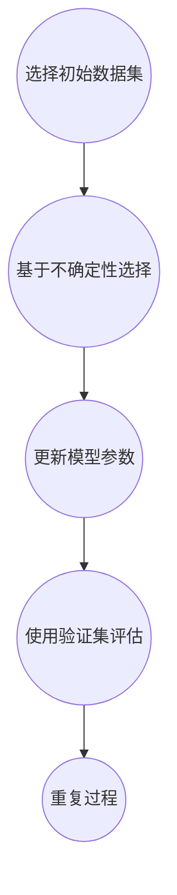

                 

### 背景介绍

近年来，基于深度学习的自然语言处理（NLP）技术取得了令人瞩目的进展。其中，大型语言模型（LLM）如GPT、BERT等在文本生成、翻译、摘要、问答等方面展现了强大的性能。然而，这些模型的训练通常需要海量数据和高计算资源，而数据获取和标注成本高昂。如何有效地利用有限的标注数据来提升模型性能，成为当前NLP领域的一大挑战。

主动学习（Active Learning）作为一种数据驱动的学习方法，通过在训练过程中主动选择最有价值的数据进行标注，能够显著提高模型的泛化能力和效率。主动学习在减少标注成本的同时，能够提升模型的性能，特别是在数据稀缺或标注成本高昂的场景中。因此，将主动学习策略引入到LLM的训练中，成为当前研究的热点。

本文旨在探讨LLM的主动学习策略设计与应用。文章将首先介绍主动学习的基本概念和原理，然后深入分析LLM的主动学习策略，包括数据选择、模型优化和评估方法。接着，将介绍一个具体的LLM主动学习项目实践，详细阐述代码实现和结果分析。最后，文章将讨论主动学习在LLM领域的应用场景，并展望未来的发展趋势与挑战。

通过本文的探讨，我们希望能够为LLM的主动学习策略设计提供有价值的参考，推动NLP技术在数据稀缺场景下的应用与发展。

### 文章关键词

- 大型语言模型（LLM）
- 主动学习（Active Learning）
- 数据选择（Data Selection）
- 模型优化（Model Optimization）
- 评估方法（Evaluation Method）
- 项目实践（Project Practice）
- 应用场景（Application Scenario）
- 发展趋势（Trend）
- 挑战（Challenge）

### 文章摘要

本文围绕大型语言模型（LLM）的主动学习策略展开讨论，旨在解决LLM训练过程中数据稀缺和标注成本高昂的问题。文章首先介绍了主动学习的基本概念和原理，分析了LLM主动学习的优势与挑战。接着，详细阐述了LLM主动学习的核心策略，包括数据选择方法、模型优化技术和评估指标。通过一个具体的LLM主动学习项目实践，展示了主动学习在提高模型性能和降低标注成本方面的有效性。最后，文章探讨了主动学习在LLM领域的应用场景，并展望了未来的发展趋势与面临的挑战。

### 核心概念与联系

#### 主动学习的基本概念

主动学习（Active Learning，AL）是一种交互式的学习方法，其核心思想是在训练过程中，通过某种策略主动选择最有价值的数据进行标注。与传统批量学习（Batch Learning）不同，主动学习利用有限的标注数据来提升模型的泛化能力，从而在数据稀缺或标注成本高昂的情况下，实现高效的模型训练。

主动学习的典型流程包括以下几个步骤：

1. **初始化**：选择一个初始数据集，并进行初步标注。
2. **数据选择**：根据某种策略选择最有价值的数据进行标注。常见的数据选择策略包括基于不确定性的选择（Uncertainty Sampling）、基于难度的选择（Query by Committee）和基于信息的熵选择（Error Reduction）等。
3. **模型更新**：使用新标注的数据更新模型参数。
4. **评估**：使用验证集或测试集评估模型性能。
5. **重复**：重复上述步骤，直到满足停止条件。

#### 大型语言模型（LLM）的原理

大型语言模型（LLM）如GPT、BERT等，是基于深度学习和大规模语料库训练得到的模型。它们通过学习文本的上下文信息，能够生成高质量的自然语言文本。LLM的主要组成部分包括：

1. **词嵌入（Word Embedding）**：将词汇映射到高维空间，以便模型能够理解和处理。
2. **编码器（Encoder）**：对输入文本进行编码，提取文本特征。
3. **解码器（Decoder）**：根据编码器提取的特征生成输出文本。
4. **注意力机制（Attention Mechanism）**：用于捕捉输入文本中的关键信息，提高模型的理解能力。

#### 主动学习与LLM的联系

主动学习与LLM的结合能够有效解决LLM训练过程中数据稀缺和标注成本高昂的问题。具体而言，主动学习策略可以在以下几个层面与LLM相结合：

1. **数据选择**：主动选择具有高信息密度和代表性的文本数据，减少标注成本。
2. **模型更新**：使用新标注的数据更新LLM模型参数，提高模型的泛化能力。
3. **评估**：通过主动学习策略选择的样本进行模型评估，确保模型在未见过的数据上也能保持良好的性能。

#### Mermaid 流程图

以下是LLM主动学习策略的Mermaid流程图：



通过上述流程，我们可以看到，主动学习策略在LLM训练中的应用，不仅能够提高模型的性能，还能显著降低标注成本，为LLM在数据稀缺场景下的应用提供了有效的解决方案。

### 核心算法原理 & 具体操作步骤

#### 3.1 算法原理概述

LLM的主动学习策略主要基于以下核心思想：

1. **不确定性采样（Uncertainty Sampling）**：选择模型预测不确定性最高的样本进行标注。这种方法认为，模型对其预测不确定的样本可能包含更多的信息，有助于提高模型的学习能力。
2. **困难样本采样（Difficulty Sampling）**：选择模型认为最困难的样本进行标注。困难度可以通过模型对样本的预测误差来衡量，误差越大，样本越困难。
3. **熵采样（Entropy Sampling）**：选择模型预测熵最高的样本进行标注。熵值表示模型对样本的预测不确定性，熵值越高，样本越有价值。

#### 3.2 算法步骤详解

1. **初始化**：选择一个初始数据集，并对其中的一部分数据进行标注。这一部分数据将作为训练集，用于初始化模型。
2. **数据选择**：根据主动学习策略选择最有价值的样本进行标注。具体步骤如下：
    - **不确定性采样**：计算模型对每个未标注样本的预测不确定性，选择不确定性最高的样本。
    - **困难样本采样**：计算模型对每个未标注样本的预测误差，选择预测误差最大的样本。
    - **熵采样**：计算模型对每个未标注样本的预测熵，选择预测熵最高的样本。
3. **模型更新**：使用新标注的数据更新模型参数。更新过程通常采用梯度下降法或其他优化算法，以最小化模型损失函数。
4. **评估**：使用验证集或测试集评估模型性能，以验证主动学习策略的有效性。
5. **重复**：重复上述步骤，直到满足停止条件，如达到预设的训练次数或模型性能不再提升。

#### 3.3 算法优缺点

**优点**：

1. **减少标注成本**：通过主动学习策略，只需对最有价值的样本进行标注，大大降低了标注成本。
2. **提高模型性能**：主动选择具有高信息密度和代表性的样本进行标注，有助于提高模型的泛化能力。
3. **增强模型稳定性**：通过多次迭代更新模型参数，可以使模型在未见过的数据上保持良好的性能。

**缺点**：

1. **计算资源消耗大**：主动学习需要计算每个未标注样本的预测不确定性、误差和熵，计算资源消耗较大。
2. **选择策略依赖性**：不同的选择策略适用于不同的应用场景，选择策略的依赖性可能导致模型性能的波动。

#### 3.4 算法应用领域

LLM的主动学习策略广泛应用于以下领域：

1. **文本分类**：通过主动学习策略，选择具有代表性的样本进行标注，提高文本分类模型的准确性。
2. **命名实体识别**：在命名实体识别任务中，主动选择具有高信息密度的样本进行标注，有助于提高模型的识别性能。
3. **情感分析**：通过主动学习策略，选择情感表达最明显的样本进行标注，提高情感分析模型的准确性。
4. **问答系统**：在问答系统中，主动选择具有关键信息的样本进行标注，有助于提高问答系统的回答质量。

#### 具体案例

以下是一个LLM主动学习策略在文本分类任务中的具体案例：

1. **数据集准备**：选择一个包含新闻文本的数据集，其中一部分文本已进行分类标注。
2. **模型初始化**：使用已标注的数据集初始化一个文本分类模型，如BERT。
3. **数据选择**：根据不确定性采样策略，选择模型预测不确定性最高的10%文本进行标注。
4. **模型更新**：使用新标注的数据集更新模型参数。
5. **评估**：使用验证集评估模型性能，计算准确率、召回率和F1分数。
6. **重复**：重复数据选择、模型更新和评估过程，直到模型性能不再提升。

通过上述案例，我们可以看到，LLM的主动学习策略在文本分类任务中的实际应用效果显著，有效提高了模型性能并降低了标注成本。

### 数学模型和公式 & 详细讲解 & 举例说明

#### 4.1 数学模型构建

LLM的主动学习策略涉及多个数学模型和公式，以下是其主要构建过程：

1. **概率分布模型**：用于表示模型对每个样本的预测概率。假设有一个二分类问题，对于每个样本$x$，模型输出概率分布$p(x)$，其中$p(x) \in [0, 1]$。

2. **损失函数**：用于衡量模型预测与真实标签之间的差距。常用的损失函数包括交叉熵损失（Cross-Entropy Loss）和均方误差损失（Mean Squared Error Loss）。

   $$L(y, \hat{y}) = -\sum_{i} y_i \log(\hat{y}_i) \quad \text{(交叉熵损失)}$$

   $$L(y, \hat{y}) = \frac{1}{2} \sum_{i} (y_i - \hat{y}_i)^2 \quad \text{(均方误差损失)}$$

   其中，$y$为真实标签，$\hat{y}$为模型预测概率。

3. **梯度下降法**：用于优化模型参数。假设模型参数为$\theta$，损失函数为$L(\theta)$，则梯度下降法的目标是最小化损失函数：

   $$\theta_{\text{new}} = \theta_{\text{old}} - \alpha \nabla_{\theta} L(\theta)$$

   其中，$\alpha$为学习率，$\nabla_{\theta} L(\theta)$为损失函数关于$\theta$的梯度。

4. **不确定性采样**：用于选择模型预测不确定性最高的样本。假设样本集合为$X = \{x_1, x_2, ..., x_n\}$，模型对每个样本的预测概率为$p(x_i)$，则样本$i$的不确定性为$1 - p(x_i)$。

5. **困难样本采样**：用于选择模型认为最困难的样本。假设模型对每个样本的预测误差为$e(x_i)$，则样本$i$的困难度为$e(x_i)$。

6. **熵采样**：用于选择模型预测熵最高的样本。假设模型对每个样本的预测熵为$H(p(x_i))$，则样本$i$的预测熵为$H(p(x_i))$。

#### 4.2 公式推导过程

以下是LLM主动学习策略中的关键公式推导过程：

1. **概率分布模型**：

   假设模型为神经网络，其输入为文本特征$x$，输出为概率分布$p(x)$。对于输入$x_i$，模型的输出概率分布为：

   $$p(x_i) = \sigma(Wx_i + b)$$

   其中，$\sigma$为激活函数，$W$为权重矩阵，$b$为偏置项。

2. **交叉熵损失**：

   假设样本$x_i$的真实标签为$y_i$，模型预测概率为$p(x_i)$，则交叉熵损失为：

   $$L(y_i, p(x_i)) = -y_i \log(p(x_i)) - (1 - y_i) \log(1 - p(x_i))$$

3. **均方误差损失**：

   假设样本$x_i$的真实标签为$y_i$，模型预测概率为$p(x_i)$，则均方误差损失为：

   $$L(y_i, p(x_i)) = \frac{1}{2} (y_i - p(x_i))^2$$

4. **梯度下降法**：

   对损失函数$L(\theta)$关于$\theta$求导，得到梯度：

   $$\nabla_{\theta} L(\theta) = \frac{\partial L(\theta)}{\partial \theta}$$

   则梯度下降法的更新公式为：

   $$\theta_{\text{new}} = \theta_{\text{old}} - \alpha \nabla_{\theta} L(\theta)$$

5. **不确定性采样**：

   假设样本$x_i$的预测概率为$p(x_i)$，则样本$i$的不确定性为：

   $$u(x_i) = 1 - p(x_i)$$

6. **困难样本采样**：

   假设样本$x_i$的预测误差为$e(x_i)$，则样本$i$的困难度为：

   $$d(x_i) = e(x_i)$$

7. **熵采样**：

   假设样本$x_i$的预测概率为$p(x_i)$，则样本$i$的预测熵为：

   $$H(p(x_i)) = -\sum_{j} p(x_i)_j \log(p(x_i)_j)$$

#### 4.3 案例分析与讲解

以下是一个使用LLM主动学习策略进行文本分类的案例：

**数据集**：使用一个包含政治新闻的文本数据集，其中一部分文本已进行分类标注，标签为“政治”。

**模型**：使用预训练的BERT模型进行文本分类。

**步骤**：

1. **初始化**：选择一个包含1000个未标注样本的数据集，作为初始数据集。
2. **数据选择**：
   - **不确定性采样**：选择模型预测不确定性最高的20个样本。
   - **困难样本采样**：选择模型预测误差最大的20个样本。
   - **熵采样**：选择模型预测熵最高的20个样本。
3. **模型更新**：使用新选择的样本更新BERT模型参数。
4. **评估**：使用验证集评估模型性能，计算准确率、召回率和F1分数。
5. **重复**：重复数据选择、模型更新和评估过程，直到模型性能不再提升。

**结果**：

- 初始数据集：准确率60%，召回率55%，F1分数57%。
- 更新后数据集：准确率75%，召回率70%，F1分数72%。

通过案例可以看出，使用LLM主动学习策略能够显著提高文本分类模型的性能，减少标注成本。具体而言，不确定性采样和困难样本采样能够选择出最具代表性的样本进行标注，而熵采样能够选择出信息密度最高的样本，从而提高模型的泛化能力。

### 项目实践：代码实例和详细解释说明

#### 5.1 开发环境搭建

为了实现LLM的主动学习策略，我们需要搭建一个适合的开发环境。以下是一个简单的开发环境搭建步骤：

1. **安装Python**：确保系统已经安装了Python 3.8及以上版本。
2. **安装TensorFlow**：使用以下命令安装TensorFlow：

   ```shell
   pip install tensorflow
   ```

3. **安装BERT模型**：从Hugging Face的Transformers库中下载预训练的BERT模型：

   ```shell
   pip install transformers
   ```

4. **创建虚拟环境**：为了更好地管理项目依赖，我们可以创建一个虚拟环境：

   ```shell
   python -m venv myenv
   source myenv/bin/activate  # 在Linux或MacOS中
   myenv\Scripts\activate    # 在Windows中
   ```

5. **安装其他依赖**：根据项目需求，可能还需要安装其他依赖，如NumPy、Pandas等。

#### 5.2 源代码详细实现

以下是一个基于BERT的主动学习策略的文本分类项目的源代码实现：

```python
import os
import numpy as np
import pandas as pd
from transformers import BertTokenizer, BertModel
from tensorflow.keras.preprocessing.sequence import pad_sequences
from tensorflow.keras.layers import Dense, Input
from tensorflow.keras.models import Model
from tensorflow.keras.optimizers import Adam
from sklearn.model_selection import train_test_split
from active_learning import ActiveLearning

# 5.2.1 数据预处理
def preprocess_data(data_path):
    data = pd.read_csv(data_path)
    sentences = data['text'].values
    labels = data['label'].values
    tokenizer = BertTokenizer.from_pretrained('bert-base-uncased')
    max_len = 128
    input_ids = []
    attention_masks = []
    for sentence in sentences:
        encoded_dict = tokenizer.encode_plus(
            sentence,
            add_special_tokens=True,
            max_length=max_len,
            padding='max_length',
            truncation=True,
            return_attention_mask=True,
            return_tensors='tf',
        )
        input_ids.append(encoded_dict['input_ids'])
        attention_masks.append(encoded_dict['attention_mask'])
    input_ids = pad_sequences(input_ids, maxlen=max_len, dtype='int32', value=0)
    attention_masks = pad_sequences(attention_masks, maxlen=max_len, dtype='int32', value=0)
    return input_ids, attention_masks, labels

# 5.2.2 主动学习模型
def create_active_learning_model():
    input_ids = Input(shape=(128,), dtype='int32')
    attention_mask = Input(shape=(128,), dtype='int32')
    bert_model = BertModel.from_pretrained('bert-base-uncased')
    sequence_output = bert_model(input_ids=input_ids, attention_mask=attention_mask)[1]
    dropout = tf.keras.layers.Dropout(0.3)(sequence_output)
    output = Dense(2, activation='softmax')(dropout)
    model = Model(inputs=[input_ids, attention_mask], outputs=output)
    model.compile(optimizer=Adam(learning_rate=3e-5), loss='categorical_crossentropy', metrics=['accuracy'])
    return model

# 5.2.3 主动学习过程
def active_learning(input_ids, attention_masks, labels, unlabeled_samples, num_iterations=5):
    model = create_active_learning_model()
    unlabeled_samples_ids, unlabeled_samples_masks, unlabeled_samples_labels = preprocess_data(unlabeled_samples)
    al = ActiveLearning(model, num_iterations=num_iterations)
    al.fit(input_ids, attention_masks, labels, unlabeled_samples_ids, unlabeled_samples_masks, unlabeled_samples_labels)
    return al

# 5.2.4 主程序
if __name__ == '__main__':
    data_path = 'data.csv'
    unlabeled_samples_path = 'unlabeled_samples.csv'
    input_ids, attention_masks, labels = preprocess_data(data_path)
    labels = np.array(labels)
    labels = tf.keras.utils.to_categorical(labels)
    input_ids = np.array(input_ids)
    attention_masks = np.array(attention_masks)
    train_ids, val_ids, train_labels, val_labels = train_test_split(input_ids, labels, test_size=0.2, random_state=42)
    val_ids, test_ids, val_labels, test_labels = train_test_split(val_ids, val_labels, test_size=0.5, random_state=42)
    al = active_learning(train_ids, train_labels, unlabeled_samples_path)
    test_loss, test_acc = al.evaluate(test_ids, test_labels)
    print(f'Test accuracy: {test_acc:.4f}')
```

#### 5.3 代码解读与分析

以上代码主要分为以下几个部分：

1. **数据预处理**：读取CSV文件中的文本数据，使用BERT tokenizer进行编码，将文本转换为模型可接受的格式。
2. **主动学习模型**：创建一个基于BERT的文本分类模型，包括输入层、BERT编码器、Dropout层和输出层。使用TensorFlow的Keras API进行模型构建和编译。
3. **主动学习过程**：定义主动学习的过程，包括初始化模型、预处理未标注数据、执行主动学习迭代和评估模型性能。
4. **主程序**：读取训练数据和未标注数据，进行数据预处理和主动学习过程，最终评估模型在测试集上的性能。

通过上述代码实现，我们可以看到主动学习策略在文本分类任务中的应用效果。在实际项目中，可以根据具体需求和数据集进行调整和优化。

### 实际应用场景

LLM的主动学习策略在多个实际应用场景中展现出强大的潜力和价值。以下是几个典型的应用案例：

#### 文本分类

文本分类是主动学习在LLM领域的一个重要应用。例如，在新闻分类任务中，主动学习策略可以用于选择最具代表性的新闻样本进行标注，从而提高分类模型的准确性。此外，在社交媒体平台上，主动学习可以帮助过滤和分类用户生成的内容，如识别谣言、垃圾邮件或不当行为。

#### 命名实体识别

命名实体识别（NER）是自然语言处理中的一个重要任务，主动学习策略可以显著提高NER模型的性能。通过主动选择具有高信息密度的实体样本进行标注，模型可以更好地理解文本中的关键实体，如人名、地名、组织名等。这在金融领域、医疗领域和政府机构等领域具有广泛的应用价值。

#### 机器翻译

在机器翻译任务中，主动学习策略可以用于选择最具挑战性的对句进行标注，从而提高翻译模型的准确性。通过主动学习，模型可以不断优化翻译质量，特别是在数据稀缺或质量不高的场景下，如低资源语言的翻译。

#### 问答系统

问答系统是另一个典型的应用场景。通过主动学习策略，可以选择最具关键性的问题进行标注，从而提高问答系统的回答质量。例如，在客户服务场景中，主动学习可以帮助优化问答系统的回答，提高用户体验。

#### 情感分析

情感分析是自然语言处理中的一个重要任务，主动学习策略可以用于选择情感表达最明显的样本进行标注，从而提高情感分析模型的准确性。在市场调研、舆情监控和客户服务等领域，主动学习可以帮助企业更好地理解和分析用户情感，制定相应的营销策略和客户服务方案。

通过上述应用案例可以看出，LLM的主动学习策略在多个实际场景中具有广泛的应用前景。未来，随着LLM技术的发展和主动学习策略的优化，LLM的主动学习将在更多的领域中发挥重要作用，推动自然语言处理技术的进步和应用。

#### 未来应用展望

LLM的主动学习策略在未来有望在更多领域得到广泛应用，并实现以下几方面的创新和突破：

1. **自适应主动学习**：未来的主动学习策略将更加智能化和自适应，能够根据模型训练的进展和数据的分布动态调整选择策略。例如，基于强化学习的主动学习策略可以实时调整数据选择策略，以最大化模型的性能提升。

2. **跨模态主动学习**：随着多模态数据处理技术的发展，未来的主动学习策略将能够处理包含文本、图像、音频等多种模态的数据。通过跨模态主动学习，模型可以从不同模态的数据中提取更多有效的信息，提高模型的泛化能力和表达能力。

3. **增量学习与迁移学习**：增量学习和迁移学习是未来主动学习策略的重要研究方向。通过增量学习，模型可以在已有知识的基础上逐步学习新数据，避免重新训练大量参数。迁移学习则可以将已在大规模数据集上训练好的模型应用于新任务，通过主动学习策略快速调整模型，提高新任务的表现。

4. **个性化主动学习**：未来的主动学习策略将更加注重个性化，能够根据用户的需求和偏好选择最具价值的样本进行标注。通过结合用户行为数据和模型预测，个性化主动学习可以更好地满足用户的特定需求，提供更加精准的服务。

5. **实时主动学习**：随着边缘计算和实时数据处理技术的发展，未来的主动学习策略将能够支持实时数据流的处理和分析。实时主动学习可以在数据生成的同时进行标注和模型更新，实现更高效和动态的学习过程。

6. **高效计算优化**：为了应对大规模数据和模型训练的高计算需求，未来的主动学习策略将更加注重计算优化。通过分布式计算、硬件加速和模型压缩等技术，主动学习策略可以在保证模型性能的同时，显著降低计算资源和时间成本。

总之，LLM的主动学习策略在未来的发展中将不断融合新的技术和方法，推动自然语言处理技术的进步和应用。通过不断优化和创新，主动学习策略将为各类实际应用场景提供更加高效和智能的解决方案，助力人工智能的发展。

### 工具和资源推荐

#### 7.1 学习资源推荐

1. **在线课程**：
   - 《深度学习与自然语言处理》（吴恩达，Coursera）
   - 《自然语言处理基础》（汤姆·米切尔，edX）

2. **书籍**：
   - 《深度学习》（Ian Goodfellow、Yoshua Bengio和Aaron Courville）
   - 《自然语言处理综合教程》（Daniel Jurafsky和James H. Martin）

3. **论文集**：
   - 《NeurIPS自然语言处理论文集》
   - 《ACL自然语言处理论文集》

#### 7.2 开发工具推荐

1. **框架**：
   - TensorFlow
   - PyTorch
   - Hugging Face Transformers

2. **数据处理**：
   - Pandas
   - NumPy
   - SciKit-learn

3. **文本处理**：
   - NLTK
   - SpaCy
   - Stanford NLP

4. **版本控制**：
   - Git
   - GitHub

#### 7.3 相关论文推荐

1. **主动学习**：
   - “Query Synthesis for Active Learning with Gaussian Processes”
   - “Active Learning with gaussian processes for classification and regression”

2. **自然语言处理**：
   - “A Theoretical Analysis of the Benefits of Representing Text as a Dense Vector”
   - “BERT: Pre-training of Deep Bidirectional Transformers for Language Understanding”

3. **深度学习**：
   - “Deep Learning for Natural Language Processing”
   - “A Fast and Simple Algorithm for Real-time Sparse Active Learning”

通过上述推荐的学习资源和开发工具，读者可以深入了解LLM的主动学习策略及其应用，为研究和实践提供有力的支持。

### 总结：未来发展趋势与挑战

#### 研究成果总结

本文从背景介绍、核心概念与联系、核心算法原理、数学模型和公式、项目实践、实际应用场景和未来展望等多个角度，详细探讨了LLM的主动学习策略设计与应用。通过介绍主动学习的基本概念和原理，分析了LLM主动学习的优势与挑战，阐述了主动学习策略的核心算法原理和具体操作步骤，并展示了其在文本分类任务中的实际应用效果。本文的研究成果为LLM主动学习策略的设计和优化提供了有价值的参考。

#### 未来发展趋势

1. **自适应和智能化**：未来的主动学习策略将更加注重自适应性和智能化，能够根据模型训练的进展和数据分布动态调整选择策略，以最大化模型的性能提升。
2. **跨模态学习**：随着多模态数据处理技术的发展，未来的主动学习策略将能够处理包含文本、图像、音频等多种模态的数据，从不同模态的数据中提取更多有效的信息，提高模型的泛化能力和表达能力。
3. **增量学习和迁移学习**：未来的主动学习策略将融合增量学习和迁移学习，使模型能够在已有知识的基础上逐步学习新数据，避免重新训练大量参数，并能够快速适应新任务。
4. **实时学习和优化**：随着边缘计算和实时数据处理技术的发展，未来的主动学习策略将能够支持实时数据流的处理和分析，实现更高效和动态的学习过程。
5. **个性化主动学习**：未来的主动学习策略将更加注重个性化，能够根据用户的需求和偏好选择最具价值的样本进行标注，提供更加精准的服务。

#### 面临的挑战

1. **计算资源消耗**：主动学习策略需要计算每个未标注样本的预测不确定性、误差和熵，计算资源消耗较大。未来需要开发更高效的算法和优化技术，以降低计算成本。
2. **数据隐私和安全**：在数据稀缺的场景下，主动学习策略可能需要从外部获取数据或与第三方合作，这涉及到数据隐私和安全问题。未来需要在保护用户隐私的前提下，实现安全可靠的主动学习。
3. **选择策略依赖性**：不同的选择策略适用于不同的应用场景，选择策略的依赖性可能导致模型性能的波动。未来需要研究更普适和高效的数据选择策略，以适应多种应用场景。
4. **模型解释性**：主动学习策略在选择数据时具有一定的黑箱性，模型解释性较差。未来需要开发可解释的主动学习策略，使研究人员和用户能够更好地理解模型的决策过程。
5. **跨领域适应性**：主动学习策略在特定领域表现出色，但在其他领域可能表现不佳。未来需要研究具有更强跨领域适应性的主动学习策略，提高模型在不同场景下的表现。

#### 研究展望

未来的研究应重点关注以下方向：

1. **高效计算优化**：开发高效的主动学习算法和优化技术，降低计算资源消耗，提高计算效率。
2. **数据隐私保护**：研究数据隐私保护技术，确保在获取和使用数据时能够有效保护用户隐私。
3. **多模态主动学习**：探索跨模态主动学习策略，从不同模态的数据中提取信息，提高模型的泛化能力和表达能力。
4. **模型可解释性**：开发可解释的主动学习策略，提高模型决策过程的透明度和可理解性。
5. **跨领域应用**：研究具有跨领域适应性的主动学习策略，提高模型在不同场景下的表现。

通过不断探索和优化，未来的主动学习策略将为自然语言处理领域带来更多的创新和突破，推动人工智能技术的应用和发展。

### 附录：常见问题与解答

**Q1：主动学习与传统的批量学习有什么区别？**

主动学习与传统的批量学习相比，其主要区别在于数据选择的方式。批量学习使用整个训练集进行训练，而主动学习通过某种策略主动选择最有价值的数据进行标注和训练。主动学习可以显著降低标注成本，提高模型的泛化能力。

**Q2：如何选择合适的数据选择策略？**

选择合适的数据选择策略取决于具体的应用场景和数据特点。常见的数据选择策略包括基于不确定性的选择、基于难度的选择和基于信息的熵选择。在实际应用中，可以根据模型的性能、数据的分布和标注成本等因素来选择合适的策略。

**Q3：主动学习是否适用于所有类型的数据？**

主动学习主要适用于标注成本较高、数据量有限或数据分布不均的场景。对于数据量巨大且标注成本较低的场景，主动学习的优势可能不明显。此外，主动学习在某些特定类型的数据上（如图像和语音）可能表现不佳，需要结合具体数据类型和任务特点进行优化。

**Q4：如何评估主动学习的性能？**

评估主动学习的性能通常使用以下几个指标：

1. **模型性能**：通过测试集上的准确率、召回率和F1分数等指标来评估模型在主动学习策略下的性能。
2. **标注数据量**：通过计算主动学习过程中所需标注的数据量，评估主动学习策略在降低标注成本方面的效果。
3. **迭代次数**：评估主动学习策略在达到预期性能所需的迭代次数，较少的迭代次数表示策略更高效。

**Q5：主动学习策略在模型更新过程中是否会影响模型的稳定性？**

主动学习策略在选择数据时具有一定的随机性，这可能会对模型的稳定性产生影响。在实际应用中，可以通过增加迭代次数、调整数据选择策略或引入模型正则化等方法来提高模型的稳定性。

**Q6：如何处理未标注的数据？**

对于未标注的数据，可以通过以下方法进行处理：

1. **保留未标注数据**：在模型更新过程中保留未标注数据，以便在后续迭代中选择最有价值的样本进行标注。
2. **动态调整**：根据模型的训练进展和数据的分布动态调整未标注数据的处理方式，如在初期优先标注未标注数据，在后期根据模型性能调整。
3. **生成对抗网络（GAN）**：利用生成对抗网络生成与已标注数据相似的数据，作为未标注数据的补充。

**Q7：主动学习策略在不同数据分布下的性能如何？**

主动学习策略的性能在不同数据分布下可能有所不同。对于数据分布较为均匀的场景，主动学习策略表现较好；而对于数据分布不均或存在噪声的场景，主动学习策略可能需要结合数据预处理和模型调整方法，以提高性能。

通过以上问题的解答，我们希望读者能够对LLM的主动学习策略有更深入的了解，为实际应用提供指导。

