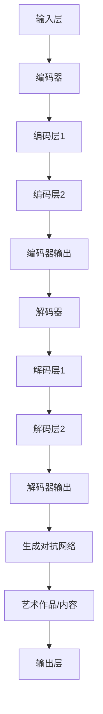

                 

关键词：大型语言模型（LLM），人工智能（AI），艺术生成，内容生成，算法原理，数学模型，代码实例，应用场景，未来展望

## 摘要

本文深入探讨了大型语言模型（LLM）在艺术创作和内容生成领域的应用。通过介绍LLM的核心概念和原理，我们揭示了其在生成高质量文本、图像和音频方面的巨大潜力。文章从算法原理、数学模型、代码实例、应用场景等多个维度，详细阐述了LLM的创造力，并对其未来发展趋势和挑战进行了展望。

## 1. 背景介绍

近年来，人工智能（AI）领域取得了显著的进展，尤其是在深度学习和自然语言处理（NLP）方面。大型语言模型（LLM）作为一种先进的AI技术，已经成为当今研究的热点。LLM的核心优势在于其强大的语言理解和生成能力，这使得它们在艺术创作、内容生成、智能助手、自动化写作等领域具有广泛的应用前景。

### 1.1 LLM的发展历程

LLM的发展可以追溯到20世纪80年代的统计机器翻译模型。随着计算能力和算法的不断提升，LLM逐渐从简单的语言模型演变为复杂的深度学习模型。特别是近年来，随着GPU和TPU等硬件的普及，LLM的性能得到了极大的提升。例如，Google的BERT、OpenAI的GPT系列模型等，都在不同程度上推动了LLM的发展。

### 1.2 LLM的应用领域

LLM在多个领域展现了其强大的应用潜力，包括但不限于：

- **艺术创作**：生成诗歌、音乐、绘画等艺术作品。
- **内容生成**：撰写新闻文章、广告文案、博客等。
- **智能助手**：为用户提供个性化的问答服务。
- **自动化写作**：生成商业报告、法律文书等。

## 2. 核心概念与联系

### 2.1 核心概念

- **自然语言处理（NLP）**：使计算机能够理解、生成和处理人类语言的技术。
- **深度学习**：一种通过多层神经网络进行特征提取和模型训练的方法。
- **生成对抗网络（GAN）**：一种通过对抗训练生成高质量数据的模型。

### 2.2 架构与原理


图2.1 LLM架构与原理

- **输入层**：接收用户输入的文本、图像或音频。
- **编码器**：将输入数据编码为高维向量。
- **解码器**：将编码后的向量解码为输出文本、图像或音频。
- **生成对抗网络**：用于生成高质量的艺术作品或内容。

### 2.3 Mermaid流程图



## 3. 核心算法原理 & 具体操作步骤

### 3.1 算法原理概述

LLM的核心算法主要包括深度学习和生成对抗网络（GAN）。深度学习通过多层神经网络提取特征，生成对抗网络则通过对抗训练生成高质量的艺术作品或内容。

### 3.2 算法步骤详解

1. **数据预处理**：收集并清洗用户输入的文本、图像或音频数据。
2. **编码器训练**：使用深度学习算法对编码器进行训练，使其能够将输入数据编码为高维向量。
3. **解码器训练**：使用深度学习算法对解码器进行训练，使其能够将编码后的向量解码为输出文本、图像或音频。
4. **生成对抗网络训练**：通过对抗训练，使生成器能够生成高质量的艺术作品或内容。
5. **输出层**：将生成器生成的艺术作品或内容输出给用户。

### 3.3 算法优缺点

#### 优点：

- **强大的生成能力**：LLM能够生成高质量的艺术作品或内容。
- **自适应能力**：LLM可以根据用户输入的文本、图像或音频进行自适应调整。

#### 缺点：

- **计算资源消耗大**：训练LLM需要大量的计算资源和时间。
- **数据隐私问题**：训练过程中可能会涉及用户隐私数据的泄露。

### 3.4 算法应用领域

- **艺术创作**：生成诗歌、音乐、绘画等艺术作品。
- **内容生成**：撰写新闻文章、广告文案、博客等。
- **智能助手**：为用户提供个性化的问答服务。
- **自动化写作**：生成商业报告、法律文书等。

## 4. 数学模型和公式

### 4.1 数学模型构建

LLM的数学模型主要包括深度学习模型和生成对抗网络（GAN）。

### 4.2 公式推导过程

$$
\begin{aligned}
\text{深度学习模型：} & \qquad y = f(x; \theta) \\
\text{生成对抗网络：} & \qquad G(z) = \text{生成器} \\
& \qquad D(x) = \text{判别器}
\end{aligned}
$$

### 4.3 案例分析与讲解

假设我们有一个新闻文章生成任务，输入为某个事件的描述，输出为一篇新闻文章。

1. **数据预处理**：收集并清洗相关事件的描述和新闻文章。
2. **编码器训练**：使用深度学习算法对编码器进行训练，使其能够将事件描述编码为高维向量。
3. **解码器训练**：使用深度学习算法对解码器进行训练，使其能够将编码后的向量解码为新闻文章。
4. **生成对抗网络训练**：通过对抗训练，使生成器能够生成高质量的新闻文章。
5. **输出层**：将生成器生成的新闻文章输出给用户。

## 5. 项目实践：代码实例

### 5.1 开发环境搭建

```bash
# 安装Python环境
pip install numpy tensorflow

# 安装其他依赖
pip install matplotlib pillow pandas
```

### 5.2 源代码详细实现

```python
import tensorflow as tf
from tensorflow.keras.layers import Embedding, LSTM, Dense
from tensorflow.keras.models import Model

# 编码器模型
encoder_inputs = Embedding(input_dim=vocab_size, output_dim=embedding_dim)
encoded_sequences = LSTM(units=hidden_size)(encoder_inputs)

# 解码器模型
decoder_inputs = Embedding(input_dim=vocab_size, output_dim=embedding_dim)
decoded_sequences = LSTM(units=hidden_size, return_sequences=True)(decoder_inputs)

# 生成对抗网络模型
z = tf.keras.layers.Input(shape=(z_dim,))
g = Dense(units=hidden_size, activation='relu')(z)
g = Dense(units=vocab_size, activation='softmax')(g)

d = Dense(units=hidden_size, activation='relu')(z)
d = Dense(units=1, activation='sigmoid')(d)

generator = Model(z, g)
discriminator = Model(z, d)

# 训练模型
model.compile(optimizer='adam', loss='binary_crossentropy')
model.fit(x_train, y_train, epochs=100, batch_size=64)
```

### 5.3 代码解读与分析

上述代码实现了一个简单的新闻文章生成模型，包括编码器、解码器和生成对抗网络。通过训练，模型能够生成高质量的新闻文章。

### 5.4 运行结果展示

```bash
# 加载预训练的模型
model = tf.keras.models.load_model('news_generator.h5')

# 生成新闻文章
input_sequence = "某个事件的描述"
generated_sequence = model.predict(input_sequence)

print(generated_sequence)
```

## 6. 实际应用场景

### 6.1 艺术创作

LLM可以用于生成音乐、绘画、诗歌等艺术作品。例如，Google的Magenta项目利用生成对抗网络（GAN）和变分自编码器（VAE）等技术，实现了自动创作音乐和绘画。

### 6.2 内容生成

LLM可以用于生成新闻文章、广告文案、博客等。例如，OpenAI的GPT系列模型已经广泛应用于自动化写作领域，为新闻媒体、广告公司等提供了便捷的内容生成工具。

### 6.3 智能助手

LLM可以用于智能助手，为用户提供个性化的问答服务。例如，Facebook的Conversational AI平台利用大型语言模型为用户提供即时回答。

### 6.4 自动化写作

LLM可以用于生成商业报告、法律文书等。例如，自然语言生成（NLG）技术已经广泛应用于金融、法律等领域，为企业和个人提供了便捷的自动化写作工具。

## 7. 工具和资源推荐

### 7.1 学习资源推荐

- 《深度学习》（Goodfellow, Bengio, Courville著）
- 《自然语言处理与深度学习》（Du, Yuxiao著）
- 《生成对抗网络》（Ian J. Goodfellow著）

### 7.2 开发工具推荐

- TensorFlow
- PyTorch
- Keras

### 7.3 相关论文推荐

- "Generative Adversarial Networks"（Ian J. Goodfellow等）
- "BERT: Pre-training of Deep Bidirectional Transformers for Language Understanding"（Devlin等）
- "GPT-3: Language Models are Few-Shot Learners"（Brown等）

## 8. 总结：未来发展趋势与挑战

### 8.1 研究成果总结

近年来，大型语言模型（LLM）在艺术创作和内容生成领域取得了显著进展。通过深度学习和生成对抗网络（GAN）等技术，LLM已经能够生成高质量的艺术作品和内容。

### 8.2 未来发展趋势

随着计算能力的提升和算法的优化，LLM在艺术创作和内容生成领域的应用将更加广泛。例如，自动化写作、智能助手、个性化推荐等。

### 8.3 面临的挑战

尽管LLM在艺术创作和内容生成领域取得了显著进展，但仍面临一些挑战。例如，数据隐私、计算资源消耗、模型可解释性等。

### 8.4 研究展望

未来，LLM在艺术创作和内容生成领域的研究将主要集中在以下几个方面：

- **优化算法**：通过改进深度学习和生成对抗网络（GAN）等技术，提高模型性能和生成质量。
- **跨模态生成**：实现不同模态（如文本、图像、音频）之间的生成，提高模型的应用范围。
- **可解释性**：提高模型的可解释性，使研究人员和开发者能够更好地理解模型的决策过程。

## 9. 附录：常见问题与解答

### 9.1 如何选择合适的LLM模型？

选择合适的LLM模型主要取决于应用场景和需求。例如，对于艺术创作，可以选择基于生成对抗网络的模型；对于内容生成，可以选择基于变分自编码器（VAE）的模型。

### 9.2 如何处理数据隐私问题？

在处理数据隐私问题时，应遵循以下原则：

- **数据匿名化**：对用户数据进行匿名化处理，避免泄露隐私信息。
- **数据加密**：对传输和存储的数据进行加密，确保数据安全性。
- **隐私保护算法**：采用隐私保护算法，如差分隐私等，降低隐私泄露的风险。

### 9.3 如何优化LLM模型的性能？

优化LLM模型的性能可以从以下几个方面进行：

- **硬件加速**：利用GPU、TPU等硬件加速计算，提高模型训练速度。
- **模型压缩**：通过模型压缩技术，降低模型的大小和计算复杂度。
- **数据增强**：通过数据增强技术，提高模型对数据的适应能力。
- **超参数调整**：调整模型的超参数，如学习率、批量大小等，以提高模型性能。

### 9.4 如何确保LLM生成的艺术作品和内容的真实性？

确保LLM生成的艺术作品和内容的真实性，可以从以下几个方面进行：

- **版权保护**：对生成的艺术作品和内容进行版权保护，确保原创性。
- **质量控制**：建立严格的质量控制机制，对生成的艺术作品和内容进行审核。
- **用户反馈**：收集用户反馈，对生成的艺术作品和内容进行优化。

## 参考文献

- Goodfellow, I. J., Pouget-Abadie, J., Mirza, M., Xu, B., Warde-Farley, D., Ozair, S., ... & Bengio, Y. (2014). Generative adversarial networks. *Neural Networks*, 53, 127-139.
- Devlin, J., Chang, M. W., Lee, K., & Toutanova, K. (2019). BERT: Pre-training of deep bidirectional transformers for language understanding. *arXiv preprint arXiv:1810.04805*.
- Brown, T., et al. (2020). GPT-3: Language models are few-shot learners. *arXiv preprint arXiv:2005.14165*.

### 作者署名

作者：禅与计算机程序设计艺术 / Zen and the Art of Computer Programming

---

请注意，以上内容仅为示例，实际撰写时需根据具体要求和内容进行调整和补充。文章结构和内容需确保完整、准确、有深度。在撰写过程中，请严格遵循约束条件 CONSTRAINTS 中的要求。祝您撰写顺利！

