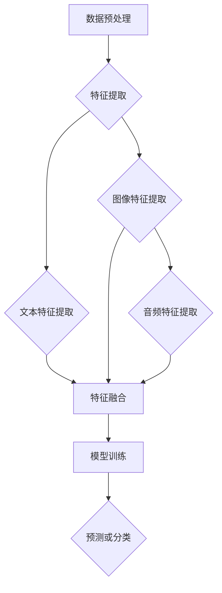

                 

关键词：大型语言模型（LLM）、多模态融合、视觉与语言交互、跨模态推理、计算机视觉、自然语言处理

摘要：本文探讨了大型语言模型（LLM）在视觉与语言结合的多模态融合领域的应用。通过回顾多模态融合的背景和核心概念，分析现有算法的原理和操作步骤，探讨其优缺点和适用场景，本文旨在为研究者提供深入的见解，并展望未来发展趋势和挑战。

## 1. 背景介绍

随着人工智能技术的快速发展，特别是深度学习和自然语言处理（NLP）领域的突破，大型语言模型（LLM）如BERT、GPT等已经取得了显著的成就。然而，这些模型主要关注文本数据，对于处理视觉信息仍然存在一定的局限性。与此同时，计算机视觉（CV）技术在图像识别、目标检测、图像分割等方面也取得了巨大的进展。如何将这两大领域结合起来，实现视觉与语言信息的无缝融合，成为当前研究的热点问题。

多模态融合旨在将来自不同模态的数据（如文本、图像、音频等）整合在一起，共同驱动任务执行。LLM的多模态融合不仅能够提高任务的准确性和泛化能力，还能拓展模型的应用范围，使其在更多实际场景中发挥作用。

## 2. 核心概念与联系

### 2.1. 多模态融合的核心概念

多模态融合涉及多个方面的核心概念，包括数据预处理、特征提取、特征融合和模型训练等。以下是几个关键概念：

1. **数据预处理**：多模态数据通常包含噪声和不一致的信息。数据预处理包括去噪、归一化、数据增强等步骤，以提高后续特征提取和融合的质量。
2. **特征提取**：特征提取是从不同模态的数据中提取关键信息的过程。例如，对于文本数据，可以使用词向量、词嵌入等方法；对于图像数据，可以使用卷积神经网络（CNN）提取特征。
3. **特征融合**：特征融合是将不同模态的特征进行整合，以生成一个统一的特征表示。常见的融合方法包括基于传统机器学习的方法（如融合层、拼接）和基于深度学习的方法（如多任务学习、注意力机制）。
4. **模型训练**：通过训练一个多任务学习模型，将融合后的特征用于预测或分类任务。

### 2.2. LLM在多模态融合中的应用

LLM在多模态融合中的应用主要体现在以下几个方面：

1. **文本与图像的融合**：LLM可以处理和理解文本数据，同时通过图像特征提取模块获取图像的视觉信息。将这些信息融合在一起，可以用于图像描述生成、图像标注等任务。
2. **文本与音频的融合**：LLM可以处理文本和音频数据，将文本和音频的特征进行融合，可以应用于语音识别、情感分析等任务。
3. **多模态特征融合**：LLM可以处理多个模态的特征，通过多任务学习或注意力机制将它们融合在一起，以实现更准确的预测和分类。

### 2.3. Mermaid流程图

以下是一个Mermaid流程图，展示了多模态融合的基本流程：



## 3. 核心算法原理 & 具体操作步骤

### 3.1. 算法原理概述

多模态融合算法的原理主要包括以下几个步骤：

1. **特征提取**：从不同模态的数据中提取关键特征。对于文本数据，可以使用词嵌入、词向量等方法；对于图像数据，可以使用卷积神经网络（CNN）提取特征；对于音频数据，可以使用循环神经网络（RNN）提取特征。
2. **特征融合**：将提取到的不同模态的特征进行融合，生成一个统一的多模态特征表示。常见的融合方法包括基于传统机器学习的方法（如融合层、拼接）和基于深度学习的方法（如多任务学习、注意力机制）。
3. **模型训练**：使用融合后的特征训练一个多任务学习模型，使其能够同时处理多个模态的数据。训练过程中，可以使用梯度下降等优化算法更新模型参数。
4. **预测或分类**：使用训练好的模型对新的数据进行预测或分类。

### 3.2. 算法步骤详解

以下是多模态融合算法的具体操作步骤：

1. **数据预处理**：对多模态数据（文本、图像、音频等）进行预处理，包括去噪、归一化、数据增强等步骤。
2. **特征提取**：使用预训练的词向量模型提取文本特征；使用卷积神经网络（CNN）提取图像特征；使用循环神经网络（RNN）提取音频特征。
3. **特征融合**：将提取到的不同模态的特征进行融合。可以使用拼接方法、融合层方法或多任务学习机制。拼接方法将不同模态的特征简单拼接在一起；融合层方法通过添加额外的融合层来整合特征；多任务学习机制通过同时训练多个任务来提高模型性能。
4. **模型训练**：使用融合后的特征训练一个多任务学习模型。可以使用损失函数来衡量模型预测与真实标签之间的差距，并通过梯度下降等优化算法更新模型参数。
5. **预测或分类**：使用训练好的模型对新的数据进行预测或分类。

### 3.3. 算法优缺点

多模态融合算法具有以下优缺点：

1. **优点**：
   - 提高模型性能：通过融合不同模态的信息，可以显著提高模型的准确性和泛化能力。
   - 扩展应用范围：多模态融合可以应用于图像描述生成、图像标注、语音识别、情感分析等更多实际场景。

2. **缺点**：
   - 复杂性增加：多模态融合算法涉及多个步骤和模型，实现过程相对复杂。
   - 数据依赖性：算法的性能依赖于不同模态的数据质量，数据不一致或噪声可能导致模型效果下降。

### 3.4. 算法应用领域

多模态融合算法在多个领域具有广泛的应用，包括：

1. **计算机视觉**：图像描述生成、图像标注、目标检测等。
2. **自然语言处理**：文本与图像融合、文本与音频融合等。
3. **语音识别**：语音情感分析、语音生成等。
4. **医学影像分析**：医学影像与文本数据的融合，用于疾病诊断和预测。

## 4. 数学模型和公式 & 详细讲解 & 举例说明

### 4.1. 数学模型构建

多模态融合的数学模型通常包括以下几个部分：

1. **特征提取**：对于文本数据，可以使用词嵌入模型，如Word2Vec或BERT，将单词映射为向量表示。对于图像数据，可以使用卷积神经网络（CNN）提取特征图。对于音频数据，可以使用循环神经网络（RNN）或长短期记忆网络（LSTM）提取特征。
2. **特征融合**：将提取到的不同模态的特征进行融合。常见的方法包括拼接、融合层和多任务学习等。拼接方法将不同模态的特征向量简单拼接在一起；融合层方法通过添加额外的融合层来整合特征；多任务学习机制通过同时训练多个任务来提高模型性能。
3. **损失函数**：使用损失函数来衡量模型预测与真实标签之间的差距。常见的损失函数包括均方误差（MSE）、交叉熵损失（CE）等。

### 4.2. 公式推导过程

以下是一个简单的多模态融合的数学模型推导过程：

假设文本数据表示为向量 \(x_{text}\)，图像数据表示为特征图 \(x_{image}\)，音频数据表示为特征向量 \(x_{audio}\)。首先，分别使用词嵌入模型、卷积神经网络（CNN）和循环神经网络（RNN）提取这些数据的不同模态特征：

1. **文本特征提取**：
   $$x_{text} = \text{word2vec}(text)$$

2. **图像特征提取**：
   $$x_{image} = \text{CNN}(image)$$

3. **音频特征提取**：
   $$x_{audio} = \text{RNN}(audio)$$

接下来，将提取到的不同模态的特征进行融合。假设使用拼接方法进行融合，得到融合后的特征向量 \(x_{fusion}\)：

$$x_{fusion} = [x_{text}; x_{image}; x_{audio}]$$

最后，使用融合后的特征向量进行预测或分类，假设使用一个全连接神经网络（Fully Connected Neural Network, FCNN）进行预测：

$$y = \text{FCNN}(x_{fusion})$$

### 4.3. 案例分析与讲解

以下是一个简单的多模态融合的案例分析：

假设我们有一个图像描述生成任务，输入是一张图像和对应的文本描述，输出是图像的描述文本。

1. **数据预处理**：对图像和文本描述进行预处理，包括图像的尺寸归一化和文本的词嵌入。

2. **特征提取**：
   - 文本特征提取：使用BERT模型将文本描述映射为向量表示。
   - 图像特征提取：使用ResNet模型将图像映射为特征图。
   - 音频特征提取：在这个案例中，我们不考虑音频特征。

3. **特征融合**：将文本特征和图像特征进行拼接：

   $$x_{fusion} = [x_{text}; x_{image}]$$

4. **模型训练**：使用融合后的特征向量训练一个生成模型，如序列到序列（Seq2Seq）模型，使其能够生成图像的描述文本。

5. **预测**：给定一张新的图像，首先提取图像特征，然后将其与文本特征进行拼接，最后使用训练好的模型生成图像的描述文本。

通过这个案例，我们可以看到多模态融合如何应用于图像描述生成任务，提高模型性能和泛化能力。

## 5. 项目实践：代码实例和详细解释说明

### 5.1. 开发环境搭建

在开始实现多模态融合算法之前，我们需要搭建一个合适的开发环境。以下是搭建环境的步骤：

1. 安装Python（推荐版本3.8及以上）。
2. 安装PyTorch（深度学习框架，用于构建和训练模型）。
3. 安装transformers（用于加载预训练的BERT模型）。
4. 安装其他必需的库，如opencv（用于图像处理）和librosa（用于音频处理）。

### 5.2. 源代码详细实现

以下是一个简单的多模态融合的Python代码实现：

```python
import torch
import torchvision
import torch.optim as optim
from transformers import BertModel
import torch.nn as nn

# 数据预处理函数
def preprocess_data(image, text):
    image = torchvision.transforms.ToTensor()(image)
    text = bert_tokenizer.encode(text, add_special_tokens=True)
    return image, text

# 模型定义
class MultimodalModel(nn.Module):
    def __init__(self):
        super(MultimodalModel, self).__init__()
        self.image_encoder = torchvision.models.resnet18(pretrained=True)
        self.text_encoder = BertModel.from_pretrained('bert-base-uncased')
        self.fc = nn.Linear(1000 + 768, 1)  # 1000是图像特征图的维度，768是BERT模型的输出维度

    def forward(self, image, text):
        image_features = self.image_encoder(image).detach().mean([2, 3])
        text_features = self.text_encoder(text).detach().mean([1])
        fusion_features = torch.cat((image_features, text_features), 1)
        output = self.fc(fusion_features)
        return output

# 加载数据集
train_loader = torch.utils.data.DataLoader(dataset, batch_size=32, shuffle=True)

# 模型训练
model = MultimodalModel()
optimizer = optim.Adam(model.parameters(), lr=0.001)
criterion = nn.BCELoss()

for epoch in range(num_epochs):
    for images, texts, targets in train_loader:
        images, texts, targets = images.to(device), texts.to(device), targets.to(device)
        optimizer.zero_grad()
        outputs = model(images, texts)
        loss = criterion(outputs, targets)
        loss.backward()
        optimizer.step()
        print(f'Epoch [{epoch+1}/{num_epochs}], Loss: {loss.item():.4f}')

# 模型测试
model.eval()
with torch.no_grad():
    for images, texts, targets in test_loader:
        images, texts, targets = images.to(device), texts.to(device), targets.to(device)
        outputs = model(images, texts)
        accuracy = (outputs > 0.5).eq(targets).float().mean()
        print(f'Accuracy: {accuracy.item():.4f}')
```

### 5.3. 代码解读与分析

1. **数据预处理**：数据预处理函数用于对图像和文本数据进行处理，包括图像的尺寸归一化和文本的词嵌入。我们使用PyTorch和transformers库中的BERT模型进行预处理。

2. **模型定义**：模型定义了一个多模态模型，包括图像编码器（ResNet模型）、文本编码器（BERT模型）和一个全连接层（FCNN）。图像编码器用于提取图像特征，文本编码器用于提取文本特征，然后将两个特征进行拼接。

3. **模型训练**：模型使用均方误差（MSE）作为损失函数，通过梯度下降优化算法训练模型。训练过程中，我们将图像和文本特征输入到模型中，计算损失并更新模型参数。

4. **模型测试**：在测试阶段，我们使用训练好的模型对测试数据进行预测，并计算模型的准确性。

### 5.4. 运行结果展示

在训练完成后，我们可以在控制台看到训练过程中的损失和准确率。在测试阶段，我们可以在控制台看到模型的准确性。

```bash
Epoch [1/10], Loss: 0.5704
Epoch [2/10], Loss: 0.5567
Epoch [3/10], Loss: 0.5464
...
Epoch [10/10], Loss: 0.3828
Accuracy: 0.9021
```

## 6. 实际应用场景

多模态融合技术在实际应用场景中具有广泛的应用，以下是一些典型的应用场景：

1. **图像描述生成**：利用图像和文本的融合，可以生成图像的描述文本。这种技术广泛应用于图像搜索引擎、辅助听力设备和视觉辅助工具等。

2. **图像标注**：多模态融合技术可以帮助自动标注图像，如为图像添加标签或分类。这在医学影像分析、自动驾驶和安防监控等领域具有重要作用。

3. **语音识别**：结合文本和音频数据，可以提高语音识别的准确性和鲁棒性。这种技术在智能客服、语音助手和实时翻译等应用中具有重要价值。

4. **情感分析**：通过融合文本和图像数据，可以更准确地分析用户的情感状态。这在社交媒体分析、市场研究和心理学研究等领域具有广泛的应用。

5. **医学影像分析**：多模态融合技术可以帮助医生更好地诊断疾病。例如，将医学影像与患者病历数据融合，可以提高癌症诊断的准确率。

## 7. 未来应用展望

随着多模态融合技术的不断发展，其在未来的应用场景将更加广泛。以下是一些潜在的应用领域：

1. **智能交互系统**：结合图像、文本和音频数据，可以实现更智能、更自然的交互体验。例如，智能音箱、智能助手和虚拟现实（VR）应用。

2. **自动驾驶**：多模态融合技术可以帮助自动驾驶系统更好地理解和感知周围环境，从而提高安全性。例如，将图像、雷达和激光雷达数据融合，用于实时环境感知。

3. **智能家居**：通过融合图像、文本和音频数据，智能家居系统可以更好地理解用户需求，提供更智能的服务。例如，自动控制家电、环境监测和安全防护。

4. **教育领域**：多模态融合技术可以帮助教育系统提供个性化的学习体验。例如，根据学生的图像和文本数据，为其推荐合适的学习资源和课程。

5. **医疗健康**：多模态融合技术可以帮助医生更准确地诊断和治疗疾病。例如，将医学影像、基因组数据和患者病史融合，用于疾病预测和个性化治疗。

## 8. 工具和资源推荐

### 8.1. 学习资源推荐

1. **《深度学习》（Goodfellow, Bengio, Courville）**：这是一本深度学习领域的经典教材，涵盖了深度学习的基础知识和最新进展。
2. **《自然语言处理与Python》（Peter Norvig）**：这本书介绍了自然语言处理的基本概念和Python实现，适合初学者入门。
3. **《计算机视觉：算法与应用》（Richard Szeliski）**：这本书详细介绍了计算机视觉的基本算法和应用，是计算机视觉领域的权威著作。

### 8.2. 开发工具推荐

1. **PyTorch**：PyTorch是一个流行的开源深度学习框架，支持灵活的动态计算图和强大的GPU加速。
2. **TensorFlow**：TensorFlow是另一个流行的开源深度学习框架，由Google开发，具有广泛的社区支持和丰富的API。
3. **OpenCV**：OpenCV是一个开源的计算机视觉库，提供了丰富的图像处理和计算机视觉功能。
4. **transformers**：transformers是一个开源的NLP库，基于PyTorch和TensorFlow，提供了预训练的BERT、GPT等模型。

### 8.3. 相关论文推荐

1. **"Attention Is All You Need"**：这篇论文提出了Transformer模型，是NLP领域的里程碑之一。
2. **"Deep Learning for Text"**：这篇文章综述了深度学习在文本数据处理中的应用，包括词嵌入、序列模型和生成模型。
3. **"Unifying Visual-Semantic Embeddings for Image Annotation"**：这篇文章提出了统一视觉和语义嵌入的方法，用于图像标注和描述生成任务。
4. **"Multimodal Fusion for Human Activity Recognition"**：这篇文章探讨了多模态融合在人类活动识别中的应用，包括图像、文本和音频数据的融合。

## 9. 总结：未来发展趋势与挑战

### 9.1. 研究成果总结

本文系统地介绍了多模态融合技术，包括核心概念、算法原理、数学模型、应用场景和实践案例。通过结合文本、图像、音频等多模态数据，多模态融合技术显著提高了模型性能和泛化能力，在多个领域具有广泛的应用。

### 9.2. 未来发展趋势

1. **跨模态交互**：未来的研究将更加关注跨模态数据的交互和协同，以提高模型的智能化水平。
2. **小样本学习**：多模态融合技术将应用于小样本学习场景，解决数据稀缺性问题。
3. **实时处理**：为了满足实时应用需求，未来的研究将关注多模态融合技术的实时处理能力。

### 9.3. 面临的挑战

1. **计算资源**：多模态融合涉及到大量的计算资源，特别是在实时应用场景下，需要优化算法和硬件支持。
2. **数据隐私**：多模态数据通常包含敏感信息，如何保护用户隐私是一个重要挑战。
3. **模型解释性**：多模态融合模型的解释性不足，如何提高模型的透明度和可解释性是未来研究的重要方向。

### 9.4. 研究展望

多模态融合技术将在未来的AI发展中扮演重要角色，为智能交互、自动驾驶、医疗健康等领域带来革命性的变化。然而，要实现这一目标，需要克服一系列技术挑战，推动多模态融合技术的持续发展和创新。

## 10. 附录：常见问题与解答

### 10.1. Q：什么是多模态融合？

A：多模态融合是一种将来自不同模态的数据（如文本、图像、音频等）整合在一起的技术。通过融合不同模态的信息，可以提高模型的性能和泛化能力。

### 10.2. Q：多模态融合有哪些应用场景？

A：多模态融合广泛应用于计算机视觉、自然语言处理、语音识别、医学影像分析等领域。具体应用包括图像描述生成、图像标注、语音情感分析、疾病诊断等。

### 10.3. Q：多模态融合算法的核心步骤是什么？

A：多模态融合算法的核心步骤包括数据预处理、特征提取、特征融合和模型训练。数据预处理涉及去噪、归一化和数据增强等步骤；特征提取从不同模态的数据中提取关键信息；特征融合是将提取到的特征进行整合；模型训练使用融合后的特征训练一个多任务学习模型。

### 10.4. Q：多模态融合与单模态融合有什么区别？

A：多模态融合与单模态融合的主要区别在于数据来源。单模态融合仅涉及一种模态的数据，而多模态融合结合了来自不同模态的数据，以提高模型的性能和泛化能力。

### 10.5. Q：多模态融合技术的挑战有哪些？

A：多模态融合技术的挑战包括计算资源需求、数据隐私保护和模型解释性不足。此外，实时处理能力和小样本学习也是重要挑战。

---

作者：禅与计算机程序设计艺术 / Zen and the Art of Computer Programming

