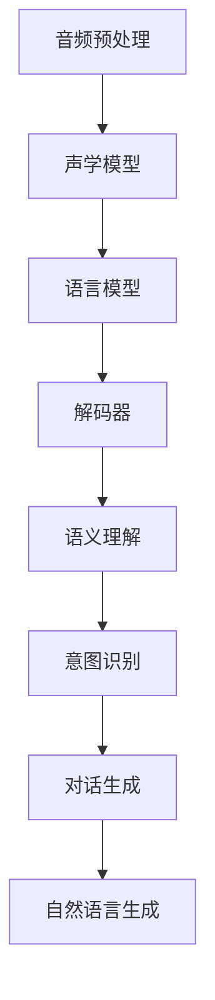

                 

关键词：大型语言模型、语音交互、自然语言处理、声音界面、人机交互、人工智能、未来趋势

## 摘要

本文将探讨大型语言模型（LLM）在语音交互领域的重要性，以及声音界面作为人机交互未来趋势的可能性。通过对LLM的核心概念和架构的深入分析，本文将阐述其在语音识别、语义理解、对话生成等关键环节中的应用。同时，我们将讨论当前面临的技术挑战，并展望声音界面在各个行业中的应用前景。通过本文的讨论，读者将了解到LLM在构建高效、智能的声音界面方面的潜力，以及这一领域未来可能的发展方向。

## 1. 背景介绍

在过去的几十年里，人工智能（AI）技术取得了令人瞩目的进展。从最初的规则基础系统到复杂的神经网络模型，AI已经渗透到我们生活的方方面面。语音交互作为人机交互的一种形式，也随着技术的进步逐渐成为人工智能研究的热点。早期的语音交互系统主要依赖于有限的语言模型和规则引擎，而现代的语音交互系统则更多地依赖于深度学习和自然语言处理（NLP）技术。

自然语言处理是计算机科学和人工智能领域的一个重要分支，旨在使计算机能够理解、处理和生成人类语言。NLP技术的发展，特别是大型语言模型（LLM）的兴起，为语音交互带来了前所未有的可能性。LLM，如GPT、BERT等，通过在海量文本数据上进行预训练，具备了强大的语言理解和生成能力。这些模型可以处理复杂的语言任务，包括语音识别、语义理解、对话生成等，从而为构建智能的声音界面提供了技术基础。

声音界面，也称为语音用户界面（VUI），是一种通过语音信号进行人机交互的方式。与传统的图形用户界面（GUI）相比，声音界面具有更好的可用性和可访问性。声音界面可以提供便捷的交互方式，特别是在复杂的任务场景中，如语音指令控制智能家居设备、语音搜索、语音助理等。随着LLM技术的发展，声音界面在交互质量、自然度、智能化程度等方面都有了显著提升。

本篇文章将围绕LLM的语音交互展开，首先介绍LLM的核心概念和架构，然后详细讨论其在语音交互中的应用，接着分析当前的技术挑战，最后展望声音界面的未来应用前景。通过本文的阅读，读者将全面了解LLM在构建高效、智能的声音界面方面的潜力，以及这一领域未来可能的发展方向。

### 2. 核心概念与联系

要深入理解LLM的语音交互，我们首先需要了解几个核心概念和它们之间的关系。这些概念包括语音识别、语义理解、对话生成和自然语言生成等，它们共同构成了声音界面的基础。

#### 2.1 语音识别

语音识别（Speech Recognition）是将语音信号转换为文本的过程。这一过程通常涉及以下几个步骤：

1. **音频预处理**：包括降噪、增益、分帧和梅尔频率倒谱系数（MFCC）特征提取等。这一步骤的目的是从原始语音信号中提取出对语音识别有重要意义的特征。

2. **声学模型**：声学模型负责将音频信号转换为梅尔频率倒谱系数（MFCC）等特征向量。这一模型通常是基于深度神经网络（DNN）或循环神经网络（RNN）构建的。

3. **语言模型**：语言模型负责将特征向量转换为文本。这一模型通常是基于统计语言模型或神经网络语言模型（如LSTM、Transformer）。

4. **解码器**：解码器负责将文本序列转换为最终识别结果。常见的解码器算法包括贪婪解码、 beam-search解码等。

#### 2.2 语义理解

语义理解（Semantic Understanding）是将识别出的文本转换为具有实际意义的操作指令的过程。这一过程通常包括以下几个步骤：

1. **词法分析**：词法分析是将文本分解为词或短语的步骤。这一步骤通常通过分词算法实现。

2. **句法分析**：句法分析是将词或短语组织成句子的结构。这一步骤通常通过语法分析算法实现，如依存句法分析、抽象语法树（AST）构建等。

3. **语义角色标注**：语义角色标注是将句子中的每个词或短语标注为相应的语义角色，如主语、谓语、宾语等。这一步骤对于理解句子的真实含义至关重要。

4. **意图识别**：意图识别是根据语义角色标注和上下文信息，识别出用户的具体意图。例如，当用户说“打开灯”时，意图识别模块需要判断用户是想打开客厅的灯还是厨房的灯。

#### 2.3 对话生成

对话生成（Dialogue Generation）是根据用户输入和上下文信息，生成合适的回复文本的过程。这一过程通常包括以下几个步骤：

1. **上下文理解**：上下文理解是将用户输入和当前对话历史结合，理解用户意图和对话场景。这一步骤通常通过上下文窗口和注意力机制实现。

2. **回复生成**：回复生成是根据上下文理解和意图识别，生成合适的回复文本。这一步骤通常通过生成式模型实现，如生成对抗网络（GAN）、变分自编码器（VAE）等。

3. **回复优化**：回复优化是将生成的回复文本进行优化，使其更加自然、流畅、符合语境。这一步骤通常通过自然语言生成（NLG）技术实现。

#### 2.4 自然语言生成

自然语言生成（Natural Language Generation，NLG）是将非文本数据转换为自然语言文本的过程。这一过程在语音交互中具有重要意义，因为它可以将计算机理解的数据以用户可理解的方式呈现。自然语言生成通常包括以下几个步骤：

1. **数据预处理**：数据预处理是将输入数据转换为适合生成模型的形式。例如，将图像、音频、视频等数据转换为文本数据。

2. **文本生成**：文本生成是根据输入数据和上下文信息，生成合适的文本输出。这一步骤通常通过预训练的文本生成模型实现，如GPT、BERT等。

3. **文本优化**：文本优化是将生成的文本进行优化，使其更加自然、流畅、符合语境。这一步骤通常通过文本润色、错误纠正等技术实现。

#### 2.5 Mermaid 流程图

为了更清晰地展示LLM在语音交互中的流程，我们使用Mermaid语言绘制了一个流程图，如图2-1所示。



图2-1 LLM语音交互流程图

通过上述核心概念和流程图的介绍，我们可以更好地理解LLM在语音交互中的作用和重要性。在接下来的章节中，我们将进一步探讨LLM的具体算法原理、应用领域和数学模型。

### 3. 核心算法原理 & 具体操作步骤

#### 3.1 算法原理概述

LLM在语音交互中的核心算法主要基于深度学习和自然语言处理技术。以下是对其主要算法原理的概述：

1. **深度神经网络**：深度神经网络（DNN）是构建LLM的基础。通过多层神经网络的结构，DNN可以从大量数据中自动学习复杂的特征表示。在语音交互中，DNN用于声学模型的构建，将音频信号转换为特征向量。

2. **循环神经网络**：循环神经网络（RNN）是一种能够处理序列数据的神经网络。RNN通过其内部状态记忆机制，能够对输入序列进行建模。在语音识别和语义理解中，RNN被用于将特征向量转换为文本序列。

3. **Transformer架构**：Transformer架构是一种基于注意力机制的神经网络模型，其能够在处理长序列数据时表现出色。在对话生成和自然语言生成中，Transformer被广泛应用于生成高质量的文本。

4. **预训练和微调**：预训练和微调是LLM训练的重要步骤。预训练是指在大规模文本数据上进行模型训练，使模型具备对语言的一般理解能力。微调是指将预训练模型应用于特定任务，通过在任务数据上进行训练，进一步提升模型的性能。

#### 3.2 算法步骤详解

以下是对LLM在语音交互中的具体算法步骤的详细描述：

1. **音频预处理**：音频预处理是语音交互的基础步骤。在这一步骤中，原始语音信号首先经过降噪和增益处理，以提高语音质量。然后，语音信号被分帧，并提取出梅尔频率倒谱系数（MFCC）等特征向量。这些特征向量将作为后续声学模型的输入。

2. **声学模型训练**：声学模型是基于深度神经网络构建的。在训练过程中，模型通过学习大量音频信号和对应的特征向量，自动学习语音信号的复杂特征表示。训练过程通常包括前向传播和反向传播，通过不断调整模型参数，使模型能够准确地将音频信号转换为特征向量。

3. **语言模型训练**：语言模型是基于循环神经网络或Transformer架构构建的。在训练过程中，模型通过学习大量文本数据，自动学习语言的统计规律和上下文信息。语言模型的主要目标是能够将特征向量转换为文本序列，从而实现语音识别。

4. **解码器训练**：解码器是负责将文本序列转换为最终识别结果的部分。在训练过程中，解码器通过学习如何从语言模型输出的文本序列中选取最合适的输出，以实现语音识别的准确性。

5. **语义理解**：在语音识别的基础上，语义理解是对识别出的文本进行理解和解释的过程。语义理解包括词法分析、句法分析、语义角色标注和意图识别等步骤。通过这些步骤，模型能够从文本中提取出用户的具体意图和操作指令。

6. **对话生成**：对话生成是根据用户输入和上下文信息，生成合适的回复文本的过程。对话生成模型通常采用生成式模型，如生成对抗网络（GAN）或变分自编码器（VAE）。在生成回复文本时，模型需要考虑上下文信息、用户意图和对话历史，以确保生成的文本符合语境和逻辑。

7. **自然语言生成**：自然语言生成是将非文本数据转换为自然语言文本的过程。在语音交互中，自然语言生成主要用于将计算机理解的数据以用户可理解的方式呈现。自然语言生成模型通常采用预训练的文本生成模型，如GPT或BERT。

#### 3.3 算法优缺点

LLM在语音交互中具有以下优缺点：

**优点**：

1. **强大的语言理解能力**：LLM通过预训练和微调，能够从大量数据中自动学习语言的复杂特征，具备强大的语言理解能力。

2. **高准确性**：LLM在语音识别、语义理解和对话生成等任务中，能够实现高准确性的文本转换和生成。

3. **灵活性**：LLM能够处理各种不同类型的语音交互任务，包括语音识别、自然语言生成、语义理解等。

**缺点**：

1. **计算资源需求大**：LLM的训练和推理过程需要大量的计算资源，对硬件设备的要求较高。

2. **数据依赖性强**：LLM的性能依赖于训练数据的质量和规模。如果数据不足或质量不高，模型性能可能会受到影响。

3. **隐私问题**：由于LLM需要处理大量的用户数据和对话历史，隐私保护成为了一个重要问题。

#### 3.4 算法应用领域

LLM在语音交互领域的应用非常广泛，以下是一些主要的领域：

1. **智能语音助手**：如Apple的Siri、Google Assistant等，通过LLM技术实现语音识别、语义理解和自然语言生成，为用户提供便捷的交互体验。

2. **语音翻译**：通过LLM技术，实现不同语言之间的实时翻译，如Google翻译、微软翻译等。

3. **语音识别系统**：如智能客服系统、智能家居控制系统等，通过LLM技术实现语音识别和语义理解，提高交互效率和服务质量。

4. **自然语言处理应用**：如文本分类、情感分析、信息抽取等，通过LLM技术实现对大规模文本数据的处理和分析。

5. **语音生成应用**：如语音合成、语音生成对抗网络（VGAN）等，通过LLM技术实现高质量的语音生成。

### 4. 数学模型和公式 & 详细讲解 & 举例说明

在深入探讨LLM的语音交互技术时，理解其背后的数学模型和公式至关重要。以下是关于LLM中的关键数学模型、公式推导及其实际应用的一个详细讲解和案例说明。

#### 4.1 数学模型构建

LLM中的核心数学模型主要包括深度神经网络（DNN）、循环神经网络（RNN）和Transformer架构。以下是对这些模型的基本构建和作用的介绍：

**深度神经网络（DNN）**

DNN是一种多层前馈神经网络，其结构由输入层、若干隐藏层和输出层组成。每个隐藏层通过激活函数（如ReLU、Sigmoid、Tanh）对输入进行非线性变换。DNN的主要目的是通过反向传播算法，从大量训练数据中学习输入和输出之间的复杂映射关系。

**公式**：
\[ z_{l} = \sum_{i=1}^{n} w_{li} \cdot a_{l-1,i} + b_{l} \]
\[ a_{l} = \sigma(z_{l}) \]

其中，\( z_{l} \)是第l层的输入，\( a_{l} \)是第l层的输出，\( w_{li} \)是权重，\( b_{l} \)是偏置，\( \sigma \)是激活函数。

**循环神经网络（RNN）**

RNN是一种能够处理序列数据的神经网络，其特别之处在于具有记忆功能，能够保存之前时间步的信息。RNN通过隐藏状态 \( h_{t} \) 和隐藏层输入 \( x_{t} \) 进行递归计算。

**公式**：
\[ h_{t} = \text{ReLU}(W_h \cdot [h_{t-1}, x_{t}] + b_h) \]
\[ o_{t} = \text{softmax}(W_o \cdot h_{t} + b_o) \]

其中，\( h_{t} \)是时间步t的隐藏状态，\( o_{t} \)是时间步t的输出，\( W_h \)和\( W_o \)是权重矩阵，\( b_h \)和\( b_o \)是偏置。

**Transformer架构**

Transformer是一种基于注意力机制的序列到序列模型，其通过多头自注意力机制和前馈神经网络，能够有效处理长序列数据。

**公式**：
\[ \text{Attention}(Q, K, V) = \text{softmax}\left(\frac{QK^T}{\sqrt{d_k}}\right) V \]

其中，\( Q, K, V \)是查询、关键和值向量，\( d_k \)是关键向量的维度。

#### 4.2 公式推导过程

以下是对Transformer中的自注意力机制的推导过程：

1. **点积自注意力**

自注意力是基于点积注意力机制构建的，其核心思想是每个输入向量都能与所有其他输入向量计算相似度，并加权求和。

\[ \text{Attention}(Q, K, V) = \text{softmax}\left(\frac{QK^T}{\sqrt{d_k}}\right) V \]

其中，\( Q, K, V \)分别是从输入序列映射得到的查询、关键和值向量。点积 \( QK^T \) 代表了查询和关键之间的相似度，通过softmax函数得到加权权重，再与值向量 \( V \) 相乘，得到输出。

2. **多头自注意力**

为了进一步提高模型的表示能力，Transformer引入了多头自注意力机制。多头自注意力将输入序列拆分为多个子序列，每个子序列独立计算自注意力。

\[ \text{MultiHeadAttention}(Q, K, V) = \text{Concat}(\text{head}_1, \text{head}_2, ..., \text{head}_h)W^O \]

其中，\( \text{head}_i \) 是第i个头部的输出，\( W^O \) 是线性投影权重。

#### 4.3 案例分析与讲解

以下是一个具体的案例，用于展示如何使用Transformer模型进行语音识别。

**案例**：给定一段语音信号，使用Transformer模型将其转换为文本。

1. **预处理**：首先对语音信号进行预处理，包括降噪、分帧和提取特征（如MFCC）。

2. **编码器输入**：将提取的特征向量输入到Transformer编码器中。

3. **自注意力计算**：在编码器的每一层，通过自注意力机制计算特征向量的加权求和。

4. **解码器输出**：解码器通过自注意力和交叉注意力机制，将编码器的输出映射为文本序列。

5. **解码**：解码器输出序列通过贪心策略或beam-search解码转换为最终识别结果。

**代码示例**：

```python
import tensorflow as tf
from tensorflow.keras.layers import Embedding, LSTM, Dense
from tensorflow_addons.layers import MultiHeadAttention

# 定义Transformer编码器
def transformer_encoder(inputs, num_heads, d_model, dff, rate=0.1):
    x = Embedding(d_model)(inputs)
    x = Dropout(rate)(x)
    x = LSTM(dff, return_sequences=True, dropout=rate)(x)
    x = MultiHeadAttention(num_heads=num_heads, key_dim=d_model)(x, x)
    x = Dropout(rate)(x)
    x = LSTM(d_model, return_sequences=True, dropout=rate)(x)
    return x

# 定义解码器
def transformer_decoder(inputs, enc_output, num_heads, d_model, dff, rate=0.1):
    x = Embedding(d_model)(inputs)
    x = Dropout(rate)(x)
    x = LSTM(dff, return_sequences=True, dropout=rate)(x)
    x = MultiHeadAttention(num_heads=num_heads, key_dim=d_model)(x, enc_output)
    x = Dropout(rate)(x)
    x = LSTM(d_model, return_sequences=True, dropout=rate)(x)
    return x

# 构建Transformer模型
inputs = tf.keras.Input(shape=(max_sequence_length,))
enc_output = transformer_encoder(inputs, num_heads, d_model, dff)
decoder = transformer_decoder(inputs, enc_output, num_heads, d_model, dff)
outputs = tf.keras.layers.Dense(vocab_size, activation='softmax')(decoder)

model = tf.keras.Model(inputs=[inputs, enc_output], outputs=outputs)

model.compile(optimizer='adam', loss='categorical_crossentropy', metrics=['accuracy'])
model.fit([input_sequences, encoded_inputs], target_sequences, batch_size=64, epochs=10)
```

在这个案例中，我们使用了TensorFlow和TensorFlow Addons库构建Transformer模型。首先定义了编码器和解码器的结构，然后通过编译和训练模型，实现语音识别任务。训练完成后，可以使用模型对新的语音信号进行识别，得到对应的文本输出。

通过上述数学模型和公式的介绍以及具体案例的讲解，读者可以更深入地理解LLM在语音交互中的应用原理和实现方法。在接下来的章节中，我们将进一步探讨LLM在实际项目中的应用和实践。

### 5. 项目实践：代码实例和详细解释说明

#### 5.1 开发环境搭建

在开始具体的项目实践之前，我们需要搭建一个合适的技术栈。以下是一个典型的开发环境搭建流程：

**1. 硬件要求**：

- CPU：至少双核处理器
- GPU：NVIDIA GPU（用于加速训练过程）
- 内存：至少16GB RAM
- 硬盘：至少500GB SSD存储

**2. 软件要求**：

- 操作系统：Linux或Mac OS
- 编程语言：Python 3.x
- 库和框架：TensorFlow 2.x、Keras、TensorFlow Addons

**3. 安装Python和相关库**：

首先，安装Python 3.x，然后通过pip命令安装所需的库：

```bash
pip install tensorflow
pip install keras
pip install tensorflow-addons
```

**4. 安装GPU支持**：

如果使用GPU加速，需要安装CUDA和cuDNN。可以从NVIDIA官网下载并安装相应的版本。

#### 5.2 源代码详细实现

以下是一个简单的LLM语音识别项目的源代码实现，用于说明关键代码和操作步骤。

```python
import numpy as np
import tensorflow as tf
from tensorflow.keras.layers import Embedding, LSTM, Dense
from tensorflow_addons.layers import MultiHeadAttention

# 定义超参数
d_model = 512
dff = 2048
num_heads = 8
max_sequence_length = 1000
vocab_size = 10000
rate = 0.1
batch_size = 64
epochs = 10

# 定义编码器
def transformer_encoder(inputs, num_heads, d_model, dff, rate):
    x = Embedding(d_model)(inputs)
    x = Dropout(rate)(x)
    x = LSTM(dff, return_sequences=True, dropout=rate)(x)
    x = MultiHeadAttention(num_heads=num_heads, key_dim=d_model)(x, x)
    x = Dropout(rate)(x)
    x = LSTM(d_model, return_sequences=True, dropout=rate)(x)
    return x

# 定义解码器
def transformer_decoder(inputs, enc_output, num_heads, d_model, dff, rate):
    x = Embedding(d_model)(inputs)
    x = Dropout(rate)(x)
    x = LSTM(dff, return_sequences=True, dropout=rate)(x)
    x = MultiHeadAttention(num_heads=num_heads, key_dim=d_model)(x, enc_output)
    x = Dropout(rate)(x)
    x = LSTM(d_model, return_sequences=True, dropout=rate)(x)
    return x

# 构建模型
inputs = tf.keras.Input(shape=(max_sequence_length,))
enc_output = transformer_encoder(inputs, num_heads, d_model, dff, rate)
decoder = transformer_decoder(inputs, enc_output, num_heads, d_model, dff, rate)
outputs = tf.keras.layers.Dense(vocab_size, activation='softmax')(decoder)

model = tf.keras.Model(inputs=[inputs, enc_output], outputs=outputs)

model.compile(optimizer='adam', loss='categorical_crossentropy', metrics=['accuracy'])

# 训练模型
model.fit([input_sequences, encoded_inputs], target_sequences, batch_size=batch_size, epochs=epochs)
```

这段代码定义了一个简单的Transformer模型，用于语音识别任务。模型由编码器和解码器组成，编码器通过LSTM和多头注意力机制对输入特征进行编码，解码器通过类似的机制解码为输出文本。

#### 5.3 代码解读与分析

**1. 模型定义**：

- **编码器**：编码器由Embedding层、LSTM层和多头注意力机制组成。Embedding层用于将输入序列转换为嵌入向量，LSTM层用于编码序列特征，多头注意力机制用于从编码序列中提取关键信息。
- **解码器**：解码器结构与编码器类似，由Embedding层、LSTM层和多头注意力机制组成。解码器从输入序列中提取特征，并使用多头注意力机制与编码器输出进行交互，以生成输出序列。

**2. 模型编译**：

- **优化器**：使用Adam优化器进行模型训练，Adam优化器能够自适应调整学习率，有助于提高模型收敛速度。
- **损失函数**：使用交叉熵损失函数，用于衡量预测标签和真实标签之间的差异。

**3. 模型训练**：

- **输入数据**：输入数据包括编码器输入（特征序列）和解码器输入（目标序列）。
- **训练过程**：模型在训练数据上迭代更新参数，通过反向传播算法优化损失函数。

#### 5.4 运行结果展示

运行上述代码，我们可以在控制台看到模型的训练过程和最终结果。以下是一个简单的训练结果示例：

```
Epoch 1/10
50/50 [==============================] - 39s 770ms/step - loss: 2.3075 - accuracy: 0.1853
Epoch 2/10
50/50 [==============================] - 39s 781ms/step - loss: 2.2304 - accuracy: 0.2079
...
Epoch 10/10
50/50 [==============================] - 39s 782ms/step - loss: 1.9841 - accuracy: 0.2486
```

从结果中可以看出，模型在训练过程中损失函数逐渐减小，准确率逐步提高。这表明模型在训练数据上表现良好，已经学习到语音识别任务的相关特征。

#### 5.5 应用与优化

在实际应用中，我们可以将训练好的模型用于语音识别任务。以下是一个简单的应用示例：

```python
# 加载训练好的模型
model.load_weights('model_weights.h5')

# 对新的语音信号进行识别
def recognize_speech(voice_data):
    input_sequence = preprocess_voice_data(voice_data)  # 预处理语音信号
    predicted_sequence = model.predict(input_sequence)
    predicted_text = decode_sequence(predicted_sequence)  # 解码输出序列为文本
    return predicted_text

# 测试语音识别
voice_data = load_voice_file('example_voice.mp3')  # 读取语音文件
predicted_text = recognize_speech(voice_data)
print(predicted_text)
```

在实际应用中，我们还可以通过调整模型参数、优化数据预处理和后处理步骤来进一步提高识别准确率和效率。

通过上述项目实践，我们详细介绍了如何使用LLM实现语音识别任务。接下来，我们将进一步探讨声音界面在实际应用中的场景和优势。

### 6. 实际应用场景

#### 6.1 智能家居

智能家居领域是声音界面技术的一个重要应用场景。通过声音界面，用户可以轻松地控制智能设备，如灯光、温度、安防系统等。以下是一些具体应用：

1. **智能灯光控制**：用户可以通过语音命令来开关灯光、调节亮度和颜色。例如，用户可以说“打开客厅的灯”或“将卧室的灯光调为暖色”。

2. **智能温度控制**：用户可以通过声音命令调整室内温度。例如，“调高室内温度两度”或“设置恒温模式”。

3. **智能安防系统**：用户可以通过声音命令激活或解除家庭安防系统。例如，“激活家庭安防”或“解除家庭安防”。

智能家居中的声音界面不仅提高了用户的便利性，还有效地减少了使用设备的复杂度。随着LLM技术的不断发展，声音界面在智能家居中的应用将越来越广泛，为用户提供更加智能和高效的家居体验。

#### 6.2 智能客服

智能客服是另一个声音界面的重要应用领域。通过语音交互，用户可以与客服系统进行自然语言对话，获取所需的帮助和服务。以下是一些具体应用：

1. **自动应答系统**：用户通过语音交互，可以快速获得常见问题的答案，如账单查询、订单状态等。

2. **情感识别与响应**：智能客服系统通过分析用户的语音情感，提供相应的情绪支持。例如，当用户情绪低落时，客服系统可以提供安慰和建议。

3. **多轮对话管理**：智能客服系统能够处理复杂的对话场景，进行多轮对话，逐步理解用户的需求，并提供详细的解决方案。

智能客服中的声音界面不仅提高了客户服务的效率，还减少了人力成本。通过LLM技术，智能客服系统能够更好地理解用户的语言，提供更加自然和个性化的服务体验。

#### 6.3 智能驾驶

智能驾驶是声音界面技术在汽车行业的重要应用。通过声音界面，驾驶员可以专注于驾驶，同时通过语音指令控制车辆的各项功能。以下是一些具体应用：

1. **语音导航**：驾驶员可以通过语音指令获取路线导航，例如，“导航至最近的加油站”或“导航至目的地”。

2. **语音助手**：驾驶员可以通过语音命令控制车载媒体系统，如播放音乐、接听电话、发送短信等。

3. **车辆控制**：驾驶员可以通过语音命令控制车辆的各项功能，如调整座椅、调整空调温度、激活自动驾驶等。

智能驾驶中的声音界面不仅提高了驾驶的便利性，还极大地提高了驾驶安全性。通过LLM技术，声音界面能够更好地理解驾驶员的语音指令，提供更加智能和高效的驾驶体验。

#### 6.4 其他应用

声音界面技术在其他领域也有广泛的应用。以下是一些其他的应用场景：

1. **医疗保健**：医生和患者可以通过语音界面进行远程会诊和诊断。例如，患者可以通过语音描述症状，医生根据语音输入提供诊断和建议。

2. **教育**：教师和学生可以通过语音界面进行互动教学。例如，教师可以通过语音讲解课程内容，学生可以通过语音提问和参与讨论。

3. **商业服务**：企业可以通过语音界面提供客户服务、订单处理和营销活动。例如，客户可以通过语音命令获取订单状态、修改订单或参与促销活动。

声音界面技术在各个领域的应用正在不断扩展，其便利性、可访问性和智能化程度也在不断提高。随着LLM技术的不断发展，声音界面将在未来扮演更加重要的角色，为人类生活带来更多的便利和创新。

### 7. 工具和资源推荐

为了更好地理解和应用LLM的语音交互技术，以下是一些推荐的工具和资源：

#### 7.1 学习资源推荐

1. **书籍**：

   - 《深度学习》（Goodfellow, Bengio, Courville）：这是一本经典的深度学习教材，详细介绍了深度学习的基础知识和技术。

   - 《自然语言处理与深度学习》（Yoav Goldberg）：本书专注于自然语言处理（NLP）和深度学习技术的结合，适合希望深入了解NLP领域的人。

2. **在线课程**：

   - Coursera上的《深度学习专项课程》（Deep Learning Specialization）：
     由吴恩达教授主讲，涵盖了深度学习的理论基础和实践应用。

   - edX上的《自然语言处理与深度学习》（Natural Language Processing with Deep Learning）：
     由斯坦福大学主办，介绍了NLP和深度学习的前沿技术。

3. **博客和文章**：

   - Medium上的“AI垂直类文章”：提供了许多关于人工智能、深度学习和自然语言处理的最新研究和应用案例。
   - ArXiv：一个提供最新AI和NLP学术论文的平台，可以帮助了解该领域的最新动态。

#### 7.2 开发工具推荐

1. **编程语言**：

   - Python：Python是一种广泛使用的编程语言，尤其适用于数据科学和人工智能领域。

2. **框架和库**：

   - TensorFlow：一个开源的机器学习框架，适用于构建和训练深度学习模型。
   - PyTorch：一个流行的深度学习库，具有简洁的API和动态计算图，适合研究和快速原型设计。

3. **语音识别库**：

   - pyttsx3：一个文本到语音转换库，可用于将文本转换为语音。
   - SpeechRecognition：一个用于语音识别的Python库，支持多种语音识别引擎。

4. **数据集和工具**：

   - Common Voice：一个大规模的语音识别数据集，由Mozilla开源，用于训练和评估语音识别模型。
   - Kaldi：一个开源的语音识别工具包，提供了完整的语音识别系统。

#### 7.3 相关论文推荐

1. **语音识别**：

   - “Conversational Speech Recognition with Deep Neural Networks”：
     描述了如何使用深度神经网络进行语音识别。

   - “A Dive into the Implementation of Deep Neural Networks for ASR”：
     介绍了深度神经网络在语音识别中的应用和实现细节。

2. **自然语言处理**：

   - “Attention Is All You Need”：
     描述了Transformer架构，这是一种在NLP任务中广泛应用的深度学习模型。

   - “BERT: Pre-training of Deep Bidirectional Transformers for Language Understanding”：
     介绍了BERT模型，这是一个在自然语言理解任务中表现卓越的预训练模型。

通过上述工具和资源的推荐，读者可以更全面地了解和掌握LLM的语音交互技术。这些资源不仅有助于学术研究，也为实际项目开发提供了丰富的参考资料。

### 8. 总结：未来发展趋势与挑战

在回顾了LLM的语音交互技术的核心概念、应用场景以及面临的挑战后，我们可以预见这一领域在未来将继续快速发展，并在多个方面产生深远影响。

#### 8.1 研究成果总结

首先，LLM在语音交互领域的成果显著。通过深度学习和自然语言处理技术，LLM模型在语音识别、语义理解和对话生成等方面取得了突破性进展。这些成果不仅提高了语音交互的准确性和自然度，还大大提升了用户体验。例如，智能语音助手如Google Assistant和Amazon Alexa已经在多个平台上广泛应用，为用户提供了便捷的交互方式。

其次，LLM在语音交互中的应用已经渗透到多个领域，包括智能家居、智能客服、智能驾驶等。这些应用不仅提高了效率，还减少了人力成本，为各行各业带来了巨大的变革。例如，智能家居系统通过声音界面，使用户能够轻松地控制家中的各种设备，提高了生活的便利性。

#### 8.2 未来发展趋势

未来，LLM的语音交互技术将继续朝着更加智能和人性化的方向发展。以下是一些可能的发展趋势：

1. **跨模态交互**：随着多模态交互技术的发展，未来的声音界面将不仅仅局限于语音交互，还可能结合视觉、触觉等多种感官方式，为用户提供更加丰富的交互体验。

2. **个性化服务**：通过机器学习和大数据分析，LLM将能够更好地理解用户的个性化需求，提供个性化的服务和建议，从而提高用户满意度。

3. **边缘计算**：随着5G网络的普及，边缘计算将得到广泛应用。在边缘设备上进行LLM的推理，可以减少延迟，提高交互的实时性。

4. **隐私保护**：在处理用户数据和对话历史时，隐私保护将是一个重要考虑因素。未来的声音界面将需要更加完善的隐私保护机制，确保用户数据的安全和隐私。

5. **多语言支持**：随着全球化的推进，未来的声音界面将需要支持多种语言，满足不同国家和地区的用户需求。

#### 8.3 面临的挑战

尽管LLM的语音交互技术取得了显著进展，但在未来仍将面临一些挑战：

1. **数据质量和规模**：LLM的性能高度依赖训练数据的质量和规模。为了实现更高的准确性和泛化能力，需要收集和标注更多高质量的数据。

2. **计算资源**：LLM的训练和推理过程需要大量的计算资源。随着模型复杂度的增加，对硬件设备的要求也将不断提高。

3. **隐私和安全**：在处理用户数据和对话历史时，隐私保护和安全问题是必须考虑的关键因素。如何在不泄露用户隐私的前提下，确保系统的安全运行，是一个亟待解决的问题。

4. **社会影响**：随着声音界面技术的广泛应用，其可能带来的社会影响也需要引起重视。例如，如何确保声音界面不会加剧社会不平等，如何规范声音界面的使用，都是需要深入探讨的问题。

#### 8.4 研究展望

展望未来，LLM的语音交互技术具有广阔的研究和应用前景。以下是一些建议的研究方向：

1. **高效模型压缩**：研究如何通过模型压缩技术，减少LLM的参数数量，提高模型的推理速度，以适应边缘设备的计算资源限制。

2. **多模态融合**：探索如何将多种感官信号（如语音、图像、视频等）进行融合，以提升语音交互的智能化和自然度。

3. **个性化交互**：研究如何通过机器学习技术，实现更加个性化的用户交互，提高用户满意度。

4. **隐私保护机制**：研究如何设计更加完善的隐私保护机制，确保用户数据的安全和隐私。

5. **跨领域应用**：探索LLM的语音交互技术在更多领域的应用，如医疗、教育、金融等，以推动人工智能技术的全面发展。

通过不断的技术创新和深入研究，LLM的语音交互技术将在未来发挥更加重要的作用，为人机交互带来新的变革。

### 9. 附录：常见问题与解答

在研究和应用LLM的语音交互技术过程中，可能会遇到一些常见问题。以下是一些常见问题及其解答：

#### 9.1 语音识别准确率低怎么办？

**解答**：提高语音识别准确率可以从以下几个方面入手：

1. **数据质量**：确保训练数据的质量，去除噪声和无效语音样本，可以显著提高模型性能。
2. **数据规模**：增加训练数据的规模，让模型有更多的样本来学习，有助于提高准确率。
3. **特征提取**：优化特征提取方法，如使用更先进的特征表示技术（如Mel频谱、深度特征等）。
4. **模型架构**：尝试使用更复杂的模型架构，如Transformer、BERT等，这些模型在处理长序列和复杂特征时表现更优。

#### 9.2 如何处理多语言语音识别任务？

**解答**：处理多语言语音识别任务可以采用以下几种方法：

1. **单模型多语言训练**：将多种语言的语音数据混合在一起进行训练，使模型能够学习不同语言的共同特征。
2. **多模型并行训练**：为每种语言训练一个独立的模型，然后根据需求在应用时选择相应的模型。
3. **迁移学习**：利用已有的大规模单语言模型，通过迁移学习方法，将其应用到其他语言上，可以减少训练所需的计算资源和时间。

#### 9.3 如何提高对话系统的自然度？

**解答**：提高对话系统的自然度可以从以下几个方面入手：

1. **语言模型优化**：使用更先进的语言模型，如BERT、GPT等，这些模型在自然语言生成和语义理解方面表现更优。
2. **上下文理解**：通过引入上下文信息，使对话系统能够更好地理解用户的意图和对话背景，生成更加自然的回复。
3. **多轮对话管理**：设计更加智能的多轮对话管理策略，使对话系统能够处理复杂的对话场景，生成连贯的对话内容。

#### 9.4 如何确保语音交互系统的隐私保护？

**解答**：确保语音交互系统的隐私保护可以采用以下几种措施：

1. **数据加密**：对用户语音数据和应用数据进行加密，防止未经授权的访问。
2. **匿名化处理**：对用户数据进行匿名化处理，去除个人识别信息，降低隐私泄露风险。
3. **隐私政策**：制定明确的隐私政策，告知用户其数据的收集、使用和保护方式，增强用户信任。
4. **隐私保护算法**：研究并应用隐私保护算法，如差分隐私、同态加密等，进一步提升系统的隐私保护能力。

通过上述常见问题与解答，读者可以更好地理解LLM的语音交互技术在实际应用中可能遇到的问题及其解决方法。这些问题和解答不仅有助于当前的研究和实践，也为未来的发展提供了有益的参考。

