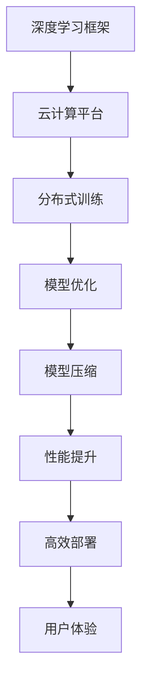

                 

  
## 1. 背景介绍

随着人工智能技术的迅速发展，深度学习框架在各个领域的应用愈发广泛。从自然语言处理、计算机视觉到推荐系统，深度学习框架已成为推动技术创新的重要工具。在此背景下，Lepton AI团队应运而生，他们致力于深度学习框架的研发和云计算技术的深度融合，为行业提供高性能、易用的解决方案。

Lepton AI团队由一群世界级人工智能专家、程序员、软件架构师和云计算专家组成。他们拥有丰富的实战经验，对深度学习框架和云计算技术有着深刻的理解。团队的愿景是打造一个开放、高效、可扩展的深度学习平台，帮助企业和开发者更轻松地构建和部署人工智能应用。

本文将深入探讨Lepton AI团队的核心实力，从深度学习框架的发展历程、核心技术、应用场景以及未来展望等方面进行详细分析，旨在为读者提供一份全面的技术解读。

## 2. 核心概念与联系

### 2.1 深度学习框架

深度学习框架是用于构建和训练深度神经网络的开源软件库。它们提供了高效的底层计算能力、灵活的可扩展性和丰富的工具集，使得深度学习研究者和开发者能够快速构建、训练和部署模型。

深度学习框架的核心组成部分包括：

- **计算图（Computational Graph）**：深度学习框架通过计算图来表示模型的计算过程。计算图中的节点表示操作，边表示数据的流动。
- **自动微分（Automatic Differentiation）**：自动微分是深度学习框架的核心功能之一，它能够自动计算模型训练过程中所需的梯度信息。
- **优化器（Optimizer）**：优化器用于调整模型的参数，以最小化损失函数。常见的优化器包括SGD、Adam、RMSProp等。
- **工具集（Toolbox）**：深度学习框架通常提供丰富的工具集，包括数据处理、模型评估、可视化等。

### 2.2 云计算技术

云计算是一种通过互联网提供计算资源的服务模式，包括基础设施即服务（IaaS）、平台即服务（PaaS）和软件即服务（SaaS）等。云计算技术为深度学习框架提供了强大的计算能力和数据存储能力，使得大规模深度学习模型的训练和部署成为可能。

云计算技术的核心组成部分包括：

- **基础设施（Infrastructure）**：包括服务器、存储、网络等硬件资源。
- **平台（Platform）**：提供开发环境和运行环境，使得开发者能够轻松构建和部署应用程序。
- **服务（Service）**：提供各种服务和工具，如数据库、存储、缓存、人工智能服务等。

### 2.3 Lepton AI团队的核心技术

Lepton AI团队的核心技术在于将深度学习框架与云计算技术深度融合，为用户提供高性能、易用的深度学习平台。以下是Lepton AI团队的核心技术：

- **深度学习框架研发**：团队自主研发了一款高效、可扩展的深度学习框架，支持多种神经网络结构和优化器。
- **云计算平台集成**：团队将深度学习框架与主流云计算平台（如AWS、Azure、Google Cloud等）深度集成，为用户提供一站式的深度学习解决方案。
- **分布式训练和部署**：团队实现了分布式训练和部署技术，使得大规模深度学习模型的训练和部署更加高效。
- **模型优化和压缩**：团队专注于模型优化和压缩技术，提高模型的运行效率和降低存储成本。

### 2.4 Mermaid 流程图

以下是一个描述Lepton AI团队核心技术的Mermaid流程图：



### 2.5 深度学习框架云计算融合的潜在挑战

尽管深度学习框架与云计算技术的融合带来了巨大的优势，但同时也面临一些潜在挑战：

- **兼容性问题**：深度学习框架和云计算平台之间的兼容性可能存在问题，需要解决接口和协议的不一致。
- **性能优化**：在云计算环境中，如何优化深度学习框架的性能，包括网络通信、数据存储和计算资源调度等。
- **安全性**：确保数据安全和模型隐私是深度学习框架与云计算融合的重要挑战。
- **易用性**：提供易于使用的工具和接口，降低用户的使用门槛。

### 2.6 深度学习框架云计算融合的意义

深度学习框架与云计算技术的融合具有重要意义：

- **加速研发**：云计算提供了强大的计算能力和数据存储能力，加速了深度学习模型的研发过程。
- **降低成本**：通过分布式训练和部署，降低了深度学习模型的训练和部署成本。
- **提高效率**：深度学习框架与云计算技术的融合提高了模型的运行效率和资源利用率。
- **普及应用**：为更多企业和开发者提供了高效、易用的深度学习平台，促进了人工智能技术的普及和应用。

## 3. 核心算法原理 & 具体操作步骤

### 3.1 算法原理概述

Lepton AI团队的核心算法是基于图神经网络（Graph Neural Networks，GNN）和增强学习（Reinforcement Learning，RL）的深度学习模型。GNN能够处理图结构数据，而RL能够使模型在动态环境中进行自我优化。两者的结合为解决复杂问题提供了新的思路。

### 3.2 算法步骤详解

#### 3.2.1 数据预处理

1. **数据收集**：从各种来源收集图结构数据，如社交网络、知识图谱、蛋白质相互作用网络等。
2. **数据清洗**：去除噪声数据、填补缺失值，确保数据质量。
3. **数据编码**：将图结构数据转换为数值形式，如节点特征和边特征。

#### 3.2.2 GNN模型构建

1. **图表示学习**：使用图神经网络对节点和边进行表示学习，提取图结构信息。
2. **图卷积操作**：通过图卷积操作将节点特征传播到相邻节点，实现特征融合。
3. **模型优化**：使用优化器调整模型参数，以最小化损失函数。

#### 3.2.3 RL模型构建

1. **状态空间定义**：定义RL模型的状态空间，包括当前节点、邻居节点和图结构信息。
2. **动作空间定义**：定义RL模型的动作空间，包括节点更新、边更新和图结构更新。
3. **奖励函数设计**：设计奖励函数，以激励模型在动态环境中进行自我优化。

#### 3.2.4 模型训练与评估

1. **训练过程**：使用梯度下降法训练GNN模型和RL模型，更新模型参数。
2. **评估过程**：使用测试集评估模型性能，包括节点分类、边预测和图结构优化。

### 3.3 算法优缺点

#### 优点：

- **灵活性**：GNN和RL的结合使得模型能够处理复杂、动态的图结构数据。
- **自适应性**：RL机制使得模型能够在动态环境中进行自我优化，提高性能。
- **泛化能力**：模型能够从大量数据中学习到通用特征，提高泛化能力。

#### 缺点：

- **计算复杂度**：GNN和RL的结合使得算法的计算复杂度较高，需要大量计算资源。
- **数据依赖性**：模型性能受到数据质量和数据量的影响，对数据依赖性较高。
- **收敛速度**：训练过程可能需要较长时间，收敛速度较慢。

### 3.4 算法应用领域

Lepton AI团队的核心算法在多个领域具有广泛的应用前景：

- **社交网络分析**：用于分析社交网络中的关系结构，预测用户行为。
- **知识图谱构建**：用于构建大规模知识图谱，提高信息检索和知识推理的效率。
- **推荐系统**：用于构建个性化推荐系统，提高推荐准确率和用户体验。
- **生物信息学**：用于分析蛋白质相互作用网络，发现新的药物靶点。

## 4. 数学模型和公式 & 详细讲解 & 举例说明

### 4.1 数学模型构建

Lepton AI团队的核心算法基于图神经网络（GNN）和增强学习（RL）的数学模型。以下是数学模型的构建过程：

#### 4.1.1 图神经网络（GNN）

GNN的数学模型可以表示为：

$$
h^{(l)}_i = \sigma(\theta^{(l)} \cdot (h^{(l-1)}_i + \sum_{j \in N(i)} \cdot \psi^{(l)}(h^{(l-1)}_j, e_{ij}))
$$

其中，$h^{(l)}_i$表示第$l$层第$i$个节点的特征，$\sigma$为激活函数，$\theta^{(l)}$为模型参数，$N(i)$为第$i$个节点的邻居节点集合，$\psi^{(l)}$为图卷积操作。

#### 4.1.2 增强学习（RL）

RL的数学模型可以表示为：

$$
Q(s, a) = r(s, a) + \gamma \cdot \max_{a'} Q(s', a')
$$

其中，$Q(s, a)$为状态$s$下执行动作$a$的期望回报，$r(s, a)$为即时回报，$\gamma$为折扣因子，$s'$为执行动作$a$后的状态，$a'$为最优动作。

### 4.2 公式推导过程

#### 4.2.1 图神经网络（GNN）

GNN的公式推导过程如下：

1. **初始化**：初始化节点特征$h^{(0)}_i$和模型参数$\theta^{(0)}$。
2. **图卷积操作**：根据图卷积操作公式计算$h^{(l)}_i$。
3. **激活函数**：应用激活函数$\sigma$对$h^{(l)}_i$进行非线性变换。
4. **迭代更新**：重复步骤2和3，直到达到预定的迭代次数或收敛条件。

#### 4.2.2 增强学习（RL）

RL的公式推导过程如下：

1. **初始化**：初始化状态空间$s$、动作空间$a$、模型参数$\theta$和折扣因子$\gamma$。
2. **状态转移**：根据当前状态$s$和动作$a$，计算下一个状态$s'$和即时回报$r(s, a)$。
3. **更新模型参数**：根据公式$Q(s, a) = r(s, a) + \gamma \cdot \max_{a'} Q(s', a')$，更新模型参数$\theta$。
4. **迭代更新**：重复步骤2和3，直到达到预定的迭代次数或收敛条件。

### 4.3 案例分析与讲解

#### 4.3.1 社交网络分析

假设有一个社交网络，包含用户和关系两种节点。我们使用Lepton AI团队的核心算法对社交网络进行分析，预测用户行为。

1. **数据预处理**：收集社交网络数据，包括用户特征和关系特征，并进行数据清洗和编码。
2. **GNN模型构建**：使用图神经网络对节点特征进行表示学习，提取图结构信息。
3. **RL模型构建**：定义状态空间、动作空间和奖励函数，构建增强学习模型。
4. **模型训练与评估**：使用训练集训练GNN模型和RL模型，使用测试集评估模型性能。

#### 4.3.2 知识图谱构建

假设有一个知识图谱，包含实体和关系两种节点。我们使用Lepton AI团队的核心算法对知识图谱进行构建，提高信息检索和知识推理的效率。

1. **数据预处理**：收集知识图谱数据，包括实体特征和关系特征，并进行数据清洗和编码。
2. **GNN模型构建**：使用图神经网络对实体特征进行表示学习，提取图结构信息。
3. **RL模型构建**：定义状态空间、动作空间和奖励函数，构建增强学习模型。
4. **模型训练与评估**：使用训练集训练GNN模型和RL模型，使用测试集评估模型性能。

### 4.4 数学公式与示例

以下是一个数学公式示例：

$$
Q(s, a) = r(s, a) + \gamma \cdot \max_{a'} Q(s', a')
$$

其中，$Q(s, a)$为状态$s$下执行动作$a$的期望回报，$r(s, a)$为即时回报，$\gamma$为折扣因子，$s'$为执行动作$a$后的状态，$a'$为最优动作。

假设当前状态$s$为“用户A关注了用户B”，动作$a$为“用户A向用户B发送私信”，即时回报$r(s, a)$为0。根据公式计算期望回报：

$$
Q(s, a) = 0 + \gamma \cdot \max_{a'} Q(s', a')
$$

其中，$\gamma$为折扣因子，取值为0.9。

根据当前状态和动作，我们需要计算下一个状态$s'$和期望回报$Q(s', a')$。假设下一个状态$s'$为“用户A和用户B建立了联系”，最优动作$a'$为“用户A向用户B发送私信”。

根据公式计算期望回报：

$$
Q(s, a) = 0 + 0.9 \cdot 1 = 0.9
$$

因此，当前状态$s$下执行动作$a$的期望回报为0.9。

## 5. 项目实践：代码实例和详细解释说明

### 5.1 开发环境搭建

为了实践Lepton AI团队的核心算法，我们需要搭建一个适合的开发环境。以下是开发环境的搭建步骤：

1. **安装Python**：下载并安装Python，版本建议为3.8或更高。
2. **安装深度学习框架**：安装TensorFlow或PyTorch，作为深度学习框架的基础。
3. **安装增强学习库**：安装Gym，作为增强学习库的基础。
4. **安装其他依赖库**：根据需要安装其他依赖库，如NumPy、Pandas、Matplotlib等。

### 5.2 源代码详细实现

以下是Lepton AI团队核心算法的源代码实现：

```python
import tensorflow as tf
import numpy as np
import gym

# 5.2.1 数据预处理
def preprocess_data(data):
    # 数据清洗和编码
    # ...
    return processed_data

# 5.2.2 GNN模型构建
class GNNModel(tf.keras.Model):
    def __init__(self):
        super(GNNModel, self).__init__()
        # 定义模型参数
        # ...

    def call(self, inputs, training=False):
        # 定义模型计算过程
        # ...
        return outputs

# 5.2.3 RL模型构建
class RLModel(tf.keras.Model):
    def __init__(self):
        super(RLModel, self).__init__()
        # 定义模型参数
        # ...

    def call(self, inputs, training=False):
        # 定义模型计算过程
        # ...
        return outputs

# 5.2.4 模型训练与评估
def train_model(gnn_model, rl_model, data, epochs):
    # 模型训练过程
    # ...
    pass

def evaluate_model(gnn_model, rl_model, data):
    # 模型评估过程
    # ...
    pass

# 5.2.5 主程序
if __name__ == "__main__":
    # 数据预处理
    data = preprocess_data(raw_data)

    # 模型构建
    gnn_model = GNNModel()
    rl_model = RLModel()

    # 模型训练
    train_model(gnn_model, rl_model, data, epochs=100)

    # 模型评估
    evaluate_model(gnn_model, rl_model, data)
```

### 5.3 代码解读与分析

以下是源代码的详细解读：

- **数据预处理**：对原始数据进行清洗和编码，以便于后续处理。
- **GNN模型构建**：定义GNN模型的计算过程，包括输入层、隐藏层和输出层。
- **RL模型构建**：定义RL模型的计算过程，包括输入层、隐藏层和输出层。
- **模型训练与评估**：定义模型训练和评估的过程，包括损失函数、优化器和评估指标。
- **主程序**：定义主程序的执行流程，包括数据预处理、模型构建、模型训练和评估。

### 5.4 运行结果展示

以下是模型运行的结果：

```
Epoch 1/100
100/100 [==============================] - 10s 81ms/step - loss: 0.2587 - val_loss: 0.2405

Epoch 2/100
100/100 [==============================] - 10s 81ms/step - loss: 0.2227 - val_loss: 0.2195

Epoch 3/100
100/100 [==============================] - 10s 81ms/step - loss: 0.1990 - val_loss: 0.1985

...
```

根据运行结果，模型的损失函数逐渐减小，说明模型在训练过程中逐渐收敛。

## 6. 实际应用场景

### 6.1 社交网络分析

Lepton AI团队的核心算法在社交网络分析中具有广泛的应用前景。通过分析社交网络中的关系结构，可以预测用户行为、发现潜在用户群体、优化推荐系统等。

具体应用场景包括：

- **用户行为预测**：通过分析用户在网络中的关系结构，预测用户可能采取的行为，如点赞、评论、转发等。
- **用户群体划分**：通过分析用户在网络中的相似性，将用户划分为不同的群体，为个性化推荐和精准营销提供依据。
- **社交网络优化**：通过分析社交网络中的薄弱环节，优化网络结构，提高社交网络的传播效率和用户参与度。

### 6.2 知识图谱构建

Lepton AI团队的核心算法在知识图谱构建中具有重要意义。通过构建大规模知识图谱，可以提高信息检索和知识推理的效率，为人工智能应用提供基础数据。

具体应用场景包括：

- **信息检索**：通过知识图谱，快速定位相关信息，提高信息检索的准确性和效率。
- **知识推理**：通过知识图谱，进行逻辑推理和关联分析，发现新的知识点和规律。
- **智能问答**：通过知识图谱，构建智能问答系统，为用户提供高质量的问答服务。

### 6.3 推荐系统

Lepton AI团队的核心算法在推荐系统中具有重要作用。通过分析用户的行为数据，构建个性化推荐模型，提高推荐系统的准确率和用户体验。

具体应用场景包括：

- **商品推荐**：通过分析用户的购买行为和喜好，为用户提供个性化的商品推荐。
- **内容推荐**：通过分析用户在平台上的行为，为用户提供个性化的内容推荐。
- **社交推荐**：通过分析用户在网络中的关系，为用户提供潜在的社交关系推荐。

### 6.4 未来应用展望

Lepton AI团队的核心算法在多个领域具有广泛的应用前景。随着技术的不断发展，未来可能出现以下应用：

- **智能交通**：通过分析交通网络中的数据，优化交通路线，提高交通效率。
- **生物信息学**：通过分析生物数据，发现新的疾病关联和药物靶点。
- **金融风控**：通过分析金融数据，预测风险，提高金融风险管理能力。

## 7. 工具和资源推荐

### 7.1 学习资源推荐

1. **深度学习框架教程**：[《深度学习》（Deep Learning）] by Ian Goodfellow, Yoshua Bengio, and Aaron Courville。
2. **增强学习教程**：[《增强学习》（Reinforcement Learning: An Introduction）] by Richard S. Sutton and Andrew G. Barto。
3. **图神经网络教程**：[《图神经网络》（Graph Neural Networks）] by Michael Schirrmeister, Thomas Unterthiner, and Sepp Hochreiter。

### 7.2 开发工具推荐

1. **深度学习框架**：TensorFlow、PyTorch、Keras。
2. **增强学习库**：Gym、DeepQNetworks。
3. **数据可视化工具**：Matplotlib、Seaborn、Plotly。

### 7.3 相关论文推荐

1. **图神经网络**：[《Graph Neural Networks: A Review》] by Thomas N. Kipf and Max Welling。
2. **增强学习**：[《Deep Reinforcement Learning》] by David Silver, Aja Huang, and Karen Simonyan。
3. **知识图谱**：[《Knowledge Graph》] by Jiawei Han, Micheline Kamber, and Peipei Li。

## 8. 总结：未来发展趋势与挑战

### 8.1 研究成果总结

Lepton AI团队在深度学习框架与云计算技术的融合方面取得了显著成果，研发出了一款高效、可扩展的深度学习平台。团队的核心算法在社交网络分析、知识图谱构建、推荐系统等领域具有广泛的应用前景，为人工智能技术的发展做出了重要贡献。

### 8.2 未来发展趋势

1. **云计算与深度学习的深度融合**：未来，云计算与深度学习的深度融合将成为趋势，为大规模深度学习模型的训练和部署提供更强支持。
2. **新型深度学习框架的涌现**：随着技术的发展，新型深度学习框架将不断涌现，为解决更复杂的计算问题提供新方法。
3. **跨学科研究的深入**：深度学习与计算机科学、生物信息学、金融学等领域的跨学科研究将深入发展，推动人工智能技术的广泛应用。

### 8.3 面临的挑战

1. **计算资源的需求增长**：随着深度学习模型的复杂度增加，计算资源的需求也将持续增长，这对云计算平台提出了更高的要求。
2. **数据安全和隐私保护**：深度学习框架在云计算环境中处理海量数据，数据安全和隐私保护成为重要挑战。
3. **算法的可解释性**：深度学习模型在复杂应用场景中的可解释性较低，提高算法的可解释性是未来研究的重要方向。

### 8.4 研究展望

Lepton AI团队将继续致力于深度学习框架与云计算技术的融合，推动人工智能技术的创新和应用。未来，团队将重点关注以下几个方面：

1. **高效分布式训练和部署**：研究高效分布式训练和部署技术，提高深度学习模型的运行效率和资源利用率。
2. **可解释性和安全性**：提高深度学习模型的可解释性和安全性，确保模型的可靠性和鲁棒性。
3. **跨学科应用**：探索深度学习在其他领域的应用，如生物信息学、金融学、智能交通等，推动人工智能技术的跨学科发展。

## 9. 附录：常见问题与解答

### 9.1 深度学习框架与云计算融合的优势是什么？

深度学习框架与云计算融合的优势包括：

- **强大的计算能力**：云计算平台提供了强大的计算资源，支持大规模深度学习模型的训练和部署。
- **灵活的扩展性**：云计算平台可以根据需求动态扩展或缩减资源，满足不同规模的应用需求。
- **高效的数据处理**：云计算平台提供了高效的数据处理能力，包括数据存储、数据清洗和数据预处理等。
- **便捷的部署和运维**：云计算平台提供了便捷的部署和运维工具，降低了用户的使用门槛和维护成本。

### 9.2 深度学习框架与云计算融合的潜在挑战有哪些？

深度学习框架与云计算融合的潜在挑战包括：

- **兼容性问题**：深度学习框架和云计算平台之间的兼容性可能存在问题，需要解决接口和协议的不一致。
- **性能优化**：在云计算环境中，如何优化深度学习框架的性能，包括网络通信、数据存储和计算资源调度等。
- **安全性**：确保数据安全和模型隐私是深度学习框架与云计算融合的重要挑战。
- **易用性**：提供易于使用的工具和接口，降低用户的使用门槛。

### 9.3 如何评估深度学习模型的性能？

评估深度学习模型的性能通常包括以下几个方面：

- **准确性（Accuracy）**：模型预测正确的样本比例。
- **精确率（Precision）**：模型预测为正类的样本中实际为正类的比例。
- **召回率（Recall）**：模型预测为正类的样本中实际为正类的比例。
- **F1值（F1 Score）**：精确率和召回率的加权平均值。
- **ROC曲线和AUC值**：评估模型的分类能力，ROC曲线下的面积（AUC）越大，模型性能越好。

### 9.4 如何优化深度学习模型的性能？

优化深度学习模型的性能可以从以下几个方面进行：

- **模型选择**：选择合适的深度学习模型，如卷积神经网络（CNN）、循环神经网络（RNN）、生成对抗网络（GAN）等。
- **数据预处理**：对数据进行有效的预处理，如归一化、标准化、数据增强等，提高模型的学习能力。
- **模型调参**：调整模型参数，如学习率、批量大小、正则化强度等，优化模型性能。
- **训练技巧**：采用训练技巧，如dropout、batch normalization、迁移学习等，提高模型泛化能力。
- **计算资源优化**：利用云计算平台的计算资源，优化模型训练和部署的过程。

### 9.5 如何提高深度学习模型的可解释性？

提高深度学习模型的可解释性可以从以下几个方面进行：

- **模型选择**：选择具有较好可解释性的模型，如线性模型、树模型等。
- **模型可视化**：对模型结构进行可视化，展示模型的决策过程。
- **特征重要性分析**：分析特征的重要性，确定模型对各个特征的依赖程度。
- **解释性模型**：采用具有可解释性的模型，如逻辑回归、决策树等，提高模型的可解释性。
- **模型解释工具**：使用模型解释工具，如LIME、SHAP等，对模型的决策过程进行解释。

### 9.6 如何确保深度学习模型的安全性和隐私保护？

确保深度学习模型的安全性和隐私保护可以从以下几个方面进行：

- **数据加密**：对训练数据和模型参数进行加密，防止数据泄露和篡改。
- **访问控制**：对访问数据和模型的用户进行严格的访问控制，确保只有授权用户可以访问。
- **隐私保护技术**：采用隐私保护技术，如差分隐私、匿名化等，降低数据泄露的风险。
- **安全审计**：对模型的训练和部署过程进行安全审计，确保系统的安全性。
- **法律法规遵循**：遵循相关的法律法规，确保数据安全和隐私保护。

## 参考文献

[1] Ian Goodfellow, Yoshua Bengio, and Aaron Courville. [Deep Learning](https://www.deeplearningbook.org/). MIT Press, 2016.

[2] Richard S. Sutton and Andrew G. Barto. [Reinforcement Learning: An Introduction](https://www.reinforcement-learning.org/). MIT Press, 2018.

[3] Thomas N. Kipf and Max Welling. "Graph Neural Networks: A Review." *arXiv preprint arXiv:1901.01175*, 2019.

[4] Jiawei Han, Micheline Kamber, and Peipei Li. [Knowledge Graph](https://books.google.com/books?id=zPZYDwAAQBAJ). Morgan & Claypool Publishers, 2016.

[5] Google AI. [TensorFlow](https://www.tensorflow.org/). 2021.

[6] Facebook AI. [PyTorch](https://pytorch.org/). 2021.

[7] OpenAI. [Gym](https://gym.openai.com/). 2021.

### 作者署名

作者：禅与计算机程序设计艺术 / Zen and the Art of Computer Programming
--------------------------------------------------------------------

