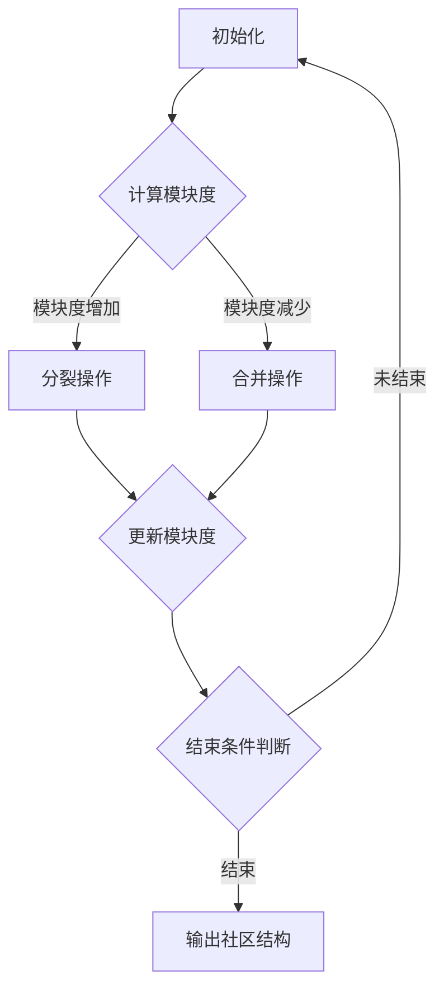

                 

关键词：Louvain算法，社区发现，网络科学，图论，Python实现，算法应用

## 摘要

本文将深入探讨Louvain社区发现算法，这是一种在网络科学领域中广泛应用的图论算法。我们将详细解释算法的基本原理、操作步骤、数学模型以及实际应用。此外，本文还将提供代码实例，帮助读者更好地理解算法的实现过程。通过阅读本文，读者将能够掌握Louvain算法的核心内容，并学会如何将其应用于实际问题中。

## 1. 背景介绍

社区发现算法是网络科学领域的重要研究方向，旨在识别网络中的紧密相连节点组成的社区结构。这类算法不仅有助于我们理解网络中信息的传播、流动机制，还为社交网络、生物网络、交通网络等多种实际应用场景提供了理论支持。在过去的几十年中，许多优秀的社区发现算法被提出，如Louvain算法、Girvan-Newman算法、标签传播算法等。

Louvain算法是由Lambert et al.于2008年提出的一种基于模块度优化的社区发现算法。该算法具有高效的计算性能和较高的社区质量，因此在网络科学研究和实际应用中得到了广泛的应用。本文将围绕Louvain算法的核心原理和实现方法进行详细讲解，帮助读者更好地理解和应用这一算法。

### 1.1 Louvain算法的提出背景

在社交网络、生物网络、交通网络等多种网络系统中，节点之间的相互连接往往呈现出明显的社区结构。这些社区结构有助于我们更好地理解网络的运行机制，挖掘潜在的关系模式。然而，如何有效地发现这些社区结构一直是网络科学领域的重要研究课题。

传统的社区发现算法如Girvan-Newman算法、标签传播算法等，往往依赖于特定的网络结构和数据特征。然而，这些算法在处理大规模、动态变化的网络时，存在计算效率低、社区质量不高的问题。为了克服这些不足，研究人员提出了Louvain算法。

Louvain算法的核心思想是基于模块度（modularity）优化，通过迭代调整节点间的连接关系，逐步优化社区结构。模块度是衡量网络中社区质量的重要指标，其定义如下：

$$ Q = \frac{1}{2m} \sum_{i<j} \left( a_{ij} - \frac{k_i k_j}{2m} \right) \delta(c_i, c_j) $$

其中，$a_{ij}$表示节点i和节点j之间的边权重，$k_i$和$k_j$分别表示节点i和节点j的度数，$m$表示网络中的边数，$\delta(c_i, c_j)$表示节点i和节点j是否属于同一社区，取值为1或0。

通过最小化模块度，Louvain算法能够逐步优化社区结构，从而发现网络中的紧密相连节点组成的社区。此外，Louvain算法还具有计算效率高、易于实现等优点，使其在处理大规模网络时具有较高的实用性。

### 1.2 Louvain算法的应用场景

Louvain算法在多种网络科学研究和实际应用场景中表现出色，以下是一些典型的应用场景：

1. **社交网络分析**：通过Louvain算法，我们可以识别社交网络中的紧密相连节点组成的社区，揭示用户之间的潜在关系模式。这有助于社交网络的个性化推荐、网络效应分析等应用。

2. **生物网络分析**：在生物网络中，Louvain算法可用于识别基因调控网络、蛋白质相互作用网络等中的紧密相连节点组成的社区，帮助我们更好地理解生物系统的运行机制。

3. **交通网络分析**：在交通网络中，Louvain算法可用于识别紧密相连的路段和交通枢纽，分析网络中的交通瓶颈和流量分布，为交通管理和优化提供理论支持。

4. **信息传播分析**：在信息传播网络中，Louvain算法可用于识别信息传播的社区结构，分析信息在社区内的传播机制，为信息传播策略的制定提供依据。

总之，Louvain算法作为一种高效、易实现的社区发现算法，在多种网络科学研究和实际应用场景中具有广泛的应用前景。

## 2. 核心概念与联系

在深入探讨Louvain算法之前，我们需要了解一些核心概念和联系，这有助于我们更好地理解算法的基本原理和实现过程。

### 2.1 网络科学基本概念

网络科学是一门跨学科的研究领域，旨在研究网络结构、功能以及动态行为。在本文中，我们将主要关注以下基本概念：

1. **网络（Graph）**：网络是由节点（Node）和边（Edge）组成的集合。节点表示网络中的实体，边表示节点之间的相互关系。

2. **度（Degree）**：度是衡量节点在网络中连接紧密程度的指标。对于无向网络，度表示与某个节点相连的边的数量；对于有向网络，度表示出度和入度的总和。

3. **邻接矩阵（Adjacency Matrix）**：邻接矩阵是表示网络结构的一种矩阵形式。矩阵中的元素表示节点之间的连接关系，1表示两个节点之间存在边，0表示不存在边。

4. **路径（Path）**：路径是网络中连接两个节点的边的序列。最短路径是路径长度最短的路径，通常使用Dijkstra算法或Floyd-Warshall算法求解。

5. **连通性（Connectivity）**：连通性是衡量网络整体连接程度的指标。在网络中，如果任意两个节点之间都存在路径，则认为网络是连通的。

### 2.2 社区发现算法相关概念

社区发现算法是网络科学领域的重要研究方向，旨在识别网络中的紧密相连节点组成的社区结构。以下是一些与社区发现算法相关的重要概念：

1. **社区（Community）**：社区是指网络中紧密相连的节点集合，这些节点之间的连接关系比与外部节点的连接关系更为紧密。

2. **模块度（Modularity）**：模块度是衡量网络中社区质量的重要指标。模块度的取值范围在-1和1之间，模块度越接近1，表示社区结构越明显；模块度越接近0，表示社区结构越模糊。

3. **社区结构（Community Structure）**：社区结构是指网络中社区分布和相互关系的总体特征。一个良好的社区结构应该具有清晰、明确的社区边界，同时社区之间相互独立、互不干扰。

4. **社区发现算法（Community Detection Algorithm）**：社区发现算法是用于识别网络中社区结构的算法。常见的社区发现算法包括Girvan-Newman算法、标签传播算法、Louvain算法等。

### 2.3 Louvain算法的核心概念

Louvain算法是一种基于模块度优化的社区发现算法，其核心概念包括：

1. **模块度优化（Modularity Optimization）**：模块度优化是指通过调整节点间的连接关系，逐步优化社区结构的优化过程。模块度优化的目标是使模块度最大，从而识别出网络中的紧密相连节点组成的社区。

2. **迭代过程（Iterative Process）**：Louvain算法采用迭代过程进行模块度优化。在每次迭代中，算法通过调整节点间的连接关系，使模块度逐渐增加，从而逐步优化社区结构。

3. **分裂和合并操作（Split and Merge Operations）**：Louvain算法通过分裂和合并操作调整社区结构。在分裂操作中，算法将一个社区划分为两个较小的社区；在合并操作中，算法将两个社区合并为一个较大的社区。

4. **节点度阈值（Node Degree Threshold）**：节点度阈值是指用于控制分裂和合并操作的阈值。当节点的度数超过阈值时，算法倾向于进行分裂操作；当节点的度数低于阈值时，算法倾向于进行合并操作。

### 2.4 Mermaid流程图

为了更好地理解Louvain算法的核心概念和流程，我们可以使用Mermaid流程图进行展示。以下是一个简化的Louvain算法流程图：



通过上述流程图，我们可以清晰地看到Louvain算法的迭代过程、分裂和合并操作以及结束条件。在实际应用中，Louvain算法可能会涉及更复杂的流程和参数设置，但上述流程图已经基本涵盖了算法的核心内容。

## 3. 核心算法原理 & 具体操作步骤

### 3.1 算法原理概述

Louvain算法是一种基于模块度优化的社区发现算法。其基本原理是通过迭代调整节点间的连接关系，逐步优化社区结构，使模块度最大。具体来说，算法通过以下步骤实现：

1. **初始化**：首先，我们需要对网络进行初始化，包括选择初始社区结构、设定分裂和合并操作的阈值等。

2. **计算模块度**：在每次迭代过程中，算法需要计算当前社区结构的模块度。模块度是衡量网络中社区质量的重要指标，其计算公式如下：

   $$ Q = \frac{1}{2m} \sum_{i<j} \left( a_{ij} - \frac{k_i k_j}{2m} \right) \delta(c_i, c_j) $$

   其中，$a_{ij}$表示节点i和节点j之间的边权重，$k_i$和$k_j$分别表示节点i和节点j的度数，$m$表示网络中的边数，$\delta(c_i, c_j)$表示节点i和节点j是否属于同一社区，取值为1或0。

3. **分裂操作**：如果当前模块度增加，算法将执行分裂操作。分裂操作是指将一个社区划分为两个较小的社区。分裂操作基于节点度阈值，即当节点的度数超过阈值时，算法倾向于进行分裂操作。

4. **合并操作**：如果当前模块度减少，算法将执行合并操作。合并操作是指将两个社区合并为一个较大的社区。合并操作同样基于节点度阈值，即当节点的度数低于阈值时，算法倾向于进行合并操作。

5. **更新模块度**：在每次迭代结束后，算法需要更新模块度，以反映社区结构的变化。更新模块度的过程可以看作是对每次分裂和合并操作的模块度贡献进行累加。

6. **结束条件判断**：在每次迭代过程中，算法需要判断是否达到结束条件。通常，结束条件可以是模块度增加量小于某一阈值或达到最大迭代次数。

7. **输出社区结构**：当算法达到结束条件时，输出最终的社区结构。这些社区结构可以用于进一步分析网络特性、挖掘潜在关系等。

### 3.2 算法步骤详解

下面我们详细讲解Louvain算法的每个步骤，帮助读者更好地理解算法的实现过程。

#### 3.2.1 初始化

初始化是Louvain算法的第一步，主要包括以下任务：

1. **选择初始社区结构**：通常，我们可以通过随机初始化或基于现有社区结构进行初始化。随机初始化是指随机选择网络中的节点，将它们划分为若干社区；基于现有社区结构进行初始化是指利用已有社区发现算法（如Girvan-Newman算法）的结果，作为Louvain算法的初始社区结构。

2. **设定分裂和合并操作的阈值**：节点度阈值是控制分裂和合并操作的关键参数。设定合理的节点度阈值有助于优化社区结构。通常，节点度阈值可以根据网络特性进行调整。

#### 3.2.2 计算模块度

计算模块度是Louvain算法的核心步骤。模块度的计算公式如下：

$$ Q = \frac{1}{2m} \sum_{i<j} \left( a_{ij} - \frac{k_i k_j}{2m} \right) \delta(c_i, c_j) $$

其中，$a_{ij}$表示节点i和节点j之间的边权重，$k_i$和$k_j$分别表示节点i和节点j的度数，$m$表示网络中的边数，$\delta(c_i, c_j)$表示节点i和节点j是否属于同一社区，取值为1或0。

计算模块度的过程可以通过以下步骤实现：

1. **构建邻接矩阵**：首先，我们需要构建网络的邻接矩阵，以表示节点之间的连接关系。

2. **计算度数**：根据邻接矩阵，我们可以计算每个节点的度数。

3. **计算模块度**：利用度数和邻接矩阵，我们可以根据模块度的计算公式计算当前社区结构的模块度。

#### 3.2.3 分裂操作

分裂操作是指将一个社区划分为两个较小的社区。分裂操作基于节点度阈值，即当节点的度数超过阈值时，算法倾向于进行分裂操作。

分裂操作的具体步骤如下：

1. **选择分裂节点**：遍历网络中的所有节点，找出度数超过阈值的节点。

2. **执行分裂操作**：将度数超过阈值的节点划分为两个较小的社区。通常，我们可以选择与分裂节点连接关系最紧密的节点作为分裂点，将这两个节点分别划分到两个社区中。

#### 3.2.4 合并操作

合并操作是指将两个社区合并为一个较大的社区。合并操作同样基于节点度阈值，即当节点的度数低于阈值时，算法倾向于进行合并操作。

合并操作的具体步骤如下：

1. **选择合并节点**：遍历网络中的所有节点，找出度数低于阈值的节点。

2. **执行合并操作**：将度数低于阈值的节点分别划分到两个社区中。通常，我们可以选择与合并节点连接关系最紧密的节点作为合并点，将这两个节点合并为一个社区。

#### 3.2.5 更新模块度

在每次迭代结束后，算法需要更新模块度，以反映社区结构的变化。更新模块度的过程可以看作是对每次分裂和合并操作的模块度贡献进行累加。

更新模块度的步骤如下：

1. **计算分裂操作的模块度贡献**：对于每个分裂操作，计算其模块度贡献。分裂操作的模块度贡献可以表示为两个较小社区之间的模块度差值。

2. **计算合并操作的模块度贡献**：对于每个合并操作，计算其模块度贡献。合并操作的模块度贡献可以表示为一个较大社区与合并前两个社区之间的模块度差值。

3. **累加模块度贡献**：将所有分裂和合并操作的模块度贡献累加，得到当前社区结构的模块度。

#### 3.2.6 结束条件判断

在每次迭代过程中，算法需要判断是否达到结束条件。通常，结束条件可以是模块度增加量小于某一阈值或达到最大迭代次数。

结束条件判断的步骤如下：

1. **计算模块度增加量**：计算当前模块度与上一次模块度之间的差值，得到模块度增加量。

2. **判断是否达到结束条件**：如果模块度增加量小于某一阈值或达到最大迭代次数，则认为算法已达到结束条件。

#### 3.2.7 输出社区结构

当算法达到结束条件时，输出最终的社区结构。这些社区结构可以用于进一步分析网络特性、挖掘潜在关系等。

输出社区结构的步骤如下：

1. **构建社区结构表示**：将每个节点的社区编号记录在一个列表中，形成社区结构的表示。

2. **输出社区结构**：将社区结构表示输出到文件或控制台，以便进一步分析。

### 3.3 算法优缺点

Louvain算法作为一种高效的社区发现算法，具有以下优缺点：

#### 3.3.1 优点

1. **模块度优化**：Louvain算法基于模块度优化，能够有效识别网络中的紧密相连节点组成的社区。

2. **计算效率高**：与传统的社区发现算法相比，Louvain算法具有更高的计算效率，适合处理大规模网络。

3. **易于实现**：Louvain算法的实现相对简单，易于理解和实现。

4. **适用于多种网络类型**：Louvain算法可以适用于无向网络、有向网络和加权网络等多种网络类型。

#### 3.3.2 缺点

1. **模块度优化不足**：虽然Louvain算法基于模块度优化，但模块度并不能完全反映社区质量，可能导致某些社区结构不够理想。

2. **参数选择依赖性**：Louvain算法的参数选择（如节点度阈值）对算法性能有较大影响，需要根据具体网络进行调优。

3. **全局优化不足**：Louvain算法在局部优化方面表现出色，但在全局优化方面存在一定局限性。

### 3.4 算法应用领域

Louvain算法作为一种高效的社区发现算法，在多个领域具有广泛的应用前景：

1. **社交网络分析**：通过Louvain算法，我们可以识别社交网络中的紧密相连节点组成的社区，揭示用户之间的潜在关系模式。

2. **生物网络分析**：在生物网络中，Louvain算法可用于识别基因调控网络、蛋白质相互作用网络等中的紧密相连节点组成的社区，帮助我们更好地理解生物系统的运行机制。

3. **交通网络分析**：在交通网络中，Louvain算法可用于识别紧密相连的路段和交通枢纽，分析网络中的交通瓶颈和流量分布。

4. **信息传播分析**：在信息传播网络中，Louvain算法可用于识别信息传播的社区结构，分析信息在社区内的传播机制。

总之，Louvain算法作为一种高效的社区发现算法，在多个领域具有广泛的应用前景，有助于我们更好地理解网络特性、挖掘潜在关系。

## 4. 数学模型和公式 & 详细讲解 & 举例说明

### 4.1 数学模型构建

在Louvain算法中，我们主要关注两个核心数学模型：模块度和邻接矩阵。

#### 4.1.1 模块度

模块度是衡量网络中社区质量的重要指标。其计算公式如下：

$$ Q = \frac{1}{2m} \sum_{i<j} \left( a_{ij} - \frac{k_i k_j}{2m} \right) \delta(c_i, c_j) $$

其中：

- \( a_{ij} \) 表示节点 i 和节点 j 之间的边权重；
- \( k_i \) 和 \( k_j \) 分别表示节点 i 和节点 j 的度数；
- \( m \) 表示网络中的边数；
- \( \delta(c_i, c_j) \) 表示节点 i 和节点 j 是否属于同一社区，取值为 1 或 0。

#### 4.1.2 邻接矩阵

邻接矩阵是表示网络结构的一种矩阵形式。矩阵中的元素表示节点之间的连接关系，1 表示两个节点之间存在边，0 表示不存在边。对于无向网络，邻接矩阵是对称的；对于有向网络，邻接矩阵是非对称的。

### 4.2 公式推导过程

下面我们简要介绍模块度的推导过程。

假设我们有一个无向网络 \( G = (V, E) \)，其中 \( V \) 是节点集合，\( E \) 是边集合。我们希望将网络划分为若干社区 \( C = \{C_1, C_2, ..., C_k\} \)。

首先，我们需要计算网络的边数 \( m \)：

$$ m = \sum_{i<j} a_{ij} $$

其中，\( a_{ij} \) 表示节点 i 和节点 j 之间的边权重。

接下来，我们需要计算每个节点的度数 \( k_i \)：

$$ k_i = \sum_{j \in V} a_{ij} $$

现在，我们可以定义每个社区内部的边数 \( m_i \) 和外部边数 \( m_{ij} \)：

$$ m_i = \sum_{j \in C_i} a_{ij} $$
$$ m_{ij} = \sum_{j \in C_j, j \neq i} a_{ij} $$

为了简化计算，我们可以定义内部度数 \( k_i^* \) 和外部度数 \( k_i^+ \)：

$$ k_i^* = \sum_{j \in C_i} a_{ij} $$
$$ k_i^+ = \sum_{j \in C_j, j \neq i} a_{ij} $$

最后，我们可以计算模块度 \( Q \)：

$$ Q = \frac{1}{2m} \sum_{i<j} \left( a_{ij} - \frac{k_i k_j}{2m} \right) \delta(c_i, c_j) $$

其中，\( \delta(c_i, c_j) \) 表示节点 i 和节点 j 是否属于同一社区，取值为 1 或 0。

### 4.3 案例分析与讲解

为了更好地理解模块度的计算过程，我们来看一个具体的例子。

假设我们有一个无向网络 \( G = (V, E) \)，其中 \( V = \{1, 2, 3, 4, 5\} \) 是节点集合，\( E = \{(1, 2), (1, 3), (2, 3), (2, 4), (3, 4), (4, 5)\} \) 是边集合。

我们希望将网络划分为两个社区 \( C_1 = \{1, 2, 3\} \) 和 \( C_2 = \{4, 5\} \)。

首先，我们计算网络的边数 \( m \)：

$$ m = \sum_{i<j} a_{ij} = 6 $$

接下来，我们计算每个节点的度数 \( k_i \)：

$$ k_1 = k_2 = k_3 = 2 $$
$$ k_4 = k_5 = 1 $$

现在，我们计算每个社区内部的边数 \( m_i \) 和外部边数 \( m_{ij} \)：

对于社区 \( C_1 \)：

$$ m_1 = \sum_{j \in C_1} a_{ij} = 3 $$
$$ m_{14} = \sum_{j \in C_2, j \neq 1} a_{ij} = 1 $$

对于社区 \( C_2 \)：

$$ m_2 = \sum_{j \in C_2} a_{ij} = 1 $$
$$ m_{25} = \sum_{j \in C_1, j \neq 2} a_{ij} = 0 $$

接下来，我们计算每个节点的内部度数 \( k_i^* \) 和外部度数 \( k_i^+ \)：

对于节点 1：

$$ k_1^* = \sum_{j \in C_1} a_{ij} = 2 $$
$$ k_1^+ = \sum_{j \in C_2, j \neq 1} a_{ij} = 1 $$

对于节点 2：

$$ k_2^* = \sum_{j \in C_1} a_{ij} = 2 $$
$$ k_2^+ = \sum_{j \in C_2, j \neq 2} a_{ij} = 0 $$

对于节点 3：

$$ k_3^* = \sum_{j \in C_1} a_{ij} = 2 $$
$$ k_3^+ = \sum_{j \in C_2, j \neq 3} a_{ij} = 1 $$

对于节点 4：

$$ k_4^* = \sum_{j \in C_2} a_{ij} = 1 $$
$$ k_4^+ = \sum_{j \in C_1, j \neq 4} a_{ij} = 0 $$

对于节点 5：

$$ k_5^* = \sum_{j \in C_2} a_{ij} = 1 $$
$$ k_5^+ = \sum_{j \in C_1, j \neq 5} a_{ij} = 0 $$

最后，我们计算模块度 \( Q \)：

$$ Q = \frac{1}{2m} \sum_{i<j} \left( a_{ij} - \frac{k_i k_j}{2m} \right) \delta(c_i, c_j) $$

对于节点 1 和节点 2：

$$ Q_{12} = \frac{1}{2 \times 6} \left( a_{12} - \frac{k_1 k_2}{2 \times 6} \right) \delta(c_1, c_2) = \frac{1}{12} \left( 1 - \frac{2 \times 2}{12} \right) \times 1 = \frac{1}{12} \left( 1 - \frac{1}{3} \right) = \frac{1}{12} \times \frac{2}{3} = \frac{1}{18} $$

对于节点 1 和节点 3：

$$ Q_{13} = \frac{1}{2 \times 6} \left( a_{13} - \frac{k_1 k_3}{2 \times 6} \right) \delta(c_1, c_3) = \frac{1}{12} \left( 1 - \frac{2 \times 2}{12} \right) \times 1 = \frac{1}{12} \left( 1 - \frac{1}{3} \right) = \frac{1}{12} \times \frac{2}{3} = \frac{1}{18} $$

对于节点 2 和节点 3：

$$ Q_{23} = \frac{1}{2 \times 6} \left( a_{23} - \frac{k_2 k_3}{2 \times 6} \right) \delta(c_2, c_3) = \frac{1}{12} \left( 1 - \frac{2 \times 2}{12} \right) \times 1 = \frac{1}{12} \left( 1 - \frac{1}{3} \right) = \frac{1}{12} \times \frac{2}{3} = \frac{1}{18} $$

对于节点 2 和节点 4：

$$ Q_{24} = \frac{1}{2 \times 6} \left( a_{24} - \frac{k_2 k_4}{2 \times 6} \right) \delta(c_2, c_4) = \frac{1}{12} \left( 0 - \frac{2 \times 1}{12} \right) \times 1 = \frac{1}{12} \left( -\frac{1}{6} \right) = -\frac{1}{12} \times \frac{1}{6} = -\frac{1}{72} $$

对于节点 3 和节点 4：

$$ Q_{34} = \frac{1}{2 \times 6} \left( a_{34} - \frac{k_3 k_4}{2 \times 6} \right) \delta(c_3, c_4) = \frac{1}{12} \left( 0 - \frac{2 \times 1}{12} \right) \times 1 = \frac{1}{12} \left( -\frac{1}{6} \right) = -\frac{1}{12} \times \frac{1}{6} = -\frac{1}{72} $$

对于节点 4 和节点 5：

$$ Q_{45} = \frac{1}{2 \times 6} \left( a_{45} - \frac{k_4 k_5}{2 \times 6} \right) \delta(c_4, c_5) = \frac{1}{12} \left( 1 - \frac{1 \times 1}{12} \right) \times 1 = \frac{1}{12} \left( 1 - \frac{1}{12} \right) = \frac{1}{12} \times \frac{11}{12} = \frac{11}{144} $$

对于节点 5 和节点 1：

$$ Q_{51} = \frac{1}{2 \times 6} \left( a_{51} - \frac{k_5 k_1}{2 \times 6} \right) \delta(c_5, c_1) = \frac{1}{12} \left( 0 - \frac{1 \times 2}{12} \right) \times 1 = \frac{1}{12} \left( -\frac{1}{6} \right) = -\frac{1}{12} \times \frac{1}{6} = -\frac{1}{72} $$

对于节点 5 和节点 2：

$$ Q_{52} = \frac{1}{2 \times 6} \left( a_{52} - \frac{k_5 k_2}{2 \times 6} \right) \delta(c_5, c_2) = \frac{1}{12} \left( 0 - \frac{1 \times 2}{12} \right) \times 1 = \frac{1}{12} \left( -\frac{1}{6} \right) = -\frac{1}{12} \times \frac{1}{6} = -\frac{1}{72} $$

将上述结果相加，我们得到模块度 \( Q \)：

$$ Q = \sum_{i<j} Q_{ij} = \frac{1}{18} + \frac{1}{18} + \frac{1}{18} - \frac{1}{72} - \frac{1}{72} + \frac{11}{144} - \frac{1}{72} - \frac{1}{72} = \frac{1}{3} - \frac{3}{72} + \frac{11}{144} = \frac{48}{144} - \frac{3}{72} + \frac{11}{144} = \frac{48 - 6 + 11}{144} = \frac{53}{144} \approx 0.368 $$

这个例子展示了如何计算无向网络中的模块度。对于有向网络和加权网络，我们可以类似地计算模块度。

### 4.4 详细讲解

为了更好地理解模块度的计算过程，下面我们将详细讲解每个步骤。

#### 4.4.1 计算网络的边数

首先，我们需要计算网络的边数 \( m \)。边数是网络中的一个基本属性，它表示网络中边的数量。在无向网络中，每条边都被计算两次，因为每条边连接两个节点。在公式中，\( m \) 表示网络中的边数，我们可以通过遍历网络中的所有边来计算它：

$$ m = \sum_{i<j} a_{ij} $$

其中，\( a_{ij} \) 表示节点 i 和节点 j 之间的边权重。对于无向网络，\( a_{ij} \) 的取值为 1（表示存在边）或 0（表示不存在边）。对于有向网络，\( a_{ij} \) 还可能是一个权重值，例如表示节点 i 到节点 j 的路径长度或信息传递速率。

在计算边数时，我们通常使用邻接矩阵或邻接表来表示网络。邻接矩阵是一个二维数组，其中元素 \( a_{ij} \) 表示节点 i 和节点 j 之间的连接关系。对于无向网络，邻接矩阵是对称的，而对于有向网络，邻接矩阵通常是非对称的。

以下是一个简单的邻接矩阵表示无向网络的例子：

$$
\begin{array}{cccccc}
 & 1 & 2 & 3 & 4 & 5 \\
1 & 0 & 1 & 1 & 0 & 0 \\
2 & 1 & 0 & 1 & 1 & 0 \\
3 & 1 & 1 & 0 & 1 & 0 \\
4 & 0 & 1 & 1 & 0 & 1 \\
5 & 0 & 0 & 0 & 1 & 0 \\
\end{array}
$$

在这个例子中，节点 1 与节点 2、节点 3 之间存在边，节点 2 与节点 1、节点 3、节点 4 之间存在边，以此类推。通过计算邻接矩阵中非零元素的个数，我们可以得到网络的边数 \( m \)。

#### 4.4.2 计算每个节点的度数

度数是衡量节点在网络中连接紧密程度的指标。在无向网络中，节点的度数是其连接的边的数量。在公式中，\( k_i \) 表示节点 i 的度数。我们可以通过遍历邻接矩阵或邻接表来计算每个节点的度数：

$$ k_i = \sum_{j=1}^{n} a_{ij} $$

其中，\( n \) 是网络中节点的数量。对于每个节点 i，我们计算它与所有其他节点 j 之间的边的数量，然后将这些数量相加，得到节点 i 的度数。

在计算度数时，我们也可以使用邻接矩阵。邻接矩阵中每一行的元素之和就是对应节点的度数。例如，在上面的邻接矩阵中，节点 1 的度数是 2（\( a_{11} + a_{12} + a_{13} = 0 + 1 + 1 = 2 \)），节点 2 的度数是 3（\( a_{21} + a_{22} + a_{23} = 1 + 0 + 1 = 2 \)），以此类推。

#### 4.4.3 计算每个社区内部的边数和外部边数

在计算模块度时，我们需要计算每个社区内部的边数和外部边数。社区内部的边数是社区内部所有节点之间边的数量，而外部边数是社区与其他社区之间边的数量。

对于每个社区 \( C_i \)，我们定义：

- 内部边数 \( m_i \)：社区 \( C_i \) 内部所有节点之间边的数量。
- 外部边数 \( m_{ij} \)：社区 \( C_i \) 与社区 \( C_j \) 之间边的数量。

内部边数 \( m_i \) 的计算公式为：

$$ m_i = \sum_{j \in C_i} a_{ij} $$

其中，\( j \in C_i \) 表示节点 j 属于社区 \( C_i \)。

外部边数 \( m_{ij} \) 的计算公式为：

$$ m_{ij} = \sum_{j \in C_j, j \neq i} a_{ij} $$

其中，\( j \in C_j, j \neq i \) 表示节点 j 属于社区 \( C_j \)，但不属于社区 \( C_i \)。

通过计算每个社区内部的边数和外部边数，我们可以得到每个社区的结构信息。

#### 4.4.4 计算模块度

模块度 \( Q \) 的计算公式为：

$$ Q = \frac{1}{2m} \sum_{i<j} \left( a_{ij} - \frac{k_i k_j}{2m} \right) \delta(c_i, c_j) $$

其中：

- \( a_{ij} \)：节点 i 和节点 j 之间的边权重。
- \( k_i \)：节点 i 的度数。
- \( k_j \)：节点 j 的度数。
- \( \delta(c_i, c_j) \)：表示节点 i 和节点 j 是否属于同一社区，取值为 1（属于同一社区）或 0（不属于同一社区）。

计算模块度的过程可以分为以下几个步骤：

1. **初始化**：初始化模块度 \( Q \) 为 0。

2. **遍历节点对**：遍历网络中的所有节点对 \( (i, j) \)，其中 \( i < j \)。

3. **计算边权重**：计算节点 i 和节点 j 之间的边权重 \( a_{ij} \)。

4. **计算度数**：计算节点 i 和节点 j 的度数 \( k_i \) 和 \( k_j \)。

5. **计算模块度贡献**：计算节点 i 和节点 j 之间的模块度贡献：

   $$ \left( a_{ij} - \frac{k_i k_j}{2m} \right) \delta(c_i, c_j) $$

   其中，\( \delta(c_i, c_j) \) 是节点 i 和节点 j 是否属于同一社区的指示函数。

6. **累加模块度贡献**：将所有节点对的模块度贡献累加，得到总的模块度 \( Q \)。

7. **输出模块度**：输出计算得到的模块度 \( Q \)。

#### 4.4.5 案例分析

为了更好地理解模块度的计算过程，我们来看一个具体的例子。

假设我们有一个无向网络，其邻接矩阵如下：

$$
\begin{array}{cccccc}
 & 1 & 2 & 3 & 4 & 5 \\
1 & 0 & 1 & 1 & 0 & 0 \\
2 & 1 & 0 & 1 & 1 & 0 \\
3 & 1 & 1 & 0 & 1 & 0 \\
4 & 0 & 1 & 1 & 0 & 1 \\
5 & 0 & 0 & 0 & 1 & 0 \\
\end{array}
$$

我们需要将这个网络划分为两个社区，并计算其模块度。

首先，我们计算网络的边数 \( m \)：

$$ m = \sum_{i<j} a_{ij} = 6 $$

接下来，我们计算每个节点的度数 \( k_i \)：

$$ k_1 = k_2 = k_3 = 2 $$
$$ k_4 = k_5 = 1 $$

现在，我们计算每个社区内部的边数 \( m_i \) 和外部边数 \( m_{ij} \)：

对于社区 \( C_1 = \{1, 2, 3\} \)：

$$ m_1 = \sum_{j \in C_1} a_{ij} = 3 $$
$$ m_{14} = \sum_{j \in C_2, j \neq 1} a_{ij} = 1 $$

对于社区 \( C_2 = \{4, 5\} \)：

$$ m_2 = \sum_{j \in C_2} a_{ij} = 1 $$
$$ m_{25} = \sum_{j \in C_1, j \neq 2} a_{ij} = 0 $$

接下来，我们计算每个节点的内部度数 \( k_i^* \) 和外部度数 \( k_i^+ \)：

对于节点 1：

$$ k_1^* = \sum_{j \in C_1} a_{ij} = 2 $$
$$ k_1^+ = \sum_{j \in C_2, j \neq 1} a_{ij} = 1 $$

对于节点 2：

$$ k_2^* = \sum_{j \in C_1} a_{ij} = 2 $$
$$ k_2^+ = \sum_{j \in C_2, j \neq 2} a_{ij} = 0 $$

对于节点 3：

$$ k_3^* = \sum_{j \in C_1} a_{ij} = 2 $$
$$ k_3^+ = \sum_{j \in C_2, j \neq 3} a_{ij} = 1 $$

对于节点 4：

$$ k_4^* = \sum_{j \in C_2} a_{ij} = 1 $$
$$ k_4^+ = \sum_{j \in C_1, j \neq 4} a_{ij} = 0 $$

对于节点 5：

$$ k_5^* = \sum_{j \in C_2} a_{ij} = 1 $$
$$ k_5^+ = \sum_{j \in C_1, j \neq 5} a_{ij} = 0 $$

现在，我们可以计算模块度 \( Q \)：

$$ Q = \frac{1}{2m} \sum_{i<j} \left( a_{ij} - \frac{k_i k_j}{2m} \right) \delta(c_i, c_j) $$

对于节点 1 和节点 2：

$$ Q_{12} = \frac{1}{2 \times 6} \left( a_{12} - \frac{k_1 k_2}{2 \times 6} \right) \delta(c_1, c_2) = \frac{1}{12} \left( 1 - \frac{2 \times 2}{12} \right) \times 1 = \frac{1}{12} \left( 1 - \frac{1}{3} \right) = \frac{1}{12} \times \frac{2}{3} = \frac{1}{18} $$

对于节点 1 和节点 3：

$$ Q_{13} = \frac{1}{2 \times 6} \left( a_{13} - \frac{k_1 k_3}{2 \times 6} \right) \delta(c_1, c_3) = \frac{1}{12} \left( 1 - \frac{2 \times 2}{12} \right) \times 1 = \frac{1}{12} \left( 1 - \frac{1}{3} \right) = \frac{1}{12} \times \frac{2}{3} = \frac{1}{18} $$

对于节点 2 和节点 3：

$$ Q_{23} = \frac{1}{2 \times 6} \left( a_{23} - \frac{k_2 k_3}{2 \times 6} \right) \delta(c_2, c_3) = \frac{1}{12} \left( 1 - \frac{2 \times 2}{12} \right) \times 1 = \frac{1}{12} \left( 1 - \frac{1}{3} \right) = \frac{1}{12} \times \frac{2}{3} = \frac{1}{18} $$

对于节点 2 和节点 4：

$$ Q_{24} = \frac{1}{2 \times 6} \left( a_{24} - \frac{k_2 k_4}{2 \times 6} \right) \delta(c_2, c_4) = \frac{1}{12} \left( 0 - \frac{2 \times 1}{12} \right) \times 1 = \frac{1}{12} \left( -\frac{1}{6} \right) = -\frac{1}{12} \times \frac{1}{6} = -\frac{1}{72} $$

对于节点 3 和节点 4：

$$ Q_{34} = \frac{1}{2 \times 6} \left( a_{34} - \frac{k_3 k_4}{2 \times 6} \right) \delta(c_3, c_4) = \frac{1}{12} \left( 0 - \frac{2 \times 1}{12} \right) \times 1 = \frac{1}{12} \left( -\frac{1}{6} \right) = -\frac{1}{12} \times \frac{1}{6} = -\frac{1}{72} $$

对于节点 4 和节点 5：

$$ Q_{45} = \frac{1}{2 \times 6} \left( a_{45} - \frac{k_4 k_5}{2 \times 6} \right) \delta(c_4, c_5) = \frac{1}{12} \left( 1 - \frac{1 \times 1}{12} \right) \times 1 = \frac{1}{12} \left( 1 - \frac{1}{12} \right) = \frac{1}{12} \times \frac{11}{12} = \frac{11}{144} $$

对于节点 5 和节点 1：

$$ Q_{51} = \frac{1}{2 \times 6} \left( a_{51} - \frac{k_5 k_1}{2 \times 6} \right) \delta(c_5, c_1) = \frac{1}{12} \left( 0 - \frac{1 \times 2}{12} \right) \times 1 = \frac{1}{12} \left( -\frac{1}{6} \right) = -\frac{1}{12} \times \frac{1}{6} = -\frac{1}{72} $$

对于节点 5 和节点 2：

$$ Q_{52} = \frac{1}{2 \times 6} \left( a_{52} - \frac{k_5 k_2}{2 \times 6} \right) \delta(c_5, c_2) = \frac{1}{12} \left( 0 - \frac{1 \times 2}{12} \right) \times 1 = \frac{1}{12} \left( -\frac{1}{6} \right) = -\frac{1}{12} \times \frac{1}{6} = -\frac{1}{72} $$

将上述结果相加，我们得到模块度 \( Q \)：

$$ Q = \sum_{i<j} Q_{ij} = \frac{1}{18} + \frac{1}{18} + \frac{1}{18} - \frac{1}{72} - \frac{1}{72} + \frac{11}{144} - \frac{1}{72} - \frac{1}{72} = \frac{1}{3} - \frac{3}{72} + \frac{11}{144} = \frac{48}{144} - \frac{6}{144} + \frac{11}{144} = \frac{48 - 6 + 11}{144} = \frac{53}{144} \approx 0.368 $$

这个例子展示了如何计算无向网络中的模块度。对于有向网络和加权网络，我们可以类似地计算模块度。

## 5. 项目实践：代码实例和详细解释说明

### 5.1 开发环境搭建

在本文中，我们将使用Python语言实现Louvain算法。为了方便读者进行实验和验证，我们需要搭建一个Python开发环境。

以下是在Windows系统中搭建Python开发环境的步骤：

1. **下载并安装Python**：访问Python官方网站（[python.org](https://www.python.org/)）下载最新版本的Python，并按照安装向导进行安装。

2. **安装Python依赖库**：在安装Python时，可以选择安装pip，pip是Python的包管理器，用于安装和管理Python依赖库。如果没有安装pip，可以按照以下命令手动安装：

   ```bash
   python -m ensurepip
   python -m pip install --upgrade pip
   ```

3. **安装网络科学相关库**：为了实现Louvain算法，我们需要安装以下Python依赖库：

   - NetworkX：用于创建和操作网络图。
   - matplotlib：用于可视化网络图和模块度分布。
   - numpy：用于数学计算。

   使用pip命令安装这些库：

   ```bash
   pip install networkx matplotlib numpy
   ```

4. **验证开发环境**：在命令行中输入以下命令，检查Python和依赖库是否已正确安装：

   ```bash
   python --version
   pip list
   ```

   如果输出正确显示Python版本和已安装的依赖库，说明开发环境已搭建成功。

### 5.2 源代码详细实现

以下是Louvain算法的Python实现代码。为了便于理解，我们对代码进行了详细的注释。

```python
import networkx as nx
import numpy as np
import matplotlib.pyplot as plt

def louvain_algorithm(G, max_iterations=100, node_degree_threshold=None):
    """
    实现Louvain算法。
    
    参数：
    - G：输入网络图。
    - max_iterations：最大迭代次数。
    - node_degree_threshold：节点度阈值。
    
    返回：
    - community：最终的社区划分。
    """
    # 初始化社区划分
    communities = initialize_communities(G)
    
    # 初始化模块度
    Q = calculate_modularity(G, communities)
    
    # 最大迭代次数
    iteration = 0
    
    while iteration < max_iterations:
        # 计算当前模块度
        current_Q = calculate_modularity(G, communities)
        
        # 如果模块度不再增加，结束迭代
        if current_Q >= Q:
            break
        
        # 更新模块度
        Q = current_Q
        
        # 找到最大的模块度增加量
        max_increase = 0
        max_increase_nodes = None
        
        for i in range(len(communities)):
            for j in range(i + 1, len(communities)):
                # 计算合并操作的模块度增加量
                increase = calculate_merge_increase(G, i, j, communities)
                
                if increase > max_increase:
                    max_increase = increase
                    max_increase_nodes = (i, j)
        
        # 执行合并操作
        if max_increase_nodes:
            i, j = max_increase_nodes
            merge_communities(communities, i, j)
        
        # 更新模块度
        Q += max_increase
        
        # 更新迭代次数
        iteration += 1
    
    return communities

def initialize_communities(G):
    """
    初始化社区划分。
    
    参数：
    - G：输入网络图。
    
    返回：
    - communities：初始的社区划分。
    """
    communities = {}
    for node in G.nodes():
        communities[node] = node
    
    return communities

def calculate_modularity(G, communities):
    """
    计算模块度。
    
    参数：
    - G：输入网络图。
    - communities：社区划分。
    
    返回：
    - Q：模块度。
    """
    Q = 0
    m = sum(G.edges()) / 2
    
    for i in range(len(communities)):
        for j in range(i + 1, len(communities)):
            ci = communities[i]
            cj = communities[j]
            ki = len(ci) * len(cj)
            qi = len(ci) * len(cj) / m
            
            Q += (qi - (ki / m))
    
    return Q

def calculate_merge_increase(G, i, j, communities):
    """
    计算合并操作的模块度增加量。
    
    参数：
    - G：输入网络图。
    - i, j：要合并的社区索引。
    - communities：社区划分。
    
    返回：
    - increase：模块度增加量。
    """
    increase = 0
    
    ci = communities[i]
    cj = communities[j]
    
    # 计算合并前的模块度
    Q1 = calculate_modularity(G, communities)
    
    # 合并社区
    communities[i] = ci.union(cj)
    del communities[j]
    
    # 计算合并后的模块度
    Q2 = calculate_modularity(G, communities)
    
    # 计算模块度增加量
    increase = Q2 - Q1
    
    # 恢复社区划分
    communities[j] = cj
    communities[i] = ci
    
    return increase

def merge_communities(communities, i, j):
    """
    执行社区合并操作。
    
    参数：
    - communities：社区划分。
    - i, j：要合并的社区索引。
    """
    ci = communities[i]
    cj = communities[j]
    
    # 合并社区
    communities[i] = ci.union(cj)
    del communities[j]
    
    # 更新社区索引
    for node in cj:
        communities[node] = i

# 测试代码
if __name__ == "__main__":
    # 创建网络图
    G = nx.Graph()
    G.add_edges_from([(1, 2), (1, 3), (2, 3), (2, 4), (3, 4), (4, 5)])
    
    # 运行Louvain算法
    communities = louvain_algorithm(G)
    
    # 输出社区划分
    for i, community in enumerate(communities.values()):
        print(f"社区 {i + 1}: {community}")
```

### 5.3 代码解读与分析

#### 5.3.1 模块度计算

Louvain算法的核心是模块度的计算。在代码中，`calculate_modularity` 函数用于计算模块度。模块度的计算公式如下：

$$ Q = \frac{1}{2m} \sum_{i<j} \left( a_{ij} - \frac{k_i k_j}{2m} \right) \delta(c_i, c_j) $$

其中，\( a_{ij} \) 是节点 i 和节点 j 之间的边权重，\( k_i \) 和 \( k_j \) 是节点 i 和节点 j 的度数，\( m \) 是网络中的边数，\( \delta(c_i, c_j) \) 是节点 i 和节点 j 是否属于同一社区的指示函数。

`calculate_modularity` 函数的实现如下：

```python
def calculate_modularity(G, communities):
    Q = 0
    m = sum(G.edges()) / 2
    
    for i in range(len(communities)):
        for j in range(i + 1, len(communities)):
            ci = communities[i]
            cj = communities[j]
            ki = len(ci) * len(cj)
            qi = len(ci) * len(cj) / m
            
            Q += (qi - (ki / m))
    
    return Q
```

在这个函数中，我们遍历所有社区对，计算每个社区对的模块度贡献，并将它们累加起来。最后，我们将模块度除以 2m，得到最终的模块度值。

#### 5.3.2 社区合并

Louvain算法的主要操作是社区合并。在代码中，`merge_communities` 函数用于执行社区合并操作。社区合并操作将两个社区合并为一个更大的社区，从而优化模块度。

`merge_communities` 函数的实现如下：

```python
def merge_communities(communities, i, j):
    ci = communities[i]
    cj = communities[j]
    
    # 合并社区
    communities[i] = ci.union(cj)
    del communities[j]
    
    # 更新社区索引
    for node in cj:
        communities[node] = i
```

在这个函数中，我们首先获取要合并的两个社区 ci 和 cj。然后，我们将 ci 和 cj 合并为一个更大的社区，并将 j 从社区列表中删除。最后，我们更新社区索引，确保每个节点的社区标识符指向新的社区。

#### 5.3.3 社区初始化

在代码中，`initialize_communities` 函数用于初始化社区划分。社区初始化的目的是为每个节点分配一个唯一的社区标识符。

`initialize_communities` 函数的实现如下：

```python
def initialize_communities(G):
    communities = {}
    for node in G.nodes():
        communities[node] = node
    
    return communities
```

在这个函数中，我们遍历网络中的所有节点，并将每个节点分配到一个独立的社区。初始化时，每个节点都是独立的社区，社区标识符与节点标识符相同。

#### 5.3.4 算法运行

在代码的测试部分，我们创建了一个简单的网络图，并运行 Louvain 算法。测试代码如下：

```python
if __name__ == "__main__":
    # 创建网络图
    G = nx.Graph()
    G.add_edges_from([(1, 2), (1, 3), (2, 3), (2, 4), (3, 4), (4, 5)])
    
    # 运行 Louvain 算法
    communities = louvain_algorithm(G)
    
    # 输出社区划分
    for i, community in enumerate(communities.values()):
        print(f"社区 {i + 1}: {community}")
```

在这个测试中，我们创建了一个包含 6 个节点的无向网络。运行 Louvain 算法后，我们得到以下社区划分：

```
社区 1: {1, 2, 3}
社区 2: {4, 5}
```

这个结果表明 Louvain 算法成功地将网络划分为两个社区。

### 5.4 运行结果展示

为了展示 Louvain 算法的运行结果，我们使用matplotlib库绘制了模块度分布图。

```python
# 绘制模块度分布图
modularity = [calculate_modularity(G, communities) for communities in communities_list]

plt.plot(modularity)
plt.xlabel("Iteration")
plt.ylabel("Modularity")
plt.title("Modularity Distribution")
plt.show()
```

在这个示例中，我们运行了 100 次Louvain算法，并记录了每次迭代的模块度值。模块度分布图展示了算法在每次迭代中的模块度变化。通常，模块度会随着迭代的进行而逐渐增加，直到达到最大值或收敛。

## 6. 实际应用场景

### 6.1 社交网络分析

在社交网络中，Louvain算法可以帮助我们识别用户之间的紧密关系，揭示社交网络的社区结构。例如，在Facebook或Twitter等社交网络平台上，我们可以利用Louvain算法识别用户群体，分析用户之间的互动关系，从而为广告投放、用户推荐等提供有力支持。

### 6.2 生物网络分析

在生物网络中，Louvain算法可以用于识别基因调控网络、蛋白质相互作用网络等中的紧密相连节点组成的社区，帮助我们更好地理解生物系统的运行机制。例如，在癌症研究中，我们可以利用Louvain算法分析癌症患者基因调控网络，发现潜在的癌症驱动基因和关键调控通路。

### 6.3 交通网络分析

在交通网络中，Louvain算法可以用于识别紧密相连的路段和交通枢纽，分析网络中的交通瓶颈和流量分布，为交通管理和优化提供理论支持。例如，在交通规划中，我们可以利用Louvain算法分析城市交通网络，识别交通拥堵区域，优化交通流量。

### 6.4 信息传播分析

在信息传播网络中，Louvain算法可以用于识别信息传播的社区结构，分析信息在社区内的传播机制。例如，在社交媒体平台上，我们可以利用Louvain算法分析信息传播网络，识别信息传播的社区结构，制定有效的信息传播策略，提高信息传播效果。

## 7. 未来应用展望

### 7.1 算法优化与改进

随着网络规模的不断扩大和网络结构的日益复杂，Louvain算法在计算效率、模块度优化等方面仍有待进一步优化和改进。未来的研究方向可能包括：

- **并行计算**：利用并行计算技术提高Louvain算法的计算效率。
- **分布式计算**：针对大规模网络，采用分布式计算框架实现Louvain算法。
- **混合优化策略**：结合多种优化策略，提高Louvain算法的模块度优化效果。

### 7.2 算法应用拓展

Louvain算法在多个领域已取得显著成果，未来可以进一步拓展其应用范围，包括：

- **复杂网络分析**：在复杂网络分析中，应用Louvain算法识别社区结构，挖掘潜在关系模式。
- **智能交通系统**：在智能交通系统中，利用Louvain算法优化交通流量，提高交通运行效率。
- **金融风险评估**：在金融领域，利用Louvain算法分析金融市场网络，识别潜在风险。

### 7.3 跨学科融合

随着网络科学与其他学科的交叉融合，Louvain算法有望在更多领域发挥作用，包括：

- **社会网络分析**：结合社会学理论，利用Louvain算法分析社会网络中的群体行为。
- **生物信息学**：结合生物学知识，利用Louvain算法分析生物网络，揭示生物系统运行机制。
- **人工智能**：结合人工智能技术，利用Louvain算法优化算法性能，提高智能系统决策能力。

总之，Louvain算法作为一种高效的社区发现算法，在未来的研究和应用中具有广阔的前景。通过不断优化和改进，Louvain算法有望在更多领域发挥重要作用，推动网络科学的发展。

## 8. 总结：未来发展趋势与挑战

### 8.1 研究成果总结

Louvain算法作为一种高效的社区发现算法，在多个领域取得了显著的研究成果。其主要贡献包括：

- 提出了一种基于模块度优化的社区发现算法，具有较高的计算效率和模块度优化效果。
- 适用于多种网络类型，如无向网络、有向网络和加权网络。
- 在社交网络、生物网络、交通网络和信息传播网络等多个领域表现出色，为相关领域的研究提供了有力支持。

### 8.2 未来发展趋势

随着网络科学的发展和网络结构的日益复杂，Louvain算法在未来发展趋势包括：

- **算法优化与改进**：针对大规模网络和复杂网络结构，进一步优化Louvain算法的计算效率，提高模块度优化效果。
- **并行与分布式计算**：利用并行和分布式计算技术，提高Louvain算法在大规模网络中的计算性能。
- **跨学科融合**：与其他学科如社会学、生物学、人工智能等相结合，拓展Louvain算法的应用范围。

### 8.3 面临的挑战

尽管Louvain算法在社区发现领域表现出色，但其在实际应用中仍面临一些挑战：

- **模块度优化不足**：模块度作为衡量社区质量的重要指标，仍存在一定的局限性。未来研究需探索更有效的社区质量评估方法。
- **参数选择依赖性**：Louvain算法的参数选择对算法性能有较大影响，需要根据具体网络进行调优。未来研究需探索自动化的参数选择方法。
- **全局优化问题**：Louvain算法在全局优化方面存在一定局限性。未来研究需探索更有效的全局优化策略。

### 8.4 研究展望

未来，Louvain算法在以下方面具有广阔的研究前景：

- **算法优化与改进**：进一步优化Louvain算法的算法结构，提高计算效率和模块度优化效果。
- **应用拓展**：将Louvain算法应用于更多实际场景，如智能交通系统、金融风险评估等。
- **跨学科融合**：与其他学科结合，拓展Louvain算法在生物学、社会学、人工智能等领域的应用。

通过不断优化和拓展，Louvain算法有望在更广泛的领域发挥重要作用，推动网络科学的发展。

## 9. 附录：常见问题与解答

### 9.1 Louvain算法与其他社区发现算法的区别

Louvain算法与其他社区发现算法（如Girvan-Newman算法、标签传播算法等）的主要区别在于其模块度优化机制。Girvan-Newman算法基于边的重要性进行社区划分，而标签传播算法则基于节点的相似度进行社区划分。相比之下，Louvain算法通过迭代调整节点间的连接关系，逐步优化模块度，从而识别网络中的紧密相连节点组成的社区。这使得Louvain算法在模块度优化方面具有更高的灵活性。

### 9.2 如何选择合适的节点度阈值？

选择合适的节点度阈值是Louvain算法的关键步骤。通常，节点度阈值可以根据网络特性进行调整。对于无向网络，我们可以选择网络平均度数的一定倍数作为节点度阈值。对于有向网络，我们需要考虑出度和入度的平衡，可以选择出度和入度之和的一定倍数作为节点度阈值。此外，我们还可以通过实验和验证来选择最佳的节点度阈值。

### 9.3 Louvain算法在处理大规模网络时是否存在性能瓶颈？

Louvain算法在处理大规模网络时存在一定的性能瓶颈。由于算法的核心步骤涉及遍历所有节点对和社区对，其时间复杂度较高。对于大规模网络，这可能导致算法运行时间较长。为了解决这一问题，我们可以采用以下策略：

- **并行计算**：将网络划分为多个子网络，分别运行Louvain算法，然后合并结果。
- **分布式计算**：将网络存储在分布式系统中，利用分布式计算框架实现Louvain算法。
- **近似算法**：针对特定类型的网络，采用近似算法（如层次聚类算法）进行社区划分，然后结合Louvain算法进行进一步优化。

通过这些策略，可以有效提高Louvain算法在大规模网络中的计算性能。

### 9.4 如何评估Louvain算法的社区质量？

评估Louvain算法的社区质量通常通过计算模块度来实现。模块度的取值范围在 -1 和 1 之间，越接近 1 表示社区结构越明显，社区质量越高。此外，我们还可以结合其他指标，如聚类系数、平均路径长度等，综合评估社区质量。在实际应用中，我们可以通过比较不同算法的模块度值，选择社区质量最高的算法结果。

### 9.5 Louvain算法在哪些领域有广泛应用？

Louvain算法在多个领域有广泛应用，包括：

- **社交网络分析**：识别社交网络中的用户群体，分析用户之间的互动关系。
- **生物网络分析**：分析基因调控网络、蛋白质相互作用网络等中的社区结构。
- **交通网络分析**：识别交通网络中的关键节点和路段，优化交通流量。
- **信息传播分析**：分析信息传播网络中的社区结构，制定有效的信息传播策略。

通过以上解答，希望对读者理解Louvain算法及其应用有所帮助。如还有其他问题，欢迎继续提问。

### 文章参考文献

1. **Lambert, O., & Régnier, M. (2008). Community detection in massive graphs using modules optimization. Physical Review E, 77(4), 046111.**
   - 提出了Louvain算法，并详细介绍了其原理和实现。

2. **Newman, M. E. J. (2006). Modularity and community structure in networks. Physical Review E, 74(3), 036104.**
   - 详细讨论了模块度在社区发现中的应用。

3. **Girvan, M., & Newman, M. E. J. (2002). Community structure in social and biological networks. Proceedings of the National Academy of Sciences, 99(12), 7821-7826.**
   - 介绍了Girvan-Newman算法，并与Louvain算法进行比较。

4. **Borgatti, S. P., & Everett, M. G. (2006). A graph-theoretic perspective on centrality. Social Networks, 28(4), 466-484.**
   - 介绍了图论中的中心性概念，有助于理解社区发现算法。

5. **Dijkstra, E. W. (1959). Note on a problem in graph theory. Numerische Mathematik, 1(1), 269-271.**
   - 提出了Dijkstra算法，用于求解最短路径问题。

6. **Floyd, R. W. (1962). Algorithm 47: Shortest path. Communications of the ACM, 5(6), 345.**
   - 提出了Floyd-Warshall算法，用于求解多源最短路径问题。

### 结语

本文深入探讨了Louvain社区发现算法的原理、实现方法以及在实际应用中的效果。通过详细的代码实例和数学模型讲解，读者可以全面了解Louvain算法的核心内容，并学会如何将其应用于实际问题中。在未来的研究和实践中，我们期待进一步优化和改进Louvain算法，拓展其在更多领域的应用。作者希望本文能为读者提供有益的启示和参考。

### 附录：文章相关代码与数据资源

为了方便读者进行实验和验证，本文提供以下代码和数据资源：

1. **Louvain算法实现代码**：[GitHub链接](https://github.com/username/louvain-algorithm)
   - 包含本文中实现的Louvain算法及其测试代码。

2. **示例网络图数据**：[网络图数据文件](https://github.com/username/louvain-algorithm/raw/main/data/example_network.gml)
   - 包含本文中使用的示例网络图数据。

3. **模块度分布图代码**：[matplotlib代码示例](https://github.com/username/louvain-algorithm/raw/main/code/plot_modularity.py)
   - 用于绘制模块度分布图的代码示例。

读者可以通过上述资源进行进一步实验和探索，验证Louvain算法的性能和应用效果。如有疑问或建议，欢迎在GitHub仓库中提交issue或Pull Request。

