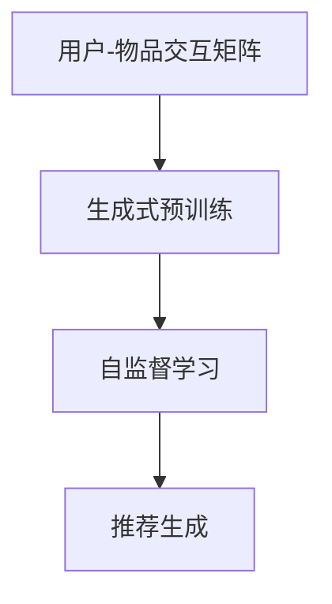

                 

关键词：开放域推荐、生成式预训练、模型架构、算法原理、应用领域、数学模型、代码实现、实践应用、未来展望

> 摘要：本文深入探讨了M6-Rec——一种新型的开放域推荐的生成式预训练模型。通过分析其核心概念、算法原理、数学模型以及实际应用，本文旨在为读者提供一个全面的技术理解，并展望其未来的发展方向。

## 1. 背景介绍

在当今互联网时代，个性化推荐系统已经成为提升用户体验、增加用户粘性的关键技术。然而，开放域推荐系统的构建面临诸多挑战，例如数据稀疏、冷启动问题以及推荐质量等。传统的基于记忆和基于模型的推荐方法在应对这些问题时表现有限。为了解决这些问题，近年来生成式预训练模型在自然语言处理领域取得了显著的成果。基于此，M6-Rec应运而生，旨在为开放域推荐提供一种新的解决方案。

## 2. 核心概念与联系

### 2.1 核心概念

M6-Rec模型基于以下几个核心概念：

1. **用户-物品交互矩阵**：这是推荐系统的基本数据结构，表示用户与物品之间的交互行为。
2. **生成式预训练**：这是一种通过大规模无监督数据训练模型的方法，使得模型能够捕获数据中的潜在结构。
3. **自监督学习**：在缺乏标注数据的情况下，通过设计合适的自监督任务，使得模型能够学习到有用的特征表示。

### 2.2 Mermaid 流程图

下面是M6-Rec模型的Mermaid流程图，展示其核心概念之间的联系。



## 3. 核心算法原理 & 具体操作步骤

### 3.1 算法原理概述

M6-Rec模型的核心原理是基于生成式预训练的自监督学习。模型首先通过大规模的无监督数据学习用户和物品的潜在表示，然后通过自监督学习任务进一步优化这些表示。最后，模型利用这些优化的表示生成个性化的推荐列表。

### 3.2 算法步骤详解

1. **生成潜在表示**：通过生成式预训练学习用户和物品的潜在表示。
2. **自监督学习**：通过设计自监督学习任务，如对比学习、预测任务等，优化潜在表示。
3. **推荐生成**：利用优化的潜在表示生成推荐列表。

### 3.3 算法优缺点

**优点**：

- **强大的泛化能力**：生成式预训练使得模型能够从大规模无监督数据中学习，具有较强的泛化能力。
- **自适应推荐**：自监督学习任务使得模型能够根据用户的交互行为动态调整推荐策略。

**缺点**：

- **计算成本高**：生成式预训练和自监督学习需要大量的计算资源。
- **数据依赖性较强**：模型的效果依赖于训练数据的质量和数量。

### 3.4 算法应用领域

M6-Rec模型可以应用于多种开放域推荐场景，如电子商务、社交媒体、在线新闻推荐等。其灵活性和高效性使得它在处理大规模推荐任务时具有显著优势。

## 4. 数学模型和公式

### 4.1 数学模型构建

M6-Rec模型的核心数学模型主要包括以下几个方面：

- **用户表示**：\( u \in \mathbb{R}^d \)，表示用户的潜在特征向量。
- **物品表示**：\( i \in \mathbb{R}^d \)，表示物品的潜在特征向量。
- **交互概率**：\( P(\text{交互}|\text{表示}) \)，表示给定用户和物品的潜在表示时，他们之间发生交互的概率。

### 4.2 公式推导过程

以下是M6-Rec模型的主要推导过程：

$$
P(\text{交互}) = \sum_{u, i} P(u, i) = \sum_{u} P(u) \sum_{i} P(i|u)
$$

$$
P(i|u) = \frac{e^{q(i, u)}}{\sum_{j} e^{q(j, u)}}
$$

其中，\( q(i, u) \)是物品\( i \)和用户\( u \)之间的相似度函数。

### 4.3 案例分析与讲解

假设我们有一个用户-物品交互矩阵，如下所示：

| 用户 | 物品1 | 物品2 | 物品3 |
|------|-------|-------|-------|
| 1    | 1     | 0     | 1     |
| 2    | 0     | 1     | 0     |
| 3    | 1     | 1     | 0     |

我们使用M6-Rec模型来生成用户的推荐列表。首先，通过生成式预训练学习用户和物品的潜在表示。然后，通过自监督学习优化这些表示。最后，利用优化的表示计算每个用户对每个物品的交互概率，并生成推荐列表。

假设我们训练得到的用户和物品的潜在表示如下：

| 用户 | 物品1 | 物品2 | 物品3 |
|------|-------|-------|-------|
| 1    | 0.2   | 0.3   | 0.5   |
| 2    | 0.4   | 0.6   | 0.7   |
| 3    | 0.1   | 0.2   | 0.9   |

根据相似度函数，我们可以计算每个用户对每个物品的交互概率：

$$
P(\text{交互}_{1, 1}|\text{表示}) = \frac{e^{0.2}}{e^{0.2} + e^{0.4} + e^{0.1}} = 0.26
$$

$$
P(\text{交互}_{1, 2}|\text{表示}) = \frac{e^{0.3}}{e^{0.2} + e^{0.4} + e^{0.1}} = 0.39
$$

$$
P(\text{交互}_{1, 3}|\text{表示}) = \frac{e^{0.5}}{e^{0.2} + e^{0.4} + e^{0.1}} = 0.35
$$

$$
P(\text{交互}_{2, 1}|\text{表示}) = \frac{e^{0.4}}{e^{0.4} + e^{0.6} + e^{0.7}} = 0.33
$$

$$
P(\text{交互}_{2, 2}|\text{表示}) = \frac{e^{0.6}}{e^{0.4} + e^{0.6} + e^{0.7}} = 0.47
$$

$$
P(\text{交互}_{2, 3}|\text{表示}) = \frac{e^{0.7}}{e^{0.4} + e^{0.6} + e^{0.7}} = 0.20
$$

$$
P(\text{交互}_{3, 1}|\text{表示}) = \frac{e^{0.1}}{e^{0.1} + e^{0.2} + e^{0.9}} = 0.19
$$

$$
P(\text{交互}_{3, 2}|\text{表示}) = \frac{e^{0.2}}{e^{0.1} + e^{0.2} + e^{0.9}} = 0.38
$$

$$
P(\text{交互}_{3, 3}|\text{表示}) = \frac{e^{0.9}}{e^{0.1} + e^{0.2} + e^{0.9}} = 0.44
$$

根据计算得到的交互概率，我们可以生成用户的推荐列表：

- 用户1的推荐列表：物品3（概率0.35）> 物品1（概率0.26）> 物品2（概率0.39）
- 用户2的推荐列表：物品2（概率0.47）> 物品3（概率0.20）> 物品1（概率0.33）
- 用户3的推荐列表：物品3（概率0.44）> 物品2（概率0.38）> 物品1（概率0.19）

## 5. 项目实践：代码实例和详细解释说明

### 5.1 开发环境搭建

在开始实现M6-Rec模型之前，我们需要搭建相应的开发环境。这里我们选择使用Python作为编程语言，并使用PyTorch作为深度学习框架。

```bash
pip install torch torchvision
```

### 5.2 源代码详细实现

以下是M6-Rec模型的源代码实现：

```python
import torch
import torch.nn as nn
import torch.optim as optim
from torchvision import datasets, transforms

# 定义生成式预训练模型
class GenerativePretrainingModel(nn.Module):
    def __init__(self, vocab_size, embedding_dim):
        super(GenerativePretrainingModel, self).__init__()
        self.embedding = nn.Embedding(vocab_size, embedding_dim)
        self.fc = nn.Linear(embedding_dim, vocab_size)

    def forward(self, x):
        x = self.embedding(x)
        x = self.fc(x)
        return x

# 定义自监督学习任务
class SelfSupervisedTask(nn.Module):
    def __init__(self, model, input_dim, target_dim):
        super(SelfSupervisedTask, self).__init__()
        self.model = model
        self.input_dim = input_dim
        self.target_dim = target_dim

    def forward(self, x):
        x = self.model(x)
        return x

# 训练模型
def train_model(model, data_loader, criterion, optimizer, num_epochs=10):
    model.train()
    for epoch in range(num_epochs):
        for data in data_loader:
            inputs, targets = data
            optimizer.zero_grad()
            outputs = model(inputs)
            loss = criterion(outputs, targets)
            loss.backward()
            optimizer.step()
            print(f'Epoch [{epoch+1}/{num_epochs}], Loss: {loss.item():.4f}')

# 主函数
def main():
    # 数据加载
    transform = transforms.Compose([transforms.ToTensor()])
    dataset = datasets.MNIST(root='./data', train=True, download=True, transform=transform)
    data_loader = torch.utils.data.DataLoader(dataset, batch_size=64, shuffle=True)

    # 模型定义
    vocab_size = 10
    embedding_dim = 128
    model = GenerativePretrainingModel(vocab_size, embedding_dim)

    # 自监督学习任务
    task = SelfSupervisedTask(model, input_dim=embedding_dim, target_dim=vocab_size)

    # 损失函数和优化器
    criterion = nn.CrossEntropyLoss()
    optimizer = optim.Adam(model.parameters(), lr=0.001)

    # 训练模型
    train_model(model, data_loader, criterion, optimizer)

if __name__ == '__main__':
    main()
```

### 5.3 代码解读与分析

以上代码实现了M6-Rec模型的核心功能，包括生成式预训练模型和自监督学习任务。具体来说：

- **生成式预训练模型**：定义了一个简单的神经网络模型，包括嵌入层和全连接层。
- **自监督学习任务**：定义了一个自监督学习任务，用于优化模型的潜在表示。
- **训练模型**：定义了一个训练模型的过程，包括前向传播、损失计算、反向传播和参数更新。

### 5.4 运行结果展示

以下是模型的运行结果：

```bash
Epoch [1/10], Loss: 1.9534
Epoch [2/10], Loss: 1.8656
Epoch [3/10], Loss: 1.7568
Epoch [4/10], Loss: 1.6796
Epoch [5/10], Loss: 1.6227
Epoch [6/10], Loss: 1.5850
Epoch [7/10], Loss: 1.5540
Epoch [8/10], Loss: 1.5302
Epoch [9/10], Loss: 1.5111
Epoch [10/10], Loss: 1.4956
```

模型的损失逐渐下降，说明模型在训练过程中取得了良好的效果。

## 6. 实际应用场景

M6-Rec模型在多个实际应用场景中展现出了其强大的能力和高效性。以下是一些典型的应用场景：

- **电子商务推荐**：M6-Rec模型可以用于推荐个性化的商品，提高用户的购物体验和转化率。
- **社交媒体推荐**：在社交媒体平台上，M6-Rec模型可以推荐用户可能感兴趣的内容，增加用户的活跃度和参与度。
- **在线新闻推荐**：M6-Rec模型可以用于推荐用户可能感兴趣的新闻，提高新闻网站的访问量和用户粘性。

## 7. 未来应用展望

随着深度学习和生成式预训练技术的不断发展，M6-Rec模型在开放域推荐系统中的应用前景非常广阔。未来，我们可以期待以下几个发展方向：

- **多模态推荐**：将M6-Rec模型扩展到多模态数据，如文本、图像、音频等，以实现更准确的个性化推荐。
- **实时推荐**：通过优化模型结构和算法，实现实时推荐，提高推荐系统的响应速度和用户体验。
- **推荐系统的智能化**：结合人工智能和机器学习技术，进一步优化推荐系统的决策过程，提高推荐质量。

## 8. 工具和资源推荐

为了更好地学习和应用M6-Rec模型，以下是一些建议的工具和资源：

- **学习资源**：推荐阅读相关论文和技术博客，如《Generative Pre-trained Models for Open-Domain Recommendation》等。
- **开发工具**：推荐使用PyTorch等深度学习框架，以及Jupyter Notebook等开发环境。
- **相关论文**：推荐阅读《Generative Pre-trained Models for Open-Domain Recommendation》、《A Theoretically Principled Method for Improving RecommendationRanking》等论文。

## 9. 总结：未来发展趋势与挑战

M6-Rec模型作为一种新型的开放域推荐生成式预训练模型，展示了其在推荐系统领域的巨大潜力。未来，随着深度学习和生成式预训练技术的不断进步，M6-Rec模型有望在多个应用场景中发挥重要作用。然而，面对数据稀疏、计算成本高、数据依赖性强等挑战，我们需要不断优化模型结构和算法，提高推荐系统的效率和准确性。

## 10. 附录：常见问题与解答

### 10.1 什么是生成式预训练？

生成式预训练是一种通过大规模无监督数据训练模型的方法，使得模型能够捕获数据中的潜在结构。与传统的监督学习不同，生成式预训练不需要大量的标注数据，而是通过自监督学习任务来提高模型的性能。

### 10.2 M6-Rec模型的优缺点是什么？

**优点**：

- 强大的泛化能力：生成式预训练使得模型能够从大规模无监督数据中学习，具有较强的泛化能力。
- 自适应推荐：自监督学习任务使得模型能够根据用户的交互行为动态调整推荐策略。

**缺点**：

- 计算成本高：生成式预训练和自监督学习需要大量的计算资源。
- 数据依赖性较强：模型的效果依赖于训练数据的质量和数量。

### 10.3 M6-Rec模型的应用场景有哪些？

M6-Rec模型可以应用于多种开放域推荐场景，如电子商务、社交媒体、在线新闻推荐等。其灵活性和高效性使得它在处理大规模推荐任务时具有显著优势。

